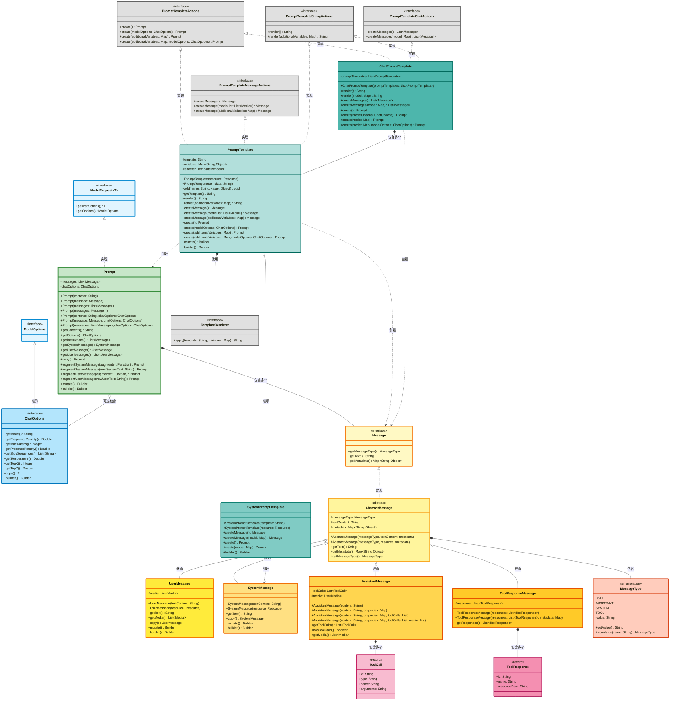
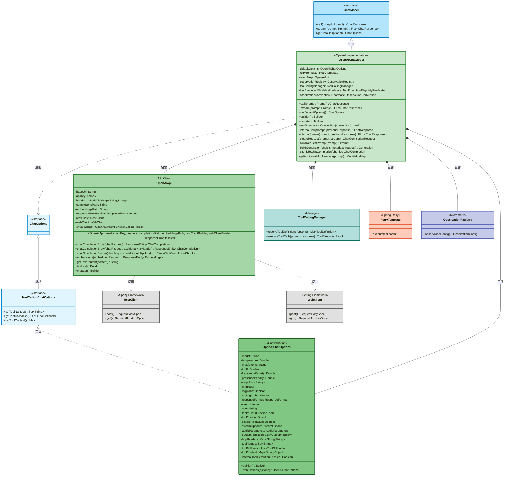
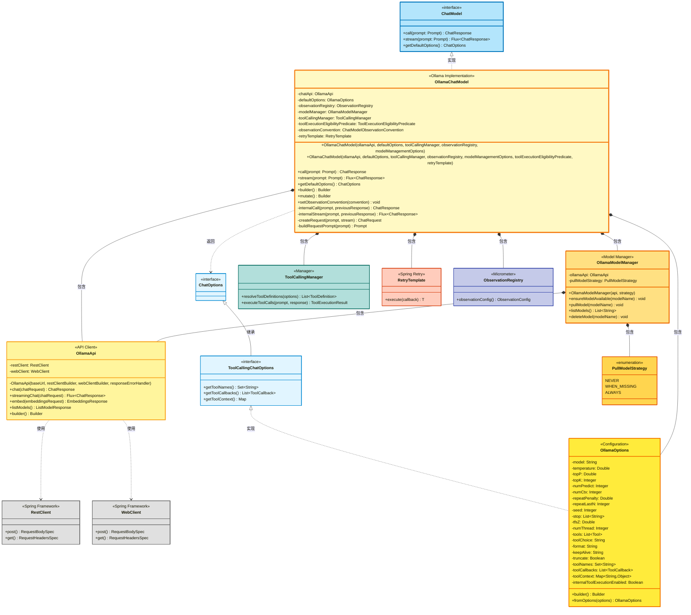
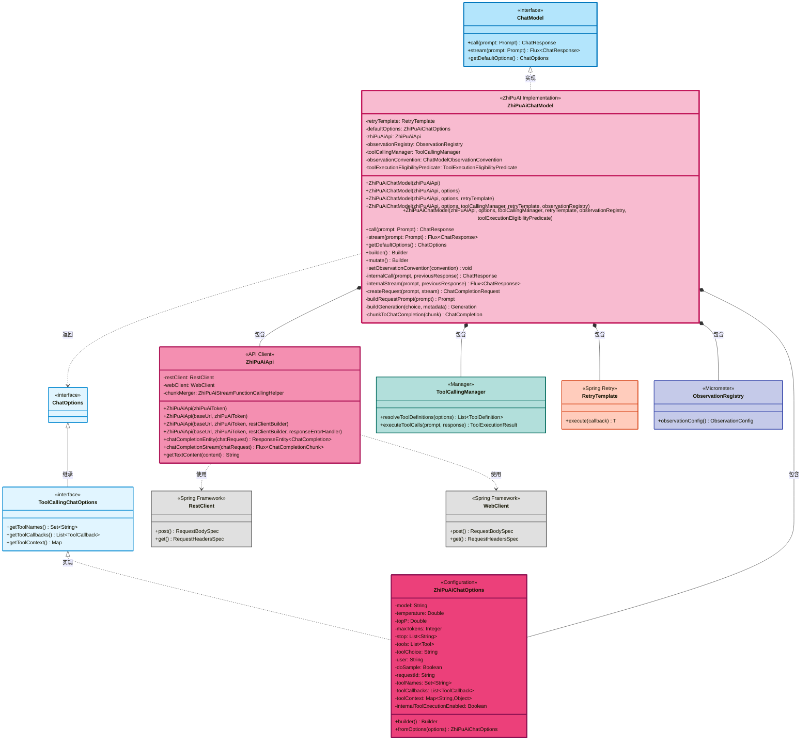
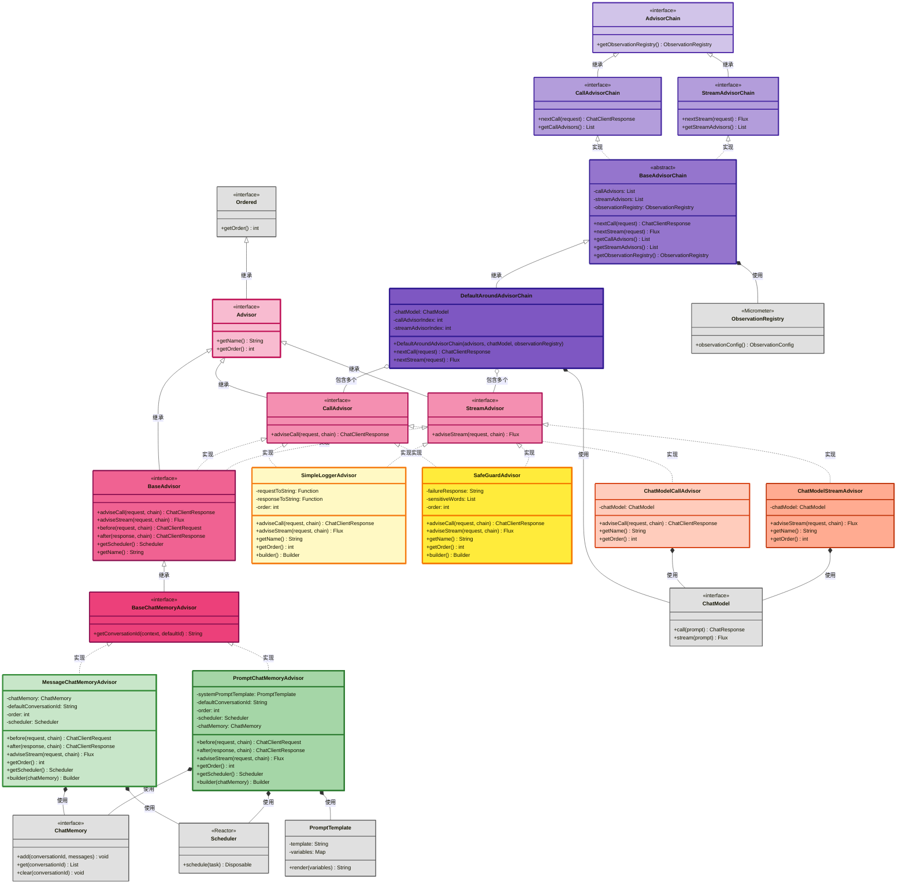
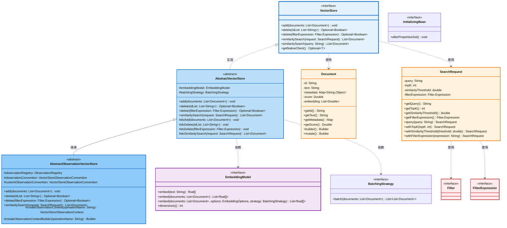
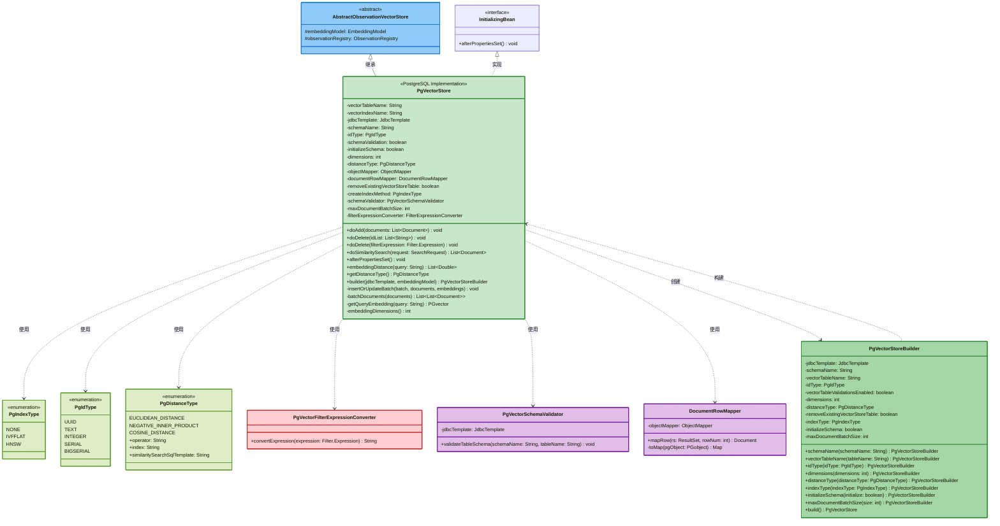
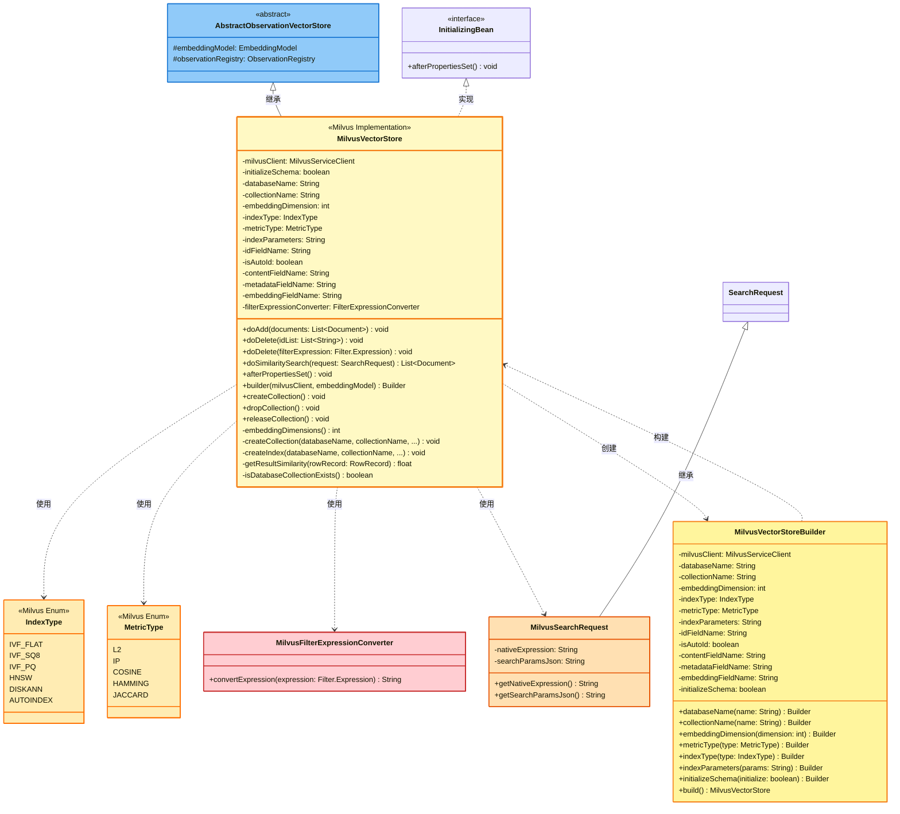
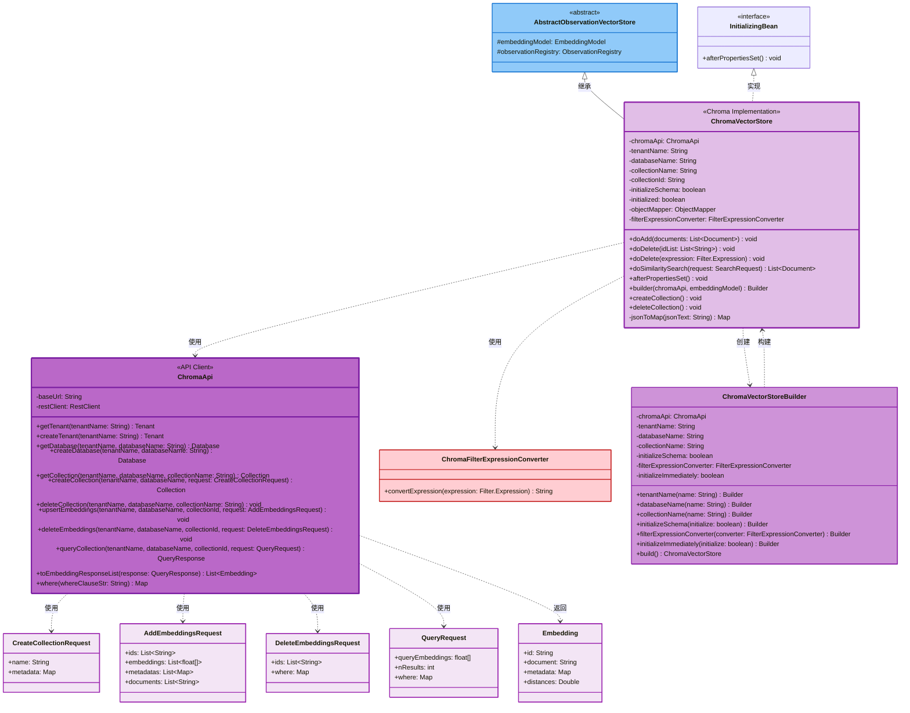
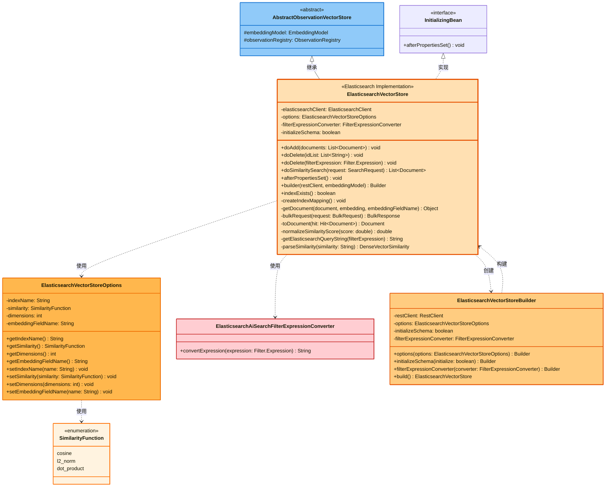

# 🚀 Spring AI

> 🗓️ Created: October 21, 2025 9:22 AM  
> 🏷️ Tags: Spring AI, Java, Ollama, 大模型


---

## 🧩 Spring AI Alibaba

Spring AI Alibaba（SAA） 是一款以 Spring AI 为基础，深度集成百炼平台，支持 ChatBot、工作流、多智能体应用开发模式的 AI 框架。


---

### 🌐 一、核心关系：SAA 是 Spring AI 的 增强实现层

- **Spring AI** 是由 VMware（现 Broadcom）主导的 **官方开源项目**，提供统一的 AI 编程抽象（如 `ChatClient`、`VectorStore` 等）。
- **Spring AI Alibaba** 是阿里云基于 Spring AI **官方版本进行的扩展和适配**，**不是独立框架**，而是 **Spring AI 的一个“实现提供者”（Provider） + 企业级增强包**。

> ✅ 简单说：**SAA = Spring AI API + 阿里云实现 + 国产模型支持 + 企业级能力**
> 

| **维度** | **Spring AI** | **Spring AI Alibaba (SAA)** |
| --- | --- | --- |
| **所属组织** | Spring 官方社区（Pivotal/VMware） | 阿里云主导的开源项目 |
| **基础依赖** | 原生 Spring 生态 | 基于 Spring AI 构建，深度集成阿里云 AI 生态（如百炼平台、DashScope、向量数据库等） |
| **发布节奏** | 2025年5月发布 1.0 GA 版 | 2024年9月开源，2025年6月发布 1.0 版本 |
| **关系** | 底层框架 | 上层扩展框架，兼容并增强 Spring AI 能力 |

### 🔗 二、版本依赖关系（关键！）

SAA 的每个版本都**严格依赖于某个特定版本的 Spring AI 官方库**，不能随意混用。

### 🔍 三、差异概览

Spring AI 定位 AI 应用开发底层框架，提供了 AI 开发需要的底层原子抽象，包括模型适配、工具定义、向量数据库存取等；Spring AI Alibaba 定位 AI 智能体开发框架，提供了基于图算法的智能体编程 **`Graph 框架`**，让开发者更容易开发工作流、multi-agent 应用。为方便理解，举个不完全正确的类比例子，如果说 Spring AI 是 LangChain 生态中的 Langchain 框架的话，则 Spring AI Alibaba 则是 Langchain 生态中的 Langraph 框架。

[Spring AI Alibaba 1.0 GA 正式发布，开启 Java 智能体开发新时代！_Blog](https://java2ai.com/en/blog/spring-ai-alibaba-10-ga-release/)

- 🕸️ Graph 多智能体与工作流编排：面向 Agent/Workflow 的编排能力，内置上下文记忆与路由，适合多智能体协作与复杂流程编排
- 🔌 MCP 生态与企业级路由：支持 MCP（Model Context Protocol）集成，含 Nacos MCP Registry 分布式注册与发现、自动 Router 路由，便于企业内外系统互通
- 🖼️ 原生多模态（Qwen-VL/视频帧）：除文本对话外，支持图像、视频等输入，结合示例中的视频帧提取工具，轻松构建多模态应用

[OpenDeepWiki - AI-Powered Knowledge Management Platform](https://opendeep.wiki/springaialibaba/spring-ai-alibaba-examples/multi-modal-models)

- 📈 可观测性与监控集成：与 OpenTelemetry 兼容，易接入 ARMS、Langfuse 等平台，便于模型调用、向量检索、工具调用等链路的指标与追踪。
- 🧩 官方 Playground 示例：提供“前端 UI + 后端实现”的端到端示例，覆盖聊天、多轮对话、多模态、工具调用、RAG 知识库等核心能力，便于快速上手与拓展。
- 🛠️ 函数/工具调用增强：提供与 Qwen 模型的函数调用（Function Calling）与流式输出的实践指南，便于将外部服务编排进模型推理流程。[集成指南（博客）](https://blog.csdn.net/2503_92145588/article/details/148789234)
- ⚙️ DashScope 专属选项与适配：提供 `spring.ai.dashscope.*` 命名空间与 `DashScopeChatModel/DashScopeChatOptions` 等类的深度适配，支持多模态开关、消息格式元数据等能力；与 Spring AI 抽象兼容且更贴近阿里云模型生态。[DashScope 指南](https://java2ai.com/en/docs/dev/models/dashScope/)

| **功能模块** | **Spring AI** | **Spring AI Alibaba** |
| --- | --- | --- |
| **模型支持** | OpenAI、Gemini、Bedrock、Ollama、HuggingFace 等 | 支持上述所有模型 + **阿里云通义千问（DashScope）深度集成** |
| **RAG 支持** | 提供通用 RAG 抽象（Advisors + Vector Store） | 内建对 **阿里云向量检索服务** 的适配，简化知识库构建 |
| **工具调用（Tool Calling）** | 支持标准工具定义与调用 | 支持且更易用，结合 MCP 实现分布式服务调用 |
| **MCP（Model Context Protocol）** | 支持客户端/服务器模式 | 支持并扩展：集成 **`Nacos MCP Registry**` 实现服务发现与负载均衡 |
| **可观测性** | 集成 Micrometer、Actuator | 集成 ARMS、Langfuse，提供 Tracing、Prompt 管理等企业级监控能力 |
| **多智能体（Multi-Agent）** | 无原生支持 | 提供 **`Graph 多智能体框架`**，类似 LangGraph 的 Java 实现，支持 `ReAct`、`Supervisor` 等模式 |
| **工作流编排** | 需自行实现 | 提供可视化工作流支持（Mermaid/PlantUML 导出）、嵌套分支、人类干预节点等 |
| **低代码开发** | 不支持 | 支持通过 Graph 快速搭建 ChatBot、Workflow、Agent 应用，降低开发门槛 |
| **部署与网关集成** | 标准 Spring Boot 部署 | 支持 Higress AI 网关代理，提升模型调用稳定性与灵活性 |

---

## 🧠 Spring AI API 1.0.1 介绍

### 🧩 组件关系


```mermaid
graph TB
    %% ========== 用户层 ==========
    User[👤 用户应用]
    
    %% ========== 客户端层 ==========
    ChatClient[ChatClient<br/>流式 API]
    
    %% ========== Advisor 层 ==========
    subgraph AdvisorLayer[Advisor 拦截层]
        SafeGuard[SafeGuardAdvisor<br/>安全防护]
        Logger[SimpleLoggerAdvisor<br/>日志记录]
        Memory[MessageChatMemoryAdvisor<br/>记忆管理]
        RAGAdvisor[QuestionAnswerAdvisor<br/>RAG 增强]
        Custom[自定义 Advisor]
    end
    
    %% ========== 核心层 ==========
    subgraph CoreLayer[核心抽象层]
        ChatModel[ChatModel<br/>聊天模型接口]
        EmbeddingModel[EmbeddingModel<br/>嵌入模型接口]
        Prompt[Prompt<br/>提示对象]
        ChatOptions[ChatOptions<br/>配置选项]
    end
    
    %% ========== RAG 层 ==========
    subgraph RAGLayer[RAG 检索增强层]
        VectorStore[VectorStore<br/>向量存储]
        DocumentReader[DocumentReader<br/>文档读取]
        DocumentTransformer[DocumentTransformer<br/>文档转换]
        Retriever[VectorStoreRetriever<br/>检索器]
    end
    
    %% ========== 工具层 ==========
    subgraph ToolLayer[工具和 Agent 层]
        ToolCallback[ToolCallback<br/>工具回调]
        FunctionTool[FunctionTool<br/>函数工具]
        MCPServer[MCP Server<br/>模型上下文协议]
        Agent[Agent<br/>智能代理]
    end
    
    %% ========== 实现层 ==========
    subgraph ImplLayer[模型实现层]
        OpenAI[OpenAiChatModel<br/>GPT-4/GPT-4o]
        Ollama[OllamaChatModel<br/>本地模型]
        ZhiPuAI[ZhiPuAiChatModel<br/>智谱AI]
        Anthropic[AnthropicChatModel<br/>Claude]
    end
    
    %% ========== 向量存储实现 ==========
    subgraph VectorStoreImpl[向量存储实现]
        Chroma[ChromaVectorStore]
        Pinecone[PineconeVectorStore]
        Milvus[MilvusVectorStore]
        PgVector[PgVectorStore]
    end
    
    %% ========== API 层 ==========
    subgraph ApiLayer[API 客户端层]
        OpenAiApi[OpenAiApi<br/>HTTP Client]
        OllamaApi[OllamaApi<br/>HTTP Client]
        ZhiPuAiApi[ZhiPuAiApi<br/>HTTP Client]
        AnthropicApi[AnthropicApi<br/>HTTP Client]
    end
    
    %% ========== 辅助组件 ==========
    subgraph HelperLayer[辅助组件层]
        ChatMemory[ChatMemory<br/>记忆存储]
        ToolManager[ToolCallingManager<br/>工具管理]
        Observation[ObservationRegistry<br/>可观测性]
        Retry[RetryTemplate<br/>重试机制]
    end
    
    %% ========== 外部服务 ==========
    subgraph ExternalLayer[外部服务层]
        OpenAIService[OpenAI API]
        OllamaService[Ollama 本地服务]
        ZhiPuService[智谱 AI API]
        AnthropicService[Anthropic API]
        VectorDB[向量数据库]
        MCPServices[MCP 服务]
    end
    
    %% ========== 关系连接 ==========
    User --> ChatClient
    User -.-> ChatModel
    User -.-> Agent
    
    ChatClient --> AdvisorLayer
    ChatClient --> Prompt
    ChatClient --> ChatOptions
    ChatClient --> ToolCallback
    
    AdvisorLayer --> ChatModel
    Memory --> ChatMemory
    RAGAdvisor --> Retriever
    
    Agent --> ChatModel
    Agent --> ToolManager
    Agent --> Retriever
    
    ChatModel --> ImplLayer
    Prompt --> ImplLayer
    ChatOptions --> ImplLayer
    
    ImplLayer --> ToolManager
    ImplLayer --> Observation
    ImplLayer --> Retry
    
    ToolManager --> ToolCallback
    ToolManager --> FunctionTool
    ToolManager --> MCPServer
    
    Retriever --> VectorStore
    VectorStore --> EmbeddingModel
    VectorStore --> VectorStoreImpl
    
    DocumentReader --> DocumentTransformer
    DocumentTransformer --> VectorStore
    
    VectorStoreImpl --> VectorDB
    MCPServer --> MCPServices
    
    OpenAI --> OpenAiApi
    Ollama --> OllamaApi
    ZhiPuAI --> ZhiPuAiApi
    Anthropic --> AnthropicApi
    
    OpenAiApi --> OpenAIService
    OllamaApi --> OllamaService
    ZhiPuAiApi --> ZhiPuService
    AnthropicApi --> AnthropicService
    
    %% ========== 样式 ==========
    classDef userStyle fill:#E3F2FD,stroke:#1976D2,stroke-width:3px
    classDef clientStyle fill:#B3E5FC,stroke:#0277BD,stroke-width:3px
    classDef advisorStyle fill:#F8BBD0,stroke:#C2185B,stroke-width:2px
    classDef coreStyle fill:#C8E6C9,stroke:#388E3C,stroke-width:3px
    classDef ragStyle fill:#B2DFDB,stroke:#00695C,stroke-width:2px
    classDef toolStyle fill:#FFE082,stroke:#F57C00,stroke-width:2px
    classDef implStyle fill:#FFF9C4,stroke:#F57F17,stroke-width:2px
    classDef vectorStyle fill:#80DEEA,stroke:#00838F,stroke-width:2px
    classDef apiStyle fill:#D1C4E9,stroke:#512DA8,stroke-width:2px
    classDef helperStyle fill:#FFCCBC,stroke:#D84315,stroke-width:2px
    classDef externalStyle fill:#E0E0E0,stroke:#616161,stroke-width:2px
    
    class User userStyle
    class ChatClient clientStyle
    class SafeGuard,Logger,Memory,RAGAdvisor,Custom advisorStyle
    class ChatModel,EmbeddingModel,Prompt,ChatOptions coreStyle
    class VectorStore,DocumentReader,DocumentTransformer,Retriever ragStyle
    class ToolCallback,FunctionTool,MCPServer,Agent toolStyle
    class OpenAI,Ollama,ZhiPuAI,Anthropic implStyle
    class Chroma,Pinecone,Milvus,PgVector vectorStyle
    class OpenAiApi,OllamaApi,ZhiPuAiApi,AnthropicApi apiStyle
    class ChatMemory,ToolManager,Observation,Retry helperStyle
    class OpenAIService,OllamaService,ZhiPuService,AnthropicService,VectorDB,MCPServices externalStyle
```

## ✨ Prompt 体系详解

在 **Spring AI** 框架中，`Prompt` 是与大语言模型（LLM）交互的核心抽象。它统一封装系统指令、用户消息、上下文、工具调用与输出格式约束，并作为 `ChatModel.call(Prompt)` 的标准化输入。

### ✅ `Prompt` 是什么？

`Prompt` 是 Spring AI 中的一个**不可变对象**（immutable object），代表一次完整的 LLM 请求输入。它不仅包含用户的问题，还可以包含：

- **系统消息（System Message）**：设定 AI 的角色、行为规范（如“你是一个专业的客服”）
- **用户消息（User Message）**：用户提出的问题或指令
- **助手消息（Assistant Message）**：多轮对话中的历史回复（用于上下文）
- **工具（Tools）**：可被 LLM 调用的函数定义（用于 Tool Calling）
- **输出格式指令**：如“请以 JSON 格式回答”
- **模型参数**：如 temperature、maxTokens（部分通过 `PromptOptions` 设置）

> 💡 简单说：Prompt = 你告诉 AI “该怎么思考 + 回答什么” 的完整指令集。
> 

### ✅ `Prompt` 的作用

| **作用** | **说明** |
| --- | --- |
| 🧠 **提供上下文** | 让 LLM 理解任务背景（如“你是一个翻译官”） |
| 💬 **支持多轮对话** | 通过历史消息维持对话状态 |
| 🛠️ **启用高级功能** | 如 Tool Calling、结构化输出、RAG 检索结果注入 |
| 🔒 **控制输出行为** | 通过系统提示限制回答范围（如“只回答是或否”） |
| 📦 **统一输入接口** | 无论底层是 OpenAI、Ollama 还是 Gemini，都使用同一 `Prompt` 对象 |


```mermaid
classDiagram
    %% ========== 核心接口 ==========
    class ModelRequest~T~ {
        <<interface>>
        +getInstructions() T
        +getOptions() ModelOptions
    }
    
    class ModelOptions {
        <<interface>>
    }
    
    class ChatOptions {
        <<interface>>
        +getModel() String
        +getFrequencyPenalty() Double
        +getMaxTokens() Integer
        +getPresencePenalty() Double
        +getStopSequences() List~String~
        +getTemperature() Double
        +getTopK() Integer
        +getTopP() Double
        +copy() T
        +builder() Builder
    }
    
    %% ========== Prompt 类 ==========
    class Prompt {
        -messages: List~Message~
        -chatOptions: ChatOptions
        
        +Prompt(contents: String)
        +Prompt(message: Message)
        +Prompt(messages: List~Message~)
        +Prompt(messages: Message...)
        +Prompt(contents: String, chatOptions: ChatOptions)
        +Prompt(message: Message, chatOptions: ChatOptions)
        +Prompt(messages: List~Message~, chatOptions: ChatOptions)
        
        +getContents() String
        +getOptions() ChatOptions
        +getInstructions() List~Message~
        +getSystemMessage() SystemMessage
        +getUserMessage() UserMessage
        +getUserMessages() List~UserMessage~
        +copy() Prompt
        +augmentSystemMessage(augmenter: Function) Prompt
        +augmentSystemMessage(newSystemText: String) Prompt
        +augmentUserMessage(augmenter: Function) Prompt
        +augmentUserMessage(newUserText: String) Prompt
        +mutate() Builder
        +builder() Builder
    }
    
    %% ========== Message 接口和实现 ==========
    class Message {
        <<interface>>
        +getMessageType() MessageType
        +getText() String
        +getMetadata() Map~String,Object~
    }
    
    class AbstractMessage {
        <<abstract>>
        #messageType: MessageType
        #textContent: String
        #metadata: Map~String,Object~
        
        #AbstractMessage(messageType, textContent, metadata)
        #AbstractMessage(messageType, resource, metadata)
        +getText() String
        +getMetadata() Map~String,Object~
        +getMessageType() MessageType
    }
    
    class UserMessage {
        #media: List~Media~
        
        +UserMessage(textContent: String)
        +UserMessage(resource: Resource)
        +getText() String
        +getMedia() List~Media~
        +copy() UserMessage
        +mutate() Builder
        +builder() Builder
    }
    
    class SystemMessage {
        +SystemMessage(textContent: String)
        +SystemMessage(resource: Resource)
        +getText() String
        +copy() SystemMessage
        +mutate() Builder
        +builder() Builder
    }
    
    class AssistantMessage {
        -toolCalls: List~ToolCall~
        #media: List~Media~
        
        +AssistantMessage(content: String)
        +AssistantMessage(content: String, properties: Map)
        +AssistantMessage(content: String, properties: Map, toolCalls: List)
        +AssistantMessage(content: String, properties: Map, toolCalls: List, media: List)
        +getToolCalls() List~ToolCall~
        +hasToolCalls() boolean
        +getMedia() List~Media~
    }
    
    class ToolResponseMessage {
        #responses: List~ToolResponse~
        
        +ToolResponseMessage(responses: List~ToolResponse~)
        +ToolResponseMessage(responses: List~ToolResponse~, metadata: Map)
        +getResponses() List~ToolResponse~
    }
    
    %% ========== MessageType 枚举 ==========
    class MessageType {
        <<enumeration>>
        USER
        ASSISTANT
        SYSTEM
        TOOL
        
        -value: String
        +getValue() String
        +fromValue(value: String) MessageType
    }
    
    %% ========== PromptTemplate 类 ==========
    class PromptTemplate {
        -template: String
        -variables: Map~String,Object~
        -renderer: TemplateRenderer
        
        +PromptTemplate(resource: Resource)
        +PromptTemplate(template: String)
        +add(name: String, value: Object) void
        +getTemplate() String
        +render() String
        +render(additionalVariables: Map) String
        +createMessage() Message
        +createMessage(mediaList: List~Media~) Message
        +createMessage(additionalVariables: Map) Message
        +create() Prompt
        +create(modelOptions: ChatOptions) Prompt
        +create(additionalVariables: Map) Prompt
        +create(additionalVariables: Map, modelOptions: ChatOptions) Prompt
        +mutate() Builder
        +builder() Builder
    }
    
    class SystemPromptTemplate {
        +SystemPromptTemplate(template: String)
        +SystemPromptTemplate(resource: Resource)
        +createMessage() Message
        +createMessage(model: Map) Message
        +create() Prompt
        +create(model: Map) Prompt
        +builder() Builder
    }
    
    class ChatPromptTemplate {
        -promptTemplates: List~PromptTemplate~
        
        +ChatPromptTemplate(promptTemplates: List~PromptTemplate~)
        +render() String
        +render(model: Map) String
        +createMessages() List~Message~
        +createMessages(model: Map) List~Message~
        +create() Prompt
        +create(modelOptions: ChatOptions) Prompt
        +create(model: Map) Prompt
        +create(model: Map, modelOptions: ChatOptions) Prompt
    }
    
    %% ========== 辅助接口 ==========
    class PromptTemplateActions {
        <<interface>>
        +create() Prompt
        +create(modelOptions: ChatOptions) Prompt
        +create(additionalVariables: Map) Prompt
        +create(additionalVariables: Map, modelOptions: ChatOptions) Prompt
    }
    
    class PromptTemplateMessageActions {
        <<interface>>
        +createMessage() Message
        +createMessage(mediaList: List~Media~) Message
        +createMessage(additionalVariables: Map) Message
    }
    
    class PromptTemplateChatActions {
        <<interface>>
        +createMessages() List~Message~
        +createMessages(model: Map) List~Message~
    }
    
    class PromptTemplateStringActions {
        <<interface>>
        +render() String
        +render(additionalVariables: Map) String
    }
    
    class TemplateRenderer {
        <<interface>>
        +apply(template: String, variables: Map) String
    }
    
    %% ========== 内部类 ==========
    class ToolCall {
        <<record>>
        +id: String
        +type: String
        +name: String
        +arguments: String
    }
    
    class ToolResponse {
        <<record>>
        +id: String
        +name: String
        +responseData: String
    }
    
    %% ========== 关系 ==========
    ModelOptions <|-- ChatOptions : 继承
    
    ModelRequest <|.. Prompt : 实现
    Prompt *-- Message : 包含多个
    Prompt o-- ChatOptions : 可选包含
    
    Message <|.. AbstractMessage : 实现
    AbstractMessage <|-- UserMessage : 继承
    AbstractMessage <|-- SystemMessage : 继承
    AbstractMessage <|-- AssistantMessage : 继承
    AbstractMessage <|-- ToolResponseMessage : 继承
    
    AbstractMessage *-- MessageType : 包含
    
    AssistantMessage *-- ToolCall : 包含多个
    ToolResponseMessage *-- ToolResponse : 包含多个
    
    PromptTemplateActions <|.. PromptTemplate : 实现
    PromptTemplateMessageActions <|.. PromptTemplate : 实现
    PromptTemplateStringActions <|.. PromptTemplate : 实现
    PromptTemplate <|-- SystemPromptTemplate : 继承
    
    PromptTemplateActions <|.. ChatPromptTemplate : 实现
    PromptTemplateChatActions <|.. ChatPromptTemplate : 实现
    PromptTemplateStringActions <|.. ChatPromptTemplate : 实现
    ChatPromptTemplate *-- PromptTemplate : 包含多个
    
    PromptTemplate ..> Message : 创建
    PromptTemplate ..> Prompt : 创建
    PromptTemplate *-- TemplateRenderer : 使用
    
    SystemPromptTemplate ..> SystemMessage : 创建
    ChatPromptTemplate ..> Message : 创建
    
    %% ========== 样式 ==========
    style ModelRequest fill:#e1f5ff,stroke:#0288d1,stroke-width:3px
    style ModelOptions fill:#e1f5ff,stroke:#0288d1,stroke-width:2px
    style ChatOptions fill:#b3e5fc,stroke:#0277bd,stroke-width:3px
    
    style Prompt fill:#c8e6c9,stroke:#388e3c,stroke-width:4px
    
    style Message fill:#fff9c4,stroke:#f57f17,stroke-width:3px
    style AbstractMessage fill:#fff59d,stroke:#f9a825,stroke-width:3px
    style UserMessage fill:#ffeb3b,stroke:#f57c00,stroke-width:3px
    style SystemMessage fill:#ffe082,stroke:#ef6c00,stroke-width:3px
    style AssistantMessage fill:#ffd54f,stroke:#e65100,stroke-width:3px
    style ToolResponseMessage fill:#ffca28,stroke:#e65100,stroke-width:3px
    
    style MessageType fill:#ffccbc,stroke:#d84315,stroke-width:2px
    
    style PromptTemplate fill:#b2dfdb,stroke:#00695c,stroke-width:4px
    style SystemPromptTemplate fill:#80cbc4,stroke:#00796b,stroke-width:3px
    style ChatPromptTemplate fill:#4db6ac,stroke:#00695c,stroke-width:3px
    
    style PromptTemplateActions fill:#e0e0e0,stroke:#616161,stroke-width:2px
    style PromptTemplateMessageActions fill:#e0e0e0,stroke:#616161,stroke-width:2px
    style PromptTemplateChatActions fill:#e0e0e0,stroke:#616161,stroke-width:2px
    style PromptTemplateStringActions fill:#e0e0e0,stroke:#616161,stroke-width:2px
    style TemplateRenderer fill:#e0e0e0,stroke:#616161,stroke-width:2px
    
    style ToolCall fill:#f8bbd0,stroke:#c2185b,stroke-width:2px
    style ToolResponse fill:#f48fb1,stroke:#ad1457,stroke-width:2px
```

---

### 📝 核心组件说明

**1. Prompt 类**

- **作用**：表示发送给 AI 模型的提示，包含一个或多个消息和可选的配置选项
- **核心字段**：
    - `messages`: 消息列表
    - `chatOptions`: 聊天配置选项
- **主要方法**：
    - 多种构造函数支持不同的初始化方式
    - `augmentSystemMessage()` / `augmentUserMessage()`: 增强消息内容
    - `copy()`: 创建副本
    - Builder 模式支持

**2. Message 体系**

- **Message**: 消息接口，所有消息类型的基础
- **AbstractMessage**: 抽象基类，提供通用实现
- **具体消息类型**：
    - **UserMessage**: 用户消息，可包含文本和媒体内容
    - **SystemMessage**: 系统消息，用于设置对话的高级指令
    - **AssistantMessage**: 助手消息，表示 AI 的响应，可包含工具调用
    - **ToolResponseMessage**: 工具响应消息，包含工具执行结果

**3. PromptTemplate 体系**

- **PromptTemplate**: 提示模板，支持变量替换
    - 使用 `TemplateRenderer` 进行模板渲染
    - 可以创建 Message 或 Prompt
- **SystemPromptTemplate**: 系统消息模板，创建 SystemMessage
- **ChatPromptTemplate**: 聊天模板，组合多个 PromptTemplate

**4. MessageType 枚举**

- **USER**: 用户消息
- **ASSISTANT**: 助手消息
- **SYSTEM**: 系统消息
- **TOOL**: 工具消息

### 🔧 基础用法

#### 🟢 构建基础 Prompt

```java
import org.springframework.ai.chat.prompt.Prompt;

Prompt prompt = new Prompt("你好，请简介一下Spring AI。");
```

> 💡 会自动创建一个 **`UserMessage`**（具体可见源码）。
- 适合简单场景，如单轮问答。

---

#### 🟢 多角色提示（System + User + Tool）

##### 🧰 ToolResponseMessage

此类在模型调用外部工具（Tool）时出现，表示工具的返回结果。当大模型执行 Tool 调用（例如计算器、天气API、搜索引擎）时，Spring AI 框架会自动生成 ToolResponseMessage 加入 Prompt 中，使模型能基于工具结果继续推理。

```java
        // 1. 系统消息和用户消息
        SystemMessage systemMessage = new SystemMessage("You are a helpful assistant.");
        UserMessage userMessage = new UserMessage("Calculate 2 + 2 and translate 'Hello' to Chinese.");

        // 2. 创建工具响应
        ToolResponseMessage.ToolResponse calcResponse =
                new ToolResponseMessage.ToolResponse("1", "Calculator", "2 + 2 = 4");
        ToolResponseMessage.ToolResponse translateResponse =
                new ToolResponseMessage.ToolResponse("2", "Translator", "Hello -> 你好");

        // 3. 创建 ToolResponseMessage
        ToolResponseMessage toolMessage = new ToolResponseMessage(
                List.of(calcResponse, translateResponse),
                Map.of("source", "external-api")
        );

        // 4. 创建 Prompt
        Prompt prompt = new Prompt(systemMessage, userMessage, toolMessage);
```

> ✅ 用于设定模型的行为 + 提问内容。

---

#### 🟢 模板提示（PromptTemplate）

```java
import org.springframework.ai.chat.prompt.PromptTemplate;

PromptTemplate template = PromptTemplate.builder()
    .template("请以{tone}的语气向{audience}解释{topic}。")
    .build();

Map<String,Object> params = Map.of(
    "tone", "幽默",
    "audience", "10岁孩子",
    "topic", "量子力学"
);

Prompt prompt = template.create(params);
```

- 适用于动态生成 Prompt 的场景（例如参数化输入）。
- 内部使用 `StTemplateRenderer` 渲染 `{变量}`。

---

#### 🟢 与 ChatClient 一起使用

```java
import org.springframework.ai.chat.ChatClient;

String response = chatClient.prompt()
    .system("你是一个专业的历史讲解员。")
    .user("请用三句话讲完二战的起因。")
    .call()
    .content();
```

- 采用 Fluent API 写法，更直观易读。
- 等价于先构造 `Prompt` 对象再调用模型。

---

## 🗣️ ChatModel 体系详解

在 **Spring AI** 框架中，`ChatModel` 是一个**核心接口**，用于**与大语言模型（LLM）进行对话式交互**。它是 Spring AI 对“聊天型 AI 模型”能力的统一抽象，屏蔽了底层不同 AI 提供商（如 OpenAI、阿里云、Ollama 等）的实现差异，让开发者可以用一致的 API 编写可移植的 AI 应用。

### **OpenAI 完整类图**


```mermaid
classDiagram
    %% ========== 核心接口 ==========
    class ChatModel {
        <<interface>>
        +call(prompt: Prompt) ChatResponse
        +stream(prompt: Prompt) Flux~ChatResponse~
        +getDefaultOptions() ChatOptions
    }
    
    class ChatOptions {
        <<interface>>
    }
    
    class ToolCallingChatOptions {
        <<interface>>
        +getToolNames() Set~String~
        +getToolCallbacks() List~ToolCallback~
        +getToolContext() Map
    }
    
    %% ========== OpenAI 实现类 ==========
    class OpenAiChatModel {
        <<OpenAI Implementation>>
        -defaultOptions: OpenAiChatOptions
        -retryTemplate: RetryTemplate
        -openAiApi: OpenAiApi
        -observationRegistry: ObservationRegistry
        -toolCallingManager: ToolCallingManager
        -toolExecutionEligibilityPredicate: ToolExecutionEligibilityPredicate
        -observationConvention: ChatModelObservationConvention
        
        +call(prompt: Prompt) ChatResponse
        +stream(prompt: Prompt) Flux~ChatResponse~
        +getDefaultOptions() ChatOptions
        +builder() Builder
        +mutate() Builder
        +setObservationConvention(convention) void
        
        -internalCall(prompt, previousResponse) ChatResponse
        -internalStream(prompt, previousResponse) Flux~ChatResponse~
        -createRequest(prompt, stream) ChatCompletionRequest
        -buildRequestPrompt(prompt) Prompt
        -buildGeneration(choice, metadata, request) Generation
        -chunkToChatCompletion(chunk) ChatCompletion
        -getAdditionalHttpHeaders(prompt) MultiValueMap
    }
    
    %% ========== OpenAI API 客户端 ==========
    class OpenAiApi {
        <<API Client>>
        -baseUrl: String
        -apiKey: ApiKey
        -headers: MultiValueMap~String,String~
        -completionsPath: String
        -embeddingsPath: String
        -responseErrorHandler: ResponseErrorHandler
        -restClient: RestClient
        -webClient: WebClient
        -chunkMerger: OpenAiStreamFunctionCallingHelper
        
        +OpenAiApi(baseUrl, apiKey, headers, completionsPath, embeddingsPath, restClientBuilder, webClientBuilder, responseErrorHandler)
        +chatCompletionEntity(chatRequest) ResponseEntity~ChatCompletion~
        +chatCompletionEntity(chatRequest, additionalHttpHeader) ResponseEntity~ChatCompletion~
        +chatCompletionStream(chatRequest, additionalHttpHeader) Flux~ChatCompletionChunk~
        +embeddings(embeddingRequest) ResponseEntity~Embeddings~
        +getTextContent(content) String
        +builder() Builder
        +mutate() Builder
    }
    
    %% ========== OpenAI 配置选项 ==========
    class OpenAiChatOptions {
        <<Configuration>>
        -model: String
        -temperature: Double
        -maxTokens: Integer
        -topP: Double
        -frequencyPenalty: Double
        -presencePenalty: Double
        -stop: List~String~
        -n: Integer
        -logprobs: Boolean
        -topLogprobs: Integer
        -responseFormat: ResponseFormat
        -seed: Integer
        -user: String
        -tools: List~FunctionTool~
        -toolChoice: Object
        -parallelToolCalls: Boolean
        -streamOptions: StreamOptions
        -audioParameters: AudioParameters
        -outputModalities: List~OutputModality~
        -httpHeaders: Map~String,String~
        -toolNames: Set~String~
        -toolCallbacks: List~ToolCallback~
        -toolContext: Map~String,Object~
        -internalToolExecutionEnabled: Boolean
        
        +builder() Builder
        +fromOptions(options) OpenAiChatOptions
    }
    
    %% ========== 辅助类 ==========
    class RestClient {
        <<Spring Framework>>
        +post() RequestBodySpec
        +get() RequestHeadersSpec
    }
    
    class WebClient {
        <<Spring Framework>>
        +post() RequestBodySpec
        +get() RequestHeadersSpec
    }
    
    class ToolCallingManager {
        <<Manager>>
        +resolveToolDefinitions(options) List~ToolDefinition~
        +executeToolCalls(prompt, response) ToolExecutionResult
    }
    
    class RetryTemplate {
        <<Spring Retry>>
        +execute(callback) T
    }
    
    class ObservationRegistry {
        <<Micrometer>>
        +observationConfig() ObservationConfig
    }
    
    %% ========== 关系 ==========
    ChatOptions <|-- ToolCallingChatOptions : 继承
    ToolCallingChatOptions <|.. OpenAiChatOptions : 实现
    
    ChatModel <|.. OpenAiChatModel : 实现
    
    OpenAiChatModel *-- OpenAiApi : 包含
    OpenAiChatModel *-- OpenAiChatOptions : 包含
    OpenAiChatModel *-- ToolCallingManager : 包含
    OpenAiChatModel *-- RetryTemplate : 包含
    OpenAiChatModel *-- ObservationRegistry : 包含
    
    OpenAiApi ..> RestClient : 使用
    OpenAiApi ..> WebClient : 使用
    
    OpenAiChatModel ..> ChatOptions : 返回
    
    %% ========== 样式 ==========
    style ChatModel fill:#b3e5fc,stroke:#0277bd,stroke-width:3px
    style ChatOptions fill:#e1f5ff,stroke:#0288d1,stroke-width:2px
    style ToolCallingChatOptions fill:#e1f5ff,stroke:#0288d1,stroke-width:2px
    
    style OpenAiChatModel fill:#c8e6c9,stroke:#388e3c,stroke-width:4px
    style OpenAiApi fill:#a5d6a7,stroke:#2e7d32,stroke-width:3px
    style OpenAiChatOptions fill:#81c784,stroke:#1b5e20,stroke-width:3px
    
    style RestClient fill:#e0e0e0,stroke:#616161,stroke-width:2px
    style WebClient fill:#e0e0e0,stroke:#616161,stroke-width:2px
    style ToolCallingManager fill:#b2dfdb,stroke:#00695c,stroke-width:2px
    style RetryTemplate fill:#ffccbc,stroke:#d84315,stroke-width:2px
    style ObservationRegistry fill:#c5cae9,stroke:#3949ab,stroke-width:2px
```

### **Ollama 完整类图**


```mermaid
classDiagram
    %% ========== 核心接口 ==========
    class ChatModel {
        <<interface>>
        +call(prompt: Prompt) ChatResponse
        +stream(prompt: Prompt) Flux~ChatResponse~
        +getDefaultOptions() ChatOptions
    }
    
    class ChatOptions {
        <<interface>>
    }
    
    class ToolCallingChatOptions {
        <<interface>>
        +getToolNames() Set~String~
        +getToolCallbacks() List~ToolCallback~
        +getToolContext() Map
    }
    
    %% ========== Ollama 实现类 ==========
    class OllamaChatModel {
        <<Ollama Implementation>>
        -chatApi: OllamaApi
        -defaultOptions: OllamaOptions
        -observationRegistry: ObservationRegistry
        -modelManager: OllamaModelManager
        -toolCallingManager: ToolCallingManager
        -toolExecutionEligibilityPredicate: ToolExecutionEligibilityPredicate
        -observationConvention: ChatModelObservationConvention
        -retryTemplate: RetryTemplate
        
        +OllamaChatModel(ollamaApi, defaultOptions, toolCallingManager, observationRegistry, modelManagementOptions)
        +OllamaChatModel(ollamaApi, defaultOptions, toolCallingManager, observationRegistry, modelManagementOptions, toolExecutionEligibilityPredicate, retryTemplate)
        +call(prompt: Prompt) ChatResponse
        +stream(prompt: Prompt) Flux~ChatResponse~
        +getDefaultOptions() ChatOptions
        +builder() Builder
        +mutate() Builder
        +setObservationConvention(convention) void
        
        -internalCall(prompt, previousResponse) ChatResponse
        -internalStream(prompt, previousResponse) Flux~ChatResponse~
        -createRequest(prompt, stream) ChatRequest
        -buildRequestPrompt(prompt) Prompt
    }
    
    %% ========== Ollama API 客户端 ==========
    class OllamaApi {
        <<API Client>>
        -restClient: RestClient
        -webClient: WebClient
        
        -OllamaApi(baseUrl, restClientBuilder, webClientBuilder, responseErrorHandler)
        +chat(chatRequest) ChatResponse
        +streamingChat(chatRequest) Flux~ChatResponse~
        +embed(embeddingsRequest) EmbeddingsResponse
        +listModels() ListModelResponse
        +builder() Builder
    }
    
    %% ========== Ollama 配置选项 ==========
    class OllamaOptions {
        <<Configuration>>
        -model: String
        -temperature: Double
        -topP: Double
        -topK: Integer
        -numPredict: Integer
        -numCtx: Integer
        -repeatPenalty: Double
        -repeatLastN: Integer
        -seed: Integer
        -stop: List~String~
        -tfsZ: Double
        -numThread: Integer
        -tools: List~Tool~
        -toolChoice: String
        -format: String
        -keepAlive: String
        -truncate: Boolean
        -toolNames: Set~String~
        -toolCallbacks: List~ToolCallback~
        -toolContext: Map~String,Object~
        -internalToolExecutionEnabled: Boolean
        
        +builder() Builder
        +fromOptions(options) OllamaOptions
    }
    
    %% ========== Ollama 特有组件 ==========
    class OllamaModelManager {
        <<Model Manager>>
        -ollamaApi: OllamaApi
        -pullModelStrategy: PullModelStrategy
        
        +OllamaModelManager(api, strategy)
        +ensureModelAvailable(modelName) void
        +pullModel(modelName) void
        +listModels() List~String~
        +deleteModel(modelName) void
    }
    
    class PullModelStrategy {
        <<enumeration>>
        NEVER
        WHEN_MISSING
        ALWAYS
    }
    
    %% ========== 辅助类 ==========
    class RestClient {
        <<Spring Framework>>
        +post() RequestBodySpec
        +get() RequestHeadersSpec
    }
    
    class WebClient {
        <<Spring Framework>>
        +post() RequestBodySpec
        +get() RequestHeadersSpec
    }
    
    class ToolCallingManager {
        <<Manager>>
        +resolveToolDefinitions(options) List~ToolDefinition~
        +executeToolCalls(prompt, response) ToolExecutionResult
    }
    
    class RetryTemplate {
        <<Spring Retry>>
        +execute(callback) T
    }
    
    class ObservationRegistry {
        <<Micrometer>>
        +observationConfig() ObservationConfig
    }
    
    %% ========== 关系 ==========
    ChatOptions <|-- ToolCallingChatOptions : 继承
    ToolCallingChatOptions <|.. OllamaOptions : 实现
    
    ChatModel <|.. OllamaChatModel : 实现
    
    OllamaChatModel *-- OllamaApi : 包含
    OllamaChatModel *-- OllamaOptions : 包含
    OllamaChatModel *-- ToolCallingManager : 包含
    OllamaChatModel *-- RetryTemplate : 包含
    OllamaChatModel *-- ObservationRegistry : 包含
    OllamaChatModel *-- OllamaModelManager : 包含
    
    OllamaModelManager *-- OllamaApi : 包含
    OllamaModelManager *-- PullModelStrategy : 包含
    
    OllamaApi ..> RestClient : 使用
    OllamaApi ..> WebClient : 使用
    
    OllamaChatModel ..> ChatOptions : 返回
    
    %% ========== 样式 ==========
    style ChatModel fill:#b3e5fc,stroke:#0277bd,stroke-width:3px
    style ChatOptions fill:#e1f5ff,stroke:#0288d1,stroke-width:2px
    style ToolCallingChatOptions fill:#e1f5ff,stroke:#0288d1,stroke-width:2px
    
    style OllamaChatModel fill:#fff9c4,stroke:#f57f17,stroke-width:4px
    style OllamaApi fill:#fff59d,stroke:#f9a825,stroke-width:3px
    style OllamaOptions fill:#ffeb3b,stroke:#f57c00,stroke-width:3px
    style OllamaModelManager fill:#ffe082,stroke:#ef6c00,stroke-width:3px
    style PullModelStrategy fill:#ffd54f,stroke:#e65100,stroke-width:2px
    
    style RestClient fill:#e0e0e0,stroke:#616161,stroke-width:2px
    style WebClient fill:#e0e0e0,stroke:#616161,stroke-width:2px
    style ToolCallingManager fill:#b2dfdb,stroke:#00695c,stroke-width:2px
    style RetryTemplate fill:#ffccbc,stroke:#d84315,stroke-width:2px
    style ObservationRegistry fill:#c5cae9,stroke:#3949ab,stroke-width:2px
```

### **ZhiPuAI 完整类图**


```mermaid
classDiagram
    %% ========== 核心接口 ==========
    class ChatModel {
        <<interface>>
        +call(prompt: Prompt) ChatResponse
        +stream(prompt: Prompt) Flux~ChatResponse~
        +getDefaultOptions() ChatOptions
    }
    
    class ChatOptions {
        <<interface>>
    }
    
    class ToolCallingChatOptions {
        <<interface>>
        +getToolNames() Set~String~
        +getToolCallbacks() List~ToolCallback~
        +getToolContext() Map
    }
    
    %% ========== ZhiPuAI 实现类 ==========
    class ZhiPuAiChatModel {
        <<ZhiPuAI Implementation>>
        -retryTemplate: RetryTemplate
        -defaultOptions: ZhiPuAiChatOptions
        -zhiPuAiApi: ZhiPuAiApi
        -observationRegistry: ObservationRegistry
        -toolCallingManager: ToolCallingManager
        -observationConvention: ChatModelObservationConvention
        -toolExecutionEligibilityPredicate: ToolExecutionEligibilityPredicate
        
        +ZhiPuAiChatModel(zhiPuAiApi)
        +ZhiPuAiChatModel(zhiPuAiApi, options)
        +ZhiPuAiChatModel(zhiPuAiApi, options, retryTemplate)
        +ZhiPuAiChatModel(zhiPuAiApi, options, toolCallingManager, retryTemplate, observationRegistry)
        +ZhiPuAiChatModel(zhiPuAiApi, options, toolCallingManager, retryTemplate, observationRegistry, toolExecutionEligibilityPredicate)
        +call(prompt: Prompt) ChatResponse
        +stream(prompt: Prompt) Flux~ChatResponse~
        +getDefaultOptions() ChatOptions
        +builder() Builder
        +mutate() Builder
        +setObservationConvention(convention) void
        
        -internalCall(prompt, previousResponse) ChatResponse
        -internalStream(prompt, previousResponse) Flux~ChatResponse~
        -createRequest(prompt, stream) ChatCompletionRequest
        -buildRequestPrompt(prompt) Prompt
        -buildGeneration(choice, metadata) Generation
        -chunkToChatCompletion(chunk) ChatCompletion
    }
    
    %% ========== ZhiPuAI API 客户端 ==========
    class ZhiPuAiApi {
        <<API Client>>
        -restClient: RestClient
        -webClient: WebClient
        -chunkMerger: ZhiPuAiStreamFunctionCallingHelper
        
        +ZhiPuAiApi(zhiPuAiToken)
        +ZhiPuAiApi(baseUrl, zhiPuAiToken)
        +ZhiPuAiApi(baseUrl, zhiPuAiToken, restClientBuilder)
        +ZhiPuAiApi(baseUrl, zhiPuAiToken, restClientBuilder, responseErrorHandler)
        +chatCompletionEntity(chatRequest) ResponseEntity~ChatCompletion~
        +chatCompletionStream(chatRequest) Flux~ChatCompletionChunk~
        +getTextContent(content) String
    }
    
    %% ========== ZhiPuAI 配置选项 ==========
    class ZhiPuAiChatOptions {
        <<Configuration>>
        -model: String
        -temperature: Double
        -topP: Double
        -maxTokens: Integer
        -stop: List~String~
        -tools: List~Tool~
        -toolChoice: String
        -user: String
        -doSample: Boolean
        -requestId: String
        -toolNames: Set~String~
        -toolCallbacks: List~ToolCallback~
        -toolContext: Map~String,Object~
        -internalToolExecutionEnabled: Boolean
        
        +builder() Builder
        +fromOptions(options) ZhiPuAiChatOptions
    }
    
    %% ========== 辅助类 ==========
    class RestClient {
        <<Spring Framework>>
        +post() RequestBodySpec
        +get() RequestHeadersSpec
    }
    
    class WebClient {
        <<Spring Framework>>
        +post() RequestBodySpec
        +get() RequestHeadersSpec
    }
    
    class ToolCallingManager {
        <<Manager>>
        +resolveToolDefinitions(options) List~ToolDefinition~
        +executeToolCalls(prompt, response) ToolExecutionResult
    }
    
    class RetryTemplate {
        <<Spring Retry>>
        +execute(callback) T
    }
    
    class ObservationRegistry {
        <<Micrometer>>
        +observationConfig() ObservationConfig
    }
    
    %% ========== 关系 ==========
    ChatOptions <|-- ToolCallingChatOptions : 继承
    ToolCallingChatOptions <|.. ZhiPuAiChatOptions : 实现
    
    ChatModel <|.. ZhiPuAiChatModel : 实现
    
    ZhiPuAiChatModel *-- ZhiPuAiApi : 包含
    ZhiPuAiChatModel *-- ZhiPuAiChatOptions : 包含
    ZhiPuAiChatModel *-- ToolCallingManager : 包含
    ZhiPuAiChatModel *-- RetryTemplate : 包含
    ZhiPuAiChatModel *-- ObservationRegistry : 包含
    
    ZhiPuAiApi ..> RestClient : 使用
    ZhiPuAiApi ..> WebClient : 使用
    
    ZhiPuAiChatModel ..> ChatOptions : 返回
    
    %% ========== 样式 ==========
    style ChatModel fill:#b3e5fc,stroke:#0277bd,stroke-width:3px
    style ChatOptions fill:#e1f5ff,stroke:#0288d1,stroke-width:2px
    style ToolCallingChatOptions fill:#e1f5ff,stroke:#0288d1,stroke-width:2px
    
    style ZhiPuAiChatModel fill:#f8bbd0,stroke:#c2185b,stroke-width:4px
    style ZhiPuAiApi fill:#f48fb1,stroke:#ad1457,stroke-width:3px
    style ZhiPuAiChatOptions fill:#ec407a,stroke:#880e4f,stroke-width:3px
    
    style RestClient fill:#e0e0e0,stroke:#616161,stroke-width:2px
    style WebClient fill:#e0e0e0,stroke:#616161,stroke-width:2px
    style ToolCallingManager fill:#b2dfdb,stroke:#00695c,stroke-width:2px
    style RetryTemplate fill:#ffccbc,stroke:#d84315,stroke-width:2px
    style ObservationRegistry fill:#c5cae9,stroke:#3949ab,stroke-width:2px
```

### **核心组件对比表**

| **提供商** | **实现类** | **API 客户端类** | **配置选项类** |
| --- | --- | --- | --- |
| OpenAI | OpenAiChatModel | OpenAiApi | OpenAiChatOptions |
| Ollama | OllamaChatModel | OllamaApi | OllamaOptions |
| 智谱 AI | ZhiPuAiChatModel | ZhiPuAiApi | ZhiPuAiChatOptions |

### **📝 核心组件说明**

**1. ChatModel 接口**

- **作用**：所有聊天模型的核心接口，定义了与 AI 模型交互的标准方法
- **核心方法**：
    - `call(Prompt)`: 同步调用，返回完整响应
    - `stream(Prompt)`: 流式调用，返回响应流
    - `getDefaultOptions()`: 获取默认配置选项
- **实现类**：OpenAiChatModel、OllamaChatModel、ZhiPuAiChatModel、AnthropicChatModel

**2. ChatOptions 体系**

- **ChatOptions**: 配置选项的基础接口
    - 定义通用参数：model、temperature、maxTokens、topP 等
- **ToolCallingChatOptions**: 支持工具调用的配置接口
    - 扩展工具相关参数：toolNames、toolCallbacks、toolContext
- **具体实现**：
    - **OpenAiChatOptions**: OpenAI 特有配置（音频参数、输出模态等）
    - **OllamaOptions**: Ollama 特有配置（numCtx、repeatPenalty 等）
    - **ZhiPuAiChatOptions**: 智谱 AI 特有配置（doSample、requestId 等）
    - **AnthropicChatOptions**: Anthropic 特有配置（metadata 等）

**3. API 客户端层**

各提供商的 API 客户端负责与远程服务通信：

**OpenAiApi**

- **职责**：封装 OpenAI API 调用
- **核心字段**：
    - `restClient`: 同步 HTTP 客户端
    - `webClient`: 异步/流式 HTTP 客户端
    - `apiKey`: API 密钥管理
    - `chunkMerger`: 流式响应合并器
- **主要方法**：
    - `chatCompletionEntity()`: 同步聊天完成
    - `chatCompletionStream()`: 流式聊天完成
    - `embeddings()`: 文本嵌入

**OllamaApi**

- **职责**：封装 Ollama 本地 API 调用
- **特点**：
    - 支持本地模型管理
    - 无需 API 密钥
    - 支持模型列表查询
- **主要方法**：
    - `chat()`: 同步聊天
    - `streamingChat()`: 流式聊天
    - `embed()`: 文本嵌入
    - `listModels()`: 列出可用模型

**ZhiPuAiApi**

- **职责**：封装智谱 AI API 调用
- **特点**：
    - 使用 Bearer Token 认证
    - 支持中文优化
    - 内置流式合并器
- **主要方法**：
    - `chatCompletionEntity()`: 同步聊天完成
    - `chatCompletionStream()`: 流式聊天完成

**4. 辅助组件**

**ToolCallingManager**

- **作用**：管理工具（函数）调用的生命周期
- **核心功能**：
    - 解析工具定义
    - 执行工具调用
    - 管理工具回调
- **使用场景**：Function Calling、Agent 应用

**RetryTemplate**

- **作用**：提供重试机制，处理临时性失败
- **来源**：Spring Retry 框架
- **配置**：
    - 重试策略（次数、间隔）
    - 退避策略（指数退避、固定延迟）
- **应用场景**：网络波动、限流、临时错误

**ObservationRegistry**

- **作用**：可观测性支持，收集指标和追踪
- **来源**：Micrometer 框架
- **功能**：
    - 记录请求/响应时间
    - 追踪 token 使用量
    - 集成分布式追踪（如 Zipkin）
- **应用场景**：性能监控、成本分析、问题诊断

**OllamaModelManager（Ollama 特有）**

- **作用**：管理本地模型的生命周期
- **核心功能**：
    - 确保模型可用
    - 自动拉取模型
    - 列出/删除模型
- **拉取策略**：
    - `NEVER`: 从不自动拉取
    - `WHEN_MISSING`: 缺失时拉取
    - `ALWAYS`: 总是拉取最新版本

**5. Spring 框架组件**

**RestClient**

- **作用**：同步 HTTP 客户端
- **特点**：
    - 阻塞式调用
    - 简单易用
    - 适合简单场景
- **使用场景**：同步 API 调用（`call()` 方法）

**WebClient**

- **作用**：异步/响应式 HTTP 客户端
- **特点**：
    - 非阻塞式
    - 支持流式响应
    - 基于 Reactor
- **使用场景**：流式 API 调用（`stream()` 方法）

### 基础用法

```java
        // 创建 OpenAiApi 实例，用于与 OpenAI 兼容的 API 服务进行通信（比如deepseek）
        OpenAiApi openAiApi = OpenAiApi.builder()
                // 设置 API 基础 URL，这里使用的是第三方代理服务,比如国内的硅基流动
                .baseUrl("https://apis.itedus.cn")
                // 设置 API 密钥，用于身份验证
                .apiKey("sk-lIqVNiHon00O6veJ15Cc57DaF5D***")
                // 设置聊天完成接口路径（之所以写这个，是因为有些兼容openai协议的厂商的路径可能不是这个）
                .completionsPath("v1/chat/completions")
                // 设置嵌入接口路径
                .embeddingsPath("v1/embeddings")
                .build();

        // 构建 OpenAiChatModel 实例，用于处理聊天模型相关操作
        ChatModel chatModel = OpenAiChatModel.builder()
                // 设置 OpenAI API 客户端
                .openAiApi(openAiApi)
                // 配置默认选项
                .defaultOptions(OpenAiChatOptions.builder()
                        // 指定使用的模型名称
                        .model("gpt-4.1-mini")
                        // 设置工具回调提供者，用于处理 MCP(Model Context Protocol) 工具调用
                        // SyncMcpToolCallbackProvider 整合了多个 MCP 客户端的回调处理
                        .toolCallbacks(new SyncMcpToolCallbackProvider(
                                stdioMcpClient(),  // 标准输入输出 MCP 客户端
                                sseMcpClient01(),  // SSE MCP 客户端 01
                                sseMcpClient02()   // SSE MCP 客户端 02
                        ).getToolCallbacks())
                        .build())
                .build();

        // 创建 OllamaApi 实例，用于与 Ollama 服务进行通信
        OllamaApi ollamaApi = OllamaApi.builder()
                // 设置 Ollama 服务的基础 URL，这里是通过代理访问的地址
                .baseUrl("http://localhost:11434")
                .build();

        // 构建 OllamaChatModel 实例，用于处理基于 Ollama 的聊天模型操作
        ChatModel chatModel = OllamaChatModel.builder()
                // 设置 Ollama API 客户端
                .ollamaApi(ollamaApi)
                // 配置默认选项
                .defaultOptions(OllamaOptions.builder()
                        // 指定使用的 Ollama 模型名称，这里使用的是 deepseek-r1 模型的 1.5b 版本
                        .model("deepseek-r1:1.5b")
                        // 设置温度参数，控制生成文本的随机性，0.7 是一个平衡创造力和一致性的值
                        .temperature(0.7)
                        // 设置工具回调提供者，用于处理 MCP(Model Context Protocol) 工具调用
                        // SyncMcpToolCallbackProvider 整合了多个 MCP 客户端的回调处理
                        .toolCallbacks(new SyncMcpToolCallbackProvider(
                                stdioMcpClient(),  // 标准输入输出 MCP 客户端
                                sseMcpClient01(),  // SSE MCP 客户端 01
                                sseMcpClient02()   // SSE MCP 客户端 02
                        ).getToolCallbacks())
                        .build())
                .build();

        // 创建智谱AI API实例，用于与智谱AI的大模型服务进行通信
        // 参数1: 智谱AI的API基础URL
        // 参数2: 智谱AI的API密钥，需要替换为实际的密钥值
        ZhiPuAiApi zhiPuAiApi = new ZhiPuAiApi("https://open.bigmodel.cn/api/paas", "xxxxxx");

        // 构建智谱AI聊天模型实例
        ChatModel chatModel = new ZhiPuAiChatModel(
                // 传入智谱AI API客户端实例
                zhiPuAiApi,
                // 配置聊天选项
                ZhiPuAiChatOptions.builder()
                        // 指定使用的智谱AI模型版本
                        .model("ZhiPu-V1")
                        // 设置工具回调提供者，用于处理MCP(Model Context Protocol)工具调用
                        // SyncMcpToolCallbackProvider整合了多个MCP客户端的回调处理
                        .toolCallbacks(new SyncMcpToolCallbackProvider(
                                stdioMcpClient(),  // 标准输入输出MCP客户端
                                sseMcpClient01(),  // SSE MCP客户端01
                                sseMcpClient02()   // SSE MCP客户端02
                        ).getToolCallbacks())
                        .build()
        );

```

## Advisors体系详解

Advisor 是 ChatClient 的拦截器机制，基于责任链模式，用于在请求/响应过程中添加额外的处理逻辑，如记忆管理、日志记录、安全防护等。


```mermaid
classDiagram
    %% ========== 核心接口层 ==========
    class Ordered {
        <<interface>>
        +getOrder() int
    }
    
    class Advisor {
        <<interface>>
        +getName() String
        +getOrder() int
    }
    
    class CallAdvisor {
        <<interface>>
        +adviseCall(request, chain) ChatClientResponse
    }
    
    class StreamAdvisor {
        <<interface>>
        +adviseStream(request, chain) Flux
    }

    
    class BaseAdvisor {
        <<interface>>
        +adviseCall(request, chain) ChatClientResponse
        +adviseStream(request, chain) Flux
        +before(request, chain) ChatClientRequest
        +after(response, chain) ChatClientResponse
        +getScheduler() Scheduler
        +getName() String
    }
    
    class BaseChatMemoryAdvisor {
        <<interface>>
        +getConversationId(context, defaultId) String
    }
    
    %% ========== Chain 接口层 ==========
    class AdvisorChain {
        <<interface>>
        +getObservationRegistry() ObservationRegistry
    }
    
    class CallAdvisorChain {
        <<interface>>
        +nextCall(request) ChatClientResponse
        +getCallAdvisors() List
    }
    
    class StreamAdvisorChain {
        <<interface>>
        +nextStream(request) Flux
        +getStreamAdvisors() List
    }
    
    class BaseAdvisorChain {
        <<abstract>>
        -callAdvisors: List
        -streamAdvisors: List
        -observationRegistry: ObservationRegistry
        
        +nextCall(request) ChatClientResponse
        +nextStream(request) Flux
        +getCallAdvisors() List
        +getStreamAdvisors() List
        +getObservationRegistry() ObservationRegistry
    }
    
    class DefaultAroundAdvisorChain {
        -chatModel: ChatModel
        -callAdvisorIndex: int
        -streamAdvisorIndex: int
        
        +DefaultAroundAdvisorChain(advisors, chatModel, observationRegistry)
        +nextCall(request) ChatClientResponse
        +nextStream(request) Flux
    }

    
    %% ========== 记忆管理 Advisors ==========
    class MessageChatMemoryAdvisor {
        -chatMemory: ChatMemory
        -defaultConversationId: String
        -order: int
        -scheduler: Scheduler
        
        +before(request, chain) ChatClientRequest
        +after(response, chain) ChatClientResponse
        +adviseStream(request, chain) Flux
        +getOrder() int
        +getScheduler() Scheduler
        +builder(chatMemory) Builder
    }
    
    class PromptChatMemoryAdvisor {
        -systemPromptTemplate: PromptTemplate
        -defaultConversationId: String
        -order: int
        -scheduler: Scheduler
        -chatMemory: ChatMemory
        
        +before(request, chain) ChatClientRequest
        +after(response, chain) ChatClientResponse
        +adviseStream(request, chain) Flux
        +getOrder() int
        +getScheduler() Scheduler
        +builder(chatMemory) Builder
    }
    
    %% ========== 日志和安全 Advisors ==========
    class SimpleLoggerAdvisor {
        -requestToString: Function
        -responseToString: Function
        -order: int
        
        +adviseCall(request, chain) ChatClientResponse
        +adviseStream(request, chain) Flux
        +getName() String
        +getOrder() int
        +builder() Builder
    }
    
    class SafeGuardAdvisor {
        -failureResponse: String
        -sensitiveWords: List
        -order: int
        
        +adviseCall(request, chain) ChatClientResponse
        +adviseStream(request, chain) Flux
        +getName() String
        +getOrder() int
        +builder() Builder
    }
    
    %% ========== 内部 Advisors ==========
    class ChatModelCallAdvisor {
        -chatModel: ChatModel
        
        +adviseCall(request, chain) ChatClientResponse
        +getName() String
        +getOrder() int
    }
    
    class ChatModelStreamAdvisor {
        -chatModel: ChatModel
        
        +adviseStream(request, chain) Flux
        +getName() String
        +getOrder() int
    }

    
    %% ========== 辅助组件 ==========
    class ChatMemory {
        <<interface>>
        +add(conversationId, messages) void
        +get(conversationId) List
        +clear(conversationId) void
    }
    
    class ChatModel {
        <<interface>>
        +call(prompt) ChatResponse
        +stream(prompt) Flux
    }
    
    class ObservationRegistry {
        <<Micrometer>>
        +observationConfig() ObservationConfig
    }
    
    class Scheduler {
        <<Reactor>>
        +schedule(task) Disposable
    }
    
    class PromptTemplate {
        -template: String
        -variables: Map
        
        +render(variables) String
    }
    
    %% ========== 关系 ==========
    Ordered <|-- Advisor : 继承
    
    Advisor <|-- CallAdvisor : 继承
    Advisor <|-- StreamAdvisor : 继承
    Advisor <|-- BaseAdvisor : 继承
    
    CallAdvisor <|.. BaseAdvisor : 实现
    StreamAdvisor <|.. BaseAdvisor : 实现
    
    BaseAdvisor <|-- BaseChatMemoryAdvisor : 继承
    
    BaseChatMemoryAdvisor <|.. MessageChatMemoryAdvisor : 实现
    BaseChatMemoryAdvisor <|.. PromptChatMemoryAdvisor : 实现
    
    CallAdvisor <|.. SimpleLoggerAdvisor : 实现
    StreamAdvisor <|.. SimpleLoggerAdvisor : 实现
    
    CallAdvisor <|.. SafeGuardAdvisor : 实现
    StreamAdvisor <|.. SafeGuardAdvisor : 实现
    
    CallAdvisor <|.. ChatModelCallAdvisor : 实现
    StreamAdvisor <|.. ChatModelStreamAdvisor : 实现
    
    AdvisorChain <|-- CallAdvisorChain : 继承
    AdvisorChain <|-- StreamAdvisorChain : 继承
    
    CallAdvisorChain <|.. BaseAdvisorChain : 实现
    StreamAdvisorChain <|.. BaseAdvisorChain : 实现
    
    BaseAdvisorChain <|-- DefaultAroundAdvisorChain : 继承
    
    MessageChatMemoryAdvisor *-- ChatMemory : 使用
    MessageChatMemoryAdvisor *-- Scheduler : 使用
    
    PromptChatMemoryAdvisor *-- ChatMemory : 使用
    PromptChatMemoryAdvisor *-- Scheduler : 使用
    PromptChatMemoryAdvisor *-- PromptTemplate : 使用
    
    DefaultAroundAdvisorChain *-- ChatModel : 使用
    DefaultAroundAdvisorChain o-- CallAdvisor : 包含多个
    DefaultAroundAdvisorChain o-- StreamAdvisor : 包含多个
    
    BaseAdvisorChain *-- ObservationRegistry : 使用
    
    ChatModelCallAdvisor *-- ChatModel : 使用
    ChatModelStreamAdvisor *-- ChatModel : 使用

    
    %% ========== 样式 ==========
    style Ordered fill:#e0e0e0,stroke:#616161,stroke-width:2px
    
    style Advisor fill:#f8bbd0,stroke:#c2185b,stroke-width:4px
    style CallAdvisor fill:#f48fb1,stroke:#ad1457,stroke-width:3px
    style StreamAdvisor fill:#f48fb1,stroke:#ad1457,stroke-width:3px
    style BaseAdvisor fill:#f06292,stroke:#880e4f,stroke-width:3px
    style BaseChatMemoryAdvisor fill:#ec407a,stroke:#880e4f,stroke-width:3px
    
    style AdvisorChain fill:#d1c4e9,stroke:#512da8,stroke-width:3px
    style CallAdvisorChain fill:#b39ddb,stroke:#4527a0,stroke-width:3px
    style StreamAdvisorChain fill:#b39ddb,stroke:#4527a0,stroke-width:3px
    style BaseAdvisorChain fill:#9575cd,stroke:#311b92,stroke-width:3px
    style DefaultAroundAdvisorChain fill:#7e57c2,stroke:#311b92,stroke-width:4px
    
    style MessageChatMemoryAdvisor fill:#c8e6c9,stroke:#388e3c,stroke-width:4px
    style PromptChatMemoryAdvisor fill:#a5d6a7,stroke:#2e7d32,stroke-width:4px
    
    style SimpleLoggerAdvisor fill:#fff9c4,stroke:#f57f17,stroke-width:4px
    style SafeGuardAdvisor fill:#ffeb3b,stroke:#f57c00,stroke-width:4px
    
    style ChatModelCallAdvisor fill:#ffccbc,stroke:#d84315,stroke-width:3px
    style ChatModelStreamAdvisor fill:#ffab91,stroke:#bf360c,stroke-width:3px
    
    style ChatMemory fill:#e0e0e0,stroke:#616161,stroke-width:2px
    style ChatModel fill:#e0e0e0,stroke:#616161,stroke-width:2px
    style ObservationRegistry fill:#e0e0e0,stroke:#616161,stroke-width:2px
    style Scheduler fill:#e0e0e0,stroke:#616161,stroke-width:2px
    style PromptTemplate fill:#e0e0e0,stroke:#616161,stroke-width:2px
```

这`adviseCall()`和`adviseStream()`是关键的顾问方法，通常执行诸如检查未密封的 Prompt 数据、自定义和扩充 Prompt 数据、调用顾问链中的下一个实体、（可选）阻止请求、检查聊天补全响应以及抛出异常以指示处理错误等作。

此外，`getOrder()`方法确定链中的顾问顺序，而`getName()`提供唯一的顾问名称。

由 Spring AI 框架创建的 Advisor Chain 允许按顺序调用由其`getOrder()`值。 首先执行较低的值。 自动添加的最后一个顾问将请求发送到 LLM。

以程图说明了顾问链和聊天模型之间的交互：


### **📝 核心组件说明**

**1. Advisor 接口层次**

**Advisor（基础接口）**

- **作用**：所有 Advisor 的顶层接口
- **继承**：`Ordered` 接口（Spring 框架）
- **核心方法**：
    - `getName()`: 返回 Advisor 名称
    - `getOrder()`: 返回执行顺序（数字越小优先级越高）
- **常量**：
    - `DEFAULT_CHAT_MEMORY_PRECEDENCE_ORDER`: 默认记忆 Advisor 的优先级

**CallAdvisor（同步调用接口）**

- **作用**：处理同步调用的 Advisor
- **核心方法**：
    - `adviseCall(request, chain)`: 拦截同步调用
- **使用场景**：同步 API 调用（`call()` 方法）

**StreamAdvisor（流式调用接口）**

- **作用**：处理流式调用的 Advisor
- **核心方法**：
    - `adviseStream(request, chain)`: 拦截流式调用
- **返回类型**：`Flux<ChatClientResponse>`
- **使用场景**：流式 API 调用（`stream()` 方法）

**BaseAdvisor（基础实现接口）**

- **作用**：提供 before/after 钩子的基础实现
- **实现**：同时实现 `CallAdvisor` 和 `StreamAdvisor`
- **核心方法**：
    - `before(request, chain)`: 请求前处理
    - `after(response, chain)`: 响应后处理
    - `getScheduler()`: 获取调度器（用于流式处理）
- **优势**：
    - 减少样板代码
    - 统一处理逻辑
    - 自动适配同步和流式调用

**BaseChatMemoryAdvisor（记忆基础接口）**

- **作用**：聊天记忆 Advisor 的基础接口
- **继承**：`BaseAdvisor`
- **核心方法**：
    - `getConversationId(context, defaultId)`: 获取会话 ID
- **特点**：专门用于记忆管理

**2. Advisor Chain 体系**

**AdvisorChain（链基础接口）**

- **作用**：定义 Advisor 链的上下文
- **核心方法**：
    - `getObservationRegistry()`: 获取可观测性注册表

**CallAdvisorChain（同步链接口）**

- **作用**：管理同步调用的 Advisor 链
- **核心方法**：
    - `nextCall(request)`: 调用链中的下一个 Advisor
    - `getCallAdvisors()`: 获取所有同步 Advisor

**StreamAdvisorChain（流式链接口）**

- **作用**：管理流式调用的 Advisor 链
- **核心方法**：
    - `nextStream(request)`: 调用链中的下一个 Advisor
    - `getStreamAdvisors()`: 获取所有流式 Advisor

**BaseAdvisorChain（链基类）**

- **作用**：Advisor 链的抽象基类
- **核心字段**：
    - `callAdvisors`: 同步 Advisor 列表
    - `streamAdvisors`: 流式 Advisor 列表
    - `observationRegistry`: 可观测性注册表
- **实现**：同时实现 `CallAdvisorChain` 和 `StreamAdvisorChain`

**DefaultAroundAdvisorChain（默认链实现）**

- **作用**：环绕式 Advisor 链的默认实现
- **核心字段**：
    - `chatModel`: AI 模型
    - `callAdvisorIndex`: 当前同步 Advisor 索引
    - `streamAdvisorIndex`: 当前流式 Advisor 索引
- **特点**：
    - 递归调用 Advisor
    - 最终调用 ChatModel
    - 支持前置和后置处理

**3. 记忆管理 Advisors**

**MessageChatMemoryAdvisor**

- **作用**：将历史消息作为 Message 列表注入
- **核心字段**：
    - `chatMemory`: 记忆存储
    - `defaultConversationId`: 默认会话 ID
    - `scheduler`: 调度器
- **工作流程**：
    1. 从记忆中检索历史消息
    2. 将历史消息添加到当前消息列表
    3. 保存用户消息到记忆
    4. 保存助手响应到记忆
- **适用场景**：需要完整消息历史的场景

**PromptChatMemoryAdvisor**

- **作用**：将历史消息作为文本注入到系统提示中
- **核心字段**：
    - `systemPromptTemplate`: 系统提示模板
    - `chatMemory`: 记忆存储
- **工作流程**：
    1. 从记忆中检索历史消息
    2. 将历史消息格式化为文本
    3. 使用模板增强系统提示
    4. 保存新消息到记忆
- **适用场景**：需要在系统提示中包含历史的场景
- **优势**：更灵活的历史格式化

**4. 日志和安全 Advisors**

**SimpleLoggerAdvisor**

- **作用**：记录请求和响应日志
- **核心字段**：
    - `requestToString`: 请求格式化函数
    - `responseToString`: 响应格式化函数
- **特点**：
    - 支持自定义日志格式
    - 同时支持同步和流式调用
    - 可配置日志级别
- **使用场景**：调试、审计、监控

**SafeGuardAdvisor**

- **作用**：内容安全防护
- **核心字段**：
    - `sensitiveWords`: 敏感词列表
    - `failureResponse`: 失败响应文本
- **工作流程**：
    1. 检查输入是否包含敏感词
    2. 如果包含，返回失败响应
    3. 否则，继续执行链
- **使用场景**：内容审核、合规检查

**5. 内部 Advisors**

**ChatModelCallAdvisor**

- **作用**：链的终点，实际调用 ChatModel
- **核心字段**：
    - `chatModel`: AI 模型
- **特点**：
    - 总是链中的最后一个 Advisor
    - 执行实际的模型调用
    - 不可被用户替换

**ChatModelStreamAdvisor**

- **作用**：链的终点，实际调用 ChatModel 的流式方法
- **核心字段**：
    - `chatModel`: AI 模型
- **特点**：
    - 总是流式链中的最后一个 Advisor
    - 执行实际的流式模型调用
    - 不可被用户替换

## **ChatClient体系详解**

在 Spring AI（Spring AI 是 Spring 官方推出的用于简化 AI 应用开发的框架）中，`ChatClient` 是一个核心接口，用于与大语言模型（LLM，Large Language Model）进行对话式交互。它提供了一种统一、简洁、类型安全的方式来发送聊天消息（如用户输入）并接收模型的响应。


```mermaid
classDiagram
    %% ========== 核心接口 ==========
    class ChatClient {
        <<interface>>
        +create(chatModel) ChatClient
        +builder(chatModel) Builder
        +prompt() ChatClientRequestSpec
        +prompt(content) ChatClientRequestSpec
        +prompt(prompt) ChatClientRequestSpec
        +mutate() Builder
    }
    
    class Builder {
        <<interface>>
        +defaultAdvisors(advisors) Builder
        +defaultOptions(chatOptions) Builder
        +defaultUser(text) Builder
        +defaultSystem(text) Builder
        +defaultTemplateRenderer(renderer) Builder
        +defaultToolNames(toolNames) Builder
        +defaultToolCallbacks(callbacks) Builder
        +defaultToolContext(context) Builder
        +clone() Builder
        +build() ChatClient
    }

    
    %% ========== Request Spec 接口 ==========
    class ChatClientRequestSpec {
        <<interface>>
        +mutate() Builder
        +advisors(consumer) ChatClientRequestSpec
        +advisors(advisors) ChatClientRequestSpec
        +messages(messages) ChatClientRequestSpec
        +options(options) ChatClientRequestSpec
        +toolNames(toolNames) ChatClientRequestSpec
        +tools(toolObjects) ChatClientRequestSpec
        +toolCallbacks(callbacks) ChatClientRequestSpec
        +toolContext(context) ChatClientRequestSpec
        +system(text) ChatClientRequestSpec
        +system(consumer) ChatClientRequestSpec
        +user(text) ChatClientRequestSpec
        +user(consumer) ChatClientRequestSpec
        +templateRenderer(renderer) ChatClientRequestSpec
        +call() CallResponseSpec
        +stream() StreamResponseSpec
    }
    
    class CallResponseSpec {
        <<interface>>
        +entity(type) T
        +chatClientResponse() ChatClientResponse
        +chatResponse() ChatResponse
        +content() String
        +responseEntity(type) ResponseEntity
    }
    
    class StreamResponseSpec {
        <<interface>>
        +chatClientResponse() Flux
        +chatResponse() Flux
        +content() Flux
    }
    
    class PromptUserSpec {
        <<interface>>
        +text(text) PromptUserSpec
        +params(params) PromptUserSpec
        +param(key, value) PromptUserSpec
        +media(media) PromptUserSpec
    }
    
    class PromptSystemSpec {
        <<interface>>
        +text(text) PromptSystemSpec
        +params(params) PromptSystemSpec
        +param(key, value) PromptSystemSpec
    }
    
    class AdvisorSpec {
        <<interface>>
        +param(key, value) AdvisorSpec
        +params(params) AdvisorSpec
        +advisors(advisors) AdvisorSpec
    }

    
    %% ========== 实现类 ==========
    class DefaultChatClient {
        -defaultChatClientRequest: DefaultChatClientRequestSpec
        
        +DefaultChatClient(defaultChatClientRequest)
        +prompt() ChatClientRequestSpec
        +prompt(content) ChatClientRequestSpec
        +prompt(prompt) ChatClientRequestSpec
        +mutate() Builder
    }
    
    class DefaultChatClientBuilder {
        #defaultRequest: DefaultChatClientRequestSpec
        
        +DefaultChatClientBuilder(chatModel, observationRegistry, observationConvention)
        +build() ChatClient
        +clone() Builder
        +defaultAdvisors(advisors) Builder
        +defaultOptions(chatOptions) Builder
        +defaultUser(text) Builder
        +defaultSystem(text) Builder
        +defaultTemplateRenderer(renderer) Builder
        +defaultToolNames(toolNames) Builder
        +defaultToolCallbacks(callbacks) Builder
        +defaultToolContext(context) Builder
    }
    
    class DefaultChatClientRequestSpec {
        -observationRegistry: ObservationRegistry
        -observationConvention: ChatClientObservationConvention
        -chatModel: ChatModel
        -media: List
        -toolNames: List
        -toolCallbacks: List
        -messages: List
        -userParams: Map
        -systemParams: Map
        -advisors: List
        -advisorParams: Map
        -toolContext: Map
        -templateRenderer: TemplateRenderer
        -userText: String
        -systemText: String
        -chatOptions: ChatOptions
        
        +mutate() Builder
        +advisors(consumer) ChatClientRequestSpec
        +messages(messages) ChatClientRequestSpec
        +options(options) ChatClientRequestSpec
        +system(text) ChatClientRequestSpec
        +user(text) ChatClientRequestSpec
        +call() CallResponseSpec
        +stream() StreamResponseSpec
    }

    
    %% ========== Request/Response 数据类 ==========
    class ChatClientRequest {
        <<record>>
        +prompt: Prompt
        +context: Map
        
        +copy() ChatClientRequest
        +mutate() Builder
        +builder() Builder
    }
    
    class ChatClientResponse {
        <<record>>
        +chatResponse: ChatResponse
        +context: Map
        
        +copy() ChatClientResponse
        +mutate() Builder
        +builder() Builder
    }
    
    %% ========== Advisor 体系 ==========
    class Advisor {
        <<interface>>
        +getName() String
        +getOrder() int
    }
    
    class CallAdvisor {
        <<interface>>
        +adviseCall(request, chain) ChatClientResponse
    }
    
    class StreamAdvisor {
        <<interface>>
        +adviseStream(request, chain) Flux
    }
    
    class BaseAdvisor {
        <<interface>>
        +before(request, chain) ChatClientRequest
        +after(response, chain) ChatClientResponse
    }
    
    class BaseChatMemoryAdvisor {
        <<interface>>
        +getConversationId(context, defaultId) String
        +getScheduler() Scheduler
    }

    
    %% ========== 具体 Advisor 实现 ==========
    class MessageChatMemoryAdvisor {
        -chatMemory: ChatMemory
        -defaultConversationId: String
        -order: int
        -scheduler: Scheduler
        
        +before(request, chain) ChatClientRequest
        +after(response, chain) ChatClientResponse
        +adviseStream(request, chain) Flux
        +builder(chatMemory) Builder
    }
    
    class SimpleLoggerAdvisor {
        -requestToString: Function
        -responseToString: Function
        -order: int
        
        +adviseCall(request, chain) ChatClientResponse
        +adviseStream(request, chain) Flux
        +builder() Builder
    }
    
    class SafeGuardAdvisor {
        -inputGuardrail: Guardrail
        -outputGuardrail: Guardrail
        -order: int
        
        +adviseCall(request, chain) ChatClientResponse
        +adviseStream(request, chain) Flux
        +builder() Builder
    }
    
    %% ========== Advisor Chain ==========
    class BaseAdvisorChain {
        <<abstract>>
        -callAdvisors: List
        -streamAdvisors: List
        
        +nextCall(request) ChatClientResponse
        +nextStream(request) Flux
        +getCallAdvisors() List
        +getStreamAdvisors() List
    }
    
    class DefaultAroundAdvisorChain {
        -chatModel: ChatModel
        
        +DefaultAroundAdvisorChain(advisors, chatModel)
        +nextCall(request) ChatClientResponse
        +nextStream(request) Flux
    }

    
    %% ========== 辅助组件 ==========
    class ChatModel {
        <<interface>>
        +call(prompt) ChatResponse
        +stream(prompt) Flux
    }
    
    class ObservationRegistry {
        <<Micrometer>>
        +observationConfig() ObservationConfig
    }
    
    class ChatClientObservationConvention {
        <<interface>>
        +getName() String
        +getContextualName(context) String
    }
    
    class TemplateRenderer {
        <<interface>>
        +apply(template, variables) String
    }
    
    class ChatMemory {
        <<interface>>
        +add(conversationId, messages) void
        +get(conversationId) List
        +clear(conversationId) void
    }
    
    class StructuredOutputConverter {
        <<interface>>
        +convert(text) T
        +getFormat() String
    }
    
    %% ========== 关系 ==========
    ChatClient <|.. DefaultChatClient : 实现
    Builder <|.. DefaultChatClientBuilder : 实现
    ChatClientRequestSpec <|.. DefaultChatClientRequestSpec : 实现
    
    DefaultChatClient *-- DefaultChatClientRequestSpec : 包含
    DefaultChatClientBuilder *-- DefaultChatClientRequestSpec : 包含
    
    DefaultChatClientRequestSpec *-- ChatModel : 使用
    DefaultChatClientRequestSpec *-- ObservationRegistry : 使用
    DefaultChatClientRequestSpec *-- ChatClientObservationConvention : 使用
    DefaultChatClientRequestSpec *-- TemplateRenderer : 使用
    DefaultChatClientRequestSpec o-- Advisor : 包含多个
    
    Advisor <|-- CallAdvisor : 继承
    Advisor <|-- StreamAdvisor : 继承
    Advisor <|-- BaseAdvisor : 继承
    BaseAdvisor <|-- BaseChatMemoryAdvisor : 继承
    
    CallAdvisor <|.. SimpleLoggerAdvisor : 实现
    StreamAdvisor <|.. SimpleLoggerAdvisor : 实现
    CallAdvisor <|.. SafeGuardAdvisor : 实现
    StreamAdvisor <|.. SafeGuardAdvisor : 实现
    BaseChatMemoryAdvisor <|.. MessageChatMemoryAdvisor : 实现
    
    MessageChatMemoryAdvisor *-- ChatMemory : 使用
    
    BaseAdvisorChain <|-- DefaultAroundAdvisorChain : 继承
    DefaultAroundAdvisorChain *-- ChatModel : 使用
    
    CallResponseSpec ..> ChatClientResponse : 返回
    CallResponseSpec ..> StructuredOutputConverter : 使用
    StreamResponseSpec ..> ChatClientResponse : 返回

    
    %% ========== 样式 ==========
    style ChatClient fill:#b3e5fc,stroke:#0277bd,stroke-width:4px
    style Builder fill:#e1f5ff,stroke:#0288d1,stroke-width:3px
    style ChatClientRequestSpec fill:#e1f5ff,stroke:#0288d1,stroke-width:3px
    style CallResponseSpec fill:#e1f5ff,stroke:#0288d1,stroke-width:2px
    style StreamResponseSpec fill:#e1f5ff,stroke:#0288d1,stroke-width:2px
    style PromptUserSpec fill:#e1f5ff,stroke:#0288d1,stroke-width:2px
    style PromptSystemSpec fill:#e1f5ff,stroke:#0288d1,stroke-width:2px
    style AdvisorSpec fill:#e1f5ff,stroke:#0288d1,stroke-width:2px
    
    style DefaultChatClient fill:#c8e6c9,stroke:#388e3c,stroke-width:4px
    style DefaultChatClientBuilder fill:#a5d6a7,stroke:#2e7d32,stroke-width:3px
    style DefaultChatClientRequestSpec fill:#81c784,stroke:#1b5e20,stroke-width:3px
    
    style ChatClientRequest fill:#fff9c4,stroke:#f57f17,stroke-width:3px
    style ChatClientResponse fill:#fff59d,stroke:#f9a825,stroke-width:3px
    
    style Advisor fill:#f8bbd0,stroke:#c2185b,stroke-width:3px
    style CallAdvisor fill:#f48fb1,stroke:#ad1457,stroke-width:2px
    style StreamAdvisor fill:#f48fb1,stroke:#ad1457,stroke-width:2px
    style BaseAdvisor fill:#f48fb1,stroke:#ad1457,stroke-width:2px
    style BaseChatMemoryAdvisor fill:#f48fb1,stroke:#ad1457,stroke-width:2px
    
    style MessageChatMemoryAdvisor fill:#ec407a,stroke:#880e4f,stroke-width:3px
    style SimpleLoggerAdvisor fill:#ec407a,stroke:#880e4f,stroke-width:3px
    style SafeGuardAdvisor fill:#ec407a,stroke:#880e4f,stroke-width:3px
    
    style BaseAdvisorChain fill:#d1c4e9,stroke:#512da8,stroke-width:3px
    style DefaultAroundAdvisorChain fill:#b39ddb,stroke:#4527a0,stroke-width:3px
    
    style ChatModel fill:#e0e0e0,stroke:#616161,stroke-width:2px
    style ObservationRegistry fill:#e0e0e0,stroke:#616161,stroke-width:2px
    style ChatClientObservationConvention fill:#e0e0e0,stroke:#616161,stroke-width:2px
    style TemplateRenderer fill:#e0e0e0,stroke:#616161,stroke-width:2px
    style ChatMemory fill:#e0e0e0,stroke:#616161,stroke-width:2px
    style StructuredOutputConverter fill:#e0e0e0,stroke:#616161,stroke-width:2px
```

### **📝 核心组件说明**

**1. ChatClient 接口**

- **作用**：提供流式 API 用于与 AI 模型交互的客户端接口
- **核心方法**：
    - `prompt()`: 创建新的请求规范
    - `prompt(String)`: 使用文本内容创建请求
    - `prompt(Prompt)`: 使用 Prompt 对象创建请求
    - `mutate()`: 创建可变的 Builder
- **特点**：
    - 流式 API 设计，链式调用
    - 支持默认配置
    - 可观测性支持

**2. ChatClientRequestSpec 接口**

- **作用**：定义请求的规范和配置
- **核心功能**：
    - **消息配置**：system()、user()、messages()
    - **工具配置**：toolNames()、toolCallbacks()、tools()
    - **Advisor 配置**：advisors()
    - **选项配置**：options()
    - **执行方法**：call()、stream()
- **特点**：
    - 支持模板渲染
    - 支持媒体内容
    - 支持参数化

**3. CallResponseSpec / StreamResponseSpec**

- **CallResponseSpec**：同步调用的响应规范
    - `entity()`: 转换为实体对象
    - `content()`: 获取文本内容
    - `chatResponse()`: 获取原始响应
    - `responseEntity()`: 获取包含响应的实体
- **StreamResponseSpec**：流式调用的响应规范
    - 返回 `Flux<T>` 类型
    - 支持响应式编程
    - 实时流式输出

**4. Advisor 体系**

Advisor 是 ChatClient 的拦截器机制，用于在请求/响应过程中添加额外的处理逻辑。

**Advisor 接口层次**

- **Advisor**: 基础接口，定义名称和顺序
- **CallAdvisor**: 同步调用的 Advisor
- **StreamAdvisor**: 流式调用的 Advisor
- **BaseAdvisor**: 提供 before/after 钩子
- **BaseChatMemoryAdvisor**: 聊天记忆的基础接口

**常用 Advisor 实现**

**MessageChatMemoryAdvisor**

- **作用**：管理对话历史记忆
- **功能**：
    - 在请求前注入历史消息
    - 在响应后保存新消息
    - 支持多会话管理
- **使用场景**：多轮对话、上下文保持

**SimpleLoggerAdvisor**

- **作用**：记录请求和响应日志
- **功能**：
    - 记录请求内容
    - 记录响应内容
    - 自定义日志格式
- **使用场景**：调试、审计

**SafeGuardAdvisor**

- **作用**：内容安全防护
- **功能**：
    - 输入内容检查
    - 输出内容过滤
    - 安全策略执行
- **使用场景**：内容审核、合规检查

**5. 实现类**

**DefaultChatClient**

- **作用**：ChatClient 的默认实现
- **核心字段**：
    - `defaultChatClientRequest`: 默认请求规范
- **特点**：
    - 不可变设计
    - 线程安全
    - 支持克隆和变更

**DefaultChatClientBuilder**

- **作用**：构建 ChatClient 实例
- **核心功能**：
    - 配置默认值
    - 支持链式调用
    - 支持克隆
- **Builder 模式优势**：
    - 灵活配置
    - 代码可读性高
    - 支持部分配置

**DefaultChatClientRequestSpec**

- **作用**：请求规范的默认实现
- **核心字段**：
    - `chatModel`: AI 模型
    - `advisors`: Advisor 列表
    - `messages`: 消息列表
    - `chatOptions`: 配置选项
    - `observationRegistry`: 可观测性注册表
- **特点**：
    - 支持模板渲染
    - 支持工具调用
    - 支持可观测性

**6. Request/Response 数据类**

**ChatClientRequest**

- **作用**：封装请求数据
- **字段**：
    - `prompt`: Prompt 对象
    - `context`: 上下文数据
- **特点**：
    - Record 类型（不可变）
    - 支持复制和变更
    - 线程安全

**ChatClientResponse**

- **作用**：封装响应数据
- **字段**：
    - `chatResponse`: ChatResponse 对象
    - `context`: 上下文数据
- **特点**：
    - Record 类型（不可变）
    - 支持复制和变更
    - 携带上下文信息

**7. Advisor Chain**

- **BaseAdvisorChain**: Advisor 链的基类
    - 管理 Advisor 列表
    - 执行 Advisor 链
    - 区分 Call 和 Stream
- **DefaultAroundAdvisorChain**: 默认实现
    - 环绕式拦截
    - 最终调用 ChatModel
    - 支持前置和后置处理

---

## 聊天记忆**Chat Memory**

在 **Spring AI** 中，**Chat Memory（聊天记忆）** 是一种用于**在多轮对话中持久化和管理对话历史**的机制。它的核心作用是：**让大语言模型（LLM）能够“记住”之前的对话内容，从而实现上下文连贯、有状态的交互体验**。

### **Chat Memory是什么？有什么作用？**


```mermaid
classDiagram
    %% ========== 核心接口层 ==========
    class ChatMemory {
        <<interface>>
        +DEFAULT_CONVERSATION_ID$ String
        +CONVERSATION_ID$ String
        
        +add(conversationId, message) void
        +add(conversationId, messages) void
        +get(conversationId) List~Message~
        +clear(conversationId) void
    }
    
    class ChatMemoryRepository {
        <<interface>>
        +findConversationIds() List~String~
        +findByConversationId(conversationId) List~Message~
        +saveAll(conversationId, messages) void
        +deleteByConversationId(conversationId) void
    }
    
    %% ========== 实现类层 ==========
    class MessageWindowChatMemory {
        -DEFAULT_MAX_MESSAGES$ int
        -chatMemoryRepository: ChatMemoryRepository
        -maxMessages: int
        
        -MessageWindowChatMemory(repository, maxMessages)
        +add(conversationId, messages) void
        +get(conversationId) List~Message~
        +clear(conversationId) void
        -process(memoryMessages, newMessages) List~Message~
        +builder()$ Builder
    }
    
    class InMemoryChatMemoryRepository {
        -chatMemoryStore: Map~String, List~Message~~
        
        +findConversationIds() List~String~
        +findByConversationId(conversationId) List~Message~
        +saveAll(conversationId, messages) void
        +deleteByConversationId(conversationId) void
    }
    
    class JdbcChatMemoryRepository {
        -jdbcTemplate: JdbcTemplate
        -transactionTemplate: TransactionTemplate
        -dialect: JdbcChatMemoryRepositoryDialect
        
        -JdbcChatMemoryRepository(jdbcTemplate, dialect, transactionManager)
        +findConversationIds() List~String~
        +findByConversationId(conversationId) List~Message~
        +saveAll(conversationId, messages) void
        +deleteByConversationId(conversationId) void
        +builder()$ Builder
    }
    
    class JdbcChatMemoryRepositoryDialect {
        <<interface>>
        +getSelectMessagesSql() String
        +getInsertMessageSql() String
        +getSelectConversationIdsSql() String
        +getDeleteMessagesSql() String
        +from(dataSource)$ JdbcChatMemoryRepositoryDialect
    }
    
    class PostgresChatMemoryRepositoryDialect {
        +getSelectMessagesSql() String
        +getInsertMessageSql() String
        +getSelectConversationIdsSql() String
        +getDeleteMessagesSql() String
    }
    
    class MysqlChatMemoryRepositoryDialect {
        +getSelectMessagesSql() String
        +getInsertMessageSql() String
        +getSelectConversationIdsSql() String
        +getDeleteMessagesSql() String
    }
    
    class SqlServerChatMemoryRepositoryDialect {
        +getSelectMessagesSql() String
        +getInsertMessageSql() String
        +getSelectConversationIdsSql() String
        +getDeleteMessagesSql() String
    }
    
    class HsqldbChatMemoryRepositoryDialect {
        +getSelectMessagesSql() String
        +getInsertMessageSql() String
        +getSelectConversationIdsSql() String
        +getDeleteMessagesSql() String
    }
    
    %% ========== Builder 模式 ==========
    class MessageWindowChatMemory_Builder {
        <<nested>>
        -chatMemoryRepository: ChatMemoryRepository
        -maxMessages: int
        
        +chatMemoryRepository(repository) Builder
        +maxMessages(maxMessages) Builder
        +build() MessageWindowChatMemory
    }
    
    %% ========== Advisor 集成层 ==========
    class BaseChatMemoryAdvisor {
        <<interface>>
        +getConversationId(context, defaultId) String
    }
    
    class MessageChatMemoryAdvisor {
        -chatMemory: ChatMemory
        -defaultConversationId: String
        -order: int
        -scheduler: Scheduler
        
        -MessageChatMemoryAdvisor(chatMemory, conversationId, order, scheduler)
        +before(request, chain) ChatClientRequest
        +after(response, chain) ChatClientResponse
        +adviseStream(request, chain) Flux
        +getOrder() int
        +getScheduler() Scheduler
        +builder(chatMemory)$ Builder
    }
    
    class PromptChatMemoryAdvisor {
        -DEFAULT_SYSTEM_PROMPT_TEMPLATE$ PromptTemplate
        -systemPromptTemplate: PromptTemplate
        -defaultConversationId: String
        -order: int
        -scheduler: Scheduler
        -chatMemory: ChatMemory
        
        -PromptChatMemoryAdvisor(chatMemory, conversationId, order, scheduler, template)
        +before(request, chain) ChatClientRequest
        +after(response, chain) ChatClientResponse
        +adviseStream(request, chain) Flux
        +getOrder() int
        +getScheduler() Scheduler
        +builder(chatMemory)$ Builder
    }
    
    %% ========== 辅助组件 ==========
    class Message {
        <<interface>>
        +getMessageType() MessageType
        +getText() String
        +getMetadata() Map
    }
    
    class SystemMessage {
        -text: String
        -metadata: Map
        
        +SystemMessage(text)
        +getMessageType() MessageType
        +getText() String
    }
    
    class UserMessage {
        -text: String
        -metadata: Map
        
        +UserMessage(text)
        +getMessageType() MessageType
        +getText() String
    }
    
    class AssistantMessage {
        -text: String
        -metadata: Map
        
        +AssistantMessage(text)
        +getMessageType() MessageType
        +getText() String
    }
    
    class PromptTemplate {
        -template: String
        -variables: Map
        
        +render(variables) String
    }
    
    class Scheduler {
        <<Reactor>>
        +schedule(task) Disposable
    }
    
    %% ========== 辅助组件 (JDBC) ==========
    class JdbcTemplate {
        <<Spring JDBC>>
        +query(sql, rowMapper) List
        +update(sql, args) int
        +batchUpdate(sql, batchArgs) int[]
    }
    
    class TransactionTemplate {
        <<Spring Transaction>>
        +execute(action) T
    }
    
    class DataSource {
        <<javax.sql>>
        +getConnection() Connection
    }
    
    %% ========== 关系 ==========
    ChatMemory <|.. MessageWindowChatMemory : 实现
    ChatMemoryRepository <|.. InMemoryChatMemoryRepository : 实现
    ChatMemoryRepository <|.. JdbcChatMemoryRepository : 实现
    
    JdbcChatMemoryRepositoryDialect <|.. PostgresChatMemoryRepositoryDialect : 实现
    JdbcChatMemoryRepositoryDialect <|.. MysqlChatMemoryRepositoryDialect : 实现
    JdbcChatMemoryRepositoryDialect <|.. SqlServerChatMemoryRepositoryDialect : 实现
    JdbcChatMemoryRepositoryDialect <|.. HsqldbChatMemoryRepositoryDialect : 实现
    
    JdbcChatMemoryRepository *-- JdbcTemplate : 使用
    JdbcChatMemoryRepository *-- TransactionTemplate : 使用
    JdbcChatMemoryRepository *-- JdbcChatMemoryRepositoryDialect : 使用
    
    JdbcChatMemoryRepositoryDialect ..> DataSource : 根据数据源创建
    
    MessageWindowChatMemory *-- ChatMemoryRepository : 依赖
    MessageWindowChatMemory *-- MessageWindowChatMemory_Builder : 包含
    MessageWindowChatMemory_Builder ..> MessageWindowChatMemory : 创建
    MessageWindowChatMemory_Builder ..> InMemoryChatMemoryRepository : 默认创建
    
    BaseChatMemoryAdvisor <|.. MessageChatMemoryAdvisor : 实现
    BaseChatMemoryAdvisor <|.. PromptChatMemoryAdvisor : 实现
    
    MessageChatMemoryAdvisor *-- ChatMemory : 使用
    MessageChatMemoryAdvisor *-- Scheduler : 使用
    
    PromptChatMemoryAdvisor *-- ChatMemory : 使用
    PromptChatMemoryAdvisor *-- Scheduler : 使用
    PromptChatMemoryAdvisor *-- PromptTemplate : 使用
    
    ChatMemory ..> Message : 操作
    ChatMemoryRepository ..> Message : 存储
    
    Message <|.. SystemMessage : 实现
    Message <|.. UserMessage : 实现
    Message <|.. AssistantMessage : 实现
    
    MessageWindowChatMemory ..> SystemMessage : 特殊处理
    
    %% ========== 样式 ==========
    style ChatMemory fill:#e1bee7,stroke:#7b1fa2,stroke-width:4px
    style ChatMemoryRepository fill:#ce93d8,stroke:#6a1b9a,stroke-width:4px
    
    style MessageWindowChatMemory fill:#ba68c8,stroke:#4a148c,stroke-width:4px
    style InMemoryChatMemoryRepository fill:#ab47bc,stroke:#4a148c,stroke-width:4px
    style JdbcChatMemoryRepository fill:#9c27b0,stroke:#4a148c,stroke-width:4px
    
    style JdbcChatMemoryRepositoryDialect fill:#b39ddb,stroke:#512da8,stroke-width:4px
    style PostgresChatMemoryRepositoryDialect fill:#9575cd,stroke:#4527a0,stroke-width:3px
    style MysqlChatMemoryRepositoryDialect fill:#9575cd,stroke:#4527a0,stroke-width:3px
    style SqlServerChatMemoryRepositoryDialect fill:#9575cd,stroke:#4527a0,stroke-width:3px
    style HsqldbChatMemoryRepositoryDialect fill:#9575cd,stroke:#4527a0,stroke-width:3px
    
    style MessageWindowChatMemory_Builder fill:#8e24aa,stroke:#311b92,stroke-width:3px
    
    style JdbcTemplate fill:#e0e0e0,stroke:#616161,stroke-width:2px
    style TransactionTemplate fill:#e0e0e0,stroke:#616161,stroke-width:2px
    style DataSource fill:#e0e0e0,stroke:#616161,stroke-width:2px
    
    style BaseChatMemoryAdvisor fill:#c8e6c9,stroke:#388e3c,stroke-width:4px
    style MessageChatMemoryAdvisor fill:#a5d6a7,stroke:#2e7d32,stroke-width:4px
    style PromptChatMemoryAdvisor fill:#81c784,stroke:#1b5e20,stroke-width:4px
    
    style Message fill:#fff9c4,stroke:#f57f17,stroke-width:3px
    style SystemMessage fill:#fff59d,stroke:#f57c00,stroke-width:3px
    style UserMessage fill:#ffee58,stroke:#f57c00,stroke-width:3px
    style AssistantMessage fill:#ffeb3b,stroke:#f57c00,stroke-width:3px
    
    style PromptTemplate fill:#e0e0e0,stroke:#616161,stroke-width:2px
    style Scheduler fill:#e0e0e0,stroke:#616161,stroke-width:2px
```

### **📝 核心组件说明**

**1. ChatMemory（核心接口）**

**接口定义**

- **作用**：定义对话记忆管理的核心契约
- **包路径**：`org.springframework.ai.chat.memory`
- **核心常量**：
    - `DEFAULT_CONVERSATION_ID = "default"`: 默认会话 ID
    - `CONVERSATION_ID = "chat_memory_conversation_id"`: 上下文中的会话 ID 键

**核心方法**

- `add(String conversationId, Message message)`: 添加单条消息到指定会话
- `add(String conversationId, List<Message> messages)`: 添加多条消息到指定会话
- `get(String conversationId)`: 获取指定会话的所有消息
- `clear(String conversationId)`: 清空指定会话的所有消息

**设计特点**

- **会话隔离**：通过 conversationId 实现多会话管理
- **灵活存储**：不限定具体存储实现
- **简洁 API**：提供最小化的接口方法

---

**2. ChatMemoryRepository（存储接口）**

**接口定义**

- **作用**：定义消息存储和检索的底层契约
- **包路径**：`org.springframework.ai.chat.memory`
- **职责**：提供 CRUD 操作的抽象

**核心方法**

- `findConversationIds()`: 查找所有会话 ID
- `findByConversationId(String conversationId)`: 根据会话 ID 查找消息
- `saveAll(String conversationId, List<Message> messages)`: 保存消息（替换式）
- `deleteByConversationId(String conversationId)`: 删除指定会话的所有消息

**设计特点**

- **存储抽象**：支持多种存储实现（内存、数据库、Redis 等）
- **批量操作**：saveAll 采用替换式保存，提高效率
- **会话管理**：支持查询所有会话 ID

---

**3. MessageWindowChatMemory（窗口实现）**

**类定义**

- **作用**：基于消息窗口的记忆实现，自动管理消息数量
- **包路径**：`org.springframework.ai.chat.memory`
- **特点**：当消息超过限制时，自动淘汰旧消息

**核心字段**

- `DEFAULT_MAX_MESSAGES = 20`: 默认最大消息数
- `chatMemoryRepository`: 底层存储实现
- `maxMessages`: 最大消息数限制

**核心方法**

- `add(conversationId, messages)`: 添加消息并自动管理窗口
- `get(conversationId)`: 获取会话消息
- `clear(conversationId)`: 清空会话
- `process(memoryMessages, newMessages)`: 处理消息窗口逻辑

**窗口管理策略**

1. **SystemMessage 特殊处理**：
    - 新增 SystemMessage 时，删除所有旧的 SystemMessage
    - 窗口淘汰时，优先保留 SystemMessage
2. **消息淘汰规则**：
    - 当消息总数超过 maxMessages 时触发淘汰
    - 从最旧的非 SystemMessage 开始删除
    - 保证 SystemMessage 始终保留
3. **消息去重**：
    - 使用 HashSet 检测重复消息
    - 避免重复添加相同的消息

**Builder 模式**

```mermaid
MessageWindowChatMemory memory = MessageWindowChatMemory.builder()
    .chatMemoryRepository(customRepository)  // 可选，默认 InMemoryChatMemoryRepository
    .maxMessages(50)                         // 可选，默认 20
    .build();
```

**4. InMemoryChatMemoryRepository（内存实现）**

**类定义**

- **作用**：基于内存的 ChatMemoryRepository 实现
- **包路径**：`org.springframework.ai.chat.memory`
- **特点**：简单、快速，适合开发和测试

**核心字段**

- `chatMemoryStore`: `Map<String, List<Message>>` - 使用 ConcurrentHashMap 存储

**实现特点**

- **线程安全**：使用 ConcurrentHashMap 保证并发安全
- **内存存储**：数据仅存在于内存中，重启后丢失
- **快速访问**：O(1) 时间复杂度的查询
- **适用场景**：
    - 开发和测试环境
    - 短期会话管理
    - 不需要持久化的场景

**方法实现**

- `findConversationIds()`: 返回所有会话 ID 的列表
- `findByConversationId()`: 返回消息的副本（防止外部修改）
- `saveAll()`: 直接替换整个消息列表
- `deleteByConversationId()`: 从 Map 中移除会话

---

**5. JdbcChatMemoryRepository（JDBC 数据库实现）**

**类定义**

- **作用**：基于 JDBC 的 ChatMemoryRepository 实现，支持持久化存储
- **包路径**：`org.springframework.ai.chat.memory.repository.jdbc`
- **特点**：支持多种数据库，数据持久化，生产环境推荐

**核心字段**

- `jdbcTemplate`: Spring JDBC 模板，用于执行 SQL
- `transactionTemplate`: 事务模板，保证数据一致性
- `dialect`: 数据库方言，提供特定数据库的 SQL 语句

**实现特点**

- **持久化存储**：数据存储在关系型数据库中，重启后不丢失
- **事务支持**：使用 Spring 事务管理，保证数据一致性
- **多数据库支持**：通过 Dialect 模式支持多种数据库
- **线程安全**：依赖数据库的并发控制机制
- **适用场景**：
    - 生产环境
    - 需要持久化的场景
    - 多实例部署
    - 需要数据备份和恢复

**支持的数据库**

- **PostgreSQL**: `PostgresChatMemoryRepositoryDialect`
- **MySQL**: `MysqlChatMemoryRepositoryDialect`
- **SQL Server**: `SqlServerChatMemoryRepositoryDialect`
- **HSQLDB**: `HsqldbChatMemoryRepositoryDialect`（用于测试）

**数据库表结构**

```mermaid
CREATE TABLE chat_memory (
    id BIGINT PRIMARY KEY AUTO_INCREMENT,
    conversation_id VARCHAR(255) NOT NULL,
    message_type VARCHAR(50) NOT NULL,
    content TEXT NOT NULL,
    metadata TEXT,
    created_at TIMESTAMP DEFAULT CURRENT_TIMESTAMP,
    INDEX idx_conversation_id (conversation_id)
);
```

**Builder 模式**

```mermaid
JdbcChatMemoryRepository repository = JdbcChatMemoryRepository.builder()
    .jdbcTemplate(jdbcTemplate)
    .dialect(JdbcChatMemoryRepositoryDialect.from(dataSource))
    .transactionManager(transactionManager)
    .build();
```

**6. JdbcChatMemoryRepositoryDialect（数据库方言）**

**接口定义**

- **作用**：定义不同数据库的 SQL 语句
- **包路径**：`org.springframework.ai.chat.memory.repository.jdbc`
- **设计模式**：策略模式

**核心方法**

- `getSelectMessagesSql()`: 获取查询消息的 SQL
- `getInsertMessageSql()`: 获取插入消息的 SQL
- `getSelectConversationIdsSql()`: 获取查询会话 ID 的 SQL
- `getDeleteMessagesSql()`: 获取删除消息的 SQL
- `from(DataSource)`: 根据数据源自动选择合适的方言

**方言实现**

各个数据库方言提供特定的 SQL 语句，处理数据库差异：

- **PostgreSQL**: 使用 PostgreSQL 特定的语法和函数
- **MySQL**: 使用 MySQL 特定的语法和函数
- **SQL Server**: 使用 T-SQL 语法
- **HSQLDB**: 使用 HSQLDB 语法（主要用于测试）

---

**7. Advisor 集成层**

**BaseChatMemoryAdvisor（基础接口）**

- **作用**：为记忆 Advisor 提供通用方法
- **继承**：`BaseAdvisor`
- **核心方法**：
    - `getConversationId(context, defaultId)`: 从上下文中提取会话 ID

**MessageChatMemoryAdvisor（消息列表方式）**

- **作用**：将历史消息作为 Message 列表注入到 Prompt
- **工作流程**：
    1. **before 阶段**：
        - 从 ChatMemory 获取历史消息
        - 将历史消息添加到当前 Prompt 的消息列表
        - 保存用户消息到 ChatMemory
    2. **after 阶段**：
        - 保存助手响应到 ChatMemory
- **适用场景**：
    - 需要完整消息历史的对话
    - 模型需要看到完整的消息结构
    - 支持多轮对话的场景

**PromptChatMemoryAdvisor（系统提示方式）**

- **作用**：将历史消息格式化为文本，注入到系统提示中
- **核心字段**：
    - `DEFAULT_SYSTEM_PROMPT_TEMPLATE`: 默认系统提示模板
    - `systemPromptTemplate`: 自定义系统提示模板
- **默认模板**：

```mermaid
 {instructions}

Use the conversation memory from the MEMORY section to provide accurate answers.

---------------------
MEMORY:
{memory}
---------------------
```

- **工作流程**：
    1. **before 阶段**：
        - 从 ChatMemory 获取历史消息
        - 将消息格式化为 "USER:xxx\nASSISTANT:xxx" 格式
        - 使用模板增强系统提示
        - 保存用户消息到 ChatMemory
    2. **after 阶段**：
        - 保存助手响应到 ChatMemory
- **适用场景**：
    - 需要自定义历史格式的场景
    - 希望在系统提示中包含历史
    - 需要更灵活的历史呈现方式

## 检索增强生成 （RAG）与向量**体系详解**

在 **Spring AI** 中，**RAG（Retrieval-Augmented Generation，检索增强生成）** 是一种将 **外部知识库** 与 **大语言模型（LLM）** 结合的技术，用于解决 LLM 的“知识固化”和“幻觉”问题。而 **向量（Vector）** 是实现 RAG 的核心技术基础，用于高效地表示和检索语义信息。

### **RAG 是什么？有什么作用？**

**✅ 1. 定义**

**RAG = 检索（Retrieval） + 生成（Generation）**

- **检索阶段**：根据用户问题，从外部知识库（如文档、数据库、PDF、网页等）中**找出最相关的片段**。
- **生成阶段**：将这些相关片段作为上下文（context）**注入到 LLM 的 prompt 中**，让模型基于真实数据生成答案。

**✅ 2. 为什么需要 RAG？**

| **问题** | **RAG 的解决方案** |
| --- | --- |
| ❌ LLM 知识截止于训练时间（如 GPT-4 截止 2023 年） | ✅ 可接入最新数据（如公司手册、产品文档） |
| ❌ LLM 会“编造”答案（幻觉） | ✅ 基于真实文档回答，提高准确性 |
| ❌ 无法访问私有数据（如企业内部知识） | ✅ 将私有数据向量化后用于检索 |
| ❌ 回答缺乏依据 | ✅ 可追溯答案来源（引用文档片段） |

**✅ 3. 典型应用场景**

- 企业知识库问答（如 HR 政策、IT 支持）
- 智能客服（基于产品说明书回答）
- 法律/医疗文档辅助分析
- 个性化推荐（结合用户历史数据）

---

### **向量（Vector）是什么？有什么作用？**

**✅ 1. 定义**

- **向量** 是一个**数值数组**（如 `[0.23, -1.45, 0.88, ...]`），用于**数学化表示文本的语义**。
- 通过 **Embedding 模型**（如 OpenAI `text-embedding-ada-002`、Hugging Face `all-MiniLM-L6-v2`）将文本转换为向量。

> 例如：
> 
> 
> 文本 “春天花开” → 向量 `[0.72, -0.31, 0.94, ..., 0.15]`（通常 384~1536 维）
> 

**✅ 2. 向量的作用**

| **功能** | **说明** |
| --- | --- |
| 🔍 **语义相似度计算** | 两个向量越“接近”（如余弦相似度高），语义越相似 |
| 🗃️ **高效检索** | 在向量数据库中快速找到与问题最相关的文档片段 |
| 🧠 **替代关键词匹配** | 理解“汽车”和“轿车”语义相近，即使字面不同 |

**✅ 3. 向量 vs 传统关键词搜索**

| **方式** | **关键词搜索** | **向量语义搜索** |
| --- | --- | --- |
| 匹配依据 | 字面是否包含关键词 | 语义是否相近 |
| 示例 | 搜“车” → 不返回“汽车” | 搜“车” → 返回“汽车”“轿车”“车辆” |
| 准确性 | 低（易漏、易错） | 高（理解意图） |

### **核心接口类图**


```mermaid
classDiagram
    %% ========== 核心接口 ==========
    class VectorStore {
        <<interface>>
        +add(documents: List~Document~) void
        +delete(idList: List~String~) Optional~Boolean~
        +delete(filterExpression: Filter.Expression) Optional~Boolean~
        +similaritySearch(request: SearchRequest) List~Document~
        +similaritySearch(query: String) List~Document~
        +getNativeClient() Optional~T~
    }
    
    class AbstractVectorStore {
        <<abstract>>
        #embeddingModel: EmbeddingModel
        #batchingStrategy: BatchingStrategy
        
        +add(documents: List~Document~) void
        +delete(idList: List~String~) Optional~Boolean~
        +delete(filterExpression: Filter.Expression) Optional~Boolean~
        +similaritySearch(request: SearchRequest) List~Document~
        #doAdd(documents: List~Document~) void*
        #doDelete(idList: List~String~) void*
        #doDelete(filterExpression: Filter.Expression) void*
        #doSimilaritySearch(request: SearchRequest) List~Document~*
    }
    
    class AbstractObservationVectorStore {
        <<abstract>>
        #observationRegistry: ObservationRegistry
        #observationConvention: VectorStoreObservationConvention
        #customObservationConvention: VectorStoreObservationConvention
        
        +add(documents: List~Document~) void
        +delete(idList: List~String~) Optional~Boolean~
        +delete(filterExpression: Filter.Expression) Optional~Boolean~
        +similaritySearch(request: SearchRequest) List~Document~
        #createObservationContext(operationName: String) VectorStoreObservationContext
        #createObservationContextBuilder(operationName: String) Builder*
    }
    
    class InitializingBean {
        <<interface>>
        +afterPropertiesSet() void
    }
    
    %% ========== 文档和请求 ==========
    class Document {
        -id: String
        -text: String
        -metadata: Map~String,Object~
        -score: Double
        -embedding: List~Double~
        
        +getId() String
        +getText() String
        +getMetadata() Map
        +getScore() Double
        +builder() Builder
        +mutate() Builder
    }
    
    class SearchRequest {
        -query: String
        -topK: int
        -similarityThreshold: double
        -filterExpression: Filter.Expression
        
        +getQuery() String
        +getTopK() int
        +getSimilarityThreshold() double
        +getFilterExpression() Filter.Expression
        +query(query: String) SearchRequest
        +withTopK(topK: int) SearchRequest
        +withSimilarityThreshold(threshold: double) SearchRequest
        +withFilterExpression(expression: String) SearchRequest
    }
    
    class Filter {
        <<interface>>
    }
    
    class FilterExpression {
        <<interface>>
    }
    
    %% ========== 嵌入模型 ==========
    class EmbeddingModel {
        <<interface>>
        +embed(text: String) float[]
        +embed(documents: List~Document~) List~float[]~
        +embed(documents: List~Document~, options: EmbeddingOptions, strategy: BatchingStrategy) List~float[]~
        +dimensions() int
    }
    
    class BatchingStrategy {
        <<interface>>
        +batch(documents: List~Document~) List~List~Document~~
    }
    
    %% ========== 关系 ==========
    VectorStore <|.. AbstractVectorStore : 实现
    AbstractVectorStore <|-- AbstractObservationVectorStore : 继承
    VectorStore ..> Document : 使用
    VectorStore ..> SearchRequest : 使用
    AbstractVectorStore ..> EmbeddingModel : 依赖
    AbstractVectorStore ..> BatchingStrategy : 依赖
    SearchRequest ..> Filter : 使用
    SearchRequest ..> FilterExpression : 使用
    
    %% ========== 样式 ==========
    style VectorStore fill:#e3f2fd,stroke:#1976d2,stroke-width:3px
    style AbstractVectorStore fill:#bbdefb,stroke:#1976d2,stroke-width:2px
    style AbstractObservationVectorStore fill:#90caf9,stroke:#1976d2,stroke-width:2px
    style Document fill:#fff3e0,stroke:#f57c00,stroke-width:2px
    style SearchRequest fill:#fff3e0,stroke:#f57c00,stroke-width:2px
    style EmbeddingModel fill:#f3e5f5,stroke:#7b1fa2,stroke-width:2px
    style Filter fill:#ffebee,stroke:#c62828,stroke-width:2px
    style FilterExpression fill:#ffebee,stroke:#c62828,stroke-width:2px
```

VectorStore 是 Spring AI RAG（检索增强生成）架构的核心组件，负责存储和检索文档的向量嵌入，支持语义相似度搜索。

### **PgVector 完整类图**


```mermaid
classDiagram
    %% ========== 核心类 ==========
    class AbstractObservationVectorStore {
        <<abstract>>
        #embeddingModel: EmbeddingModel
        #observationRegistry: ObservationRegistry
    }
    
    class InitializingBean {
        <<interface>>
        +afterPropertiesSet() void
    }
    
    class PgVectorStore {
        <<PostgreSQL Implementation>>
        -vectorTableName: String
        -vectorIndexName: String
        -jdbcTemplate: JdbcTemplate
        -schemaName: String
        -idType: PgIdType
        -schemaValidation: boolean
        -initializeSchema: boolean
        -dimensions: int
        -distanceType: PgDistanceType
        -objectMapper: ObjectMapper
        -documentRowMapper: DocumentRowMapper
        -removeExistingVectorStoreTable: boolean
        -createIndexMethod: PgIndexType
        -schemaValidator: PgVectorSchemaValidator
        -maxDocumentBatchSize: int
        -filterExpressionConverter: FilterExpressionConverter
        
        +doAdd(documents: List~Document~) void
        +doDelete(idList: List~String~) void
        +doDelete(filterExpression: Filter.Expression) void
        +doSimilaritySearch(request: SearchRequest) List~Document~
        +afterPropertiesSet() void
        +embeddingDistance(query: String) List~Double~
        +getDistanceType() PgDistanceType
        +builder(jdbcTemplate, embeddingModel) PgVectorStoreBuilder
        -insertOrUpdateBatch(batch, documents, embeddings) void
        -batchDocuments(documents) List~List~Document~~
        -getQueryEmbedding(query: String) PGvector
        -embeddingDimensions() int
    }
    
    %% ========== 枚举类型 ==========
    class PgIndexType {
        <<enumeration>>
        NONE
        IVFFLAT
        HNSW
    }
    
    class PgIdType {
        <<enumeration>>
        UUID
        TEXT
        INTEGER
        SERIAL
        BIGSERIAL
    }
    
    class PgDistanceType {
        <<enumeration>>
        EUCLIDEAN_DISTANCE
        NEGATIVE_INNER_PRODUCT
        COSINE_DISTANCE
        
        +operator: String
        +index: String
        +similaritySearchSqlTemplate: String
    }
    
    %% ========== 辅助类 ==========
    class PgVectorFilterExpressionConverter {
        +convertExpression(expression: Filter.Expression) String
    }
    
    class PgVectorSchemaValidator {
        -jdbcTemplate: JdbcTemplate
        
        +validateTableSchema(schemaName: String, tableName: String) void
    }
    
    class DocumentRowMapper {
        -objectMapper: ObjectMapper
        
        +mapRow(rs: ResultSet, rowNum: int) Document
        -toMap(pgObject: PGobject) Map
    }
    
    %% ========== Builder ==========
    class PgVectorStoreBuilder {
        -jdbcTemplate: JdbcTemplate
        -schemaName: String
        -vectorTableName: String
        -idType: PgIdType
        -vectorTableValidationsEnabled: boolean
        -dimensions: int
        -distanceType: PgDistanceType
        -removeExistingVectorStoreTable: boolean
        -indexType: PgIndexType
        -initializeSchema: boolean
        -maxDocumentBatchSize: int
        
        +schemaName(schemaName: String) PgVectorStoreBuilder
        +vectorTableName(tableName: String) PgVectorStoreBuilder
        +idType(idType: PgIdType) PgVectorStoreBuilder
        +dimensions(dimensions: int) PgVectorStoreBuilder
        +distanceType(distanceType: PgDistanceType) PgVectorStoreBuilder
        +indexType(indexType: PgIndexType) PgVectorStoreBuilder
        +initializeSchema(initialize: boolean) PgVectorStoreBuilder
        +maxDocumentBatchSize(size: int) PgVectorStoreBuilder
        +build() PgVectorStore
    }
    
    %% ========== 关系 ==========
    AbstractObservationVectorStore <|-- PgVectorStore : 继承
    InitializingBean <|.. PgVectorStore : 实现
    PgVectorStore ..> PgIndexType : 使用
    PgVectorStore ..> PgIdType : 使用
    PgVectorStore ..> PgDistanceType : 使用
    PgVectorStore ..> PgVectorFilterExpressionConverter : 使用
    PgVectorStore ..> PgVectorSchemaValidator : 使用
    PgVectorStore ..> DocumentRowMapper : 使用
    PgVectorStore ..> PgVectorStoreBuilder : 创建
    PgVectorStoreBuilder ..> PgVectorStore : 构建
    
    %% ========== 样式 ==========
    style PgVectorStore fill:#c8e6c9,stroke:#388e3c,stroke-width:3px
    style PgVectorStoreBuilder fill:#a5d6a7,stroke:#388e3c,stroke-width:2px
    style PgIndexType fill:#dcedc8,stroke:#689f38,stroke-width:2px
    style PgIdType fill:#dcedc8,stroke:#689f38,stroke-width:2px
    style PgDistanceType fill:#dcedc8,stroke:#689f38,stroke-width:2px
    style PgVectorFilterExpressionConverter fill:#ffcdd2,stroke:#c62828,stroke-width:2px
    style PgVectorSchemaValidator fill:#e1bee7,stroke:#7b1fa2,stroke-width:2px
    style DocumentRowMapper fill:#e1bee7,stroke:#7b1fa2,stroke-width:2px
    style AbstractObservationVectorStore fill:#90caf9,stroke:#1976d2,stroke-width:2px
```

### **Milvus 完整类图**


```mermaid
classDiagram
    %% ========== 核心类 ==========
    class AbstractObservationVectorStore {
        <<abstract>>
        #embeddingModel: EmbeddingModel
        #observationRegistry: ObservationRegistry
    }
    
    class InitializingBean {
        <<interface>>
        +afterPropertiesSet() void
    }
    
    class MilvusVectorStore {
        <<Milvus Implementation>>
        -milvusClient: MilvusServiceClient
        -initializeSchema: boolean
        -databaseName: String
        -collectionName: String
        -embeddingDimension: int
        -indexType: IndexType
        -metricType: MetricType
        -indexParameters: String
        -idFieldName: String
        -isAutoId: boolean
        -contentFieldName: String
        -metadataFieldName: String
        -embeddingFieldName: String
        -filterExpressionConverter: FilterExpressionConverter
        
        +doAdd(documents: List~Document~) void
        +doDelete(idList: List~String~) void
        +doDelete(filterExpression: Filter.Expression) void
        +doSimilaritySearch(request: SearchRequest) List~Document~
        +afterPropertiesSet() void
        +builder(milvusClient, embeddingModel) Builder
        +createCollection() void
        +dropCollection() void
        +releaseCollection() void
        -embeddingDimensions() int
        -createCollection(databaseName, collectionName, ...) void
        -createIndex(databaseName, collectionName, ...) void
        -getResultSimilarity(rowRecord: RowRecord) float
        -isDatabaseCollectionExists() boolean
    }
    
    %% ========== Milvus 类型 ==========
    class IndexType {
        <<Milvus Enum>>
        IVF_FLAT
        IVF_SQ8
        IVF_PQ
        HNSW
        DISKANN
        AUTOINDEX
    }
    
    class MetricType {
        <<Milvus Enum>>
        L2
        IP
        COSINE
        HAMMING
        JACCARD
    }
    
    %% ========== 辅助类 ==========
    class MilvusFilterExpressionConverter {
        +convertExpression(expression: Filter.Expression) String
    }
    
    class MilvusSearchRequest {
        -nativeExpression: String
        -searchParamsJson: String
        
        +getNativeExpression() String
        +getSearchParamsJson() String
    }
    
    %% ========== Builder ==========
    class MilvusVectorStoreBuilder {
        -milvusClient: MilvusServiceClient
        -databaseName: String
        -collectionName: String
        -embeddingDimension: int
        -indexType: IndexType
        -metricType: MetricType
        -indexParameters: String
        -idFieldName: String
        -isAutoId: boolean
        -contentFieldName: String
        -metadataFieldName: String
        -embeddingFieldName: String
        -initializeSchema: boolean
        
        +databaseName(name: String) Builder
        +collectionName(name: String) Builder
        +embeddingDimension(dimension: int) Builder
        +metricType(type: MetricType) Builder
        +indexType(type: IndexType) Builder
        +indexParameters(params: String) Builder
        +initializeSchema(initialize: boolean) Builder
        +build() MilvusVectorStore
    }
    
    %% ========== 关系 ==========
    AbstractObservationVectorStore <|-- MilvusVectorStore : 继承
    InitializingBean <|.. MilvusVectorStore : 实现
    MilvusVectorStore ..> IndexType : 使用
    MilvusVectorStore ..> MetricType : 使用
    MilvusVectorStore ..> MilvusFilterExpressionConverter : 使用
    MilvusVectorStore ..> MilvusSearchRequest : 使用
    MilvusVectorStore ..> MilvusVectorStoreBuilder : 创建
    MilvusVectorStoreBuilder ..> MilvusVectorStore : 构建
    SearchRequest <|-- MilvusSearchRequest : 继承
    
    %% ========== 样式 ==========
    style MilvusVectorStore fill:#fff9c4,stroke:#f57f17,stroke-width:3px
    style MilvusVectorStoreBuilder fill:#fff59d,stroke:#f57f17,stroke-width:2px
    style IndexType fill:#ffecb3,stroke:#ff6f00,stroke-width:2px
    style MetricType fill:#ffecb3,stroke:#ff6f00,stroke-width:2px
    style MilvusFilterExpressionConverter fill:#ffcdd2,stroke:#c62828,stroke-width:2px
    style MilvusSearchRequest fill:#ffe0b2,stroke:#e65100,stroke-width:2px
    style AbstractObservationVectorStore fill:#90caf9,stroke:#1976d2,stroke-width:2px
```

### **Chroma 完整类图**


```mermaid
classDiagram
    %% ========== 核心类 ==========
    class AbstractObservationVectorStore {
        <<abstract>>
        #embeddingModel: EmbeddingModel
        #observationRegistry: ObservationRegistry
    }
    
    class InitializingBean {
        <<interface>>
        +afterPropertiesSet() void
    }
    
    class ChromaVectorStore {
        <<Chroma Implementation>>
        -chromaApi: ChromaApi
        -tenantName: String
        -databaseName: String
        -collectionName: String
        -collectionId: String
        -initializeSchema: boolean
        -initialized: boolean
        -objectMapper: ObjectMapper
        -filterExpressionConverter: FilterExpressionConverter
        
        +doAdd(documents: List~Document~) void
        +doDelete(idList: List~String~) void
        +doDelete(expression: Filter.Expression) void
        +doSimilaritySearch(request: SearchRequest) List~Document~
        +afterPropertiesSet() void
        +builder(chromaApi, embeddingModel) Builder
        +createCollection() void
        +deleteCollection() void
        -jsonToMap(jsonText: String) Map
    }
    
    %% ========== ChromaApi 客户端 ==========
    class ChromaApi {
        <<API Client>>
        -baseUrl: String
        -restClient: RestClient
        
        +getTenant(tenantName: String) Tenant
        +createTenant(tenantName: String) Tenant
        +getDatabase(tenantName, databaseName: String) Database
        +createDatabase(tenantName, databaseName: String) Database
        +getCollection(tenantName, databaseName, collectionName: String) Collection
        +createCollection(tenantName, databaseName, request: CreateCollectionRequest) Collection
        +deleteCollection(tenantName, databaseName, collectionName: String) void
        +upsertEmbeddings(tenantName, databaseName, collectionId, request: AddEmbeddingsRequest) void
        +deleteEmbeddings(tenantName, databaseName, collectionId, request: DeleteEmbeddingsRequest) void
        +queryCollection(tenantName, databaseName, collectionId, request: QueryRequest) QueryResponse
        +toEmbeddingResponseList(response: QueryResponse) List~Embedding~
        +where(whereClauseStr: String) Map
    }
    
    %% ========== ChromaApi 请求/响应 ==========
    class CreateCollectionRequest {
        +name: String
        +metadata: Map
    }
    
    class AddEmbeddingsRequest {
        +ids: List~String~
        +embeddings: List~float[]~
        +metadatas: List~Map~
        +documents: List~String~
    }
    
    class DeleteEmbeddingsRequest {
        +ids: List~String~
        +where: Map
    }
    
    class QueryRequest {
        +queryEmbeddings: float[]
        +nResults: int
        +where: Map
    }
    
    class Embedding {
        +id: String
        +document: String
        +metadata: Map
        +distances: Double
    }
    
    %% ========== 辅助类 ==========
    class ChromaFilterExpressionConverter {
        +convertExpression(expression: Filter.Expression) String
    }
    
    %% ========== Builder ==========
    class ChromaVectorStoreBuilder {
        -chromaApi: ChromaApi
        -tenantName: String
        -databaseName: String
        -collectionName: String
        -initializeSchema: boolean
        -filterExpressionConverter: FilterExpressionConverter
        -initializeImmediately: boolean
        
        +tenantName(name: String) Builder
        +databaseName(name: String) Builder
        +collectionName(name: String) Builder
        +initializeSchema(initialize: boolean) Builder
        +filterExpressionConverter(converter: FilterExpressionConverter) Builder
        +initializeImmediately(initialize: boolean) Builder
        +build() ChromaVectorStore
    }
    
    %% ========== 关系 ==========
    AbstractObservationVectorStore <|-- ChromaVectorStore : 继承
    InitializingBean <|.. ChromaVectorStore : 实现
    ChromaVectorStore ..> ChromaApi : 使用
    ChromaVectorStore ..> ChromaFilterExpressionConverter : 使用
    ChromaVectorStore ..> ChromaVectorStoreBuilder : 创建
    ChromaVectorStoreBuilder ..> ChromaVectorStore : 构建
    ChromaApi ..> CreateCollectionRequest : 使用
    ChromaApi ..> AddEmbeddingsRequest : 使用
    ChromaApi ..> DeleteEmbeddingsRequest : 使用
    ChromaApi ..> QueryRequest : 使用
    ChromaApi ..> Embedding : 返回
    
    %% ========== 样式 ==========
    style ChromaVectorStore fill:#e1bee7,stroke:#8e24aa,stroke-width:3px
    style ChromaVectorStoreBuilder fill:#ce93d8,stroke:#8e24aa,stroke-width:2px
    style ChromaApi fill:#ba68c8,stroke:#7b1fa2,stroke-width:3px
    style CreateCollectionRequest fill:#f3e5f5,stroke:#9c27b0,stroke-width:2px
    style AddEmbeddingsRequest fill:#f3e5f5,stroke:#9c27b0,stroke-width:2px
    style DeleteEmbeddingsRequest fill:#f3e5f5,stroke:#9c27b0,stroke-width:2px
    style QueryRequest fill:#f3e5f5,stroke:#9c27b0,stroke-width:2px
    style Embedding fill:#f3e5f5,stroke:#9c27b0,stroke-width:2px
    style ChromaFilterExpressionConverter fill:#ffcdd2,stroke:#c62828,stroke-width:2px
    style AbstractObservationVectorStore fill:#90caf9,stroke:#1976d2,stroke-width:2px
```

### **Elasticsearch 完整类图**


```mermaid
classDiagram
    %% ========== 核心类 ==========
    class AbstractObservationVectorStore {
        <<abstract>>
        #embeddingModel: EmbeddingModel
        #observationRegistry: ObservationRegistry
    }
    
    class InitializingBean {
        <<interface>>
        +afterPropertiesSet() void
    }
    
    class ElasticsearchVectorStore {
        <<Elasticsearch Implementation>>
        -elasticsearchClient: ElasticsearchClient
        -options: ElasticsearchVectorStoreOptions
        -filterExpressionConverter: FilterExpressionConverter
        -initializeSchema: boolean
        
        +doAdd(documents: List~Document~) void
        +doDelete(idList: List~String~) void
        +doDelete(filterExpression: Filter.Expression) void
        +doSimilaritySearch(request: SearchRequest) List~Document~
        +afterPropertiesSet() void
        +builder(restClient, embeddingModel) Builder
        +indexExists() boolean
        -createIndexMapping() void
        -getDocument(document, embedding, embeddingFieldName) Object
        -bulkRequest(request: BulkRequest) BulkResponse
        -toDocument(hit: Hit~Document~) Document
        -normalizeSimilarityScore(score: double) double
        -getElasticsearchQueryString(filterExpression) String
        -parseSimilarity(similarity: String) DenseVectorSimilarity
    }
    
    %% ========== 配置选项 ==========
    class ElasticsearchVectorStoreOptions {
        -indexName: String
        -similarity: SimilarityFunction
        -dimensions: int
        -embeddingFieldName: String
        
        +getIndexName() String
        +getSimilarity() SimilarityFunction
        +getDimensions() int
        +getEmbeddingFieldName() String
        +setIndexName(name: String) void
        +setSimilarity(similarity: SimilarityFunction) void
        +setDimensions(dimensions: int) void
        +setEmbeddingFieldName(name: String) void
    }
    
    %% ========== 相似度函数 ==========
    class SimilarityFunction {
        <<enumeration>>
        cosine
        l2_norm
        dot_product
    }
    
    %% ========== 辅助类 ==========
    class ElasticsearchAiSearchFilterExpressionConverter {
        +convertExpression(expression: Filter.Expression) String
    }
    
    %% ========== Builder ==========
    class ElasticsearchVectorStoreBuilder {
        -restClient: RestClient
        -options: ElasticsearchVectorStoreOptions
        -initializeSchema: boolean
        -filterExpressionConverter: FilterExpressionConverter
        
        +options(options: ElasticsearchVectorStoreOptions) Builder
        +initializeSchema(initialize: boolean) Builder
        +filterExpressionConverter(converter: FilterExpressionConverter) Builder
        +build() ElasticsearchVectorStore
    }
    
    %% ========== 关系 ==========
    AbstractObservationVectorStore <|-- ElasticsearchVectorStore : 继承
    InitializingBean <|.. ElasticsearchVectorStore : 实现
    ElasticsearchVectorStore ..> ElasticsearchVectorStoreOptions : 使用
    ElasticsearchVectorStore ..> ElasticsearchAiSearchFilterExpressionConverter : 使用
    ElasticsearchVectorStore ..> ElasticsearchVectorStoreBuilder : 创建
    ElasticsearchVectorStoreBuilder ..> ElasticsearchVectorStore : 构建
    ElasticsearchVectorStoreOptions ..> SimilarityFunction : 使用
    
    %% ========== 样式 ==========
    style ElasticsearchVectorStore fill:#ffe0b2,stroke:#e65100,stroke-width:3px
    style ElasticsearchVectorStoreBuilder fill:#ffcc80,stroke:#e65100,stroke-width:2px
    style ElasticsearchVectorStoreOptions fill:#ffb74d,stroke:#ef6c00,stroke-width:2px
    style SimilarityFunction fill:#fff3e0,stroke:#ff6f00,stroke-width:2px
    style ElasticsearchAiSearchFilterExpressionConverter fill:#ffcdd2,stroke:#c62828,stroke-width:2px
    style AbstractObservationVectorStore fill:#90caf9,stroke:#1976d2,stroke-width:2px
```

### **四大常用向量库实现对比图**


```mermaid
graph TB
    subgraph VectorStore["🔵 VectorStore 核心接口"]
        VS[VectorStore Interface]
        AVS[AbstractVectorStore]
        AOVS[AbstractObservationVectorStore]
        
        VS --> AVS
        AVS --> AOVS
    end
    
    subgraph PgVector["🟢 PgVector - PostgreSQL"]
        PG[PgVectorStore]
        PG_DB[(PostgreSQL + pgvector)]
        PG_IDX[索引类型: HNSW/IVFFlat]
        PG_DIST[距离度量: Cosine/L2/IP]
        PG_FILTER[SQL JSON Path 过滤]
        
        PG --> PG_DB
        PG --> PG_IDX
        PG --> PG_DIST
        PG --> PG_FILTER
    end
    
    subgraph Milvus["🟡 Milvus - 专业向量数据库"]
        MV[MilvusVectorStore]
        MV_DB[(Milvus Service)]
        MV_IDX[索引类型: IVF_FLAT/HNSW/DISKANN]
        MV_METRIC[度量类型: L2/IP/COSINE]
        MV_FILTER[Milvus 表达式过滤]
        
        MV --> MV_DB
        MV --> MV_IDX
        MV --> MV_METRIC
        MV --> MV_FILTER
    end
    
    subgraph Chroma["🟣 Chroma - 轻量级向量数据库"]
        CH[ChromaVectorStore]
        CH_API[ChromaApi REST Client]
        CH_DB[(Chroma Server)]
        CH_TENANT[多租户支持]
        CH_FILTER[JSON Where 子句过滤]
        
        CH --> CH_API
        CH_API --> CH_DB
        CH --> CH_TENANT
        CH --> CH_FILTER
    end
    
    subgraph Elasticsearch["🟠 Elasticsearch - 搜索引擎"]
        ES[ElasticsearchVectorStore]
        ES_CLIENT[ElasticsearchClient]
        ES_DB[(Elasticsearch Cluster)]
        ES_SIM[相似度: cosine/l2_norm/dot_product]
        ES_FILTER[Query String 过滤]
        
        ES --> ES_CLIENT
        ES_CLIENT --> ES_DB
        ES --> ES_SIM
        ES --> ES_FILTER
    end
    
    AOVS -.-> PG
    AOVS -.-> MV
    AOVS -.-> CH
    AOVS -.-> ES
    
    style VS fill:#e3f2fd,stroke:#1976d2,stroke-width:3px
    style AVS fill:#bbdefb,stroke:#1976d2,stroke-width:2px
    style AOVS fill:#90caf9,stroke:#1976d2,stroke-width:2px
    
    style PG fill:#c8e6c9,stroke:#388e3c,stroke-width:3px
    style PG_DB fill:#a5d6a7,stroke:#388e3c,stroke-width:2px
    
    style MV fill:#fff9c4,stroke:#f57f17,stroke-width:3px
    style MV_DB fill:#fff59d,stroke:#f57f17,stroke-width:2px
    
    style CH fill:#e1bee7,stroke:#8e24aa,stroke-width:3px
    style CH_API fill:#ce93d8,stroke:#8e24aa,stroke-width:2px
    style CH_DB fill:#ba68c8,stroke:#7b1fa2,stroke-width:2px
    
    style ES fill:#ffe0b2,stroke:#e65100,stroke-width:3px
    style ES_CLIENT fill:#ffcc80,stroke:#e65100,stroke-width:2px
    style ES_DB fill:#ffb74d,stroke:#ef6c00,stroke-width:2px
```

### **📊 四大向量库特性对比表**

| **特性** | **PgVector 🟢** | **Milvus 🟡** | **Chroma 🟣** | **Elasticsearch 🟠** |
| --- | --- | --- | --- | --- |
| **数据库类型** | 关系型数据库扩展 | 专业向量数据库 | 轻量级向量数据库 | 搜索引擎 |
| **部署复杂度** | ⭐⭐ 简单 | ⭐⭐⭐⭐ 复杂 | ⭐ 非常简单 | ⭐⭐⭐ 中等 |
| **性能** | ⭐⭐⭐ 中等 | ⭐⭐⭐⭐⭐ 优秀 | ⭐⭐ 一般 | ⭐⭐⭐⭐ 良好 |
| **扩展性** | ⭐⭐⭐ 中等 | ⭐⭐⭐⭐⭐ 优秀 | ⭐⭐ 有限 | ⭐⭐⭐⭐ 良好 |
| **索引类型** | HNSW, IVFFlat | IVF_FLAT, HNSW, DISKANN 等 | 自动管理 | 自动管理 |
| **距离度量** | Cosine, L2, Inner Product | L2, IP, COSINE, HAMMING 等 | 自动 | cosine, l2_norm, dot_product |
| **过滤能力** | SQL JSON Path | Milvus 表达式 | JSON Where 子句 | Query String |
| **事务支持** | ✅ 完整支持 | ❌ 不支持 | ❌ 不支持 | ❌ 不支持 |
| **多租户** | ✅ Schema 隔离 | ✅ Database 隔离 | ✅ Tenant/Database | ✅ Index 隔离 |
| **适用场景** | 中小规模，需要事务 | 大规模，高性能需求 | 快速原型，小规模 | 已有ES集群，混合搜索 |
| **学习曲线** | ⭐⭐ 简单 | ⭐⭐⭐⭐ 陡峭 | ⭐ 平缓 | ⭐⭐⭐ 中等 |
| **社区活跃度** | ⭐⭐⭐⭐ 活跃 | ⭐⭐⭐⭐⭐ 非常活跃 | ⭐⭐⭐ 活跃 | ⭐⭐⭐⭐⭐ 非常活跃 |

### **💡 核心概念说明**

**VectorStore 接口**

VectorStore 是 Spring AI 中向量存储的核心接口，定义了向量数据库的基本操作：

- **add**: 添加文档及其向量嵌入
- **delete**: 删除文档（通过 ID 或过滤表达式）
- **similaritySearch**: 基于相似度搜索文档

**AbstractObservationVectorStore**

所有向量库实现都继承自这个抽象类，提供：

- **观察监控**: 集成 Micrometer 进行性能监控
- **嵌入模型**: 自动将文档转换为向量
- **批处理策略**: 优化大批量文档处理

**距离度量 (Distance Metrics)**

不同的距离度量适用于不同场景：

- **Cosine Distance**: 最常用，适合大多数场景，测量向量夹角
- **L2 (Euclidean)**: 欧几里得距离，测量向量间的直线距离
- **Inner Product (Dot Product)**: 适合归一化向量（如 OpenAI embeddings）

**索引类型 (Index Types)**

索引影响查询性能和准确性：

- **HNSW**: 高性能，高召回率，但内存占用大
- **IVFFlat**: 平衡性能和内存，适合大规模数据
- **DISKANN**: Milvus 专有，支持磁盘存储的大规模索引

**过滤表达式 (Filter Expressions)**

所有实现都支持元数据过滤，但语法不同：

- **PgVector**: SQL JSON Path 表达式
- **Milvus**: Milvus 专有表达式语法
- **Chroma**: JSON Where 子句
- **Elasticsearch**: Query String 语法

## Tool Calling

在 **Spring AI** 中，**Tool Calling（工具调用）** 是指让大语言模型（LLM）在生成响应的过程中，**`主动调用外部函数或服务（即“工具”）来获取实时数据、执行操作或增强能力`**，然后再基于工具返回的结果继续生成最终回答。

这是构建 **智能 Agent（智能体）** 的核心技术之一，使 LLM 从“纯文本生成器”升级为“能与现实世界交互的智能助手”。

### **Tool Calling 是什么？有什么作用？**

- **传统 LLM**：只能基于训练数据回答问题，无法获取最新信息（如天气、股价）或执行操作（如发邮件、查数据库）。
- **支持 Tool Calling 的 LLM**（如 GPT-4o、Claude 3.5、Gemini 1.5、Llama 3.1 等）：
    - 能**识别用户需求是否需要调用外部工具**；
    - **生成结构化请求**（如 JSON），指定要调用的工具名和参数；
    - 应用框架（如 Spring AI）**执行该工具**，并将结果返回给 LLM；
    - LLM **基于工具返回结果生成最终自然语言回答**。

> 🔄 整个过程对用户透明：用户只问一个问题，系统自动完成“思考 → 调用 → 回答”。
> 

## **模型上下文协议 （MCP）**

MCP Client 是 Spring AI 中用于连接和使用 MCP 服务器的核心组件，支持多种传输方式（STDIO、HTTP SSE、WebFlux SSE）和同步/异步两种操作模式。

MCP Server 允许你将 Spring AI 应用中的工具、资源和提示暴露为 MCP 服务，供其他 MCP 客户端（如 Claude Desktop、Cursor 等）使用。

### **MCP是什么？有什么作用？**

### MCP客户端类图


```mermaid
classDiagram
    %% ========== Spring AI 工具接口层 ==========
    class ToolCallback {
        <<interface>>
        +getToolDefinition() ToolDefinition
        +call(functionInput) String
        +call(toolArguments, toolContext) String
    }
    
    class ToolCallbackProvider {
        <<interface>>
        +getToolCallbacks() ToolCallback[]
    }
    
    class ToolDefinition {
        <<interface>>
        +name() String
        +description() String
        +inputSchema() String
    }

    
    %% ========== MCP 核心客户端接口 ==========
    class McpSyncClient {
        <<MCP SDK>>
        +initialize() void
        +close() void
        +listTools() ListToolsResult
        +callTool(request) CallToolResult
        +listResources() ListResourcesResult
        +readResource(uri) ReadResourceResult
        +listPrompts() ListPromptsResult
        +getPrompt(name, arguments) GetPromptResult
        +getClientInfo() Implementation
    }
    
    class McpAsyncClient {
        <<MCP SDK>>
        +initialize() Mono~Void~
        +close() void
        +listTools() Mono~ListToolsResult~
        +callTool(request) Mono~CallToolResult~
        +listResources() Mono~ListResourcesResult~
        +readResource(uri) Mono~ReadResourceResult~
        +listPrompts() Mono~ListPromptsResult~
        +getPrompt(name, arguments) Mono~GetPromptResult~
        +getClientInfo() Implementation
    }

    
    %% ========== MCP Tool Callback 实现 ==========
    class SyncMcpToolCallback {
        -mcpClient: McpSyncClient
        -tool: Tool
        
        +SyncMcpToolCallback(mcpClient, tool)
        +getToolDefinition() ToolDefinition
        +call(functionInput) String
        +call(toolArguments, toolContext) String
    }
    
    class AsyncMcpToolCallback {
        -asyncMcpClient: McpAsyncClient
        -tool: Tool
        
        +AsyncMcpToolCallback(mcpClient, tool)
        +getToolDefinition() ToolDefinition
        +call(functionInput) String
        +call(toolArguments, toolContext) String
    }
    
    %% ========== MCP Tool Callback Provider 实现 ==========
    class SyncMcpToolCallbackProvider {
        -mcpClients: List~McpSyncClient~
        -toolFilter: BiPredicate~McpSyncClient,Tool~
        
        +SyncMcpToolCallbackProvider(mcpClients)
        +SyncMcpToolCallbackProvider(toolFilter, mcpClients)
        +getToolCallbacks() ToolCallback[]
        +syncToolCallbacks(mcpClients)$ List~ToolCallback~
        -validateToolCallbacks(toolCallbacks) void
    }
    
    class AsyncMcpToolCallbackProvider {
        -mcpClients: List~McpAsyncClient~
        -toolFilter: BiPredicate~McpAsyncClient,Tool~
        
        +AsyncMcpToolCallbackProvider(mcpClients)
        +AsyncMcpToolCallbackProvider(toolFilter, mcpClients)
        +getToolCallbacks() ToolCallback[]
        +asyncToolCallbacks(mcpClients)$ Flux~ToolCallback~
        -validateToolCallbacks(toolCallbacks) void
    }

    
    %% ========== MCP 传输层 ==========
    class McpTransport {
        <<MCP SDK Interface>>
        +start() void
        +close() void
        +send(message) void
        +onMessage(handler) void
        +onError(handler) void
        +onClose(handler) void
    }
    
    class StdioClientTransport {
        <<STDIO Transport>>
        -process: Process
        -inputStream: InputStream
        -outputStream: OutputStream
        
        +StdioClientTransport(command, args, env)
        +start() void
        +close() void
        +send(message) void
    }
    
    class SseClientTransport {
        <<HTTP SSE Transport>>
        -httpClient: HttpClient
        -baseUrl: String
        -headers: Map~String,String~
        
        +SseClientTransport(baseUrl, headers)
        +start() void
        +close() void
        +send(message) void
    }
    
    class WebFluxSseTransport {
        <<WebFlux SSE Transport>>
        -webClient: WebClient
        -baseUrl: String
        
        +WebFluxSseTransport(webClient, baseUrl)
        +start() void
        +close() void
        +send(message) void
    }

    
    %% ========== Spring Boot 自动配置层 ==========
    class McpClientAutoConfiguration {
        <<AutoConfiguration>>
        +mcpSyncClients(configurer, properties, transports) List~McpSyncClient~
        +mcpAsyncClients(configurer, properties, transports) List~McpAsyncClient~
        +makeSyncClientsClosable(clients) CloseableMcpSyncClients
        +makeAsyncClientsClosable(clients) CloseableMcpAsyncClients
        +mcpSyncClientConfigurer(customizers) McpSyncClientConfigurer
        +mcpAsyncClientConfigurer(customizers) McpAsyncClientConfigurer
        -connectedClientName(clientName, serverName) String
    }
    
    class StdioTransportAutoConfiguration {
        <<AutoConfiguration>>
        +stdioTransports(properties) List~NamedClientMcpTransport~
    }
    
    class SseHttpClientTransportAutoConfiguration {
        <<AutoConfiguration>>
        +sseHttpTransports(properties) List~NamedClientMcpTransport~
    }
    
    class SseWebFluxTransportAutoConfiguration {
        <<AutoConfiguration>>
        +sseWebFluxTransports(properties, webClientBuilder) List~NamedClientMcpTransport~
    }
    
    class McpToolCallbackAutoConfiguration {
        <<AutoConfiguration>>
        +syncMcpToolCallbackProvider(clients, properties) SyncMcpToolCallbackProvider
        +asyncMcpToolCallbackProvider(clients, properties) AsyncMcpToolCallbackProvider
    }

    
    %% ========== 配置属性 ==========
    class McpClientCommonProperties {
        <<@ConfigurationProperties>>
        -enabled: boolean
        -type: ClientType
        -name: String
        -version: String
        -requestTimeout: Duration
        -initialized: boolean
        
        +isEnabled() boolean
        +getType() ClientType
        +getName() String
        +getVersion() String
        +getRequestTimeout() Duration
        +isInitialized() boolean
    }
    
    class McpClientStdioProperties {
        <<@ConfigurationProperties>>
        -servers: Map~String,StdioServer~
        
        +getServers() Map
    }
    
    class McpClientSseProperties {
        <<@ConfigurationProperties>>
        -servers: Map~String,SseServer~
        
        +getServers() Map
    }
    
    class ClientType {
        <<enumeration>>
        SYNC
        ASYNC
    }

    
    %% ========== 辅助类 ==========
    class NamedClientMcpTransport {
        <<record>>
        +name() String
        +transport() McpTransport
    }
    
    class McpSyncClientConfigurer {
        -customizers: List~McpSyncClientCustomizer~
        
        +configure(name, spec) SyncSpec
    }
    
    class McpAsyncClientConfigurer {
        -customizers: List~McpAsyncClientCustomizer~
        
        +configure(name, spec) AsyncSpec
    }
    
    class McpSyncClientCustomizer {
        <<interface>>
        +customize(name, spec) SyncSpec
    }
    
    class McpAsyncClientCustomizer {
        <<interface>>
        +customize(name, spec) AsyncSpec
    }
    
    class McpToolUtils {
        <<utility>>
        +prefixedToolName(clientName, toolName)$ String
        +toSyncToolSpecification(tool, mimeType)$ SyncToolSpecification
        +toAsyncToolSpecification(tool, mimeType)$ AsyncToolSpecification
    }
    
    class Tool {
        <<MCP Schema>>
        +name() String
        +description() String
        +inputSchema() Map
    }

    
    %% ========== 关系 ==========
    ToolCallback <|.. SyncMcpToolCallback : 实现
    ToolCallback <|.. AsyncMcpToolCallback : 实现
    
    ToolCallbackProvider <|.. SyncMcpToolCallbackProvider : 实现
    ToolCallbackProvider <|.. AsyncMcpToolCallbackProvider : 实现
    
    SyncMcpToolCallback *-- McpSyncClient : 使用
    SyncMcpToolCallback *-- Tool : 包含
    
    AsyncMcpToolCallback *-- McpAsyncClient : 使用
    AsyncMcpToolCallback *-- Tool : 包含
    
    SyncMcpToolCallbackProvider *-- McpSyncClient : 管理多个
    AsyncMcpToolCallbackProvider *-- McpAsyncClient : 管理多个
    
    SyncMcpToolCallbackProvider ..> SyncMcpToolCallback : 创建
    AsyncMcpToolCallbackProvider ..> AsyncMcpToolCallback : 创建
    
    McpSyncClient ..> McpTransport : 使用
    McpAsyncClient ..> McpTransport : 使用
    
    McpTransport <|.. StdioClientTransport : 实现
    McpTransport <|.. SseClientTransport : 实现
    McpTransport <|.. WebFluxSseTransport : 实现
    
    McpClientAutoConfiguration ..> McpSyncClient : 创建
    McpClientAutoConfiguration ..> McpAsyncClient : 创建
    McpClientAutoConfiguration *-- McpClientCommonProperties : 使用
    McpClientAutoConfiguration *-- McpSyncClientConfigurer : 使用
    McpClientAutoConfiguration *-- McpAsyncClientConfigurer : 使用
    
    StdioTransportAutoConfiguration ..> StdioClientTransport : 创建
    StdioTransportAutoConfiguration *-- McpClientStdioProperties : 使用
    
    SseHttpClientTransportAutoConfiguration ..> SseClientTransport : 创建
    SseHttpClientTransportAutoConfiguration *-- McpClientSseProperties : 使用
    
    SseWebFluxTransportAutoConfiguration ..> WebFluxSseTransport : 创建
    SseWebFluxTransportAutoConfiguration *-- McpClientSseProperties : 使用
    
    McpToolCallbackAutoConfiguration ..> SyncMcpToolCallbackProvider : 创建
    McpToolCallbackAutoConfiguration ..> AsyncMcpToolCallbackProvider : 创建
    
    McpSyncClientConfigurer *-- McpSyncClientCustomizer : 聚合
    McpAsyncClientConfigurer *-- McpAsyncClientCustomizer : 聚合
    
    McpClientAutoConfiguration ..> NamedClientMcpTransport : 使用
    NamedClientMcpTransport *-- McpTransport : 包含
    
    SyncMcpToolCallback ..> ToolDefinition : 返回
    AsyncMcpToolCallback ..> ToolDefinition : 返回
    
    McpClientCommonProperties *-- ClientType : 包含

    
    %% ========== 样式 ==========
    style ToolCallback fill:#b2dfdb,stroke:#00695c,stroke-width:4px
    style ToolCallbackProvider fill:#b2dfdb,stroke:#00695c,stroke-width:4px
    style ToolDefinition fill:#e0f2f1,stroke:#00897b,stroke-width:2px
    
    style McpSyncClient fill:#90caf9,stroke:#1976d2,stroke-width:4px
    style McpAsyncClient fill:#64b5f6,stroke:#1565c0,stroke-width:4px
    
    style SyncMcpToolCallback fill:#80deea,stroke:#00838f,stroke-width:4px
    style AsyncMcpToolCallback fill:#4dd0e1,stroke:#00695c,stroke-width:4px
    
    style SyncMcpToolCallbackProvider fill:#4db6ac,stroke:#00695c,stroke-width:4px
    style AsyncMcpToolCallbackProvider fill:#26a69a,stroke:#004d40,stroke-width:4px
    
    style McpTransport fill:#fff9c4,stroke:#f57f17,stroke-width:3px
    style StdioClientTransport fill:#fff59d,stroke:#f9a825,stroke-width:3px
    style SseClientTransport fill:#ffee58,stroke:#f57c00,stroke-width:3px
    style WebFluxSseTransport fill:#ffeb3b,stroke:#f57c00,stroke-width:3px
    
    style McpClientAutoConfiguration fill:#ce93d8,stroke:#6a1b9a,stroke-width:4px
    style StdioTransportAutoConfiguration fill:#ba68c8,stroke:#4a148c,stroke-width:3px
    style SseHttpClientTransportAutoConfiguration fill:#ab47bc,stroke:#4a148c,stroke-width:3px
    style SseWebFluxTransportAutoConfiguration fill:#9c27b0,stroke:#4a148c,stroke-width:3px
    style McpToolCallbackAutoConfiguration fill:#8e24aa,stroke:#311b92,stroke-width:3px
    
    style McpClientCommonProperties fill:#ffccbc,stroke:#d84315,stroke-width:3px
    style McpClientStdioProperties fill:#ffab91,stroke:#bf360c,stroke-width:2px
    style McpClientSseProperties fill:#ff8a65,stroke:#bf360c,stroke-width:2px
    style ClientType fill:#ff7043,stroke:#bf360c,stroke-width:2px
    
    style NamedClientMcpTransport fill:#e0e0e0,stroke:#616161,stroke-width:2px
    style McpSyncClientConfigurer fill:#e0e0e0,stroke:#616161,stroke-width:2px
    style McpAsyncClientConfigurer fill:#e0e0e0,stroke:#616161,stroke-width:2px
    style McpSyncClientCustomizer fill:#e0e0e0,stroke:#616161,stroke-width:2px
    style McpAsyncClientCustomizer fill:#e0e0e0,stroke:#616161,stroke-width:2px
    style McpToolUtils fill:#e0e0e0,stroke:#616161,stroke-width:2px
    style Tool fill:#e0e0e0,stroke:#616161,stroke-width:2px
```

### **📝 核心组件说明**

**1. MCP Client 核心接口**

**McpSyncClient（同步客户端）**

- **作用**：MCP 协议的同步客户端实现
- **包路径**：`io.modelcontextprotocol.client`
- **核心方法**：
    - `initialize()`: 初始化客户端连接
    - `listTools()`: 列出服务器提供的所有工具
    - `callTool(request)`: 调用指定的工具
    - `listResources()`: 列出可用资源
    - `readResource(uri)`: 读取指定资源
    - `listPrompts()`: 列出可用提示模板
    - `getPrompt(name, arguments)`: 获取提示模板
    - `close()`: 关闭客户端连接

**McpAsyncClient（异步客户端）**

- **作用**：MCP 协议的异步客户端实现，基于 Reactor
- **包路径**：`io.modelcontextprotocol.client`
- **核心方法**：与 McpSyncClient 相同，但返回 `Mono<T>` 类型
- **特点**：
    - 非阻塞式操作
    - 支持响应式编程
    - 适合高并发场景

---

**2. Tool Callback 适配器**

**SyncMcpToolCallback**

- **作用**：将 MCP 工具适配为 Spring AI 的 ToolCallback 接口（同步版本）
- **包路径**：`org.springframework.ai.mcp`
- **核心功能**：
    - 转换 MCP Tool 定义为 Spring AI ToolDefinition
    - 处理工具调用的 JSON 序列化/反序列化
    - 执行同步工具调用
    - 错误处理和异常转换

**AsyncMcpToolCallback**

- **作用**：将 MCP 工具适配为 Spring AI 的 ToolCallback 接口（异步版本）
- **包路径**：`org.springframework.ai.mcp`
- **核心功能**：
    - 与 SyncMcpToolCallback 类似
    - 使用 Reactor 进行异步调用
    - 阻塞等待异步结果（通过 `.block()`）

---

**3. Tool Callback Provider**

**SyncMcpToolCallbackProvider**

- **作用**：从一个或多个 MCP 服务器发现并提供工具
- **包路径**：`org.springframework.ai.mcp`
- **核心功能**：
    - 管理多个 McpSyncClient
    - 自动发现所有服务器的工具
    - 创建 SyncMcpToolCallback 实例
    - 验证工具名称唯一性
    - 支持工具过滤（BiPredicate）

**AsyncMcpToolCallbackProvider**

- **作用**：异步版本的工具提供者
- **包路径**：`org.springframework.ai.mcp`
- **核心功能**：
    - 与 SyncMcpToolCallbackProvider 类似
    - 提供响应式 API（`asyncToolCallbacks()`）
    - 支持 Flux 流式处理

---

**4. 传输层**

**McpTransport（传输接口）**

- **作用**：定义 MCP 通信传输的抽象接口
- **包路径**：`io.modelcontextprotocol.transport`
- **核心方法**：
    - `start()`: 启动传输
    - `close()`: 关闭传输
    - `send(message)`: 发送消息
    - `onMessage(handler)`: 注册消息处理器
    - `onError(handler)`: 注册错误处理器
    - `onClose(handler)`: 注册关闭处理器

**StdioClientTransport（标准输入输出传输）**

- **作用**：基于标准输入输出的传输实现
- **特点**：
    - 启动外部进程（如 Node.js、Python 脚本）
    - 通过 stdin/stdout 通信
    - 适合本地工具服务器
    - 进程生命周期管理

**SseClientTransport（HTTP SSE 传输）**

- **作用**：基于 HTTP Server-Sent Events 的传输实现
- **特点**：
    - 使用 Java HttpClient
    - 支持远程 MCP 服务器
    - 基于 HTTP/2
    - 适合云端服务

**WebFluxSseTransport（WebFlux SSE 传输）**

- **作用**：基于 Spring WebFlux 的 SSE 传输实现
- **特点**：
    - 使用 Spring WebClient
    - 完全响应式
    - 非阻塞 I/O
    - 适合响应式应用

---

**5. Spring Boot 自动配置**

**McpClientAutoConfiguration**

- **作用**：MCP 客户端的核心自动配置
- **包路径**：`org.springframework.ai.mcp.client.autoconfigure`
- **配置内容**：
    - 创建 McpSyncClient 或 McpAsyncClient 列表
    - 配置客户端信息（名称、版本）
    - 设置请求超时
    - 管理客户端生命周期（自动关闭）
    - 应用自定义配置器

**StdioTransportAutoConfiguration**

- **作用**：STDIO 传输的自动配置
- **配置内容**：
    - 读取 `spring.ai.mcp.client.transport.stdio.servers` 配置
    - 为每个服务器创建 StdioClientTransport
    - 包装为 NamedClientMcpTransport

**SseHttpClientTransportAutoConfiguration**

- **作用**：HTTP SSE 传输的自动配置
- **配置内容**：
    - 读取 `spring.ai.mcp.client.transport.sse.servers` 配置
    - 创建 SseClientTransport
    - 配置 HTTP 客户端

**SseWebFluxTransportAutoConfiguration**

- **作用**：WebFlux SSE 传输的自动配置
- **配置内容**：
    - 使用 Spring WebClient
    - 创建 WebFluxSseTransport
    - 支持响应式配置

**McpToolCallbackAutoConfiguration**

- **作用**：工具回调的自动配置
- **配置内容**：
    - 创建 SyncMcpToolCallbackProvider 或 AsyncMcpToolCallbackProvider
    - 自动注册为 Spring Bean
    - 与 ChatClient 集成

---

**6. 配置属性**

**McpClientCommonProperties**

- **配置前缀**：`spring.ai.mcp.client`
- **核心属性**：
    - `enabled`: 是否启用 MCP 客户端（默认 true）
    - `type`: 客户端类型（SYNC/ASYNC，默认 SYNC）
    - `name`: 客户端名称
    - `version`: 客户端版本
    - `request-timeout`: 请求超时时间
    - `initialized`: 是否自动初始化客户端

**McpClientStdioProperties**

- **配置前缀**：`spring.ai.mcp.client.transport.stdio`
- **核心属性**：
    - `servers`: Map<String, StdioServer>
        - `command`: 启动命令（如 "node", "python"）
        - `args`: 命令参数
        - `env`: 环境变量

**McpClientSseProperties**

- **配置前缀**：`spring.ai.mcp.client.transport.sse`
- **核心属性**：
    - `servers`: Map<String, SseServer>
        - `url`: 服务器 URL
        - `headers`: HTTP 请求头

### MCP服务端类图


```mermaid
classDiagram
    %% ========== Spring AI 工具接口层 ==========
    class ToolCallback {
        <<interface>>
        +getToolDefinition() ToolDefinition
        +call(functionInput) String
        +call(toolArguments, toolContext) String
    }
    
    class ToolCallbackProvider {
        <<interface>>
        +getToolCallbacks() ToolCallback[]
    }
    
    class ToolDefinition {
        <<interface>>
        +name() String
        +description() String
        +inputSchema() String
    }

    
    %% ========== MCP 核心服务器接口 ==========
    class McpSyncServer {
        <<MCP SDK>>
        +start() void
        +stop() void
        +getServerInfo() Implementation
        +getCapabilities() ServerCapabilities
    }
    
    class McpAsyncServer {
        <<MCP SDK>>
        +start() Mono~Void~
        +stop() Mono~Void~
        +getServerInfo() Implementation
        +getCapabilities() ServerCapabilities
    }
    
    class McpSyncServerExchange {
        <<MCP SDK>>
        +getRequest() Request
        +getSession() Session
        +sendNotification(notification) void
    }
    
    class McpAsyncServerExchange {
        <<MCP SDK>>
        +getRequest() Request
        +getSession() Session
        +sendNotification(notification) Mono~Void~
    }
    
    %% ========== MCP Server Features ==========
    class SyncToolSpecification {
        <<MCP Feature>>
        +name() String
        +description() String
        +inputSchema() Map
        +handler() BiFunction~McpSyncServerExchange,CallToolRequest,CallToolResult~
    }
    
    class AsyncToolSpecification {
        <<MCP Feature>>
        +name() String
        +description() String
        +inputSchema() Map
        +handler() BiFunction~McpAsyncServerExchange,CallToolRequest,Mono~CallToolResult~~
    }
    
    class SyncResourceSpecification {
        <<MCP Feature>>
        +uri() String
        +name() String
        +description() String
        +mimeType() String
        +handler() BiFunction~McpSyncServerExchange,ReadResourceRequest,ReadResourceResult~
    }
    
    class AsyncResourceSpecification {
        <<MCP Feature>>
        +uri() String
        +name() String
        +description() String
        +mimeType() String
        +handler() BiFunction~McpAsyncServerExchange,ReadResourceRequest,Mono~ReadResourceResult~~
    }
    
    class SyncPromptSpecification {
        <<MCP Feature>>
        +name() String
        +description() String
        +arguments() List~PromptArgument~
        +handler() BiFunction~McpSyncServerExchange,GetPromptRequest,GetPromptResult~
    }
    
    class AsyncPromptSpecification {
        <<MCP Feature>>
        +name() String
        +description() String
        +arguments() List~PromptArgument~
        +handler() BiFunction~McpAsyncServerExchange,GetPromptRequest,Mono~GetPromptResult~~
    }

    
    %% ========== MCP 传输层 ==========
    class McpServerTransportProvider {
        <<interface>>
        +provideTransport() McpServerTransport
    }
    
    class StdioServerTransportProvider {
        <<STDIO Transport>>
        +provideTransport() McpServerTransport
    }
    
    class SseServerTransportProvider {
        <<SSE Transport>>
        -endpoint: String
        
        +SseServerTransportProvider(endpoint)
        +provideTransport() McpServerTransport
    }
    
    %% ========== Spring Boot 自动配置层 ==========
    class McpServerAutoConfiguration {
        <<AutoConfiguration>>
        +stdioServerTransport() McpServerTransportProvider
        +capabilitiesBuilder() ServerCapabilities.Builder
        +syncTools(toolCalls, properties) List~SyncToolSpecification~
        +asyncTools(toolCalls, properties) List~AsyncToolSpecification~
        +mcpSyncServer(transport, capabilities, properties, ...) McpSyncServer
        +mcpAsyncServer(transport, capabilities, properties, ...) McpAsyncServer
        -toSyncToolSpecifications(tools, properties) List~SyncToolSpecification~
        -toAsyncToolSpecification(tools, properties) List~AsyncToolSpecification~
    }
    
    class McpWebMvcServerAutoConfiguration {
        <<AutoConfiguration>>
        +sseServerTransportProvider(properties) SseServerTransportProvider
        +mcpSseController(server) McpSseController
    }
    
    class McpWebFluxServerAutoConfiguration {
        <<AutoConfiguration>>
        +sseServerTransportProvider(properties) SseServerTransportProvider
        +mcpSseHandler(server) McpSseHandler
    }
    
    %% ========== Web 控制器/处理器 ==========
    class McpSseController {
        <<@RestController>>
        -mcpServer: McpSyncServer
        
        +handleSse(request, response) SseEmitter
    }
    
    class McpSseHandler {
        <<WebFlux Handler>>
        -mcpServer: McpAsyncServer
        
        +handle(request) Mono~ServerResponse~
    }

    
    %% ========== 配置属性 ==========
    class McpServerProperties {
        <<@ConfigurationProperties>>
        -enabled: boolean
        -type: ServerType
        -name: String
        -version: String
        -instructions: String
        -requestTimeout: Duration
        -capabilities: Capabilities
        -toolChangeNotification: boolean
        -resourceChangeNotification: boolean
        -promptChangeNotification: boolean
        -toolResponseMimeType: Map~String,String~
        
        +isEnabled() boolean
        +getType() ServerType
        +getName() String
        +getVersion() String
        +getInstructions() String
        +getRequestTimeout() Duration
        +getCapabilities() Capabilities
        +isToolChangeNotification() boolean
        +isResourceChangeNotification() boolean
        +isPromptChangeNotification() boolean
        +getToolResponseMimeType() Map
    }
    
    class ServerType {
        <<enumeration>>
        SYNC
        ASYNC
    }
    
    class Capabilities {
        <<nested>>
        -tool: boolean
        -resource: boolean
        -prompt: boolean
        -completion: boolean
        
        +isTool() boolean
        +isResource() boolean
        +isPrompt() boolean
        +isCompletion() boolean
    }
    
    class McpServerWebProperties {
        <<@ConfigurationProperties>>
        -endpoint: String
        
        +getEndpoint() String
    }

    
    %% ========== 辅助类 ==========
    class McpToolUtils {
        <<utility>>
        +prefixedToolName(clientName, toolName)$ String
        +toSyncToolSpecification(tool, mimeType)$ SyncToolSpecification
        +toAsyncToolSpecification(tool, mimeType)$ AsyncToolSpecification
    }
    
    class ServerCapabilities {
        <<MCP Schema>>
        -tools: ToolsCapability
        -resources: ResourcesCapability
        -prompts: PromptsCapability
        -completions: CompletionsCapability
        
        +builder()$ Builder
    }
    
    class Implementation {
        <<MCP Schema>>
        -name: String
        -version: String
        
        +Implementation(name, version)
        +name() String
        +version() String
    }
    
    %% ========== 关系 ==========
    McpSyncServer ..> SyncToolSpecification : 使用
    McpSyncServer ..> SyncResourceSpecification : 使用
    McpSyncServer ..> SyncPromptSpecification : 使用
    McpSyncServer *-- McpServerTransportProvider : 使用
    McpSyncServer *-- ServerCapabilities : 包含
    McpSyncServer *-- Implementation : 包含
    
    McpAsyncServer ..> AsyncToolSpecification : 使用
    McpAsyncServer ..> AsyncResourceSpecification : 使用
    McpAsyncServer ..> AsyncPromptSpecification : 使用
    McpAsyncServer *-- McpServerTransportProvider : 使用
    McpAsyncServer *-- ServerCapabilities : 包含
    McpAsyncServer *-- Implementation : 包含
    
    SyncToolSpecification ..> McpSyncServerExchange : 使用
    AsyncToolSpecification ..> McpAsyncServerExchange : 使用
    
    SyncResourceSpecification ..> McpSyncServerExchange : 使用
    AsyncResourceSpecification ..> McpAsyncServerExchange : 使用
    
    SyncPromptSpecification ..> McpSyncServerExchange : 使用
    AsyncPromptSpecification ..> McpAsyncServerExchange : 使用
    
    McpServerTransportProvider <|.. StdioServerTransportProvider : 实现
    McpServerTransportProvider <|.. SseServerTransportProvider : 实现
    
    McpServerAutoConfiguration ..> McpSyncServer : 创建
    McpServerAutoConfiguration ..> McpAsyncServer : 创建
    McpServerAutoConfiguration *-- McpServerProperties : 使用
    McpServerAutoConfiguration ..> McpServerTransportProvider : 使用
    McpServerAutoConfiguration ..> ToolCallback : 转换
    McpServerAutoConfiguration ..> ToolCallbackProvider : 使用
    McpServerAutoConfiguration ..> SyncToolSpecification : 创建
    McpServerAutoConfiguration ..> AsyncToolSpecification : 创建
    
    McpWebMvcServerAutoConfiguration ..> SseServerTransportProvider : 创建
    McpWebMvcServerAutoConfiguration ..> McpSseController : 创建
    McpWebMvcServerAutoConfiguration *-- McpServerWebProperties : 使用
    
    McpWebFluxServerAutoConfiguration ..> SseServerTransportProvider : 创建
    McpWebFluxServerAutoConfiguration ..> McpSseHandler : 创建
    McpWebFluxServerAutoConfiguration *-- McpServerWebProperties : 使用
    
    McpSseController *-- McpSyncServer : 使用
    McpSseHandler *-- McpAsyncServer : 使用
    
    McpServerProperties *-- ServerType : 包含
    McpServerProperties *-- Capabilities : 包含
    
    McpToolUtils ..> ToolCallback : 转换
    McpToolUtils ..> SyncToolSpecification : 创建
    McpToolUtils ..> AsyncToolSpecification : 创建
    
    ToolCallback ..> ToolDefinition : 返回

    
    %% ========== 样式 ==========
    style ToolCallback fill:#b2dfdb,stroke:#00695c,stroke-width:4px
    style ToolCallbackProvider fill:#b2dfdb,stroke:#00695c,stroke-width:4px
    style ToolDefinition fill:#e0f2f1,stroke:#00897b,stroke-width:2px
    
    style McpSyncServer fill:#90caf9,stroke:#1976d2,stroke-width:4px
    style McpAsyncServer fill:#64b5f6,stroke:#1565c0,stroke-width:4px
    style McpSyncServerExchange fill:#bbdefb,stroke:#1976d2,stroke-width:3px
    style McpAsyncServerExchange fill:#90caf9,stroke:#1565c0,stroke-width:3px
    
    style SyncToolSpecification fill:#80deea,stroke:#00838f,stroke-width:3px
    style AsyncToolSpecification fill:#4dd0e1,stroke:#00695c,stroke-width:3px
    style SyncResourceSpecification fill:#80cbc4,stroke:#00695c,stroke-width:3px
    style AsyncResourceSpecification fill:#4db6ac,stroke:#004d40,stroke-width:3px
    style SyncPromptSpecification fill:#a5d6a7,stroke:#388e3c,stroke-width:3px
    style AsyncPromptSpecification fill:#81c784,stroke:#2e7d32,stroke-width:3px
    
    style McpServerTransportProvider fill:#fff9c4,stroke:#f57f17,stroke-width:3px
    style StdioServerTransportProvider fill:#fff59d,stroke:#f9a825,stroke-width:3px
    style SseServerTransportProvider fill:#ffee58,stroke:#f57c00,stroke-width:3px
    
    style McpServerAutoConfiguration fill:#ce93d8,stroke:#6a1b9a,stroke-width:4px
    style McpWebMvcServerAutoConfiguration fill:#ba68c8,stroke:#4a148c,stroke-width:3px
    style McpWebFluxServerAutoConfiguration fill:#ab47bc,stroke:#4a148c,stroke-width:3px
    
    style McpSseController fill:#f48fb1,stroke:#ad1457,stroke-width:3px
    style McpSseHandler fill:#ec407a,stroke:#880e4f,stroke-width:3px
    
    style McpServerProperties fill:#ffccbc,stroke:#d84315,stroke-width:3px
    style ServerType fill:#ff7043,stroke:#bf360c,stroke-width:2px
    style Capabilities fill:#ff8a65,stroke:#bf360c,stroke-width:2px
    style McpServerWebProperties fill:#ffab91,stroke:#bf360c,stroke-width:2px
    
    style McpToolUtils fill:#e0e0e0,stroke:#616161,stroke-width:2px
    style ServerCapabilities fill:#e0e0e0,stroke:#616161,stroke-width:2px
    style Implementation fill:#e0e0e0,stroke:#616161,stroke-width:2px
```

### **📝 核心组件说明**

**1. MCP Server 核心接口**

**McpSyncServer（同步服务器）**

- **作用**：MCP 协议的同步服务器实现
- **包路径**：`io.modelcontextprotocol.server`
- **核心方法**：
    - `start()`: 启动服务器
    - `stop()`: 停止服务器
    - `getServerInfo()`: 获取服务器信息
    - `getCapabilities()`: 获取服务器能力

**McpAsyncServer（异步服务器）**

- **作用**：MCP 协议的异步服务器实现，基于 Reactor
- **包路径**：`io.modelcontextprotocol.server`
- **核心方法**：与 McpSyncServer 相同，但返回 `Mono<T>` 类型
- **特点**：
    - 非阻塞式操作
    - 支持响应式编程
    - 适合高并发场景

---

**2. MCP Server Features**

**SyncToolSpecification / AsyncToolSpecification**

- **作用**：定义 MCP 工具的规范
- **核心属性**：
    - `name`: 工具名称
    - `description`: 工具描述
    - `inputSchema`: 输入参数的 JSON Schema
    - `handler`: 工具调用处理器

**SyncResourceSpecification / AsyncResourceSpecification**

- **作用**：定义 MCP 资源的规范
- **核心属性**：
    - `uri`: 资源 URI
    - `name`: 资源名称
    - `description`: 资源描述
    - `mimeType`: 资源 MIME 类型
    - `handler`: 资源读取处理器

**SyncPromptSpecification / AsyncPromptSpecification**

- **作用**：定义 MCP 提示模板的规范
- **核心属性**：
    - `name`: 提示名称
    - `description`: 提示描述
    - `arguments`: 提示参数列表
    - `handler`: 提示获取处理器

---

**3. 传输层**

**McpServerTransportProvider（传输提供者接口）**

- **作用**：定义 MCP 服务器传输的抽象接口
- **包路径**：`io.modelcontextprotocol.spec`
- **核心方法**：
    - `provideTransport()`: 提供传输实现

**StdioServerTransportProvider（标准输入输出传输）**

- **作用**：基于标准输入输出的传输实现
- **特点**：
    - 通过 stdin/stdout 通信
    - 适合命令行工具
    - 默认传输方式

**SseServerTransportProvider（SSE 传输）**

- **作用**：基于 Server-Sent Events 的传输实现
- **特点**：
    - 通过 HTTP SSE 通信
    - 支持 Web 客户端
    - 需要 Spring MVC 或 WebFlux

---

**4. Spring Boot 自动配置**

**McpServerAutoConfiguration**

- **作用**：MCP 服务器的核心自动配置
- **包路径**：`org.springframework.ai.mcp.server.autoconfigure`
- **配置内容**：
    - 创建 McpSyncServer 或 McpAsyncServer
    - 配置服务器信息（名称、版本）
    - 设置服务器能力（tools、resources、prompts）
    - 转换 Spring AI ToolCallback 为 MCP ToolSpecification
    - 注册工具、资源、提示

**McpWebMvcServerAutoConfiguration**

- **作用**：Spring MVC 的 SSE 传输自动配置
- **配置内容**：
    - 创建 SseServerTransportProvider
    - 创建 McpSseController
    - 配置 SSE 端点

**McpWebFluxServerAutoConfiguration**

- **作用**：Spring WebFlux 的 SSE 传输自动配置
- **配置内容**：
    - 创建 SseServerTransportProvider
    - 创建 McpSseHandler
    - 配置响应式 SSE 端点

---

**5. Web 控制器/处理器**

**McpSseController**

- **作用**：Spring MVC 的 SSE 控制器
- **包路径**：`org.springframework.ai.mcp.server.autoconfigure`
- **核心方法**：
    - `handleSse(request, response)`: 处理 SSE 连接
- **特点**：
    - 使用 SseEmitter
    - 阻塞式处理
    - 适合传统 Spring MVC 应用

**McpSseHandler**

- **作用**：Spring WebFlux 的 SSE 处理器
- **包路径**：`org.springframework.ai.mcp.server.autoconfigure`
- **核心方法**：
    - `handle(request)`: 处理 SSE 连接
- **特点**：
    - 使用 ServerResponse
    - 非阻塞式处理
    - 适合响应式应用

---

**6. 配置属性**

**McpServerProperties**

- **配置前缀**：`spring.ai.mcp.server`
- **核心属性**：
    - `enabled`: 是否启用 MCP 服务器（默认 true）
    - `type`: 服务器类型（SYNC/ASYNC，默认 SYNC）
    - `name`: 服务器名称
    - `version`: 服务器版本
    - `instructions`: 服务器使用说明
    - `request-timeout`: 请求超时时间
    - `capabilities`: 服务器能力配置
        - `tool`: 是否启用工具能力
        - `resource`: 是否启用资源能力
        - `prompt`: 是否启用提示能力
        - `completion`: 是否启用补全能力
    - `tool-change-notification`: 工具变更通知
    - `resource-change-notification`: 资源变更通知
    - `prompt-change-notification`: 提示变更通知
    - `tool-response-mime-type`: 工具响应 MIME 类型映射

**McpServerWebProperties**

- **配置前缀**：`spring.ai.mcp.server.web`
- **核心属性**：
    - `endpoint`: SSE 端点路径（默认 "/mcp/sse"）

## **Observability可观察性**

### **Observability是什么？有什么作用？**