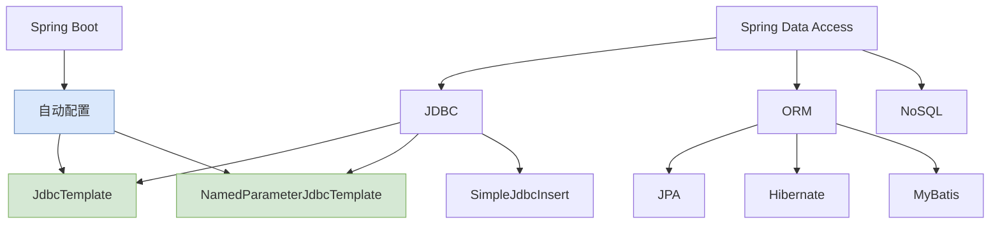

# 📊 JdbcTemplate：Spring 数据访问核心

> 📝 JdbcTemplate 是 Spring 框架提供的核心数据访问工具，通过封装 JDBC 样板代码，让数据库操作变得更加简洁高效。它消除了传统 JDBC 中繁琐的资源管理、异常处理和 SQL 执行代码。

## 🔄 什么是 JdbcTemplate

### 💡 核心概念

JdbcTemplate 是 Spring 框架对 JDBC 的轻量级封装，它简化了 JDBC 的使用流程，同时保持了 JDBC 的所有功能。通过 JdbcTemplate，开发者可以专注于 SQL 语句和业务逻辑，而无需处理连接管理、资源释放、异常处理等底层细节。

### ⚖️ 原生 JDBC vs JdbcTemplate

> [!IMPORTANT] 核心差异对比
> - **原生 JDBC**：需要手动管理连接、语句、结果集，代码冗余且易出错
> - **JdbcTemplate**：自动处理资源管理、异常转换、参数绑定，大幅简化代码

```java
// ❌ 原生 JDBC 写法
public User findById(Long id) {
    Connection conn = null;
    PreparedStatement stmt = null;
    ResultSet rs = null;
    try {
        conn = dataSource.getConnection();
        stmt = conn.prepareStatement("SELECT * FROM users WHERE id = ?");
        stmt.setLong(1, id);
        rs = stmt.executeQuery();
        if (rs.next()) {
            User user = new User();
            user.setId(rs.getLong("id"));
            user.setName(rs.getString("name"));
            user.setEmail(rs.getString("email"));
            return user;
        }
        return null;
    } catch (SQLException e) {
        throw new RuntimeException("查询失败", e);
    } finally {
        try { if (rs != null) rs.close(); } catch (SQLException e) {}
        try { if (stmt != null) stmt.close(); } catch (SQLException e) {}
        try { if (conn != null) conn.close(); } catch (SQLException e) {}
    }
}

// ✅ JdbcTemplate 写法
public User findById(Long id) {
    String sql = "SELECT * FROM users WHERE id = ?";
    return jdbcTemplate.queryForObject(sql, new Object[]{id},
        (rs, rowNum) -> {
            User user = new User();
            user.setId(rs.getLong("id"));
            user.setName(rs.getString("name"));
            user.setEmail(rs.getString("email"));
            return user;
        });
}
```

### 🌐 在 Spring 生态中的位置



## 🚀 快速入门

### ⚙️ 环境配置

#### 1. 添加 Maven 依赖

```xml
<!-- Spring JDBC 核心依赖 -->
<dependency>
    <groupId>org.springframework</groupId>
    <artifactId>spring-jdbc</artifactId>
    <version>6.1.4</version>
</dependency>

<!-- 数据库驱动（以 MySQL 为例） -->
<dependency>
    <groupId>com.mysql</groupId>
    <artifactId>mysql-connector-j</artifactId>
    <version>8.0.33</version>
</dependency>

<!-- 连接池（推荐 HikariCP） -->
<dependency>
    <groupId>com.zaxxer</groupId>
    <artifactId>HikariCP</artifactId>
    <version>5.1.0</version>
</dependency>
```

#### 2. Spring Boot 自动配置

```yaml
spring:
  datasource:
    url: jdbc:mysql://localhost:3306/mydb?useSSL=false&serverTimezone=UTC
    username: root
    password: 123456
    driver-class-name: com.mysql.cj.jdbc.Driver
    hikari:
      maximum-pool-size: 10
      minimum-idle: 5
      idle-timeout: 30000
      connection-timeout: 30000
```

#### 3. 手动配置（非 Spring Boot）

```java
@Configuration
public class DataSourceConfig {

    @Bean
    public DataSource dataSource() {
        HikariDataSource dataSource = new HikariDataSource();
        dataSource.setDriverClassName("com.mysql.cj.jdbc.Driver");
        dataSource.setJdbcUrl("jdbc:mysql://localhost:3306/mydb");
        dataSource.setUsername("root");
        dataSource.setPassword("123456");
        dataSource.setMaximumPoolSize(10);
        return dataSource;
    }

    @Bean
    public JdbcTemplate jdbcTemplate(DataSource dataSource) {
        return new JdbcTemplate(dataSource);
    }
}
```

### 📖 基础使用示例

```java
@Service
public class UserService {

    private final JdbcTemplate jdbcTemplate;

    @Autowired
    public UserService(JdbcTemplate jdbcTemplate) {
        this.jdbcTemplate = jdbcTemplate;
    }

    public int insertUser(User user) {
        String sql = "INSERT INTO users (name, email, age) VALUES (?, ?, ?)";
        return jdbcTemplate.update(sql, user.getName(), user.getEmail(), user.getAge());
    }

    public int updateUser(User user) {
        String sql = "UPDATE users SET name = ?, email = ?, age = ? WHERE id = ?";
        return jdbcTemplate.update(sql, user.getName(), user.getEmail(), user.getAge(), user.getId());
    }

    public int deleteUser(Long id) {
        String sql = "DELETE FROM users WHERE id = ?";
        return jdbcTemplate.update(sql, id);
    }

    public User findById(Long id) {
        String sql = "SELECT * FROM users WHERE id = ?";
        return jdbcTemplate.queryForObject(sql, new Object[]{id},
            (rs, rowNum) -> mapRowToUser(rs));
    }

    public List<User> findAll() {
        String sql = "SELECT * FROM users";
        return jdbcTemplate.query(sql, (rs, rowNum) -> mapRowToUser(rs));
    }

    private User mapRowToUser(ResultSet rs) throws SQLException {
        User user = new User();
        user.setId(rs.getLong("id"));
        user.setName(rs.getString("name"));
        user.setEmail(rs.getString("email"));
        user.setAge(rs.getInt("age"));
        return user;
    }
}
```

## 🎯 核心 API 详解

### ✏️ update() 方法 - 增删改操作

> [!TIP] 统一的更新操作
> `update()` 方法用于执行 INSERT、UPDATE、DELETE 语句，返回受影响的行数。

```java
@Repository
public class UserRepository {

    private final JdbcTemplate jdbcTemplate;

    public UserRepository(JdbcTemplate jdbcTemplate) {
        this.jdbcTemplate = jdbcTemplate;
    }

    public int insert(User user) {
        String sql = "INSERT INTO users (name, email, age, create_time) VALUES (?, ?, ?, ?)";
        return jdbcTemplate.update(sql,
            user.getName(), user.getEmail(), user.getAge(), LocalDateTime.now());
    }

    public int update(User user) {
        String sql = "UPDATE users SET name = ?, email = ?, age = ? WHERE id = ?";
        return jdbcTemplate.update(sql,
            user.getName(), user.getEmail(), user.getAge(), user.getId());
    }

    public int deleteById(Long id) {
        String sql = "DELETE FROM users WHERE id = ?";
        return jdbcTemplate.update(sql, id);
    }

    public int[] batchInsert(List<User> users) {
        String sql = "INSERT INTO users (name, email, age) VALUES (?, ?, ?)";
        List<Object[]> batchArgs = users.stream()
            .map(user -> new Object[]{user.getName(), user.getEmail(), user.getAge()})
            .collect(Collectors.toList());
        return jdbcTemplate.batchUpdate(sql, batchArgs);
    }

    public int[] batchUpdate(List<User> users) {
        String sql = "UPDATE users SET name = ?, email = ? WHERE id = ?";
        List<Object[]> batchArgs = users.stream()
            .map(user -> new Object[]{user.getName(), user.getEmail(), user.getId()})
            .collect(Collectors.toList());
        return jdbcTemplate.batchUpdate(sql, batchArgs);
    }
}
```

### 🔍 query() 方法 - 查询操作

> [!NOTE] 灵活的查询方式
> `query()` 方法提供多种查询方式，支持单值查询、列表查询、复杂映射等。

| 方法 | 返回类型 | 适用场景 |
|------|---------|---------|
| `queryForObject()` | 单个对象 | 查询单条记录 |
| `queryForMap()` | Map<String, Object> | 灵活字段映射 |
| `queryForObject(Class)` | 基本类型 | 聚合查询 |
| `query()` | List<T> | 列表查询 |
| `queryForList()` | List<Map> | 动态列表 |

```java
@Repository
public class UserRepository {

    private final JdbcTemplate jdbcTemplate;

    public User findById(Long id) {
        String sql = "SELECT * FROM users WHERE id = ?";
        return jdbcTemplate.queryForObject(sql, new Object[]{id}, this::mapRowToUser);
    }

    public Long count() {
        String sql = "SELECT COUNT(*) FROM users";
        return jdbcTemplate.queryForObject(sql, Long.class);
    }

    public boolean existsByEmail(String email) {
        String sql = "SELECT COUNT(*) FROM users WHERE email = ?";
        Integer count = jdbcTemplate.queryForObject(sql, new Object[]{email}, Integer.class);
        return count != null && count > 0;
    }

    public List<User> findAll() {
        String sql = "SELECT * FROM users";
        return jdbcTemplate.query(sql, this::mapRowToUser);
    }

    public List<Map<String, Object>> findAllAsMap() {
        String sql = "SELECT id, name, email FROM users";
        return jdbcTemplate.queryForList(sql);
    }

    public List<User> findByAgeRange(int minAge, int maxAge) {
        String sql = "SELECT * FROM users WHERE age BETWEEN ? AND ?";
        return jdbcTemplate.query(sql, this::mapRowToUser, minAge, maxAge);
    }

    public List<User> findPage(int page, int size) {
        String sql = "SELECT * FROM users LIMIT ? OFFSET ?";
        int offset = (page - 1) * size;
        return jdbcTemplate.query(sql, this::mapRowToUser, size, offset);
    }

    private User mapRowToUser(ResultSet rs, int rowNum) throws SQLException {
        User user = new User();
        user.setId(rs.getLong("id"));
        user.setName(rs.getString("name"));
        user.setEmail(rs.getString("email"));
        user.setAge(rs.getInt("age"));
        user.setCreateTime(rs.getTimestamp("create_time").toLocalDateTime());
        return user;
    }
}
```

### ⚡ execute() 方法 - 执行任意 SQL

> [!WARNING] 谨慎使用
> `execute()` 方法用于执行 DDL 语句或复杂的存储过程，通常不用于常规的 DML 操作。

```java
@Repository
public class DatabaseAdminRepository {

    private final JdbcTemplate jdbcTemplate;

    public void createTable() {
        String sql = """
            CREATE TABLE IF NOT EXISTS users (
                id BIGINT AUTO_INCREMENT PRIMARY KEY,
                name VARCHAR(100) NOT NULL,
                email VARCHAR(100) UNIQUE NOT NULL,
                age INT,
                create_time TIMESTAMP DEFAULT CURRENT_TIMESTAMP
            )
            """;
        jdbcTemplate.execute(sql);
    }

    public void truncateTable(String tableName) {
        jdbcTemplate.execute("TRUNCATE TABLE " + tableName);
    }

    public void createIndex(String tableName, String columnName) {
        String indexName = "idx_" + tableName + "_" + columnName;
        String sql = String.format("CREATE INDEX %s ON %s(%s)", indexName, tableName, columnName);
        jdbcTemplate.execute(sql);
    }
}
```

### 📦 batchUpdate() 方法 - 批量操作

> [!TIP] 性能优化关键
> 批量操作可以显著提升大量数据的处理性能，减少数据库往返次数。

```java
@Service
public class BatchService {

    private final JdbcTemplate jdbcTemplate;

    public BatchService(JdbcTemplate jdbcTemplate) {
        this.jdbcTemplate = jdbcTemplate;
    }

    public int[] batchInsert(List<User> users) {
        String sql = "INSERT INTO users (name, email, age) VALUES (?, ?, ?)";
        List<Object[]> batchArgs = new ArrayList<>();
        for (User user : users) {
            batchArgs.add(new Object[]{user.getName(), user.getEmail(), user.getAge()});
        }
        return jdbcTemplate.batchUpdate(sql, batchArgs);
    }

    public int[] batchInsertWithSetter(List<User> users) {
        String sql = "INSERT INTO users (name, email, age) VALUES (?, ?, ?)";
        return jdbcTemplate.batchUpdate(sql, new BatchPreparedStatementSetter() {
            @Override
            public void setValues(PreparedStatement ps, int i) throws SQLException {
                User user = users.get(i);
                ps.setString(1, user.getName());
                ps.setString(2, user.getEmail());
                ps.setInt(3, user.getAge());
            }
            @Override
            public int getBatchSize() {
                return users.size();
            }
        });
    }

    public void batchInsertInChunks(List<User> users, int chunkSize) {
        String sql = "INSERT INTO users (name, email, age) VALUES (?, ?, ?)";
        List<List<User>> partitions = Lists.partition(users, chunkSize);
        for (List<User> chunk : partitions) {
            List<Object[]> batchArgs = chunk.stream()
                .map(user -> new Object[]{user.getName(), user.getEmail(), user.getAge()})
                .collect(Collectors.toList());
            jdbcTemplate.batchUpdate(sql, batchArgs);
        }
    }
}
```

## 📊 查询操作详解

### 🗂️ RowMapper 对象映射

> [!IMPORTANT] 核心映射机制
> `RowMapper` 是 JdbcTemplate 中最常用的结果集映射机制，它将 ResultSet 的每一行映射为一个对象。

```java
@Repository
public class UserRepository {

    private final JdbcTemplate jdbcTemplate;

    // 使用 BeanPropertyRowMapper（自动映射）
    public User findByIdAutoMapping(Long id) {
        String sql = "SELECT * FROM users WHERE id = ?";
        return jdbcTemplate.queryForObject(sql, new Object[]{id},
            new BeanPropertyRowMapper<>(User.class));
    }

    // 使用 ColumnMapRowMapper（返回 Map）
    public Map<String, Object> findByIdAsMap(Long id) {
        String sql = "SELECT * FROM users WHERE id = ?";
        return jdbcTemplate.queryForObject(sql, new Object[]{id},
            new ColumnMapRowMapper());
    }

    // 方式1：匿名内部类
    public User findById(Long id) {
        String sql = "SELECT * FROM users WHERE id = ?";
        return jdbcTemplate.queryForObject(sql, new Object[]{id},
            (rs, rowNum) -> {
                User user = new User();
                user.setId(rs.getLong("id"));
                user.setName(rs.getString("name"));
                user.setEmail(rs.getString("email"));
                user.setAge(rs.getInt("age"));
                user.setCreateTime(rs.getTimestamp("create_time").toLocalDateTime());
                return user;
            });
    }

    // 方式2：独立 RowMapper 类
    public List<User> findAll() {
        String sql = "SELECT * FROM users";
        return jdbcTemplate.query(sql, new UserRowMapper());
    }

    // 方式3：使用方法引用
    public User findByIdWithMethodRef(Long id) {
        String sql = "SELECT * FROM users WHERE id = ?";
        return jdbcTemplate.queryForObject(sql, new Object[]{id}, this::mapRowToUser);
    }

    private User mapRowToUser(ResultSet rs, int rowNum) throws SQLException {
        User user = new User();
        user.setId(rs.getLong("id"));
        user.setName(rs.getString("name"));
        user.setEmail(rs.getString("email"));
        user.setAge(rs.getInt("age"));
        return user;
    }
}

// 独立的 RowMapper 类
@Component
public class UserRowMapper implements RowMapper<User> {

    @Override
    public User mapRow(ResultSet rs, int rowNum) throws SQLException {
        User user = new User();
        user.setId(rs.getLong("id"));
        user.setName(rs.getString("name"));
        user.setEmail(rs.getString("email"));
        user.setAge(rs.getInt("age"));
        user.setCreateTime(rs.getTimestamp("create_time").toLocalDateTime());
        return user;
    }
}
```

#### 🔗 复杂映射示例

```java
@Repository
public class OrderRepository {

    private final JdbcTemplate jdbcTemplate;

    // 一对多映射
    public List<Order> findOrdersWithItems() {
        String sql = """
            SELECT o.id as order_id, o.order_no, o.total_amount,
                   oi.id as item_id, oi.product_name, oi.quantity, oi.price
            FROM orders o
            LEFT JOIN order_items oi ON o.id = oi.order_id
            ORDER BY o.id
            """;

        Map<Long, Order> orderMap = new LinkedHashMap<>();

        jdbcTemplate.query(sql, (rs) -> {
            Long orderId = rs.getLong("order_id");

            Order order = orderMap.computeIfAbsent(orderId, id -> {
                Order o = new Order();
                try {
                    o.setId(id);
                    o.setOrderNo(rs.getString("order_no"));
                    o.setTotalAmount(rs.getBigDecimal("total_amount"));
                    o.setItems(new ArrayList<>());
                } catch (SQLException e) {
                    throw new RuntimeException(e);
                }
                return o;
            });

            Long itemId = rs.getLong("item_id");
            if (itemId != null) {
                OrderItem item = new OrderItem();
                item.setId(itemId);
                item.setProductName(rs.getString("product_name"));
                item.setQuantity(rs.getInt("quantity"));
                item.setPrice(rs.getBigDecimal("price"));
                order.getItems().add(item);
            }
        });

        return new ArrayList<>(orderMap.values());
    }
}
```

### 📋 ResultSetExtractor 结果处理

> [!NOTE] 高级结果处理
> `ResultSetExtractor` 提供对整个 ResultSet 的完全控制，适用于需要复杂结果处理的场景。

```java
@Repository
public class ReportRepository {

    private final JdbcTemplate jdbcTemplate;

    public Map<String, Object> generateReport() {
        String sql = """
            SELECT
                COUNT(*) as total_users,
                AVG(age) as avg_age,
                MAX(age) as max_age,
                MIN(create_time) as first_user_time
            FROM users
            """;

        return jdbcTemplate.query(sql, rs -> {
            Map<String, Object> report = new HashMap<>();
            if (rs.next()) {
                report.put("totalUsers", rs.getLong("total_users"));
                report.put("averageAge", rs.getDouble("avg_age"));
                report.put("maxAge", rs.getInt("max_age"));
                report.put("firstUserTime", rs.getTimestamp("first_user_time"));
            }
            return report;
        });
    }

    public List<Object> callStoredProc() {
        return jdbcTemplate.execute((Connection conn) -> {
            CallableStatement cs = conn.prepareCall("{call my_proc(?, ?)}");
            cs.setString(1, "param1");
            cs.registerOutParameter(2, Types.INTEGER);
            cs.execute();

            List<Object> results = new ArrayList<>();
            results.add(cs.getInt(2));

            boolean hasResults = cs.getMoreResults();
            while (hasResults) {
                ResultSet rs = cs.getResultSet();
                hasResults = cs.getMoreResults();
            }

            cs.close();
            return results;
        });
    }
}
```

## 🔧 命名参数支持

### 📝 NamedParameterJdbcTemplate

> [!TIP] 更清晰的参数绑定
> 命名参数让 SQL 语句更易读，特别是参数较多时，避免了占位符顺序错误的问题。

```java
@Service
public class NamedParamUserService {

    private final NamedParameterJdbcTemplate namedParameterJdbcTemplate;

    public NamedParamUserService(NamedParameterJdbcTemplate namedParameterJdbcTemplate) {
        this.namedParameterJdbcTemplate = namedParameterJdbcTemplate;
    }

    public User findByEmail(String email) {
        String sql = "SELECT * FROM users WHERE email = :email";
        Map<String, Object> params = Map.of("email", email);
        return namedParameterJdbcTemplate.queryForObject(sql, params,
            new BeanPropertyRowMapper<>(User.class));
    }

    public int[] batchInsert(List<User> users) {
        String sql = "INSERT INTO users (name, email, age) VALUES (:name, :email, :age)";

        List<Map<String, Object>> batchArgs = users.stream()
            .map(user -> Map.of(
                "name", user.getName(),
                "email", user.getEmail(),
                "age", user.getAge()
            ))
            .collect(Collectors.toList());

        return namedParameterJdbcTemplate.batchUpdate(sql, batchArgs.toArray(new Map[0]));
    }

    public List<User> findByCriteria(UserSearchCriteria criteria) {
        StringBuilder sql = new StringBuilder("SELECT * FROM users WHERE 1=1");
        MapSqlParameterSource params = new MapSqlParameterSource();

        if (criteria.getName() != null) {
            sql.append(" AND name = :name");
            params.addValue("name", criteria.getName());
        }
        if (criteria.getMinAge() != null) {
            sql.append(" AND age >= :minAge");
            params.addValue("minAge", criteria.getMinAge());
        }
        if (criteria.getMaxAge() != null) {
            sql.append(" AND age <= :maxAge");
            params.addValue("maxAge", criteria.getMaxAge());
        }

        return namedParameterJdbcTemplate.query(sql.toString(), params,
            new BeanPropertyRowMapper<>(User.class));
    }

    public List<User> findByIds(List<Long> ids) {
        String sql = "SELECT * FROM users WHERE id IN (:ids)";
        MapSqlParameterSource params = new MapSqlParameterSource("ids", ids);
        return namedParameterJdbcTemplate.query(sql, params,
            new BeanPropertyRowMapper<>(User.class));
    }
}
```

## 🛠️ JdbcTemplate 工具类

> [!TIP] 通用工具类封装
> 封装常用的 JdbcTemplate 操作，提供便捷的 CRUD、分页、批量操作等方法，简化日常开发。

```java
import org.slf4j.Logger;
import org.slf4j.LoggerFactory;
import org.springframework.dao.EmptyResultDataAccessException;
import org.springframework.jdbc.core.BeanPropertyRowMapper;
import org.springframework.jdbc.core.JdbcTemplate;
import org.springframework.jdbc.core.RowMapper;
import org.springframework.jdbc.core.namedparam.MapSqlParameterSource;
import org.springframework.jdbc.core.namedparam.NamedParameterJdbcTemplate;
import org.springframework.jdbc.support.GeneratedKeyHolder;
import org.springframework.jdbc.support.KeyHolder;
import org.springframework.stereotype.Component;

import java.lang.reflect.Field;
import java.sql.PreparedStatement;
import java.sql.Statement;
import java.util.*;

/**
 * JdbcTemplate 工具类
 * 封装常用的数据库操作，简化开发
 */
@Component
public class JdbcTemplateHelper {

    private static final Logger log = LoggerFactory.getLogger(JdbcTemplateHelper.class);

    private final JdbcTemplate jdbcTemplate;
    private final NamedParameterJdbcTemplate namedParameterJdbcTemplate;

    public JdbcTemplateHelper(JdbcTemplate jdbcTemplate) {
        this.jdbcTemplate = jdbcTemplate;
        this.namedParameterJdbcTemplate = new NamedParameterJdbcTemplate(jdbcTemplate);
    }

    // ==================== 基础 CRUD 操作 ====================

    /**
     * 插入数据并返回生成的主键
     * @param sql SQL语句
     * @param params 参数
     * @return 生成的主键
     */
    public Long insertAndReturnKey(String sql, Object... params) {
        KeyHolder keyHolder = new GeneratedKeyHolder();
        jdbcTemplate.update(connection -> {
            PreparedStatement ps = connection.prepareStatement(sql, Statement.RETURN_GENERATED_KEYS);
            for (int i = 0; i < params.length; i++) {
                ps.setObject(i + 1, params[i]);
            }
            return ps;
        }, keyHolder);
        return keyHolder.getKey().longValue();
    }

    /**
     * 插入数据
     * @param sql SQL语句
     * @param params 参数
     * @return 受影响行数
     */
    public int insert(String sql, Object... params) {
        return jdbcTemplate.update(sql, params);
    }

    /**
     * 更新数据
     * @param sql SQL语句
     * @param params 参数
     * @return 受影响行数
     */
    public int update(String sql, Object... params) {
        return jdbcTemplate.update(sql, params);
    }

    /**
     * 删除数据
     * @param sql SQL语句
     * @param params 参数
     * @return 受影响行数
     */
    public int delete(String sql, Object... params) {
        return jdbcTemplate.update(sql, params);
    }

    // ==================== 查询操作 ====================

    /**
     * 查询单个对象
     * @param sql SQL语句
     * @param clazz 目标类
     * @param params 参数
     * @return 对象
     */
    public <T> T queryForObject(String sql, Class<T> clazz, Object... params) {
        try {
            return jdbcTemplate.queryForObject(sql, new BeanPropertyRowMapper<>(clazz), params);
        } catch (EmptyResultDataAccessException e) {
            log.debug("查询结果为空: {}", sql);
            return null;
        }
    }

    /**
     * 查询单个值
     * @param sql SQL语句
     * @param requiredType 返回类型
     * @param params 参数
     * @return 值
     */
    public <T> T queryForValue(String sql, Class<T> requiredType, Object... params) {
        try {
            return jdbcTemplate.queryForObject(sql, requiredType, params);
        } catch (EmptyResultDataAccessException e) {
            log.debug("查询结果为空: {}", sql);
            return null;
        }
    }

    /**
     * 查询是否存在
     * @param sql SQL语句
     * @param params 参数
     * @return 是否存在
     */
    public boolean exists(String sql, Object... params) {
        Integer count = jdbcTemplate.queryForObject(sql, Integer.class, params);
        return count != null && count > 0;
    }

    /**
     * 查询列表
     * @param sql SQL语句
     * @param clazz 目标类
     * @param params 参数
     * @return 列表
     */
    public <T> List<T> queryForList(String sql, Class<T> clazz, Object... params) {
        return jdbcTemplate.query(sql, new BeanPropertyRowMapper<>(clazz), params);
    }

    /**
     * 查询Map列表
     * @param sql SQL语句
     * @param params 参数
     * @return Map列表
     */
    public List<Map<String, Object>> queryForMapList(String sql, Object... params) {
        return jdbcTemplate.queryForList(sql, params);
    }

    /**
     * 查询单个Map
     * @param sql SQL语句
     * @param params 参数
     * @return Map
     */
    public Map<String, Object> queryForMap(String sql, Object... params) {
        try {
            return jdbcTemplate.queryForMap(sql, params);
        } catch (EmptyResultDataAccessException e) {
            log.debug("查询结果为空: {}", sql);
            return null;
        }
    }

    // ==================== 分页查询 ====================

    /**
     * 分页查询
     * @param sql SQL语句（不含LIMIT和OFFSET）
     * @param clazz 目标类
     * @param page 页码（从1开始）
     * @param size 每页大小
     * @param params 参数
     * @return 分页结果
     */
    public <T> PageResult<T> queryForPage(String sql, Class<T> clazz, int page, int size, Object... params) {
        // 查询总数
        String countSql = "SELECT COUNT(*) FROM (" + sql + ") count_table";
        Long total = jdbcTemplate.queryForObject(countSql, Long.class, params);

        // 查询数据
        String pagedSql = sql + " LIMIT ? OFFSET ?";
        int offset = (page - 1) * size;
        List<Object> paramList = new ArrayList<>(Arrays.asList(params));
        paramList.add(size);
        paramList.add(offset);

        List<T> content = jdbcTemplate.query(pagedSql, new BeanPropertyRowMapper<>(clazz), paramList.toArray());

        return new PageResult<>(content, page, size, total);
    }

    // ==================== 批量操作 ====================

    /**
     * 批量插入
     * @param sql SQL语句
     * @param batchArgs 批量参数
     * @return 每批受影响行数
     */
    public int[] batchInsert(String sql, List<Object[]> batchArgs) {
        return jdbcTemplate.batchUpdate(sql, batchArgs);
    }

    /**
     * 批量更新
     * @param sql SQL语句
     * @param batchArgs 批量参数
     * @return 每批受影响行数
     */
    public int[] batchUpdate(String sql, List<Object[]> batchArgs) {
        return jdbcTemplate.batchUpdate(sql, batchArgs);
    }

    // ==================== 命名参数操作 ====================

    /**
     * 使用命名参数查询单个对象
     * @param sql SQL语句
     * @param clazz 目标类
     * @param params 命名参数
     * @return 对象
     */
    public <T> T queryForObject(String sql, Class<T> clazz, Map<String, Object> params) {
        try {
            return namedParameterJdbcTemplate.queryForObject(sql, params, new BeanPropertyRowMapper<>(clazz));
        } catch (EmptyResultDataAccessException e) {
            log.debug("查询结果为空: {}", sql);
            return null;
        }
    }

    /**
     * 使用命名参数查询列表
     * @param sql SQL语句
     * @param clazz 目标类
     * @param params 命名参数
     * @return 列表
     */
    public <T> List<T> queryForList(String sql, Class<T> clazz, Map<String, Object> params) {
        return namedParameterJdbcTemplate.query(sql, params, new BeanPropertyRowMapper<>(clazz));
    }

    /**
     * 使用命名参数更新
     * @param sql SQL语句
     * @param params 命名参数
     * @return 受影响行数
     */
    public int update(String sql, Map<String, Object> params) {
        return namedParameterJdbcTemplate.update(sql, params);
    }

    // ==================== 动态SQL构建 ====================

    /**
     * 构建动态查询条件
     * @return DynamicQuery
     */
    public DynamicQuery createDynamicQuery() {
        return new DynamicQuery();
    }

    /**
     * 动态查询构建器
     */
    public static class DynamicQuery {
        private final StringBuilder sql = new StringBuilder();
        private final Map<String, Object> params = new LinkedHashMap<>();
        private final List<String> conditions = new ArrayList<>();

        public DynamicQuery select(String columns) {
            sql.append("SELECT ").append(columns).append(" FROM ");
            return this;
        }

        public DynamicQuery from(String table) {
            sql.append(table);
            return this;
        }

        public DynamicQuery where(String condition, String paramName, Object value) {
            if (value != null) {
                conditions.add(condition);
                params.put(paramName, value);
            }
            return this;
        }

        public DynamicQuery where(String condition) {
            if (condition != null && !condition.trim().isEmpty()) {
                conditions.add(condition);
            }
            return this;
        }

        public DynamicQuery orderBy(String column, boolean ascending) {
            sql.append(" ORDER BY ").append(column).append(ascending ? " ASC" : " DESC");
            return this;
        }

        public String buildSql() {
            StringBuilder result = new StringBuilder(sql.toString());
            if (!conditions.isEmpty()) {
                result.append(" WHERE ").append(String.join(" AND ", conditions));
            }
            return result.toString();
        }

        public Map<String, Object> getParams() {
            return params;
        }
    }

    // ==================== 分页结果类 ====================

    /**
     * 分页结果
     */
    public static class PageResult<T> {
        private final List<T> content;
        private final int page;
        private final int size;
        private final long total;
        private final int totalPages;

        public PageResult(List<T> content, int page, int size, long total) {
            this.content = content;
            this.page = page;
            this.size = size;
            this.total = total;
            this.totalPages = (int) Math.ceil((double) total / size);
        }

        public List<T> getContent() { return content; }
        public int getPage() { return page; }
        public int getSize() { return size; }
        public long getTotal() { return total; }
        public int getTotalPages() { return totalPages; }
        public boolean hasNext() { return page < totalPages; }
        public boolean hasPrevious() { return page > 1; }
        public boolean isEmpty() { return content == null || content.isEmpty(); }
    }
}
```

### 使用示例

```java
@Service
public class UserService {

    private final JdbcTemplateHelper helper;

    public UserService(JdbcTemplateHelper helper) {
        this.helper = helper;
    }

    // 插入并返回ID
    public Long createUser(String name, String email, int age) {
        String sql = "INSERT INTO users (name, email, age) VALUES (?, ?, ?)";
        return helper.insertAndReturnKey(sql, name, email, age);
    }

    // 查询单个对象
    public User findById(Long id) {
        String sql = "SELECT * FROM users WHERE id = ?";
        return helper.queryForObject(sql, User.class, id);
    }

    // 查询是否存在
    public boolean existsByEmail(String email) {
        String sql = "SELECT COUNT(*) FROM users WHERE email = ?";
        return helper.exists(sql, email);
    }

    // 分页查询
    public JdbcTemplateHelper.PageResult<User> findUsers(int page, int size) {
        String sql = "SELECT * FROM users";
        return helper.queryForPage(sql, User.class, page, size);
    }

    // 动态查询
    public List<User> searchUsers(String name, Integer minAge) {
        JdbcTemplateHelper.DynamicQuery query = helper.createDynamicQuery()
            .select("*")
            .from("users")
            .where("name = :name", "name", name)
            .where("age >= :minAge", "minAge", minAge);

        return helper.queryForList(query.buildSql(), User.class, query.getParams());
    }

    // 批量插入
    public void batchCreateUsers(List<User> users) {
        String sql = "INSERT INTO users (name, email, age) VALUES (?, ?, ?)";
        List<Object[]> batchArgs = users.stream()
            .map(u -> new Object[]{u.getName(), u.getEmail(), u.getAge()})
            .collect(Collectors.toList());
        helper.batchInsert(sql, batchArgs);
    }
}
```

## ⚡ 高级特性

### 💾 存储过程调用

```java
@Repository
public class StoredProcedureRepository {

    private final JdbcTemplate jdbcTemplate;

    // 调用存储过程（无返回值）
    public void callProcedure(String param1) {
        jdbcTemplate.execute("CALL my_procedure(?)",
            (PreparedStatement ps) -> {
                ps.setString(1, param1);
                ps.execute();
            });
    }

    // 调用存储过程（有返回值）
    public Map<String, Object> callFunction(String param1) {
        return jdbcTemplate.execute((Connection conn) -> {
            CallableStatement cs = conn.prepareCall("{? = call my_function(?)}");
            cs.registerOutParameter(1, Types.INTEGER);
            cs.setString(2, param1);
            cs.execute();

            Map<String, Object> result = new HashMap<>();
            result.put("result", cs.getInt(1));

            cs.close();
            return result;
        });
    }

    // 调用存储过程（返回结果集）
    public List<User> callProcedureWithResultSet() {
        return jdbcTemplate.execute((Connection conn) -> {
            CallableStatement cs = conn.prepareCall("{call get_users()}");
            ResultSet rs = cs.executeQuery();

            List<User> users = new ArrayList<>();
            while (rs.next()) {
                User user = new User();
                user.setId(rs.getLong("id"));
                user.setName(rs.getString("name"));
                users.add(user);
            }

            rs.close();
            cs.close();
            return users;
        });
    }
}
```

### 🔑 返回生成键

```java
@Repository
public class UserRepository {

    private final JdbcTemplate jdbcTemplate;

    // 插入并返回生成的 ID
    public Long insertAndReturnKey(User user) {
        KeyHolder keyHolder = new GeneratedKeyHolder();

        String sql = "INSERT INTO users (name, email, age) VALUES (?, ?, ?)";

        jdbcTemplate.update(connection -> {
            PreparedStatement ps = connection.prepareStatement(sql, Statement.RETURN_GENERATED_KEYS);
            ps.setString(1, user.getName());
            ps.setString(2, user.getEmail());
            ps.setInt(3, user.getAge());
            return ps;
        }, keyHolder);

        return keyHolder.getKey().longValue();
    }

    // 批量插入并返回生成的 ID
    public List<Long> batchInsertAndReturnKeys(List<User> users) {
        KeyHolder keyHolder = new GeneratedKeyHolder();

        String sql = "INSERT INTO users (name, email, age) VALUES (?, ?, ?)";

        jdbcTemplate.update(connection -> {
            PreparedStatement ps = connection.prepareStatement(sql, Statement.RETURN_GENERATED_KEYS);
            for (User user : users) {
                ps.setString(1, user.getName());
                ps.setString(2, user.getEmail());
                ps.setInt(3, user.getAge());
                ps.addBatch();
            }
            ps.executeBatch();
            return ps;
        }, keyHolder);

        return keyHolder.getKeyList().stream()
            .map(m -> ((Number) m.get(KeyHolder.KEY)).longValue())
            .collect(Collectors.toList());
    }
}
```

## 🛡️ 异常处理与最佳实践

### ⚠️ 异常转换机制

> [!IMPORTANT] Spring 异常层次
> Spring 将底层的 `SQLException` 转换为更有意义的 `DataAccessException` 层次结构，开发者可以选择捕获特定异常。

```java
@Service
public class UserService {

    private final JdbcTemplate jdbcTemplate;

    public void createUser(User user) {
        try {
            String sql = "INSERT INTO users (name, email, age) VALUES (?, ?, ?)";
            jdbcTemplate.update(sql, user.getName(), user.getEmail(), user.getAge());
        } catch (DuplicateKeyException e) {
            // 唯一键冲突
            throw new BusinessException("用户已存在", e);
        } catch (DataIntegrityViolationException e) {
            // 数据完整性约束违反
            throw new BusinessException("数据验证失败", e);
        } catch (DataAccessException e) {
            // 其他数据访问异常
            throw new SystemException("数据库操作失败", e);
        }
    }

    // 使用 @Transactional 时的异常处理
    @Transactional
    public void transferMoney(Long fromId, Long toId, BigDecimal amount) {
        try {
            // 转出
            jdbcTemplate.update(
                "UPDATE accounts SET balance = balance - ? WHERE id = ? AND balance >= ?",
                amount, fromId, amount);

            // 转入
            jdbcTemplate.update(
                "UPDATE accounts SET balance = balance + ? WHERE id = ?",
                amount, toId);

        } catch (DataAccessException e) {
            // 事务会自动回滚
            throw new BusinessException("转账失败", e);
        }
    }
}
```

### 🔄 资源管理策略

```java
@Configuration
public class JdbcTemplateConfig {

    // 推荐：使用 HikariCP 连接池
    @Bean
    @ConfigurationProperties(prefix = "spring.datasource.hikari")
    public HikariConfig hikariConfig() {
        return new HikariConfig();
    }

    @Bean
    public DataSource dataSource(HikariConfig hikariConfig) {
        return new HikariDataSource(hikariConfig);
    }

    @Bean
    public JdbcTemplate jdbcTemplate(DataSource dataSource) {
        return new JdbcTemplate(dataSource);
    }

    @Bean
    public NamedParameterJdbcTemplate namedParameterJdbcTemplate(DataSource dataSource) {
        return new NamedParameterJdbcTemplate(dataSource);
    }
}
```

### 🚀 性能优化建议

```java
@Service
public class OptimizedUserService {

    private final JdbcTemplate jdbcTemplate;

    public OptimizedUserService(JdbcTemplate jdbcTemplate) {
        this.jdbcTemplate = jdbcTemplate;
    }

    // 1. 使用批量操作
    public void batchInsertUsers(List<User> users) {
        String sql = "INSERT INTO users (name, email, age) VALUES (?, ?, ?)";
        List<Object[]> batchArgs = users.stream()
            .map(u -> new Object[]{u.getName(), u.getEmail(), u.getAge()})
            .collect(Collectors.toList());
        jdbcTemplate.batchUpdate(sql, batchArgs);
    }

    // 2. 使用合适的查询方法
    public boolean existsByEmail(String email) {
        String sql = "SELECT COUNT(1) FROM users WHERE email = ? LIMIT 1";
        Integer count = jdbcTemplate.queryForObject(sql, new Object[]{email}, Integer.class);
        return count != null && count > 0;
    }

    // 3. 使用只读事务
    @Transactional(readOnly = true)
    public List<User> findAllReadOnly() {
        String sql = "SELECT * FROM users";
        return jdbcTemplate.query(sql, new BeanPropertyRowMapper<>(User.class));
    }

    // 4. 分页查询
    public List<User> findPage(int page, int pageSize) {
        String sql = "SELECT * FROM users ORDER BY id LIMIT ? OFFSET ?";
        int offset = (page - 1) * pageSize;
        return jdbcTemplate.query(sql, new BeanPropertyRowMapper<>(User.class), pageSize, offset);
    }

    // 5. 使用 RowMapper 缓存
    private static final RowMapper<User> USER_ROW_MAPPER = new BeanPropertyRowMapper<>(User.class);

    public User findByIdCached(Long id) {
        String sql = "SELECT * FROM users WHERE id = ?";
        return jdbcTemplate.queryForObject(sql, new Object[]{id}, USER_ROW_MAPPER);
    }

    // 6. 避免 N+1 查询
    public List<Map<String, Object>> findUsersWithOrders() {
        String sql = """
            SELECT u.*, o.id as order_id, o.order_no, o.total_amount
            FROM users u
            LEFT JOIN orders o ON u.id = o.user_id
            ORDER BY u.id
            """;
        return jdbcTemplate.queryForList(sql);
    }

    // 7. 使用 named parameter 避免参数顺序错误
    public User findByEmailAndName(String email, String name) {
        String sql = "SELECT * FROM users WHERE email = :email AND name = :name";
        MapSqlParameterSource params = new MapSqlParameterSource()
            .addValue("email", email)
            .addValue("name", name);
        return jdbcTemplate.queryForObject(sql, params, USER_ROW_MAPPER);
    }
}
```

## 📈 与其他技术对比

### ⚖️ JdbcTemplate vs JPA/Hibernate

| 特性 | JdbcTemplate | JPA/Hibernate |
|------|-------------|---------------|
| **学习曲线** | 简单，需掌握 SQL | 复杂，需掌握 ORM |
| **SQL 控制** | 完全控制 | 可配置生成 |
| **对象映射** | 手动映射 | 自动映射 |
| **关联关系** | 手动 JOIN | 自动加载 |
| **缓存支持** | 无 | 一级/二级缓存 |
| **事务管理** | 编程式/声明式 | 声明式 |
| **性能** | 接近原生 JDBC | 有 ORM 开销 |
| **适用场景** | 简单查询、报表、批量操作 | 复杂业务逻辑、实体关系 |

### 🎯 选择建议

> [!TIP] 技术选型指南
> - **选择 JdbcTemplate**：简单 CRUD、报表查询、批量操作、存储过程调用
> - **选择 JPA/Hibernate**：复杂实体关系、需要缓存、快速原型开发
> - **混合使用**：核心业务用 JPA，复杂查询/报表用 JdbcTemplate

```java
// 混合使用示例
@Service
public class UserService {

    private final UserRepository userRepository;  // JPA Repository
    private final JdbcTemplate jdbcTemplate;       // JDBC Template

    // 简单 CRUD 使用 JPA
    public User save(User user) {
        return userRepository.save(user);
    }

    // 复杂查询使用 JdbcTemplate
    @Transactional(readOnly = true)
    public List<UserReport> generateUserReport() {
        String sql = """
            SELECT
                u.name,
                COUNT(o.id) as order_count,
                SUM(o.total_amount) as total_spent
            FROM users u
            LEFT JOIN orders o ON u.id = o.user_id
            GROUP BY u.id
            ORDER BY total_spent DESC
            """;
        return jdbcTemplate.query(sql, new BeanPropertyRowMapper<>(UserReport.class));
    }

    // 批量操作使用 JdbcTemplate
    public void batchUpdateUsers(List<User> users) {
        String sql = "UPDATE users SET name = ?, email = ? WHERE id = ?";
        List<Object[]> batchArgs = users.stream()
            .map(u -> new Object[]{u.getName(), u.getEmail(), u.getId()})
            .collect(Collectors.toList());
        jdbcTemplate.batchUpdate(sql, batchArgs);
    }
}
```

## 💡 实际应用案例

### 📦 完整 CRUD 示例

```java
@Repository
public class ProductRepository {

    private final JdbcTemplate jdbcTemplate;

    public ProductRepository(JdbcTemplate jdbcTemplate) {
        this.jdbcTemplate = jdbcTemplate;
    }

    // 创建
    public Product create(Product product) {
        String sql = "INSERT INTO products (name, price, category_id) VALUES (?, ?, ?)";
        KeyHolder keyHolder = new GeneratedKeyHolder();

        jdbcTemplate.update(connection -> {
            PreparedStatement ps = connection.prepareStatement(sql, Statement.RETURN_GENERATED_KEYS);
            ps.setString(1, product.getName());
            ps.setBigDecimal(2, product.getPrice());
            ps.setLong(3, product.getCategoryId());
            return ps;
        }, keyHolder);

        product.setId(keyHolder.getKey().longValue());
        return product;
    }

    // 查询单个
    public Product findById(Long id) {
        String sql = "SELECT * FROM products WHERE id = ?";
        return jdbcTemplate.queryForObject(sql, new Object[]{id},
            new BeanPropertyRowMapper<>(Product.class));
    }

    // 查询列表
    public List<Product> findByCategory(Long categoryId) {
        String sql = "SELECT * FROM products WHERE category_id = ? ORDER BY name";
        return jdbcTemplate.query(sql, new BeanPropertyRowMapper<>(Product.class), categoryId);
    }

    // 分页查询
    public Page<Product> findPage(int page, int size) {
        String countSql = "SELECT COUNT(*) FROM products";
        Long total = jdbcTemplate.queryForObject(countSql, Long.class);

        String sql = "SELECT * FROM products ORDER BY id LIMIT ? OFFSET ?";
        int offset = (page - 1) * size;
        List<Product> content = jdbcTemplate.query(sql,
            new BeanPropertyRowMapper<>(Product.class), size, offset);

        return new Page<>(content, PageRequest.of(page, size), total);
    }

    // 更新
    public Product update(Product product) {
        String sql = "UPDATE products SET name = ?, price = ?, category_id = ? WHERE id = ?";
        jdbcTemplate.update(sql,
            product.getName(), product.getPrice(), product.getCategoryId(), product.getId());
        return product;
    }

    // 删除
    public void deleteById(Long id) {
        String sql = "DELETE FROM products WHERE id = ?";
        jdbcTemplate.update(sql, id);
    }

    // 批量删除
    public void deleteByIds(List<Long> ids) {
        String sql = "DELETE FROM products WHERE id IN (:ids)";
        MapSqlParameterSource params = new MapSqlParameterSource("ids", ids);
        NamedParameterJdbcTemplate namedTemplate = new NamedParameterJdbcTemplate(jdbcTemplate);
        namedTemplate.update(sql, params);
    }
}
```

### 📄 分页查询实现

```java
@Service
public class PaginationService {

    private final JdbcTemplate jdbcTemplate;

    public PaginationService(JdbcTemplate jdbcTemplate) {
        this.jdbcTemplate = jdbcTemplate;
    }

    public <T> Page<T> findByPage(String sql, Class<T> clazz, int page, int size, Object... params) {
        String countSql = buildCountSql(sql);
        Long total = jdbcTemplate.queryForObject(countSql, Long.class, params);

        String pagedSql = buildPagedSql(sql, size, (page - 1) * size);
        List<T> content = jdbcTemplate.query(pagedSql, new BeanPropertyRowMapper<>(clazz), params);

        return new Page<>(content, PageRequest.of(page, size), total);
    }

    private String buildCountSql(String originalSql) {
        return "SELECT COUNT(*) FROM (" + originalSql + ") count_table";
    }

    private String buildPagedSql(String originalSql, int limit, int offset) {
        return originalSql + " LIMIT " + limit + " OFFSET " + offset;
    }
}
```

### 📥 批量导入场景

```java
@Service
public class BatchImportService {

    private final JdbcTemplate jdbcTemplate;

    public BatchImportService(JdbcTemplate jdbcTemplate) {
        this.jdbcTemplate = jdbcTemplate;
    }

    @Transactional
    public BatchImportResult batchImportUsers(List<User> users) {
        BatchImportResult result = new BatchImportResult();

        String sql = "INSERT INTO users (name, email, age) VALUES (?, ?, ?)";

        List<Object[]> batchArgs = new ArrayList<>();
        List<String> errors = new ArrayList<>();

        for (int i = 0; i < users.size(); i++) {
            User user = users.get(i);
            try {
                validateUser(user);
                batchArgs.add(new Object[]{user.getName(), user.getEmail(), user.getAge()});
                result.incrementSuccess();
            } catch (Exception e) {
                errors.add("第 " + (i + 1) + " 行: " + e.getMessage());
                result.incrementFailed();
            }
        }

        if (!batchArgs.isEmpty()) {
            jdbcTemplate.batchUpdate(sql, batchArgs);
        }

        result.setErrors(errors);
        return result;
    }

    private void validateUser(User user) {
        if (user.getName() == null || user.getName().trim().isEmpty()) {
            throw new IllegalArgumentException("用户名不能为空");
        }
        if (user.getEmail() == null || !user.getEmail().contains("@")) {
            throw new IllegalArgumentException("邮箱格式不正确");
        }
        if (user.getAge() != null && (user.getAge() < 0 || user.getAge() > 150)) {
            throw new IllegalArgumentException("年龄不合法");
        }
    }
}

@Data
public class BatchImportResult {
    private int successCount;
    private int failedCount;
    private List<String> errors = new ArrayList<>();

    public void incrementSuccess() {
        successCount++;
    }

    public void incrementFailed() {
        failedCount++;
    }
}
```

## 🔗 相关主题

- [Spring 事务传播行为](/后端/SpringBoot/Spring事务传播行为)
- [Spring Boot 数据源配置](/后端/SpringBoot/数据源配置)
- [JPA 实体映射](/后端/Spring/JPA实体映射)
- [数据库连接池配置](/后端/数据库/连接池配置)

---

> 💡 **最佳实践建议**：JdbcTemplate 适合简单的数据访问场景，对于复杂业务逻辑建议结合 JPA 使用。始终使用连接池，合理配置事务，注意批量操作的性能优化。
