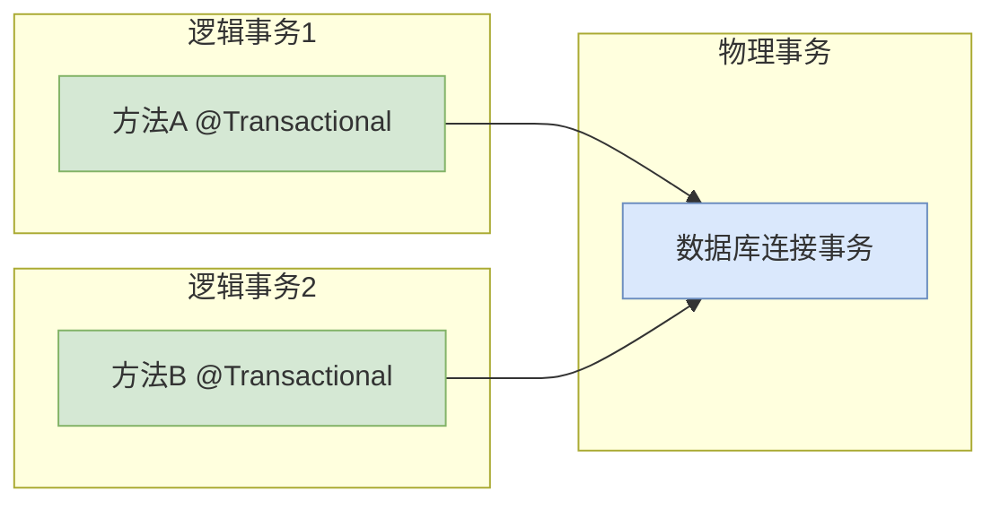
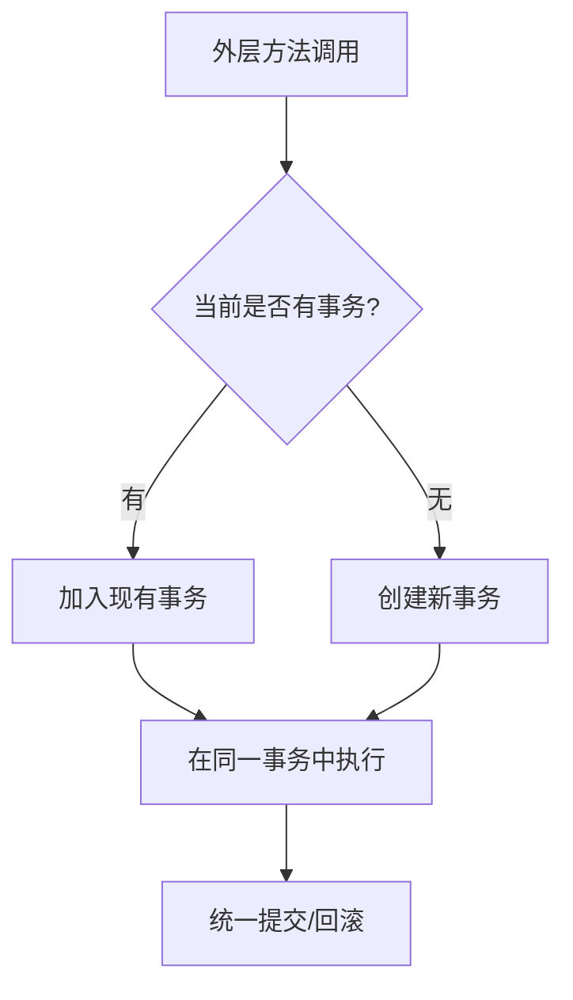
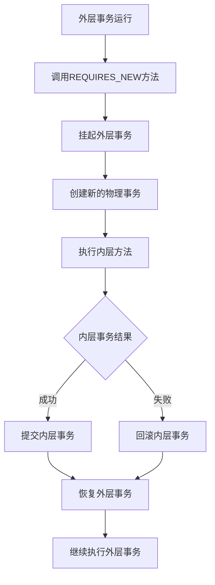
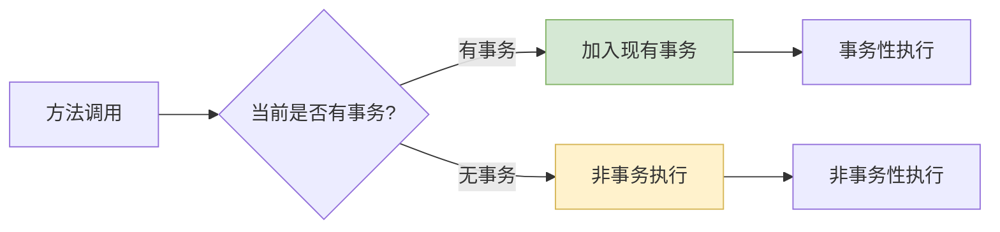
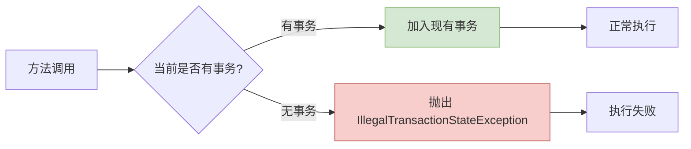
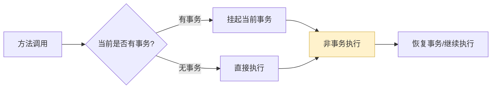
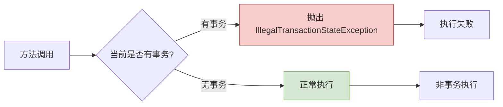
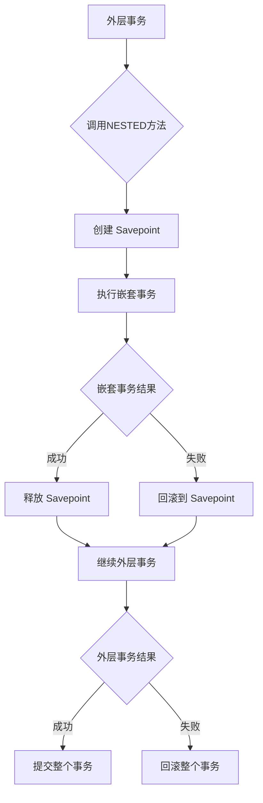
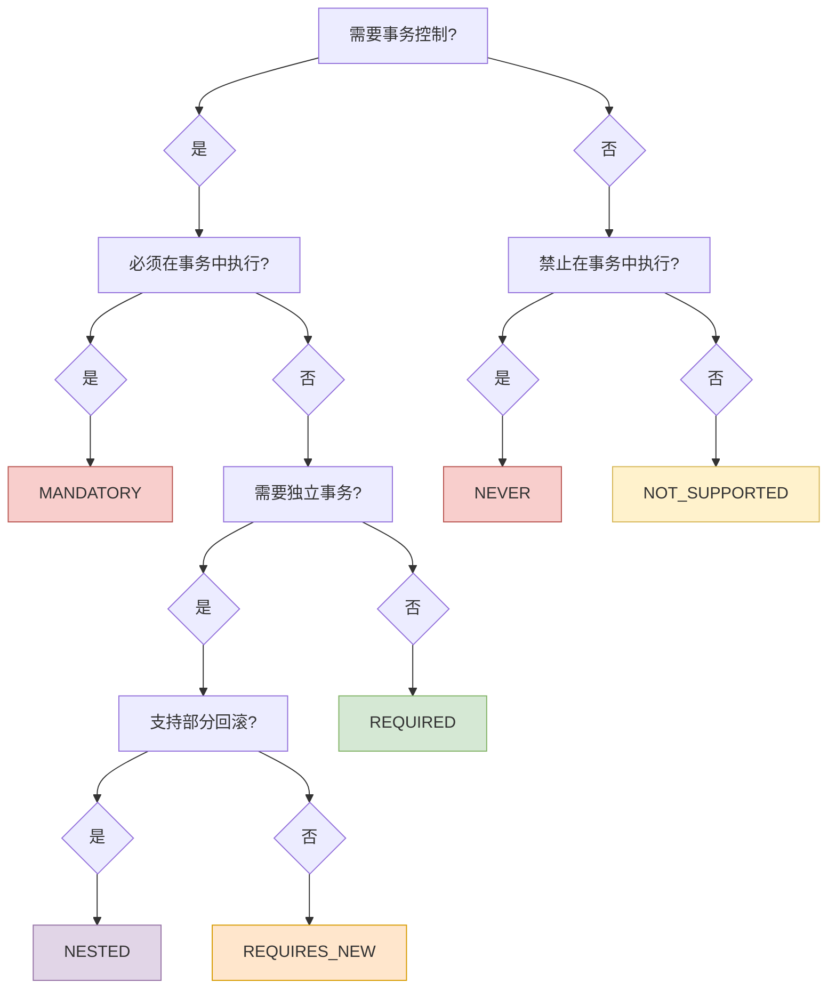

# Spring 事务传播行为：七种传播机制详解

> Spring 事务传播行为定义了在多个事务方法相互调用时，事务应该如何传播和管理。理解这些传播机制对于确保数据一致性和处理复杂业务场景至关重要。

## 🔄 什么是事务传播行为

### 核心概念

事务传播行为（Transaction Propagation）是 Spring 框架提供的一种机制，用于控制当一个事务方法被另一个事务方法调用时的行为。它决定了：

- 是否创建新的事务
- 是否加入现有事务  
- 是否挂起当前事务
- 如何处理事务的回滚和提交

### 物理事务 vs 逻辑事务

> [!IMPORTANT] 重要概念区分
> - **物理事务**：实际的数据库事务，对应真实的数据库连接
> - **逻辑事务**：Spring 管理的事务单元，可能参与到同一个物理事务中



## 📋 七种传播机制总览

| 传播行为 | 说明 | 有事务 | 无事务 | 使用场景 |
|---------|------|--------|--------|----------|
| **REQUIRED** | 支持当前事务，无则创建 | 加入现有事务 | 创建新事务 | 🟢 默认选择，通用场景 |
| **SUPPORTS** | 支持当前事务，无则非事务执行 | 加入现有事务 | 非事务执行 | 🟡 查询操作 |
| **MANDATORY** | 必须在事务中执行 | 加入现有事务 | 抛出异常 | 🔴 强制事务环境 |
| **REQUIRES_NEW** | 总是创建新事务 | 挂起当前，创建新事务 | 创建新事务 | 🟠 独立事务操作 |
| **NOT_SUPPORTED** | 不支持事务 | 挂起当前事务 | 非事务执行 | 🟡 性能敏感操作 |
| **NEVER** | 禁止在事务中执行 | 抛出异常 | 非事务执行 | 🔴 严格非事务操作 |
| **NESTED** | 嵌套事务 | 创建嵌套事务 | 等同REQUIRED | 🟠 部分回滚场景 |

## 🎯 详细机制解析

### 1. PROPAGATION_REQUIRED（默认）

> [!TIP] 最常用的传播行为
> 这是 `@Transactional` 注解的默认传播行为，适用于大多数业务场景。

#### 传播机制特性

REQUIRED是Spring默认的传播行为，也是最常用的一种。当一个REQUIRED传播级别的方法被调用时，如果当前存在事务，则方法会加入到这个事务中；如果不存在事务，则会为该方法创建一个新的事务。这种行为确保了方法总是在事务中执行，无论调用方是否已开启事务。REQUIRED传播行为适用于大多数业务场景，特别是那些需要原子操作的业务方法。

#### 工作原理



#### 代码示例

```java
@Service
public class UserService {
    
    @Autowired
    private UserRepository userRepository;
    
    @Autowired
    private RoleService roleService;
    
    // 默认使用REQUIRED传播行为
    @Transactional
    public User createUserWithRoles(User user, List<Role> roles) {
        // 保存用户
        User savedUser = userRepository.save(user);
        
        // 调用RoleService的方法，该方法也具有事务特性
        // 由于使用REQUIRED传播行为，roleService.assignRolesToUser会加入到当前事务中
        roleService.assignRolesToUser(savedUser, roles);
        
        return savedUser;
    }
}

@Service
public class RoleService {
    
    @Autowired
    private UserRoleRepository userRoleRepository;
    
    @Transactional // 默认REQUIRED
    public void assignRolesToUser(User user, List<Role> roles) {
        for (Role role : roles) {
            UserRole userRole = new UserRole(user, role);
            userRoleRepository.save(userRole);
            
            // 如果角色分配失败，整个用户创建事务都会回滚
            if (role.getName() == null || role.getName().isEmpty()) {
                throw new IllegalArgumentException("角色名称不能为空");
            }
        }
    }
}
```

> [!NOTE] REQUIRED 异常处理机制
> - **用户角色一致性**：当 `createUserWithRoles()` 中的 `assignRolesToUser()` 抛出 `IllegalArgumentException` 时，整个用户创建事务会回滚，确保用户和角色数据的一致性
> - **rollback-only 标记**：即使在 `createUserWithRoles()` 中捕获了角色分配的异常，事务仍然被标记为 rollback-only，提交时会抛出 `UnexpectedRollbackException`
> - **异常传播特性**：`assignRolesToUser()` 中的 `IllegalArgumentException` 会向上传播到 `createUserWithRoles()`，导致整个事务回滚
> - **数据完整性保障**：确保用户创建和角色分配要么全部成功，要么全部失败，避免出现有用户但无角色分配的数据不一致情况

### 2. PROPAGATION_REQUIRES_NEW

> [!WARNING] 独立事务机制
> 总是创建新的物理事务，会挂起当前事务。需要注意数据库连接的管理。

#### 传播机制特性

REQUIRES_NEW表示总是开启一个新的事务。如果当前已存在事务，则将当前事务挂起，并开启一个新的事务执行当前方法，当前方法执行完成后，恢复上层事务的执行。这种传播行为创建的事务是完全独立的，不会受到外层事务的影响。适用于那些需要独立提交的操作，如日志记录、审计信息等。

#### 工作原理



#### 代码示例

```java
@Service
public class OrderService {
    
    @Autowired
    private OrderRepository orderRepository;
    
    @Autowired
    private LogService logService;
    
    @Transactional
    public Order createOrder(Order order) {
        // 外层事务：创建订单
        order.setCreateTime(LocalDateTime.now());
        order.setStatus("CREATED");
        Order savedOrder = orderRepository.save(order);
        
        // 调用日志服务记录操作，使用独立事务
        // 即使日志记录失败，订单创建也不会回滚
        logService.recordOrderLog(savedOrder.getId(), "ORDER_CREATED");
        
        return savedOrder;
    }
}

@Service
public class LogService {
    
    @Autowired
    private OperationLogRepository logRepository;
    
    @Transactional(propagation = Propagation.REQUIRES_NEW)
    public void recordOrderLog(Long orderId, String operation) {
        // 这个方法总是在新的独立事务中执行
        OperationLog log = new OperationLog();
        log.setOrderId(orderId);
        log.setOperation(operation);
        log.setLogTime(LocalDateTime.now());
        log.setOperator("SYSTEM");
        
        logRepository.save(log);
        
        // 如果这里发生异常，只会回滚日志记录，不会影响外层的订单创建事务
        if (orderId == null) {
            throw new IllegalArgumentException("订单ID不能为空");
        }
    }
}

// 使用示例
@Service
public class BusinessService {
    
    @Autowired
    private OrderService orderService;
    
    public void handleOrderCreation() {
        Order order = new Order();
        order.setCustomerName("张三");
        order.setAmount(new BigDecimal("100.00"));
        
        try {
            Order createdOrder = orderService.createOrder(order);
            System.out.println("订单创建成功：" + createdOrder.getId());
        } catch (Exception e) {
            System.out.println("业务处理异常：" + e.getMessage());
            // 即使日志记录失败，订单仍然可能创建成功
        }
    }
}
```

> [!NOTE] REQUIRES_NEW 异常处理机制
> - **订单日志隔离**：当 `recordOrderLog()` 中抛出 `IllegalArgumentException` 时，只有日志记录事务回滚，订单创建事务 `createOrder()` 不受影响
> - **独立事务特性**：`recordOrderLog()` 在独立的物理事务中执行，日志记录失败不会导致订单创建失败，确保核心业务不受辅助功能影响
> - **事务隔离保障**：订单创建和日志记录在不同的物理事务中执行，彼此独立，一个失败不会影响另一个的提交
> - **业务连续性**：即使日志系统出现问题，订单创建等核心业务仍能正常进行，体现了 REQUIRES_NEW 在业务隔离中的重要作用

### 3. PROPAGATION_SUPPORTS

> [!NOTE] 灵活的传播行为
> 支持事务但不强制，适用于既可以在事务中执行也可以非事务执行的操作。

#### 传播机制特性

SUPPORTS传播行为表示当前方法支持事务，但不要求事务。如果当前存在事务，则方法会在事务中运行；如果不存在事务，则方法以非事务方式执行。这种传播行为适用于那些既可以在事务中执行也可以不在事务中执行的方法，通常是一些查询操作或不涉及数据修改的业务逻辑。

#### 工作原理



#### 代码示例

```java
@Service
public class ProductService {
    
    @Autowired
    private ProductRepository productRepository;
    
    @Autowired
    private OrderService orderService;
    
    // 使用SUPPORTS传播行为的查询方法
    @Transactional(propagation = Propagation.SUPPORTS, readOnly = true)
    public List<Product> findProductsByCategory(String category) {
        return productRepository.findByCategory(category);
    }
    
    // 在事务中调用SUPPORTS方法
    @Transactional
    public void createOrderForCategory(String category, String customerId) {
        // findProductsByCategory会加入到当前事务中
        List<Product> products = findProductsByCategory(category);
        
        for (Product product : products) {
            if (product.getStock() > 0) {
                orderService.createOrder(product.getId(), customerId);
            }
        }
    }
    
    // 在非事务中调用SUPPORTS方法
    public void displayProductCatalog(String category) {
        // findProductsByCategory以非事务方式执行
        List<Product> products = findProductsByCategory(category);
        
        products.forEach(product -> 
            System.out.println("商品: " + product.getName() + ", 价格: " + product.getPrice() + 
                             ", 库存: " + product.getStock())
        );
    }
}

@Service
public class OrderService {
    
    @Autowired
    private OrderRepository orderRepository;
    
    @Transactional
    public void createOrder(Long productId, String customerId) {
        Order order = new Order();
        order.setProductId(productId);
        order.setCustomerId(customerId);
        order.setOrderTime(LocalDateTime.now());
        order.setStatus("CREATED");
        orderRepository.save(order);
    }
}
```

> [!NOTE] SUPPORTS 异常处理机制
> - **事务环境下的异常**：当 `createOrderForCategory()` 调用 `findProductsByCategory()` 时，如果查询方法抛出异常，整个订单创建事务会回滚
> - **非事务环境下的异常**：当 `displayProductCatalog()` 调用 `findProductsByCategory()` 时，异常不会触发事务回滚，只是普通的异常传播
> - **灵活的异常处理**：`findProductsByCategory()` 可以根据调用环境采用不同的异常处理策略，在事务中保证数据一致性，在非事务中直接返回错误信息
> - **查询场景优势**：产品查询功能既可以作为订单创建流程的一部分（事务性），也可以作为独立的查询功能（非事务性），提供了很好的灵活性

### 4. PROPAGATION_MANDATORY

> [!DANGER] 强制事务环境
> 必须在已有事务中执行，否则抛出异常。用于确保方法一定在事务环境中运行。

#### 传播机制特性

MANDATORY表示当前方法必须在事务中运行，如果当前没有事务，则抛出异常。这种传播行为强制要求调用方必须在事务环境中调用该方法，确保了数据操作的一致性和安全性。通常用于那些对数据一致性要求极高的核心业务方法。

#### 工作原理



#### 代码示例

```java
@Service
public class AccountService {
    
    @Autowired
    private AccountRepository accountRepository;
    
    @Autowired
    private TransactionLogRepository transactionLogRepository;
    
    @Transactional(propagation = Propagation.MANDATORY)
    public void transferMoney(Long fromAccountId, Long toAccountId, BigDecimal amount) {
        // 这个方法必须在事务中执行
        // 确保资金转移的原子性
        
        if (amount.compareTo(BigDecimal.ZERO) <= 0) {
            throw new IllegalArgumentException("转账金额必须大于0");
        }
        
        // 获取账户信息
        Account fromAccount = accountRepository.findById(fromAccountId);
        Account toAccount = accountRepository.findById(toAccountId);
        
        // 检查余额
        if (fromAccount.getBalance().compareTo(amount) < 0) {
            throw new InsufficientFundsException("账户余额不足");
        }
        
        // 执行转账
        fromAccount.setBalance(fromAccount.getBalance().subtract(amount));
        toAccount.setBalance(toAccount.getBalance().add(amount));
        
        accountRepository.save(fromAccount);
        accountRepository.save(toAccount);
        
        // 记录交易日志
        TransactionLog log = new TransactionLog();
        log.setFromAccountId(fromAccountId);
        log.setToAccountId(toAccountId);
        log.setAmount(amount);
        log.setTransactionTime(LocalDateTime.now());
        log.setStatus("COMPLETED");
        transactionLogRepository.save(log);
    }
}

@Service
public class PaymentService {
    
    @Autowired
    private PaymentRepository paymentRepository;
    
    @Autowired
    private AccountService accountService;
    
    // 正确的调用方式 - 在事务中调用MANDATORY方法
    @Transactional
    public void processPayment(Payment payment) {
        // 创建支付记录
        payment.setCreateTime(LocalDateTime.now());
        payment.setStatus("PROCESSING");
        paymentRepository.save(payment);
        
        try {
            // 在事务中调用MANDATORY方法
            accountService.transferMoney(payment.getFromAccountId(), 
                                       payment.getToAccountId(), 
                                       payment.getAmount());
            
            // 更新支付状态
            payment.setStatus("SUCCESS");
        } catch (InsufficientFundsException e) {
            payment.setStatus("FAILED");
            payment.setErrorMessage(e.getMessage());
        }
        
        paymentRepository.save(payment);
    }
    
    // 错误的调用方式 - 会抛出IllegalTransactionStateException
    public void directTransfer(Long fromAccountId, Long toAccountId, BigDecimal amount) {
        // 这里会抛出异常，因为没有事务环境
        accountService.transferMoney(fromAccountId, toAccountId, amount);
    }
}
```

> [!NOTE] MANDATORY 异常处理机制
> - **强制事务环境**：当 `directTransfer()` 直接调用 `transferMoney()` 时，由于没有外层事务会直接抛出 `IllegalTransactionStateException`
> - **支付转账一致性**：在 `processPayment()` 事务中调用 `transferMoney()` 时，如果抛出 `InsufficientFundsException`，支付状态会被设置为失败但整个支付记录会保存
> - **数据完整性保障**：确保账户转账、支付记录创建、交易日志记录要么全部成功，要么失败时有明确的错误状态记录
> - **快速失败机制**：`transferMoney()` 在非事务环境中立即失败，避免执行可能导致账户数据不一致的危险操作

### 5. PROPAGATION_NOT_SUPPORTED

> [!WARNING] 非事务执行
> 不支持事务，如果当前有事务则挂起。适用于不需要事务特性且性能敏感的操作。

#### 传播机制特性

NOT_SUPPORTED表示当前方法不支持事务。如果当前存在事务，则将其挂起，以非事务方式执行当前方法，执行完毕后恢复上层事务。这种传播行为适用于那些不需要事务特性且对性能要求较高的操作，如复杂的查询统计、文件操作等。

#### 工作原理



#### 代码示例

```java
@Service
public class StatisticsService {
    
    @Autowired
    private OrderRepository orderRepository;
    
    @Autowired
    private UserRepository userRepository;
    
    @Transactional(propagation = Propagation.NOT_SUPPORTED)
    public DashboardReport generateDashboardReport(Date startDate, Date endDate) {
        // 复杂的统计报表生成，不需要事务支持
        // 避免长时间占用数据库连接和事务资源
        
        DashboardReport report = new DashboardReport();
        
        // 统计订单总数
        long totalOrders = orderRepository.countOrdersByDateRange(startDate, endDate);
        report.setTotalOrders(totalOrders);
        
        // 统计订单总金额
        BigDecimal totalAmount = orderRepository.sumAmountByDateRange(startDate, endDate);
        report.setTotalAmount(totalAmount);
        
        // 统计活跃用户数
        long activeUsers = userRepository.countActiveUsersByDateRange(startDate, endDate);
        report.setActiveUsers(activeUsers);
        
        // 复杂的数据分析计算，可能耗时较长
        if (totalOrders > 0) {
            report.setAverageOrderValue(totalAmount.divide(new BigDecimal(totalOrders), 2, RoundingMode.HALF_UP));
        }
        
        // 生成业务趋势分析
        report.setTrendAnalysis(analyzeBusinessTrend(startDate, endDate));
        
        return report;
    }
    
    private String analyzeBusinessTrend(Date startDate, Date endDate) {
        // 模拟复杂的业务趋势分析逻辑
        return "业务增长稳定";
    }
}

@Service
public class OrderService {
    
    @Autowired
    private OrderRepository orderRepository;
    
    @Autowired
    private StatisticsService statisticsService;
    
    @Transactional
    public void processOrderBatch() {
        // 在事务中处理订单数据
        List<Order> pendingOrders = orderRepository.findPendingOrders();
        for (Order order : pendingOrders) {
            order.setStatus("CONFIRMED");
            order.setProcessTime(LocalDateTime.now());
            orderRepository.save(order);
        }
        
        // 调用统计服务，该服务会挂起当前事务
        Date today = new Date();
        Date yesterday = Date.from(LocalDate.now().minusDays(1).atStartOfDay(ZoneId.systemDefault()).toInstant());
        DashboardReport report = statisticsService.generateDashboardReport(yesterday, today);
        
        // 即使报表生成失败，订单数据处理事务仍然可以正常提交
        System.out.println("昨日统计报表：订单数 " + report.getTotalOrders() + 
                         "，总金额 " + report.getTotalAmount() + " 元");
    }
}
```

> [!NOTE] NOT_SUPPORTED 异常处理机制
> - **统计报表隔离**：当 `processOrderBatch()` 调用 `generateDashboardReport()` 时，报表生成的异常不会影响订单数据确认事务
> - **事务挂起特性**：`generateDashboardReport()` 执行时会挂起外层的订单处理事务，报表异常不会导致订单数据回滚
> - **性能优化考虑**：复杂的统计报表分析和趋势计算在非事务环境中执行，避免长时间占用数据库连接和事务资源
> - **独立错误处理**：报表生成失败只影响报表本身，不影响订单数据的正常处理和保存，需要手动处理报表生成的错误状态

### 6. PROPAGATION_NEVER

> [!DANGER] 禁止事务
> 永远不在事务中执行，如果当前有事务则抛出异常。用于确保方法不在事务环境中运行。

#### 传播机制特性

NEVER表示当前方法绝不能在事务中执行，如果当前存在事务，则抛出异常。这种传播行为用于确保某些操作绝对不会在事务环境中执行，通常用于一些系统级的操作或者需要避免事务影响的特殊场景。

#### 工作原理



#### 代码示例

```java
@Service
public class SystemService {
    
    @Autowired
    private RedisTemplate<String, Object> redisTemplate;
    
    @Autowired
    private FileService fileService;
    
    @Transactional(propagation = Propagation.NEVER)
    public void performSystemMaintenance() {
        // 系统维护操作不能在事务中执行
        // 避免维护操作受到事务状态影响
        
        try {
            // 清理系统缓存
            cleanSystemCache();
            
            // 清理临时文件
            fileService.cleanTempFiles();
            
            // 更新系统配置
            updateSystemConfiguration();
            
            System.out.println("系统维护完成");
            
        } catch (Exception e) {
            throw new SystemMaintenanceException("系统维护失败", e);
        }
    }
    
    private void cleanSystemCache() {
        Set<String> keys = redisTemplate.keys("system:*");
        if (keys != null && !keys.isEmpty()) {
            redisTemplate.delete(keys);
        }
    }
    
    private void updateSystemConfiguration() {
        // 更新系统配置信息
        redisTemplate.opsForValue().set("system:maintenance:last", LocalDateTime.now());
        redisTemplate.opsForValue().set("system:status", "ACTIVE");
    }
}

@Service
public class UserService {
    
    @Autowired
    private UserRepository userRepository;
    
    @Autowired
    private SystemService systemService;
    
    @Transactional
    public void updateUsersAndMaintainSystem() {
        // 在事务中更新用户数据
        List<User> users = userRepository.findActiveUsers();
        for (User user : users) {
            user.setLastLoginTime(LocalDateTime.now());
            userRepository.save(user);
        }
        
        try {
            // 尝试调用NEVER传播的方法，会抛出异常
            systemService.performSystemMaintenance();
        } catch (IllegalTransactionStateException e) {
            System.out.println("无法在事务中执行系统维护: " + e.getMessage());
        }
    }
    
    // 正确的调用方式 - 在非事务环境中调用
    public void performMaintenance() {
        systemService.performSystemMaintenance();
    }
}
```

> [!NOTE] NEVER 异常处理机制
> - **禁止事务环境**：当 `updateUsersAndMaintainSystem()` 在事务中调用 `performSystemMaintenance()` 时，会直接抛出 `IllegalTransactionStateException`
> - **系统维护隔离**：`performMaintenance()` 在非事务环境中调用 `performSystemMaintenance()` 时正常执行，异常按普通方法处理，不涉及事务回滚
> - **系统操作保护**：确保系统维护、缓存清理、文件清理等系统级操作不会被事务状态影响，避免系统操作与业务事务产生不可预期的交互
> - **严格环境隔离**：强制系统维护方法与任何事务环境隔离，确保系统操作的独立性和稳定性

### 7. PROPAGATION_NESTED

> [!NOTE] 嵌套事务
> 如果当前有事务，则在嵌套事务中执行；否则等同于 REQUIRED。支持部分回滚功能。

#### 传播机制特性

NESTED表示如果当前存在事务，则在嵌套事务中执行；如果当前没有事务，则创建一个新事务。嵌套事务是外层事务的一部分，它会在外层事务提交时一起提交。但是，嵌套事务可以独立回滚而不影响外层事务。这种特性使得我们可以在一个大的事务中处理多个相对独立的操作，某些操作失败不会影响整个事务的执行。

#### 工作原理



#### 代码示例

```java
@Service
public class BatchService {
    
    @Autowired
    private BatchRepository batchRepository;
    
    @Autowired
    private ItemProcessorService itemProcessorService;
    
    @Transactional
    public void processBatchItems(BatchJob batchJob) {
        // 外层事务开始
        batchJob.setStartTime(LocalDateTime.now());
        batchJob.setStatus(BatchStatus.PROCESSING);
        batchRepository.save(batchJob);
        
        int successCount = 0;
        int failureCount = 0;
        
        // 处理批量项目（嵌套事务）
        for (BatchItem item : batchJob.getItems()) {
            try {
                itemProcessorService.processItem(item);
                successCount++;
            } catch (Exception e) {
                // 单个项目处理失败不影响整个批次
                log.warn("项目 {} 处理失败: {}", item.getItemName(), e.getMessage());
                
                // 标记该项目为处理失败
                item.setStatus(ItemStatus.FAILED);
                item.setErrorMessage(e.getMessage());
                failureCount++;
            }
        }
        
        // 检查是否有成功的项目
        if (successCount == 0) {
            throw new BatchProcessingException("所有项目都处理失败");
        }
        
        // 更新批次状态
        batchJob.setSuccessCount(successCount);
        batchJob.setFailureCount(failureCount);
        batchJob.setStatus(failureCount > 0 ? BatchStatus.PARTIALLY_COMPLETED : BatchStatus.COMPLETED);
        batchJob.setEndTime(LocalDateTime.now());
        batchRepository.save(batchJob);
    }
}

@Service
public class ItemProcessorService {
    
    @Autowired
    private ItemRepository itemRepository;
    
    @Autowired
    private ProcessLogRepository processLogRepository;
    
    @Transactional(propagation = Propagation.NESTED)
    public void processItem(BatchItem item) {
        // 嵌套事务处理单个批量项目
        
        // 验证项目数据
        if (item.getData() == null || item.getData().isEmpty()) {
            throw new InvalidItemDataException("项目数据不能为空");
        }
        
        // 处理项目数据
        Item processedItem = new Item();
        processedItem.setName(item.getItemName());
        processedItem.setData(item.getData());
        processedItem.setProcessTime(LocalDateTime.now());
        processedItem.setStatus("PROCESSED");
        itemRepository.save(processedItem);
        
        // 创建处理日志
        ProcessLog log = new ProcessLog();
        log.setItemId(processedItem.getId());
        log.setBatchId(item.getBatchId());
        log.setProcessTime(LocalDateTime.now());
        log.setResult("SUCCESS");
        processLogRepository.save(log);
        
        // 更新批量项目状态
        item.setStatus(ItemStatus.SUCCESS);
        item.setProcessedItemId(processedItem.getId());
        
        // 模拟可能的异常情况
        if ("ERROR_ITEM".equals(item.getItemName())) {
            throw new ItemProcessingException("模拟项目处理异常");
        }
    }
}
```

> [!NOTE] NESTED 异常处理机制
> - **Savepoint 回滚机制**：当 `processItem()` 中抛出 `InvalidItemDataException` 或 `ItemProcessingException` 时，只回滚到 Savepoint，不影响外层批量处理事务
> - **部分成功处理**：即使某些批量项目处理失败，外层的 `processBatchItems()` 事务仍可以继续执行，只要有成功的项目就可以提交批次
> - **异常捕获策略**：外层方法捕获嵌套方法的异常并设置项目状态为失败，避免异常传播导致整个批量处理事务回滚
> - **批量处理优势**：特别适合批量数据处理场景，单个项目数据错误或处理失败不会影响其他项目的处理，实现了批次的部分成功提交
> - **数据库兼容性**：需要数据库支持 Savepoint 机制，MySQL InnoDB、Oracle、PostgreSQL 等主流数据库都支持此特性

## 🚨 异常处理总结

### 事务传播行为异常处理机制对照表

| 传播行为 | 有外层事务时异常处理 | 无外层事务时异常处理 | 异常隔离性 | 典型应用场景 |
|---------|-------------------|-------------------|------------|------------|
| **REQUIRED** | 整个事务回滚，标记 rollback-only | 当前事务回滚 | ❌ 无隔离 | 用户注册+角色分配 |
| **SUPPORTS** | 整个事务回滚 | 普通异常，无事务影响 | ❌ 依赖环境 | 产品查询+订单创建 |
| **MANDATORY** | 整个事务回滚 | 直接抛出 `IllegalTransactionStateException` | ❌ 无隔离 | 账户转账+支付记录 |
| **REQUIRES_NEW** | 内层事务回滚，外层可继续 | 当前事务回滚 | ✅ 完全隔离 | 订单创建+日志记录 |
| **NOT_SUPPORTED** | 不影响外层事务 | 普通异常，无事务影响 | ✅ 完全隔离 | 订单处理+统计报表 |
| **NEVER** | 直接抛出 `IllegalTransactionStateException` | 普通异常，无事务影响 | ✅ 强制隔离 | 用户更新+系统维护 |
| **NESTED** | 回滚到 Savepoint，外层可继续 | 等同 REQUIRED | ✅ 部分隔离 | 批量数据处理 |

### 实际业务场景中的异常处理策略

#### 1. REQUIRED - 用户角色管理场景

```java
// 异常处理特点：全部成功或全部失败
@Transactional
public User createUserWithRoles(User user, List<Role> roles) {
    User savedUser = userRepository.save(user);
    
    // 如果角色分配失败，用户创建也会回滚
    roleService.assignRolesToUser(savedUser, roles);  // 可能抛出 IllegalArgumentException
    
    return savedUser;
}

// 处理结果：
// ✅ 成功：用户和角色都保存
// ❌ 失败：用户和角色都不保存，确保数据一致性
```

#### 2. REQUIRES_NEW - 订单日志记录场景

```java
// 异常处理特点：独立事务，互不影响
@Transactional
public Order createOrder(Order order) {
    Order savedOrder = orderRepository.save(order);
    
    // 记录操作日志，使用独立事务
    logService.recordOrderLog(savedOrder.getId(), "ORDER_CREATED");  // REQUIRES_NEW
    
    return savedOrder;
}

// 处理结果：
// ✅ 日志成功：订单和日志都成功
// ⚠️ 日志失败：订单创建成功，日志记录回滚，核心业务不受影响
```

#### 3. NESTED - 批量数据处理场景

```java
// 异常处理特点：部分失败容忍，Savepoint 机制
@Transactional
public void processBatchItems(BatchJob batchJob) {
    batchRepository.save(batchJob);
    
    for (BatchItem item : batchJob.getItems()) {
        try {
            itemProcessorService.processItem(item);  // NESTED
        } catch (Exception e) {
            item.setStatus(ItemStatus.FAILED);  // 单项失败，不影响其他项
        }
    }
    
    batchRepository.save(batchJob);  // 批次总是保存
}

// 处理结果：
// ✅ 全部成功：所有项目都处理成功
// ⚠️ 部分成功：成功的项目保存，失败的项目标记失败状态
// ❌ 全部失败：批次状态为失败，但批次记录保存
```

### 关键异常类型

> [!IMPORTANT] 重要异常类型说明
> - **`IllegalTransactionStateException`**：当事务环境不符合传播行为要求时抛出（MANDATORY 无事务时，NEVER 有事务时）
> - **`UnexpectedRollbackException`**：当外层事务尝试提交但发现内层事务已标记为 rollback-only 时抛出
> - **`TransactionSuspensionNotSupportedException`**：当事务管理器不支持事务挂起时抛出（某些 REQUIRES_NEW、NOT_SUPPORTED 场景）

## ⚠️ 注意事项和最佳实践

### 事务传播的常见陷阱

#### 1. 同类方法调用问题

> [!WARNING] Spring AOP 限制
> 同一个类中的方法直接调用不会触发事务代理，传播行为不会生效。

```java
@Service
public class UserService {
    
    @Transactional
    public void updateUser(User user) {
        userRepository.save(user);
        
        // ❌ 这样调用不会触发事务代理
        this.updateUserCache(user);
        
        // ✅ 正确的方式：注入自己或使用 ApplicationContext
        ((UserService) AopContext.currentProxy()).updateUserCache(user);
    }
    
    @Transactional(propagation = Propagation.REQUIRES_NEW)
    public void updateUserCache(User user) {
        // 这个方法的传播行为不会生效（通过 this 调用时）
        cacheService.updateUser(user);
    }
}
```

#### 2. 异常处理对事务的影响

```java
@Service
public class OrderService {
    
    @Transactional
    public void processOrder(Order order) {
        orderRepository.save(order);
        
        try {
            paymentService.processPayment(order.getPayment());
        } catch (PaymentException e) {
            // ❌ 捕获异常但不处理，事务仍会回滚
            log.error("支付失败", e);
        }
        
        // 即使捕获了异常，事务仍被标记为 rollback-only
        // 提交时会抛出 UnexpectedRollbackException
    }
    
    @Transactional
    public void processOrderCorrectly(Order order) {
        orderRepository.save(order);
        
        try {
            paymentService.processPayment(order.getPayment());
        } catch (PaymentException e) {
            // ✅ 正确处理：设置订单状态为支付失败
            order.setStatus(OrderStatus.PAYMENT_FAILED);
            orderRepository.save(order);
            
            // 使用 REQUIRES_NEW 记录失败日志
            logService.recordPaymentFailure(order.getId(), e.getMessage());
        }
    }
}
```

### 性能考虑

#### 1. 数据库连接管理

```java
// ❌ 避免长时间持有连接
@Transactional
public void processLargeDataSet() {
    List<Data> largeDataSet = dataRepository.findAll(); // 可能很大
    
    for (Data data : largeDataSet) {
        // 长时间循环处理
        Thread.sleep(100);
        processData(data);
    }
    
    // 事务持续时间过长，连接被长时间占用
}

// ✅ 推荐的方式
@Service
public class DataProcessingService {
    
    public void processLargeDataSet() {
        int pageSize = 100;
        int pageNum = 0;
        
        while (true) {
            List<Data> batch = processDataBatch(pageNum, pageSize);
            if (batch.isEmpty()) {
                break;
            }
            pageNum++;
        }
    }
    
    @Transactional
    private List<Data> processDataBatch(int pageNum, int pageSize) {
        // 小批量事务处理
        Pageable pageable = PageRequest.of(pageNum, pageSize);
        List<Data> batch = dataRepository.findAll(pageable).getContent();
        
        for (Data data : batch) {
            processData(data);
        }
        
        return batch;
    }
}
```

#### 2. 合理选择传播行为

```java
@Service
public class RecommendationService {
    
    // ✅ 查询操作使用 SUPPORTS
    @Transactional(propagation = Propagation.SUPPORTS, readOnly = true)
    public List<Product> getRecommendations(Long userId) {
        return recommendationRepository.findByUserId(userId);
    }
    
    // ✅ 日志记录使用 REQUIRES_NEW
    @Transactional(propagation = Propagation.REQUIRES_NEW)
    public void logUserBehavior(UserBehavior behavior) {
        userBehaviorRepository.save(behavior);
    }
    
    // ✅ 核心业务使用 REQUIRED
    @Transactional(propagation = Propagation.REQUIRED)
    public void purchaseProduct(Purchase purchase) {
        // 事务性操作
        purchaseRepository.save(purchase);
        inventoryService.decreaseStock(purchase.getProductId(), purchase.getQuantity());
        
        // 非关键操作使用独立事务
        logUserBehavior(new UserBehavior(purchase.getUserId(), "PURCHASE", purchase.getProductId()));
    }
}
```

## 📊 传播行为选择指南

### 决策流程图



### 使用场景总结

| 场景类型 | 推荐传播行为 | 实际示例 | 选择原因 |
|----------|-------------|---------|---------|
| **用户注册+角色分配** | REQUIRED | 用户创建必须同时分配角色 | 保证数据一致性，全部成功或失败 |
| **产品查询+订单生成** | SUPPORTS | 既可独立查询，也可事务中查询 | 灵活适应不同调用场景 |
| **账户转账操作** | MANDATORY | 转账必须在事务环境中执行 | 强制事务保护，防止资金风险 |
| **订单+日志记录** | REQUIRES_NEW | 日志失败不影响订单创建 | 独立事务，核心业务保障 |
| **数据处理+统计报表** | NOT_SUPPORTED | 报表生成不需要事务 | 避免长时间占用连接 |
| **用户更新+系统维护** | NEVER | 系统维护禁止在事务中执行 | 严格隔离，避免冲突 |
| **批量数据处理** | NESTED | 单项失败不影响整个批次 | 部分失败容忍，提高成功率 |

## 🔗 相关主题

- [Spring 事务管理原理](/后端/Spring/事务管理原理)
- [数据库事务隔离级别](/后端/数据库/事务隔离级别)  
- [Spring AOP 代理机制](/后端/Spring/AOP代理机制)

---

> 💡 **最佳实践建议**：在实际开发中，95% 的场景使用 REQUIRED 即可。只有在特殊需求（如独立日志、部分回滚等）时才考虑其他传播行为。始终要考虑事务的性能影响和数据一致性要求。 