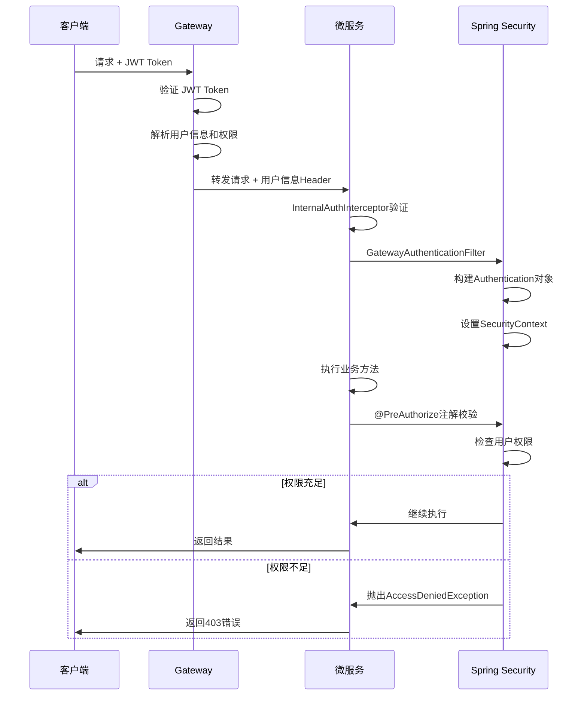
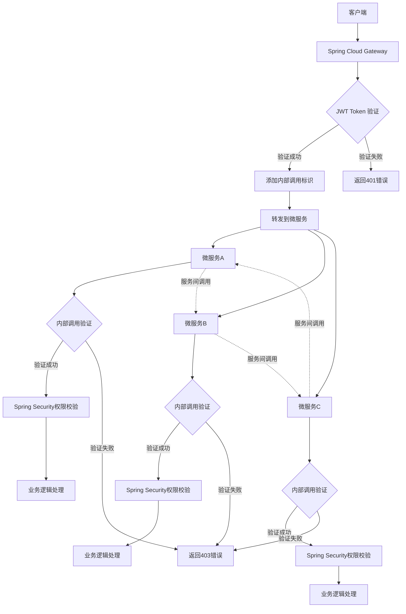

# 🌐 SpringCloud Gateway 网关详解 <Badge type="warning" text="核心技能" />

## 📖 简介

SpringCloud Gateway 是 Spring Cloud 生态系统中的 API 网关，基于 Spring 5、Spring Boot 2 和 Project Reactor 构建。它提供了一种简单而有效的方式来对 API 进行路由，并为它们提供横切关注点，如：安全性、监控/指标和弹性。

## 🔐 微服务网关统一鉴权方案 <Badge type="tip" text="企业级" />

### 🔧 SpringCloud Gateway + Spring Security 集成方案 <Badge type="danger" text="重点" />

### 📦 依赖配置


## 🔒 Spring Security 注解权限校验 <Badge type="warning" text="核心技能" />

### 🎯 问题分析

通过了网关校验后，Spring Security的注解权限校验**会生效**，但需要正确配置用户认证信息。

::: tip 关键点
网关验证通过后，需要在微服务中重新构建 Spring Security 的认证上下文，这样 `@PreAuthorize`、`@Secured` 等注解才能正常工作。
:::

### ⚙️ 微服务 Security 配置

```java
@Configuration
@EnableWebSecurity
@EnableGlobalMethodSecurity(prePostEnabled = true, securedEnabled = true)
@Slf4j
public class MicroServiceSecurityConfig {
    
    @Bean
    public SecurityFilterChain filterChain(HttpSecurity http) throws Exception {
        return http
            .csrf().disable()
            .sessionManagement().sessionCreationPolicy(SessionCreationPolicy.STATELESS)
            .authorizeHttpRequests(authz -> authz
                .requestMatchers("/actuator/**", "/public/**").permitAll()
                .anyRequest().authenticated()
            )
            // 添加自定义认证过滤器
            .addFilterBefore(gatewayAuthenticationFilter(), UsernamePasswordAuthenticationFilter.class)
            .exceptionHandling(exceptions -> exceptions
                .authenticationEntryPoint(authenticationEntryPoint())
                .accessDeniedHandler(accessDeniedHandler())
            )
            .build();
    }
    
    @Bean
    public GatewayAuthenticationFilter gatewayAuthenticationFilter() {
        return new GatewayAuthenticationFilter();
    }
    
    @Bean
    public AuthenticationEntryPoint authenticationEntryPoint() {
        return (request, response, authException) -> {
            response.setStatus(HttpStatus.UNAUTHORIZED.value());
            response.setContentType("application/json;charset=UTF-8");
            response.getWriter().write(
                "{ \"code\": 401, \"message\": \"认证失败: " + authException.getMessage() + "\" }"
            );
        };
    }
    
    @Bean
    public AccessDeniedHandler accessDeniedHandler() {
        return (request, response, accessDeniedException) -> {
            response.setStatus(HttpStatus.FORBIDDEN.value());
            response.setContentType("application/json;charset=UTF-8");
            response.getWriter().write(
                "{ \"code\": 403, \"message\": \"权限不足: " + accessDeniedException.getMessage() + "\" }"
            );
        };
    }
}
```

### 🔍 网关认证过滤器

```java
@Component
@Slf4j
public class GatewayAuthenticationFilter extends OncePerRequestFilter {
    
    @Override
    protected void doFilterInternal(HttpServletRequest request, HttpServletResponse response, 
                                  FilterChain filterChain) throws ServletException, IOException {
        
        // 从请求头中获取用户信息（网关已验证并添加）
        String userId = request.getHeader("X-User-Id");
        String username = request.getHeader("X-Username");
        String authoritiesStr = request.getHeader("X-Authorities");
        
        if (StringUtils.hasText(username) && StringUtils.hasText(authoritiesStr)) {
            try {
                // 解析权限信息
                List<String> authorityList = Arrays.asList(authoritiesStr.split(","));
                List<GrantedAuthority> authorities = authorityList.stream()
                    .map(SimpleGrantedAuthority::new)
                    .collect(Collectors.toList());
                
                // 创建认证对象
                UsernamePasswordAuthenticationToken authentication = 
                    new UsernamePasswordAuthenticationToken(username, null, authorities);
                
                // 设置用户详细信息
                Map<String, Object> details = new HashMap<>();
                details.put("userId", userId);
                details.put("username", username);
                details.put("authorities", authorityList);
                authentication.setDetails(details);
                
                // 设置到 Spring Security 上下文
                SecurityContextHolder.getContext().setAuthentication(authentication);
                
                log.debug("设置用户认证信息: username={}, authorities={}", username, authorityList);
                
            } catch (Exception e) {
                log.error("解析用户认证信息失败: {}", e.getMessage());
                SecurityContextHolder.clearContext();
            }
        }
        
        filterChain.doFilter(request, response);
    }
    
    @Override
    protected boolean shouldNotFilter(HttpServletRequest request) throws ServletException {
        String path = request.getRequestURI();
        // 跳过不需要认证的路径
        return path.startsWith("/actuator") || path.startsWith("/public");
    }
}
```

### 🎪 权限注解使用示例

```java
@RestController
@RequestMapping("/api/user")
@Slf4j
public class UserController {
    
    /**
     * 需要 ADMIN 角色才能访问
     */
    @GetMapping("/admin/list")
    @PreAuthorize("hasRole('ADMIN')")
    public ResponseEntity<List<User>> getAllUsers() {
        // 获取当前用户信息
        Authentication auth = SecurityContextHolder.getContext().getAuthentication();
        log.info("当前用户: {}, 权限: {}", auth.getName(), auth.getAuthorities());
        
        List<User> users = userService.getAllUsers();
        return ResponseEntity.ok(users);
    }
    
    /**
     * 需要 USER 或 ADMIN 角色
     */
    @GetMapping("/profile")
    @PreAuthorize("hasAnyRole('USER', 'ADMIN')")
    public ResponseEntity<User> getUserProfile() {
        String currentUserId = UserContextHolder.getCurrentUserId();
        User user = userService.getUserById(currentUserId);
        return ResponseEntity.ok(user);
    }
    
    /**
     * 只能访问自己的信息或者管理员可以访问所有
     */
    @GetMapping("/{userId}")
    @PreAuthorize("@userPermissionEvaluator.canAccessUser(authentication, #userId)")
    public ResponseEntity<User> getUser(@PathVariable String userId) {
        User user = userService.getUserById(userId);
        return ResponseEntity.ok(user);
    }
    
    /**
     * 需要特定权限
     */
    @PostMapping("/create")
    @PreAuthorize("hasAuthority('USER_CREATE')")
    public ResponseEntity<User> createUser(@RequestBody CreateUserRequest request) {
        User user = userService.createUser(request);
        return ResponseEntity.ok(user);
    }
    
    /**
     * 使用 @Secured 注解
     */
    @DeleteMapping("/{userId}")
    @Secured({"ROLE_ADMIN", "ROLE_SUPER_ADMIN"})
    public ResponseEntity<Void> deleteUser(@PathVariable String userId) {
        userService.deleteUser(userId);
        return ResponseEntity.ok().build();
    }
}
```

### 🔧 自定义权限评估器

```java
@Component("userPermissionEvaluator")
@Slf4j
public class UserPermissionEvaluator {
    
    /**
     * 检查用户是否可以访问指定用户信息
     */
    public boolean canAccessUser(Authentication authentication, String targetUserId) {
        if (authentication == null || !authentication.isAuthenticated()) {
            return false;
        }
        
        // 管理员可以访问所有用户信息
        if (hasRole(authentication, "ADMIN") || hasRole(authentication, "SUPER_ADMIN")) {
            return true;
        }
        
        // 用户只能访问自己的信息
        String currentUserId = getCurrentUserId(authentication);
        return Objects.equals(currentUserId, targetUserId);
    }
    
    /**
     * 检查是否有指定角色
     */
    private boolean hasRole(Authentication authentication, String role) {
        return authentication.getAuthorities().stream()
            .anyMatch(authority -> authority.getAuthority().equals("ROLE_" + role));
    }
    
    /**
     * 获取当前用户ID
     */
    private String getCurrentUserId(Authentication authentication) {
        if (authentication.getDetails() instanceof Map) {
            Map<String, Object> details = (Map<String, Object>) authentication.getDetails();
            return (String) details.get("userId");
        }
        return null;
    }
}
```

### 🎨 权限校验流程图



### 📝 配置文件示例

```yaml
# application.yml
spring:
  security:
    # 禁用默认的安全配置
    basic:
      enabled: false
    # 配置权限相关
    oauth2:
      resourceserver:
        jwt:
          # 如果使用 JWT 资源服务器配置
          issuer-uri: http://localhost:8080/auth

# 网关内部调用密钥
gateway:
  internal:
    secret: your-internal-secret-key

# 日志配置
logging:
  level:
    org.springframework.security: DEBUG
    com.yourpackage.security: DEBUG
```

### 🚀 使用示例

```java
@Service
@Slf4j
public class OrderService {
    
    @Autowired
    private InternalServiceClient internalServiceClient;
    
    /**
     * 创建订单 - 需要 USER 权限
     */
    @PreAuthorize("hasRole('USER')")
    public Order createOrder(CreateOrderRequest request) {
        // 获取当前用户信息
        String currentUserId = UserContextHolder.getCurrentUserId();
        log.info("用户 {} 创建订单", currentUserId);
        
        // 调用用户服务验证用户信息
        ResponseEntity<User> userResponse = internalServiceClient.get(
            "http://user-service/api/user/" + currentUserId, 
            User.class
        );
        
        if (!userResponse.getStatusCode().is2xxSuccessful()) {
            throw new BusinessException("用户信息验证失败");
        }
        
        // 调用库存服务检查库存
        ResponseEntity<Boolean> stockResponse = internalServiceClient.post(
            "http://inventory-service/api/inventory/check",
            request.getItems(),
            Boolean.class
        );
        
        if (!Boolean.TRUE.equals(stockResponse.getBody())) {
            throw new BusinessException("库存不足");
        }
        
        // 创建订单逻辑
        Order order = new Order();
        order.setUserId(currentUserId);
        order.setItems(request.getItems());
        order.setStatus(OrderStatus.PENDING);
        
        return orderRepository.save(order);
    }
    
    /**
     * 查询所有订单 - 需要 ADMIN 权限
     */
    @PreAuthorize("hasRole('ADMIN')")
    public List<Order> getAllOrders() {
        return orderRepository.findAll();
    }
    
    /**
     * 查询用户订单 - 用户只能查看自己的订单
     */
    @PreAuthorize("@orderPermissionEvaluator.canAccessUserOrders(authentication, #userId)")
    public List<Order> getUserOrders(String userId) {
        return orderRepository.findByUserId(userId);
    }
}
```

::: tip 总结
通过以上配置，Spring Security 的注解权限校验在微服务中完全生效：

1. **网关验证** - 验证 JWT token 并提取用户信息
2. **信息传递** - 通过 HTTP Header 传递用户信息到微服务
3. **上下文重建** - 在微服务中重新构建 Spring Security 认证上下文
4. **注解生效** - `@PreAuthorize`、`@Secured` 等注解正常工作
5. **权限校验** - 基于用户角色和权限进行细粒度控制
:::

## 🎯 最佳实践与注意事项 <Badge type="tip" text="经验总结" />

### ✅ 最佳实践

::: tip 安全建议
1. **Token 安全**
   - 使用强密钥生成 JWT
   - 设置合理的过期时间
   - 支持 Token 撤销机制

2. **内部调用安全**
   - 使用时间戳防重放攻击
   - 定期更换内部调用密钥
   - 记录所有内部调用日志

3. **权限设计**
   - 遵循最小权限原则
   - 使用角色和权限分离
   - 定期审计权限配置
:::

### ⚠️ 注意事项

::: warning 常见问题
1. **ThreadLocal 清理**
   - 必须在请求结束后清理 ThreadLocal
   - 避免内存泄漏

2. **异常处理**
   - 统一异常处理机制
   - 不要暴露敏感信息

3. **性能考虑**
   - 合理使用缓存
   - 避免频繁的权限查询
:::

### 🔧 配置检查清单

- [ ] Gateway JWT 验证配置
- [ ] 微服务内部鉴权拦截器
- [ ] Spring Security 配置
- [ ] 权限注解配置
- [ ] 异常处理配置
- [ ] 日志配置
- [ ] 内部调用密钥配置xml
<!-- SpringCloud Gateway -->
<dependency>
    <groupId>org.springframework.cloud</groupId>
    <artifactId>spring-cloud-starter-gateway</artifactId>
</dependency>

<!-- Spring Security -->
<dependency>
    <groupId>org.springframework.boot</groupId>
    <artifactId>spring-boot-starter-security</artifactId>
</dependency>

<!-- JWT 支持 -->
<dependency>
    <groupId>io.jsonwebtoken</groupId>
    <artifactId>jjwt-api</artifactId>
    <version>0.11.5</version>
</dependency>
<dependency>
    <groupId>io.jsonwebtoken</groupId>
    <artifactId>jjwt-impl</artifactId>
    <version>0.11.5</version>
</dependency>
<dependency>
    <groupId>io.jsonwebtoken</groupId>
    <artifactId>jjwt-jackson</artifactId>
    <version>0.11.5</version>
</dependency>

<!-- Redis 支持 -->
<dependency>
    <groupId>org.springframework.boot</groupId>
    <artifactId>spring-boot-starter-data-redis-reactive</artifactId>
</dependency>
```

### ⚙️ Security 配置类

```java
@Configuration
@EnableWebFluxSecurity
@Slf4j
public class GatewaySecurityConfig {
    
    @Autowired
    private AuthenticationManager authenticationManager;
    
    @Autowired
    private SecurityContextRepository securityContextRepository;
    
    @Bean
    public SecurityWebFilterChain securityWebFilterChain(ServerHttpSecurity http) {
        return http
            .csrf().disable()
            .formLogin().disable()
            .httpBasic().disable()
            .authenticationManager(authenticationManager)
            .securityContextRepository(securityContextRepository)
            .authorizeExchange(exchanges -> exchanges
                // 白名单路径
                .pathMatchers("/auth/login", "/auth/register", "/public/**").permitAll()
                .pathMatchers("/actuator/**").permitAll()
                .pathMatchers("/doc.html", "/webjars/**", "/swagger-resources/**").permitAll()
                // 其他请求需要认证
                .anyExchange().authenticated()
            )
            .exceptionHandling(exceptions -> exceptions
                .authenticationEntryPoint(authenticationEntryPoint())
                .accessDeniedHandler(accessDeniedHandler())
            )
            .build();
    }
    
    @Bean
    public ServerAuthenticationEntryPoint authenticationEntryPoint() {
        return (exchange, ex) -> {
            ServerHttpResponse response = exchange.getResponse();
            response.setStatusCode(HttpStatus.UNAUTHORIZED);
            response.getHeaders().add("Content-Type", "application/json;charset=UTF-8");
            
            String body = "{ \"code\": 401, \"message\": \"未认证或token已过期\", \"timestamp\": \"" 
                + LocalDateTime.now().format(DateTimeFormatter.ISO_LOCAL_DATE_TIME) + "\" }";
            
            DataBuffer buffer = response.bufferFactory().wrap(body.getBytes(StandardCharsets.UTF_8));
            return response.writeWith(Mono.just(buffer));
        };
    }
    
    @Bean
    public ServerAccessDeniedHandler accessDeniedHandler() {
        return (exchange, denied) -> {
            ServerHttpResponse response = exchange.getResponse();
            response.setStatusCode(HttpStatus.FORBIDDEN);
            response.getHeaders().add("Content-Type", "application/json;charset=UTF-8");
            
            String body = "{ \"code\": 403, \"message\": \"权限不足\", \"timestamp\": \"" 
                + LocalDateTime.now().format(DateTimeFormatter.ISO_LOCAL_DATE_TIME) + "\" }";
            
            DataBuffer buffer = response.bufferFactory().wrap(body.getBytes(StandardCharsets.UTF_8));
            return response.writeWith(Mono.just(buffer));
        };
    }
}
```

### 🔐 JWT 认证管理器

```java
@Component
@Slf4j
public class JwtAuthenticationManager implements ReactiveAuthenticationManager {
    
    @Autowired
    private JwtUtil jwtUtil;
    
    @Override
    public Mono<Authentication> authenticate(Authentication authentication) {
        String token = authentication.getCredentials().toString();
        
        return Mono.fromCallable(() -> {
            try {
                // 验证 JWT token
                Claims claims = jwtUtil.parseToken(token);
                String username = claims.getSubject();
                
                // 获取用户权限
                List<String> authorities = claims.get("authorities", List.class);
                List<GrantedAuthority> grantedAuthorities = authorities.stream()
                    .map(SimpleGrantedAuthority::new)
                    .collect(Collectors.toList());
                
                // 创建认证对象
                UsernamePasswordAuthenticationToken auth = 
                    new UsernamePasswordAuthenticationToken(username, null, grantedAuthorities);
                
                // 设置用户详细信息
                Map<String, Object> details = new HashMap<>();
                details.put("userId", claims.get("userId"));
                details.put("username", username);
                details.put("authorities", authorities);
                auth.setDetails(details);
                
                return auth;
            } catch (Exception e) {
                log.error("JWT token 验证失败: {}", e.getMessage());
                throw new BadCredentialsException("Invalid token");
            }
        }).cast(Authentication.class);
    }
}
```

### 🏪 Security 上下文仓库

```java
@Component
@Slf4j
public class JwtSecurityContextRepository implements ServerSecurityContextRepository {
    
    @Autowired
    private ReactiveAuthenticationManager authenticationManager;
    
    @Override
    public Mono<Void> save(ServerWebExchange exchange, SecurityContext context) {
        // Gateway 不需要保存上下文
        return Mono.empty();
    }
    
    @Override
    public Mono<SecurityContext> load(ServerWebExchange exchange) {
        ServerHttpRequest request = exchange.getRequest();
        String token = getTokenFromRequest(request);
        
        if (StringUtils.hasText(token)) {
            Authentication auth = new UsernamePasswordAuthenticationToken(token, token);
            return authenticationManager.authenticate(auth)
                .map(SecurityContextImpl::new);
        }
        
        return Mono.empty();
    }
    
    private String getTokenFromRequest(ServerHttpRequest request) {
        // 从 Header 中获取 token
        String authorization = request.getHeaders().getFirst("Authorization");
        if (StringUtils.hasText(authorization) && authorization.startsWith("Bearer ")) {
            return authorization.substring(7);
        }
        
        // 从 Cookie 中获取 token
        MultiValueMap<String, HttpCookie> cookies = request.getCookies();
        if (cookies.containsKey("token")) {
            return cookies.getFirst("token").getValue();
        }
        
        // 从查询参数中获取 token
        return request.getQueryParams().getFirst("token");
    }
}
```

### 🛠️ JWT 工具类

```java
@Component
@Slf4j
public class JwtUtil {
    
    @Value("${jwt.secret:mySecretKey}")
    private String secret;
    
    @Value("${jwt.expiration:86400}")
    private Long expiration;
    
    private Key getSigningKey() {
        byte[] keyBytes = Decoders.BASE64.decode(secret);
        return Keys.hmacShaKeyFor(keyBytes);
    }
    
    /**
     * 生成 JWT token
     */
    public String generateToken(String username, String userId, List<String> authorities) {
        Date now = new Date();
        Date expiryDate = new Date(now.getTime() + expiration * 1000);
        
        return Jwts.builder()
            .setSubject(username)
            .claim("userId", userId)
            .claim("authorities", authorities)
            .setIssuedAt(now)
            .setExpiration(expiryDate)
            .signWith(getSigningKey(), SignatureAlgorithm.HS512)
            .compact();
    }
    
    /**
     * 解析 JWT token
     */
    public Claims parseToken(String token) {
        return Jwts.parserBuilder()
            .setSigningKey(getSigningKey())
            .build()
            .parseClaimsJws(token)
            .getBody();
    }
    
    /**
     * 验证 token 是否有效
     */
    public boolean validateToken(String token) {
        try {
            parseToken(token);
            return true;
        } catch (JwtException | IllegalArgumentException e) {
            log.error("JWT token 验证失败: {}", e.getMessage());
            return false;
        }
    }
    
    /**
     * 从 token 中获取用户名
     */
    public String getUsernameFromToken(String token) {
        Claims claims = parseToken(token);
        return claims.getSubject();
    }
    
    /**
     * 检查 token 是否过期
     */
    public boolean isTokenExpired(String token) {
        Claims claims = parseToken(token);
        return claims.getExpiration().before(new Date());
    }
}
```

### 🎯 核心概念

在微服务架构中，网关统一鉴权是保障系统安全的重要环节。我们的子服务一般不能通过外网直接访问，必须通过网关转发才是一个合法的请求。

### 🛡️ 服务隔离策略 <Badge type="warning" text="核心技能" />

这种子服务与外网的隔离一般分为两种：

::: tip 物理隔离
子服务部署在指定的内网环境中，只有网关对外网开放
- ✅ 安全性最高
- ✅ 配置简单
- ❌ 部署复杂度高
- ❌ 成本较高
:::

::: warning 逻辑隔离
子服务与网关同时暴露在外网，但是子服务会有一个权限拦截层保证只接受网关发送来的请求，绕过网关直接访问子服务会被提示：无效请求
- ✅ 部署灵活
- ✅ 成本较低
- ❌ 需要额外的鉴权机制
- ❌ 安全性相对较低
:::

### 🔄 鉴权环节 <Badge type="danger" text="重点" />

第二种鉴权需求牵扯到以下几个环节：

1. **网关转发鉴权** - 验证外部请求的合法性
2. **服务间内部调用鉴权** - 验证服务间调用的合法性  
3. **服务相互调用鉴权** - 处理服务之间的相互调用
4. **Spring Security注解权限校验** - 通过网关校验后的权限验证

### 📊 架构设计图



## 🚀 网关转发鉴权机制 <Badge type="tip" text="实战" />

### 🔍 全局认证过滤器

```java
@Component
@Slf4j
@Order(-100)
public class GatewayAuthFilter implements GlobalFilter {
    
    @Autowired
    private JwtUtil jwtUtil;
    
    @Autowired
    private RedisTemplate<String, Object> redisTemplate;
    
    // 白名单路径
    private static final List<String> WHITELIST = Arrays.asList(
        "/auth/login", "/auth/register", "/public", "/actuator", "/doc.html"
    );
    
    @Override
    public Mono<Void> filter(ServerWebExchange exchange, GatewayFilterChain chain) {
        ServerHttpRequest request = exchange.getRequest();
        String path = request.getURI().getPath();
        
        // 检查是否在白名单中
        if (isWhitelisted(path)) {
            return chain.filter(exchange);
        }
        
        // 获取 token
        String token = getTokenFromRequest(request);
        if (!StringUtils.hasText(token)) {
            return unauthorizedResponse(exchange, "缺少认证token");
        }
        
        // 验证 token
        return validateToken(token)
            .flatMap(claims -> {
                if (claims != null) {
                    // 添加用户信息到请求头
                    ServerHttpRequest mutatedRequest = addUserInfoToHeaders(request, claims);
                    ServerWebExchange mutatedExchange = exchange.mutate()
                        .request(mutatedRequest)
                        .build();
                    
                    return chain.filter(mutatedExchange);
                } else {
                    return unauthorizedResponse(exchange, "token验证失败");
                }
            })
            .onErrorResume(throwable -> {
                log.error("认证过程中发生错误: {}", throwable.getMessage());
                return unauthorizedResponse(exchange, "认证失败");
            });
    }
    
    private boolean isWhitelisted(String path) {
        return WHITELIST.stream().anyMatch(path::startsWith);
    }
    
    private String getTokenFromRequest(ServerHttpRequest request) {
        // 从 Authorization header 获取
        String authorization = request.getHeaders().getFirst("Authorization");
        if (StringUtils.hasText(authorization) && authorization.startsWith("Bearer ")) {
            return authorization.substring(7);
        }
        
        // 从 Cookie 获取
        MultiValueMap<String, HttpCookie> cookies = request.getCookies();
        if (cookies.containsKey("token")) {
            return cookies.getFirst("token").getValue();
        }
        
        // 从查询参数获取
        return request.getQueryParams().getFirst("token");
    }
    
    private Mono<Claims> validateToken(String token) {
        return Mono.fromCallable(() -> {
            try {
                // 验证 JWT token
                Claims claims = jwtUtil.parseToken(token);
                
                // 检查 Redis 中的 token 状态（可选，用于支持 token 撤销）
                String tokenKey = "token:" + claims.getSubject() + ":" + token.hashCode();
                Boolean exists = redisTemplate.hasKey(tokenKey);
                
                if (Boolean.FALSE.equals(exists)) {
                    log.warn("Token 已被撤销: {}", token);
                    return null;
                }
                
                return claims;
            } catch (Exception e) {
                log.error("Token 验证失败: {}", e.getMessage());
                return null;
            }
        });
    }
    
    private ServerHttpRequest addUserInfoToHeaders(ServerHttpRequest request, Claims claims) {
        return request.mutate()
            .header("X-User-Id", claims.get("userId", String.class))
            .header("X-Username", claims.getSubject())
            .header("X-Authorities", String.join(",", claims.get("authorities", List.class)))
            .header("X-Gateway-Auth", "true") // 标识来自网关的请求
            .build();
    }
    
    private Mono<Void> unauthorizedResponse(ServerWebExchange exchange, String message) {
        ServerHttpResponse response = exchange.getResponse();
        response.setStatusCode(HttpStatus.UNAUTHORIZED);
        response.getHeaders().add("Content-Type", "application/json;charset=UTF-8");
        
        String body = String.format(
            "{ \"code\": 401, \"message\": \"%s\", \"timestamp\": \"%s\" }",
            message,
            LocalDateTime.now().format(DateTimeFormatter.ISO_LOCAL_DATE_TIME)
        );
        
        DataBuffer buffer = response.bufferFactory().wrap(body.getBytes(StandardCharsets.UTF_8));
        return response.writeWith(Mono.just(buffer));
    }
}
```

## 🔐 服务间内部调用鉴权 <Badge type="warning" text="核心技能" />

### 🛡️ 微服务内部鉴权拦截器

```java
@Component
@Slf4j
public class InternalAuthInterceptor implements HandlerInterceptor {
    
    @Value("${gateway.internal.secret:internal-secret-key}")
    private String internalSecret;
    
    @Override
    public boolean preHandle(HttpServletRequest request, HttpServletResponse response, 
                           Object handler) throws Exception {
        
        String path = request.getRequestURI();
        
        // 检查是否来自网关的请求
        String gatewayAuth = request.getHeader("X-Gateway-Auth");
        if (!"true".equals(gatewayAuth)) {
            // 不是来自网关的请求，检查是否是内部服务调用
            if (!isInternalServiceCall(request)) {
                log.warn("非法请求，绕过网关直接访问: {}", path);
                response.setStatus(HttpStatus.FORBIDDEN.value());
                response.setContentType("application/json;charset=UTF-8");
                response.getWriter().write(
                    "{ \"code\": 403, \"message\": \"无效请求，请通过网关访问\" }"
                );
                return false;
            }
        }
        
        // 设置用户上下文信息
        setUserContext(request);
        
        return true;
    }
    
    private boolean isInternalServiceCall(HttpServletRequest request) {
        // 检查内部服务调用标识
        String internalToken = request.getHeader("X-Internal-Token");
        if (!StringUtils.hasText(internalToken)) {
            return false;
        }
        
        // 验证内部调用 token
        try {
            String expectedToken = generateInternalToken();
            return internalToken.equals(expectedToken);
        } catch (Exception e) {
            log.error("验证内部调用token失败: {}", e.getMessage());
            return false;
        }
    }
    
    private String generateInternalToken() {
        // 基于时间戳和密钥生成内部调用token（简化版本）
        long timestamp = System.currentTimeMillis() / (5 * 60 * 1000); // 5分钟有效期
        return DigestUtils.md5DigestAsHex((internalSecret + timestamp).getBytes());
    }
    
    private void setUserContext(HttpServletRequest request) {
        String userId = request.getHeader("X-User-Id");
        String username = request.getHeader("X-Username");
        String authorities = request.getHeader("X-Authorities");
        
        if (StringUtils.hasText(userId) && StringUtils.hasText(username)) {
            // 创建用户上下文
            UserContext userContext = UserContext.builder()
                .userId(userId)
                .username(username)
                .authorities(authorities != null ? Arrays.asList(authorities.split(",")) : Collections.emptyList())
                .build();
            
            // 设置到 ThreadLocal
            UserContextHolder.setContext(userContext);
        }
    }
    
    @Override
    public void afterCompletion(HttpServletRequest request, HttpServletResponse response, 
                              Object handler, Exception ex) throws Exception {
        // 清理 ThreadLocal
        UserContextHolder.clear();
    }
}
```

### 🔧 用户上下文管理

```java
@Data
@Builder
@NoArgsConstructor
@AllArgsConstructor
public class UserContext {
    private String userId;
    private String username;
    private List<String> authorities;
    
    public boolean hasAuthority(String authority) {
        return authorities != null && authorities.contains(authority);
    }
    
    public boolean hasAnyAuthority(String... authorities) {
        if (this.authorities == null) {
            return false;
        }
        return Arrays.stream(authorities)
            .anyMatch(this.authorities::contains);
    }
}

@Component
public class UserContextHolder {
    private static final ThreadLocal<UserContext> contextHolder = new ThreadLocal<>();
    
    public static void setContext(UserContext context) {
        contextHolder.set(context);
    }
    
    public static UserContext getContext() {
        return contextHolder.get();
    }
    
    public static void clear() {
        contextHolder.remove();
    }
    
    public static String getCurrentUserId() {
        UserContext context = getContext();
        return context != null ? context.getUserId() : null;
    }
    
    public static String getCurrentUsername() {
        UserContext context = getContext();
        return context != null ? context.getUsername() : null;
    }
    
    public static List<String> getCurrentAuthorities() {
        UserContext context = getContext();
        return context != null ? context.getAuthorities() : Collections.emptyList();
    }
}
```

### 🌐 服务间调用工具类

```java
@Component
@Slf4j
public class InternalServiceClient {
    
    @Autowired
    private RestTemplate restTemplate;
    
    @Value("${gateway.internal.secret:internal-secret-key}")
    private String internalSecret;
    
    /**
     * 服务间内部调用
     */
    public <T> ResponseEntity<T> callInternalService(String url, HttpMethod method, 
                                                   Object requestBody, Class<T> responseType) {
        
        HttpHeaders headers = new HttpHeaders();
        headers.setContentType(MediaType.APPLICATION_JSON);
        
        // 添加内部调用标识
        headers.set("X-Internal-Token", generateInternalToken());
        
        // 传递用户上下文信息
        UserContext userContext = UserContextHolder.getContext();
        if (userContext != null) {
            headers.set("X-User-Id", userContext.getUserId());
            headers.set("X-Username", userContext.getUsername());
            headers.set("X-Authorities", String.join(",", userContext.getAuthorities()));
        }
        
        HttpEntity<?> entity = new HttpEntity<>(requestBody, headers);
        
        try {
            return restTemplate.exchange(url, method, entity, responseType);
        } catch (Exception e) {
            log.error("内部服务调用失败: url={}, error={}", url, e.getMessage());
            throw new RuntimeException("内部服务调用失败", e);
        }
    }
    
    private String generateInternalToken() {
        long timestamp = System.currentTimeMillis() / (5 * 60 * 1000); // 5分钟有效期
        return DigestUtils.md5DigestAsHex((internalSecret + timestamp).getBytes());
    }
    
    /**
     * GET 请求
     */
    public <T> ResponseEntity<T> get(String url, Class<T> responseType) {
        return callInternalService(url, HttpMethod.GET, null, responseType);
    }
    
    /**
     * POST 请求
     */
    public <T> ResponseEntity<T> post(String url, Object requestBody, Class<T> responseType) {
        return callInternalService(url, HttpMethod.POST, requestBody, responseType);
    }
    
    /**
     * PUT 请求
     */
    public <T> ResponseEntity<T> put(String url, Object requestBody, Class<T> responseType) {
        return callInternalService(url, HttpMethod.PUT, requestBody, responseType);
    }
    
    /**
     * DELETE 请求
     */
    public <T> ResponseEntity<T> delete(String url, Class<T> responseType) {
        return callInternalService(url, HttpMethod.DELETE, null, responseType);
    }
}
```

## 🎯 核心概念

### 🔗 Route（路由）
路由是网关的基本构建块。它由一个 ID、一个目标 URI、一组断言和一组过滤器定义。如果断言为真，则匹配该路由。

### 🎪 Predicate（断言）
这是一个 Java 8 的 Predicate。输入类型是一个 ServerWebExchange。我们可以使用它来匹配来自 HTTP 请求的任何内容，例如 headers 或参数。

### 🔧 Filter（过滤器）
这些是使用特定工厂构建的 GatewayFilter 的实例。在这里，我们可以在发送下游请求之前或之后修改请求和响应。

## 🚀 快速开始

### 📦 依赖配置

```xml
<dependency>
    <groupId>org.springframework.cloud</groupId>
    <artifactId>spring-cloud-starter-gateway</artifactId>
</dependency>
```

### ⚙️ 基础配置

```yaml
spring:
  cloud:
    gateway:
      routes:
        - id: user-service
          uri: http://localhost:8081
          predicates:
            - Path=/user/**
          filters:
            - StripPrefix=1
        - id: order-service
          uri: http://localhost:8082
          predicates:
            - Path=/order/**
          filters:
            - StripPrefix=1
```

## 🔍 全局过滤器 vs WebFilter 详解

### 🌍 全局过滤器（GlobalFilter）

全局过滤器是 SpringCloud Gateway 特有的过滤器，会对所有路由生效。

#### 📋 特点
- ✅ 专为网关设计，与路由系统深度集成
- ✅ 可以访问路由信息和网关上下文
- ✅ 支持异步非阻塞处理
- ✅ 可以修改请求和响应
- ✅ 支持过滤器链的顺序控制

#### 💻 实现示例

```java
@Component
@Slf4j
public class CustomGlobalFilter implements GlobalFilter, Ordered {
    
    @Override
    public Mono<Void> filter(ServerWebExchange exchange, GatewayFilterChain chain) {
        ServerHttpRequest request = exchange.getRequest();
        ServerHttpResponse response = exchange.getResponse();
        
        log.info("全局过滤器 - 请求路径: { }", request.getPath());
        
        // 前置处理
        return chain.filter(exchange).then(Mono.fromRunnable(() -> {
            // 后置处理
            log.info("全局过滤器 - 响应状态: { }", response.getStatusCode());
        }));
    }
    
    @Override
    public int getOrder() {
        return -1; // 数值越小，优先级越高
    }
}
```

### 🕸️ WebFilter

WebFilter 是 Spring WebFlux 的标准过滤器，适用于整个 WebFlux 应用。

#### 📋 特点
- ✅ Spring WebFlux 标准过滤器
- ✅ 适用于所有 WebFlux 应用
- ✅ 在网关处理之前执行
- ❌ 无法直接访问路由信息
- ❌ 主要用于通用的 Web 处理

#### 💻 实现示例

```java
@Component
@Slf4j
public class CustomWebFilter implements WebFilter {
    
    @Override
    public Mono<Void> filter(ServerWebExchange exchange, WebFilterChain chain) {
        ServerHttpRequest request = exchange.getRequest();
        
        log.info("WebFilter - 请求URI: { }", request.getURI());
        
        // 添加自定义请求头
        ServerHttpRequest modifiedRequest = request.mutate()
            .header("X-Request-Time", String.valueOf(System.currentTimeMillis()))
            .build();
            
        ServerWebExchange modifiedExchange = exchange.mutate()
            .request(modifiedRequest)
            .build();
            
        return chain.filter(modifiedExchange);
    }
}
```

### 📊 对比总结

| 特性 | GlobalFilter | WebFilter |
|------|-------------|-----------|
| 🎯 **适用范围** | SpringCloud Gateway 专用 | 所有 WebFlux 应用 |
| 🔄 **执行时机** | 路由匹配后 | 请求处理前 |
| 📍 **访问路由信息** | ✅ 可以 | ❌ 不可以 |
| 🎛️ **控制粒度** | 细粒度控制 | 粗粒度控制 |
| 🚀 **性能** | 针对网关优化 | 通用性能 |
| 🔧 **使用场景** | 路由相关处理、权限校验 | 通用请求处理、日志记录 |

## ❌ 自定义错误信息返回

### 🎨 全局异常处理器

```java
@Component
@Slf4j
public class GlobalExceptionHandler implements ErrorWebExceptionHandler {
    
    private final ObjectMapper objectMapper = new ObjectMapper();
    
    @Override
    public Mono<Void> handle(ServerWebExchange exchange, Throwable ex) {
        ServerHttpResponse response = exchange.getResponse();
        
        if (response.isCommitted()) {
            return Mono.error(ex);
        }
        
        // 设置响应头
        response.getHeaders().add("Content-Type", "application/json;charset=UTF-8");
        
        String body = "";
        if (ex instanceof NotFoundException) {
            response.setStatusCode(HttpStatus.NOT_FOUND);
            body = buildErrorResponse(404, "服务不可用", ex.getMessage());
        } else if (ex instanceof TimeoutException) {
            response.setStatusCode(HttpStatus.GATEWAY_TIMEOUT);
            body = buildErrorResponse(504, "请求超时", "服务响应超时，请稍后重试");
        } else {
            response.setStatusCode(HttpStatus.INTERNAL_SERVER_ERROR);
            body = buildErrorResponse(500, "系统错误", "系统内部错误，请联系管理员");
        }
        
        DataBuffer buffer = response.bufferFactory().wrap(body.getBytes(StandardCharsets.UTF_8));
        return response.writeWith(Mono.just(buffer));
    }
    
    private String buildErrorResponse(int code, String message, String detail) {
        try {
            Map<String, Object> result = new HashMap<>();
            result.put("code", code);
            result.put("message", message);
            result.put("detail", detail);
            result.put("timestamp", LocalDateTime.now().format(DateTimeFormatter.ISO_LOCAL_DATE_TIME));
            return objectMapper.writeValueAsString(result);
        } catch (Exception e) {
            log.error("构建错误响应失败", e);
            return "{ \"code\": 500, \"message\": \"系统错误\" }";
        }
    }
}
```

### 🎯 自定义网关过滤器异常处理

```java
@Component
@Slf4j
public class ErrorHandlerFilter implements GlobalFilter, Ordered {
    
    @Override
    public Mono<Void> filter(ServerWebExchange exchange, GatewayFilterChain chain) {
        return chain.filter(exchange)
            .onErrorResume(throwable -> {
                ServerHttpResponse response = exchange.getResponse();
                
                if (throwable instanceof ConnectTimeoutException) {
                    return handleError(response, 504, "连接超时", "无法连接到目标服务");
                } else if (throwable instanceof ReadTimeoutException) {
                    return handleError(response, 504, "读取超时", "服务响应超时");
                } else {
                    return handleError(response, 500, "网关错误", "网关处理请求时发生错误");
                }
            });
    }
    
    private Mono<Void> handleError(ServerHttpResponse response, int status, String message, String detail) {
        response.setStatusCode(HttpStatus.valueOf(status));
        response.getHeaders().add("Content-Type", "application/json;charset=UTF-8");
        
        String body = String.format(
            "{ \"code\": %d, \"message\": \"%s\", \"detail\": \"%s\", \"timestamp\": \"%s\" }",
            status, message, detail, LocalDateTime.now().format(DateTimeFormatter.ISO_LOCAL_DATE_TIME)
        );
        
        DataBuffer buffer = response.bufferFactory().wrap(body.getBytes(StandardCharsets.UTF_8));
        return response.writeWith(Mono.just(buffer));
    }
    
    @Override
    public int getOrder() {
        return -1;
    }
}
```

## 🔐 网关权限校验

### 🛡️ JWT 权限校验过滤器

```java
@Component
@Slf4j
public class AuthGlobalFilter implements GlobalFilter, Ordered {
    
    private final JwtUtil jwtUtil;
    private final RedisTemplate<String, String> redisTemplate;
    
    // 白名单路径
    private static final List<String> WHITELIST = Arrays.asList(
        "/auth/login",
        "/auth/register",
        "/public/**"
    );
    
    public AuthGlobalFilter(JwtUtil jwtUtil, RedisTemplate<String, String> redisTemplate) {
        this.jwtUtil = jwtUtil;
        this.redisTemplate = redisTemplate;
    }
    
    @Override
    public Mono<Void> filter(ServerWebExchange exchange, GatewayFilterChain chain) {
        ServerHttpRequest request = exchange.getRequest();
        String path = request.getPath().value();
        
        // 检查白名单
        if (isWhitelist(path)) {
            return chain.filter(exchange);
        }
        
        // 获取token
        String token = getToken(request);
        if (StringUtils.isEmpty(token)) {
            return unauthorizedResponse(exchange, "缺少认证token");
        }
        
        try {
            // 验证token
            Claims claims = jwtUtil.parseToken(token);
            String userId = claims.getSubject();
            
            // 检查token是否在黑名单中
            if (isTokenBlacklisted(token)) {
                return unauthorizedResponse(exchange, "token已失效");
            }
            
            // 将用户信息添加到请求头中，传递给下游服务
            ServerHttpRequest modifiedRequest = request.mutate()
                .header("X-User-Id", userId)
                .header("X-User-Name", claims.get("username", String.class))
                .build();
                
            ServerWebExchange modifiedExchange = exchange.mutate()
                .request(modifiedRequest)
                .build();
                
            return chain.filter(modifiedExchange);
            
        } catch (Exception e) {
            log.error("token验证失败: { }", e.getMessage());
            return unauthorizedResponse(exchange, "token验证失败");
        }
    }
    
    private boolean isWhitelist(String path) {
        return WHITELIST.stream().anyMatch(pattern -> {
            if (pattern.endsWith("/**")) {
                return path.startsWith(pattern.substring(0, pattern.length() - 3));
            }
            return path.equals(pattern);
        });
    }
    
    private String getToken(ServerHttpRequest request) {
        String authorization = request.getHeaders().getFirst("Authorization");
        if (StringUtils.hasText(authorization) && authorization.startsWith("Bearer ")) {
            return authorization.substring(7);
        }
        return null;
    }
    
    private boolean isTokenBlacklisted(String token) {
        return Boolean.TRUE.equals(redisTemplate.hasKey("blacklist:token:" + token));
    }
    
    private Mono<Void> unauthorizedResponse(ServerWebExchange exchange, String message) {
        ServerHttpResponse response = exchange.getResponse();
        response.setStatusCode(HttpStatus.UNAUTHORIZED);
        response.getHeaders().add("Content-Type", "application/json;charset=UTF-8");
        
        String body = String.format(
            "{ \"code\": 401, \"message\": \"%s\", \"timestamp\": \"%s\" }",
            message, LocalDateTime.now().format(DateTimeFormatter.ISO_LOCAL_DATE_TIME)
        );
        
        DataBuffer buffer = response.bufferFactory().wrap(body.getBytes(StandardCharsets.UTF_8));
        return response.writeWith(Mono.just(buffer));
    }
    
    @Override
    public int getOrder() {
        return -100; // 优先级较高，在其他过滤器之前执行
    }
}
```

## 🎭 Sa-Token 与网关集成

### 📚 Sa-Token 简介

Sa-Token 是一个轻量级 Java 权限认证框架，主要解决：登录认证、权限认证、Session会话、单点登录、OAuth2.0 等一系列权限相关问题。

### 🔧 集成配置

#### 1️⃣ 添加依赖

```xml
<!-- Sa-Token 权限认证，在线文档：https://sa-token.cc -->
<dependency>
    <groupId>cn.dev33</groupId>
    <artifactId>sa-token-spring-boot-starter</artifactId>
    <version>1.37.0</version>
</dependency>

<!-- Sa-Token 整合 SpringCloud Gateway -->
<dependency>
    <groupId>cn.dev33</groupId>
    <artifactId>sa-token-reactor-spring-boot-starter</artifactId>
    <version>1.37.0</version>
</dependency>

<!-- Sa-Token 整合 Redis -->
<dependency>
    <groupId>cn.dev33</groupId>
    <artifactId>sa-token-dao-redis-jackson</artifactId>
    <version>1.37.0</version>
</dependency>
```

#### 2️⃣ 配置文件

```yaml
# Sa-Token 配置
sa-token:
  # token 名称（同时也是 cookie 名称）
  token-name: satoken
  # token 有效期（单位：秒） 默认30天，-1 代表永久有效
  timeout: 2592000
  # token 最低活跃频率（单位：秒），如果 token 超过此时间没有访问系统就会被冻结，默认-1 代表不限制，永不冻结
  active-timeout: -1
  # 是否允许同一账号多地同时登录 （为 true 时允许一起登录, 为 false 时新登录挤掉旧登录）
  is-concurrent: true
  # 在多人登录同一账号时，是否共用一个 token （为 true 时所有登录共用一个 token, 为 false 时每次登录新建一个 token）
  is-share: true
  # token 风格（默认可取值：uuid、simple-uuid、random-32、random-64、random-128、tik）
  token-style: uuid
  # 是否输出操作日志
  is-log: true
```

#### 3️⃣ Sa-Token 网关权限校验过滤器

```java
@Component
@Slf4j
public class SaTokenGlobalFilter implements GlobalFilter, Ordered {
    
    // 白名单路径
    private static final List<String> WHITELIST = Arrays.asList(
        "/auth/login",
        "/auth/register",
        "/auth/logout",
        "/public/**",
        "/doc.html",
        "/webjars/**",
        "/swagger-resources/**",
        "/v2/api-docs/**"
    );
    
    @Override
    public Mono<Void> filter(ServerWebExchange exchange, GatewayFilterChain chain) {
        ServerHttpRequest request = exchange.getRequest();
        String path = request.getPath().value();
        
        // 检查白名单
        if (isWhitelist(path)) {
            return chain.filter(exchange);
        }
        
        try {
            // 检查登录状态
            SaRouter.match("/**").check(r -> StpUtil.checkLogin());
            
            // 获取当前登录用户信息
            String loginId = StpUtil.getLoginIdAsString();
            Object loginUser = StpUtil.getSession().get("user");
            
            // 将用户信息传递给下游服务
            ServerHttpRequest modifiedRequest = request.mutate()
                .header("X-User-Id", loginId)
                .header("X-User-Info", JSON.toJSONString(loginUser))
                .build();
                
            ServerWebExchange modifiedExchange = exchange.mutate()
                .request(modifiedRequest)
                .build();
                
            return chain.filter(modifiedExchange);
            
        } catch (NotLoginException e) {
            log.warn("用户未登录，访问路径: { }", path);
            return unauthorizedResponse(exchange, "用户未登录");
        } catch (Exception e) {
            log.error("权限校验异常: { }", e.getMessage());
            return unauthorizedResponse(exchange, "权限校验失败");
        }
    }
    
    private boolean isWhitelist(String path) {
        return WHITELIST.stream().anyMatch(pattern -> {
            if (pattern.endsWith("/**")) {
                return path.startsWith(pattern.substring(0, pattern.length() - 3));
            }
            return path.equals(pattern);
        });
    }
    
    private Mono<Void> unauthorizedResponse(ServerWebExchange exchange, String message) {
        ServerHttpResponse response = exchange.getResponse();
        response.setStatusCode(HttpStatus.UNAUTHORIZED);
        response.getHeaders().add("Content-Type", "application/json;charset=UTF-8");
        
        Map<String, Object> result = new HashMap<>();
        result.put("code", 401);
        result.put("message", message);
        result.put("timestamp", LocalDateTime.now().format(DateTimeFormatter.ISO_LOCAL_DATE_TIME));
        
        String body = JSON.toJSONString(result);
        DataBuffer buffer = response.bufferFactory().wrap(body.getBytes(StandardCharsets.UTF_8));
        return response.writeWith(Mono.just(buffer));
    }
    
    @Override
    public int getOrder() {
        return -100;
    }
}
```

### 🎯 权限校验过滤器（支持 @SaCheckPermission）

由于网关层无法直接使用 `@SaCheckPermission` 注解，我们需要在网关层实现权限校验逻辑：

```java
@Component
@Slf4j
public class SaTokenPermissionFilter implements GlobalFilter, Ordered {
    
    // 权限路径映射配置
    private static final Map<String, List<String>> PERMISSION_MAP = new HashMap<>();
    
    static {
        // 用户管理相关权限
        PERMISSION_MAP.put("/user/add", Arrays.asList("user:add"));
        PERMISSION_MAP.put("/user/delete/**", Arrays.asList("user:delete"));
        PERMISSION_MAP.put("/user/update/**", Arrays.asList("user:update"));
        PERMISSION_MAP.put("/user/list", Arrays.asList("user:list"));
        
        // 角色管理相关权限
        PERMISSION_MAP.put("/role/add", Arrays.asList("role:add"));
        PERMISSION_MAP.put("/role/delete/**", Arrays.asList("role:delete"));
        PERMISSION_MAP.put("/role/update/**", Arrays.asList("role:update"));
        PERMISSION_MAP.put("/role/list", Arrays.asList("role:list"));
        
        // 系统管理相关权限
        PERMISSION_MAP.put("/system/**", Arrays.asList("system:admin"));
    }
    
    @Override
    public Mono<Void> filter(ServerWebExchange exchange, GatewayFilterChain chain) {
        ServerHttpRequest request = exchange.getRequest();
        String path = request.getPath().value();
        
        // 检查是否需要权限校验
        List<String> requiredPermissions = getRequiredPermissions(path);
        if (requiredPermissions.isEmpty()) {
            return chain.filter(exchange);
        }
        
        try {
            // 检查登录状态
            StpUtil.checkLogin();
            
            // 检查权限
            for (String permission : requiredPermissions) {
                StpUtil.checkPermission(permission);
            }
            
            log.info("权限校验通过，用户: { }, 路径: { }, 权限: { }", 
                StpUtil.getLoginIdAsString(), path, requiredPermissions);
                
            return chain.filter(exchange);
            
        } catch (NotLoginException e) {
            log.warn("用户未登录，访问路径: { }", path);
            return unauthorizedResponse(exchange, "用户未登录");
        } catch (NotPermissionException e) {
            log.warn("权限不足，用户: { }, 访问路径: { }, 缺少权限: { }", 
                StpUtil.getLoginIdAsString(), path, e.getPermission());
            return forbiddenResponse(exchange, "权限不足：" + e.getPermission());
        } catch (Exception e) {
            log.error("权限校验异常: { }", e.getMessage());
            return unauthorizedResponse(exchange, "权限校验失败");
        }
    }
    
    private List<String> getRequiredPermissions(String path) {
        for (Map.Entry<String, List<String>> entry : PERMISSION_MAP.entrySet()) {
            String pattern = entry.getKey();
            if (pathMatches(path, pattern)) {
                return entry.getValue();
            }
        }
        return Collections.emptyList();
    }
    
    private boolean pathMatches(String path, String pattern) {
        if (pattern.endsWith("/**")) {
            return path.startsWith(pattern.substring(0, pattern.length() - 3));
        } else if (pattern.contains("**")) {
            // 简单的通配符匹配
            String prefix = pattern.substring(0, pattern.indexOf("**"));
            return path.startsWith(prefix);
        } else {
            return path.equals(pattern);
        }
    }
    
    private Mono<Void> unauthorizedResponse(ServerWebExchange exchange, String message) {
        return buildErrorResponse(exchange, HttpStatus.UNAUTHORIZED, 401, message);
    }
    
    private Mono<Void> forbiddenResponse(ServerWebExchange exchange, String message) {
        return buildErrorResponse(exchange, HttpStatus.FORBIDDEN, 403, message);
    }
    
    private Mono<Void> buildErrorResponse(ServerWebExchange exchange, HttpStatus status, int code, String message) {
        ServerHttpResponse response = exchange.getResponse();
        response.setStatusCode(status);
        response.getHeaders().add("Content-Type", "application/json;charset=UTF-8");
        
        Map<String, Object> result = new HashMap<>();
        result.put("code", code);
        result.put("message", message);
        result.put("timestamp", LocalDateTime.now().format(DateTimeFormatter.ISO_LOCAL_DATE_TIME));
        
        String body = JSON.toJSONString(result);
        DataBuffer buffer = response.bufferFactory().wrap(body.getBytes(StandardCharsets.UTF_8));
        return response.writeWith(Mono.just(buffer));
    }
    
    @Override
    public int getOrder() {
        return -90; // 在登录校验之后执行
    }
}
```

### 🔄 业务服务改造

在使用网关后，业务服务需要进行相应改造：

#### 1️⃣ 移除业务服务的权限校验

```java
// 原来的业务服务代码
@RestController
@RequestMapping("/user")
public class UserController {
    
    // ❌ 网关集成后，这个注解可以移除，权限校验在网关层完成
    // @SaCheckPermission("user:add")
    @PostMapping("/add")
    public Result addUser(@RequestBody User user, HttpServletRequest request) {
        // 从请求头获取用户信息（网关传递）
        String userId = request.getHeader("X-User-Id");
        String userInfo = request.getHeader("X-User-Info");
        
        // 业务逻辑处理
        return userService.addUser(user);
    }
    
    // ✅ 如果需要在业务层再次校验，可以保留
    @SaCheckPermission("user:delete")
    @DeleteMapping("/delete/{ id}")
    public Result deleteUser(@PathVariable Long id) {
        return userService.deleteUser(id);
    }
}
```

#### 2️⃣ 配置用户权限获取

```java
@Component
public class StpInterfaceImpl implements StpInterface {
    
    @Autowired
    private UserService userService;
    
    @Autowired
    private RoleService roleService;
    
    /**
     * 返回一个账号所拥有的权限码集合
     */
    @Override
    public List<String> getPermissionList(Object loginId, String loginType) {
        // 根据用户ID查询权限列表
        return userService.getPermissionsByUserId(loginId.toString());
    }
    
    /**
     * 返回一个账号所拥有的角色标识集合
     */
    @Override
    public List<String> getRoleList(Object loginId, String loginType) {
        // 根据用户ID查询角色列表
        return roleService.getRolesByUserId(loginId.toString());
    }
}
```

### 📋 配置文件完整示例

```yaml
server:
  port: 8080

spring:
  application:
    name: gateway-service
  cloud:
    gateway:
      routes:
        - id: user-service
          uri: lb://user-service
          predicates:
            - Path=/user/**
        - id: auth-service
          uri: lb://auth-service
          predicates:
            - Path=/auth/**
  redis:
    host: localhost
    port: 6379
    database: 0

# Sa-Token 配置
sa-token:
  token-name: satoken
  timeout: 2592000
  active-timeout: -1
  is-concurrent: true
  is-share: true
  token-style: uuid
  is-log: true
  # 配置 Sa-Token 单独使用的 Redis 连接
  alone-redis:
    database: 1
```

## 🎉 总结

通过以上配置，我们实现了：

1. **🔐 统一认证**：在网关层统一处理用户登录状态校验
2. **🛡️ 权限控制**：在网关层实现细粒度的权限校验，替代原有的 `@SaCheckPermission` 注解
3. **📊 用户信息传递**：将用户信息通过请求头传递给下游服务
4. **❌ 统一异常处理**：在网关层统一处理认证和权限异常
5. **⚡ 性能优化**：避免每个服务都进行重复的权限校验

这样既保持了 Sa-Token 的强大功能，又充分利用了网关的统一入口优势，实现了更好的架构设计。

::: tip 💡 提示
在实际项目中，建议根据具体业务需求调整权限映射配置，并考虑使用配置中心来动态管理权限规则。
:::

::: warning ⚠️ 注意
使用网关权限校验后，需要确保下游服务的安全性，避免绕过网关直接访问服务。建议在服务间通信中使用内网或添加额外的安全验证。
:::