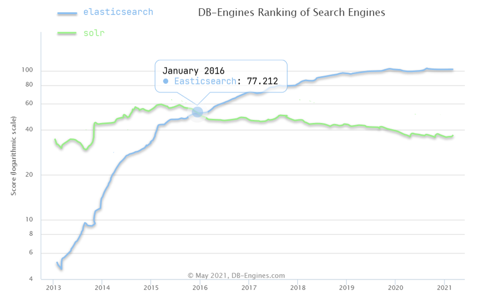
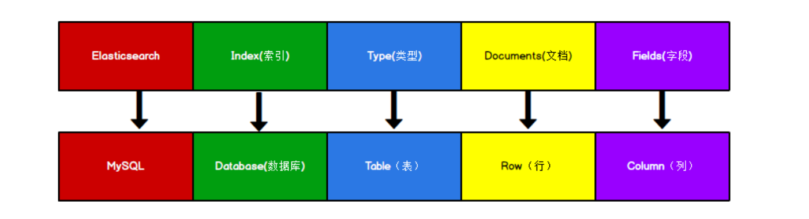
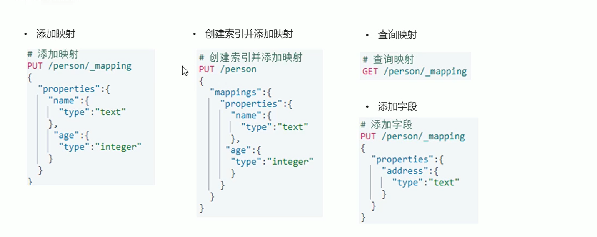
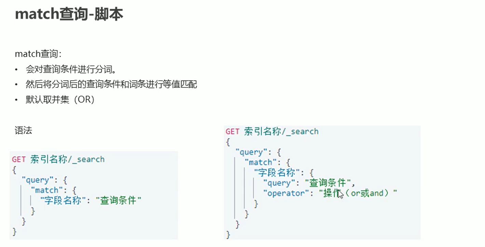
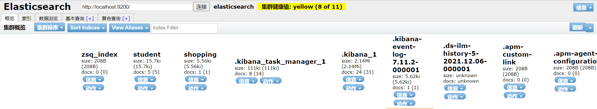
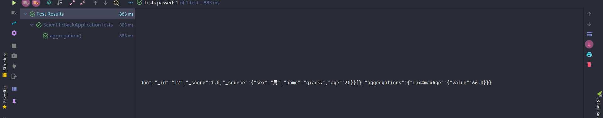

# Elasticsearch

> [!NOTE]
> 参考接口文档（Apifox）：[接口文档](https://s.apifox.cn/e1c073e0-53d6-451f-8649-117ad4d8b021)

###  

The Elastic Stack, 包括 `Elasticsearch`、`Kibana`、`Beats` 和 `Logstash`（也称为 `ELK Stack`）。 能够安全可靠地获取任何来源、任何格式的数据，然后实时地对数据进行搜索、分析和可视 化。Elaticsearch，简称为 ES，ES 是一个开源的高扩展的分布式全文搜索引擎，是整个 Elastic  Stack 技术栈的核心。它可以近乎实时的存储、检索数据；本身扩展性很好，可以扩展到上 百台服务器，处理 PB 级别的数据。

**elasticsearch是一款非常强大的开源搜索引擎，具备非常多强大功能，可以帮助我们从海量数据中快速找到需要的内容**

例如：

- 在GitHub搜索代码

  

- 在电商网站搜索商品

  

- 在百度搜索答案

  

- 在打车软件搜索附近的车

  

### ELK技术栈

elasticsearch结合kibana、Logstash、Beats，也就是elastic stack（ELK）。被广泛应用在日志数据分析、实时监控等领域：

而elasticsearch是elastic stack的核心，负责存储、搜索、分析数据。

### elasticsearch和lucene

elasticsearch底层是基于**lucene**来实现的。

**Lucene**是一个Java语言的搜索引擎类库，是Apache公司的顶级项目，由DougCutting于1999年研发。官网地址：https://lucene.apache.org/ 。

**elasticsearch**的发展历史：

- 2004年Shay Banon基于Lucene开发了Compass
- 2010年Shay Banon 重写了Compass，取名为Elasticsearch。

### 为什么不是其他搜索技术？

目前比较知名的搜索引擎技术排名：

虽然在早期，Apache Solr是最主要的搜索引擎技术，但随着发展elasticsearch已经渐渐超越了Solr，独占鳌头：

### 总结

什么是elasticsearch？

- 一个开源的分布式搜索引擎，可以用来实现搜索、日志统计、分析、系统监控等功能

什么是elastic stack（ELK）？

- 是以elasticsearch为核心的技术栈，包括beats、Logstash、kibana、elasticsearch

什么是Lucene？

- 是Apache的开源搜索引擎类库，提供了搜索引擎的核心API

## 倒排索引

### 全文搜索引擎

Google，百度类的网站搜索，它们都是根据网页中的关键字生成索引，我们在搜索的时候输入关键字，它们会将该关键字即索引匹配到的所有网页返回；还有常见的项目中应用日志的搜索等等。对于这些非结构化的数据文本，关系型数据库搜索不是能很好的支持。 **一般传统数据库，全文检索都实现的很鸡肋，因为一般也没人用数据库存文本字段。进行全文检索需要扫描整个表，如果数据量大的话即使对 SQL 的语法优化，也收效甚微。建立了索引，但是维护起来也很麻烦，对于 insert 和 update 操作都会重新构建索引。**

**基于以上原因可以分析得出，在一些生产环境中，使用常规的搜索方式，性能是非常差的**：

- 搜索的数据对象是大量的非结构化的文本数据。
- 文件记录量达到数十万或数百万个甚至更多。
- 支持大量基于交互式文本的查询。 
- 需求非常灵活的全文搜索查询。
- 对高度相关的搜索结果的有特殊需求，但是没有可用的关系数据库可以满足。
- 对不同记录类型、非文本数据操作或安全事务处理的需求相对较少的情况。 为了解决结构化数据搜索和非结构化数据搜索性能问题，我们就需要专业，健壮，强大的全 文搜索引擎

这里说到的全文搜索引擎指的是目前广泛应用的主流搜索引擎。它的工作原理是计算机 索引程序通过扫描文章中的每一个词，对每一个词建立一个索引，指明该词在文章中出现的次数和位置，当用户查询时，检索程序就根据事先建立的索引进行查找，并将查找的结果反 馈给用户的检索方式。这个过程类似于通过字典中的检索字表查字的过程

### Elasticsearch 应用案例 

`GitHub`: 2013 年初，抛弃了 Solr，采取 Elasticsearch 来做 PB 级的搜索。"GitHub 使用 Elasticsearch 搜索 20TB 的数据，包括 13 亿文件和 1300 亿行代码"。 

`维基百科`：启动以 Elasticsearch 为基础的核心搜索架构 

`SoundCloud`："SoundCloud 使用 Elasticsearch 为 1.8 亿用户提供即时而精准的音乐搜索 服务"。 

`百度`：目前广泛使用 Elasticsearch 作为文本数据分析，采集百度所有服务器上的各类指 标数据及用户自定义数据，通过对各种数据进行多维分析展示，辅助定位分析实例异常 或业务层面异常。目前覆盖百度内部 20 多个业务线（包括云分析、网盟、预测、文库、 直达号、钱包、风控等），单集群最大 100 台机器，200 个 ES 节点，每天导入 30TB+ 数据。 

`新浪`：使用 Elasticsearch 分析处理 32 亿条实时日志。 

`阿里`：使用 Elasticsearch 构建日志采集和分析体系。 

`Stack Overflow`：解决 Bug 问题的网站，全英文，编程人员交流的网站。

## Elasticsearch 入门

### 基本信息

下载软件 Elasticsearch 的官方地址：https://www.elastic.co/cn/

我们选择 7.11.2版本 下载地址：https://www.elastic.co/cn/downloads/past-releases#elasticsearch

Elasticsearch 分为 Linux 和 Windows 版本，基于我们主要学习的是 Elasticsearch 的 Java 客户端的使用，所以课程中使用的是安装较为简便的 Windows 版本。

下载完成后解压放到自己习惯放的目录下，Windows 版的 Elasticsearch 的安装很简单，解压即安装完毕，解压后的 Elasticsearch 的 目录结构如下

| 目录      | 含义           |
| --------- | -------------- |
| `bin`     | 可执行脚本目录 |
| `config`  | 配置目录       |
| `jdk `    | 内置 JDK 目录  |
| `lib`     | 类库           |
| `logs`    | 日志目录       |
| `modules` | 模块目录       |
| `plugins` | 插件目录       |

> bin    启动文件
> config 配置文件目录
> 1og4j2 日志配置文件
> vm.options java虚拟机相关的配置(默认启动占1g内存，内容不够需要自己调整)
> elasticsearch.yml elasticsearch的配置文件! 默认9200端口!跨域!
> 1ib  相关jar包
> modules 功能模块目录
> plugins 插件目录 ik分词器

解压后，进入 bin 文件目录，点击 elasticsearch.bat 文件启动 ES 服务

> 注意：9300 端口为 Elasticsearch 集群间组件的通信端口，9200 端口为浏览器访问的 http 协议 RESTful 端口。

访问[localhost:9200](http://localhost:9200/)

> [!TIP]
> 如遇启动或连接问题，可先检查 JDK 版本、内存限制与端口占用。

问题解决 

- Elasticsearch 是使用 java 开发的，且 7.8 版本的 ES 需要 JDK 版本 1.8 以上，默认安装 包带有 jdk 环境，如果系统配置 JAVA_HOME，那么使用系统默认的 JDK，如果没有配 置使用自带的 JDK，一般建议使用系统配置的 JDK。 
- 双击启动窗口闪退，通过路径访问追踪错误，如果是"空间不足"，请修改 `config/jvm.options` 配置文件

#### elasticSearch控制台的中文乱码问题

因为中国境内默认GBK，但conf中是没配置，所以要自行配置，在config文件里修改 jvm.options 编码改为GBK

~~~sh
-Dfile.encoding=GBK
~~~

### 安装elasticsearch-head插件

### postman客户端安装

如果直接通过浏览器向 Elasticsearch 服务器发请求，那么需要在发送的请求中包含 HTTP 标准的方法，而 HTTP 的大部分特性且仅支持 GET 和 POST 方法。所以为了能方便 地进行客户端的访问，可以使用 Postman 软件

Postman 是一款强大的网页调试工具，提供功能强大的 Web API 和 HTTP 请求调试。 软件功能强大，界面简洁明晰、操作方便快捷，设计得很人性化。Postman 中文版能够发送任何类型的 HTTP 请求 (GET, HEAD, POST, PUT..)，不仅能够表单提交，且可以附带任意类型请求体。

### 安装kibana

Kibana是一个针对ElasticSearch的开源分析及可视化平台，用来搜索、查看交互存储在Elasticsearch索引中的数据。使用Kibana ，可以通过各种图表进行高级数据分析及展示。Kibana让海量数据更容易理解。它操作简单，基于浏览器的用户界面可以快速创建仪表板( dashboard )实时显示Elasticsearch查询动态。设置Kibana非常简单。无需编码或者额外的基础架构，几分钟内就可以完成Kibana安装并启动Elasticsearch索引监测。

官网：https://www.elastic.co/cn/kibana/

下载地址[Past Releases of Elastic Stack Software | Elastic](https://www.elastic.co/cn/downloads/past-releases#kibana)，**选择和elasticsearch版本对应的版本号下载**

**解压即可（尽量将ElasticSearch相关工具放在统一目录下）**

接着修改以下配置，要不然会报500内部错误

- 修改`config/kibana.yml`中的server.host为本机的ip地址。
- 将数组`elasticsearch-hosts`内部的localhost改为elasticsearch的ip地址+端口。
- 设置`server.name`: "自己起一个名字"

然后在bin目录下找到`kibana.bat` 双击启动,访问[Home - Elastic](http://localhost:5601)

测试开发工具（Postman、curl、head、谷歌浏览器插件）或者使用kinbana下的dev-tools，如图

#### kibana汉化

::: details 汉化步骤（点击展开） {open}
只需要修改配置即可

我们发现在以下路径`kibana-7.11.2-windows-x86_64\x-pack\plugins\translations\translations`有一个国际化的配置，里面有个中文的json配置文件

也就是说我们可以修改配置，让他变成中文，编辑器打开`kibana解压目录/config/kibana.yml`,修改以下配置

重启kibana，汉化成功

:::

### 安装IK分词器(elasticsearch插件)

> 中文分词器
>
> 分词：即把一段中文或者别的划分成一个个的关键字，我们在搜索时候会把自己的信息进行分词，会把数据库中或者索引库中的数据进行分词，然后进行一一个匹配操作，默认的中文分词是将每个字看成一个词（不使用用IK分词器的情况下）
>
> IK提供了两个分词算法: (ik_smart和ik_max_word )，其中ik_smart为最少切分，ik_max_word为最细粒度划分!
>
> ik_max_word：会将文本做最细粒度的拆分，例如「中华人民共和国国歌」会被拆分为「中华人民共和国、中华人民、中华、华人、人民共和国、人民、人、民、共和国、共和、和、国国、国歌」，会穷尽各种可能的组合；
>
> ik_smart：会将文本做最粗粒度的拆分，例如「中华人民共和国国歌」会被拆分为「中华人民共和国、国歌」

1、下载

版本要与ElasticSearch版本对应，它的顺序是乱的，如果没找到，往后翻。

下载地址：[Releases · medcl/elasticsearch-analysis-ik (github.com)](https://github.com/medcl/elasticsearch-analysis-ik/releases?page=2)

2、安装

解压重命名为lk放入到es对应的plugins下即可。

**重启观察ES，看ik插件是否被加载了**

使用kibana测试,查看不同的分词效果

**ik_smart：最少切分**

**ik_max_word：最细粒度划分（穷尽词库的可能）**

有时候有些词我们不希望被拆分，而是当成一个整体，比如说`我叫小阿giao`,`阿giao`不被拆开，这种自己需要的词，需要自己加到我们的分词器的字典中

#### ik 分词器增加自己的配置

添加自定义的词添加到扩展字典中，创建 `zsq.dic` 字典文件(文件名自己起)，添加自己需要形式的字典内容

**然后再elasticsearch目录/plugins/ik/config/IKAnalyzer.cfg.xml导入该字典文件**

**重启ElasticSearch，再次使用kibana测试**

重启报错

**错误原因：**"failed to obtain node locks"的原因通常是没有获得这个lock文件的操作权限，node.lock被其他进程使用了。我们之前没有正常关闭服务，我们只需要`CTRL+C`就能关掉

**解决方案：**

1. windows系统下的操作如下

**查找ES进程**

~~~sh
netstat -ano|findstr 9200
~~~

**杀掉进程**

~~~sh
taskkill /f /t /im 6228
~~~

**再次重启，再次使用kibana测试**

## ElasticSearch核心概念

### 数据格式 

Elasticsearch 是面向文档型数据库，一条数据在这里就是一个文档。为了方便大家理解， 我们将 Elasticsearch 里存储文档数据和关系型数据库 MySQL 存储数据的概念进行一个类比

很多人第一次学习ES，看到基本概念后瞬间懵逼了，这是啥玩意呀，乱七八糟！别急，我整理了一下ES和mysql相关的基本概念的对比表格，先看一下：

| ES             | MySql    |
| -------------- | -------- |
| 字段           | 列       |
| 文档           | 一行数据 |
| 类型（已废弃） | 表       |
| 索引           | 数据库   |

#### 节点（node）

一个节点就是一个ES实例，其实本质上就是一个java进程；
节点的名称可以通过配置文件配置，或者在启动的时候使用-E node.name=ropledata指定，默认是随机分配的。建议咱们自己指定，因为节点名称对于管理目的很重要，咱们可以通过节点名称确定网络中的哪些服务器对应于ES集群中的哪些节点；
ES的节点类型主要分为如下几种：
Master Eligible节点：每个节点启动后，默认就是Master Eligible节点，可以通过设置node.master: false 来禁止。Master Eligible可以参加选主流程，并成为Master节点（当第一个节点启动后，它会将自己选为Master节点）；注意：每个节点都保存了集群的状态，只有Master节点才能修改集群的状态信息。
Data节点：可以保存数据的节点。主要负责保存分片数据，利于数据扩展。
Coordinating 节点：负责接收客户端请求，将请求发送到合适的节点，最终把结果汇集到一起
注意：每个节点默认都起到了Coordinating node的职责。一般在开发环境中一个节点可以承担多个角色，但是在生产环境中，还是设置单一的角色比较好，因为有助于提高性能。

#### 索引（Index）

索引就相当于MySql里的数据库，它是具有某种相似特性的文档集合。反过来说不同特性的文档一般都放在不同的索引里；
索引的名称必须全部是小写；
在单个集群中，可以定义任意多个索引；
索引具有mapping和setting的概念，mapping用来定义文档字段的类型，setting用来定义不同数据的分布。
除了这些常用的概念，我们还需要知道节点概念的作用，因此咱们接着往下看！

##### 正排索引和倒排索引

对于搜索引擎来讲：

`正排索引`是文档 Id 到文档内容、单词的关联关系。也就是说可以通过 Id获取到文档的内容。

`倒排索引`是单词到文档 Id 的关联关系。也就是说了一通过单词搜索到文档 Id。

**倒排索引的查询流程是：首先根据关键字搜索到对应的文档 Id，然后根据正排索引查询文档 Id 的完整内容，最后返回给用户想要的结果。**

> 我们发现倒排索引，只用到了id 和 关键字 ，和表关系一点都没有，这就是为什么后来没有`类型（Type）`的原因

elasticsearch使用的是一种称为倒排索引 |的结构，采用Lucene倒排索作为底层。这种结构适用于快速的全文搜索，一个索引由文档中所有不重复的列表构成，对于每一个词，都有一个包含它的文档列表。 例如，现在有两个文档，每个文档包含如下内容:

> Study every day， good good up to forever  # 文档1包含的内容
> To forever， study every day，good good up  # 文档2包含的内容

为创建倒排索引，我们首先要将每个文档拆分成独立的词(或称为词条或者tokens) ，然后创建一一个包含所有不重复的词条的排序列表，然后列出每个词条出现在哪个文档:

| term    | doc_1 | doc_2 |
| ------- | ----- | ----- |
| Study   | √     | x     |
| To      | x     | x     |
| every   | √     | √     |
| forever | √     | √     |
| day     | √     | √     |
| study   | x     | √     |
| good    | √     | √     |
| every   | √     | √     |
| to      | √     | x     |
| up      | √     | √     |

现在，我们试图搜索 to forever，只需要查看包含每个词条的文档

| term    | doc_1 | doc_2 |
| ------- | ----- | ----- |
| to      | √     | x     |
| forever | √     | √     |
| total   | 2     | 1     |

两个文档都匹配，但是第一个文档比第二个匹配程度更高。如果没有别的条件，现在，这两个包含关键字的文档都将返回。

#### 类型（Type）

类型就相当于MySql里的表，我们知道MySql里一个库下可以有很多表，最原始的时候ES也是这样，一个索引下可以有很多类型，但是从6.0版本开始，type已经被逐渐废弃，但是这时候一个索引仍然可以设置多个类型，**一直到7.0版本开始，一个索引就只能创建一个类型了（_doc）**。这一点，大家要注意，网上很多资料都是旧版本的，没有对这点进行说明。

#### 文档（Document）

我们知道Java是面向对象的，**而Elasticsearch是面向文档的，也就是说文档是所有可搜索数据的最小单元**。ES的文档就像MySql中的一条记录，只是ES的文档会被序列化成json格式，保存在Elasticsearch中；

这个json对象是由字段组成，字段就相当于Mysql的列，每个字段都有自己的类型（字符串、数值、布尔、二进制、日期范围类型）；

当我们创建文档时，如果不指定字段的类型，Elasticsearch会帮我们自动匹配类型；

**每个文档都有一个ID，类似MySql的主键，咱们可以自己指定，也可以让Elasticsearch自动生成**；

**文档的json格式支持数组/嵌套**，在一个索引（数据库）或类型（表）里面，你可以存储任意多的文档。

注意：虽然在实际存储上，文档存在于某个索引里，但是文档必须被赋予一个索引下的类型才可以。

#### 字段（Field）

相当于是数据表的字段，对文档数据根据不同属性进行的分类标识。

#### 映射（Mapping）

**mapping 是处理数据的方式和规则方面做一些限制**，如：**某个字段的数据类型、默认值、 分析器、是否被索引等等**。这些都是映射里面可以设置的，其它就是处理 ES 里面数据的一 些使用规则设置也叫做映射，按着最优规则处理数据对性能提高很大，因此才需要建立映射， 并且需要思考如何建立映射才能对性能更好。

#### 分片（shard）

**分片相当于mysql分库分表操作，用来解决一个索引可能存储超出单个节点硬件限制的大量数据的问题。**

比如，一个具有 10 亿文档数据 的索引占据 1TB 的磁盘空间，而任一节点都可能没有这样大的磁盘空间。或者单个节点处 理搜索请求，响应太慢。为了解决这个问题，Elasticsearch 提供了将索引划分成多份的能力， 每一份就称之为分片。当你创建一个索引的时候，你可以指定你想要的分片的数量。每个分 片本身也是一个功能完善并且独立的"索引"，这个"索引"可以被放置到集群中的任何节点 上。

**疑问二：分片有什么好处和注意事项呢？**

通过分片技术，咱们可以水平拆分数据量，同时它还支持跨碎片（可能在多个节点上）分布和并行操作，从而提高性能/吞吐量；

ES可以完全自动管理分片的分配和文档的聚合来完成搜索请求，并且对用户完全透明；
主分片数在索引创建时指定，后续只能通过Reindex修改，但是较麻烦，一般不进行修改。

#### 副本分片（replica shard）

在一个网络 / 云的环境里，失败随时都可能发生，在**某个分片/节点不知怎么的就处于 离线状态，或者由于任何原因消失了，这种情况下，有一个故障转移机制是非常有用并且是 强烈推荐的。为此目的，Elasticsearch 允许你创建分片的一份或多份拷贝，这些拷贝叫做复 制分片(副本)**。

**疑问三：副本分片有什么作用和注意事项呢？**

当分片或者节点发生故障时提供高可用性。因此，需要注意的是，副本分片永远不会分配到复制它的原始或主分片所在的节点上；

可以提高扩展搜索量和吞吐量，因为ES允许在所有副本上并行执行搜索；

**默认情况下，ES中的每个索引都分配5个主分片，并为每个主分片分配1个副本分片**。主分片在创建索引时指定，不能修改，副本分片可以修改。

## ElasticSearch操作

Elasticsearch是一个基于RESTful风格的搜索引擎。Elasticsearch采用的是REST风格API，其API本质上也就是一次http请求,**PUT（修改），POST（添加），DELETE（删除），GET（查询）。其中在ES里面PUT和POST的界限并不是很分明，有时候PUT也作为添加。**

### 索引操作

#### 创建索引

对比关系型数据库，创建索引就等同于创建数据库 在 Postman 中，向 ES 服务器发`PUT` (一定是put,而不能为post请求)请求 ：http://127.0.0.1:9200/shopping，其中`http://127.0.0.1:9200`是我们的**es服务器的地址**，`shopping`就是我们要**创建的索引名称**（也就是我们数据库中称的数据库）

如果重复添加索引，会返回错误信息

创建索引并添加映射，指定使用我们安装的ik分词器中的ik_max_word模式

#### 查看所有索引

在 Postman 中，向 ES 服务器发 GET 请求 ：http://127.0.0.1:9200/_cat/indices?v

这里请求路径中的`_cat `表示**查看**的意思，`indices` 表示**索引**，所以整体含义就是查看当前 ES 服务器中的所有索引，就好像 MySQL 中的 show tables 的感觉，服务器响应结果如下

> 初步检索 ： _cat
> `GET /_cat/nodes`: 查看所有节点
> `GET/_cat/health`:查看es健康状况
> `GET /_cat/master`:查看主节点
> `GET /_cat/indice`: 查看所有索引show databases;

| 表头             | 含义                                                         |
| ---------------- | ------------------------------------------------------------ |
| `health`         | 当前服务器健康状态： green(集群完整) yellow(单点正常、集群不完整) red(单点不正常) |
| `status`         | 索引打开、关闭状态                                           |
| `index`          | 索引名                                                       |
| `uuid`           | 索引统一编号                                                 |
| `pri`            | 主分片数量                                                   |
| `rep`            | 副本数量                                                     |
| `docs.count`     | 可用文档数量                                                 |
| `docs.deleted`   | 文档删除状态（逻辑删除）                                     |
| `store.size`     | 主分片和副分片整体占空间大小                                 |
| `pri.store.size` | 主分片占空间大小                                             |

​           

#### 查看单个索引

在 Postman 中，向 ES 服务器发 GET 请求 ：http://127.0.0.1:9200/shopping

~~~json
{
 "shopping"【索引名】: { 
 "aliases"【别名】: {},
 "mappings"【映射】: {},
 "settings"【设置】: {
 "index"【设置 - 索引】: {
 "creation_date"【设置 - 索引 - 创建时间】: "1614265373911",
 "number_of_shards"【设置 - 索引 - 主分片数量】: "1",
 "number_of_replicas"【设置 - 索引 - 副分片数量】: "1",
 "uuid"【设置 - 索引 - 唯一标识】: "eI5wemRERTumxGCc1bAk2A",
 "version"【设置 - 索引 - 版本】: {
 "created": "7080099"
 },
 "provided_name"【设置 - 索引 - 名称】: "shopping"
 }
 }
 }
}

~~~

#### 删除索引

在 Postman 中，向 ES 服务器发 DELETE 请求 ：http://127.0.0.1:9200/shopping

重新访问索引时，服务器返回响应：索引不存在

### 映射操作

### 文档操作

文档类型

#### 创建文档

索引已经创建好了，接下来我们来创建文档，并添加数据。这里的文档可以类比为关系型数 据库中的表数据，添加的数据格式为 JSON 格式 在 Postman 中，向 ES 服务器发 `POST` 请求 ：http://127.0.0.1:9200/shopping/_doc ,`-doc`表示文档数据，**如果不指定id,此处发送请求的方式必须为 POST，不能是 PUT，否则会发生错误,如果指定了id,两者都可以**，请求体内容为：

~~~json
{
 "title":"小米手机",
 "category":"小米",
 "images":"http://www.gulixueyuan.com/xm.jpg",
 "price":3999.00
}
~~~

~~~json
{
 "_index"【索引】: "shopping",
 "_type"【类型-文档】: "_doc",
 "_id"【唯一标识】: "xoaYk30BpIQS7W3RC1Up", #可以类比为 MySQL 中的主键，随机生成
 "_version"【版本】: 1,
 "result"【结果】: "created", #这里的 create 表示创建成功
 "_shards"【分片】: {
 "total"【分片 - 总数】: 2,
 "successful"【分片 - 成功】: 1,
 "failed"【分片 - 失败】: 0
 },
 "_seq_no": 0,
 "_primary_term": 1
}
~~~

上面的数据创建后，由于没有指定数据唯一性标识（ID），默认情况下，ES 服务器会随机 生成一个。 如果想要自定义唯一性标识，需要在创建时指定：http://127.0.0.1:9200/shopping/_doc/自己写一个id

此处需要注意：如果增加数据时明确数据主键，那么请求方式也可以为 PUT

#### 查看文档

##### 查询索引下的某条数据

查看文档时，需要指明文档的唯一性标识，类似于 MySQL 中数据的主键查询 在 Postman 中，向 ES 服务器发 GET 请求 ：http://127.0.0.1:9200/shopping/_doc/自己之前创建文档指定的id

如果查询一个不存在的id，他会说false,没找到。

##### 查询索引下的所有数据

发送get请求： http://127.0.0.1:9200/shopping/_search

#### 修改文档

和新增文档一样，输入相同的 URL 地址请求，如果请求体变化，会将原有的数据内容覆盖 在 Postman 中，向 ES 服务器发 POST 请求 ：http://127.0.0.1:9200/shopping/_doc/1001 请求体内容为:

~~~json
{
 "title":"华为手机",
 "category":"华为",
 "images":"http://www.gulixueyuan.com/hw.jpg",
 "price":4999.00
}
~~~

修改成功后，服务器响应结果：

查询验证结果

#### 修改字段

修改数据时，也可以只修改某一给条数据的局部信息

在 Postman 中，向 ES 服务器发 POST 请求 ：http://127.0.0.1:9200/shopping/_update/1001 请求体内容为：

~~~json
{ 
 "doc": {
 "price":3000.00
 } 
}
~~~

查询验证结果

#### 删除文档

删除一个文档不会立即从磁盘上移除，它只是被标记成已删除（逻辑删除）。 在 Postman 中，向 ES 服务器发 DELETE 请求 ：http://127.0.0.1:9200/shopping/_doc/1001

删除后再查询当前文档信息

如果删除一个并不存在的文档

#### 高级查询

Elasticsearch 提供了基于 JSON 提供完整的查询 DSL 来定义查询

创建多个文档

~~~json
# POST /student/_doc/1001
{
"name":"zhangsan",
"nickname":"zhangsan",
 "sex":"男",
 "age":30
}
# POST /student/_doc/1002
{
"name":"lisi",
"nickname":"lisi",
 "sex":"男",
 "age":20
}
# POST /student/_doc/1003
{
"name":"wangwu",
 "nickname":"wangwu",
 "sex":"女",
 "age":40
}
# POST /student/_doc/1004
{
"name":"zhangsan1",
"nickname":"zhangsan1",
 "sex":"女",
 "age":50
}
# POST /student/_doc/1005
{
"name":"zhangsan2",
"nickname":"zhangsan2",
 "sex":"女",
 "age":30
}

~~~

##### 查询所有文档

在 Postman 中，向 ES 服务器发 GET 请求 ：http://127.0.0.1:9200/student/_search 请求体如下

这种查询默认是展示10条数据，可以使用from和size来显示展示多少条

~~~json
{
 "query": {
 "match_all": {}
 }
}
# "query"：这里的 query 代表一个查询对象，里面可以有不同的查询属性
# "match_all"：查询类型，例如：match_all(代表查询所有)， match，term ， range 等等
# {查询条件}：查询条件会根据类型的不同，写法也有差异
~~~

##### 匹配查询

match 匹配类型查询，会把查询条件进行分词，然后进行查询，多个词条之间是 or 的关系 在 Postman 中，向 ES 服务器发 GET 请求 ：http://127.0.0.1:9200/student/_search ,请求体如下

~~~json
{
 "query": {
 	"match": {
		"name":"zhangsan"
		 }
 	}
}

~~~

##### 字段匹配查询

multi_match 与 match 类似，不同的是它可以在多个字段中查询。 在 Postman 中，向 ES 服务器发 GET 请求 ：http://127.0.0.1:9200/student/_search 请求体如下：

~~~json
{
 "query": {
 	"multi_match": {
 		"query": "zhangsan",
 		"fields": ["name","nickname"]
	}
 }
}
~~~

##### 关键字精确查询

term 查询，精确的关键词匹配查询，不对查询条件进行分词。 在 Postman 中，向 ES 服务器发 GET 请求 ：http://127.0.0.1:9200/student/_search ，请求体如下：

~~~json
{
 "query": {
 	"term": {
 		"name": {
 			"value": "zhangsan"
		 }
 	}
 }
}
~~~

##### 多关键字精确查询

terms 查询和 term 查询一样，但它允许你指定多值进行匹配。 如果这个字段包含了指定值中的任何一个值，那么这个文档满足条件，类似于 mysql 的 in 在 Postman 中，向 ES 服务器发 GET 请求 ：http://127.0.0.1:9200/student/_search ,请求体如下：

~~~json
{
 "query": {
 	"terms": {
 		"name": ["zhangsan","lisi"]
 	}
 }
}

~~~

##### 指定查询字段

默认情况下，Elasticsearch 在搜索的结果中，会把文档中保存在_source 的所有字段都返回。 如果我们只想获取其中的部分字段，我们可以添加_source 的过滤 在 Postman 中，向 ES 服务器发 GET 请求 ：http://127.0.0.1:9200/student/_search  ,请求体如下：

~~~json
{
 "_source": ["name","nickname"], 
 	"query": {
 		"terms": {
 			"nickname": ["zhangsan"]
 	}
 }
}
~~~

##### 过滤字段

我们也可以通过：

includes：来指定想要显示的字段  

excludes：来指定不想要显示的字段 

在 Postman 中，向 ES 服务器发 GET 请求 ：http://127.0.0.1:9200/student/_search ,请求体如下:

~~~json
{
 "_source": {
 	"includes": ["name","nickname"]
 }, 
 "query": {
	 "terms": {
 	   "nickname": ["zhangsan"]
  }
 }
}

{
 "_source": {
 	"excludes": ["name","nickname"]
 }, 
 "query": {
 	"terms": {
 	  "nickname": ["zhangsan"]
   }
 }
}
~~~

includes：来指定想要显示的字段  

 excludes：来指定不想要显示的字段 

##### queryString查询

##### 组合查询

`bool`对多个查询条件进行连接，把各种其它查询通过`must`（必须 ）、`must_not`（必须不）、`should`（应该）的方 式进行组合 在 Postman 中，向 ES 服务器发 GET 请求 ：http://127.0.0.1:9200/student/_search

~~~json
{
 "query": {
 	"bool": {
	  "must": [
 		{
		  "match": {
			 "name": "zhangsan"
			 }
 		}
 	],
		 "must_not": [
 		{
 			"match": {
 			  "age": "40"
 			}
		 }
	 ],
	 "should": [
	   {
		 "match": {
			 "sex": "男"
		 }
	 }
 	]
   }
 }
}

~~~

##### 范围查询

range 查询找出那些落在指定区间内的数字或者时间。range 查询允许以下字符

在 Postman 中，向 ES 服务器发 GET 请求 ：http://127.0.0.1:9200/student/_search

~~~json
{
 "query": {
 	"range": {
 	   "age": {
          "gte": 30,
          "lte": 50
 		}
 	}
 }
}
~~~

##### 模糊查询

前缀查询最好是keyword类型的

返回包含与搜索字词相似的字词的文档。 编辑距离是将一个术语转换为另一个术语所需的一个字符更改的次数。

这些更改可以包括：

- 更改字符（box → fox）
- 删除字符（black → lack）
- 插入字符（sic → sick） 
- 转置两个相邻字符（act → cat） 

为了找到相似的术语，fuzzy 查询会在指定的编辑距离内创建一组搜索词的所有可能的变体 或扩展。然后查询返回每个扩展的完全匹配。 通过 fuzziness 修改编辑距离。一般使用默认值 AUTO，根据术语的长度生成编辑距离。 在 Postman 中，向 ES 服务器发 GET 请求 ：http://127.0.0.1:9200/student/_search

~~~json
{
 "query": {
 	"fuzzy": {
 		"name": {
 		  "value": "zhangsan"
 	  }
 	}
 }
}

~~~

##### 单字段排序

sort 可以让我们按照不同的字段进行排序，并且通过 order 指定排序的方式。`desc` 降序，`asc` 升序。 在 Postman 中，向 ES 服务器发 GET 请求 ：http://127.0.0.1:9200/student/_search

~~~json
{
 "query": {
 	"match": {
 		"name":"zhangsan"
 	}
 },
 "sort": [{
 	"age": {
	   "order":"desc"
 	}
 }]
}

~~~

##### 多字段排序

假定我们想要结合使用 age 和 score 进行查询，并且匹配的结果首先按照年龄排序，然后 按照相关性得分排序 在 Postman 中，向 ES 服务器发 GET 请求 ：http://127.0.0.1:9200/student/_search

~~~json
{
 "query": {
 	"match_all": {}
 },
 "sort": [
 {
   "age": {
   "order": "desc"
  }
 },
 {
   "_score":{
   "order": "desc"
  }
 }
 ]
}
~~~

##### 高亮查询

在进行关键字搜索时，搜索出的内容中的关键字会显示不同的颜色，称之为高亮。

Elasticsearch 可以对查询内容中的关键字部分，进行标签和样式(高亮)的设置。 在使用 match 查询的同时，加上一个 highlight 属性：

- pre_tags：前置标签 
- post_tags：后置标签 
- fields：需要高亮的字段
- title：这里声明 title 字段需要高亮，后面可以为这个字段设置特有配置，也可以空 

在 Postman 中，向 ES 服务器发 GET 请求 ：http://127.0.0.1:9200/student/_search

~~~json
{
 "query": {
	 "match": {
 		"name": "zhangsan"
  }
 },
 "highlight": {
 	"pre_tags": "",
 	"post_tags": "",
	"fields": {
 	  "name": {}
	 }
 }
}
~~~

##### 分页查询

from：当前页的起始索引，默认从 0 开始。 from = (pageNum - 1) * size size：每页显示多少条 在 Postman 中，向 ES 服务器发 GET 请求 ：http://127.0.0.1:9200/student/_search

~~~json
{
 "query": {
 	"match_all": {}
 },
 "sort": [
 	{
 		"age": {
 		"order": "desc"
 	}
   }
 ],
 "from": 0,
 "size": 2
}
~~~

##### 聚合查询

聚合允许使用者对 es 文档进行统计分析，类似与关系型数据库中的 group by，当然还有很 多其他的聚合，例如取最大值、平均值等等。

**对某个字段取最大值 max** 

**对某个字段取最小值 min**

**对某个字段求和 sum**

**对某个字段取平均值 avg** 

**对某个字段的值进行去重之后再取总数**

在 Postman 中，向 ES 服务器发 GET 请求 ：http://127.0.0.1:9200/student/_search

~~~json
#对某个字段取最大值 max
{
 "aggs":{
 	"max_age":{
 	  "max":{"field":"age"}
 	}
 },
 "size":0
}
#对某个字段取最小值 min
{
 "aggs":{
 	"min_age":{
 	  "min":{"field":"age"}
 	}
 },
 "size":0
}
#对某个字段求和 sum
{
 "aggs":{
 	"sum_age":{
 	  "sum":{"field":"age"}
 	}
 },
 "size":0
}

#对某个字段取平均值 avg*
{
 "aggs":{
 	"avg_age":{
 	  "avg":{"field":"age"}
 	}
 },
 "size":0
}

#对某个字段的值进行去重之后再取总数
{
 "aggs":{
 	"distinct_age":{
 	  "cardinality":{"field":"age"}
 	}
 },
 "size":0
}

~~~

##### State 聚合

stats 聚合，对某个字段一次性返回 count，max，min，avg 和 sum 五个指标 在 Postman 中，向 ES 服务器发 GET 请求 ：http://127.0.0.1:9200/student/_search

~~~json
{
 "aggs":{
 	"stats_age":{
 	  "stats":{"field":"age"}
 	}
 },
 "size":0
}
~~~

##### 桶聚合查询

桶聚和相当于 sql 中的 group by 语句 

`terms` 聚合，分组统计,在 terms 分组下再进行聚合, 在 Postman 中，向 ES 服务器发 GET 请求 ：http://127.0.0.1:9200/student/_search

### 分词器的使用

## springboot集成ElasticSearch

官方文档：[Elastic Stack and Product Documentation | Elastic](https://www.elastic.co/guide/index.html)

找到客户端点击进去

点击自己的版本号进去

我们点击Getting Started 选择maven,

### 然后在我们的springboot工程里面导入我们的依赖

~~~xml
<dependency>
    <groupId>org.elasticsearch.client</groupId>
    <artifactId>elasticsearch-rest-high-level-client</artifactId>
    <version>7.12.1</version>
</dependency>
~~~

### 初始化

### 新建配置类

~~~java
@Configuration
public class ElasticSearchClientConfig {
    @Bean
    public RestHighLevelClient restHighLevelClient() {
        RestHighLevelClient client = new RestHighLevelClient(
            RestClient.builder(new HttpHost("127.0.0.1", 9200, "http"))
        );
        return client;
    }
}
~~~

### 索引操作

ES 服务器正常启动后，可以通过 Java API 客户端对象对 ES 索引进行操作

#### 创建索引

~~~java
@SpringBootTest
class ScientificBackApplicationTests {
  
    @Resource
    RestHighLevelClient client;
   

    // 测试索引的创建 request
    @Test
    void testCreateIndex() throws IOException {
        // 1、创建索引请求
        CreateIndexRequest request = new CreateIndexRequest("zsq_index");
        // 2、客户端执行请求 indexResponse, 请求后获得相应
        CreateIndexResponse createIndexResponse = client.indices().create(request, RequestOptions.DEFAULT);
        boolean acknowledged = createIndexResponse.isAcknowledged();
		// 响应状态
		System.out.println("操作状态 = " + acknowledged);
    }
}
~~~

#### 判断索引是否存在

~~~java
// 测试获取索引，只能判断其是否存在
@Test
    void testExistIndex() throws IOException {
        GetIndexRequest request = new GetIndexRequest("zsq_index");
        boolean exists = client.indices().exists(request, RequestOptions.DEFAULT);
        System.out.println(exists);
    }
~~~

#### 查看索引

~~~java
//查看索引
@Test
    void testSearchIndex() throws IOException {
        // 查询索引 - 请求对象
        GetIndexRequest request = new GetIndexRequest("zsq_index");
        // 发送请求，获取响应
        GetIndexResponse response = client.indices().get(request, RequestOptions.DEFAULT);
        System.out.println("aliases:"+response.getAliases());
        System.out.println("mappings:"+response.getMappings());
        System.out.println("settings:"+response.getSettings());
    }
~~~

#### 删除索引

~~~java
  // 删除索引
    @Test
    void testDeleteIndex() throws IOException {
        DeleteIndexRequest request = new DeleteIndexRequest("zsq_index");
        // 发送请求，获取响应
        AcknowledgedResponse delete = client.indices().delete(request, RequestOptions.DEFAULT);
        // 操作结果
        System.out.println("操作结果 ： "+delete.isAcknowledged());
    }
~~~

### 文档操作

#### 新增文档

**创建数据模型**

~~~java
@AllArgsConstructor
@NoArgsConstructor
@Builder
@Accessors(chain = true)
@Data
public class User {
    private String name;
    private Integer age;
    private String sex;
}
~~~

~~~java
 @Test
    void testAddDocument() throws IOException {
        // 创建对象
        User user = new User();
        user.setName("giao哥").setAge(30).setSex("男");
        // 创建请求
        IndexRequest request = new IndexRequest();
        // 规则 put /user/_doc/1001
        // 设置索引及唯一性标识
        request.index("user").id("1001");
		// 设置分片超时时间，以下两种方式均可
        request.timeout(TimeValue.timeValueDays(1));
        //    request.timeout("1");
        // 借助Hutool工具中的json工具类，将对象变成json字符串
        request.source(JSONUtil.toJsonStr(user), XContentType.JSON);
        // 客户端发送请求，获取响应结果
        IndexResponse indexResponse = client.index(request, RequestOptions.DEFAULT);
        System.out.println(indexResponse.toString());
        System.out.println(indexResponse.status());
        System.out.println("_index:" + indexResponse.getIndex());
        System.out.println("_id:" + indexResponse.getId());
        System.out.println("_result:" + indexResponse.getResult());
    }
~~~

#### 获取文档，判断是否存在

~~~java
   @Test
    void testIsExists() throws IOException {
        GetRequest request = new GetRequest("user", "1001");
        // 不获取返回的 _source 的上下文了
        //fetchSourceContext顾名思义，就是fetch source的上下文环境，提供更加完善的过滤逻辑，主要特性为支持include、exclude和支持通篇符过滤。
        request.fetchSourceContext(new FetchSourceContext(false));
        request.storedFields("_none_");
        boolean exists = client.exists(request, RequestOptions.DEFAULT);
        System.out.println(exists);
    }

~~~

#### 获取文档信息

~~~java
 // 获取文档信息
    @Test
    void testGetDocument() throws IOException {
        //获取文档 - 请求对象
        GetRequest request = new GetRequest("user", "1001");
        GetResponse getResponse = client.get(request, RequestOptions.DEFAULT);
        System.out.println("_index:" + getResponse.getIndex()); //索引
        System.out.println("_type:" + getResponse.getType());   //类型,7.0版本开始，一个索引就只能创建一个类型了（_doc）
        System.out.println("_id:" + getResponse.getId());  //id
        System.out.println("source:" + getResponse.getSourceAsString());// 打印文档的内容
    }
~~~

#### 修改文档

~~~java
// 更新文档的信息
    @Test
    void testUpdateDocument() throws IOException {
        //修改文档 - 请求对象
        UpdateRequest updateRequest = new UpdateRequest("user", "1001");
        updateRequest.timeout("1s");
        User user = new User();
        //配置修改参数
        user.setName("药水哥").setAge(30).setSex("男");
        // 设置请求体，对数据进行修改
        updateRequest.doc(JSONUtil.toJsonStr(user), XContentType.JSON);
        UpdateResponse updateResponse = client.update(updateRequest, RequestOptions.DEFAULT);
        System.out.println(updateResponse.status());
    }
~~~

#### 删除文档

~~~java
 // 删除文档记录
    @Test
    void testDeleteRequest() throws IOException {
        //创建删除请求对象
        DeleteRequest request = new DeleteRequest("user", "1001");
        request.timeout("1s");
        //客户端发送请求，获取响应对象
        DeleteResponse delete = client.delete(request, RequestOptions.DEFAULT);
        System.out.println(delete.toString());
        System.out.println(delete.status());
    }
~~~

### 批量操作

#### 批量插入

~~~java
// 批量插入
    @Test
    void testBulkRequest() throws IOException {
        //创建批量新增请求对象
        BulkRequest bulkRequest = new BulkRequest();
        bulkRequest.timeout("10s");
        ArrayList<User> list = new ArrayList<>();
        list.add(new User("药水哥", 30,"男"));
        list.add(new User("giao", 40,"男"));
        list.add(new User("张三", 18,"男"));
        list.add(new User("李四", 18,"女"));
        list.add(new User("王二", 20,"男"));
        list.add(new User("马宝国", 66,"男"));

        // 批处理请求
        for (int i = 0; i < list.size(); i++) {
            // 批量更新和批量删除，就在这里修改对应的请求就可以了
            bulkRequest.add(
                    new IndexRequest("user")
                            .id(Convert.toStr(i+1))//借助Hutool工具，转换为字符串
                            .source(JSONUtil.toJsonStr(list.get(i)), XContentType.JSON));
        }
        BulkResponse bulkResponse = client.bulk(bulkRequest, RequestOptions.DEFAULT);
        System.out.println("took:" + bulkResponse.getTook());//耗时
        System.out.println(bulkResponse.hasFailures());  // 是否失败,返回false代表成功
    }
~~~

#### 批量删除

~~~java
@Test
    void testBulkRequestDel() throws IOException {
        //创建批量删除请求对象
        BulkRequest request = new BulkRequest();
        for (int i = 0; i <4 ; i++) {
            request.add(new DeleteRequest().index("user").id(Convert.toStr(i+1)));
        }
        //客户端发送请求，获取响应对象
        BulkResponse responses = client.bulk(request, RequestOptions.DEFAULT);
        //打印结果信息
        System.out.println("took:" + responses.getTook());
        System.out.println("items:" + Arrays.toString(responses.getItems()));
    }
~~~

### 高级查询

#### 请求体查询

##### 查询所有索引数据

~~~java
 @Test
    void testSearch() throws IOException {
        // 创建搜索请求对象，指定索引名称为user
        SearchRequest searchRequest = new SearchRequest("user");
        // 构建查询的请求体
        SearchSourceBuilder sourceBuilder = new SearchSourceBuilder();
        // 查询所有数据
        sourceBuilder.query(QueryBuilders.matchAllQuery());
        searchRequest.source(sourceBuilder);

        SearchResponse response = client.search(searchRequest, RequestOptions.DEFAULT);
        // 查询匹配,获取命中对象
        SearchHits hits = response.getHits();
        System.out.println("took:" + response.getTook());
        System.out.println("timeout:" + response.isTimedOut());
        System.out.println("total:" + hits.getTotalHits());
        System.out.println("MaxScore:" + hits.getMaxScore());
        System.out.println("hits========>>");
        for (SearchHit hit : hits) {
            //输出每条查询的结果信息
            System.out.println(hit.getSourceAsString());
        }
        System.out.println("<<========");

    }
~~~

##### term 查询，查询条件为关键字

~~~java
    @Test
    void testSearchTerm() throws IOException {
        // 创建搜索请求对象
        SearchRequest searchRequest = new SearchRequest("user");
        // 构建查询的请求体
        SearchSourceBuilder sourceBuilder = new SearchSourceBuilder();
        sourceBuilder.query(QueryBuilders.termQuery("age", "66"));
        searchRequest.source(sourceBuilder);

        SearchResponse response = client.search(searchRequest, RequestOptions.DEFAULT);
        // 查询匹配
        SearchHits hits = response.getHits();
        System.out.println("took:" + response.getTook());
        System.out.println("timeout:" + response.isTimedOut());
        System.out.println("total:" + hits.getTotalHits());
        System.out.println("MaxScore:" + hits.getMaxScore());
        System.out.println("hits========>>");
        for (SearchHit hit : hits) {
        //输出每条查询的结果信息
            System.out.println(hit.getSourceAsString());
        }
        System.out.println("<<========");
    }
~~~

##### 分页查询

为了能够看出分页数据，我们需要在多加几条数据，执行之前的批量插入。

~~~java
 @Test
    void testSearchLimit() throws IOException {
        // 创建搜索请求对象
        SearchRequest searchRequest = new SearchRequest("user");
        // 构建查询的请求体
        SearchSourceBuilder sourceBuilder = new SearchSourceBuilder();
        sourceBuilder.query(QueryBuilders.matchAllQuery());
        // 分页查询
        // 当前页其实索引(第一条数据的顺序号)，from
        sourceBuilder.from(0);
        // 每页显示多少条 size
        sourceBuilder.size(4);
        searchRequest.source(sourceBuilder);
        SearchResponse response = client.search(searchRequest, RequestOptions.DEFAULT);
        // 查询匹配
        SearchHits hits = response.getHits();
        System.out.println("took:" + response.getTook());
        System.out.println("timeout:" + response.isTimedOut());
        System.out.println("total:" + hits.getTotalHits());
        System.out.println("MaxScore:" + hits.getMaxScore());
        System.out.println("hits========>>");
        for (SearchHit hit : hits) {
        //输出每条查询的结果信息
            System.out.println(hit.getSourceAsString());
        }
        System.out.println("<<========");
    }
~~~

##### 数据排序

~~~java
 @Test
    void DataSorting() throws IOException {
        // 创建搜索请求对象
        SearchRequest searchRequest = new SearchRequest("user");
        // 构建查询的请求体
        SearchSourceBuilder sourceBuilder = new SearchSourceBuilder();
        sourceBuilder.query(QueryBuilders.matchAllQuery());
        // 排序
        sourceBuilder.sort("age", SortOrder.ASC);//升序
        searchRequest.source(sourceBuilder);
        SearchResponse response = client.search(searchRequest, RequestOptions.DEFAULT);
        // 查询匹配
        SearchHits hits = response.getHits();
        System.out.println("took:" + response.getTook());
        System.out.println("timeout:" + response.isTimedOut());
        System.out.println("total:" + hits.getTotalHits());
        System.out.println("MaxScore:" + hits.getMaxScore());
        System.out.println("hits========>>");
        for (SearchHit hit : hits) {
        //输出每条查询的结果信息
            System.out.println(hit.getSourceAsString());
        }
        System.out.println("<<========");
    }
~~~

##### 过滤字段

~~~java
 @Test
    void FilterField() throws IOException {
        // 创建搜索请求对象
        SearchRequest searchRequest = new SearchRequest("user");
        // 构建查询的请求体
        SearchSourceBuilder sourceBuilder = new SearchSourceBuilder();
        sourceBuilder.query(QueryBuilders.matchAllQuery());
        //查询字段过滤
        String[] excludes = {};
        String[] includes = {"name", "age"};
        sourceBuilder.fetchSource(includes, excludes);
        searchRequest.source(sourceBuilder);
        SearchResponse response = client.search(searchRequest, RequestOptions.DEFAULT);
        // 查询匹配
        SearchHits hits = response.getHits();
        System.out.println("took:" + response.getTook());
        System.out.println("timeout:" + response.isTimedOut());
        System.out.println("total:" + hits.getTotalHits());
        System.out.println("MaxScore:" + hits.getMaxScore());
        System.out.println("hits========>>");
        for (SearchHit hit : hits) {
            //输出每条查询的结果信息
            System.out.println(hit.getSourceAsString());
        }
        System.out.println("<<========");
    }
~~~

##### Bool 查询

~~~java
@Test
    void Bool() throws IOException {
        // 创建搜索请求对象
        SearchRequest searchRequest = new SearchRequest("user");
        // 构建查询的请求体
        SearchSourceBuilder sourceBuilder = new SearchSourceBuilder();
        BoolQueryBuilder boolQueryBuilder = QueryBuilders.boolQuery();
        // 必须包含
        boolQueryBuilder.must(QueryBuilders.matchQuery("age", "30"));
        // 一定不含
        boolQueryBuilder.mustNot(QueryBuilders.matchQuery("name", "张三"));
        // 可能包含
        boolQueryBuilder.should(QueryBuilders.matchQuery("sex", "男"));
        sourceBuilder.query(boolQueryBuilder);
        searchRequest.source(sourceBuilder);
        SearchResponse response = client.search(searchRequest, RequestOptions.DEFAULT);
        // 查询匹配
        SearchHits hits = response.getHits();
        System.out.println("took:" + response.getTook());
        System.out.println("timeout:" + response.isTimedOut());
        System.out.println("total:" + hits.getTotalHits());
        System.out.println("MaxScore:" + hits.getMaxScore());
        System.out.println("hits========>>");
        for (SearchHit hit : hits) {
            //输出每条查询的结果信息
            System.out.println(hit.getSourceAsString());
        }
        System.out.println("<<========");
    }
~~~

##### 范围查询

~~~java
@Test
    void range() throws IOException {
        // 创建搜索请求对象
        SearchRequest searchRequest = new SearchRequest("user");
        // 构建查询的请求体
        SearchSourceBuilder sourceBuilder = new SearchSourceBuilder();
        RangeQueryBuilder rangeQuery = QueryBuilders.rangeQuery("age");
        // 大于等于
        rangeQuery.gte("20");
        // 小于等于
        rangeQuery.lte("40");
        sourceBuilder.query(rangeQuery);
        searchRequest.source(sourceBuilder);
        SearchResponse response = client.search(searchRequest, RequestOptions.DEFAULT);
        // 查询匹配
        SearchHits hits = response.getHits();
        System.out.println("took:" + response.getTook());
        System.out.println("timeout:" + response.isTimedOut());
        System.out.println("total:" + hits.getTotalHits());
        System.out.println("MaxScore:" + hits.getMaxScore());
        System.out.println("hits========>>");
        for (SearchHit hit : hits) {
            //输出每条查询的结果信息
            System.out.println(hit.getSourceAsString());
        }
        System.out.println("<<========");
    }
~~~

##### queryString

##### 模糊查询

为了制造一个模糊的条件，我们单独在增加一条数据，数据为giao弟，30，男

~~~java
 @Test
    void searchLike() throws IOException {
        // 创建搜索请求对象
        SearchRequest searchRequest = new SearchRequest("user");
        // 构建查询的请求体
        SearchSourceBuilder sourceBuilder = new SearchSourceBuilder();
        sourceBuilder.query(QueryBuilders.fuzzyQuery("name", "giao").fuzziness(Fuzziness.ONE));
        searchRequest.source(sourceBuilder);
        SearchResponse response = client.search(searchRequest, RequestOptions.DEFAULT);
        // 查询匹配
        SearchHits hits = response.getHits();
        System.out.println("took:" + response.getTook());
        System.out.println("timeout:" + response.isTimedOut());
        System.out.println("total:" + hits.getTotalHits());
        System.out.println("MaxScore:" + hits.getMaxScore());
        System.out.println("hits========>>");
        for (SearchHit hit : hits) {
        //输出每条查询的结果信息
            System.out.println(hit.getSourceAsString());
        }
        System.out.println("<<========");
    }
~~~

##### 高亮查询

~~~java
  @Test
    void HighLighted() throws IOException {
        // 创建搜索请求对象
        SearchRequest searchRequest = new SearchRequest("user");
        //2.创建查询请求体构建器
        SearchSourceBuilder sourceBuilder = new SearchSourceBuilder();
        //构建查询方式：高亮查询
        TermsQueryBuilder termsQueryBuilder = QueryBuilders.termsQuery("name", "giao");
        //设置查询方式
        sourceBuilder.query(termsQueryBuilder);
        //构建高亮字段
        HighlightBuilder highlightBuilder = new HighlightBuilder();
        highlightBuilder.preTags("");//设置标签前缀
        highlightBuilder.postTags("");//设置标签后缀
        highlightBuilder.field("name");//设置高亮字段
        //设置高亮构建对象
        sourceBuilder.highlighter(highlightBuilder);
        //设置请求体
        searchRequest.source(sourceBuilder);
        //3.客户端发送请求，获取响应对象
        SearchResponse response = client.search(searchRequest, RequestOptions.DEFAULT);
        //4.打印响应结果
        SearchHits hits = response.getHits();
        System.out.println("took::" + response.getTook());
        System.out.println("time_out::" + response.isTimedOut());
        System.out.println("total::" + hits.getTotalHits());
        System.out.println("max_score::" + hits.getMaxScore());
        System.out.println("hits::::>>");
        for (SearchHit hit : hits) {
            String sourceAsString = hit.getSourceAsString();
            System.out.println(sourceAsString);
            //打印高亮结果
            Map<String, HighlightField> highlightFields = hit.getHighlightFields();
            System.out.println(highlightFields);
        }
        System.out.println("<<::::");
    }
~~~

##### 聚合查询

~~~java
  @Test
    void aggregation() throws IOException {
        // 创建搜索请求对象
        SearchRequest searchRequest = new SearchRequest("user");
        // 构建查询的请求体
        SearchSourceBuilder sourceBuilder = new SearchSourceBuilder();
        sourceBuilder.aggregation(AggregationBuilders.max("maxAge").field("age"));
        //设置请求体
        searchRequest.source(sourceBuilder);
        //3.客户端发送请求，获取响应对象
        SearchResponse response = client.search(searchRequest, RequestOptions.DEFAULT);
        //4.打印响应结果
        System.out.println(response.);
    }
~~~

##### 分组统计

~~~java
 @Test
    void groupUp() throws IOException {
        // 创建搜索请求对象
        SearchRequest searchRequest = new SearchRequest("user");
        // 构建查询的请求体
        SearchSourceBuilder sourceBuilder = new SearchSourceBuilder();
        sourceBuilder.aggregation(AggregationBuilders.terms("age_groupby").field("age"));
        //设置请求体
        searchRequest.source(sourceBuilder);
        //3.客户端发送请求，获取响应对象
        SearchResponse response = client.search(searchRequest, RequestOptions.DEFAULT);
        //4.打印响应结果
        SearchHits hits = response.getHits();
        System.out.println(response);

    }
~~~

### 不足

Elasticsearch提供的Java客户端有一些不太方便的地方：

- 很多地方需要拼接Json字符串，在java中拼接字符串有多恐怖你应该懂的
- 需要自己把对象序列化为json存储
- 查询到结果也需要自己反序列化为对象

## Elasticsearch 环境

###  单机 & 集群

单台 Elasticsearch 服务器提供服务，往往都有最大的负载能力，超过这个阈值，服务器 性能就会大大降低甚至不可用，所以生产环境中，一般都是运行在指定服务器集群中。 除了负载能力，单点服务器也存在其他问题： 

- 单台机器存储容量有限 
- 单服务器容易出现单点故障，无法实现高可用 
- 单服务的并发处理能力有限 

配置服务器集群时，集群中节点数量没有限制，大于等于 2 个节点就可以看做是集群了。一 般出于高性能及高可用方面来考虑集群中节点数量都是 3 个以上。

### 集群 Cluster 

​	一个集群就是由一个或多个服务器节点组织在一起，共同持有整个的数据，并一起提供 索引和搜索功能。一个 Elasticsearch 集群有一个唯一的名字标识，这个名字默认就 是"elasticsearch"。这个名字是重要的，**因为一个节点只能通过指定某个集群的名字，来加入 这个集群**。

### 节点 Node 

​	集群中包含很多服务器，**一个节点就是其中的一个服务器**。作为集群的一部分，它存储 数据，参与集群的索引和搜索功能。 一个节点也是由一个名字来标识的，默认情况下，这个名字是一个随机的漫威漫画角色的名字，这个名字会在启动的时候赋予节点。这个名字对于管理工作来说挺重要的，因为在 这个管理过程中，你会去确定网络中的哪些服务器对应于 Elasticsearch 集群中的哪些节点。 一个节点可以通过配置集群名称的方式来加入一个指定的集群。默认情况下，每个节点 都会被安排加入到一个叫做"elasticsearch"的集群中，这意味着，如果你在你的网络中启动了 若干个节点，并假定它们能够相互发现彼此，它们将会自动地形成并加入到一个叫做  "elasticsearch"的集群中

在一个集群里，只要你想，可以拥有任意多个节点。而且，如果当前你的网络中没有运 行任何 Elasticsearch 节点，这时启动一个节点，会默认创建并加入一个叫做"elasticsearch"的 集群。

### Windows 集群

#### 部署集群

创建 elasticsearch-cluster 文件夹，在内部复制三个 elasticsearch 服务，复制之前我们要关掉服务，并且将`data文件夹删掉`，将`logs文件夹里面的数据删掉`。

修改集群文件目录中每个节点的 config/elasticsearch.yml 配置文件

**node-1001的配置如下**

node-1002.和node-1003只需要改,节点名称，端口和tcp即可

~~~yml
#node-1002

#节点名称
node.name: node-1002
#http 端口
http.port: 9002
#tcp 监听端口
transport.tcp.port: 9302
#es查找同一个集群下的其它节点，根据tcp 监听端口号查找
discovery.seed_hosts: ["localhost:9301"]
discovery.zen.fd.ping_timeout: 1m
discovery.zen.fd.ping_retries: 5

#node-1003

#节点名称
node.name: node-1003
#http 端口
http.port: 9003
#tcp 监听端口
transport.tcp.port: 9303
#es查找同一个集群下的其它节点，根据tcp 监听端口号查找
discovery.seed_hosts: ["localhost:9302"]
discovery.zen.fd.ping_timeout: 1m
discovery.zen.fd.ping_retries: 5
~~~

**node-1002的配置如下**

**node-1003的配置如下**

#### 启动集群

分别双击执行 bin/elasticsearch.bat, 启动节点服务器，启动后，会自动加入指定名称的 集群

#### 测试集群

查看集群状态

###  系统架构

一个运行中的 Elasticsearch 实例称为一个节点，而**集群是由一个或者多个拥有相同 cluster.name 配置的节点组成**， 它们共同承担数据和负载的压力。**当有节点加入集群中或者 从集群中移除节点时，集群将会重新平均分布所有的数据**。 当一个节点被选举成为主节点时， 它将负责管理集群范围内的所有变更，例如增加、 删除索引，或者增加、删除节点等。 而**主节点并不需要涉及到文档级别的变更和搜索等操 作**，所以当集群只拥有一个主节点的情况下，即使流量的增加它也不会成为瓶颈。 **任何节点都可以成为主节点**。我们的示例集群就只有一个节点，所以它同时也成为了主节点。 **作为用户，我们可以将请求发送到集群中的任何节点 ，包括主节点。 每个节点都知道 任意文档所处的位置**，并且能够将我们的请求直接转发到存储我们所需文档的节点。 无论 我们将请求发送到哪个节点，它都能负责从各个包含我们所需文档的节点收集回数据，并将 最终结果返回給客户端。 Elasticsearch 对这一切的管理都是透明的。

**如上图所示：**

`P`表示分片。`R`表示副本分片

**该集群分为三个节点，然后将一个索引分别分成三片分别都放到三个节点里面，然后每个都有一个副本分片，切记不能将一个分片和它对应的副本分片放在一个节点里面，否则，如果如果该节点坏了，则整个数据都挂掉了。**

### 分布式集群

#### 单节点集群

我们在包含一个空节点的集群内创建名为 `users` 的索引，为了演示目的，我们将分配 3 个主分片和一份副本（**每个主分片拥有一个副本分片**）一共六个，我们只启动节点`node_1001`,

执行`put`请求： http://127.0.0.1:9001/users  请求体为

~~~json
{
 "settings" : {
 "number_of_shards" : 3,
 "number_of_replicas" : 1
 }
}
~~~

然后查询一下，执行`Get`请求  http://127.0.0.1:9001/users

**通过 elasticsearch-head 插件查看集群情况**

集群健康值:yellow( 3 of 6 ) : 表示当前集群的全部主分片都正常运行，但是副本分片没有全部处在正常状态

3 个主分片正常

3 个副本分片都是 Unassigned —— 它们都没有被分配到任何节点。 因为在同 一个节点上既保存原始数据又保存副本是没有意义的，因为一旦失去了那个节点，我们也将丢失该节点上的所有副本数据。

**当前我们的集群是正常运行的，但是在硬件故障时有丢失数据的风险。**

#### 故障转移

当集群中只有一个节点在运行时，意味着会有一个单点故障问题——没有冗余。 幸运 的是，我们只需再启动一个节点即可防止数据丢失。当你在同一台机器上启动了第二个节点时，只要它和第一个节点有同样的 cluster.name 配置，它就会自动发现集群并加入到其中。 但是在不同机器上启动节点的时候，为了加入到同一集群，你需要配置一个可连接到的单播主机列表。之所以配置为使用单播发现，以防止节点无意中加入集群。只有在同一台机器上 运行的节点才会自动组成集群。

**如果启动了第二个节点(启动node_1002)，我们的集群将会拥有两个节点的集群 : 所有主分片和副本分片都已被分配**

**通过 elasticsearch-head 插件查看集群情况**

集群健康值:green( 6 of 6 ) : 表示所有 6 个分片（包括 3 个主分片和 3 个副本分片）都在正常运行。

3 个主分片正常

当第二个节点加入到集群后，3 个副本分片将会分配到这个节点上— —每个主分片对应一个副本分片。这意味着当集群内任何一个节点出现问题时，我们的数据都完好无损。所有新近被索引的文档都将会保存在主分片上，然后被并行的复制到对应的副本分片上。这就保证了我们既可以从主分片又可以从副本分片上获得文档。

#### 水平扩容

怎样为我们的正在增长中的应用程序按需扩容呢？当启动了第三个节点，我们的集群将 会拥有三个节点的集群 : 为了分散负载而对分片进行重新分配

**通过 elasticsearch-head 插件查看集群情况**

集群健康值:green( 6 of 6 ) : 表示所有 6 个分片（包括 3 个主分片和 3 个副本分片）都在正常运行。

Node 1 和 Node 2 上各有一个分片被迁移到了新的 Node 3 节点，现在每个节点上都拥有 2 个分片， 而不是之前的 3 个。 这表示每个节点的硬件资源（CPU, RAM, I/O）将被更少的分片所共享，每个分片 的性能将会得到提升。 分片是一个功能完整的搜索引擎，它拥有使用一个节点上的所有资源的能力。 我们这个拥有 6 个分 片（3 个主分片和 3 个副本分片）的索引可以最大扩容到 6 个节点，每个节点上存在一个分片，并且每个 分片拥有所在节点的全部资源。

##### 但是如果我们想要扩容超过 6 个节点怎么办呢？

主分片的数目在索引创建时就已经确定了下来。实际上，这个数目定义了这个索引能够 存储 的最大数据量。**创建完成后，我们是不能修改主分片的数量的**，但是**我们可以修改副本的数量**

在运行中的集群上是可以动态调整副本分片数目的，我们可以按需伸缩集群。让我们把 副本数从默认的 1 增加到 2

执行`PUT`请求 http://127.0.0.1:9001/users/_settings 请求体为：

~~~json
{
 "number_of_replicas" : 2
}
~~~

users 索引现在拥有 9 个分片：3 个主分片和 6 个副本分片。 这意味着我们可以 将集群 扩容到 9 个节点，每个节点上一个分片。**相比原来 3 个节点时，集群搜索性能可以提升 3 倍**。

**通过 elasticsearch-head 插件查看集群情况**

## Spring Boot集成Sping Data项目于中的Spring Data Elasticsearch框架

### Spring Data Elasticsearch

Spring Data Elasticsearch是Spring Data项目下的一个子模块。[Spring Data Elasticsearch](https://spring.io/projects/spring-data-elasticsearch)

Spring Data 是的使命是给各种数据访问提供统一的编程接口，不管是关系型数据库（如MySQL），还是非关系数据库（如Redis），或者类似Elasticsearch这样的索引数据库。从而简化开发人员的代码，提高开发效率。

特征：

- Spring 配置支持使用基于 Java 的@Configuration 类或者 ES 客户端实例的 XML 名称空间。
- 提高执行常见 ES 操作的效率的 ElasticsearchTemplate 帮助类。包括文档和 pojo 之间的集成对象映射。
- 集成 Spring 转换服务的特征丰富对象映射
- 基于注释的映射元数据，但可扩展以支持其他元数据格式
- 自动实现 Repository 接口，包括对自定义查找器方法的支持。
- 对存储库的 CDI 支持

### spring data elasticsearch 对应 elasticsearch 版本

[spring-data-elasticsearch/preface.adoc at main · spring-projects/spring-data-elasticsearch (github.com)](https://github.com/spring-projects/spring-data-elasticsearch/blob/main/src/main/asciidoc/preface.adoc)

| Spring Data Release Train                                    | Spring Data Elasticsearch                                    | Elasticsearch | Spring Framework                                             | Spring Boot                                                  |
| ------------------------------------------------------------ | ------------------------------------------------------------ | ------------- | ------------------------------------------------------------ | ------------------------------------------------------------ |
| 2021.1 (Q)[[1](https://github.com/spring-projects/spring-data-elasticsearch/blob/main/src/main/asciidoc/preface.adoc#_footnotedef_1)] | 4.3.x[[1](https://github.com/spring-projects/spring-data-elasticsearch/blob/main/src/main/asciidoc/preface.adoc#_footnotedef_1)] | 7.15.2        | 5.3.x[[1](https://github.com/spring-projects/spring-data-elasticsearch/blob/main/src/main/asciidoc/preface.adoc#_footnotedef_1)] | 2.5 .x[[1](https://github.com/spring-projects/spring-data-elasticsearch/blob/main/src/main/asciidoc/preface.adoc#_footnotedef_1)] |
| 2021.0 (Pascal)                                              | 4.2.x                                                        | 7.12.0        | 5.3.x                                                        | 2.5.x                                                        |
| 2020.0 (Ockham)                                              | 4.1.x                                                        | 7.9.3         | 5.3.2                                                        | 2.4.x                                                        |
| Neumann                                                      | 4.0.x                                                        | 7.6.2         | 5.2.12                                                       | 2.3.x                                                        |
| Moore                                                        | 3.2.x                                                        | 6.8.12        | 5.2.12                                                       | 2.2.x                                                        |
| Lovelace[[2](https://github.com/spring-projects/spring-data-elasticsearch/blob/main/src/main/asciidoc/preface.adoc#_footnotedef_2)] | 3.1.x[[2](https://github.com/spring-projects/spring-data-elasticsearch/blob/main/src/main/asciidoc/preface.adoc#_footnotedef_2)] | 6.2.2         | 5.1.19                                                       | 2.1.x                                                        |
| Kay[[2](https://github.com/spring-projects/spring-data-elasticsearch/blob/main/src/main/asciidoc/preface.adoc#_footnotedef_2)] | 3.0.x[[2](https://github.com/spring-projects/spring-data-elasticsearch/blob/main/src/main/asciidoc/preface.adoc#_footnotedef_2)] | 5.5.0         | 5.0.13                                                       | 2.0.x                                                        |
| Ingalls[[2](https://github.com/spring-projects/spring-data-elasticsearch/blob/main/src/main/asciidoc/preface.adoc#_footnotedef_2)] | 2.1.x[[2](https://github.com/spring-projects/spring-data-elasticsearch/blob/main/src/main/asciidoc/preface.adoc#_footnotedef_2)] | 2.4.0         | 4.3.25                                                       | 1.5.x                                                        |

### 导入依赖

~~~xml
<dependency>
            <groupId>org.springframework.boot</groupId>
            <artifactId>spring-boot-starter-data-elasticsearch</artifactId>
</dependency>
~~~

### 配置application.yml

~~~yml
elasticsearch:
  # es 服务地址
  host: localhost
  # es 服务端口
  port: 9001
~~~

### 新建数据实体类

安照网上的一些文章写，发现有些内容已经过期了

比如说：

后来去官网的api文档里查找新的用法，我这里的spring-boot-starter-parent版本是2.5.7，spring-data-es的版本是4.2.7。

我们找到注解所在的包

看一下`Setting`注解有哪些属性

| Modifier and Type       | Optional Element and Description                       |
| :---------------------- | :----------------------------------------------------- |
| `String`                | `indexStoreType`索引存储类型的索引.                    |
| `String`                | `refreshInterval`索引的刷新间隔。.                     |
| `short`                 | `replicas`索引的副本数量.                              |
| `String`                | `settingPath`设置配置的资源路径                        |
| `short`                 | `shards`索引的分片数.                                  |
| `String[]`              | `sortFields`定义索引排序的字段                         |
| `Setting.SortMissing[]` | `sortMissingValues`定义sortFields丢失的值              |
| `Setting.SortMode[]`    | `sortModes`定义sortFields的模式                        |
| `Setting.SortOrder[]`   | `sortOrders`定义sortFields的顺序                       |
| `boolean`               | `useServerConfiguration`在创建索引时使用服务器端设置。 |

源码如下：

~~~java
@Persistent
@Inherited
@Retention(RetentionPolicy.RUNTIME)
@Target({ElementType.TYPE})
public @interface Setting {
    String settingPath() default "";

    boolean useServerConfiguration() default false;

    short shards() default 1;

    short replicas() default 1;

    String refreshInterval() default "1s";

    String indexStoreType() default "fs";

    String[] sortFields() default {};

    Setting.SortOrder[] sortOrders() default {};

    Setting.SortMode[] sortModes() default {};

    Setting.SortMissing[] sortMissingValues() default {};

    public static enum SortMissing {
        _last,
        _first;

        private SortMissing() {
        }
    }

    public static enum SortMode {
        min,
        max;

        private SortMode() {
        }
    }

    public static enum SortOrder {
        asc,
        desc;

        private SortOrder() {
        }
    }
}
~~~

所以实体类配置如下:

~~~java
//这个实体类是用来测试spring-data-es的api
@AllArgsConstructor
@NoArgsConstructor
@Builder
@Accessors(chain = true)
@Data
@Document(indexName = "product")//es的索引名称
@Setting( shards = 3, replicas = 1)//es索引的分片和副本
public class Product {
    //必须有 id,这里的 id 是全局唯一的标识，等同于 es 中的"_id"
    @Id
    private Long id;//商品唯一标识
    /**
     * type : 字段数据类型
     * analyzer : 分词器类型
     * index : 是否索引(默认:true)
     * Keyword : 短语,不进行分词
     */
    @Field(type = FieldType.Text, analyzer = "ik_max_word")
    private String title;//商品名称
    @Field(type = FieldType.Keyword)
    private String category;//分类名称
    @Field(type = FieldType.Double)
    private Double price;//商品价格
    @Field(type = FieldType.Keyword, index = false)
    private String images;//图片地址
}

~~~

### 配置类

> - ElasticsearchRestTemplate 是 spring-data-elasticsearch 项目中的一个类，和其他 spring 项目中的 template 类似。 
>
> - 在新版的 spring-data-elasticsearch 中，ElasticsearchRestTemplate 代替了原来的 ElasticsearchTemplate。 
> - 原因是 ElasticsearchTemplate 基于 TransportClient，TransportClient 即将在 8.x 以后的版本中移除。所 以，我们推荐使用 ElasticsearchRestTemplate。 
> - ElasticsearchRestTemplate 基 于 RestHighLevelClient 客户端的。需要自定义配置类，继承 AbstractElasticsearchConfiguration，并实现 elasticsearchClient()抽象方法，创建 RestHighLevelClient 对 象。

~~~java
@EqualsAndHashCode(callSuper = true)
@Data
@ConfigurationProperties(prefix = "elasticsearch")
@Configuration
public class ElasticSearchClientConfig extends AbstractElasticsearchConfiguration {
    private String host ;
    private Integer port ;

    @Override
    public RestHighLevelClient elasticsearchClient() {
        RestClientBuilder builder = RestClient.builder(new HttpHost(host, port));
        RestHighLevelClient restHighLevelClient = new RestHighLevelClient(builder);
        return restHighLevelClient;
    }
}
~~~

### DAO 数据访问对象

~~~java
@Repository
public interface ProductDao extends ElasticsearchRepository<Product,Long> {
}
~~~

### 索引操作

先了解一下`ElasticsearchRestTemplate `

##### ElasticsearchRestTemplate方法介绍

| Modifier and Type                                            | Method and Description                                       |
| :----------------------------------------------------------- | :----------------------------------------------------------- |
| `void`                                                       | `bulkUpdate(List<UpdateQuery> queries, BulkOptions bulkOptions, IndexCoordinates index)`批量更新所有对象 |
| `ClusterOperations`                                          | `cluster()`return a [`ClusterOperations`](https://docs.spring.io/spring-data/elasticsearch/docs/4.2.7/api/org/springframework/data/elasticsearch/core/cluster/ClusterOperations.html) instance that uses the same client communication setup as this ElasticsearchOperations instance. |
| `long`                                                       | `count(Query query, Class<?> clazz, IndexCoordinates index)`返回给定查询找到的元素个数 |
| `ByQueryResponse`                                            | `delete(Query query, Class<?> clazz, IndexCoordinates index)`删除所有匹配查询的记录。 |
| `List<IndexedObjectInformation>`                             | `doBulkOperation(List<?> queries, BulkOptions bulkOptions, IndexCoordinates index)` |
| `protected AbstractElasticsearchTemplate`                    | `doCopy()`                                                   |
| `protected String`                                           | `doDelete(String id, String routing, IndexCoordinates index)` |
| `protected boolean`                                          | `doExists(String id, IndexCoordinates index)`                |
| `String`                                                     | `doIndex(IndexQuery query, IndexCoordinates index)`          |
| `<T> T`                                                      | `execute(ElasticsearchRestTemplate.ClientCallback<T> callback)`使用"RestHighLevelClient"执行回调 |
| `<T> T`                                                      | `get(String id, Class<T> clazz, IndexCoordinates index)`从实体的Document注释中指定的索引中检索对象。 |
| `protected String`                                           | `getClusterVersion()`尝试提取Elasticsearch集群的版本         |
| `protected org.elasticsearch.action.search.MultiSearchResponse.Item[]` | `getMultiSearchResult(org.elasticsearch.action.search.MultiSearchRequest request)` |
| `IndexOperations`                                            | `indexOps(Class<?> clazz)`获取一个绑定到给定类的IndexOperations |
| `IndexOperations`                                            | `indexOps(IndexCoordinates index)`get an [`IndexOperations`](https://docs.spring.io/spring-data/elasticsearch/docs/4.2.7/api/org/springframework/data/elasticsearch/core/IndexOperations.html) that is bound to the given index |
| `<T> List<MultiGetItem<T>>`                                  | `multiGet(Query query, Class<T> clazz, IndexCoordinates index)`针对elasticsearch对给定的id执行multiGet。 |
| `<T> SearchHits<T>`                                          | `search(Query query, Class<T> clazz, IndexCoordinates index)`对elasticsearch执行条件查询，并返回结果 [`SearchHits`](https://docs.spring.io/spring-data/elasticsearch/docs/4.2.7/api/org/springframework/data/elasticsearch/core/SearchHits.html) |
| `void`                                                       | `searchScrollClear(List<String> scrollIds)`                  |
| `<T> SearchScrollHits<T>`                                    | `searchScrollContinue(String scrollId, long scrollTimeInMillis, Class<T> clazz, IndexCoordinates index)` |
| `<T> SearchScrollHits<T>`                                    | `searchScrollStart(long scrollTimeInMillis, Query query, Class<T> clazz, IndexCoordinates index)` |
| `org.elasticsearch.action.search.SearchResponse`             | `suggest(org.elasticsearch.search.suggest.SuggestBuilder suggestion, IndexCoordinates index)`Does a suggest query |
| `UpdateResponse`                                             | `update(UpdateQuery query, IndexCoordinates index)`文档的部分更新 |
| `ByQueryResponse`                                            | `updateByQuery(UpdateQuery query, IndexCoordinates index)`通过查询更新文档 |

##### IndexCoordinates(封装索引名和索引类型的不可变 Value 对象。)

###### IndexCoordinates常用方法介绍

| Modifier and Type         | Method and Description     |                  |
| :------------------------ | :------------------------- | ---------------- |
| `boolean`                 | `equals(Object o)`         |                  |
| `String`                  | `getIndexName()`           | 获取单个索引名称 |
| `String[]`                | `getIndexNames()`          | 获取多个索引名称 |
| `int`                     | `hashCode()`               |                  |
| `static IndexCoordinates` | `of(String... indexNames)` | 设置索引名称     |
| `String`                  | `toString()`               |                  |

#### 创建索引

~~~java
@SpringBootTest
public class springDataEsTest {
    //注入 ElasticsearchRestTemplate
    @Autowired
    private ElasticsearchRestTemplate elasticsearchRestTemplate;
    //创建索引并增加映射配置
    @Test
    public void createIndex(){
        //创建索引，会根据 Product类的 @document注解信息来创建
        // 配置映射，会根据 Product:类中的id、Fie1d等字段来自动完成映射
        //方式一：
        IndexOperations indexOperations = elasticsearchRestTemplate.indexOps(Product.class);

        //方式二：
        //     Document mapping = elasticsearchRestTemplate.indexOps(IndexCoordinates.of("索引名称")).createMapping(Product.class);
        //     elasticsearchRestTemplate.indexOps(IndexCoordinates.of("索引名称")).putMapping(mapping);

    }
}
~~~

#### 删除索引

~~~java
  @Test
    public void deleteIndex(){
        //方式一：
          IndexOperations idxOps = elasticsearchRestTemplate.indexOps(Product.class);
          boolean delete = idxOps.delete();
          System.out.println(delete);
        //方式二：
        //boolean delete = elasticsearchRestTemplate.indexOps(IndexCoordinates.of("product")).delete();
        
    }
~~~

### 文档操作

#### 新增

**使用save()方法**

~~~java
//新增
@Test
public void save(){
      Product product = new Product();
      product.setId(2L).setTitle("华为手机").setCategory("手机").setPrice(2999.0).setImages("http://www.zsq/hw.jpg");
      productDao.save(product);
}
~~~

#### 修改

**使用save()方法，只不过id要是你修改文档内容的id，否则的话就变成了新增，而不是修改了,比如如果我们像下面这样写的话，就是新增了**

~~~java
 @Test
   public void update(){
        Product product = new Product();
        product.setId(1L).setTitle("小米 2 手机").setCategory("手机").setPrice(9999.0).setImages("http://www.zsq/hw.jpg");
        productDao.save(product);
    }

~~~

**要是想修改，必须保证id是和新增时的id一样，比如**

~~~java
 //修改
    @Test
    public void update(){
        Product product = new Product();
        product.setId(2L).setTitle("oppo手机").setCategory("手机").setPrice(6666.0).setImages("http://www.zsq/hw.jpg");
        productDao.save(product);
    }
~~~

#### 根据 id 查询

~~~java
 //根据 id 查询
    @Test
    public void findById(){
        Product product = productDao.findById(1L).orElse(null);
        System.out.println(product);
    }
~~~

#### 查询所有

~~~java
//查询所有
    @Test
    public void findAll(){
        Iterable<Product> products = productDao.findAll();
        for (Product product : products) {
            System.out.println(product);
        }
    }
~~~

#### 删除

~~~java
  //删除
    @Test
    public void delete(){
        Product product = new Product();
        product.setId(1L);
        productDao.delete(product);
    }
~~~

#### 批量新增

~~~java
 //批量新增
    @Test
    public void saveAll(){
        List<Product> productList = new ArrayList<>();
        for (int i = 0; i < 10; i++) {
            Product product = new Product();
            //借助Hutool根据转换成Long
            product.setId(Convert.toLong(i)).setTitle("oppo"+i+"手机").setCategory("手机").setPrice(1999.0+i).setImages("http://www.zsq/hw.jpg");
            productList.add(product);
        }
        productDao.saveAll(productList);
    }
~~~

#### 分页查询

~~~java
//分页查询
    @Test
    public void findByPageable(){
        //设置排序(排序方式，正序还是倒序，排序的 id)
        Sort sort = Sort.by(Sort.Direction.DESC,"id");
        int currentPage=0;//当前页，第一页从 0 开始，1 表示第二页
        int pageSize = 5;//每页显示多少条
        //设置查询分页
        PageRequest pageRequest = PageRequest.of(currentPage, pageSize,sort);
        //分页查询
        Page<Product> productPage = productDao.findAll(pageRequest);
        for (Product Product : productPage.getContent()) {
            System.out.println(Product);
        }
    }
~~~

#### 高级查询

##### 自定义查询

先来看最基本的match query：

~~~java
 @Test
    public void testQuery(){
        //自定义查询构造器
        NativeSearchQueryBuilder nativeSearchQueryBuilder = new NativeSearchQueryBuilder();
        //词条查询
        MatchQueryBuilder matchQueryBuilder = QueryBuilders.matchQuery("category", "手机");
        nativeSearchQueryBuilder.withQuery(matchQueryBuilder);
        //执行查询
        SearchHits<Product> search = elasticsearchRestTemplate.search(nativeSearchQueryBuilder.build(), Product.class);
        System.out.println(search);
        search.getSearchHits().forEach(System.out::println);
    }
~~~

`NativeSearchQueryBuilder`：Spring提供的一个查询条件构建器，帮助构建json格式的请求体

`SearchHit`包含以下信息：

- Id
- Score 得分
- Sort Values 排序值
- Highlight fields 突出显示字段
- The retrieved entity of type 检索到的类型为的实体

`SearchHits` 包含以下信息：

- Number of total hits 总条数
- Total hits relation 总匹配关系
- Maximum score 最高分数
- A list o fSearchHitobjects SearchHit对象列表
- TReturned aggregations 返回的汇总

##### 分页查询

利用`NativeSearchQueryBuilder`可以方便的实现分页：

~~~java
 @Test
    public void testNativeQuery(){
        //自定义查询构造器
        NativeSearchQueryBuilder nativeSearchQueryBuilder = new NativeSearchQueryBuilder();
        //添加基本的分词查询
        TermQueryBuilder termQueryBuilder = QueryBuilders.termQuery("category", "手机");
        nativeSearchQueryBuilder.withQuery(termQueryBuilder);
        //初始化分页参数
        int page = 0;
        int size = 2;
        //设置分页参数
        nativeSearchQueryBuilder.withPageable(PageRequest.of(page, size));
        //执行搜索，获取结果
        SearchHits<Product> search = elasticsearchRestTemplate.search(nativeSearchQueryBuilder.build(), Product.class);
        System.out.println(search);
        //打印总条数
        System.out.println(search.getSearchHits());
        //当前页数据
        search.getSearchHits().forEach(System.out::println);
    }
~~~

##### 字段排序

排序也通过`NativeSearchQueryBuilder`完成：

~~~java
 @Test
    public void testSort(){
        //自定义查询构造器
        NativeSearchQueryBuilder nativeSearchQueryBuilder = new NativeSearchQueryBuilder();
        //添加基本的分词查询
        TermQueryBuilder termQueryBuilder = QueryBuilders.termQuery("category", "手机");
        nativeSearchQueryBuilder.withQuery(termQueryBuilder);
        //排序
        FieldSortBuilder price = new FieldSortBuilder("price").order(SortOrder.ASC);
        nativeSearchQueryBuilder.withSort(price);
        //执行查询
        SearchHits<Product> search = elasticsearchRestTemplate.search(nativeSearchQueryBuilder.build(), Product.class);
        System.out.println(search);
        search.getSearchHits().forEach(System.out::println);
    }
~~~

##### 关键词高亮

~~~java
  @Test
    public void testHighlight() {
        //分词字段/高亮字段
        String fieId = "title";
        // 构建查询条件
        NativeSearchQueryBuilder queryBuilder = new NativeSearchQueryBuilder();
        // match类型查询，会把查询条件进行分词，然后进行查询,多个词条之间是or的关系
        MultiMatchQueryBuilder multiMatchQueryBuilder = QueryBuilders.multiMatchQuery("手机", fieId);
        multiMatchQueryBuilder.type(MultiMatchQueryBuilder.Type.BEST_FIELDS);
        multiMatchQueryBuilder.tieBreaker(0.3F);
        //应该匹配的分词的最少数量
        multiMatchQueryBuilder.minimumShouldMatch("30%");
        queryBuilder.withQuery(multiMatchQueryBuilder);
        // 排序
        queryBuilder.withSort(SortBuilders.fieldSort("price").order(SortOrder.DESC));
        //生成高亮查询器
        HighlightBuilder highlightBuilder = new HighlightBuilder();
        //高亮查询字段
        highlightBuilder.field(fieId);
        //如果要多个字段高亮,这项要为false
        highlightBuilder.requireFieldMatch(false);
        //高亮标签
        highlightBuilder.preTags("");
        highlightBuilder.postTags("");
        queryBuilder.withHighlightBuilder(highlightBuilder);
        // 执行搜索，获取结果
        SearchHits<Product> search = elasticsearchRestTemplate.search(queryBuilder.build(), Product.class);
        for (SearchHit<Product> hit : search.getSearchHits()) {
            Product content = hit.getContent();
            List<String> name = hit.getHighlightField(fieId);
            System.out.println(name);
            StringBuilder stringBuilder = new StringBuilder();
            for (String text : name) {
                stringBuilder.append(text);
            }
            content.setTitle(stringBuilder.toString());
        }
        //当前页数据
        search.getSearchHits().forEach(System.out::println);
    }
~~~

#### springboot中使用QueryBuilders、NativeSearchQuery实现复杂查询

##### NativeSearchQuery

这是一个原生的查询条件类，用来和ES的一些原生查询方法进行搭配，实现一些比较复杂的查询

###### 精确查询

**精确，指的是查询关键字（或者关键字分词后），必须与目标分词结果完全匹配。**

1.指定字符串作为关键词查询，关键词支持分词

~~~java
//查询title字段中，包含 "开发"、"开放" 这个字符串的document；相当于把"浦东开发开放"分词了，再查询；
QueryBuilders.queryStringQuery("开发开放").defaultField("title");
//不指定feild，查询范围为所有feild
QueryBuilders.queryStringQuery("青春");
//指定多个feild
QueryBuilders.queryStringQuery("青春").field("title").field("content");
~~~

2.以关键字"开发开放"，关键字不支持分词

~~~java
QueryBuilders.termQuery("title", "开发开放")
QueryBuilders.termsQuery("fieldName", "fieldlValue1","fieldlValue2...")
~~~

3.以关键字"开发开放"，关键字支持分词

~~~java
QueryBuilders.matchQuery("title", "开发开放")
QueryBuilders.multiMatchQuery("fieldlValue", "fieldName1", "fieldName2", "fieldName3")
~~~

###### 模糊查询

**模糊，是指查询关键字与目标关键字可以模糊匹配**

1.左右模糊查询，其中fuzziness的参数作用是在查询时，es动态的将查询关键词前后增加或者删除一个词，然后进行匹配

~~~java
QueryBuilders.fuzzyQuery("title", "开发开放").fuzziness(Fuzziness.ONE)
~~~

2.前缀查询，查询title中以"开发开放"为前缀的document；

~~~java
QueryBuilders.prefixQuery("title", "开发开放")
~~~

3.通配符查询，支持*和？，？表示单个字符；注意不建议将通配符作为前缀，否则导致查询很慢

~~~java
QueryBuilders.wildcardQuery("title", "开*放")
QueryBuilders.wildcardQuery("title", "开？放")
~~~

注意，
在分词的情况下，针对fuzzyQuery、prefixQuery、wildcardQuery不支持分词查询，即使有这种doucment数据，也不一定能查出来，因为分词后，不一定有"开发开放"这个词；

查询总结：

| 查询关键词       | 开发开放                             | 放      |
| ---------------- | ------------------------------------ | ------- |
| queryStringQuery | 查询目标中含有开发、开放、开发开放的 | 无      |
| matchQuery       | 同queryStringQuery                   | 无      |
| termQuery        | 无结果，因为它不支持分词             | 无      |
| prefixQuery      | 无结果，因为它不支持分词             | 无      |
| fuzzyQuery       | 无结果，但是与fuzziness参数有关系    | 无      |
| wildcardQuery    | 开发开放*无结果                      | 开*，有 |

###### 范围查询

~~~java
//闭区间查询
QueryBuilders.rangeQuery("fieldName").from("fieldValue1").to("fieldValue2");
//开区间查询，默认是true，也就是包含
QueryBuilders.rangeQuery("fieldName").from("fieldValue1").to("fieldValue2").includeUpper(false).includeLower(false);
//大于
QueryBuilders.rangeQuery("fieldName").gt("fieldValue");
//大于等于
QueryBuilders.rangeQuery("fieldName").gte("fieldValue");
//小于
QueryBuilders.rangeQuery("fieldName").lt("fieldValue");
//小于等于
QueryBuilders.rangeQuery("fieldName").lte("fieldValue");
~~~

###### 多个关键字组合查询boolQuery()

~~~java
QueryBuilders.boolQuery()
QueryBuilders.boolQuery().must();//文档必须完全匹配条件，相当于and
QueryBuilders.boolQuery().mustNot();//文档必须不匹配条件，相当于not
QueryBuilders.boolQuery().should();//至少满足一个条件，这个文档就符合should，相当于or
~~~

demo如下： 以下是查询title分词中，包含"开发"或者"青春"，但不能包含"潮头"的document；

~~~java
public void testBoolQuery() {
   NativeSearchQuery nativeSearchQuery = new NativeSearchQueryBuilder()
            .withQuery(QueryBuilders.boolQuery()
                    .should(QueryBuilders.termQuery("title", "开发"))
                    .should(QueryBuilders.termQuery("title", "青春"))
                    .mustNot(QueryBuilders.termQuery("title", "潮头"))
            )
            .withSort(SortBuilders.fieldSort("id").order(SortOrder.DESC))
            .withPageable(PageRequest.of(0, 50))
            .build();
    List<ArticleEntity> articleEntities = elasticsearchRestTemplate.queryForList(nativeSearchQuery, ArticleEntity.class);
    articleEntities.forEach(item -> System.out.println(item.toString()));
}
~~~

# docker 安装es 安装ik分词器 kinbana

### 安装es

~~~shell
docker run -d --name es -p 9200:9200 -p 9300:9300 -e "discovery.type=single-node" -e ES_JAVA_OPTS="-Xms84m -Xmx512m" elasticsearch:7.17.0

# -e "discovery.type=single-node" 设置为单节点
~~~

### 安装ik分词器

进入es容器

~~~sh
docker exec -it es /bin/bash
~~~

创建ik目录

~~~shell
mkdir /usr/share/elasticsearch/plugins/ik
~~~

退出es容器

~~~shell
exit
~~~

下载ik压缩包

https://github.com/medcl/elasticsearch-analysis-ik/releases/tag/v7.17.0

将ik压缩包复制到服务器的某个文件夹下

将ik压缩包cp到容器内解压

~~~shell
docker cp /usr/local/es_ik/elasticsearch-analysis-ik-7.17.0.zip es:/usr/share/elasticsearch/plugins/ik/
~~~

退出容器：`exit`

~~~sh
exit
~~~

重新进入容器

~~~shell
docker exec -it es /bin/bash
~~~

进入ik目录：

~~~shell
cd /usr/share/elasticsearch/plugins/ik
~~~

解压：

~~~shell
unzip elasticsearch-analysis-ik-7.17.0.zip 
~~~

移除压缩包

~~~shell
rm -rf elasticsearch-analysis-ik-7.17.0.zip 
~~~

退出es容器值服务器环境

~~~es
exit
~~~

重启es容器

~~~shell
docker restart es
~~~

### 安装kinbana

#### 如果碰到以下错误

> docker nable to retrieve version information from Elasticsearch nodes. getaddrinfo
>
> 分析：
> kibana 连接不到[Elasticsearch](https://so.csdn.net/so/search?q=Elasticsearch&spm=1001.2101.3001.7020) 节点
>
> kibana6.8.10 连接 Elasticsearch6.8.10版本使用`"ELASTICSEARCH_URL=es内部ip:9200"`
>
> kibana7.14.2 连接 Elasticsearch7.14.2版本使用`"ELASTICSEARCH_HOSTS=es内部ip:9200"`
>
> 通过以下命令查看es内部命令
>
> ~~~sh
> docker inspect 容器id
> ~~~
>
> 

~~~shell
docker run -it -d -e ELASTICSEARCH_HOSTS=http://172.17.0.4:9200 -e "I18N_LOCALE=zh-CN" --name kibana -p 5601:5601 kibana:7.17.0
#-e "I18N_LOCALE=zh-CN" -p 5601:5601 kibana:7.17.0汉化

~~~

