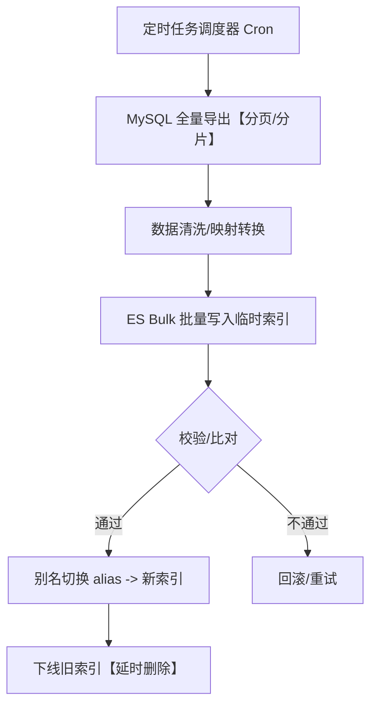
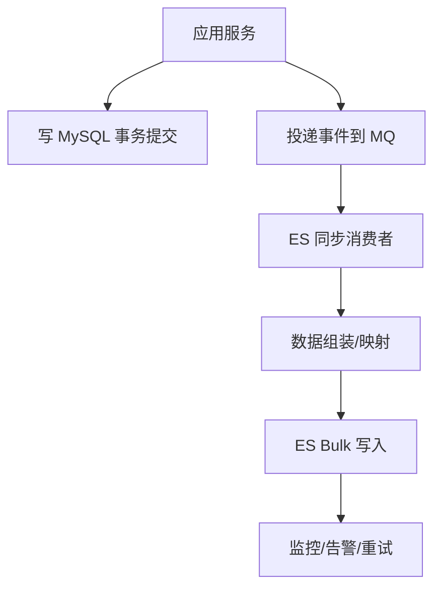
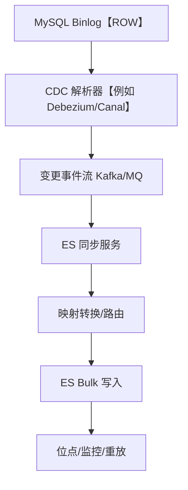
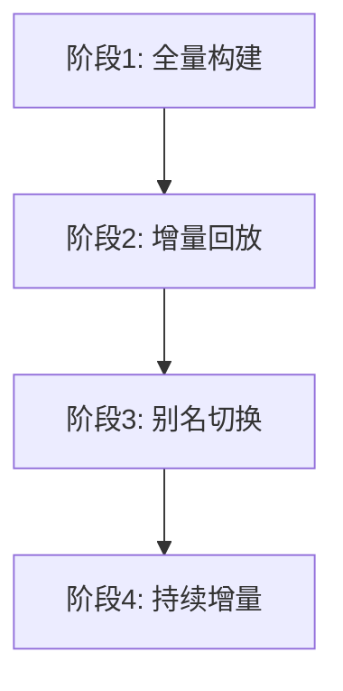

## 🔄 MySQL → Elasticsearch 数据同步方案

> 目标：为不同业务场景提供可落地的 MySQL → Elasticsearch（ES）数据同步实现，包括定时全量（批处理）、增量（业务触发）、基于 Binlog 的实时同步与混合（全量+增量）方案，对比优缺点与适用场景，并提供实施要点与流程图。

---

### 🧭 何时需要 ES 同步？
- **全文检索/复杂查询**：需要倒排索引与聚合能力
- **高并发低延迟读**：以读多写少为主的系统
- **报表/分析**：需要近实时分析而不影响 OLTP
- **异构数据访问层**：服务端聚合多源数据到搜索层

---

### 📦 方案总览
- 定时全量（批处理）：周期性全表/分区导出至 ES
- 增量（业务触发）：在业务写 DB 时同步写/异步投递
- 基于 Binlog 的实时同步：CDC 捕获变更实时写 ES
- 混合（全量 + 增量）：先全量构建，再持续增量追平

---

### 方案一：⏱️ 定时全量同步（批处理）

- **适用场景**：
  - 数据量适中（≤ 数千万级），允许 T+1 或分钟级延迟
  - 读写分离明显，且可接受同步窗口内索引只读/替换
  - 对实时性要求不高、实现成本优先

- **优点**：
  - 实现最简单，成本最低
  - 一致性强（以导出时间点为准）
  - 易于回滚（索引别名切换）

- **缺点**：
  - 延迟较高，更新不实时
  - 全量导出耗时，占用 IO/网络
  - 重建期间需要双索引占用存储

- **流程图**：


- **实现要点**：
  - 分页建议：基于主键游标（seek）而非 offset，避免深分页
  - 并行：按主键 range/时间分片并发导出，控制 QPS
  - 写入：ES `/_bulk` 批量写入，合理 batch 大小（5k~20k 文档/批）
  - 索引：构建新索引 `index_v{ts}`，完成后用别名 `index_alias` 切换
  - 校验：抽样/全量计数比对，失败则回滚别名

- **示例（伪代码）**：
```bash
# 导出（主键游标）
last_id=0
while true; do
  rows=$(mysql_query "SELECT * FROM t WHERE id > ${last_id} ORDER BY id ASC LIMIT 10000")
  [ -z "$rows" ] && break
  json=$(transform_to_es_bulk "$rows")
  curl -s -H 'Content-Type: application/x-ndjson' -XPOST http://es/_bulk --data-binary "$json"
  last_id=$(get_max_id "$rows")
  sleep 0.1
done
# 校验后 alias 切换
curl -XPOST http://es/_aliases -H 'Content-Type: application/json' -d '{"actions":[{"remove":{"alias":"idx","index":"idx_old"}},{"add":{"alias":"idx","index":"idx_v20250101"}}]}'
```

---

### 方案二：⚙️ 增量同步（基于业务触发）

- **适用场景**：
  - 写入路径可改造，允许在业务层埋点事件
  - 对实时性有要求（秒级），但可容忍偶发丢失后补
  - 读写模型明确，事件语义清晰（创建/更新/删除）

- **优点**：
  - 延迟低（通常 < 1s）
  - 语义清晰，天然支持业务维度聚合
  - 成本较低，无需解析 Binlog

- **缺点**：
  - 需侵入业务，增加耦合
  - 容错复杂（重试、幂等、回溯）
  - 漏埋点风险，需要兜底全量校正

- **两种模式**：
  - 同步双写：业务写 DB 同时写 ES（或队列）
  - 异步事件：业务写 DB 后投递 MQ，消费者写 ES

- **流程图（异步事件）**：


- **实现要点**：
  - 幂等：使用业务主键作为 ES `_id`，重复写可覆盖
  - 顺序：按主键分区到同一分区队列，或用版本号 `version` 控制
  - 失败重试：DLQ（死信队列）+ 定期回放
  - 兜底：每日/每周全量校验补齐

- **示例（事件负载）**：
```json
{"event":"user.updated","id":123,"occurred_at":"2025-01-01T10:00:00Z","payload":{"name":"Alice","age":20}}
```

---

### 方案三：⚡ 基于 Binlog 的实时同步（CDC）

- **适用场景**：
  - 强实时（亚秒~秒级）需求
  - 业务不便改造或多语言多服务无法统一事件
  - 高一致性要求：变更即刻体现在检索侧

- **常见组件**：
  - Canal、Debezium、Maxwell、DataX-Streamer 等

- **优点**：
  - 对业务零侵入
  - 捕获所有变更（INSERT/UPDATE/DELETE/DDL）
  - 延迟低、吞吐高

- **缺点**：
  - 维护成本较高（位点、容错、Schema 变更）
  - 对 MySQL 配置有要求（binlog_format=ROW）
  - DDL 适配复杂（字段新增/删除/重命名的映射）

- **流程图**：


- **实现要点**：
  - 位点管理：记忆 binlog file + pos 或 GTID，支持断点续传
  - 有序性：按主键路由到同一分区，或用 `external_version` 防乱序
  - DDL 处理：字段新增默认映射，删除/重命名需灰度与回填
  - 压测与回压：批量聚合、最大在途批次、根据 ES 写入耗时自适应
  - 监控：滞后秒数、吞吐、失败率、重放队列积压

---

### 方案四：🧪 混合方案（全量 + 增量）

- **适用场景**：
  - 首次构建或大规模迁移，需要快速成库
  - 既要低延迟，又要一致性与容灾能力

- **优点**：
  - 首次全量构建快，随后依赖增量追平
  - 可平滑切换与回滚（别名）

- **缺点**：
  - 架构更复杂，需要多阶段协同

- **流程图**：


- **实施步骤**：
  1) 冻结窗口（可选）：减少写入抖动
  2) 全量导入到 `index_vX`
  3) 启动增量（业务事件或 Binlog），从全量快照点位开始回放
  4) 待追平延迟 < 阈值，切换别名到 `index_vX`
  5) 观察期后下线老索引

---

### 🧰 工程实践与通用要点
- **索引设计**：稳定 mapping；合理分片（数据量/查询并发/节点数）；使用 `index.aliases`
- **数据建模**：尽量反范式化以减少 ES join；需要聚合字段设置 `keyword` 与 `doc_values`
- **写入策略**：
  - Bulk：控制 batch 大小与并发；失败项单独重试
  - 刷新：禁用自动 refresh 或提高周期，在大批量导入时提升吞吐
- **幂等与版本**：使用业务主键做 `_id`；使用 `external_version`/`seq_no` 控制并发覆盖
- **错误处理**：DLQ、重放工具、校验修复任务（compare & fix）
- **监控指标**：写入 QPS/延迟、bulk 失败率、CDC 滞后、索引段合并、查询 P99
- **成本与容量**：冷热分层、生命周期策略（ILM）、滚动索引

---

### 🧪 方案选择对比

| 方案 | 延迟 | 复杂度 | 对业务侵入 | 数据一致性 | 适用规模 |
|---|---|---|---|---|---|
| 定时全量 | 分钟-小时 | 低 | 低 | 强（以快照为准） | 小-中 |
| 增量（业务触发） | 亚秒-秒 | 中 | 中-高 | 中（靠幂等/重试） | 中 |
| Binlog 实时 | 亚秒-秒 | 高 | 低 | 高 | 中-大 |
| 混合（全量+增量） | 亚秒-分钟 | 高 | 视增量方式而定 | 高 | 大 |

---

### 🧱 落地样例结构（参考）

```text
sync/
├─ full/
│  ├─ exporter.py        # MySQL 游标分页导出
│  ├─ transformer.py     # 字段映射/清洗
│  └─ bulk_writer.py     # ES 批量写入
├─ cdc/
│  ├─ consumer.py        # Canal/Debezium 事件消费
│  ├─ mapper.py          # 事件 -> 文档
│  └─ checkpoint.py      # 位点/断点续传
├─ mq/
│  ├─ producer.py        # 业务事件投递
│  └─ consumer.py        # 事件消费写 ES
└─ ops/
   ├─ alias_switch.sh    # 别名原子切换
   └─ compare_fix.py     # 校验与修复
```

---

### ✅ 推荐决策指南
- 只需 T+1 报表/搜索：选 定时全量
- 能改造业务，追求低延迟：选 业务触发增量
- 不便改造且需强实时：选 Binlog 实时
- 首次构建或要保一致性/容灾：选 混合（全量+增量）

> 小贴士：无论选择何种方案，都建议保留“全量校验与修复”能力，长期保障数据一致性与可运维性。
