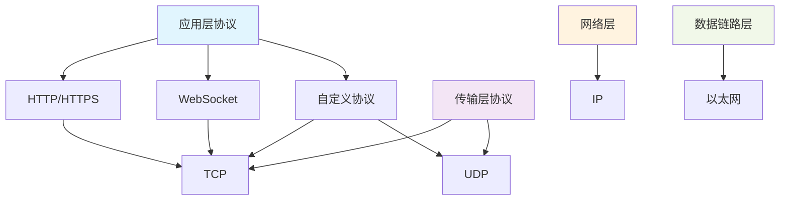
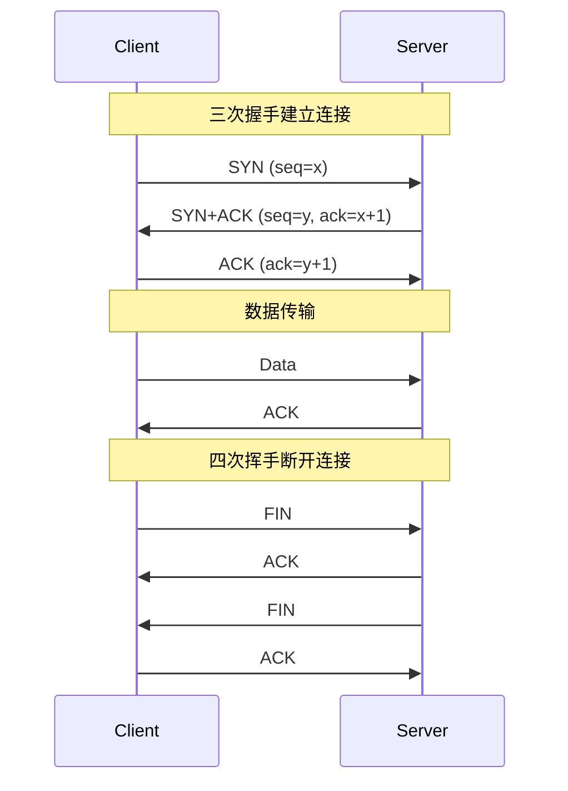
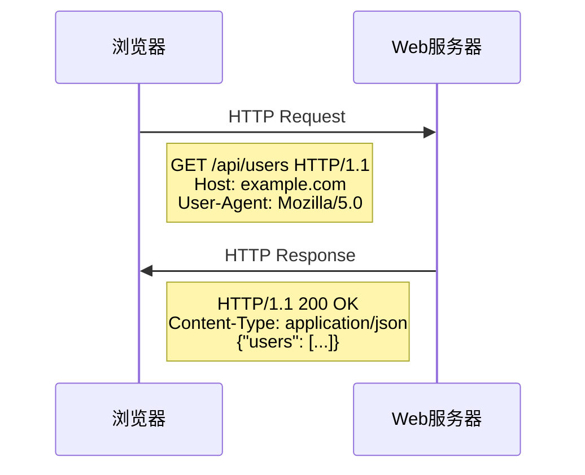
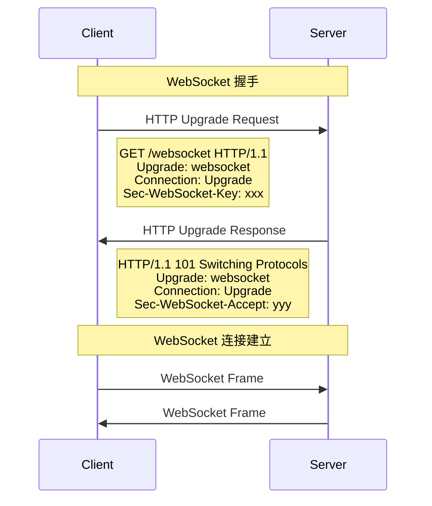
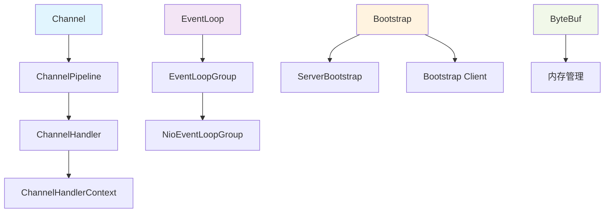
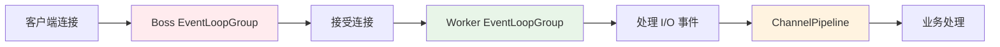

# 🚀 Netty 详解 <Badge type="warning" text="核心技能" />

## 📖 基础介绍

Netty 是一个基于 Java NIO 的异步事件驱动的网络应用框架，用于快速开发可维护的高性能协议服务器和客户端。它极大地简化了网络编程，如 TCP 和 UDP 套接字服务器的开发。

::: info 核心特性
- **高性能**：基于 NIO 的异步非阻塞 I/O 模型
- **易用性**：简化的 API 设计，降低网络编程复杂度
- **稳定性**：经过大量项目验证，稳定可靠
- **扩展性**：支持多种协议，可自定义编解码器
- **跨平台**：基于 Java，支持所有 Java 平台
:::

## 🌐 网络协议详解

在深入学习 Netty 之前，我们需要先了解相关的网络协议及其关系。

### 协议层次结构



### 🔗 TCP 协议 <Badge type="tip" text="可靠传输" />

TCP (Transmission Control Protocol) 是一种面向连接的、可靠的传输层协议。

#### 特点
- **面向连接**：通信前需要建立连接（三次握手）
- **可靠传输**：保证数据完整性和顺序
- **流量控制**：防止发送方发送过快
- **拥塞控制**：网络拥塞时自动调节发送速率

#### TCP 连接过程



### 📡 UDP 协议 <Badge type="info" text="快速传输" />

UDP (User Datagram Protocol) 是一种无连接的传输层协议。

#### 特点
- **无连接**：不需要建立连接，直接发送数据
- **不可靠**：不保证数据到达和顺序
- **高效**：开销小，传输速度快
- **支持广播**：可以一对多通信

#### TCP vs UDP 对比

| 特性 | TCP | UDP |
|------|-----|-----|
| **连接性** | 面向连接 | 无连接 |
| **可靠性** | 可靠传输 | 不可靠传输 |
| **速度** | 相对较慢 | 快速 |
| **开销** | 较大 | 较小 |
| **应用场景** | 文件传输、网页浏览 | 视频直播、游戏 |

### 🌍 HTTP 协议 <Badge type="success" text="Web基础" />

HTTP (HyperText Transfer Protocol) 是应用层协议，基于 TCP 实现。

#### HTTP/1.1 特点
- **无状态**：每个请求都是独立的
- **基于请求-响应**：客户端发起请求，服务器响应
- **支持持久连接**：Keep-Alive 机制
- **文本协议**：易于理解和调试

#### HTTP 请求流程



### 🔌 WebSocket 协议 <Badge type="warning" text="实时通信" />

WebSocket 是一种在单个 TCP 连接上进行全双工通信的协议。

#### 特点
- **全双工通信**：客户端和服务器可以同时发送数据
- **持久连接**：连接建立后保持开启状态
- **低延迟**：减少了 HTTP 的请求头开销
- **实时性**：适合实时应用

#### WebSocket 握手过程



### 🔧 Socket 概念

Socket 不是协议，而是网络编程的接口抽象。

#### Socket 类型
- **TCP Socket**：基于 TCP 协议的 Socket
- **UDP Socket**：基于 UDP 协议的 Socket
- **Unix Domain Socket**：本地进程间通信

#### 协议关系总结

::: tip 协议关系
- **Socket** 是编程接口，不是协议
- **TCP/UDP** 是传输层协议
- **HTTP** 是应用层协议，基于 TCP
- **WebSocket** 是应用层协议，基于 TCP，通过 HTTP 升级建立
- **Netty** 可以实现所有这些协议的服务器和客户端
:::

## 🏗️ Netty 核心概念

### 架构设计



### 核心组件

| 组件 | 作用 | 说明 |
|------|------|------|
| **Channel** | 网络连接抽象 | 代表一个网络连接，支持异步 I/O 操作 |
| **EventLoop** | 事件循环 | 处理 I/O 事件，每个 Channel 绑定一个 EventLoop |
| **ChannelPipeline** | 处理链 | 包含一系列 ChannelHandler 的链式结构 |
| **ChannelHandler** | 业务处理器 | 处理 I/O 事件和数据转换 |
| **Bootstrap** | 启动器 | 配置和启动客户端或服务器 |
| **ByteBuf** | 字节缓冲区 | Netty 的数据容器，比 NIO 的 ByteBuffer 更强大 |

### 事件驱动模型



## 🚀 SpringBoot 集成

### 1. 依赖配置

```xml
<dependencies>
    <!-- Spring Boot Starter -->
    <dependency>
        <groupId>org.springframework.boot</groupId>
        <artifactId>spring-boot-starter</artifactId>
    </dependency>
    
    <!-- Netty -->
    <dependency>
        <groupId>io.netty</groupId>
        <artifactId>netty-all</artifactId>
        <version>4.1.100.Final</version>
    </dependency>
    
    <!-- JSON 处理 -->
    <dependency>
        <groupId>com.fasterxml.jackson.core</groupId>
        <artifactId>jackson-databind</artifactId>
    </dependency>
</dependencies>
```

### 2. 配置文件

```yaml
# application.yml
netty:
  server:
    port: 8888
    boss-threads: 1
    worker-threads: 4
    so-backlog: 128
    so-keepalive: true
    tcp-nodelay: true
  client:
    connect-timeout: 5000
    so-keepalive: true
    tcp-nodelay: true
```

### 3. 配置类

```java
@Configuration
@ConfigurationProperties(prefix = "netty")
@Data
public class NettyConfig {
    
    private ServerConfig server = new ServerConfig();
    private ClientConfig client = new ClientConfig();
    
    @Data
    public static class ServerConfig {
        private int port = 8888;
        private int bossThreads = 1;
        private int workerThreads = Runtime.getRuntime().availableProcessors() * 2;
        private int soBacklog = 128;
        private boolean soKeepalive = true;
        private boolean tcpNodelay = true;
    }
    
    @Data
    public static class ClientConfig {
        private int connectTimeout = 5000;
        private boolean soKeepalive = true;
        private boolean tcpNodelay = true;
    }
}
```

## 🖥️ 服务端实现

### 1. 服务端启动器

```java
@Component
@Slf4j
public class NettyServer {
    
    @Autowired
    private NettyConfig nettyConfig;
    
    @Autowired
    private ServerChannelInitializer serverChannelInitializer;
    
    private EventLoopGroup bossGroup;
    private EventLoopGroup workerGroup;
    private Channel serverChannel;
    
    @PostConstruct
    public void start() {
        new Thread(this::doStart).start();
    }
    
    private void doStart() {
        // 创建事件循环组
        bossGroup = new NioEventLoopGroup(nettyConfig.getServer().getBossThreads());
        workerGroup = new NioEventLoopGroup(nettyConfig.getServer().getWorkerThreads());
        
        try {
            ServerBootstrap bootstrap = new ServerBootstrap();
            bootstrap.group(bossGroup, workerGroup)
                    .channel(NioServerSocketChannel.class)
                    .option(ChannelOption.SO_BACKLOG, nettyConfig.getServer().getSoBacklog())
                    .childOption(ChannelOption.SO_KEEPALIVE, nettyConfig.getServer().isSoKeepalive())
                    .childOption(ChannelOption.TCP_NODELAY, nettyConfig.getServer().isTcpNodelay())
                    .childHandler(serverChannelInitializer);
            
            // 绑定端口并启动服务器
            ChannelFuture future = bootstrap.bind(nettyConfig.getServer().getPort()).sync();
            serverChannel = future.channel();
            
            log.info("Netty 服务器启动成功，端口：{}", nettyConfig.getServer().getPort());
            
            // 等待服务器关闭
            serverChannel.closeFuture().sync();
            
        } catch (InterruptedException e) {
            log.error("Netty 服务器启动失败", e);
        } finally {
            shutdown();
        }
    }
    
    @PreDestroy
    public void shutdown() {
        if (serverChannel != null) {
            serverChannel.close();
        }
        if (bossGroup != null) {
            bossGroup.shutdownGracefully();
        }
        if (workerGroup != null) {
            workerGroup.shutdownGracefully();
        }
        log.info("Netty 服务器已关闭");
    }
}
```

### 2. 服务端 Channel 初始化器

```java
@Component
public class ServerChannelInitializer extends ChannelInitializer<SocketChannel> {
    
    @Autowired
    private ServerHandler serverHandler;
    
    @Override
    protected void initChannel(SocketChannel ch) throws Exception {
        ChannelPipeline pipeline = ch.pipeline();
        
        // 添加编解码器
        pipeline.addLast("frameDecoder", new LengthFieldBasedFrameDecoder(
                Integer.MAX_VALUE, 0, 4, 0, 4));
        pipeline.addLast("frameEncoder", new LengthFieldPrepender(4));
        
        // 添加字符串编解码器
        pipeline.addLast("decoder", new StringDecoder(CharsetUtil.UTF_8));
        pipeline.addLast("encoder", new StringEncoder(CharsetUtil.UTF_8));
        
        // 添加业务处理器
        pipeline.addLast("serverHandler", serverHandler);
    }
}
```

### 3. 服务端业务处理器

```java
@Component
@Slf4j
@ChannelHandler.Sharable
public class ServerHandler extends SimpleChannelInboundHandler<String> {
    
    // 存储所有连接的客户端
    private final ChannelGroup channelGroup = new DefaultChannelGroup(GlobalEventExecutor.INSTANCE);
    
    @Override
    public void channelActive(ChannelHandlerContext ctx) throws Exception {
        Channel channel = ctx.channel();
        channelGroup.add(channel);
        log.info("客户端连接：{}", channel.remoteAddress());
        
        // 通知其他客户端有新用户加入
        channelGroup.writeAndFlush("系统消息：新用户 " + channel.remoteAddress() + " 加入聊天室");
    }
    
    @Override
    public void channelInactive(ChannelHandlerContext ctx) throws Exception {
        Channel channel = ctx.channel();
        channelGroup.remove(channel);
        log.info("客户端断开：{}", channel.remoteAddress());
        
        // 通知其他客户端有用户离开
        channelGroup.writeAndFlush("系统消息：用户 " + channel.remoteAddress() + " 离开聊天室");
    }
    
    @Override
    protected void channelRead0(ChannelHandlerContext ctx, String msg) throws Exception {
        Channel channel = ctx.channel();
        log.info("收到客户端 {} 消息：{}", channel.remoteAddress(), msg);
        
        // 解析消息
        try {
            MessageProtocol message = parseMessage(msg);
            handleMessage(ctx, message);
        } catch (Exception e) {
            log.error("消息解析失败：{}", msg, e);
            ctx.writeAndFlush("错误：消息格式不正确");
        }
    }
    
    private MessageProtocol parseMessage(String msg) {
        // 简单的 JSON 解析示例
        ObjectMapper mapper = new ObjectMapper();
        try {
            return mapper.readValue(msg, MessageProtocol.class);
        } catch (Exception e) {
            // 如果不是 JSON 格式，创建一个简单的文本消息
            MessageProtocol protocol = new MessageProtocol();
            protocol.setType("TEXT");
            protocol.setContent(msg);
            return protocol;
        }
    }
    
    private void handleMessage(ChannelHandlerContext ctx, MessageProtocol message) {
        switch (message.getType()) {
            case "TEXT":
                // 广播文本消息
                String broadcastMsg = ctx.channel().remoteAddress() + "：" + message.getContent();
                channelGroup.writeAndFlush(broadcastMsg);
                break;
                
            case "PRIVATE":
                // 私聊消息（这里简化处理）
                ctx.writeAndFlush("私聊功能暂未实现");
                break;
                
            case "HEARTBEAT":
                // 心跳消息
                ctx.writeAndFlush("PONG");
                break;
                
            default:
                ctx.writeAndFlush("不支持的消息类型：" + message.getType());
        }
    }
    
    @Override
    public void exceptionCaught(ChannelHandlerContext ctx, Throwable cause) throws Exception {
        log.error("服务端异常", cause);
        ctx.close();
    }
}
```

## 💻 客户端实现

### 1. 客户端启动器

```java
@Component
@Slf4j
public class NettyClient {
    
    @Autowired
    private NettyConfig nettyConfig;
    
    @Autowired
    private ClientChannelInitializer clientChannelInitializer;
    
    private EventLoopGroup group;
    private Channel clientChannel;
    
    public void connect(String host, int port) {
        group = new NioEventLoopGroup();
        
        try {
            Bootstrap bootstrap = new Bootstrap();
            bootstrap.group(group)
                    .channel(NioSocketChannel.class)
                    .option(ChannelOption.CONNECT_TIMEOUT_MILLIS, 
                            nettyConfig.getClient().getConnectTimeout())
                    .option(ChannelOption.SO_KEEPALIVE, 
                            nettyConfig.getClient().isSoKeepalive())
                    .option(ChannelOption.TCP_NODELAY, 
                            nettyConfig.getClient().isTcpNodelay())
                    .handler(clientChannelInitializer);
            
            // 连接服务器
            ChannelFuture future = bootstrap.connect(host, port).sync();
            clientChannel = future.channel();
            
            log.info("客户端连接成功：{}:{}", host, port);
            
            // 等待连接关闭
            clientChannel.closeFuture().sync();
            
        } catch (InterruptedException e) {
            log.error("客户端连接失败", e);
        } finally {
            disconnect();
        }
    }
    
    public void sendMessage(String message) {
        if (clientChannel != null && clientChannel.isActive()) {
            clientChannel.writeAndFlush(message);
        } else {
            log.warn("客户端未连接，无法发送消息");
        }
    }
    
    public void disconnect() {
        if (clientChannel != null) {
            clientChannel.close();
        }
        if (group != null) {
            group.shutdownGracefully();
        }
        log.info("客户端已断开连接");
    }
}
```

### 2. 客户端 Channel 初始化器

```java
@Component
public class ClientChannelInitializer extends ChannelInitializer<SocketChannel> {
    
    @Autowired
    private ClientHandler clientHandler;
    
    @Override
    protected void initChannel(SocketChannel ch) throws Exception {
        ChannelPipeline pipeline = ch.pipeline();
        
        // 添加编解码器（与服务端保持一致）
        pipeline.addLast("frameDecoder", new LengthFieldBasedFrameDecoder(
                Integer.MAX_VALUE, 0, 4, 0, 4));
        pipeline.addLast("frameEncoder", new LengthFieldPrepender(4));
        
        // 添加字符串编解码器
        pipeline.addLast("decoder", new StringDecoder(CharsetUtil.UTF_8));
        pipeline.addLast("encoder", new StringEncoder(CharsetUtil.UTF_8));
        
        // 添加业务处理器
        pipeline.addLast("clientHandler", clientHandler);
    }
}
```

### 3. 客户端业务处理器

```java
@Component
@Slf4j
@ChannelHandler.Sharable
public class ClientHandler extends SimpleChannelInboundHandler<String> {
    
    @Override
    public void channelActive(ChannelHandlerContext ctx) throws Exception {
        log.info("客户端连接成功：{}", ctx.channel().localAddress());
        
        // 发送连接成功消息
        MessageProtocol message = new MessageProtocol();
        message.setType("TEXT");
        message.setContent("Hello, Server!");
        
        ObjectMapper mapper = new ObjectMapper();
        ctx.writeAndFlush(mapper.writeValueAsString(message));
    }
    
    @Override
    protected void channelRead0(ChannelHandlerContext ctx, String msg) throws Exception {
        log.info("收到服务器消息：{}", msg);
        
        // 这里可以根据业务需要处理服务器返回的消息
        handleServerMessage(msg);
    }
    
    private void handleServerMessage(String msg) {
        // 处理服务器消息的业务逻辑
        if (msg.startsWith("系统消息：")) {
            log.info("系统通知：{}", msg);
        } else if ("PONG".equals(msg)) {
            log.debug("收到心跳响应");
        } else {
            log.info("聊天消息：{}", msg);
        }
    }
    
    @Override
    public void channelInactive(ChannelHandlerContext ctx) throws Exception {
        log.info("与服务器断开连接");
    }
    
    @Override
    public void exceptionCaught(ChannelHandlerContext ctx, Throwable cause) throws Exception {
        log.error("客户端异常", cause);
        ctx.close();
    }
}
```

## 📋 自定义消息协议

::: tip 协议设计要点
在设计自定义传输协议时，需要考虑以下关键因素：
- **魔数**：用来第一时间判断是否为自己需要的数据包
- **版本号**：提高协议的拓展性，方便后续对协议进行升级
- **序列化算法**：消息正文具体该使用哪种方式进行序列化传输（Json、ProtoBuf、JDK等）
- **消息类型**：第一时间判断出当前消息的类型
- **消息序号**：为了实现双工通信，客户端和服务端之间收/发消息不会相互阻塞
- **正文长度**：提供给LTC解码器使用，防止解码时出现粘包、半包的现象
- **消息正文**：本次消息要传输的具体数据
:::

### 1. 完整协议结构定义

```java
@Data
@NoArgsConstructor
@AllArgsConstructor
public class MessageProtocol {
    
    /**
     * 魔数 - 用于识别协议（4字节）
     * 固定值：0x12345678
     */
    private int magicNumber = 0x12345678;
    
    /**
     * 版本号（1字节）
     * 当前版本：1
     */
    private byte version = 1;
    
    /**
     * 序列化算法（1字节）
     * 0: JSON, 1: ProtoBuf, 2: JDK, 3: Kryo
     */
    private byte serializationType = 0;
    
    /**
     * 消息类型（1字节）
     */
    private byte messageType;
    
    /**
     * 消息序号（8字节）
     * 用于双工通信，实现请求-响应匹配
     */
    private long sequenceId;
    
    /**
     * 正文长度（4字节）
     * 消息体的字节长度
     */
    private int contentLength;
    
    /**
     * 消息正文
     * 实际传输的业务数据
     */
    private Object content;
    
    // 消息类型常量
    public static final byte TYPE_REQUEST = 1;
    public static final byte TYPE_RESPONSE = 2;
    public static final byte TYPE_HEARTBEAT_REQUEST = 3;
    public static final byte TYPE_HEARTBEAT_RESPONSE = 4;
    public static final byte TYPE_TEXT = 5;
    public static final byte TYPE_IMAGE = 6;
    public static final byte TYPE_FILE = 7;
    public static final byte TYPE_PRIVATE = 8;
    public static final byte TYPE_SYSTEM = 9;
    
    // 序列化类型常量
    public static final byte SERIALIZATION_JSON = 0;
    public static final byte SERIALIZATION_PROTOBUF = 1;
    public static final byte SERIALIZATION_JDK = 2;
    public static final byte SERIALIZATION_KRYO = 3;
    
    /**
     * 创建请求消息
     */
    public static MessageProtocol createRequest(Object content, long sequenceId) {
        MessageProtocol message = new MessageProtocol();
        message.setMessageType(TYPE_REQUEST);
        message.setContent(content);
        message.setSequenceId(sequenceId);
        return message;
    }
    
    /**
     * 创建响应消息
     */
    public static MessageProtocol createResponse(Object content, long sequenceId) {
        MessageProtocol message = new MessageProtocol();
        message.setMessageType(TYPE_RESPONSE);
        message.setContent(content);
        message.setSequenceId(sequenceId);
        return message;
    }
    
    /**
     * 创建心跳请求消息
     */
    public static MessageProtocol createHeartbeatRequest() {
        MessageProtocol message = new MessageProtocol();
        message.setMessageType(TYPE_HEARTBEAT_REQUEST);
        message.setContent("PING");
        message.setSequenceId(System.currentTimeMillis());
        return message;
    }
    
    /**
     * 创建心跳响应消息
     */
    public static MessageProtocol createHeartbeatResponse(long sequenceId) {
        MessageProtocol message = new MessageProtocol();
        message.setMessageType(TYPE_HEARTBEAT_RESPONSE);
        message.setContent("PONG");
        message.setSequenceId(sequenceId);
        return message;
    }
    
    /**
     * 创建文本消息
     */
    public static MessageProtocol createTextMessage(String content) {
        MessageProtocol message = new MessageProtocol();
        message.setMessageType(TYPE_TEXT);
        message.setContent(content);
        message.setSequenceId(System.currentTimeMillis());
        return message;
    }
}
```

### 2. 序列化工具类

```java
public class SerializationUtil {
    
    private static final ObjectMapper JSON_MAPPER = new ObjectMapper();
    private static final Kryo KRYO = new Kryo();
    
    /**
     * 序列化对象
     */
    public static byte[] serialize(Object obj, byte serializationType) throws Exception {
        switch (serializationType) {
            case MessageProtocol.SERIALIZATION_JSON:
                return JSON_MAPPER.writeValueAsBytes(obj);
                
            case MessageProtocol.SERIALIZATION_JDK:
                return jdkSerialize(obj);
                
            case MessageProtocol.SERIALIZATION_KRYO:
                return kryoSerialize(obj);
                
            default:
                throw new IllegalArgumentException("不支持的序列化类型: " + serializationType);
        }
    }
    
    /**
     * 反序列化对象
     */
    public static <T> T deserialize(byte[] data, Class<T> clazz, byte serializationType) throws Exception {
        switch (serializationType) {
            case MessageProtocol.SERIALIZATION_JSON:
                return JSON_MAPPER.readValue(data, clazz);
                
            case MessageProtocol.SERIALIZATION_JDK:
                return jdkDeserialize(data);
                
            case MessageProtocol.SERIALIZATION_KRYO:
                return kryoDeserialize(data, clazz);
                
            default:
                throw new IllegalArgumentException("不支持的序列化类型: " + serializationType);
        }
    }
    
    private static byte[] jdkSerialize(Object obj) throws Exception {
        ByteArrayOutputStream baos = new ByteArrayOutputStream();
        ObjectOutputStream oos = new ObjectOutputStream(baos);
        oos.writeObject(obj);
        return baos.toByteArray();
    }
    
    @SuppressWarnings("unchecked")
    private static <T> T jdkDeserialize(byte[] data) throws Exception {
        ByteArrayInputStream bais = new ByteArrayInputStream(data);
        ObjectInputStream ois = new ObjectInputStream(bais);
        return (T) ois.readObject();
    }
    
    private static byte[] kryoSerialize(Object obj) {
        ByteArrayOutputStream baos = new ByteArrayOutputStream();
        Output output = new Output(baos);
        KRYO.writeObject(output, obj);
        output.close();
        return baos.toByteArray();
    }
    
    private static <T> T kryoDeserialize(byte[] data, Class<T> clazz) {
        ByteArrayInputStream bais = new ByteArrayInputStream(data);
        Input input = new Input(bais);
        T result = KRYO.readObject(input, clazz);
        input.close();
        return result;
    }
}
```

### 3. 完整的编解码器实现

```java
// 消息编码器
public class MessageEncoder extends MessageToByteEncoder<MessageProtocol> {
    
    @Override
    protected void encode(ChannelHandlerContext ctx, MessageProtocol msg, ByteBuf out) throws Exception {
        try {
            // 1. 写入魔数（4字节）
            out.writeInt(msg.getMagicNumber());
            
            // 2. 写入版本号（1字节）
            out.writeByte(msg.getVersion());
            
            // 3. 写入序列化类型（1字节）
            out.writeByte(msg.getSerializationType());
            
            // 4. 写入消息类型（1字节）
            out.writeByte(msg.getMessageType());
            
            // 5. 写入消息序号（8字节）
            out.writeLong(msg.getSequenceId());
            
            // 6. 序列化消息内容
            byte[] contentBytes = SerializationUtil.serialize(msg.getContent(), msg.getSerializationType());
            
            // 7. 写入正文长度（4字节）
            out.writeInt(contentBytes.length);
            
            // 8. 写入消息正文
            out.writeBytes(contentBytes);
            
        } catch (Exception e) {
            throw new EncoderException("消息编码失败", e);
        }
    }
}

// 消息解码器
public class MessageDecoder extends ByteToMessageDecoder {
    
    // 协议头长度：魔数(4) + 版本(1) + 序列化类型(1) + 消息类型(1) + 序列号(8) + 正文长度(4) = 19字节
    private static final int HEADER_LENGTH = 19;
    
    @Override
    protected void decode(ChannelHandlerContext ctx, ByteBuf in, List<Object> out) throws Exception {
        // 检查是否有足够的字节读取协议头
        if (in.readableBytes() < HEADER_LENGTH) {
            return;
        }
        
        // 标记当前读取位置
        in.markReaderIndex();
        
        // 1. 读取并验证魔数
        int magicNumber = in.readInt();
        if (magicNumber != 0x12345678) {
            // 魔数不匹配，跳过这个字节继续寻找
            in.resetReaderIndex();
            in.readByte();
            return;
        }
        
        // 2. 读取版本号
        byte version = in.readByte();
        
        // 3. 读取序列化类型
        byte serializationType = in.readByte();
        
        // 4. 读取消息类型
        byte messageType = in.readByte();
        
        // 5. 读取消息序号
        long sequenceId = in.readLong();
        
        // 6. 读取正文长度
        int contentLength = in.readInt();
        
        // 检查是否有足够的字节读取完整消息正文
        if (in.readableBytes() < contentLength) {
            // 重置读取位置，等待更多数据
            in.resetReaderIndex();
            return;
        }
        
        try {
            // 7. 读取消息正文
            byte[] contentBytes = new byte[contentLength];
            in.readBytes(contentBytes);
            
            // 8. 反序列化消息内容
            Object content = SerializationUtil.deserialize(contentBytes, Object.class, serializationType);
            
            // 9. 构建消息协议对象
            MessageProtocol message = new MessageProtocol();
            message.setMagicNumber(magicNumber);
            message.setVersion(version);
            message.setSerializationType(serializationType);
            message.setMessageType(messageType);
            message.setSequenceId(sequenceId);
            message.setContentLength(contentLength);
            message.setContent(content);
            
            // 10. 添加到输出列表
            out.add(message);
            
        } catch (Exception e) {
            // 解码失败，重置读取位置
            in.resetReaderIndex();
            throw new DecoderException("消息解码失败", e);
        }
    }
}
```

### 4. 协议使用示例

```java
// 服务端处理器
public class CustomMessageHandler extends SimpleChannelInboundHandler<MessageProtocol> {
    
    @Override
    protected void channelRead0(ChannelHandlerContext ctx, MessageProtocol msg) throws Exception {
        log.info("收到消息 - 类型: {}, 序列号: {}, 内容: {}", 
                msg.getMessageType(), msg.getSequenceId(), msg.getContent());
        
        switch (msg.getMessageType()) {
            case MessageProtocol.TYPE_REQUEST:
                handleRequest(ctx, msg);
                break;
                
            case MessageProtocol.TYPE_HEARTBEAT_REQUEST:
                handleHeartbeat(ctx, msg);
                break;
                
            case MessageProtocol.TYPE_TEXT:
                handleTextMessage(ctx, msg);
                break;
                
            default:
                log.warn("未知消息类型: {}", msg.getMessageType());
        }
    }
    
    private void handleRequest(ChannelHandlerContext ctx, MessageProtocol msg) {
        // 处理请求并发送响应
        MessageProtocol response = MessageProtocol.createResponse(
            "处理完成: " + msg.getContent(), 
            msg.getSequenceId()
        );
        ctx.writeAndFlush(response);
    }
    
    private void handleHeartbeat(ChannelHandlerContext ctx, MessageProtocol msg) {
        // 响应心跳
        MessageProtocol pong = MessageProtocol.createHeartbeatResponse(msg.getSequenceId());
        ctx.writeAndFlush(pong);
    }
    
    private void handleTextMessage(ChannelHandlerContext ctx, MessageProtocol msg) {
        // 处理文本消息
        log.info("收到文本消息: {}", msg.getContent());
        // 可以进行广播或其他处理
    }
}

// 客户端使用示例
public class ClientExample {
    
    public void sendMessage(Channel channel) {
        // 发送请求消息
        MessageProtocol request = MessageProtocol.createRequest(
            "Hello Server", 
            System.currentTimeMillis()
        );
        channel.writeAndFlush(request);
        
        // 发送心跳消息
        MessageProtocol heartbeat = MessageProtocol.createHeartbeatRequest();
        channel.writeAndFlush(heartbeat);
        
        // 发送文本消息
        MessageProtocol textMsg = MessageProtocol.createTextMessage("这是一条文本消息");
        channel.writeAndFlush(textMsg);
    }
}
```

### 5. 协议优势分析

::: tip 协议设计优势
1. **魔数验证**：快速识别有效数据包，过滤无效数据
2. **版本控制**：支持协议升级，保持向后兼容性
3. **多种序列化**：支持JSON、ProtoBuf、JDK、Kryo等多种序列化方式
4. **消息分类**：通过消息类型快速路由到对应处理器
5. **双工通信**：通过序列号实现请求-响应匹配
6. **防粘包半包**：通过长度字段确保消息完整性
7. **扩展性强**：协议结构清晰，易于扩展新功能
:::

### 6. 性能优化建议

```java
// 对象池优化
public class MessageProtocolPool {
    
    private static final ObjectPool<MessageProtocol> POOL = 
        new DefaultObjectPool<>(new MessageProtocolFactory());
    
    public static MessageProtocol borrowObject() {
        try {
            return POOL.borrowObject();
        } catch (Exception e) {
            return new MessageProtocol();
        }
    }
    
    public static void returnObject(MessageProtocol obj) {
        try {
            obj.reset(); // 重置对象状态
            POOL.returnObject(obj);
        } catch (Exception e) {
            // 忽略异常
        }
    }
    
    private static class MessageProtocolFactory extends BasePooledObjectFactory<MessageProtocol> {
        @Override
        public MessageProtocol create() throws Exception {
            return new MessageProtocol();
        }
        
        @Override
        public PooledObject<MessageProtocol> wrap(MessageProtocol obj) {
            return new DefaultPooledObject<>(obj);
        }
    }
}

```java
@Component
public class CustomChannelInitializer extends ChannelInitializer<SocketChannel> {
    
    @Override
    protected void initChannel(SocketChannel ch) throws Exception {
        ChannelPipeline pipeline = ch.pipeline();
        
        // 添加自定义编解码器
        pipeline.addLast("messageDecoder", new MessageDecoder());
        pipeline.addLast("messageEncoder", new MessageEncoder());
        
        // 添加业务处理器
        pipeline.addLast("messageHandler", new CustomMessageHandler());
    }
}

@ChannelHandler.Sharable
public class CustomMessageHandler extends SimpleChannelInboundHandler<MessageProtocol> {
    
    @Override
    protected void channelRead0(ChannelHandlerContext ctx, MessageProtocol msg) throws Exception {
        log.info("收到消息：类型={}, 内容={}, 发送者={}", 
                msg.getType(), msg.getContent(), msg.getSenderId());
        
        // 根据消息类型处理
        switch (msg.getType()) {
            case MessageProtocol.TYPE_TEXT:
                handleTextMessage(ctx, msg);
                break;
            case MessageProtocol.TYPE_HEARTBEAT:
                handleHeartbeat(ctx, msg);
                break;
            case MessageProtocol.TYPE_PRIVATE:
                handlePrivateMessage(ctx, msg);
                break;
            default:
                log.warn("未知消息类型：{}", msg.getType());
        }
    }
    
    private void handleTextMessage(ChannelHandlerContext ctx, MessageProtocol msg) {
        // 处理文本消息
        MessageProtocol response = MessageProtocol.createTextMessage(
                "收到消息：" + msg.getContent(), "server");
        ctx.writeAndFlush(response);
    }
    
    private void handleHeartbeat(ChannelHandlerContext ctx, MessageProtocol msg) {
        // 处理心跳消息
        MessageProtocol pong = new MessageProtocol();
        pong.setType(MessageProtocol.TYPE_HEARTBEAT);
        pong.setContent("PONG");
        pong.setTimestamp(System.currentTimeMillis());
        ctx.writeAndFlush(pong);
    }
    
    private void handlePrivateMessage(ChannelHandlerContext ctx, MessageProtocol msg) {
        // 处理私聊消息
        log.info("私聊消息：{} -> {}: {}", 
                msg.getSenderId(), msg.getReceiverId(), msg.getContent());
    }
}
```

## 🔄 服务端 vs 客户端

### 主要区别

| 特性 | 服务端 | 客户端 |
|------|--------|--------|
| **启动器** | ServerBootstrap | Bootstrap |
| **Channel类型** | NioServerSocketChannel | NioSocketChannel |
| **EventLoopGroup** | Boss + Worker 两组 | 单个 EventLoopGroup |
| **主要职责** | 监听端口，接受连接 | 主动连接服务器 |
| **连接管理** | 管理多个客户端连接 | 管理单个服务器连接 |

### 服务端特点

::: tip 服务端特性
- **被动连接**：监听端口，等待客户端连接
- **多连接管理**：同时处理多个客户端连接
- **双 EventLoopGroup**：Boss 组处理连接，Worker 组处理 I/O
- **资源管理**：需要管理所有客户端的连接状态
:::

### 客户端特点

::: info 客户端特性
- **主动连接**：主动向服务器发起连接
- **单连接管理**：通常只维护一个服务器连接
- **单 EventLoopGroup**：只需要一个事件循环组
- **简单结构**：相对服务端结构更简单
:::

## 🎯 实际应用场景

### 1. 即时通讯系统

```java
@RestController
@RequestMapping("/chat")
public class ChatController {
    
    @Autowired
    private NettyServer nettyServer;
    
    @PostMapping("/send")
    public ResponseEntity<String> sendMessage(@RequestBody ChatMessage message) {
        // 通过 Netty 服务器广播消息
        MessageProtocol protocol = MessageProtocol.createTextMessage(
                message.getContent(), message.getSenderId());
        
        // 这里需要获取到对应的 Channel 并发送消息
        // 实际实现中需要维护用户ID与Channel的映射关系
        
        return ResponseEntity.ok("消息发送成功");
    }
}
```

### 2. 游戏服务器

```java
@Component
public class GameServerHandler extends SimpleChannelInboundHandler<MessageProtocol> {
    
    // 游戏房间管理
    private final Map<String, GameRoom> gameRooms = new ConcurrentHashMap<>();
    
    @Override
    protected void channelRead0(ChannelHandlerContext ctx, MessageProtocol msg) throws Exception {
        String playerId = msg.getSenderId();
        
        switch (msg.getType()) {
            case "JOIN_ROOM":
                joinGameRoom(ctx, playerId, msg.getContent());
                break;
            case "GAME_ACTION":
                handleGameAction(ctx, playerId, msg);
                break;
            case "LEAVE_ROOM":
                leaveGameRoom(ctx, playerId);
                break;
        }
    }
    
    private void joinGameRoom(ChannelHandlerContext ctx, String playerId, String roomId) {
        GameRoom room = gameRooms.computeIfAbsent(roomId, k -> new GameRoom(roomId));
        room.addPlayer(playerId, ctx.channel());
        
        // 通知房间内其他玩家
        MessageProtocol notification = new MessageProtocol();
        notification.setType("PLAYER_JOINED");
        notification.setContent(playerId + " 加入了游戏");
        room.broadcast(notification);
    }
    
    private void handleGameAction(ChannelHandlerContext ctx, String playerId, MessageProtocol msg) {
        // 处理游戏操作
        log.info("玩家 {} 执行操作：{}", playerId, msg.getContent());
        
        // 游戏逻辑处理...
        
        // 广播游戏状态更新
        MessageProtocol update = new MessageProtocol();
        update.setType("GAME_UPDATE");
        update.setContent("游戏状态已更新");
        
        // 发送给房间内所有玩家
        String roomId = findPlayerRoom(playerId);
        if (roomId != null) {
            gameRooms.get(roomId).broadcast(update);
        }
    }
}
```

### 3. 物联网数据收集

```java
@Component
public class IoTDataHandler extends SimpleChannelInboundHandler<MessageProtocol> {
    
    @Autowired
    private IoTDataService iotDataService;
    
    @Override
    protected void channelRead0(ChannelHandlerContext ctx, MessageProtocol msg) throws Exception {
        if ("SENSOR_DATA".equals(msg.getType())) {
            // 解析传感器数据
            SensorData data = parseSensorData(msg.getContent());
            
            // 存储到数据库
            iotDataService.saveSensorData(data);
            
            // 实时数据分析
            if (data.getValue() > data.getThreshold()) {
                // 触发告警
                sendAlert(data);
            }
            
            // 确认收到数据
            MessageProtocol ack = new MessageProtocol();
            ack.setType("ACK");
            ack.setContent("数据接收成功");
            ctx.writeAndFlush(ack);
        }
    }
    
    private SensorData parseSensorData(String content) {
        // 解析传感器数据的具体实现
        ObjectMapper mapper = new ObjectMapper();
        try {
            return mapper.readValue(content, SensorData.class);
        } catch (Exception e) {
            throw new RuntimeException("传感器数据解析失败", e);
        }
    }
    
    private void sendAlert(SensorData data) {
        // 发送告警通知
        log.warn("传感器告警：设备ID={}, 数值={}, 阈值={}", 
                data.getDeviceId(), data.getValue(), data.getThreshold());
    }
}
```

## 🔧 性能优化

### 1. 连接池配置

```java
@Configuration
public class NettyPerformanceConfig {
    
    @Bean
    public EventLoopGroup bossGroup() {
        // Boss 线程组通常设置为 1
        return new NioEventLoopGroup(1, new DefaultThreadFactory("netty-boss"));
    }
    
    @Bean
    public EventLoopGroup workerGroup() {
        // Worker 线程组设置为 CPU 核心数的 2 倍
        int workerThreads = Runtime.getRuntime().availableProcessors() * 2;
        return new NioEventLoopGroup(workerThreads, new DefaultThreadFactory("netty-worker"));
    }
    
    @Bean
    public ServerBootstrap serverBootstrap(EventLoopGroup bossGroup, EventLoopGroup workerGroup) {
        return new ServerBootstrap()
                .group(bossGroup, workerGroup)
                .channel(NioServerSocketChannel.class)
                // 性能优化配置
                .option(ChannelOption.SO_BACKLOG, 1024)
                .option(ChannelOption.SO_REUSEADDR, true)
                .childOption(ChannelOption.SO_KEEPALIVE, true)
                .childOption(ChannelOption.TCP_NODELAY, true)
                .childOption(ChannelOption.SO_RCVBUF, 32 * 1024)
                .childOption(ChannelOption.SO_SNDBUF, 32 * 1024)
                // 使用池化的 ByteBuf 分配器
                .childOption(ChannelOption.ALLOCATOR, PooledByteBufAllocator.DEFAULT);
    }
}
```

### 2. 内存管理

```java
@Component
public class OptimizedMessageHandler extends SimpleChannelInboundHandler<ByteBuf> {
    
    @Override
    protected void channelRead0(ChannelHandlerContext ctx, ByteBuf msg) throws Exception {
        try {
            // 处理消息
            processMessage(msg);
        } finally {
            // 确保 ByteBuf 被正确释放
            // SimpleChannelInboundHandler 会自动释放，这里只是示例
        }
    }
    
    private void processMessage(ByteBuf msg) {
        // 避免不必要的内存拷贝
        if (msg.isDirect()) {
            // 直接内存操作
            processDirectBuffer(msg);
        } else {
            // 堆内存操作
            processHeapBuffer(msg);
        }
    }
    
    private void processDirectBuffer(ByteBuf msg) {
        // 直接操作 ByteBuf，避免转换为 byte[]
        int readableBytes = msg.readableBytes();
        // ... 处理逻辑
    }
    
    private void processHeapBuffer(ByteBuf msg) {
        // 堆内存处理
        if (msg.hasArray()) {
            byte[] array = msg.array();
            int offset = msg.arrayOffset() + msg.readerIndex();
            int length = msg.readableBytes();
            // 直接使用数组，避免额外拷贝
        }
    }
}
```

## 📚 总结

Netty 是一个功能强大的网络编程框架，它简化了网络应用的开发：

### 🎯 核心优势
- **高性能**：基于 NIO 的异步非阻塞 I/O 模型
- **易用性**：简化的 API 和丰富的编解码器
- **稳定性**：经过大量生产环境验证
- **灵活性**：支持多种协议和自定义扩展

### 🔧 适用场景
- **即时通讯**：聊天室、消息推送
- **游戏服务器**：实时游戏、多人在线游戏
- **物联网**：设备数据收集、实时监控
- **微服务**：RPC 框架、服务间通信

### 📈 最佳实践
- 合理配置线程池大小
- 使用池化的 ByteBuf 分配器
- 正确处理异常和资源释放
- 根据业务需求选择合适的编解码器

通过合理使用 Netty，可以构建出高性能、高可用的网络应用，为用户提供优质的实时通信体验。