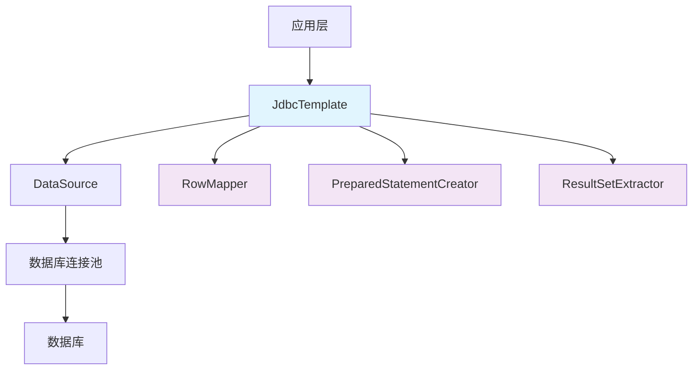

# 🗄️ JdbcTemplate 详解 <Badge type="warning" text="核心技能" />

## 📖 基础介绍

JdbcTemplate 是 Spring Framework 提供的一个核心类，用于简化 JDBC 操作。它是 Spring 对传统 JDBC API 的封装，提供了更加简洁、安全和高效的数据库访问方式。

::: info 核心特性
- **简化 JDBC 操作**：自动处理连接管理、异常处理和资源释放
- **类型安全**：提供强类型的查询结果映射
- **事务支持**：与 Spring 事务管理完美集成
- **异常处理**：将 SQLException 转换为 Spring 的 DataAccessException
- **性能优化**：支持批量操作和预编译语句
:::

## 🏗️ 核心概念

### 架构设计



### 核心组件

| 组件 | 作用 | 说明 |
|------|------|------|
| **JdbcTemplate** | 核心模板类 | 提供各种数据库操作方法 |
| **NamedParameterJdbcTemplate** | 命名参数模板 | 支持命名参数的 SQL 操作 |
| **RowMapper** | 行映射器 | 将结果集行映射为 Java 对象 |
| **ResultSetExtractor** | 结果集提取器 | 处理整个结果集 |
| **PreparedStatementCreator** | 语句创建器 | 创建预编译语句 |

## 🚀 SpringBoot 集成配置

### 1. 依赖配置

```xml
<dependencies>
    <!-- Spring Boot Starter JDBC -->
    <dependency>
        <groupId>org.springframework.boot</groupId>
        <artifactId>spring-boot-starter-jdbc</artifactId>
    </dependency>
    
    <!-- 数据库驱动 (以 MySQL 为例) -->
    <dependency>
        <groupId>com.mysql.cj.jdbc.Driver</groupId>
        <artifactId>mysql-connector-j</artifactId>
        <scope>runtime</scope>
    </dependency>
    
    <!-- 连接池已内置在 spring-boot-starter-jdbc 中 -->
</dependencies>
```

### 2. 数据源配置

```yaml
# application.yml
spring:
  datasource:
    url: jdbc:mysql://localhost:3306/testdb?useUnicode=true&characterEncoding=utf8&serverTimezone=Asia/Shanghai
    username: root
    password: password
    driver-class-name: com.mysql.cj.jdbc.Driver
    
    # HikariCP 连接池配置 (SpringBoot 2.x+ 默认)
    hikari:
      maximum-pool-size: 20
      minimum-idle: 5
      connection-timeout: 30000
      idle-timeout: 600000
      max-lifetime: 1800000
      pool-name: HikariPool-JdbcTemplate
```

### 3. 自动配置 vs 手动配置

::: tip SpringBoot 自动配置
SpringBoot 会自动配置 JdbcTemplate，无需手动创建 Bean：
```java
@Service
public class UserService {
    
    @Autowired
    private JdbcTemplate jdbcTemplate;  // 自动注入
    
    // 直接使用，无需额外配置
}
```
:::

::: details 手动配置 (高级用法)
```java
@Configuration
@EnableTransactionManagement
public class JdbcConfig {
    
    @Bean
    @Primary
    public JdbcTemplate jdbcTemplate(@Qualifier("dataSource") DataSource dataSource) {
        JdbcTemplate template = new JdbcTemplate(dataSource);
        template.setQueryTimeout(30); // 设置查询超时
        template.setFetchSize(100);    // 设置批量获取大小
        return template;
    }
    
    @Bean
    public NamedParameterJdbcTemplate namedParameterJdbcTemplate(JdbcTemplate jdbcTemplate) {
        return new NamedParameterJdbcTemplate(jdbcTemplate);
    }
}
```
:::

## 🔧 基础使用方法

### 📊 常用函数速查表

| 函数名 | 返回类型 | 作用描述 | 使用场景 |
|--------|----------|----------|----------|
| `queryForObject()` | T | 查询单个对象，期望返回一行数据 | 根据ID查询用户信息 |
| `queryForList()` | List< T > | 查询多个对象，返回列表 | 查询所有用户列表 |
| `queryForMap()` | Map< String,Object > | 查询单行数据，返回Map | 查询统计信息 |
| `queryForRowSet()` | SqlRowSet | 查询结果集，类似ResultSet | 大数据量遍历查询 |
| `query()` | List< T > | 使用RowMapper查询对象列表 | 复杂对象映射查询 |
| `update()` | int | 执行INSERT/UPDATE/DELETE | 增删改操作 |
| `batchUpdate()` | int[] | 批量执行SQL语句 | 批量插入/更新数据 |
| `execute()` | T | 执行任意SQL语句 | DDL操作、存储过程调用 |
| `call()` | Map< String,Object > | 调用存储过程 | 复杂业务逻辑处理 |

### 🔍 查询操作详解

#### 1. 查询单个值

::: tip 基础查询
适用于查询统计数据、单个字段值等简单场景
:::

```java
@Service
public class UserService {
    
    @Autowired
    private JdbcTemplate jdbcTemplate;
    
    // 查询总数
    public Long getUserCount() {
        String sql = "SELECT COUNT(*) FROM users";
        return jdbcTemplate.queryForObject(sql, Long.class);
    }
    
    // 查询单个字段
    public String getUserNameById(Long id) {
        String sql = "SELECT username FROM users WHERE id = ?";
        return jdbcTemplate.queryForObject(sql, String.class, id);
    }
    
    // 查询可能为空的值
    public String getUserEmailById(Long id) {
        String sql = "SELECT email FROM users WHERE id = ?";
        try {
            return jdbcTemplate.queryForObject(sql, String.class, id);
        } catch (EmptyResultDataAccessException e) {
            return null; // 处理查询结果为空的情况
        }
    }
}
```

#### 2. 查询单个对象

::: tip 对象映射
推荐使用 RowMapper 进行类型安全的对象映射
:::

```java
@Service
public class UserService {
    
    @Autowired
    private JdbcTemplate jdbcTemplate;
    
    // 方式1: 使用自定义 RowMapper (推荐)
    public User getUserById(Long id) {
        String sql = "SELECT id, username, email, created_at FROM users WHERE id = ?";
        return jdbcTemplate.queryForObject(sql, new UserRowMapper(), id);
    }
    
    // 方式2: 使用 Lambda 表达式 (简洁)
    public User getUserByIdLambda(Long id) {
        String sql = "SELECT id, username, email, created_at FROM users WHERE id = ?";
        return jdbcTemplate.queryForObject(sql, (rs, rowNum) -> {
            User user = new User();
            user.setId(rs.getLong("id"));
            user.setUsername(rs.getString("username"));
            user.setEmail(rs.getString("email"));
            user.setCreatedAt(rs.getTimestamp("created_at") != null ? 
                rs.getTimestamp("created_at").toLocalDateTime() : null);
            return user;
        }, id);
    }
    
    // 方式3: 使用 BeanPropertyRowMapper (自动映射)
    public User getUserByIdAuto(Long id) {
        String sql = "SELECT id, username, email, created_at FROM users WHERE id = ?";
        return jdbcTemplate.queryForObject(sql, 
            BeanPropertyRowMapper.newInstance(User.class), id);
    }
}

// 自定义 RowMapper 类
private static class UserRowMapper implements RowMapper<User> {
    @Override
    public User mapRow(ResultSet rs, int rowNum) throws SQLException {
        User user = new User();
        user.setId(rs.getLong("id"));
        user.setUsername(rs.getString("username"));
        user.setEmail(rs.getString("email"));
        // 安全处理可能为空的时间戳
        Timestamp timestamp = rs.getTimestamp("created_at");
        if (timestamp != null) {
            user.setCreatedAt(timestamp.toLocalDateTime());
        }
        return user;
    }
}
```

#### 3. 查询列表

```java
// 查询所有用户
public List<User> getAllUsers() {
    String sql = "SELECT id, username, email, created_at FROM users";
    return jdbcTemplate.query(sql, new UserRowMapper());
}

// 条件查询
public List<User> getUsersByStatus(String status) {
    String sql = "SELECT id, username, email, created_at FROM users WHERE status = ?";
    return jdbcTemplate.query(sql, new UserRowMapper(), status);
}

// 分页查询
public List<User> getUsersWithPagination(int offset, int limit) {
    String sql = "SELECT id, username, email, created_at FROM users LIMIT ? OFFSET ?";
    return jdbcTemplate.query(sql, new UserRowMapper(), limit, offset);
}
```

### ✏️ 更新操作

#### 1. 插入数据

```java
// 普通插入
public int insertUser(User user) {
    String sql = "INSERT INTO users (username, email, password) VALUES (?, ?, ?)";
    return jdbcTemplate.update(sql, user.getUsername(), user.getEmail(), user.getPassword());
}

// 获取自增主键
public Long insertUserAndGetId(User user) {
    String sql = "INSERT INTO users (username, email, password) VALUES (?, ?, ?)";
    KeyHolder keyHolder = new GeneratedKeyHolder();
    
    jdbcTemplate.update(connection -> {
        PreparedStatement ps = connection.prepareStatement(sql, Statement.RETURN_GENERATED_KEYS);
        ps.setString(1, user.getUsername());
        ps.setString(2, user.getEmail());
        ps.setString(3, user.getPassword());
        return ps;
    }, keyHolder);
    
    return keyHolder.getKey().longValue();
}
```

#### 2. 更新数据
```java
// 更新用户信息
public int updateUser(User user) {
    String sql = "UPDATE users SET username = ?, email = ? WHERE id = ?";
    return jdbcTemplate.update(sql, user.getUsername(), user.getEmail(), user.getId());
}

// 批量更新
public int[] batchUpdateUsers(List<User> users) {
    String sql = "UPDATE users SET username = ?, email = ? WHERE id = ?";
    return jdbcTemplate.batchUpdate(sql, new BatchPreparedStatementSetter() {
        @Override
        public void setValues(PreparedStatement ps, int i) throws SQLException {
            User user = users.get(i);
            ps.setString(1, user.getUsername());
            ps.setString(2, user.getEmail());
            ps.setLong(3, user.getId());
        }
        
        @Override
        public int getBatchSize() {
            return users.size();
        }
    });
}
```

#### 3. 删除数据
```java
// 根据 ID 删除
public int deleteUserById(Long id) {
    String sql = "DELETE FROM users WHERE id = ?";
    return jdbcTemplate.update(sql, id);
}

// 条件删除
public int deleteUsersByStatus(String status) {
    String sql = "DELETE FROM users WHERE status = ?";
    return jdbcTemplate.update(sql, status);
}
```

### 🔄 批处理操作

```java
// 批量插入优化
public void batchInsertUsers(List<User> users) {
    String sql = "INSERT INTO users (username, email) VALUES (?, ?)";
    
    jdbcTemplate.batchUpdate(sql, users, 1000, (ps, user) -> {
        ps.setString(1, user.getUsername());
        ps.setString(2, user.getEmail());
    });
}

// 批量更新
public int[] batchUpdateUserStatus(List<Long> userIds, String status) {
    String sql = "UPDATE users SET status = ? WHERE id = ?";
    return jdbcTemplate.batchUpdate(sql, new BatchPreparedStatementSetter() {
        @Override
        public void setValues(PreparedStatement ps, int i) throws SQLException {
            ps.setString(1, status);
            ps.setLong(2, userIds.get(i));
        }
        
        @Override
        public int getBatchSize() {
            return userIds.size();
        }
    });
}
```

## 📝 NamedParameterJdbcTemplate

::: tip NamedParameterJdbcTemplate 介绍
`NamedParameterJdbcTemplate` 是 Spring 提供的另一个 JDBC 模板类，它是 `JdbcTemplate` 的增强版本。主要区别在于：

**JdbcTemplate vs NamedParameterJdbcTemplate**

| 特性 | JdbcTemplate | NamedParameterJdbcTemplate |
|------|-------------|---------------------------|
| 参数绑定 | 使用 `?` 占位符，按位置绑定 | 使用 `:paramName` 命名参数 |
| 可读性 | 参数位置容易混乱 | 参数名称清晰明了 |
| 维护性 | 修改SQL时需要调整参数顺序 | 参数名称不受SQL顺序影响 |
| 复杂查询 | 多参数时容易出错 | 复杂查询更易维护 |

**关系说明：**
- `NamedParameterJdbcTemplate` 内部封装了 `JdbcTemplate`
- 提供了更友好的命名参数支持
- 最终还是通过 `JdbcTemplate` 执行SQL
:::

### 配置和使用

::: tip 三种配置方式
SpringBoot 环境下推荐使用自动注入，非 SpringBoot 环境可手动创建
:::

```java
@Service
public class UserService {
    
    // 方式1: SpringBoot 自动注入 (推荐)
    @Autowired
    private NamedParameterJdbcTemplate namedParameterJdbcTemplate;
    
    // 方式2: 通过 JdbcTemplate 手动创建
    @Autowired
    private JdbcTemplate jdbcTemplate;
    
    private NamedParameterJdbcTemplate namedTemplate;
    
    @PostConstruct
    public void init() {
        this.namedTemplate = new NamedParameterJdbcTemplate(jdbcTemplate);
    }
    
    // 方式3: 通过 DataSource 创建
    @Autowired
    private DataSource dataSource;
    
    public void createNamedTemplate() {
        NamedParameterJdbcTemplate template = new NamedParameterJdbcTemplate(dataSource);
    }
}
```

### 命名参数查询示例

```java
@Service
public class UserService {
    
    @Autowired
    private NamedParameterJdbcTemplate namedParameterJdbcTemplate;
    
    // 1. 使用 Map 传递参数
    public User getUserByUsernameAndEmail(String username, String email) {
        String sql = "SELECT id, username, email, created_at FROM users " +
                    "WHERE username = :username AND email = :email";
        
        Map<String, Object> params = new HashMap<>();
        params.put("username", username);
        params.put("email", email);
        
        return namedParameterJdbcTemplate.queryForObject(sql, params, new UserRowMapper());
    }
    
    // 2. 使用 MapSqlParameterSource (推荐)
    public List<User> getUsersByStatus(String status, int limit) {
        String sql = "SELECT id, username, email, created_at FROM users " +
                    "WHERE status = :status LIMIT :limit";
        
        MapSqlParameterSource params = new MapSqlParameterSource()
            .addValue("status", status)
            .addValue("limit", limit);
        
        return namedParameterJdbcTemplate.query(sql, params, new UserRowMapper());
    }
    
    // 3. 使用 BeanPropertySqlParameterSource (对象属性映射)
    public int insertUser(User user) {
        String sql = "INSERT INTO users (username, email, status) " +
                    "VALUES (:username, :email, :status)";
        
        SqlParameterSource params = new BeanPropertySqlParameterSource(user);
        return namedParameterJdbcTemplate.update(sql, params);
    }
    
    // 4. 复杂查询示例
    public List<User> searchUsers(UserSearchCriteria criteria) {
        StringBuilder sql = new StringBuilder(
            "SELECT id, username, email, created_at FROM users WHERE 1=1");
        
        MapSqlParameterSource params = new MapSqlParameterSource();
        
        if (criteria.getUsername() != null) {
            sql.append(" AND username LIKE :username");
            params.addValue("username", "%" + criteria.getUsername() + "%");
        }
        
        if (criteria.getEmail() != null) {
            sql.append(" AND email = :email");
            params.addValue("email", criteria.getEmail());
        }
        
        if (criteria.getStartDate() != null) {
            sql.append(" AND created_at >= :startDate");
            params.addValue("startDate", criteria.getStartDate());
        }
        
        if (criteria.getEndDate() != null) {
            sql.append(" AND created_at <= :endDate");
            params.addValue("endDate", criteria.getEndDate());
        }
        
        sql.append(" ORDER BY created_at DESC LIMIT :limit OFFSET :offset");
        params.addValue("limit", criteria.getLimit());
        params.addValue("offset", criteria.getOffset());
        
        return namedParameterJdbcTemplate.query(sql.toString(), params, new UserRowMapper());
    }
}
```

### 批量操作

```java
// 批量插入用户
public int[] batchInsertUsers(List<User> users) {
    String sql = "INSERT INTO users (username, email, status) " +
                "VALUES (:username, :email, :status)";
    
    SqlParameterSource[] batchParams = users.stream()
        .map(BeanPropertySqlParameterSource::new)
        .toArray(SqlParameterSource[]::new);
    
    return namedParameterJdbcTemplate.batchUpdate(sql, batchParams);
}

// 批量更新状态
public int[] batchUpdateUserStatus(List<Long> userIds, String status) {
    String sql = "UPDATE users SET status = :status WHERE id = :id";
    
    List<MapSqlParameterSource> batchParams = userIds.stream()
        .map(id -> new MapSqlParameterSource()
            .addValue("id", id)
            .addValue("status", status))
        .collect(Collectors.toList());
    
    return namedParameterJdbcTemplate.batchUpdate(sql, 
        batchParams.toArray(new SqlParameterSource[0]));
}
```

## 🎯 最佳实践和注意事项

### 1. 性能优化建议

::: tip 性能优化
- **连接池配置**：合理配置 HikariCP 连接池参数
- **批量操作**：大量数据操作时使用 `batchUpdate`
- **预编译语句**：重复执行的 SQL 会被缓存和优化
- **结果集映射**：选择合适的 RowMapper 实现
:::

```java
@Configuration
public class DatabaseConfig {
    
    @Bean
    @ConfigurationProperties("spring.datasource.hikari")
    public HikariConfig hikariConfig() {
        HikariConfig config = new HikariConfig();
        config.setMaximumPoolSize(20);
        config.setMinimumIdle(5);
        config.setConnectionTimeout(30000);
        config.setIdleTimeout(600000);
        config.setMaxLifetime(1800000);
        return config;
    }
}
```

### 2. 错误处理和事务管理

```java
@Service
@Transactional
public class UserService {
    
    @Autowired
    private JdbcTemplate jdbcTemplate;
    
    @Transactional(rollbackFor = Exception.class)
    public void transferUserData(Long fromUserId, Long toUserId, BigDecimal amount) {
        try {
            // 扣减源用户余额
            int updated = jdbcTemplate.update(
                "UPDATE users SET balance = balance - ? WHERE id = ? AND balance >= ?",
                amount, fromUserId, amount
            );
            
            if (updated == 0) {
                throw new InsufficientBalanceException("余额不足");
            }
            
            // 增加目标用户余额
            jdbcTemplate.update(
                "UPDATE users SET balance = balance + ? WHERE id = ?",
                amount, toUserId
            );
            
            // 记录转账日志
            jdbcTemplate.update(
                "INSERT INTO transfer_log (from_user_id, to_user_id, amount, create_time) VALUES (?, ?, ?, ?)",
                fromUserId, toUserId, amount, new Timestamp(System.currentTimeMillis())
            );
            
        } catch (DataAccessException e) {
            log.error("转账操作失败: fromUserId={}, toUserId={}, amount={}", fromUserId, toUserId, amount, e);
            throw new TransferException("转账操作失败", e);
        }
    }
}
```

### 3. 实际应用场景示例

```java
@Repository
public class OrderRepository {
    
    @Autowired
    private JdbcTemplate jdbcTemplate;
    
    @Autowired
    private NamedParameterJdbcTemplate namedParameterJdbcTemplate;
    
    // 复杂统计查询
    public OrderStatistics getOrderStatistics(LocalDate startDate, LocalDate endDate) {
        String sql = """
            SELECT 
                COUNT(*) as total_orders,
                SUM(total_amount) as total_revenue,
                AVG(total_amount) as avg_order_value,
                COUNT(DISTINCT user_id) as unique_customers
            FROM orders 
            WHERE create_date BETWEEN ? AND ?
            AND status = 'COMPLETED'
            """;
        
        return jdbcTemplate.queryForObject(sql, (rs, rowNum) -> 
            OrderStatistics.builder()
                .totalOrders(rs.getLong("total_orders"))
                .totalRevenue(rs.getBigDecimal("total_revenue"))
                .avgOrderValue(rs.getBigDecimal("avg_order_value"))
                .uniqueCustomers(rs.getLong("unique_customers"))
                .build(),
            startDate, endDate
        );
    }
    
    // 分页查询
    public PageResult<Order> findOrdersByPage(OrderQuery query, int page, int size) {
        StringBuilder countSql = new StringBuilder("SELECT COUNT(*) FROM orders WHERE 1=1");
        StringBuilder dataSql = new StringBuilder("SELECT * FROM orders WHERE 1=1");
        MapSqlParameterSource params = new MapSqlParameterSource();
        
        // 动态构建查询条件
        if (query.getUserId() != null) {
            String condition = " AND user_id = :userId";
            countSql.append(condition);
            dataSql.append(condition);
            params.addValue("userId", query.getUserId());
        }
        
        if (query.getStatus() != null) {
            String condition = " AND status = :status";
            countSql.append(condition);
            dataSql.append(condition);
            params.addValue("status", query.getStatus());
        }
        
        if (query.getStartDate() != null && query.getEndDate() != null) {
            String condition = " AND create_date BETWEEN :startDate AND :endDate";
            countSql.append(condition);
            dataSql.append(condition);
            params.addValue("startDate", query.getStartDate());
            params.addValue("endDate", query.getEndDate());
        }
        
        // 添加排序和分页
        dataSql.append(" ORDER BY create_date DESC LIMIT :limit OFFSET :offset");
        params.addValue("limit", size);
        params.addValue("offset", page * size);
        
        // 执行查询
        Long total = namedParameterJdbcTemplate.queryForObject(countSql.toString(), params, Long.class);
        List<Order> orders = namedParameterJdbcTemplate.query(dataSql.toString(), params, new BeanPropertyRowMapper<>(Order.class));
        
        return new PageResult<>(orders, total, page, size);
    }
}
```

### 4. 常见问题和解决方案

::: warning 常见陷阱
1. **SQL 注入**：始终使用参数化查询，避免字符串拼接
2. **连接泄漏**：确保在 finally 块中关闭资源（Spring 会自动管理）
3. **大结果集**：使用流式处理或分页查询避免内存溢出
4. **事务边界**：合理设置事务范围，避免长事务
:::

```java
// ❌ 错误示例 - SQL 注入风险
public User findUserByName(String name) {
    String sql = "SELECT * FROM users WHERE name = '" + name + "'";
    return jdbcTemplate.queryForObject(sql, new BeanPropertyRowMapper<>(User.class));
}

// ✅ 正确示例 - 参数化查询
public User findUserByName(String name) {
    String sql = "SELECT * FROM users WHERE name = ?";
    return jdbcTemplate.queryForObject(sql, new BeanPropertyRowMapper<>(User.class), name);
}

// 大结果集处理
public void processLargeDataSet() {
    String sql = "SELECT * FROM large_table";
    
    jdbcTemplate.query(sql, rs -> {
        // 流式处理每一行
        while (rs.next()) {
            processRow(rs);
        }
    });
}
```

## 📚 总结

JdbcTemplate 和 NamedParameterJdbcTemplate 是 Spring 框架中强大的数据访问工具：

### JdbcTemplate 特点
- ✅ **轻量级**：相比 ORM 框架更轻量，性能更好
- ✅ **灵活性**：可以编写复杂的 SQL 查询
- ✅ **事务支持**：与 Spring 事务管理无缝集成
- ✅ **异常处理**：统一的异常处理机制

### NamedParameterJdbcTemplate 特点
- ✅ **可读性**：命名参数比位置参数更易读
- ✅ **维护性**：参数顺序变化不影响代码
- ✅ **对象映射**：支持对象属性直接映射为参数

### 选择建议
- **简单查询**：使用 JdbcTemplate
- **复杂参数**：使用 NamedParameterJdbcTemplate
- **批量操作**：两者都支持，根据参数复杂度选择
- **性能要求极高**：JdbcTemplate 略优于 NamedParameterJdbcTemplate

通过合理使用这两个工具，可以在保持高性能的同时，编写出清晰、可维护的数据访问代码。