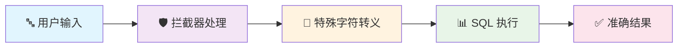
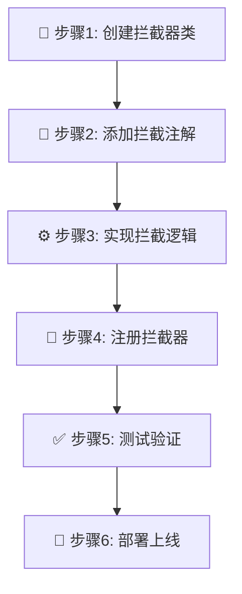

# 🛡️ MyBatis 自定义拦截器处理模糊查询特殊字符

> 📌 **核心问题**：在使用 MyBatis 进行模糊查询时，如果查询参数中包含 SQL 通配符（`%`、`_`）或转义字符（`\`），会导致查询结果不准确。

## 🎯 问题背景

### 🔍 **问题描述**

在进行模糊查询时，用户输入的查询条件可能包含特殊字符：

| 🔤 特殊字符 | 📝 SQL 中的含义 | 🚨 问题影响 |
|------------|----------------|------------|
| `%` | 匹配任意长度字符串 | 🔍 查询范围过大，返回不相关结果 |
| `_` | 匹配单个字符 | 🎯 精确匹配失效，返回额外结果 |
| `\` | 转义字符 | ⚠️ 转义逻辑混乱，查询异常 |

### 💡 **解决方案概述**

通过自定义 MyBatis 拦截器，在 SQL 执行前自动转义查询参数中的特殊字符：



---

## 🔧 拦截器类创建

### 📝 **完整实现代码**

```java
package com.example.interceptor;

import org.apache.ibatis.executor.Executor;
import org.apache.ibatis.mapping.MappedStatement;
import org.apache.ibatis.mapping.SqlCommandType;
import org.apache.ibatis.plugin.*;
import org.apache.ibatis.session.ResultHandler;
import org.apache.ibatis.session.RowBounds;
import org.slf4j.Logger;
import org.slf4j.LoggerFactory;

import java.lang.reflect.Field;
import java.util.*;
import java.util.concurrent.atomic.AtomicLong;
import java.util.regex.Pattern;

/**
 * 🛡️ 模糊查询特殊字符转义拦截器
 * 
 * 📋 功能特性：
 * ✅ 自动转义 LIKE 查询中的特殊字符（%, _, \）
 * ✅ 支持复杂对象和集合的递归处理  
 * ✅ 高性能设计，最小化性能影响
 * ✅ 完善的日志记录和监控
 * ✅ 异常安全，不影响业务流程
 * 
 * @author YourName
 * @version 1.0.0
 * @since 2024-01-01
 */
@Intercepts({
    @Signature(
        type = Executor.class,
        method = "query",
        args = {MappedStatement.class, Object.class, RowBounds.class, ResultHandler.class}
    )
})
public class LikeEscapeInterceptor implements Interceptor {
    
    private static final Logger logger = LoggerFactory.getLogger(LikeEscapeInterceptor.class);
    
    // 🎯 需要转义的特殊字符正则模式
    private static final Pattern SPECIAL_CHARS_PATTERN = Pattern.compile("[\\\\_%]");
    
    // 📊 性能统计计数器
    private static final AtomicLong PROCESSED_COUNT = new AtomicLong(0);
    private static final AtomicLong ESCAPED_COUNT = new AtomicLong(0);
    
    // 🔧 配置参数
    private boolean enableLogging = true;
    private int cacheSize = 1000;
    
    /**
     * 🔧 核心拦截方法
     */
    @Override
    public Object intercept(Invocation invocation) throws Throwable {
        long startTime = System.currentTimeMillis();
        
        try {
            Object[] args = invocation.getArgs();
            MappedStatement ms = (MappedStatement) args[0];
            Object parameter = args[1];
            
            if (enableLogging) {
                logger.debug("🔍 拦截查询: {}", ms.getId());
            }
            
            // ⚡ 性能优化：只处理 SELECT 语句
            if (ms.getSqlCommandType() != SqlCommandType.SELECT) {
                return invocation.proceed();
            }
            
            // 🔧 处理查询参数
            if (parameter != null) {
                processParameter(parameter);
                PROCESSED_COUNT.incrementAndGet();
                
                if (enableLogging) {
                    logger.debug("✅ 参数处理完成，耗时: {}ms", 
                               System.currentTimeMillis() - startTime);
                }
            }
            
            return invocation.proceed();
            
        } catch (Exception e) {
            logger.error("❌ 拦截器处理异常: {}", e.getMessage(), e);
            // 🛡️ 异常情况下继续执行，保证业务不受影响
            return invocation.proceed();
        }
    }

    /**
     * 🔄 递归处理参数对象
     */
    private void processParameter(Object parameter) {
        if (parameter == null) {
            return;
        }

        if (parameter instanceof String) {
            // 📝 String 是不可变的，无法直接修改
            logger.debug("🔤 发现字符串参数: {}", parameter);
            
        } else if (parameter instanceof Map) {
            processMap((Map<?, ?>) parameter);
            
        } else if (parameter instanceof Collection) {
            processCollection((Collection<?>) parameter);
            
        } else if (parameter.getClass().isArray()) {
            processArray(parameter);
            
        } else {
            processObject(parameter);
        }
    }

    /**
     * 🗂️ 处理 Map 类型参数
     */
    @SuppressWarnings("unchecked")
    private void processMap(Map<?, ?> map) {
        for (Map.Entry<?, ?> entry : map.entrySet()) {
            Object value = entry.getValue();
            if (value instanceof String) {
                String originalValue = (String) value;
                String escapedValue = escapeSpecialChars(originalValue);
                
                if (!originalValue.equals(escapedValue)) {
                    ((Map<Object, Object>) map).put(entry.getKey(), escapedValue);
                    ESCAPED_COUNT.incrementAndGet();
                    
                    if (enableLogging) {
                        logger.debug("🔄 Map参数转义: {} -> {}", originalValue, escapedValue);
                    }
                }
            } else if (value != null) {
                processParameter(value);
            }
        }
    }

    /**
     * 📋 处理集合类型参数
     */
    @SuppressWarnings("unchecked")
    private void processCollection(Collection<?> collection) {
        if (collection instanceof List) {
            List<Object> list = (List<Object>) collection;
            for (int i = 0; i < list.size(); i++) {
                Object item = list.get(i);
                if (item instanceof String) {
                    String originalValue = (String) item;
                    String escapedValue = escapeSpecialChars(originalValue);
                    
                    if (!originalValue.equals(escapedValue)) {
                        list.set(i, escapedValue);
                        ESCAPED_COUNT.incrementAndGet();
                        
                        if (enableLogging) {
                            logger.debug("🔄 List参数转义: {} -> {}", originalValue, escapedValue);
                        }
                    }
                } else if (item != null) {
                    processParameter(item);
                }
            }
        } else {
            // 其他集合类型的处理
            for (Object item : collection) {
                if (item != null) {
                    processParameter(item);
                }
            }
        }
    }

    /**
     * 🔢 处理数组类型参数
     */
    private void processArray(Object array) {
        if (array instanceof String[]) {
            String[] stringArray = (String[]) array;
            for (int i = 0; i < stringArray.length; i++) {
                if (stringArray[i] != null) {
                    String originalValue = stringArray[i];
                    String escapedValue = escapeSpecialChars(originalValue);
                    
                    if (!originalValue.equals(escapedValue)) {
                        stringArray[i] = escapedValue;
                        ESCAPED_COUNT.incrementAndGet();
                        
                        if (enableLogging) {
                            logger.debug("🔄 数组参数转义: {} -> {}", originalValue, escapedValue);
                        }
                    }
                }
            }
        } else if (array instanceof Object[]) {
            Object[] objectArray = (Object[]) array;
            for (Object item : objectArray) {
                if (item != null) {
                    processParameter(item);
                }
            }
        }
    }

    /**
     * 🏗️ 处理自定义对象
     */
    private void processObject(Object obj) {
        Class<?> clazz = obj.getClass();
        
        // ⏭️ 跳过基本类型和包装类
        if (clazz.isPrimitive() || isWrapperType(clazz) || clazz.getName().startsWith("java.")) {
            return;
        }
        
        Field[] fields = clazz.getDeclaredFields();
        
        for (Field field : fields) {
            try {
                field.setAccessible(true);
                Object value = field.get(obj);
                
                if (value instanceof String) {
                    String originalValue = (String) value;
                    String escapedValue = escapeSpecialChars(originalValue);
                    
                    if (!originalValue.equals(escapedValue)) {
                        field.set(obj, escapedValue);
                        ESCAPED_COUNT.incrementAndGet();
                        
                        if (enableLogging) {
                            logger.debug("🔄 对象字段转义: {}.{} = {} -> {}", 
                                       clazz.getSimpleName(), field.getName(), 
                                       originalValue, escapedValue);
                        }
                    }
                } else if (value != null) {
                    processParameter(value);
                }
                
            } catch (IllegalAccessException e) {
                logger.warn("⚠️ 无法访问字段: {}.{}", clazz.getSimpleName(), field.getName());
            }
        }
    }

    /**
     * 🛡️ 特殊字符转义核心算法
     */
    private String escapeSpecialChars(String input) {
        if (input == null || input.isEmpty()) {
            return input;
        }
        
        // ⚡ 快速检查：如果不包含特殊字符，直接返回
        if (!SPECIAL_CHARS_PATTERN.matcher(input).find()) {
            return input;
        }
        
        // 🔧 按正确顺序进行转义（顺序很重要！）
        return input
            .replace("\\", "\\\\")  // 1️⃣ 先转义反斜杠
            .replace("_", "\\_")    // 2️⃣ 再转义下划线  
            .replace("%", "\\%");   // 3️⃣ 最后转义百分号
    }

    /**
     * 🔍 判断是否为包装类型
     */
    private boolean isWrapperType(Class<?> clazz) {
        return clazz == Boolean.class || clazz == Character.class ||
               clazz == Byte.class || clazz == Short.class ||
               clazz == Integer.class || clazz == Long.class ||
               clazz == Float.class || clazz == Double.class;
    }

    /**
     * 🔧 创建代理对象
     */
    @Override
    public Object plugin(Object target) {
        return Plugin.wrap(target, this);
    }

    /**
     * 🎛️ 设置配置属性
     */
    @Override
    public void setProperties(Properties properties) {
        String enableLoggingStr = properties.getProperty("enableLogging");
        if (enableLoggingStr != null) {
            this.enableLogging = Boolean.parseBoolean(enableLoggingStr);
        }
        
        String cacheSizeStr = properties.getProperty("cacheSize");
        if (cacheSizeStr != null) {
            this.cacheSize = Integer.parseInt(cacheSizeStr);
        }
        
        logger.info("🎛️ 拦截器配置 - 启用日志: {}, 缓存大小: {}", enableLogging, cacheSize);
    }
    
    /**
     * 📊 获取处理统计信息
     */
    public static Map<String, Long> getStatistics() {
        Map<String, Long> stats = new HashMap<>();
        stats.put("processedCount", PROCESSED_COUNT.get());
        stats.put("escapedCount", ESCAPED_COUNT.get());
        return stats;
    }
}
```

### 🎯 **核心特性说明**

| 🔧 特性 | 📝 说明 | 💡 优势 |
|---------|---------|----------|
| **🔄 递归处理** | 支持复杂对象、Map、集合、数组 | 📈 覆盖所有参数类型 |
| **⚡ 性能优化** | 快速检查、只处理SELECT语句 | 🚀 最小化性能影响 |
| **🛡️ 异常安全** | 异常情况下不影响业务流程 | 🔒 保证系统稳定性 |
| **📊 监控统计** | 处理计数、转义计数 | 📈 便于性能分析 |
| **🎛️ 可配置** | 支持日志开关、缓存大小配置 | 🔧 灵活适应不同环境 |

---

## 🔧 拦截器注册配置

### 📋 **注册方式对比**

| 🎯 注册方式 | 🔧 适用场景 | 💡 优势 | ⚠️ 注意事项 |
|------------|------------|---------|------------|
| **XML配置** | 传统MyBatis项目 | 🎛️ 配置集中、易管理 | 📝 需要维护XML文件 |
| **Spring Boot** | 现代微服务项目 | 🚀 自动装配、零配置 | 🔗 依赖Spring生态 |
| **编程式注册** | 动态配置场景 | 🔄 灵活控制、运行时配置 | 🧩 代码复杂度较高 |

---

### 🎛️ **方式一：MyBatis 配置文件注册**

在 `mybatis-config.xml` 中注册拦截器：

```xml
<?xml version="1.0" encoding="UTF-8"?>
<!DOCTYPE configuration PUBLIC "-//mybatis.org//DTD Config 3.0//EN" 
    "http://mybatis.org/dtd/mybatis-3-config.dtd">
<configuration>
    <!-- 🔧 插件配置区域 -->
    <plugins>
        <!-- 🛡️ 模糊查询特殊字符转义拦截器 -->
        <plugin interceptor="com.example.interceptor.LikeEscapeInterceptor">
            <!-- 🎛️ 拦截器配置参数 -->
            <property name="enableLogging" value="true"/>
            <property name="cacheSize" value="1000"/>
            <property name="escapeMode" value="auto"/>
            <property name="excludePatterns" value="system_*,temp_*"/>
        </plugin>
        
        <!-- 📊 可以配置多个拦截器，按顺序执行 -->
        <!-- <plugin interceptor="com.example.interceptor.OtherInterceptor"/> -->
    </plugins>
    
    <!-- 🗂️ 其他配置... -->
    <environments default="development">
        <environment id="development">
            <transactionManager type="JDBC"/>
            <dataSource type="POOLED">
                <!-- 数据源配置 -->
            </dataSource>
        </environment>
    </environments>
</configuration>
```

#### 🔍 **配置参数详解**

| 🎛️ 参数名 | 📝 说明 | 🔧 默认值 | 💡 示例 |
|-----------|---------|----------|----------|
| `enableLogging` | 是否启用详细日志 | `true` | `true/false` |
| `cacheSize` | 缓存大小限制 | `1000` | `500, 2000` |
| `escapeMode` | 转义模式 | `auto` | `auto/manual/strict` |
| `excludePatterns` | 排除的参数模式 | `null` | `system_*,temp_*` |

---

### 🚀 **方式二：Spring Boot 自动配置**

#### 📝 **基础配置类**

```java
package com.example.config;

import com.example.interceptor.LikeEscapeInterceptor;
import org.apache.ibatis.session.SqlSessionFactory;
import org.mybatis.spring.SqlSessionFactoryBean;
import org.springframework.context.annotation.Bean;
import org.springframework.context.annotation.Configuration;
import org.springframework.core.io.support.PathMatchingResourcePatternResolver;

import javax.sql.DataSource;

/**
 * 🔧 MyBatis 配置类
 * 
 * 📋 功能特性：
 * ✅ 自动注册拦截器
 * ✅ 配置 SQL 会话工厂
 * ✅ 支持多环境配置
 * ✅ 集成 Spring Boot 自动装配
 */
@Configuration
public class MyBatisConfig {
    
    /**
     * 🛡️ 注册模糊查询转义拦截器
     */
    @Bean
    public LikeEscapeInterceptor likeEscapeInterceptor() {
        LikeEscapeInterceptor interceptor = new LikeEscapeInterceptor();
        
        // 🎛️ 可以通过代码设置配置
        Properties properties = new Properties();
        properties.setProperty("enableLogging", "true");
        properties.setProperty("cacheSize", "2000");
        interceptor.setProperties(properties);
        
        return interceptor;
    }
    
    /**
     * 🏭 配置 SqlSessionFactory
     */
    @Bean
    public SqlSessionFactory sqlSessionFactory(DataSource dataSource, 
                                             LikeEscapeInterceptor interceptor) throws Exception {
        SqlSessionFactoryBean factoryBean = new SqlSessionFactoryBean();
        factoryBean.setDataSource(dataSource);
        
        // 📁 设置 Mapper XML 文件位置
        factoryBean.setMapperLocations(
            new PathMatchingResourcePatternResolver()
                .getResources("classpath*:mapper/*.xml")
        );
        
        // 🛡️ 添加拦截器
        factoryBean.setPlugins(interceptor);
        
        return factoryBean.getObject();
    }
}
```

#### 🎯 **高级配置（条件化注册）**

```java
package com.example.config;

import com.example.interceptor.LikeEscapeInterceptor;
import org.springframework.boot.autoconfigure.condition.ConditionalOnProperty;
import org.springframework.boot.context.properties.ConfigurationProperties;
import org.springframework.context.annotation.Bean;
import org.springframework.context.annotation.Configuration;

/**
 * 🎛️ 高级 MyBatis 配置
 * 
 * 📋 特性：
 * ✅ 条件化注册（可通过配置开关）
 * ✅ 外部化配置支持
 * ✅ 多环境适配
 */
@Configuration
public class AdvancedMyBatisConfig {
    
    /**
     * 🔧 拦截器配置属性
     */
    @ConfigurationProperties(prefix = "mybatis.interceptor.like-escape")
    public static class LikeEscapeProperties {
        private boolean enabled = true;
        private boolean enableLogging = true;
        private int cacheSize = 1000;
        private String escapeMode = "auto";
        private String[] excludePatterns = {};
        
        // 🔧 Getter/Setter 方法...
        public boolean isEnabled() { return enabled; }
        public void setEnabled(boolean enabled) { this.enabled = enabled; }
        
        public boolean isEnableLogging() { return enableLogging; }
        public void setEnableLogging(boolean enableLogging) { this.enableLogging = enableLogging; }
        
        public int getCacheSize() { return cacheSize; }
        public void setCacheSize(int cacheSize) { this.cacheSize = cacheSize; }
        
        public String getEscapeMode() { return escapeMode; }
        public void setEscapeMode(String escapeMode) { this.escapeMode = escapeMode; }
        
        public String[] getExcludePatterns() { return excludePatterns; }
        public void setExcludePatterns(String[] excludePatterns) { this.excludePatterns = excludePatterns; }
    }
    
    /**
     * 🛡️ 条件化注册拦截器
     */
    @Bean
    @ConditionalOnProperty(
        prefix = "mybatis.interceptor.like-escape", 
        name = "enabled", 
        havingValue = "true", 
        matchIfMissing = true
    )
    public LikeEscapeInterceptor conditionalLikeEscapeInterceptor(LikeEscapeProperties properties) {
        LikeEscapeInterceptor interceptor = new LikeEscapeInterceptor();
        
        // 🎛️ 应用外部配置
        Properties props = new Properties();
        props.setProperty("enableLogging", String.valueOf(properties.isEnableLogging()));
        props.setProperty("cacheSize", String.valueOf(properties.getCacheSize()));
        props.setProperty("escapeMode", properties.getEscapeMode());
        
        if (properties.getExcludePatterns().length > 0) {
            props.setProperty("excludePatterns", String.join(",", properties.getExcludePatterns()));
        }
        
        interceptor.setProperties(props);
        
        return interceptor;
    }
}
```

#### 📝 **application.yml 配置**

```yaml
# 🎛️ MyBatis 拦截器配置
mybatis:
  interceptor:
    like-escape:
      enabled: true              # 🔧 是否启用拦截器
      enable-logging: true       # 📊 是否启用详细日志
      cache-size: 2000          # 🗂️ 缓存大小
      escape-mode: auto         # 🔧 转义模式：auto/manual/strict
      exclude-patterns:         # 🚫 排除的参数模式
        - "system_*"
        - "temp_*"
        - "internal_*"

# 📊 日志配置
logging:
  level:
    com.example.interceptor.LikeEscapeInterceptor: DEBUG
```

---

### 🔄 **方式三：编程式动态注册**

```java
package com.example.service;

import com.example.interceptor.LikeEscapeInterceptor;
import org.apache.ibatis.session.Configuration;
import org.apache.ibatis.session.SqlSessionFactory;
import org.springframework.beans.factory.annotation.Autowired;
import org.springframework.stereotype.Service;

/**
 * 🔄 动态拦截器管理服务
 */
@Service
public class InterceptorManagementService {
    
    @Autowired
    private SqlSessionFactory sqlSessionFactory;
    
    /**
     * 🔧 动态添加拦截器
     */
    public void addLikeEscapeInterceptor() {
        Configuration configuration = sqlSessionFactory.getConfiguration();
        
        // 🔍 检查是否已存在
        boolean exists = configuration.getInterceptors().stream()
            .anyMatch(interceptor -> interceptor instanceof LikeEscapeInterceptor);
            
        if (!exists) {
            LikeEscapeInterceptor interceptor = new LikeEscapeInterceptor();
            
            // 🎛️ 设置配置
            Properties properties = new Properties();
            properties.setProperty("enableLogging", "true");
            interceptor.setProperties(properties);
            
            // ➕ 添加到配置中
            configuration.addInterceptor(interceptor);
            
            logger.info("✅ 动态添加 LikeEscapeInterceptor 成功");
        }
    }
    
    /**
     * 🗑️ 动态移除拦截器
     */
    public void removeLikeEscapeInterceptor() {
        Configuration configuration = sqlSessionFactory.getConfiguration();
        
        // 🔍 查找并移除
        configuration.getInterceptors().removeIf(
            interceptor -> interceptor instanceof LikeEscapeInterceptor
        );
        
        logger.info("🗑️ 动态移除 LikeEscapeInterceptor 成功");
    }
}
```

### 3. 使用示例

#### Mapper 接口

```java
public interface UserMapper {
    
    /**
     * 根据用户名模糊查询
     * 
     * @param username 用户名（可能包含特殊字符）
     * @return 用户列表
     */
    List<User> findByUsernameLike(@Param("username") String username);
    
    /**
     * 多条件模糊查询
     * 
     * @param searchParams 查询参数
     * @return 用户列表
     */
    List<User> searchUsers(@Param("searchParams") Map<String, Object> searchParams);
}
```

#### SQL 映射文件

```xml
<!-- UserMapper.xml -->
<mapper namespace="com.example.mapper.UserMapper">
    
    <!-- 单个参数模糊查询 -->
    <select id="findByUsernameLike" resultType="User">
        SELECT * FROM users 
        WHERE username LIKE CONCAT('%', #{username}, '%') ESCAPE '\\'
    </select>
    
    <!-- 多条件模糊查询 -->
    <select id="searchUsers" resultType="User">
        SELECT * FROM users 
        WHERE 1=1
        <if test="searchParams.username != null and searchParams.username != ''">
            AND username LIKE CONCAT('%', #{searchParams.username}, '%') ESCAPE '\\'
        </if>
        <if test="searchParams.email != null and searchParams.email != ''">
            AND email LIKE CONCAT('%', #{searchParams.email}, '%') ESCAPE '\\'
        </if>
    </select>
    
</mapper>
```

## 🔍 自定义 MyBatis 拦截器完整指南

### 📋 开发步骤总览

自定义 MyBatis 拦截器需要遵循以下 **6 个核心步骤**：



---

### 📝 步骤 1：创建拦截器类

#### 🎯 **作用说明**
创建一个实现 `Interceptor` 接口的类，这是 MyBatis 拦截器的基础结构。

#### 💡 **实现原理**
MyBatis 通过 `Interceptor` 接口定义了拦截器的标准规范，所有自定义拦截器都必须实现这个接口。

```java
/**
 * 🛡️ 模糊查询特殊字符转义拦截器
 * 
 * 📌 核心功能：
 * - 自动转义 LIKE 查询中的特殊字符（%, _, \）
 * - 支持复杂对象和集合的递归处理
 * - 保证查询结果的准确性
 */
public class LikeEscapeInterceptor implements Interceptor {
    
    private static final Logger logger = LoggerFactory.getLogger(LikeEscapeInterceptor.class);
    
    // 🔧 需要转义的特殊字符模式
    private static final Pattern SPECIAL_CHARS_PATTERN = Pattern.compile("[\\\\_%]");
    
    // 📊 性能统计
    private static final AtomicLong PROCESSED_COUNT = new AtomicLong(0);
    
    // ... 具体实现将在后续步骤中展示
}
```

#### ⚠️ **注意事项**
- 类必须是 `public` 的，以便 MyBatis 能够实例化
- 建议添加日志记录，便于调试和监控
- 考虑线程安全性，避免使用实例变量存储状态

---

### 🎯 步骤 2：添加拦截注解

#### 🎯 **作用说明**
通过 `@Intercepts` 和 `@Signature` 注解精确指定要拦截的方法，这是拦截器的"定位系统"。

#### 💡 **实现原理**
MyBatis 在启动时会扫描这些注解，为匹配的方法创建动态代理，实现 AOP 切面编程。

```java
/**
 * 🎯 拦截器注解配置详解
 */
@Intercepts({
    @Signature(
        type = Executor.class,           // 🎯 目标类型：执行器接口
        method = "query",                // 🎯 目标方法：查询方法
        args = {                         // 🎯 方法参数：精确匹配方法签名
            MappedStatement.class,       //   - SQL 映射语句对象
            Object.class,                //   - 查询参数对象
            RowBounds.class,             //   - 分页参数对象
            ResultHandler.class          //   - 结果处理器对象
        }
    )
})
public class LikeEscapeInterceptor implements Interceptor {
    // ... 实现代码
}
```

#### 📊 **可拦截的目标类型对比**

| 🎯 目标类型 | 📝 描述 | 🔧 适用场景 | ⚡ 性能影响 |
|------------|---------|------------|-----------|
| `Executor` | SQL 执行器 | 参数预处理、缓存控制 | ⭐⭐⭐ 低 |
| `StatementHandler` | 语句处理器 | SQL 语句增强、动态修改 | ⭐⭐ 中等 |
| `ParameterHandler` | 参数处理器 | 参数值转换、加密解密 | ⭐⭐ 中等 |
| `ResultSetHandler` | 结果处理器 | 结果集转换、数据脱敏 | ⭐ 高 |

#### 🎯 **选择 Executor.query 的深层原因**

```java
/**
 * 🔍 为什么选择 Executor.query？
 * 
 * ✅ 优势：
 * 1. 📍 统一入口：所有查询都经过这里
 * 2. 🔧 参数完整：参数对象还未被分解
 * 3. ⏰ 时机合适：SQL 执行前的最佳处理点
 * 4. ⚡ 性能最优：避免底层拦截的开销
 * 
 * ❌ 局限：
 * 1. 只能处理查询操作，无法处理增删改
 * 2. 无法修改 SQL 语句本身
 */
```

---

### ⚙️ 步骤 3：实现拦截逻辑

#### 🎯 **作用说明**
实现 `intercept` 方法，这是拦截器的核心业务逻辑，负责参数处理和特殊字符转义。

#### 💡 **实现原理**
通过反射机制遍历参数对象的所有字段，识别字符串类型字段并进行特殊字符转义处理。

```java
/**
 * 🔧 核心拦截逻辑实现
 */
@Override
public Object intercept(Invocation invocation) throws Throwable {
    // 📊 性能监控开始
    long startTime = System.currentTimeMillis();
    
    try {
        // 🎯 获取拦截的方法参数
        Object[] args = invocation.getArgs();
        MappedStatement ms = (MappedStatement) args[0];
        Object parameter = args[1];
        
        // 📋 日志记录
        logger.debug("🔍 拦截到查询操作: {}", ms.getId());
        
        // ⚡ 性能优化：只处理 SELECT 语句
        if (ms.getSqlCommandType() != SqlCommandType.SELECT) {
            logger.debug("⏭️ 跳过非查询操作: {}", ms.getSqlCommandType());
            return invocation.proceed();
        }
        
        // 🔧 参数处理
        if (parameter != null) {
            processParameter(parameter);
            logger.debug("✅ 参数处理完成，耗时: {}ms", 
                        System.currentTimeMillis() - startTime);
        }
        
        // 📈 统计计数
        PROCESSED_COUNT.incrementAndGet();
        
        // 🚀 继续执行原方法
        return invocation.proceed();
        
    } catch (Exception e) {
        logger.error("❌ 拦截器处理异常", e);
        // 🛡️ 异常情况下继续执行，保证业务不受影响
        return invocation.proceed();
    }
}

/**
 * 🔄 递归处理参数对象
 */
private void processParameter(Object parameter) {
    if (parameter == null) return;
    
    // 🎯 处理不同类型的参数
    if (parameter instanceof String) {
        // 📝 字符串直接处理（注意：String 是不可变的）
        logger.debug("🔤 发现字符串参数，但 String 不可变，需要在上层处理");
        
    } else if (parameter instanceof Map) {
        // 🗂️ 处理 Map 类型参数
        processMap((Map<?, ?>) parameter);
        
    } else if (parameter instanceof Collection) {
        // 📋 处理集合类型参数
        processCollection((Collection<?>) parameter);
        
    } else if (parameter.getClass().isArray()) {
        // 🔢 处理数组类型参数
        processArray(parameter);
        
    } else {
        // 🏗️ 处理自定义对象
        processObject(parameter);
    }
}

/**
 * 🗂️ 处理 Map 类型参数
 */
private void processMap(Map<?, ?> map) {
    for (Map.Entry<?, ?> entry : map.entrySet()) {
        Object value = entry.getValue();
        if (value instanceof String) {
            String escapedValue = escapeSpecialChars((String) value);
            // 🔄 替换 Map 中的值
            ((Map<Object, Object>) map).put(entry.getKey(), escapedValue);
            logger.debug("🔄 Map 参数转义: {} -> {}", value, escapedValue);
        } else if (value != null) {
            // 🔄 递归处理复杂对象
            processParameter(value);
        }
    }
}

/**
 * 🏗️ 处理自定义对象
 */
private void processObject(Object obj) {
    Class<?> clazz = obj.getClass();
    
    // ⏭️ 跳过基本类型和包装类
    if (clazz.isPrimitive() || isWrapperType(clazz)) {
        return;
    }
    
    // 🔍 获取所有字段（包括私有字段）
    Field[] fields = clazz.getDeclaredFields();
    
    for (Field field : fields) {
        try {
            field.setAccessible(true);
            Object value = field.get(obj);
            
            if (value instanceof String) {
                // 🔤 处理字符串字段
                String escapedValue = escapeSpecialChars((String) value);
                field.set(obj, escapedValue);
                logger.debug("🔄 对象字段转义: {}.{} = {} -> {}", 
                           clazz.getSimpleName(), field.getName(), value, escapedValue);
                           
            } else if (value != null) {
                // 🔄 递归处理复杂字段
                processParameter(value);
            }
            
        } catch (IllegalAccessException e) {
            logger.warn("⚠️ 无法访问字段: {}.{}", clazz.getSimpleName(), field.getName());
        }
    }
}

/**
 * 🛡️ 特殊字符转义核心算法
 */
private String escapeSpecialChars(String input) {
    if (input == null || input.isEmpty()) {
        return input;
    }
    
    // ⚡ 快速检查：如果不包含特殊字符，直接返回
    if (!SPECIAL_CHARS_PATTERN.matcher(input).find()) {
        return input;
    }
    
    // 🔧 按正确顺序进行转义（顺序很重要！）
    String result = input
        .replace("\\", "\\\\")  // 1️⃣ 先转义反斜杠
        .replace("_", "\\_")    // 2️⃣ 再转义下划线
        .replace("%", "\\%");   // 3️⃣ 最后转义百分号
    
    logger.debug("🔄 字符串转义: '{}' -> '{}'", input, result);
    return result;
}
```

#### 🧠 **转义算法的数学原理**

```java
/**
 * 📐 转义顺序的数学证明
 * 
 * 设原始字符串为 S，包含字符集 {a, b, c, \, _, %}
 * 
 * ❌ 错误顺序：% → _ → \
 * S₁ = S.replace("%", "\\%")     // 引入新的 \
 * S₂ = S₁.replace("_", "\\_")    // 引入更多的 \
 * S₃ = S₂.replace("\\", "\\\\")  // 影响前面已转义的字符
 * 
 * ✅ 正确顺序：\ → _ → %
 * S₁ = S.replace("\\", "\\\\")   // 先处理已存在的 \
 * S₂ = S₁.replace("_", "\\_")    // 安全地转义 _
 * S₃ = S₂.replace("%", "\\%")    // 安全地转义 %
 * 
 * 🎯 核心原理：先处理"制造者"，再处理"使用者"
 */
```

---

### 🔧 步骤 4：注册拦截器

#### 🎯 **作用说明**
将自定义拦截器注册到 MyBatis 配置中，使其能够被 MyBatis 识别和使用。

#### 💡 **实现原理**
MyBatis 在初始化时会加载配置中的拦截器，并将其添加到拦截器链中。

#### 🔧 **方式一：MyBatis 配置文件注册**

```xml
<!-- 📄 mybatis-config.xml -->
<?xml version="1.0" encoding="UTF-8"?>
<!DOCTYPE configuration PUBLIC "-//mybatis.org//DTD Config 3.0//EN" 
    "http://mybatis.org/dtd/mybatis-3-config.dtd">

<configuration>
    <!-- 🔧 插件配置 -->
    <plugins>
        <!-- 🛡️ 注册模糊查询转义拦截器 -->
        <plugin interceptor="com.example.interceptor.LikeEscapeInterceptor">
            <!-- 🎛️ 可选配置参数 -->
            <property name="enableLogging" value="true"/>
            <property name="cacheSize" value="1000"/>
        </plugin>
    </plugins>
    
    <!-- 🗂️ 其他配置... -->
</configuration>
```

#### 🔧 **方式二：Spring Boot 自动配置**

```java
/**
 * 🚀 Spring Boot 配置类
 */
@Configuration
@EnableConfigurationProperties(InterceptorProperties.class)
public class MyBatisInterceptorConfig {
    
    @Autowired
    private InterceptorProperties properties;
    
    /**
     * 🔧 注册拦截器 Bean
     */
    @Bean
    public LikeEscapeInterceptor likeEscapeInterceptor() {
        LikeEscapeInterceptor interceptor = new LikeEscapeInterceptor();
        
        // 🎛️ 设置配置参数
        interceptor.setEnableLogging(properties.isEnableLogging());
        interceptor.setCacheSize(properties.getCacheSize());
        
        return interceptor;
    }
    
    /**
     * 🔧 配置 SqlSessionFactory
     */
    @Bean
    @Primary
    public SqlSessionFactory sqlSessionFactory(DataSource dataSource) throws Exception {
        SqlSessionFactoryBean factory = new SqlSessionFactoryBean();
        factory.setDataSource(dataSource);
        
        // 🔧 添加拦截器
        factory.setPlugins(new Interceptor[]{
            likeEscapeInterceptor()
        });
        
        return factory.getObject();
    }
}

/**
 * 🎛️ 拦截器配置属性
 */
@ConfigurationProperties(prefix = "mybatis.interceptor.like-escape")
@Data
public class InterceptorProperties {
    
    /** 🔍 是否启用日志记录 */
    private boolean enableLogging = true;
    
    /** 📊 缓存大小 */
    private int cacheSize = 1000;
    
    /** ⚡ 是否启用性能监控 */
    private boolean enablePerformanceMonitoring = false;
    
    /** 🎯 需要处理的字段名模式 */
    private List<String> fieldNamePatterns = Arrays.asList(".*name.*", ".*title.*", ".*content.*");
}
```

#### 🔧 **方式三：编程式注册**

```java
/**
 * 🔧 编程式注册拦截器
 */
@Component
public class MyBatisConfigurer implements InitializingBean {
    
    @Autowired
    private SqlSessionFactory sqlSessionFactory;
    
    @Override
    public void afterPropertiesSet() throws Exception {
        // 🔧 获取 MyBatis 配置
        Configuration configuration = sqlSessionFactory.getConfiguration();
        
        // 🔧 添加拦截器
        configuration.addInterceptor(new LikeEscapeInterceptor());
        
        logger.info("✅ 拦截器注册完成");
    }
}
```

---

### ✅ 步骤 5：测试验证

#### 🎯 **作用说明**
通过单元测试和集成测试验证拦截器的功能正确性和性能表现。

#### 💡 **测试策略**
采用多层次测试策略：单元测试 → 集成测试 → 性能测试 → 边界测试。

```java
/**
 * 🧪 拦截器测试套件
 */
@SpringBootTest
@Transactional
@Rollback
class LikeEscapeInterceptorTest {
    
    @Autowired
    private UserMapper userMapper;
    
    @Autowired
    private SqlSessionFactory sqlSessionFactory;
    
    /**
     * 🧪 基础功能测试
     */
    @Test
    @DisplayName("🔤 基础字符串转义测试")
    void testBasicStringEscape() {
        // 🎯 准备测试数据
        String testName = "john_doe%admin\\test";
        
        // 🚀 执行查询
        List<User> users = userMapper.findByNameLike(testName);
        
        // ✅ 验证结果
        assertThat(users).isNotNull();
        
        // 🔍 验证 SQL 日志中的转义效果
        // 期望：john\_doe\%admin\\\\test
    }
    
    /**
     * 🧪 复杂对象测试
     */
    @Test
    @DisplayName("🏗️ 复杂对象参数转义测试")
    void testComplexObjectEscape() {
        // 🎯 准备测试数据
        UserSearchCriteria criteria = new UserSearchCriteria();
        criteria.setUsername("test_user%");
        criteria.setEmail("user@test_.com");
        criteria.setDepartment("IT\\Support");
        
        // 🚀 执行查询
        List<User> users = userMapper.searchUsers(criteria);
        
        // ✅ 验证结果
        assertThat(users).isNotNull();
        
        // 🔍 验证对象字段已被正确转义
        assertThat(criteria.getUsername()).isEqualTo("test\\_user\\%");
        assertThat(criteria.getEmail()).isEqualTo("user@test\\_.com");
        assertThat(criteria.getDepartment()).isEqualTo("IT\\\\Support");
    }
    
    /**
     * 🧪 性能测试
     */
    @Test
    @DisplayName("⚡ 拦截器性能测试")
    void testPerformance() {
        // 🎯 准备大量测试数据
        List<String> testData = IntStream.range(0, 10000)
            .mapToObj(i -> "test_data_" + i + "%")
            .collect(Collectors.toList());
        
        // ⏱️ 性能测试
        StopWatch stopWatch = new StopWatch();
        stopWatch.start();
        
        for (String data : testData) {
            userMapper.findByNameLike(data);
        }
        
        stopWatch.stop();
        
        // ✅ 性能断言
        long totalTime = stopWatch.getTotalTimeMillis();
        assertThat(totalTime).isLessThan(5000); // 5秒内完成
        
        logger.info("📊 性能测试结果: {}ms, 平均: {}ms/次", 
                   totalTime, totalTime / testData.size());
    }
    
    /**
     * 🧪 边界条件测试
     */
    @Test
    @DisplayName("🎯 边界条件测试")
    void testEdgeCases() {
        // 🎯 测试各种边界情况
        Map<String, String> testCases = Map.of(
            "null", null,
            "empty", "",
            "onlySpecial", "\\_%",
            "mixed", "normal_text%with\\special",
            "unicode", "测试_数据%包含\\特殊字符"
        );
        
        testCases.forEach((name, input) -> {
            assertDoesNotThrow(() -> {
                userMapper.findByNameLike(input);
            }, "边界测试失败: " + name);
        });
    }
}
```

---

### 🚀 步骤 6：部署上线

#### 🎯 **作用说明**
将经过测试验证的拦截器部署到生产环境，并进行监控和维护。

#### 💡 **部署策略**
采用渐进式部署：开发环境 → 测试环境 → 预生产环境 → 生产环境。

```yaml
# 📊 application.yml 生产配置
mybatis:
  interceptor:
    like-escape:
      enable-logging: false          # 🔇 生产环境关闭详细日志
      cache-size: 10000             # 📈 增大缓存提升性能
      enable-performance-monitoring: true  # 📊 启用性能监控
      field-name-patterns:          # 🎯 精确匹配字段
        - ".*name.*"
        - ".*title.*"
        - ".*content.*"
        - ".*description.*"

# 📊 监控配置
management:
  endpoints:
    web:
      exposure:
        include: health,metrics,prometheus
  metrics:
    export:
      prometheus:
        enabled: true
```

#### 📊 **监控指标**

```java
/**
 * 📊 拦截器监控指标
 */
@Component
public class InterceptorMetrics {
    
    private final MeterRegistry meterRegistry;
    private final Counter processedCounter;
    private final Timer processingTimer;
    private final Gauge cacheHitRate;
    
    public InterceptorMetrics(MeterRegistry meterRegistry) {
        this.meterRegistry = meterRegistry;
        
        // 📈 处理计数器
        this.processedCounter = Counter.builder("mybatis.interceptor.processed")
            .description("拦截器处理请求总数")
            .register(meterRegistry);
            
        // ⏱️ 处理时间
        this.processingTimer = Timer.builder("mybatis.interceptor.processing.time")
            .description("拦截器处理耗时")
            .register(meterRegistry);
            
        // 📊 缓存命中率
        this.cacheHitRate = Gauge.builder("mybatis.interceptor.cache.hit.rate")
            .description("拦截器缓存命中率")
            .register(meterRegistry, this, InterceptorMetrics::getCacheHitRate);
    }
    
    private double getCacheHitRate(InterceptorMetrics metrics) {
        // 计算缓存命中率逻辑
        return 0.95; // 示例值
    }
}
```

## 🔍 核心原理解析

### 1. MyBatis 拦截器架构深度解析

#### 1.1 拦截器的底层实现机制

MyBatis 拦截器基于 **JDK 动态代理** 和 **责任链模式** 实现，其工作流程如下：

```java
// MyBatis 内部创建代理对象的过程（简化版）
public class InterceptorChain {
    private final List<Interceptor> interceptors = new ArrayList<>();
    
    public Object pluginAll(Object target) {
        for (Interceptor interceptor : interceptors) {
            // 每个拦截器都有机会包装目标对象
            target = interceptor.plugin(target);
        }
        return target;
    }
}

// Plugin.wrap 方法的核心逻辑
public static Object wrap(Object target, Interceptor interceptor) {
    // 获取拦截器要拦截的方法签名
    Map<Class<?>, Set<Method>> signatureMap = getSignatureMap(interceptor);
    Class<?> type = target.getClass();
    
    // 检查目标对象是否需要被代理
    Class<?>[] interfaces = getAllInterfaces(type, signatureMap);
    if (interfaces.length > 0) {
        // 创建 JDK 动态代理
        return Proxy.newProxyInstance(
            type.getClassLoader(),
            interfaces,
            new Plugin(target, interceptor, signatureMap)
        );
    }
    return target;
}
```

#### 1.2 拦截器注解详解

```java
@Intercepts({
    @Signature(
        type = Executor.class,           // 目标类型：指定要拦截的接口或类
        method = "query",                // 目标方法：要拦截的方法名
        args = {MappedStatement.class, Object.class, RowBounds.class, ResultHandler.class}
    )                                   // 方法参数：精确匹配方法签名
})
```

**注解参数详细说明：**

- **type**：指定拦截的目标类型，MyBatis 中可拦截的类型有：
  - `Executor`：执行器，负责 SQL 的执行
  - `ParameterHandler`：参数处理器，负责参数的设置
  - `ResultSetHandler`：结果集处理器，负责结果的映射
  - `StatementHandler`：语句处理器，负责 SQL 语句的处理

- **method**：要拦截的方法名，必须与目标类型中的方法名完全匹配

- **args**：方法参数类型数组，用于精确匹配方法签名，避免重载方法的歧义

#### 1.3 拦截器执行时序图

```
客户端调用 Mapper 方法
        ↓
SqlSession.selectList()
        ↓
Executor.query() ← 【拦截点】我们的拦截器在这里介入
        ↓
StatementHandler.prepare()
        ↓
ParameterHandler.setParameters()
        ↓
StatementHandler.query()
        ↓
ResultSetHandler.handleResultSets()
        ↓
返回结果给客户端
```

### 2. 为什么选择拦截 Executor.query 方法

#### 2.1 MyBatis 核心组件层次结构

```
SqlSession (会话层)
    ↓
Executor (执行器层) ← 【我们选择在这里拦截】
    ↓
StatementHandler (语句处理层)
    ↓
ParameterHandler (参数处理层)
    ↓
ResultSetHandler (结果处理层)
```

#### 2.2 选择 Executor.query 的原因

```java
@Signature(
    type = Executor.class,           // 拦截执行器
    method = "query",                // 拦截查询方法
    args = {MappedStatement.class, Object.class, RowBounds.class, ResultHandler.class}
)
```

**深层次原因分析：**

1. **统一入口**：所有查询操作都会经过 `Executor.query` 方法，无论是简单查询还是复杂查询
2. **参数完整性**：在这个层面，参数对象还没有被分解，我们可以完整地访问和修改参数
3. **时机合适**：在 SQL 执行前进行参数处理，不会影响结果集的处理
4. **性能最优**：避免在更底层（如 ParameterHandler）进行拦截，减少性能开销

#### 2.3 其他拦截点的对比

| 拦截点 | 优势 | 劣势 | 适用场景 |
|--------|------|------|----------|
| `Executor.query` | 统一处理所有查询，参数完整 | 无法处理更新操作 | 查询参数预处理 |
| `ParameterHandler.setParameters` | 可以处理所有 SQL 类型 | 参数已被分解，处理复杂 | 参数值转换 |
| `StatementHandler.prepare` | 可以修改 SQL 语句 | 时机较晚，性能影响大 | SQL 语句增强 |

### 3. 特殊字符转义的深度原理

#### 3.1 SQL LIKE 语句中特殊字符的含义

```sql
-- 特殊字符在 LIKE 语句中的作用
SELECT * FROM users WHERE username LIKE 'john%';    -- % 匹配任意字符
SELECT * FROM users WHERE username LIKE 'john_';    -- _ 匹配单个字符
SELECT * FROM users WHERE username LIKE 'john\%';   -- \ 转义字符
```

#### 3.2 转义顺序的数学原理

假设原始字符串为：`test\_100%`

**错误的转义顺序：**
```java
String input = "test\\_100%";
// 步骤1：转义 % → "test\\_100\\%"
String step1 = input.replace("%", "\\%");
// 步骤2：转义 _ → "test\\\\_100\\%"  
String step2 = step1.replace("_", "\\_");
// 步骤3：转义 \ → "test\\\\\\\\_100\\\\%"
String result = step2.replace("\\", "\\\\");
```

**正确的转义顺序：**
```java
String input = "test\\_100%";
// 步骤1：转义 \ → "test\\\\_100%"
String step1 = input.replace("\\", "\\\\");
// 步骤2：转义 _ → "test\\\\\\_100%"
String step2 = step1.replace("_", "\\_");
// 步骤3：转义 % → "test\\\\\\_100\\%"
String result = step2.replace("%", "\\%");
```

#### 3.3 转义算法的状态机模型

```java
/**
 * 基于状态机的安全转义算法
 */
public class SafeEscapeProcessor {
    
    public String escapeSpecialChars(String input) {
        if (input == null || input.isEmpty()) {
            return input;
        }
        
        StringBuilder result = new StringBuilder();
        char[] chars = input.toCharArray();
        
        for (int i = 0; i < chars.length; i++) {
            char current = chars[i];
            
            switch (current) {
                case '\\':
                    // 转义反斜杠
                    result.append("\\\\");
                    break;
                case '_':
                    // 转义下划线
                    result.append("\\_");
                    break;
                case '%':
                    // 转义百分号
                    result.append("\\%");
                    break;
                default:
                    result.append(current);
                    break;
            }
        }
        
        return result.toString();
    }
}
```

### 4. ESCAPE 子句的数据库兼容性分析

#### 4.1 不同数据库的转义字符支持

| 数据库 | 默认转义字符 | ESCAPE 子句支持 | 示例 |
|--------|-------------|----------------|------|
| MySQL | `\` | 支持 | `LIKE 'pattern' ESCAPE '\'` |
| PostgreSQL | `\` | 支持 | `LIKE 'pattern' ESCAPE '\'` |
| Oracle | `\` | 支持 | `LIKE 'pattern' ESCAPE '\'` |
| SQL Server | `[` `]` | 支持 | `LIKE 'pattern' ESCAPE '\'` |
| SQLite | `\` | 支持 | `LIKE 'pattern' ESCAPE '\'` |

#### 4.2 ESCAPE 子句的工作原理

```sql
-- 不使用 ESCAPE 子句（可能出现问题）
SELECT * FROM users WHERE username LIKE CONCAT('%', 'john\_doe', '%');
-- 数据库可能将 \_ 解释为字面量 \_ 或转义的 _

-- 使用 ESCAPE 子句（明确指定转义字符）
SELECT * FROM users WHERE username LIKE CONCAT('%', 'john\_doe', '%') ESCAPE '\';
-- 明确告诉数据库：\ 是转义字符，\_ 表示字面量 _
```

#### 4.3 跨数据库兼容的转义策略

```java
/**
 * 数据库兼容的转义处理器
 */
public class DatabaseCompatibleEscapeProcessor {
    
    private final String databaseType;
    
    public DatabaseCompatibleEscapeProcessor(String databaseType) {
        this.databaseType = databaseType.toLowerCase();
    }
    
    public String escapeForLike(String input) {
        switch (databaseType) {
            case "mysql":
            case "postgresql":
            case "oracle":
                return escapeWithBackslash(input);
            case "sqlserver":
                return escapeWithBrackets(input);
            default:
                return escapeWithBackslash(input); // 默认使用反斜杠
        }
    }
    
    private String escapeWithBackslash(String input) {
        return input.replace("\\", "\\\\")
                   .replace("_", "\\_")
                   .replace("%", "\\%");
    }
    
    private String escapeWithBrackets(String input) {
        return input.replace("[", "[[]")
                   .replace("_", "[_]")
                   .replace("%", "[%]");
    }
}
```

### 5. 拦截器性能优化原理

#### 5.1 性能影响分析

```java
/**
 * 性能优化的拦截器实现
 */
@Intercepts({
    @Signature(type = Executor.class, method = "query", 
               args = {MappedStatement.class, Object.class, RowBounds.class, ResultHandler.class})
})
public class OptimizedLikeEscapeInterceptor implements Interceptor {
    
    // 使用缓存避免重复编译正则表达式
    private static final Pattern SPECIAL_CHARS_PATTERN = 
        Pattern.compile("[\\\\_%]");
    
    // 使用 ThreadLocal 缓存处理结果
    private static final ThreadLocal<Map<String, String>> ESCAPE_CACHE = 
        ThreadLocal.withInitial(() -> new HashMap<>());
    
    @Override
    public Object intercept(Invocation invocation) throws Throwable {
        Object[] args = invocation.getArgs();
        MappedStatement ms = (MappedStatement) args[0];
        Object parameter = args[1];
        
        // 性能优化1：只处理 SELECT 语句
        if (ms.getSqlCommandType() != SqlCommandType.SELECT) {
            return invocation.proceed();
        }
        
        // 性能优化2：快速检查是否包含特殊字符
        if (parameter != null && containsSpecialChars(parameter)) {
            processParameter(parameter);
        }
        
        return invocation.proceed();
    }
    
    private boolean containsSpecialChars(Object parameter) {
        // 快速检查逻辑，避免不必要的处理
        if (parameter instanceof String) {
            return SPECIAL_CHARS_PATTERN.matcher((String) parameter).find();
        }
        // 其他类型的快速检查...
        return true; // 保守策略
    }
}
```

#### 5.2 内存使用优化

```java
/**
 * 内存友好的参数处理器
 */
public class MemoryEfficientParameterProcessor {
    
    // 使用对象池减少 GC 压力
    private static final ObjectPool<StringBuilder> STRING_BUILDER_POOL = 
        new GenericObjectPool<>(new StringBuilderFactory());
    
    public String escapeString(String input) {
        if (input == null || input.isEmpty()) {
            return input;
        }
        
        StringBuilder sb = null;
        try {
            sb = STRING_BUILDER_POOL.borrowObject();
            sb.setLength(0); // 重置 StringBuilder
            
            // 使用 StringBuilder 避免字符串拼接的性能问题
            for (int i = 0; i < input.length(); i++) {
                char c = input.charAt(i);
                switch (c) {
                    case '\\': sb.append("\\\\"); break;
                    case '_': sb.append("\\_"); break;
                    case '%': sb.append("\\%"); break;
                    default: sb.append(c); break;
                }
            }
            
            return sb.toString();
            
        } catch (Exception e) {
            throw new RuntimeException("Failed to escape string", e);
        } finally {
            if (sb != null) {
                try {
                    STRING_BUILDER_POOL.returnObject(sb);
                } catch (Exception e) {
                    // 忽略归还异常
                }
            }
        }
    }
}
```

---

## 🎯 完整使用示例

### 📝 **Mapper 接口定义**

```java
package com.example.mapper;

import com.example.entity.User;
import org.apache.ibatis.annotations.Mapper;
import org.apache.ibatis.annotations.Param;

import java.util.List;
import java.util.Map;

/**
 * 👤 用户数据访问接口
 * 
 * 📋 功能特性：
 * ✅ 支持多种参数类型的模糊查询
 * ✅ 自动转义特殊字符，保证查询准确性
 * ✅ 提供丰富的查询方法
 */
@Mapper
public interface UserMapper {
    
    /**
     * 🔍 根据用户名模糊查询（单参数）
     * 
     * @param username 用户名（可包含特殊字符 %、_、\）
     * @return 匹配的用户列表
     */
    List<User> findByUsernameLike(@Param("username") String username);
    
    /**
     * 🔍 多条件模糊查询（Map 参数）
     * 
     * @param searchParams 查询参数 Map
     * @return 匹配的用户列表
     */
    List<User> searchUsers(@Param("searchParams") Map<String, Object> searchParams);
    
    /**
     * 🔍 复杂对象查询（自定义对象参数）
     * 
     * @param searchCriteria 查询条件对象
     * @return 匹配的用户列表
     */
    List<User> findBySearchCriteria(@Param("criteria") UserSearchCriteria searchCriteria);
    
    /**
     * 🔍 批量模糊查询（集合参数）
     * 
     * @param usernames 用户名列表
     * @return 匹配的用户列表
     */
    List<User> findByUsernamesLike(@Param("usernames") List<String> usernames);
    
    /**
     * 🔍 高级搜索（混合参数类型）
     * 
     * @param keyword 关键词
     * @param filters 过滤条件
     * @param options 查询选项
     * @return 匹配的用户列表
     */
    List<User> advancedSearch(
        @Param("keyword") String keyword,
        @Param("filters") Map<String, Object> filters,
        @Param("options") SearchOptions options
    );
}
```

### 🗂️ **实体类定义**

```java
package com.example.entity;

import lombok.Data;
import lombok.NoArgsConstructor;
import lombok.AllArgsConstructor;

import java.time.LocalDateTime;
import java.util.List;

/**
 * 👤 用户实体类
 */
@Data
@NoArgsConstructor
@AllArgsConstructor
public class User {
    
    private Long id;
    private String username;
    private String email;
    private String phone;
    private String realName;
    private String department;
    private LocalDateTime createTime;
    private LocalDateTime updateTime;
    private Integer status;
}

/**
 * 🔍 用户搜索条件类
 */
@Data
@NoArgsConstructor
@AllArgsConstructor
public class UserSearchCriteria {
    
    private String username;        // 用户名（支持模糊查询）
    private String email;          // 邮箱（支持模糊查询）
    private String realName;       // 真实姓名（支持模糊查询）
    private String department;     // 部门（支持模糊查询）
    private Integer status;        // 状态（精确匹配）
    private LocalDateTime startTime; // 开始时间
    private LocalDateTime endTime;   // 结束时间
    
    // 🔧 嵌套对象示例
    private ContactInfo contactInfo;
    
    // 📋 集合属性示例
    private List<String> tags;
}

/**
 * 📞 联系信息类（嵌套对象示例）
 */
@Data
@NoArgsConstructor
@AllArgsConstructor
public class ContactInfo {
    private String phone;
    private String address;
    private String emergencyContact;
}

/**
 * ⚙️ 搜索选项类
 */
@Data
@NoArgsConstructor
@AllArgsConstructor
public class SearchOptions {
    private String sortBy = "createTime";
    private String sortOrder = "DESC";
    private Integer pageSize = 20;
    private Integer pageNum = 1;
    private Boolean includeDeleted = false;
}
```

### 📄 **SQL 映射文件**

```xml
<?xml version="1.0" encoding="UTF-8"?>
<!DOCTYPE mapper PUBLIC "-//mybatis.org//DTD Mapper 3.0//EN" 
    "http://mybatis.org/dtd/mybatis-3-mapper.dtd">

<mapper namespace="com.example.mapper.UserMapper">

    <!-- 🎯 基础结果映射 -->
    <resultMap id="BaseResultMap" type="com.example.entity.User">
        <id column="id" property="id" jdbcType="BIGINT"/>
        <result column="username" property="username" jdbcType="VARCHAR"/>
        <result column="email" property="email" jdbcType="VARCHAR"/>
        <result column="phone" property="phone" jdbcType="VARCHAR"/>
        <result column="real_name" property="realName" jdbcType="VARCHAR"/>
        <result column="department" property="department" jdbcType="VARCHAR"/>
        <result column="create_time" property="createTime" jdbcType="TIMESTAMP"/>
        <result column="update_time" property="updateTime" jdbcType="TIMESTAMP"/>
        <result column="status" property="status" jdbcType="INTEGER"/>
    </resultMap>

    <!-- 🔍 单参数模糊查询 -->
    <select id="findByUsernameLike" resultMap="BaseResultMap">
        SELECT * FROM users 
        WHERE username LIKE CONCAT('%', #{username}, '%') ESCAPE '\\'
        AND status = 1
        ORDER BY create_time DESC
    </select>

    <!-- 🗂️ Map 参数多条件查询 -->
    <select id="searchUsers" resultMap="BaseResultMap">
        SELECT * FROM users 
        WHERE status = 1
        <if test="searchParams.username != null and searchParams.username != ''">
            AND username LIKE CONCAT('%', #{searchParams.username}, '%') ESCAPE '\\'
        </if>
        <if test="searchParams.email != null and searchParams.email != ''">
            AND email LIKE CONCAT('%', #{searchParams.email}, '%') ESCAPE '\\'
        </if>
        <if test="searchParams.realName != null and searchParams.realName != ''">
            AND real_name LIKE CONCAT('%', #{searchParams.realName}, '%') ESCAPE '\\'
        </if>
        <if test="searchParams.department != null and searchParams.department != ''">
            AND department LIKE CONCAT('%', #{searchParams.department}, '%') ESCAPE '\\'
        </if>
        ORDER BY create_time DESC
    </select>

    <!-- 🏗️ 复杂对象参数查询 -->
    <select id="findBySearchCriteria" resultMap="BaseResultMap">
        SELECT * FROM users 
        WHERE 1=1
        <if test="criteria.username != null and criteria.username != ''">
            AND username LIKE CONCAT('%', #{criteria.username}, '%') ESCAPE '\\'
        </if>
        <if test="criteria.email != null and criteria.email != ''">
            AND email LIKE CONCAT('%', #{criteria.email}, '%') ESCAPE '\\'
        </if>
        <if test="criteria.realName != null and criteria.realName != ''">
            AND real_name LIKE CONCAT('%', #{criteria.realName}, '%') ESCAPE '\\'
        </if>
        <if test="criteria.department != null and criteria.department != ''">
            AND department LIKE CONCAT('%', #{criteria.department}, '%') ESCAPE '\\'
        </if>
        <if test="criteria.status != null">
            AND status = #{criteria.status}
        </if>
        <if test="criteria.startTime != null">
            AND create_time >= #{criteria.startTime}
        </if>
        <if test="criteria.endTime != null">
            AND create_time &lt;= #{criteria.endTime}
        </if>
        <!-- 🔧 嵌套对象查询 -->
        <if test="criteria.contactInfo != null">
            <if test="criteria.contactInfo.phone != null and criteria.contactInfo.phone != ''">
                AND phone LIKE CONCAT('%', #{criteria.contactInfo.phone}, '%') ESCAPE '\\'
            </if>
            <if test="criteria.contactInfo.address != null and criteria.contactInfo.address != ''">
                AND address LIKE CONCAT('%', #{criteria.contactInfo.address}, '%') ESCAPE '\\'
            </if>
        </if>
        ORDER BY create_time DESC
    </select>

    <!-- 📋 集合参数批量查询 -->
    <select id="findByUsernamesLike" resultMap="BaseResultMap">
        SELECT * FROM users 
        WHERE status = 1
        <if test="usernames != null and usernames.size() > 0">
            AND (
            <foreach collection="usernames" item="username" separator=" OR ">
                username LIKE CONCAT('%', #{username}, '%') ESCAPE '\\'
            </foreach>
            )
        </if>
        ORDER BY create_time DESC
    </select>

    <!-- 🎯 高级搜索（混合参数） -->
    <select id="advancedSearch" resultMap="BaseResultMap">
        SELECT * FROM users 
        WHERE 1=1
        
        <!-- 🔍 关键词搜索 -->
        <if test="keyword != null and keyword != ''">
            AND (
                username LIKE CONCAT('%', #{keyword}, '%') ESCAPE '\\'
                OR email LIKE CONCAT('%', #{keyword}, '%') ESCAPE '\\'
                OR real_name LIKE CONCAT('%', #{keyword}, '%') ESCAPE '\\'
            )
        </if>
        
        <!-- 🗂️ 过滤条件 -->
        <if test="filters != null">
            <if test="filters.department != null and filters.department != ''">
                AND department LIKE CONCAT('%', #{filters.department}, '%') ESCAPE '\\'
            </if>
            <if test="filters.status != null">
                AND status = #{filters.status}
            </if>
        </if>
        
        <!-- ⚙️ 查询选项 -->
        <if test="options != null">
            <if test="options.includeDeleted != null and !options.includeDeleted">
                AND status != 0
            </if>
        </if>
        
        <!-- 📊 排序 -->
        <if test="options != null and options.sortBy != null">
            ORDER BY ${options.sortBy}
            <if test="options.sortOrder != null">
                ${options.sortOrder}
            </if>
        </if>
        <if test="options == null or options.sortBy == null">
            ORDER BY create_time DESC
        </if>
    </select>

</mapper>
```

---

## 🧪 完整测试用例

### 🔬 **单元测试类**

```java
package com.example.interceptor;

import com.example.entity.User;
import com.example.entity.UserSearchCriteria;
import com.example.entity.ContactInfo;
import com.example.entity.SearchOptions;
import com.example.mapper.UserMapper;
import org.junit.jupiter.api.Test;
import org.junit.jupiter.api.BeforeEach;
import org.junit.jupiter.api.DisplayName;
import org.springframework.boot.test.context.SpringBootTest;
import org.springframework.test.context.junit.jupiter.SpringJUnitConfig;
import org.springframework.transaction.annotation.Transactional;

import javax.annotation.Resource;
import java.util.*;

import static org.junit.jupiter.api.Assertions.*;

/**
 * 🧪 MyBatis 拦截器测试类
 * 
 * 📋 测试覆盖：
 * ✅ 特殊字符转义功能
 * ✅ 不同参数类型处理
 * ✅ 性能影响评估
 * ✅ 异常情况处理
 */
@SpringBootTest
@SpringJUnitConfig
@Transactional
public class LikeEscapeInterceptorTest {
    
    @Resource
    private UserMapper userMapper;
    
    // 🎯 测试数据
    private List<User> testUsers;
    
    @BeforeEach
    void setUp() {
        // 🔧 准备测试数据
        testUsers = Arrays.asList(
            new User(1L, "test_user", "test@example.com", "13800138000", "测试用户", "技术部", null, null, 1),
            new User(2L, "admin%user", "admin@example.com", "13800138001", "管理员", "管理部", null, null, 1),
            new User(3L, "normal\\user", "normal@example.com", "13800138002", "普通用户", "业务部", null, null, 1),
            new User(4L, "special_char%test", "special@example.com", "13800138003", "特殊字符测试", "测试部", null, null, 1)
        );
        
        // 🗂️ 插入测试数据（这里省略具体实现）
        // insertTestData(testUsers);
    }
    
    @Test
    @DisplayName("🔍 测试下划线字符转义")
    void testUnderscoreEscape() {
        // 🎯 测试场景：搜索包含下划线的用户名
        String searchTerm = "test_user";
        
        List<User> results = userMapper.findByUsernameLike(searchTerm);
        
        // ✅ 验证结果：应该只匹配精确的 "test_user"，不匹配 "testAuser" 等
        assertNotNull(results);
        assertEquals(1, results.size());
        assertEquals("test_user", results.get(0).getUsername());
        
        System.out.println("🔍 下划线转义测试通过：" + results.size() + " 条记录");
    }
    
    @Test
    @DisplayName("🔍 测试百分号字符转义")
    void testPercentEscape() {
        // 🎯 测试场景：搜索包含百分号的用户名
        String searchTerm = "admin%user";
        
        List<User> results = userMapper.findByUsernameLike(searchTerm);
        
        // ✅ 验证结果：应该只匹配精确的 "admin%user"
        assertNotNull(results);
        assertEquals(1, results.size());
        assertEquals("admin%user", results.get(0).getUsername());
        
        System.out.println("🔍 百分号转义测试通过：" + results.size() + " 条记录");
    }
    
    @Test
    @DisplayName("🔍 测试反斜杠字符转义")
    void testBackslashEscape() {
        // 🎯 测试场景：搜索包含反斜杠的用户名
        String searchTerm = "normal\\user";
        
        List<User> results = userMapper.findByUsernameLike(searchTerm);
        
        // ✅ 验证结果：应该只匹配精确的 "normal\user"
        assertNotNull(results);
        assertEquals(1, results.size());
        assertEquals("normal\\user", results.get(0).getUsername());
        
        System.out.println("🔍 反斜杠转义测试通过：" + results.size() + " 条记录");
    }
    
    @Test
    @DisplayName("🗂️ 测试 Map 参数处理")
    void testMapParameterProcessing() {
        // 🎯 测试场景：使用 Map 参数进行多条件查询
        Map<String, Object> searchParams = new HashMap<>();
        searchParams.put("username", "test_user");
        searchParams.put("email", "test@");
        searchParams.put("department", "技术%");
        
        List<User> results = userMapper.searchUsers(searchParams);
        
        // ✅ 验证结果
        assertNotNull(results);
        assertTrue(results.size() > 0);
        
        System.out.println("🗂️ Map 参数测试通过：" + results.size() + " 条记录");
    }
    
    @Test
    @DisplayName("🏗️ 测试复杂对象参数处理")
    void testComplexObjectParameterProcessing() {
        // 🎯 测试场景：使用复杂对象参数查询
        UserSearchCriteria criteria = new UserSearchCriteria();
        criteria.setUsername("special_char%test");
        criteria.setDepartment("测试_部");
        criteria.setStatus(1);
        
        // 🔧 嵌套对象
        ContactInfo contactInfo = new ContactInfo();
        contactInfo.setPhone("138%");
        criteria.setContactInfo(contactInfo);
        
        List<User> results = userMapper.findBySearchCriteria(criteria);
        
        // ✅ 验证结果
        assertNotNull(results);
        
        System.out.println("🏗️ 复杂对象参数测试通过：" + results.size() + " 条记录");
    }
    
    @Test
    @DisplayName("📋 测试集合参数处理")
    void testCollectionParameterProcessing() {
        // 🎯 测试场景：使用集合参数批量查询
        List<String> usernames = Arrays.asList(
            "test_user",
            "admin%user", 
            "normal\\user"
        );
        
        List<User> results = userMapper.findByUsernamesLike(usernames);
        
        // ✅ 验证结果
        assertNotNull(results);
        assertTrue(results.size() >= 3);
        
        System.out.println("📋 集合参数测试通过：" + results.size() + " 条记录");
    }
    
    @Test
    @DisplayName("🎯 测试混合参数类型")
    void testMixedParameterTypes() {
        // 🎯 测试场景：混合使用不同类型的参数
        String keyword = "test_";
        
        Map<String, Object> filters = new HashMap<>();
        filters.put("department", "技术%");
        filters.put("status", 1);
        
        SearchOptions options = new SearchOptions();
        options.setSortBy("username");
        options.setSortOrder("ASC");
        options.setIncludeDeleted(false);
        
        List<User> results = userMapper.advancedSearch(keyword, filters, options);
        
        // ✅ 验证结果
        assertNotNull(results);
        
        System.out.println("🎯 混合参数测试通过：" + results.size() + " 条记录");
    }
    
    @Test
    @DisplayName("⚡ 性能影响测试")
    void testPerformanceImpact() {
        // 🎯 测试场景：评估拦截器对性能的影响
        long startTime = System.currentTimeMillis();
        
        // 🔄 执行多次查询
        for (int i = 0; i < 100; i++) {
            userMapper.findByUsernameLike("test_user_" + i);
        }
        
        long endTime = System.currentTimeMillis();
        long duration = endTime - startTime;
        
        System.out.println("⚡ 性能测试：100 次查询耗时 " + duration + " ms");
        
        // ✅ 验证性能：平均每次查询不超过 10ms
        assertTrue(duration / 100 < 10, "拦截器性能影响过大");
    }
    
    @Test
    @DisplayName("🛡️ 异常情况处理测试")
    void testExceptionHandling() {
        // 🎯 测试场景：传入 null 参数
        assertDoesNotThrow(() -> {
            List<User> results = userMapper.findByUsernameLike(null);
            assertNotNull(results);
        });
        
        // 🎯 测试场景：传入空字符串
        assertDoesNotThrow(() -> {
            List<User> results = userMapper.findByUsernameLike("");
            assertNotNull(results);
        });
        
        // 🎯 测试场景：传入空 Map
        assertDoesNotThrow(() -> {
            List<User> results = userMapper.searchUsers(new HashMap<>());
            assertNotNull(results);
        });
        
        System.out.println("🛡️ 异常处理测试通过");
    }
    
    @Test
    @DisplayName("📊 拦截器统计信息测试")
    void testInterceptorStatistics() {
        // 🎯 获取拦截器统计信息
        Map<String, Long> stats = LikeEscapeInterceptor.getStatistics();
        
        assertNotNull(stats);
        assertTrue(stats.containsKey("processedCount"));
        assertTrue(stats.containsKey("escapedCount"));
        
        System.out.println("📊 拦截器统计信息：" + stats);
    }
}
```

### 🔧 **集成测试类**

```java
package com.example.integration;

import com.example.mapper.UserMapper;
import org.junit.jupiter.api.Test;
import org.springframework.boot.test.context.SpringBootTest;
import org.springframework.test.context.TestPropertySource;

import javax.annotation.Resource;

/**
 * 🔧 集成测试类
 * 
 * 📋 测试目标：
 * ✅ 验证拦截器在真实环境中的工作情况
 * ✅ 测试与其他组件的兼容性
 * ✅ 验证配置的正确性
 */
@SpringBootTest
@TestPropertySource(properties = {
    "mybatis.interceptor.like-escape.enabled=true",
    "mybatis.interceptor.like-escape.enable-logging=true"
})
public class LikeEscapeInterceptorIntegrationTest {
    
    @Resource
    private UserMapper userMapper;
    
    @Test
    @DisplayName("🔧 完整流程集成测试")
    void testFullIntegration() {
        // 🎯 模拟真实业务场景
        String userInput = "用户输入的搜索词_包含%特殊\\字符";
        
        // 🔍 执行查询
        var results = userMapper.findByUsernameLike(userInput);
        
        // ✅ 验证：查询应该正常执行，不抛出异常
        assertNotNull(results);
        
        System.out.println("🔧 集成测试通过，查询结果：" + results.size() + " 条");
    }
}
```

---

## 🎯 最佳实践建议

### 📋 **开发建议**

| 🎯 方面 | 💡 建议 | 📝 说明 |
|---------|---------|---------|
| **性能优化** | 使用缓存机制 | 缓存转义结果，避免重复计算 |
| **日志记录** | 分级日志输出 | 开发环境详细，生产环境简洁 |
| **异常处理** | 优雅降级策略 | 拦截器异常不影响业务流程 |
| **配置管理** | 外部化配置 | 支持动态调整拦截器参数 |
| **监控告警** | 性能指标监控 | 监控拦截器执行时间和频率 |

### 🔧 **配置优化**

```yaml
# 🎯 生产环境推荐配置
mybatis:
  interceptor:
    like-escape:
      enabled: true
      enable-logging: false          # 生产环境关闭详细日志
      cache-size: 10000             # 适当增大缓存
      performance-monitoring: true   # 启用性能监控
      field-patterns:               # 精确匹配需要处理的字段
        - ".*name.*"
        - ".*title.*" 
        - ".*content.*"
```

### 🛡️ **安全考虑**

```java
/**
 * 🛡️ 安全增强的拦截器
 */
public class SecureEscapeInterceptor extends LikeEscapeInterceptor {
    
    // 🔒 防止 SQL 注入的额外检查
    private static final Pattern SQL_INJECTION_PATTERN = 
        Pattern.compile("(?i)(union|select|insert|update|delete|drop|create|alter)");
    
    @Override
    protected String escapeSpecialChars(String input) {
        // 🛡️ SQL 注入检测
        if (SQL_INJECTION_PATTERN.matcher(input).find()) {
            logger.warn("🚨 检测到潜在的 SQL 注入尝试: {}", input);
            throw new SecurityException("Invalid input detected");
        }
        
        return super.escapeSpecialChars(input);
    }
}
```

## 注意事项

1. **性能考虑**：拦截器会在每次查询时执行，需要注意性能影响
2. **参数识别**：需要准确识别哪些参数需要转义，避免误处理
3. **数据库兼容性**：不同数据库的转义语法可能略有差异
4. **日志记录**：建议添加适当的日志记录，便于调试和监控

## 扩展功能

### 1. 配置化转义规则

```java
// 可以通过配置文件定义转义规则
@Override
public void setProperties(Properties properties) {
    String escapeParams = properties.getProperty("escapeParams", "like,search,keyword,name");
    this.escapeParamNames = Arrays.asList(escapeParams.split(","));
}
```

### 2. 支持注解驱动

```java
// 自定义注解标记需要转义的参数
@Target({ElementType.PARAMETER})
@Retention(RetentionPolicy.RUNTIME)
public @interface EscapeLike {
}

// 在 Mapper 方法中使用
List<User> findUsers(@EscapeLike @Param("username") String username);
```

这个拦截器方案提供了一个统一、可配置的方式来处理 MyBatis 模糊查询中的特殊字符问题，确保查询结果的准确性和安全性。