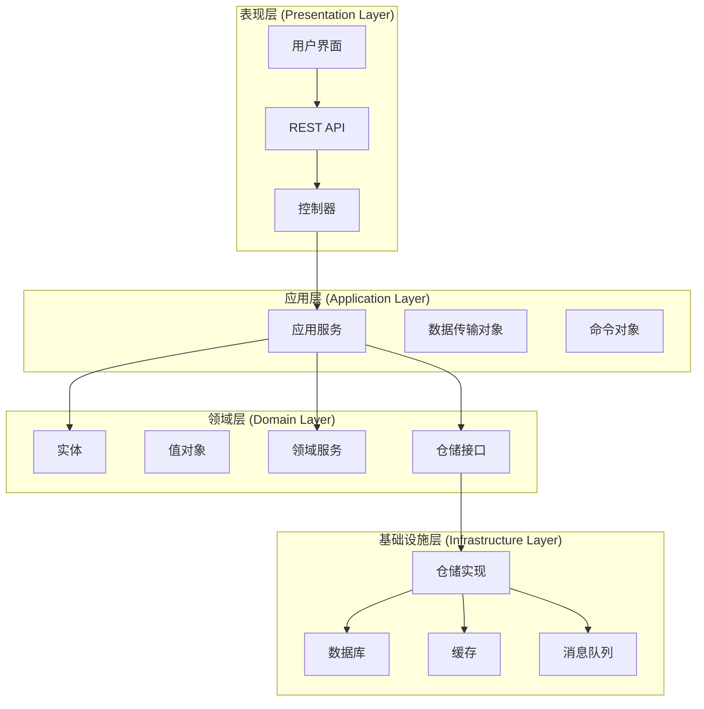
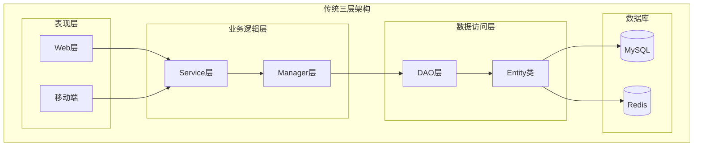
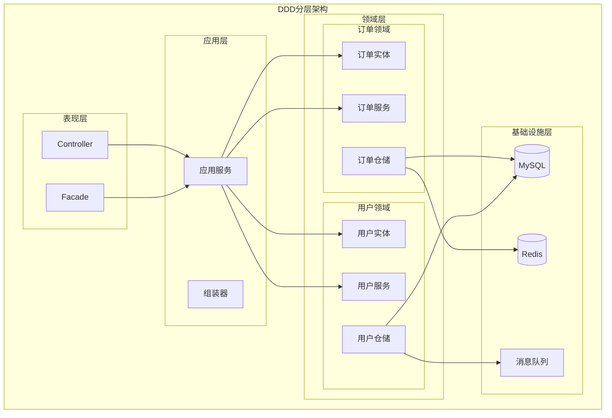
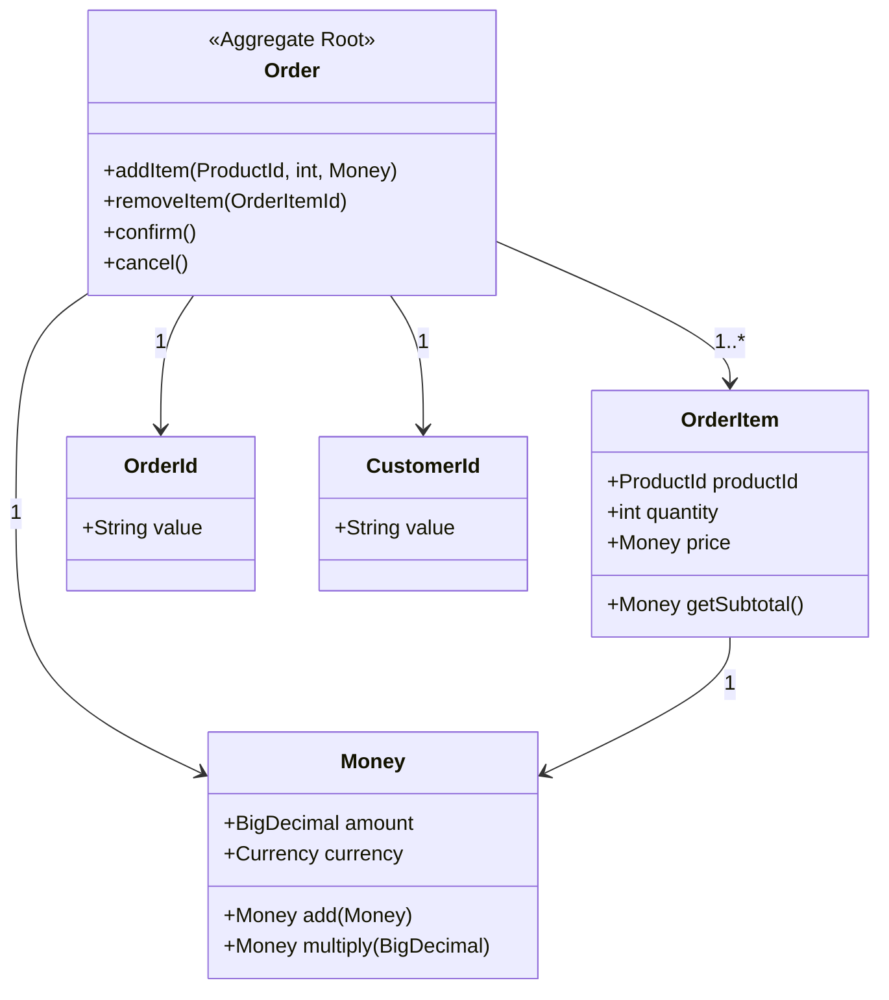
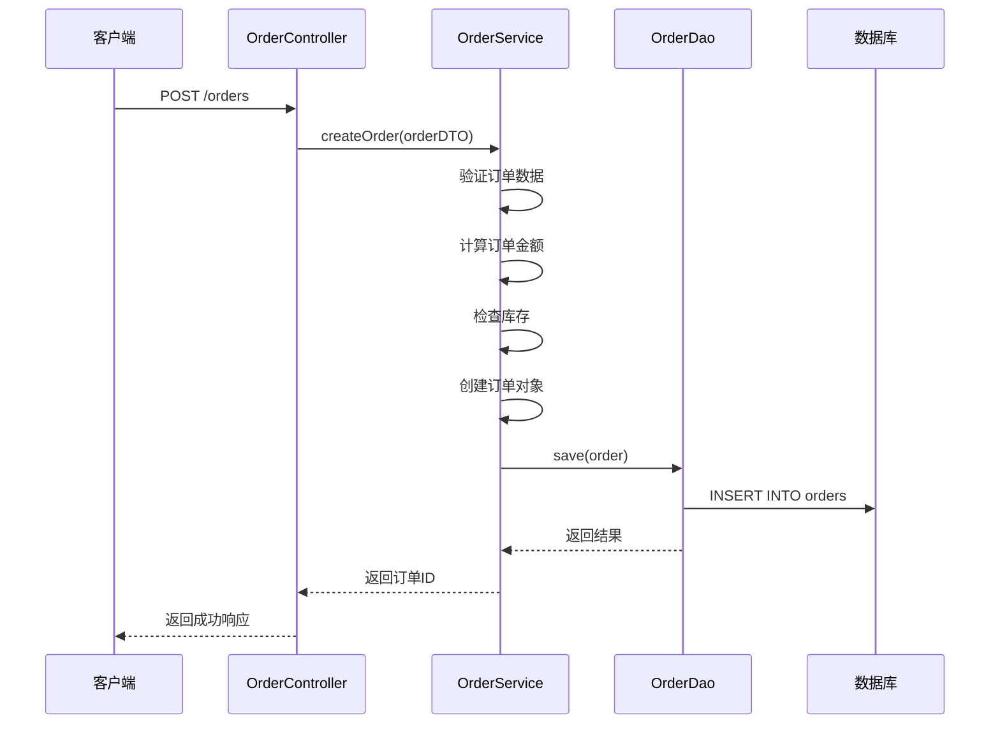
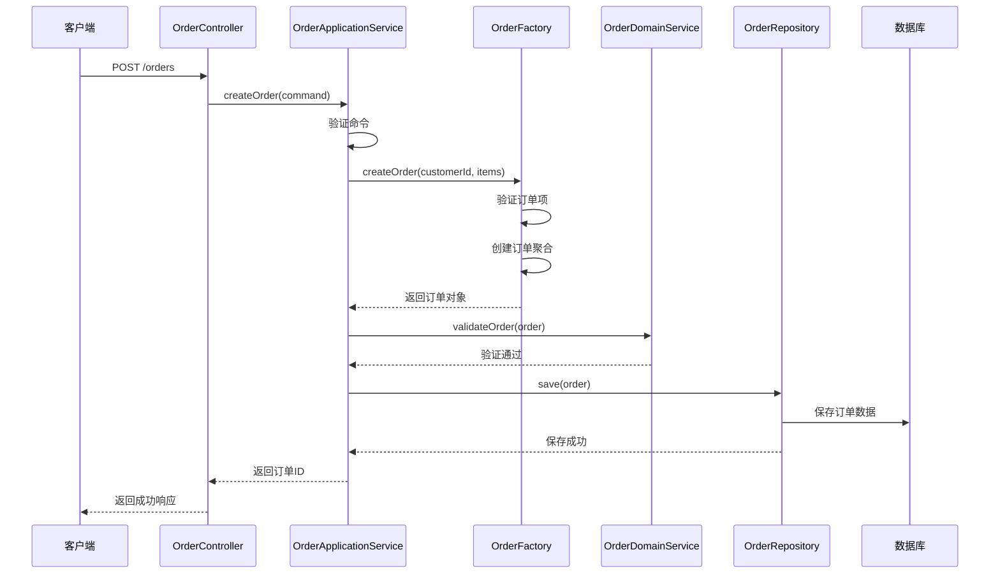

# 🏗️ DDD架构详解：从传统三层架构到领域驱动设计


> [!TIP]
> DDD（Domain-Driven Design）是一种软件开发方法论，通过深入理解业务领域来指导软件设计，让代码结构更贴近业务逻辑。


## 📖 什么是DDD？

领域驱动设计（Domain-Driven Design，DDD）是由Eric Evans在2003年提出的一种软件开发方法论。它强调通过深入理解业务领域来指导软件设计，让代码结构更贴近业务逻辑，而不是技术实现。

### 🎯 DDD的核心思想

- **以业务为中心**：代码结构反映业务概念和流程
- **统一语言**：开发者和业务专家使用相同的术语
- **分层架构**：清晰的职责分离和依赖关系
- **领域模型**：业务概念在代码中的直接映射

---

## 🏛️ DDD分层架构详解

### 📐 经典DDD分层架构



### 🔍 各层职责详解

::: details 点击查看各层详细职责 {open}

| **层级** | **职责** | **包含内容** | **依赖关系** |
| -------- | -------- | ------------ | ------------ |
| **表现层** | 用户交互、数据展示 | UI组件、API接口、控制器 | 依赖应用层 |
| **应用层** | 业务流程编排、事务管理 | 应用服务、DTO、命令 | 依赖领域层 |
| **领域层** | 核心业务逻辑、规则 | 实体、值对象、领域服务 | 不依赖其他层 |
| **基础设施层** | 技术实现、外部服务 | 数据库、缓存、消息队列 | 被其他层依赖 |

:::

---

## 🔄 传统三层架构 vs DDD架构对比

### 📊 架构对比表

| **对比维度** | **传统三层架构** | **DDD架构** |
| ------------ | ----------------- | ----------- |
| **设计理念** | 以技术为中心 | 以业务为中心 |
| **代码组织** | 按技术职责分层 | 按业务领域组织 |
| **业务逻辑** | 分散在各层 | 集中在领域层 |
| **可维护性** | 业务变更影响面大 | 业务变更影响面小 |
| **可扩展性** | 扩展需要修改现有代码 | 扩展通过新增模块 |
| **团队协作** | 技术团队主导 | 业务专家参与设计 |

### 🏗️ 传统三层架构结构



### 🎯 DDD架构结构



---

## 🎭 DDD核心概念详解

### 🏷️ 实体（Entity）

实体是具有唯一标识的对象，即使属性发生变化，其身份依然保持不变。

```java [Order.java]
// 订单实体
public class Order {
    private OrderId id;           // 唯一标识
    private CustomerId customerId; // 客户ID
    private Money totalAmount;    // 订单金额
    private OrderStatus status;   // 订单状态
    private List<OrderItem> items; // 订单项
    
    // 业务方法
    public void addItem(ProductId productId, int quantity, Money price) {
        OrderItem item = new OrderItem(productId, quantity, price);
        items.add(item);
        recalculateTotal();
    }
    
    public void confirm() {
        if (status != OrderStatus.PENDING) {
            throw new IllegalStateException("只有待确认订单才能确认");
        }
        status = OrderStatus.CONFIRMED;
    }
    
    private void recalculateTotal() {
        totalAmount = items.stream()
            .map(item -> item.getSubtotal())
            .reduce(Money.ZERO, Money::add);
    }
}
```

### 💎 值对象（Value Object）

值对象是没有唯一标识的对象，通过属性值来判断相等性。

```java [Money.java]
// 金额值对象
public class Money {
    private final BigDecimal amount;
    private final Currency currency;
    
    public Money(BigDecimal amount, Currency currency) {
        this.amount = amount;
        this.currency = currency;
    }
    
    public Money add(Money other) {
        if (!this.currency.equals(other.currency)) {
            throw new IllegalArgumentException("货币类型不匹配");
        }
        return new Money(this.amount.add(other.amount), this.currency);
    }
    
    public Money multiply(BigDecimal factor) {
        return new Money(this.amount.multiply(factor), this.currency);
    }
    
    @Override
    public boolean equals(Object obj) {
        if (this == obj) return true;
        if (obj == null || getClass() != obj.getClass()) return false;
        Money money = (Money) obj;
        return Objects.equals(amount, money.amount) && 
               Objects.equals(currency, money.currency);
    }
    
    @Override
    public int hashCode() {
        return Objects.hash(amount, currency);
    }
}
```

### 🏪 聚合（Aggregate）

聚合是一组相关对象的集合，聚合根负责管理整个聚合的生命周期。



### 🏭 工厂（Factory）

工厂负责创建复杂的聚合对象。

```java [OrderFactory.java]
// 订单工厂
@Component
public class OrderFactory {
    
    public Order createOrder(CustomerId customerId, List<OrderItemRequest> items) {
        // 验证订单项
        validateOrderItems(items);
        
        // 创建订单
        OrderId orderId = OrderId.generate();
        Order order = new Order(orderId, customerId);
        
        // 添加订单项
        for (OrderItemRequest itemRequest : items) {
            Product product = productRepository.findById(itemRequest.getProductId());
            if (product == null) {
                throw new ProductNotFoundException(itemRequest.getProductId());
            }
            
            Money price = product.getPrice();
            order.addItem(itemRequest.getProductId(), itemRequest.getQuantity(), price);
        }
        
        return order;
    }
    
    private void validateOrderItems(List<OrderItemRequest> items) {
        if (items == null || items.isEmpty()) {
            throw new IllegalArgumentException("订单项不能为空");
        }
        
        for (OrderItemRequest item : items) {
            if (item.getQuantity() <= 0) {
                throw new IllegalArgumentException("商品数量必须大于0");
            }
        }
    }
}
```

### 📦 仓储（Repository）

仓储负责聚合的持久化和查询。

```java [OrderRepository.java]
// 订单仓储接口
public interface OrderRepository {
    Order findById(OrderId orderId);
    List<Order> findByCustomerId(CustomerId customerId);
    List<Order> findByStatus(OrderStatus status);
    void save(Order order);
    void delete(OrderId orderId);
}

// 订单仓储实现
@Repository
public class OrderRepositoryImpl implements OrderRepository {
    
    @Autowired
    private OrderJpaRepository jpaRepository;
    
    @Autowired
    private OrderMapper orderMapper;
    
    @Override
    public Order findById(OrderId orderId) {
        OrderDO orderDO = jpaRepository.findById(orderId.getValue())
            .orElse(null);
        
        if (orderDO == null) {
            return null;
        }
        
        return orderMapper.toOrder(orderDO);
    }
    
    @Override
    public void save(Order order) {
        OrderDO orderDO = orderMapper.toOrderDO(order);
        jpaRepository.save(orderDO);
    }
    
    // 其他方法实现...
}
```

---

## 🏢 实际项目结构对比

### 📁 传统项目结构

```
src/
├── main/
│   ├── java/
│   │   └── com/company/
│   │       ├── controller/          # 控制器层
│   │       │   ├── UserController.java
│   │       │   ├── OrderController.java
│   │       │   └── ProductController.java
│   │       ├── service/             # 服务层
│   │       │   ├── UserService.java
│   │       │   ├── OrderService.java
│   │       │   └── ProductService.java
│   │       ├── dao/                 # 数据访问层
│   │       │   ├── UserDao.java
│   │       │   ├── OrderDao.java
│   │       │   └── ProductDao.java
│   │       ├── entity/              # 实体类
│   │       │   ├── User.java
│   │       │   ├── Order.java
│   │       │   └── Product.java
│   │       └── util/                # 工具类
│   │           ├── DateUtil.java
│   │           └── StringUtil.java
│   └── resources/
│       ├── mapper/                  # MyBatis映射文件
│       └── application.yml
```

### 🎯 DDD项目结构

```
src/
├── main/
│   ├── java/
│   │   └── com/company/
│   │       ├── application/         # 应用层
│   │       │   ├── service/         # 应用服务
│   │       │   │   ├── OrderApplicationService.java
│   │       │   │   └── UserApplicationService.java
│   │       │   ├── dto/             # 数据传输对象
│   │       │   │   ├── CreateOrderRequest.java
│   │       │   │   └── OrderResponse.java
│   │       │   └── assembler/       # 组装器
│   │       │       └── OrderAssembler.java
│   │       ├── domain/              # 领域层
│   │       │   ├── order/           # 订单领域
│   │       │   │   ├── model/       # 领域模型
│   │       │   │   │   ├── Order.java
│   │       │   │   │   ├── OrderItem.java
│   │       │   │   │   └── OrderId.java
│   │       │   │   ├── service/     # 领域服务
│   │       │   │   │   └── OrderDomainService.java
│   │       │   │   ├── repository/  # 仓储接口
│   │       │   │   │   └── OrderRepository.java
│   │       │   │   └── factory/     # 工厂
│   │       │   │       └── OrderFactory.java
│   │       │   └── user/            # 用户领域
│   │       │       ├── model/
│   │       │       ├── service/
│   │       │       ├── repository/
│   │       │       └── factory/
│   │       ├── infrastructure/      # 基础设施层
│   │       │   ├── persistence/     # 持久化
│   │       │   │   ├── repository/  # 仓储实现
│   │       │   │   │   ├── OrderRepositoryImpl.java
│   │       │   │   │   └── UserRepositoryImpl.java
│   │       │   │   ├── entity/      # 数据库实体
│   │       │   │   │   ├── OrderDO.java
│   │       │   │   │   └── UserDO.java
│   │       │   │   └── mapper/      # MyBatis映射器
│   │       │   │       ├── OrderMapper.java
│   │       │   │       └── UserMapper.java
│   │       │   ├── cache/           # 缓存
│   │       │   ├── message/         # 消息队列
│   │       │   └── config/          # 配置
│   │       └── interfaces/          # 接口层
│   │           ├── web/             # Web接口
│   │           │   ├── OrderController.java
│   │           │   └── UserController.java
│   │           ├── facade/          # 外观接口
│   │           └── assembler/       # 接口层组装器
│   └── resources/
│       ├── mapper/
│       └── application.yml
```

---

## 🔄 DDD架构演进示例

### 📊 订单创建流程对比

#### 传统架构流程



#### DDD架构流程



---

## 🎯 DDD实施建议

### ✅ 适用场景

::: tip 适合使用DDD的场景
- **复杂业务逻辑**：业务规则复杂，需要深入理解领域
- **长期维护项目**：项目需要长期维护和演进
- **团队协作**：有业务专家参与设计过程
- **微服务架构**：需要清晰的领域边界
- **高可维护性要求**：对代码质量和可维护性要求高
:::

### ⚠️ 注意事项

::: warning 使用DDD需要注意的问题
- **学习成本高**：团队需要时间学习和适应
- **过度设计风险**：简单项目可能过度复杂化
- **性能考虑**：领域对象可能影响性能
- **团队技能要求**：需要具备面向对象设计能力
- **初期投入大**：前期设计时间较长
:::

### 🚀 实施步骤

1. **领域建模**：深入理解业务，建立领域模型
2. **统一语言**：与业务专家建立共同语言
3. **分层设计**：设计清晰的分层架构
4. **渐进重构**：逐步重构现有代码
5. **持续改进**：根据反馈不断优化

---

## 📚 总结

DDD架构通过深入理解业务领域来指导软件设计，让代码结构更贴近业务逻辑。相比传统三层架构，DDD具有以下优势：

- **业务导向**：代码结构反映业务概念
- **高内聚低耦合**：清晰的职责分离
- **易于维护**：业务变更影响面小
- **支持扩展**：通过新增模块扩展功能

### 🎯 选择建议

| **项目类型** | **推荐架构** | **原因** |
| ------------ | ------------ | -------- |
| **简单CRUD** | 传统三层架构 | 业务简单，无需复杂设计 |
| **中等复杂度** | 简化DDD | 适当引入DDD概念 |
| **复杂业务** | 完整DDD | 业务复杂，需要清晰架构 |
| **微服务** | DDD + CQRS | 需要领域边界和读写分离 |

> [!NOTE]
> DDD不是银弹，需要根据项目实际情况选择合适的架构。对于简单项目，过度使用DDD可能适得其反；对于复杂项目，DDD能够提供清晰的结构和良好的可维护性。
