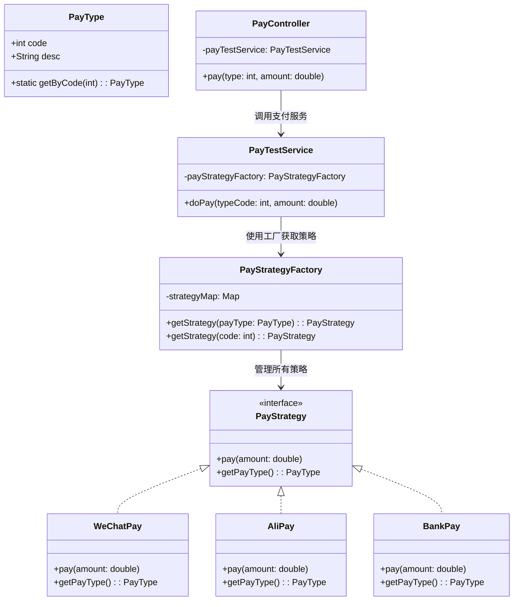
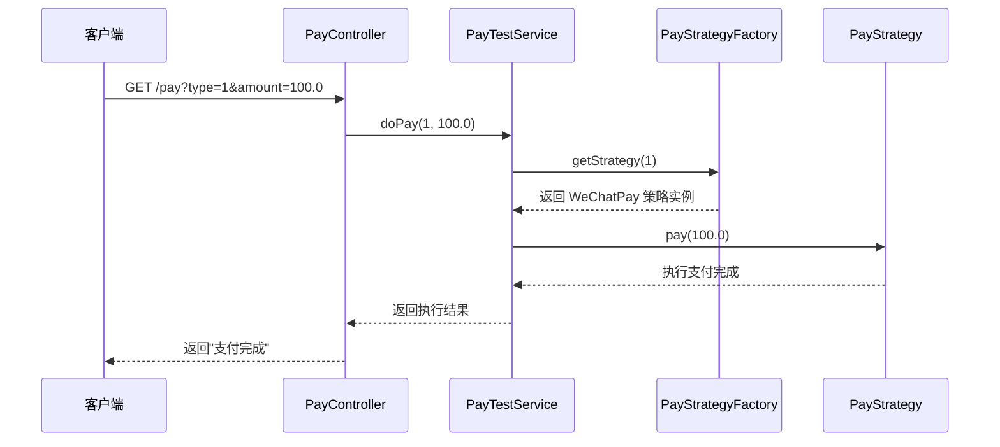
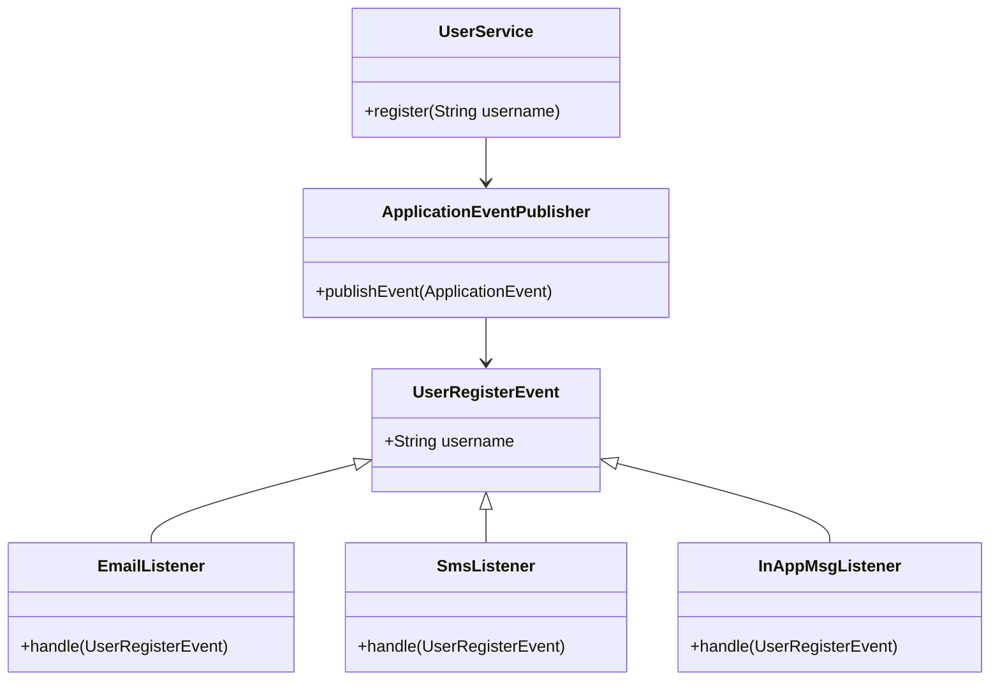
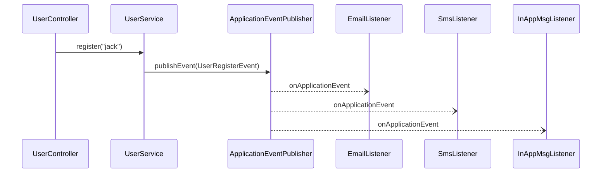
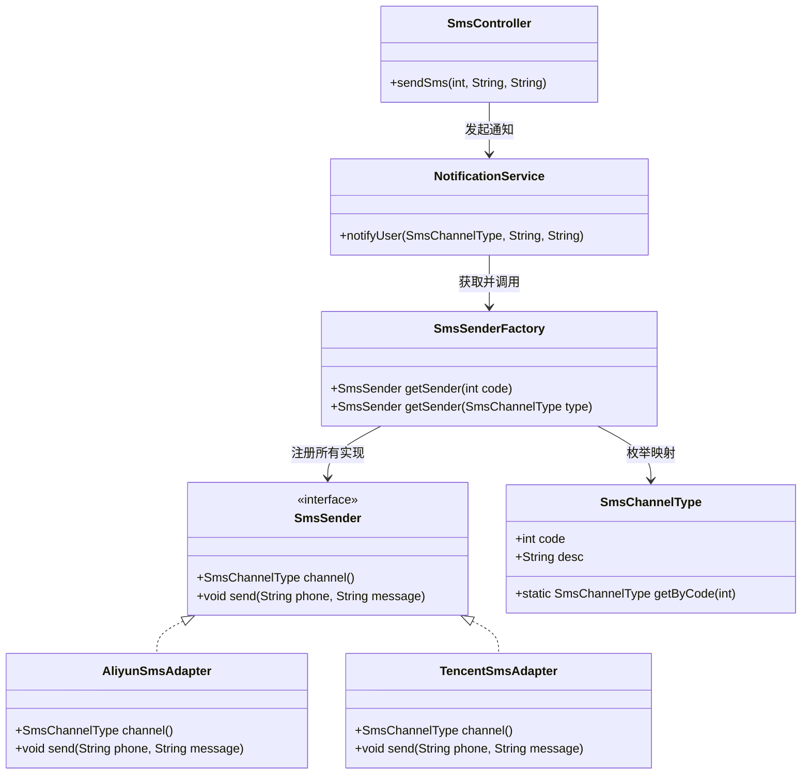
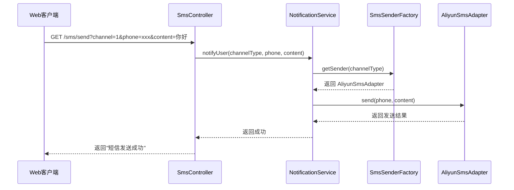
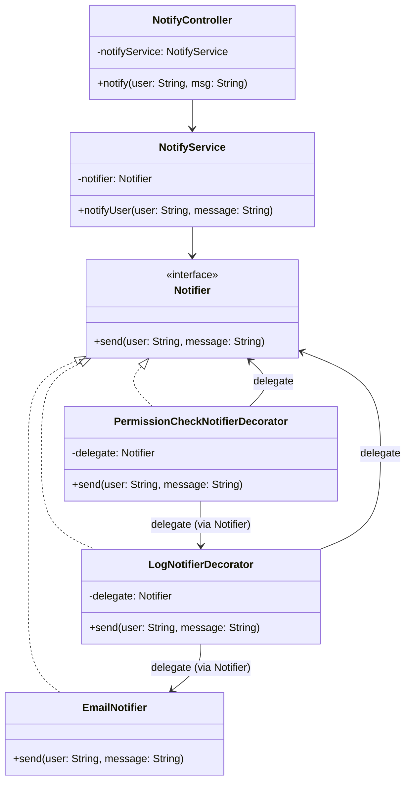
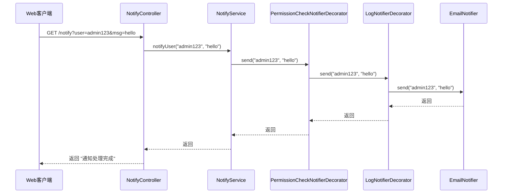
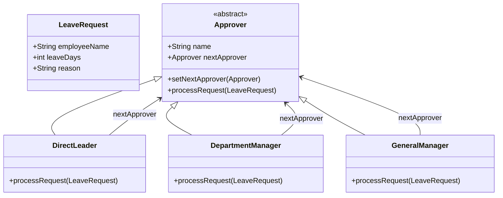
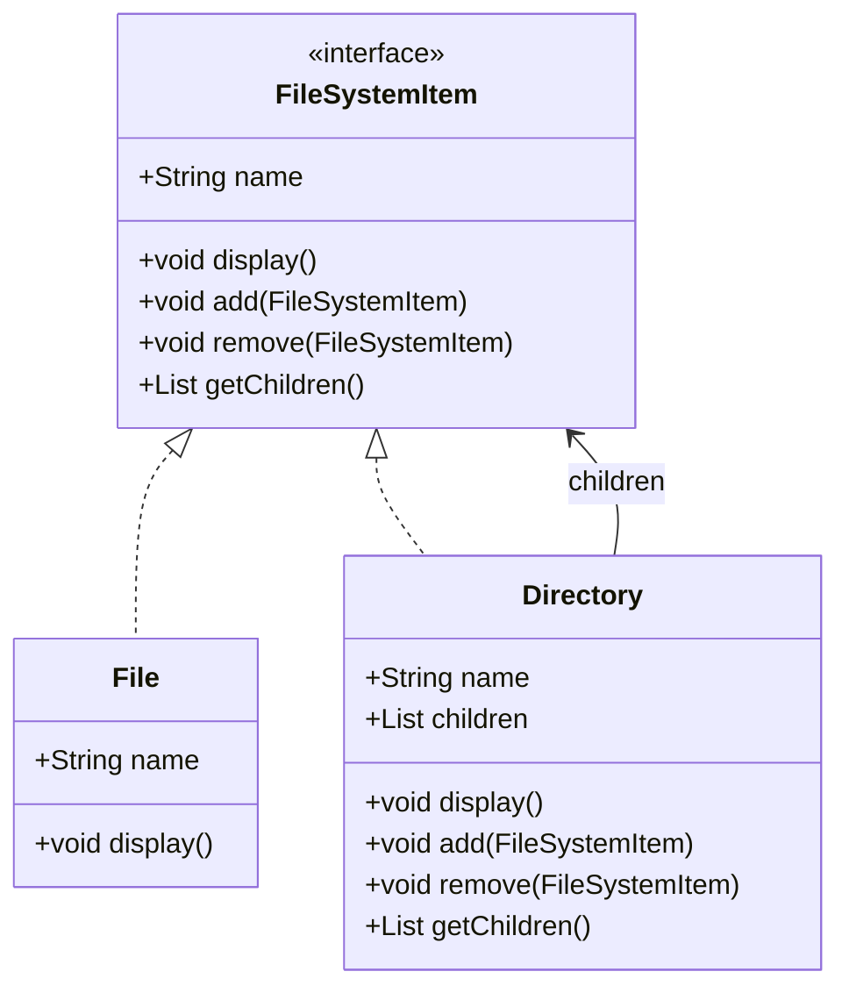

# 设计模式


> [!TIP]
> 设计模式是软件开发中常见的最佳实践解决方案，掌握它们能帮助我们写出更优雅、可维护的代码。

## 概述

设计模式（Design Pattern）是一套被反复使用、多数人知晓的、经过分类编目的、代码设计经验的总结。使用设计模式是为了可重用代码、让代码更容易被他人理解、保证代码可靠性。

---

# 🧠 Java设计模式实战：策略模式 + 工厂模式

## 📋 策略模式详解

### 定义
策略模式定义了一系列算法，并将每一个算法封装起来，使它们可以互相替换。策略模式让算法独立于使用它的客户而变化。

### 使用场景

::: details 点击查看详细使用场景 {open}

| **应用模块** | **使用策略的对象**       | **枚举值（类型）**               | **说明** |
| ------------ | ------------------------ | -------------------------------- | -------- |
| **支付系统** | 支付实现（微信、支付宝） | PayType.WECHAT、PayType.ALIPAY   | 不同支付方式实现不同算法 |
| **通知系统** | 发送方式                 | NotifyType.EMAIL、NotifyType.SMS | 不同通知渠道的发送逻辑 |
| **文件导入** | 解析策略（CSV、Excel）   | FileType.CSV、FileType.EXCEL     | 不同文件格式的解析算法 |
| **商品促销** | 折扣策略                 | PromotionType.FULL_REDUCTION 等  | 不同促销活动的计算逻辑 |
| **风控系统** | 校验策略                 | CheckRuleType.DEVICE_ID 等       | 不同风控规则的校验逻辑 |
| **定价引擎** | 计算逻辑                 | PriceType.TIME_BASED 等          | 不同定价策略的计算方式 |

:::

### 优缺点分析

::: tip 优点
- **算法可以自由切换**：运行时动态选择算法
- **避免使用多重条件判断**：消除大量的 if-else 语句
- **扩展性良好**：新增策略只需实现接口，无需修改现有代码
- **符合开闭原则**：对扩展开放，对修改关闭
:::

::: warning 缺点
- **策略类会增多**：每个策略都需要一个类
- **所有策略类都需要对外暴露**：增加了类的数量
- **策略的选择逻辑可能复杂**：需要额外的选择逻辑
:::

---

## 🏭 工厂模式详解

### 定义
工厂模式定义一个创建对象的接口，让其子类决定实例化哪一个工厂类，工厂模式使其创建过程延迟到子类进行。

### 使用场景

::: details 点击查看详细使用场景 {open}

| **场景类型** | **具体应用** | **说明** |
| ------------ | ------------ | -------- |
| **对象创建复杂** | 数据库连接池、线程池 | 隐藏复杂的创建逻辑 |
| **需要统一管理** | Spring Bean 管理 | 统一管理对象的生命周期 |
| **配置化创建** | 根据配置创建不同实现 | 支持配置驱动的对象创建 |
| **扩展性要求高** | 插件系统、策略系统 | 新增类型无需修改现有代码 |

:::

### 优缺点分析

::: tip 优点
- **隐藏了对象创建的复杂性**：客户端无需了解创建细节
- **提高了代码的可维护性**：创建逻辑集中管理
- **符合开闭原则**：新增产品类型无需修改现有代码
- **支持配置化**：可以通过配置文件控制创建行为
:::

::: warning 缺点
- **增加了系统的抽象性和理解难度**：需要理解工厂的抽象概念
- **工厂类集中了所有创建逻辑**：一旦不能正常工作，整个系统都会受到影响
- **可能产生过多的工厂类**：每个产品族都需要一个工厂
:::

---

## 🧾 示例场景：支付系统（微信、支付宝、银行卡）

### 🔧 项目结构

```bash
├── PayStrategy.java                 # 策略接口
├── PayType.java                    # 支付类型枚举类
├── WeChatPay.java                  # 微信支付策略实现
├── AliPay.java                     # 支付宝支付策略实现
├── BankPay.java                    # 银行卡支付策略实现
├── PayStrategyFactory.java        # 支付策略工厂（使用 Spring 自动装配）
├── PayTestService.java            # 测试类（调用工厂）
└── PayController.java             # 控制器（演示调用）
```

### 类图设计



### 时序图



### 代码实现

::: code-group

```java [PayStrategy.java]
// 策略接口
public interface PayStrategy {
    void pay(double amount);
    PayType getPayType(); // 返回策略类型
}
```

```java [PayType.java]
// 枚举类
public enum PayType {
    WECHAT(1, "微信支付"),
    ALIPAY(2, "支付宝支付"),
    BANK(3, "银行卡支付");

    private final int code;
    private final String desc;

    PayType(int code, String desc) {
        this.code = code;
        this.desc = desc;
    }

    public int getCode() { return code; }
    public String getDesc() { return desc; }

    public static PayType getByCode(int code) {
        for (PayType type : values()) {
            if (type.getCode() == code) {
                return type;
            }
        }
        throw new IllegalArgumentException("未知支付类型 code: " + code);
    }
}
```

```java [WeChatPay.java]
// 微信支付策略实现
import org.springframework.stereotype.Component;

@Component
public class WeChatPay implements PayStrategy {
    @Override
    public void pay(double amount) {
        System.out.println("使用微信支付：" + amount + "元");
    }

    @Override
    public PayType getPayType() {
        return PayType.WECHAT;
    }
}
```

```java [AliPay.java]
// 支付宝支付策略实现
import org.springframework.stereotype.Component;

@Component
public class AliPay implements PayStrategy {
    @Override
    public void pay(double amount) {
        System.out.println("使用支付宝支付：" + amount + "元");
    }

    @Override
    public PayType getPayType() {
        return PayType.ALIPAY;
    }
}
```

```java [BankPay.java]
// 银行支付策略实现
import org.springframework.stereotype.Component;

@Component
public class BankPay implements PayStrategy {
    @Override
    public void pay(double amount) {
        System.out.println("使用银行卡支付：" + amount + "元");
    }

    @Override
    public PayType getPayType() {
        return PayType.BANK;
    }
}
```

```java [PayStrategyFactory.java]
// 策略工厂类
import org.springframework.beans.factory.InitializingBean;
import org.springframework.stereotype.Component;

import javax.annotation.Resource;
import java.util.HashMap;
import java.util.List;
import java.util.Map;

@Component
public class PayStrategyFactory implements InitializingBean {

    @Resource
    private List<PayStrategy> payStrategyList;

    private final Map<PayType, PayStrategy> strategyMap = new HashMap<>();

    @Override
    public void afterPropertiesSet() {
        for (PayStrategy strategy : payStrategyList) {
            strategyMap.put(strategy.getPayType(), strategy);
        }
    }

    public PayStrategy getStrategy(PayType payType) {
        return strategyMap.get(payType);
    }

    public PayStrategy getStrategy(int code) {
        PayType type = PayType.getByCode(code);
        return strategyMap.get(type);
    }
}
```

```java [PayTestService.java]
// 服务实现类
@Service
public class PayTestService {

    @Autowired
    private PayStrategyFactory payStrategyFactory;

    public void doPay(int typeCode, double amount) {
        PayStrategy strategy = payStrategyFactory.getStrategy(typeCode);
        if (strategy != null) {
            strategy.pay(amount);
        } else {
            System.out.println("未找到对应的支付策略！");
        }
    }
}
```

```java [PayController.java]
// 控制类
import org.springframework.beans.factory.annotation.Autowired;
import org.springframework.web.bind.annotation.*;

@RestController
public class PayController {

    @Autowired
    private PayTestService payTestService;

    @GetMapping("/pay")
    public String pay(@RequestParam int type, @RequestParam double amount) {
        payTestService.doPay(type, amount);
        return "支付完成";
    }
}
```

:::

---

# 🧠 Java设计模式实战：观察者模式

## 📋 观察者模式详解

### 定义
观察者模式定义对象间的一种一对多的依赖关系，当一个对象的状态发生改变时，所有依赖于它的对象都得到通知并被自动更新。

### 使用场景

::: details 点击查看详细使用场景 {open}

| **场景类型**           | **示例**                                         | **描述**                                               |
| ---------------------- | ------------------------------------------------ | ------------------------------------------------------ |
| **事件驱动系统**       | 用户注册、下单、支付等                           | 事件触发后需要通知多个模块（如发邮件、加积分、写日志） |
| **消息/通知系统**      | 邮件、短信、微信通知等                           | 同一个事件可能有多个通知渠道                           |
| **日志/审计记录**      | 操作日志、行为分析                               | 系统行为发生后，写入日志中心或行为分析系统             |
| **业务解耦扩展点**     | 订单完成后调用促销、推荐                         | 主流程完成后扩展新的逻辑而不影响核心代码               |
| **多模块响应同一事件** | 电商中订单完成触发：库存系统、财务系统、物流系统 | 一处变更，多处联动，逻辑隔离可维护性强                 |
| **订阅/发布系统**      | 事件总线、Spring ApplicationEvent                | 典型的发布-订阅消息模式                                |

:::

### 优缺点分析

::: tip 优点
- **观察者和被观察者是抽象耦合的**：降低系统耦合度
- **建立一套触发机制**：支持事件驱动的架构设计
- **支持广播通信**：一个事件可以通知多个观察者
- **易于扩展**：新增观察者无需修改被观察者代码
:::

::: warning 缺点
- **通知开销大**：如果有大量观察者，通知会花费很多时间
- **循环依赖风险**：观察者和被观察者之间可能存在循环依赖
- **内存泄漏风险**：观察者忘记取消订阅可能导致内存泄漏
- **调试困难**：事件传播路径复杂，调试时难以追踪
:::

---

## 🧾 示例场景：用户注册后发送通知（邮件、短信、站内信）

### 类图设计



### 时序图



### 代码实现

::: code-group

```java [UserRegisterEvent.java]
// 定义事件类
package com.example.event;

import org.springframework.context.ApplicationEvent;

public class UserRegisterEvent extends ApplicationEvent {
    private final String username;

    public UserRegisterEvent(Object source, String username) {
        super(source);
        this.username = username;
    }

    public String getUsername() {
        return username;
    }
}
```

```java [EmailListener.java]
// 邮件监听器
package com.example.listener;

import com.example.event.UserRegisterEvent;
import org.springframework.context.event.EventListener;
import org.springframework.stereotype.Component;

@Component
public class EmailListener {
    @EventListener
    public void sendEmail(UserRegisterEvent event) {
        System.out.println("📧 给用户发送注册邮件：" + event.getUsername());
    }
}
```

```java [SmsListener.java]
// 短信监听器
@Component
public class SmsListener {
    @EventListener
    public void sendSms(UserRegisterEvent event) {
        System.out.println("📱 给用户发送注册短信：" + event.getUsername());
    }
}
```

```java [InAppMsgListener.java]
// 站内监听器
@Component
public class InAppMsgListener {
    @EventListener
    public void sendInAppMessage(UserRegisterEvent event) {
        System.out.println("💬 给用户发送站内信：" + event.getUsername());
    }
}
```


```java [UserService.java]
// 业务服务层
package com.example.service;

import com.example.event.UserRegisterEvent;
import org.springframework.beans.factory.annotation.Autowired;
import org.springframework.context.ApplicationEventPublisher;
import org.springframework.stereotype.Service;

@Service
public class UserService {

    @Autowired
    private ApplicationEventPublisher publisher;

    public void register(String username) {
        System.out.println("✅ 用户注册成功：" + username);
        // 发布事件（触发观察者）
        publisher.publishEvent(new UserRegisterEvent(this, username));
    }
}
```

```java [UserController.java]
// 控制器
package com.example.controller;

import com.example.service.UserService;
import org.springframework.beans.factory.annotation.Autowired;
import org.springframework.web.bind.annotation.*;

@RestController
@RequestMapping("/user")
public class UserController {

    @Autowired
    private UserService userService;

    @PostMapping("/register")
    public String register(@RequestParam String username) {
        userService.register(username);
        return "注册完成";
    }
}
```

:::

---

# 🧠 Java设计模式实战：适配器模式+策略模式+工厂模式

## 📋 适配器模式详解

### 定义
适配器模式将一个类的接口转换成客户希望的另外一个接口。适配器模式使得原本由于接口不兼容而不能一起工作的那些类可以一起工作。

### 使用场景

::: details 点击查看详细使用场景 {open}

| **场景类型**              | **实际应用**                                                 | **说明** |
| ------------------------- | ------------------------------------------------------------ | -------- |
| **集成第三方 SDK**        | 支付宝、微信支付、腾讯云短信、亚马逊S3、Google OAuth 等 SDK 接口风格各异，需统一接口供业务调用。 | 统一不同厂商的接口风格 |
| **系统迁移**              | 老系统使用一套接口，新系统逐步切换，适配器可做中间层，兼容旧接口不改业务代码。 | 新旧系统兼容 |
| **日志/数据采集平台适配** | 支持不同日志平台（ELK、Graylog、Sentry），统一日志上报 API   | 统一不同平台的接口 |
| **统一缓存接口**          | 适配 Redis、Memcached、Guava Cache，封装一个统一 CacheClient 接口 | 抽象不同缓存实现 |
| **数据库适配层**          | 统一多种数据库访问方式（JDBC、JPA、MyBatis）为一个统一 DAO 接口 | 统一数据访问方式 |
| **消息队列适配**          | 统一 RabbitMQ、Kafka、RocketMQ 的接口为 MessagePublisher     | 统一消息发送接口 |
| **老接口升级兼容**        | 老 API 返回 Map，新 API 返回对象，业务逻辑不想变，使用适配器做转换 | 接口升级兼容 |
| **文件存储服务适配**      | 支持本地文件、阿里 OSS、腾讯 COS、七牛云等存储接口，提供统一 StorageService | 统一存储接口 |
| **第三方授权登录适配**    | 微信、QQ、Github、Google 授权登录接口不一致，统一为 OAuthClient 接口 | 统一授权接口 |

:::

### 优缺点分析

::: tip 优点
- **将目标类和适配者类解耦**：降低系统耦合度
- **增加了类的透明性和复用性**：客户端无需了解适配细节
- **灵活性和扩展性都非常好**：支持多种适配方式
- **符合开闭原则**：新增适配器无需修改现有代码
:::

::: warning 缺点
- **过多地使用适配器，会让系统非常零乱**：不易整体进行把握
- **增加了系统的复杂性**：需要理解适配器的转换逻辑
- **可能影响性能**：适配器会增加一层调用开销
- **调试困难**：适配器可能隐藏真实的调用关系
:::

---

## 🧾 示例场景：第三方短信服务适配

### 类图设计



### 时序图



### 代码实现

::: code-group

```java [SmsProperties.java]
// 配置类
import lombok.Data;
import org.springframework.boot.context.properties.ConfigurationProperties;
import org.springframework.context.annotation.Configuration;

@Data
@Configuration
@ConfigurationProperties(prefix = "sms")
public class SmsProperties {
    private Aliyun aliyun;
    private Tencent tencent;

    @Data
    public static class Aliyun {
        private String accessKeyId;
        private String accessKeySecret;
        private String signName;
        private String templateCode;
    }

    @Data
    public static class Tencent {
        private String secretId;
        private String secretKey;
        private String appId;
        private String sign;
        private String templateId;
    }
}
```

```java [SmsSender.java]
// 统一接口
public interface SmsSender {
    SmsChannelType channel();  // 返回所属通道枚举
    void send(String phone, String message);
}
```

```java [SmsChannelType.java]
// 枚举类
public enum SmsChannelType {
    ALIYUN(1, "阿里云短信"),
    TENCENT(2, "腾讯云短信"),
    HUAWEI(3, "华为云短信");

    private final int code;
    private final String desc;

    SmsChannelType(int code, String desc) {
        this.code = code;
        this.desc = desc;
    }

    public int getCode() { return code; }
    public String getDesc() { return desc; }

    public static SmsChannelType getByCode(int code) {
        for (SmsChannelType type : values()) {
            if (type.getCode() == code) {
                return type;
            }
        }
        throw new IllegalArgumentException("未知短信通道类型 code: " + code);
    }
}
```

```java [AliyunSmsService.java]
//阿里云 AliyunSmsService
public class AliyunSmsService {
    public void sendSms(String accessKeyId, String accessKeySecret, String phoneNumber, String signName, String templateCode, String templateParam) {
        // 实现发送短信的逻辑
        System.out.println("Sending SMS via Alibaba Cloud to " + phoneNumber + ": " + templateParam);
    }
}
```

```java [TencentSmsService.java]
//腾讯云 TencentSmsService
public class TencentSmsService {
    public void sendSms(String secretId, String secretKey, String phoneNumber, String appId, String sign, String templateId, String templateParam) {
        // 实现发送短信的逻辑
        System.out.println("Sending SMS via Tencent Cloud to " + phoneNumber + ": " + templateParam);
    }
}
```


```java [AliyunSmsAdapter.java]
// 阿里云适配器
@Component
public class AliyunSmsAdapter implements SmsSender {

    private final AliyunSmsService aliyunSmsService;
    private final SmsProperties.Aliyun config;

    public AliyunSmsAdapter(AliyunSmsService aliyunSmsService, SmsProperties smsProperties) {
        this.aliyunSmsService = aliyunSmsService;
        this.config = smsProperties.getAliyun();
    }

    @Override
    public SmsChannelType channel() {
        return SmsChannelType.ALIYUN;
    }

    @Override
    public void send(String phone, String message) {
        aliyunSmsService.sendSms(config.getAccessKeyId(), config.getAccessKeySecret(), phone,
                config.getSignName(), config.getTemplateCode(), message);
    }
}
```

```java [TencentSmsAdapter.java]
// 腾讯云适配器
@Component
public class TencentSmsAdapter implements SmsSender {

    private final TencentSmsService tencentSmsService;
    private final SmsProperties.Tencent config;

    public TencentSmsAdapter(TencentSmsService tencentSmsService, SmsProperties smsProperties) {
        this.tencentSmsService = tencentSmsService;
        this.config = smsProperties.getTencent();
    }

    @Override
    public SmsChannelType channel() {
        return SmsChannelType.TENCENT;
    }

    @Override
    public void send(String phone, String message) {
        tencentSmsService.sendSms(config.getSecretId(), config.getSecretKey(), phone,
                config.getAppId(), config.getSign(), config.getTemplateId(), message);
    }
}
```

```java [SmsSenderFactory.java]
// 工厂类
@Component
public class SmsSenderFactory implements InitializingBean {

    @Resource
    private List<SmsSender> smsSenderList;

    private final Map<SmsChannelType, SmsSender> senderMap = new HashMap<>();

    @Override
    public void afterPropertiesSet() {
        for (SmsSender sender : smsSenderList) {
            senderMap.put(sender.channel(), sender);
        }
    }

    public SmsSender getSender(SmsChannelType channelType) {
        return senderMap.get(channelType);
    }

    public SmsSender getSender(int code) {
        SmsChannelType channelType = SmsChannelType.getByCode(code);
        return senderMap.get(channelType);
    }
}
```


```java [NotificationService.java]
// 业务服务
@Service
public class NotificationService {

    private final SmsSenderFactory smsSenderFactory;

    public NotificationService(SmsSenderFactory smsSenderFactory) {
        this.smsSenderFactory = smsSenderFactory;
    }

    public void notifyUser(SmsChannelType channelType, String phone, String message) {
        SmsSender sender = smsSenderFactory.getSender(channelType);
        if (sender == null) {
            throw new IllegalArgumentException("不支持的短信通道: " + channelType);
        }
        sender.send(phone, message);
    }
}
```

```yaml [配置文件]
sms:
  aliyun:
    accessKeyId: your-access-key
    accessKeySecret: your-secret
    signName: 阿里签名
    templateCode: TEMPLATE123

  tencent:
    secretId: tencent-id
    secretKey: tencent-key
    appId: tencent-app-id
    sign: 腾讯签名
    templateId: TEMPLATE456
```

```java [SmsController.java]
// 控制器
@RestController
@RequestMapping("/sms")
public class SmsController {

    private final NotificationService notificationService;

    public SmsController(NotificationService notificationService) {
        this.notificationService = notificationService;
    }

    @GetMapping("/send")
    public String sendSms(@RequestParam int channel,
                          @RequestParam String phone,
                          @RequestParam String content) {
        try {
            SmsChannelType channelType = SmsChannelType.getByCode(channel);
            notificationService.notifyUser(channelType, phone, content);
            return "短信发送成功";
        } catch (IllegalArgumentException e) {
            return "短信通道[" + channel + "] 不存在或未实现";
        }
    }
}
```


:::

---

# 🧠 Java设计模式实战：装饰器模式

## 📋 装饰器模式详解

### 定义
装饰器模式允许向一个现有的对象添加新的功能，同时又不改变其结构。这种模式创建了一个装饰类，用来包装原有的类，并在保持类方法签名完整性的前提下，提供了额外的功能。

### 使用场景

::: details 点击查看详细使用场景 {open}

| **场景类型**   | **示例**                       | **说明**                                   |
| -------------- | ------------------------------ | ------------------------------------------ |
| **日志增强**   | 在某个服务方法前后打日志       | 不改动原有逻辑，仅打印调用轨迹、耗时等信息 |
| **权限检查**   | 调用接口前判断是否有权限       | 类似 AOP，但更明确控制调用流程和包装顺序   |
| **缓存处理**   | 读取数据前先查缓存             | 包装原始查询逻辑，添加缓存逻辑             |
| **限流控制**   | 包装接口调用，进行速率限制     | 类似于 Sentinel/Guava RateLimiter 的实现   |
| **熔断容错**   | 接口异常时 fallback 或跳过     | 在装饰器中做兜底处理                       |
| **事务包裹**   | 为某些非事务的方法加事务控制   | 可用装饰器包装为@Transactional 逻辑        |
| **参数预处理** | 包装方法，标准化参数或补默认值 | 统一参数修复、校验或转化                   |
| **调用链追踪** | 插入调用上下文（如 traceId）   | 记录分布式链路 ID 信息                     |
| **加密解密**   | 包装数据传输逻辑               | 对敏感数据进行加解密，不影响主逻辑         |
| **消息增强**   | 发送消息前格式化、编码、校验   | Kafka、MQ 发送前封装逻辑                   |

:::

::: details 接口 vs 抽象类 的角色差异 {open}
| **维度**     | **使用接口**                                                 | **使用抽象类**                               |
| ------------ | ------------------------------------------------------------ | -------------------------------------------- |
| **统一性**   | 强调行为约定，所有实现类都必须实现接口方法                   | 可以提供默认实现，避免子类重复实现通用逻辑   |
| **灵活性**   | 一个类可以实现多个接口 → 支持多装饰链路                      | Java 单继承限制，继承抽象类可能会限制灵活性  |
| **扩展性**   | 如果方法新增，所有实现类都要改                               | 可以在抽象类中提供默认实现，新增方法成本较低 |
| **职责分配** | 接口更“纯粹”，只定义能力，不提供实现                         | 抽象类可同时做“能力定义 + 部分通用逻辑封装”  |
| **应用场景** | 当装饰的目标对象本身是接口时（如 InputStream 的装饰用 FilterInputStream） | 当装饰器需要提供通用逻辑、减少代码冗余时     |
:::


### 优缺点分析

::: tip 优点
- **比继承更灵活**：可以动态组合不同的装饰器
- **可以动态地扩展对象的功能**：运行时决定使用哪些装饰器
- **符合开闭原则**：新增功能无需修改现有代码
- **支持组合使用**：多个装饰器可以组合使用
:::

::: warning 缺点
- **会产生很多小对象**：每个装饰器都是一个对象
- **增加了系统的复杂性**：装饰器链可能变得复杂
- **调试困难**：装饰器链的调用路径可能不直观
- **性能开销**：多层装饰器会增加方法调用开销
:::

---

## 🧾 示例场景：在发送通知前后记录日志（可选加权限检查）

### 🎯 接口 vs 抽象类选择指南

在装饰器模式中，选择接口还是抽象类需要考虑以下因素：

::: details 点击查看选择标准 {open}

| **选择标准** | **使用接口** | **使用抽象类** |
| ------------ | ------------ | -------------- |
| **功能复杂度** | 简单装饰，只需包装方法调用 | 复杂装饰，需要共享状态或默认实现 |
| **继承关系** | 避免继承，实现多接口 | 需要继承，利用模板方法模式 |
| **代码复用** | 每个装饰器独立实现 | 多个装饰器共享通用逻辑 |
| **扩展性** | 支持多接口实现，更灵活 | 单继承限制，但结构更清晰 |
| **性能考虑** | 接口调用开销小 | 抽象类可能有轻微性能优势 |

:::

### 装饰器链结构

```
AuthCheckNotifierDecorator
    ↓
LogNotifierDecorator
    ↓
EmailNotifier
```

### 类图设计



### 时序图



### 代码实现

::: code-group

```java [Notifier.java]
// 定义通知接口
// 选择接口的原因：
// 1. 简单的方法签名，不需要共享状态
// 2. 支持多接口实现，更灵活
// 3. 装饰器可以独立实现，无需继承关系
public interface Notifier {
    void send(String user, String message);
}
```

```java [EmailNotifier.java]
// 底层实现（最终发通知）
public class EmailNotifier implements Notifier {
    @Override
    public void send(String user, String message) {
        System.out.println("📧 Email sent to " + user + ": " + message);
    }
}
```

```java [LogNotifierDecorator.java]
// 日志装饰器（包装下一个 Notifier）
// 使用接口实现的原因：
// 1. 装饰器只需要包装方法调用，逻辑简单
// 2. 可以灵活组合不同的装饰器
// 3. 避免继承带来的耦合
public class LogNotifierDecorator implements Notifier {

    private final Notifier delegate;

    public LogNotifierDecorator(Notifier delegate) {
        this.delegate = delegate;
    }

    @Override
    public void send(String user, String message) {
        System.out.println("📋 [日志] 发送前：" + user);
        delegate.send(user, message);
        System.out.println("📋 [日志] 发送后：" + user);
    }
}
```

```java [PermissionCheckNotifierDecorator.java]
// 权限装饰器（最外层包装）
// 使用接口实现的原因：
// 1. 权限检查逻辑独立，不需要共享状态
// 2. 可以与其他装饰器灵活组合
// 3. 符合单一职责原则
public class PermissionCheckNotifierDecorator implements Notifier {

    private final Notifier delegate;

    public PermissionCheckNotifierDecorator(Notifier delegate) {
        this.delegate = delegate;
    }

    @Override
    public void send(String user, String message) {
        if (!user.startsWith("admin")) {
            System.out.println("🚫 无权限发送给 " + user);
            return;
        }
        delegate.send(user, message);
        }
    }
```

```java [NotifierConfig.java]
// 配置类
import org.springframework.context.annotation.Bean;
import org.springframework.context.annotation.Configuration;

@Configuration
public class NotifierConfig {

    @Bean
    public Notifier baseNotifier() {
        return new EmailNotifier();
    }

    @Bean
    public Notifier logNotifier(Notifier baseNotifier) {
        return new LogNotifierDecorator(baseNotifier);
    }

    @Bean
    public Notifier permissionCheckedNotifier(Notifier logNotifier) {
        return new PermissionCheckNotifierDecorator(logNotifier);
    }
}
```

```java [NotifyService.java]
// 业务服务类
import org.springframework.beans.factory.annotation.Qualifier;
import org.springframework.stereotype.Service;

@Service
public class NotifyService {

    private final Notifier notifier;

    public NotifyService(@Qualifier("permissionCheckedNotifier") Notifier notifier) {
        this.notifier = notifier;
    }

    public void notifyUser(String user, String message) {
        notifier.send(user, message);
    }
}

```

```java [NotifyController.java]
// 控制器
import org.springframework.web.bind.annotation.GetMapping;
import org.springframework.web.bind.annotation.RequestParam;
import org.springframework.web.bind.annotation.RestController;

@RestController
public class NotifyController {

    private final NotifyService notifyService;

    public NotifyController(NotifyService notifyService) {
        this.notifyService = notifyService;
    }

    @GetMapping("/notify")
    public String notify(@RequestParam String user, @RequestParam String msg) {
        notifyService.notifyUser(user, msg);
        return "通知处理完成";
    }
}
```

:::

---

## 🔄 抽象类装饰器示例

当装饰器需要共享状态或提供默认实现时，使用抽象类更合适：

```java [AbstractNotifierDecorator.java]
// 抽象装饰器基类
// 使用抽象类的原因：
// 1. 需要共享装饰器的通用状态（如装饰器名称、优先级等）
// 2. 提供默认实现，减少重复代码
// 3. 强制子类实现特定方法
public abstract class AbstractNotifierDecorator implements Notifier {
    
    protected final Notifier delegate;
    protected final String decoratorName;
    protected final int priority;
    
    public AbstractNotifierDecorator(Notifier delegate, String decoratorName, int priority) {
        this.delegate = delegate;
        this.decoratorName = decoratorName;
        this.priority = priority;
    }
    
    // 模板方法：定义装饰器的执行流程
    @Override
    public final void send(String user, String message) {
        beforeSend(user, message);
        try {
            delegate.send(user, message);
            afterSendSuccess(user, message);
        } catch (Exception e) {
            afterSendError(user, message, e);
            throw e;
        }
    }
    
    // 钩子方法：子类可以重写
    protected void beforeSend(String user, String message) {
        System.out.println("🔧 [" + decoratorName + "] 准备发送通知");
    }
    
    protected void afterSendSuccess(String user, String message) {
        System.out.println("✅ [" + decoratorName + "] 通知发送成功");
    }
    
    protected void afterSendError(String user, String message, Exception e) {
        System.out.println("❌ [" + decoratorName + "] 通知发送失败: " + e.getMessage());
    }
    
    // 抽象方法：子类必须实现
    protected abstract void validate(String user, String message);
}
```

```java [AdvancedLogDecorator.java]
// 高级日志装饰器（继承抽象类）
public class AdvancedLogDecorator extends AbstractNotifierDecorator {
    
    public AdvancedLogDecorator(Notifier delegate) {
        super(delegate, "高级日志", 1);
    }
    
    @Override
    protected void validate(String user, String message) {
        if (user == null || user.trim().isEmpty()) {
            throw new IllegalArgumentException("用户名不能为空");
        }
        if (message == null || message.trim().isEmpty()) {
            throw new IllegalArgumentException("消息内容不能为空");
        }
    }
    
    @Override
    protected void beforeSend(String user, String message) {
        super.beforeSend(user, message);
        System.out.println("📊 [" + decoratorName + "] 用户权限: " + getUserPermission(user));
        System.out.println("📊 [" + decoratorName + "] 消息长度: " + message.length());
    }
    
    private String getUserPermission(String user) {
        return user.startsWith("admin") ? "管理员" : "普通用户";
    }
}
```

---

# 🧠 Java设计模式实战：责任链模式

## 📋 责任链模式详解

### 定义
责任链模式为请求创建了一个接收者对象的链。这种模式给予请求的类型，对请求的发送者和接收者进行解耦。这种类型的设计模式属于行为型模式。

### 使用场景

::: details 点击查看详细使用场景 {open}

| **场景类型** | **具体应用** | **说明** |
| ------------ | ------------ | -------- |
| **请求处理** | 过滤器链、拦截器链 | 多个处理器依次处理请求 |
| **审批流程** | 请假审批、报销审批 | 不同级别的人员依次审批 |
| **异常处理** | 异常处理器链 | 不同层级的异常处理 |
| **日志处理** | 日志处理器链 | 不同级别的日志处理 |
| **权限验证** | 权限验证链 | 多种权限验证方式 |

:::

### 优缺点分析

::: tip 优点
- **降低耦合度**：发送者和接收者解耦
- **增强了给对象指派职责的灵活性**：可以动态调整处理链
- **增加新的处理类很方便**：新增处理器无需修改现有代码
- **支持动态组合**：运行时决定使用哪些处理器
:::

::: warning 缺点
- **不能保证请求一定被接收**：可能没有处理器处理请求
- **系统性能将受到一定影响**：需要遍历处理链
- **调试不太方便**：处理链的调用路径可能复杂
- **可能产生循环调用**：处理器之间可能存在循环依赖
:::

---

## 🧾 示例场景：请假审批流程

### 类图设计



### 代码实现

::: code-group

```java [LeaveRequest.java]
// 请假请求
public class LeaveRequest {
    private String employeeName;
    private int leaveDays;
    private String reason;

    public LeaveRequest(String employeeName, int leaveDays, String reason) {
        this.employeeName = employeeName;
        this.leaveDays = leaveDays;
        this.reason = reason;
    }

    // getters and setters
}
```

```java [Approver.java]
// 抽象审批者
public abstract class Approver {
    protected String name;
    protected Approver nextApprover;

    public Approver(String name) {
        this.name = name;
    }

    public void setNextApprover(Approver nextApprover) {
        this.nextApprover = nextApprover;
    }

    public abstract void processRequest(LeaveRequest request);
}
```

```java [DirectLeader.java]
// 直接领导
public class DirectLeader extends Approver {
    public DirectLeader(String name) {
        super(name);
    }

    @Override
    public void processRequest(LeaveRequest request) {
        if (request.getLeaveDays() <= 3) {
            System.out.println("直接领导 " + name + " 审批通过：" + request.getEmployeeName());
        } else if (nextApprover != null) {
            nextApprover.processRequest(request);
        }
    }
}
```

:::

---

# 🧠 Java设计模式实战：组合模式

## 📋 组合模式详解

### 定义
组合模式将对象组合成树形结构以表示"部分-整体"的层次结构。组合模式使得用户对单个对象和组合对象的使用具有一致性。

### 使用场景

::: details 点击查看详细使用场景 {open}

| **场景类型** | **具体应用** | **说明** |
| ------------ | ------------ | -------- |
| **文件系统** | 文件和文件夹 | 文件和文件夹都是文件系统的一部分 |
| **组织架构** | 部门和员工 | 部门可以包含子部门或员工 |
| **菜单系统** | 菜单和菜单项 | 菜单可以包含子菜单或菜单项 |
| **图形界面** | 容器和组件 | 容器可以包含其他容器或组件 |
| **权限系统** | 角色和权限 | 角色可以包含子角色或权限 |

:::

### 优缺点分析

::: tip 优点
- **定义了包含基本对象和组合对象的类层次结构**：统一了叶子对象和组合对象
- **简化客户端代码**：客户端可以一致地使用组合结构和单个对象
- **容易增加新类型的组件**：新增组件类型无需修改现有代码
- **支持递归组合**：可以构建复杂的树形结构
:::

::: warning 缺点
- **使设计变得更加抽象**：需要理解组合模式的抽象概念
- **可能产生过于一般化的设计**：过度使用可能导致设计复杂化
- **类型检查困难**：运行时类型检查可能变得复杂
- **性能问题**：遍历大型组合结构可能影响性能
:::

---

## 🧾 示例场景：文件系统

### 类图设计



### 代码实现

::: code-group

```java [FileSystemItem.java]
// 文件系统项接口
public interface FileSystemItem {
    String getName();
    void display();
    void add(FileSystemItem item);
    void remove(FileSystemItem item);
    List<FileSystemItem> getChildren();
}
```

```java [File.java]
// 文件类
public class File implements FileSystemItem {
    private String name;

    public File(String name) {
        this.name = name;
    }

    @Override
    public String getName() {
        return name;
    }

    @Override
    public void display() {
        System.out.println("文件: " + name);
    }

    @Override
    public void add(FileSystemItem item) {
        throw new UnsupportedOperationException("文件不支持添加子项");
    }

    @Override
    public void remove(FileSystemItem item) {
        throw new UnsupportedOperationException("文件不支持删除子项");
    }

    @Override
    public List<FileSystemItem> getChildren() {
        return new ArrayList<>();
    }
}
```

```java [Directory.java]
// 目录类
public class Directory implements FileSystemItem {
    private String name;
    private List<FileSystemItem> children = new ArrayList<>();

    public Directory(String name) {
        this.name = name;
    }

    @Override
    public String getName() {
        return name;
    }

    @Override
    public void display() {
        System.out.println("目录: " + name);
        for (FileSystemItem item : children) {
            item.display();
        }
    }

    @Override
    public void add(FileSystemItem item) {
        children.add(item);
    }

    @Override
    public void remove(FileSystemItem item) {
        children.remove(item);
    }

    @Override
    public List<FileSystemItem> getChildren() {
        return children;
    }
}
```

:::

---

## 📚 总结

设计模式是软件开发中的重要概念，它们提供了解决常见设计问题的标准方案。选择合适的模式可以：

- **提高代码的可读性和可维护性**：代码结构更清晰，易于理解
- **减少代码重复**：避免重复编写相似的代码
- **提高系统的扩展性**：新增功能无需修改现有代码
- **降低模块间的耦合度**：模块之间依赖关系更清晰

### 🎯 模式选择建议

| **设计原则** | **适用模式** | **说明** |
| ------------ | ------------ | -------- |
| **开闭原则** | 策略模式、工厂模式、装饰器模式 | 对扩展开放，对修改关闭 |
| **单一职责** | 责任链模式、观察者模式 | 每个类只负责一个功能 |
| **依赖倒置** | 适配器模式、策略模式 | 依赖抽象而不是具体实现 |
| **组合优于继承** | 装饰器模式、组合模式 | 使用组合实现功能扩展 |

### 🚀 实际应用建议

::: tip 最佳实践
- **理解模式本质**：比记住模式名称更重要
- **避免过度设计**：只在真正需要时使用设计模式
- **组合使用模式**：多个模式可以组合使用
- **保持简单**：优先使用简单的解决方案
- **合理选择接口或抽象类**：根据具体需求选择最合适的实现方式
:::

::: warning 注意事项
- **不要为了使用模式而使用模式**：模式是工具，不是目的
- **考虑维护成本**：复杂的模式可能增加维护难度
- **团队理解**：确保团队成员理解使用的模式
- **性能考虑**：某些模式可能带来性能开销
- **接口 vs 抽象类选择**：避免过度使用抽象类导致继承层次过深
:::

### 🎯 装饰器模式选择指南

| **场景** | **推荐方案** | **原因** |
| -------- | ------------ | -------- |
| **简单装饰** | 接口实现 | 逻辑简单，无需共享状态 |
| **复杂装饰** | 抽象类继承 | 需要共享状态和默认实现 |
| **多装饰器组合** | 接口实现 | 更灵活的组合方式 |
| **装饰器链管理** | 抽象类继承 | 统一的执行流程控制 |
| **性能敏感场景** | 接口实现 | 接口调用开销更小 |

> [!NOTE]
> 这些设计模式在实际项目中经常组合使用，掌握它们能帮助我们写出更优雅的代码架构。记住，设计模式是指导原则，不是固定不变的规则，要根据具体场景灵活运用。