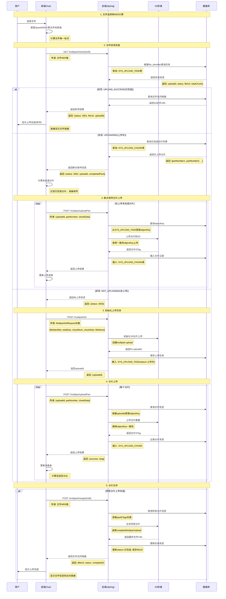
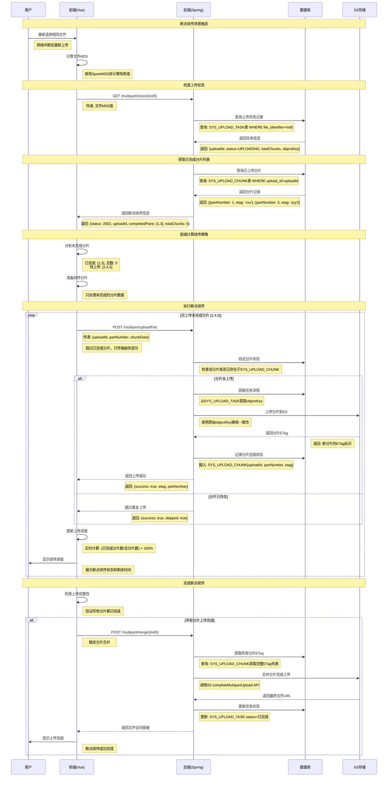
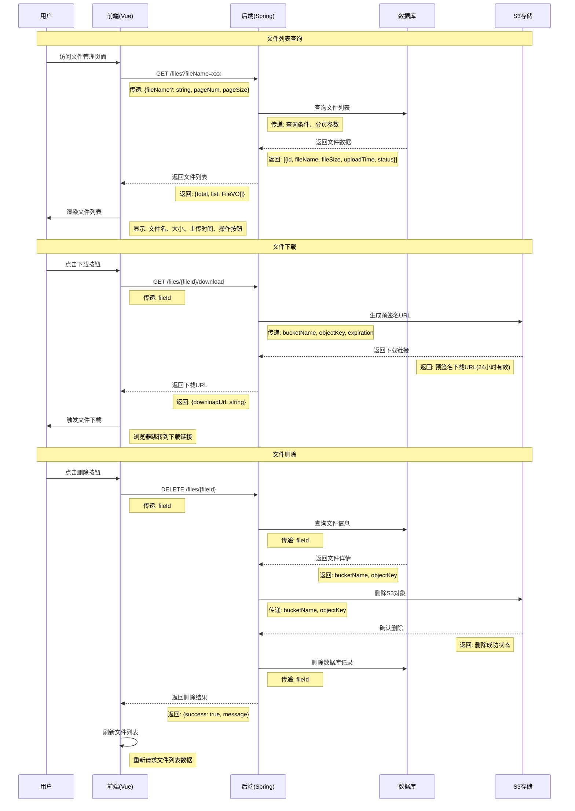
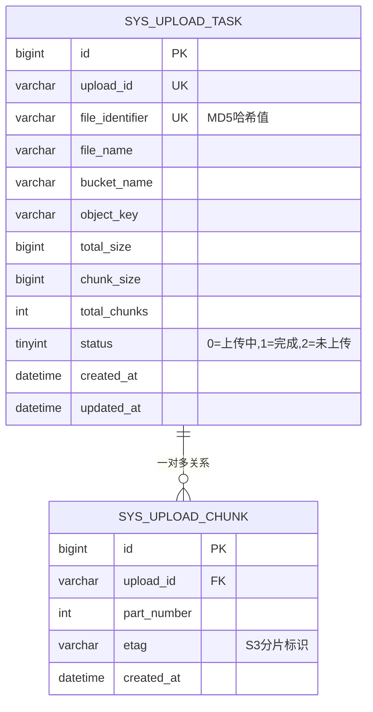
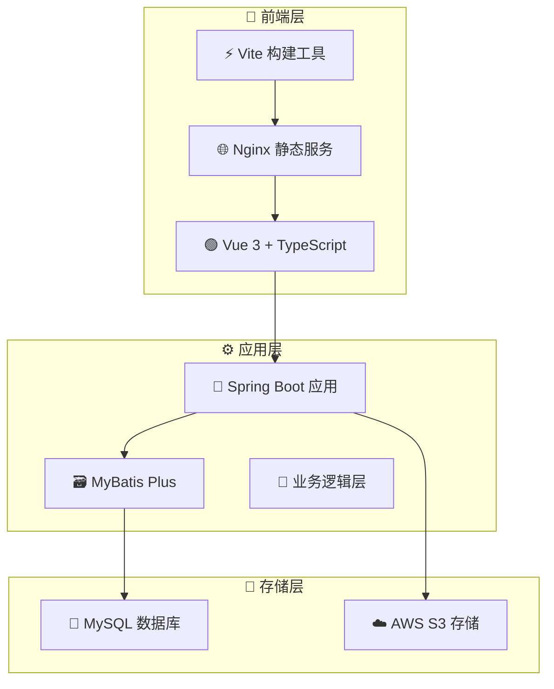

# 🚀 AWS S3 分片上传系统

<div class="badge-container" align="center">
  
  
  
  
  
</div>

::: tip 项目简介
🎯 一个基于 Spring Boot + Vue 3 的企业级文件上传解决方案

采用分片上传、断点续传、秒传等先进技术，为大文件传输提供高效、稳定的服务
:::

::: info 演示视频
📺 [aws-s3分片、断点，秒传演示视频](https://www.bilibili.com/video/BV1qkY3zFEzt/?share_source=copy_web&vd_source=c447f1819318b0fe977ae468afb3faf6)
:::

## 📋 项目功能概述

### 🎯 核心功能特性

#### 🧩 1. 分片上传 (Multipart Upload)

::: tip 核心亮点
智能分片 + 并行传输 = 极速上传体验
:::

- **🔧 技术原理**: 基于AWS S3 Multipart Upload API，将大文件按固定大小（默认5MB）分割成多个独立分片，利用HTTP Range请求实现并行传输。前端使用File.slice()方法进行文件分割，后端通过S3 SDK的uploadPart接口逐个上传分片，最终调用completeMultipartUpload合并所有分片

- **🎯 适用场景**: 
  - 📹 **大文件上传（>100MB）**: 视频文件、高清图片、软件安装包、数据备份文件
  - 📱 **网络不稳定环境**: 移动网络、跨国传输、带宽波动较大的场景
  - 🏢 **高并发上传**: 多用户同时上传大文件的企业应用场景

- **⚡ 交互逻辑**: 前端将大文件分割为固定大小分片，通过多个HTTP请求并行上传至后端
- **🔄 关键交互**: 前端发送分片数据 → 后端接收并上传至S3 → 返回分片上传状态
- **📦 数据传递**: 分片文件数据、uploadId、partNumber、文件MD5

#### 🔄 2. 断点续传 (Resume Upload)

::: tip 核心亮点
智能恢复 + 状态持久化 = 永不丢失的上传进度
:::

- **🔧 技术原理**: 基于分片状态持久化机制，在数据库中记录每个分片的上传状态（sys_upload_chunk表）

- **🎯 适用场景**:
  - 🌐 **网络中断恢复**: 网络连接不稳定导致的上传中断场景
  - ⏰ **长时间上传**: 超大文件（>1GB）需要数小时完成的上传任务
  - 📱 **移动端应用**: 手机应用切换、息屏等导致的上传暂停场景
  - 📚 **批量文件上传**: 多文件上传过程中部分失败需要重新上传的场景

- **⚡ 交互逻辑**: 前端检查上传状态，识别未完成分片，仅上传缺失部分
- **🔄 关键交互**: 前端查询上传进度 → 后端返回已完成分片列表 → 前端续传未完成分片
- **📦 数据传递**: 文件MD5、已完成分片号列表、uploadId、剩余分片数据

#### ⚡ 3. 秒传功能 (Instant Upload)

::: tip 核心亮点
MD5去重 + 智能检索 = 瞬间完成上传
:::

- **🔧 技术原理**: 采用MD5哈希算法对文件内容进行唯一性标识，前端使用SparkMD5库进行增量计算以避免大文件内存溢出。后端通过file_identifier字段（MD5值）在数据库中查询重复文件，利用唯一索引实现O(1)复杂度的快速检索。相同文件直接返回已存储的S3访问链接，避免重复存储

- **🎯 适用场景**:
  - 🔄 **重复文件上传**: 相同文档、视频、软件包的多次上传
  - 👥 **团队协作**: 多人上传相同文件的协作场景
  - 📝 **版本管理**: 相同版本文件的重复提交
  - 💰 **存储空间优化**: 企业级应用中减少重复文件存储，节省成本
  - ☁️ **网盘类应用**: 个人云存储中的文件去重功能

- **⚡ 交互逻辑**: 前端计算文件MD5，后端检查是否已存在相同文件，存在则直接返回链接
- **🔄 关键交互**: 前端发送文件MD5 → 后端查询数据库 → 返回文件存在状态和访问链接
- **📦 数据传递**: 文件MD5哈希值、文件存在标识、文件访问URL

#### 🚀 4. 并发控制 (Concurrent Management)

::: tip 核心亮点
智能队列 + 多线程处理 = 最大化传输效率
:::

- **🔧 技术原理**: 前端使用p-limit库实现并发队列管理，通过Promise.all()控制同时进行的HTTP请求数量。后端采用Spring Boot的异步处理机制，支持多线程并发处理分片上传请求。通过合理配置并发数（建议3-5个），在最大化传输效率的同时避免服务器资源过载

- **🎯 适用场景**:
  - 🌐 **高带宽环境**: 充分利用网络带宽，提升上传速度
  - 📚 **多文件批量上传**: 同时处理多个文件的并行上传
  - 🏢 **企业级应用**: 高并发用户场景下的性能优化
  - 📁 **大文件快速传输**: 通过并发分片上传显著缩短传输时间
  - ⚖️ **服务器负载均衡**: 合理分配服务器处理能力

- **⚡ 交互逻辑**: 前端控制同时上传的分片数量，后端支持多分片并发处理
- **🔄 关键交互**: 前端管理上传队列 → 后端并发处理分片请求 → 返回各分片处理结果
- **📦 数据传递**: 并发数量配置、分片队列状态、各分片上传结果

#### 📁 5. 文件管理 (File Management)

::: tip 核心亮点
RESTful设计 + 预签名URL = 安全高效的文件操作
:::

- **🔧 技术原理**: 基于RESTful API设计，实现文件的CRUD操作。文件列表通过分页查询优化大数据量展示，支持文件名模糊搜索。下载功能使用AWS S3预签名URL机制，生成临时访问链接（24小时有效期），确保安全性。删除操作采用软删除策略，先删除S3对象再清理数据库记录，保证数据一致性

- **🎯 适用场景**:
  - 🏢 **企业文档管理**: 公司内部文件存储、共享、版本控制
  - ☁️ **个人云存储**: 个人文件的在线管理和访问
  - 🎨 **内容管理系统**: 网站、应用的媒体资源管理
  - 💾 **数据备份系统**: 重要文件的集中存储和管理
  - 👥 **协作平台**: 团队成员间的文件共享和协作
  - 📱 **移动应用**: 手机端文件的云端同步和管理

- **⚡ 交互逻辑**: 前端发起文件操作请求，后端处理并返回操作结果
- **🔄 关键交互**: 前端请求文件列表/删除/下载 → 后端查询数据库/S3操作 → 返回结果
- **📦 数据传递**: 文件列表数据、文件ID、操作类型、预签名下载URL

## 🔄 系统交互流程图

### 完整文件上传交互流程

#### 上传状态枚举定义
```java
UPLOAD_SUCCESS(2001, "上传成功"),
UPLOADING(2002, "上传中"),
NOT_UPLOADED(2003, "未上传")
```

#### 详细交互流程说明

**1. 文件选择与MD5计算**
- 用户选择文件后，前端使用SparkMD5库计算文件MD5哈希值
- MD5值作为文件唯一标识，用于后续的秒传和断点续传功能

**2. 文件状态检查 - `/multipart/check/{md5}`**
- 前端调用检查接口，传递文件MD5值
- 后端根据MD5值查询数据库中的文件记录
- 根据查询结果返回不同的响应：

  - **已完成状态(UPLOAD_SUCCESS)**: 返回S3访问链接、uploadId和上传成功标识，实现秒传功能
  - **上传中状态(UPLOADING)**: 返回已上传分片列表、uploadId和上传中状态，支持断点续传
  - **未上传状态(NOT_UPLOADED)**: 返回未上传状态，需要进行初始化上传

**3. 初始化上传任务 - `/multipart/init`**

当文件状态为未上传时，前端调用初始化接口，传递以下参数：

```java
/**
 * 初始化上传请求参数
 */
public class MultipartInitRequest {
    /** 文件唯一标识(MD5) */
    @NotBlank(message = "文件标识不能为空")
    private String fileIdentifier;
    
    /** 文件大小（byte） */
    @NotNull(message = "文件大小不能为空")
    private Long totalSize;
    
    /** 分片数量 */
    @NotNull(message = "分片数量不能为空")
    private Integer chunkNum;
    
    /** 分片大小（byte） */
    @NotNull(message = "分片大小不能为空")
    private Long chunkSize;
    
    /** 文件名称 */
    @NotBlank(message = "文件名称不能为空")
    private String fileName;
}
```

后端处理流程：
- 执行S3初始化分片上传，生成uploadId和objectKey
- 将任务信息存入SYS_UPLOAD_TASK表，状态设置为"上传中"
- 返回生成的uploadId供前端使用

**4. 分片上传 - `/multipart/uploadPart`**

前端调用分片上传接口，传递参数：
- uploadId: 初始化时生成的上传任务ID
- partNumber: 分片编号（从1开始）
- chunkData: 分片文件数据

后端处理流程：
- 根据uploadId从SYS_UPLOAD_TASK表查询文件信息，获取objectKey
- 确保分片上传使用与初始化时一致的objectKey
- 执行S3分片上传操作
- 将分片信息（partNumber、etag）插入SYS_UPLOAD_CHUNK表
- 返回上传结果给前端

**5. 分片合并 - `/multipart/merge/{md5}`**

当所有分片上传完成（待上传分片数量为0）时：
- 前端调用合并接口，传递文件MD5值
- 后端查询所有分片信息，调用S3合并分片API
- 更新任务状态为"已完成"，保存最终文件URL
- 返回文件访问链接给前端



### 断点续传交互流程

断点续传是基于分片状态持久化实现的核心功能，当用户上传过程中遇到网络中断、页面刷新等情况时，系统能够智能识别已完成的分片，仅上传剩余未完成的部分。



### 文件管理交互流程



## 🗄️ 数据库设计说明

::: info 数据存储架构
📊 **高性能数据存储架构**

基于MySQL 8.0+ 的企业级数据持久化解决方案
:::

### 📝 SQL脚本用途

::: details SQL脚本信息
📁 **脚本位置**: `/sql/aws.sql`

🎯 **核心功能**: 系统核心数据表的创建脚本，用于支持分片上传功能的数据持久化需求

🔧 **技术要求**: 适用于MySQL 8.0+版本，采用utf8mb4字符集确保多语言文件名的正确存储
:::

### 🏗️ 核心数据表结构

#### 📋 1. 上传任务表 (sys_upload_task)

::: tip 表作用
记录文件上传任务的完整生命周期，支持秒传和断点续传功能
:::

```sql
CREATE TABLE `sys_upload_task` (
  `id` bigint NOT NULL AUTO_INCREMENT COMMENT '主键ID',
  `upload_id` varchar(255) COMMENT 'S3分片上传的唯一标识符',
  `file_identifier` varchar(500) NOT NULL COMMENT '文件唯一标识（MD5哈希值）',
  `file_name` varchar(500) NOT NULL COMMENT '文件原始名称',
  `bucket_name` varchar(255) NOT NULL COMMENT 'S3存储桶名称',
  `object_key` varchar(500) NOT NULL COMMENT 'S3对象存储路径',
  `total_size` bigint NOT NULL COMMENT '文件总大小（字节）',
  `chunk_size` bigint NOT NULL COMMENT '分片大小（字节）',
  `total_chunks` int NOT NULL COMMENT '总分片数量',
  `status` tinyint NOT NULL DEFAULT '0' COMMENT '上传状态: 0=上传中, 1=已完成, 2=未上传',
  `created_at` datetime DEFAULT CURRENT_TIMESTAMP COMMENT '创建时间',
  `updated_at` datetime DEFAULT CURRENT_TIMESTAMP ON UPDATE CURRENT_TIMESTAMP COMMENT '更新时间',
  PRIMARY KEY (`id`),
  UNIQUE KEY `uk_file_identifier` (`file_identifier`) COMMENT '文件MD5唯一索引，支持秒传功能'
) ENGINE=InnoDB DEFAULT CHARSET=utf8mb4 COLLATE=utf8mb4_general_ci;
```

**🔍 表设计要点:**
- 🔑 `file_identifier` 字段存储文件MD5值，作为秒传功能的核心依据
- 🆔 `upload_id` 对应AWS S3的Multipart Upload ID，用于分片上传管理
- 📊 `status` 字段支持上传状态跟踪，便于断点续传功能实现
- 🚀 唯一索引 `uk_file_identifier` 确保相同文件不会重复存储

#### 🧩 2. 分片记录表 (sys_upload_chunk)

::: tip 表作用
记录每个分片的上传状态，实现精确的断点续传控制
:::

```sql
CREATE TABLE `sys_upload_chunk` (
  `id` bigint NOT NULL AUTO_INCREMENT COMMENT '主键ID',
  `upload_id` varchar(255) NOT NULL COMMENT '关联上传任务的S3 Upload ID',
  `part_number` int NOT NULL COMMENT '分片序号（从1开始）',
  `etag` varchar(255) COMMENT 'S3返回的分片ETag值',
  `created_at` datetime DEFAULT CURRENT_TIMESTAMP COMMENT '创建时间',
  PRIMARY KEY (`id`),
  UNIQUE KEY `uk_task_part` (`upload_id`, `part_number`) COMMENT '上传任务+分片号唯一索引'
) ENGINE=InnoDB DEFAULT CHARSET=utf8mb4 COLLATE=utf8mb4_general_ci;
```

**🔍 表设计要点:**
- 🔢 `part_number` 记录分片序号，支持断点续传时的分片状态检查
- 🏷️ `etag` 存储S3返回的分片标识，用于最终的分片合并操作
- 🛡️ 复合唯一索引 `uk_task_part` 防止同一分片重复上传
- 🔗 与 `sys_upload_task` 表通过 `upload_id` 字段关联

### 📊 数据表关系图



### 🚀 索引优化策略

#### ⚡ 1. 查询性能优化
- 🔍 `file_identifier` 唯一索引：支持O(1)复杂度的秒传检查
- 🎯 `upload_id + part_number` 复合索引：快速定位特定分片记录
- 📊 `status` 字段索引：高效筛选不同状态的上传任务

#### 🛡️ 2. 数据一致性保障
- 🔗 外键约束确保分片记录与上传任务的关联完整性
- 🚫 唯一约束防止重复数据插入
- ⚛️ 事务控制保证分片上传的原子性操作

## 🏗️ 系统架构设计

::: info 系统架构
🚀 **现代化微服务架构**

前后端分离 + 云原生存储 + 高性能数据库
:::

### 💻 技术栈组成

#### 🎨 前端技术栈
- **🟢 Vue 3**: 响应式前端框架，支持Composition API
- **🔷 TypeScript**: 类型安全的JavaScript超集
- **⚡ Vite**: 现代化构建工具，支持热更新
- **📡 Axios**: HTTP客户端，支持请求拦截和响应处理
- **🔐 Spark-MD5**: 高性能MD5哈希计算库
- **🚦 P-Limit**: 并发控制库，管理上传队列

#### ⚙️ 后端技术栈
- **🍃 Spring Boot 2.6+**: 企业级Java应用框架
- **🗃️ MyBatis Plus**: 增强版ORM框架，简化数据库操作
- **☁️ AWS S3 SDK**: 官方对象存储SDK
- **🐬 MySQL 8.0+**: 关系型数据库，支持JSON字段类型
- **💧 Druid**: 高性能数据库连接池
- **🛠️ Hutool**: Java工具类库，提供常用功能封装

### 🏢 部署架构图

::: tip 架构特点
前后端分离 + 微服务设计 + 云原生存储
:::



### 🎯 前端状态管理要求

#### 📊 上传进度计算
- **📈 必须维护**: 已完成分片数量、总分片数量
- **🧮 必须计算**: 进度百分比 = (已完成分片数 / 总分片数) × 100%
- **📱 必须显示**: 上传速度、剩余时间、已传输大小

#### 🔄 断点续传状态
- **💾 必须存储**: 文件MD5、uploadId、已完成分片列表
- **🔍 必须检查**: 页面刷新后恢复上传状态
- **🎯 必须过滤**: 只上传未完成的分片，跳过已完成分片

#### 🚦 并发控制参数
- **⚙️ 必须配置**: 最大并发上传数(建议3-5个)
- **📋 必须管理**: 上传队列，控制同时进行的请求数量
- **🔄 必须处理**: 分片上传失败重试机制(最多3次)

---

**项目维护**: 本项目采用模块化设计，支持功能扩展和性能优化。如需技术支持或功能定制，请参考项目文档或联系开发团队。