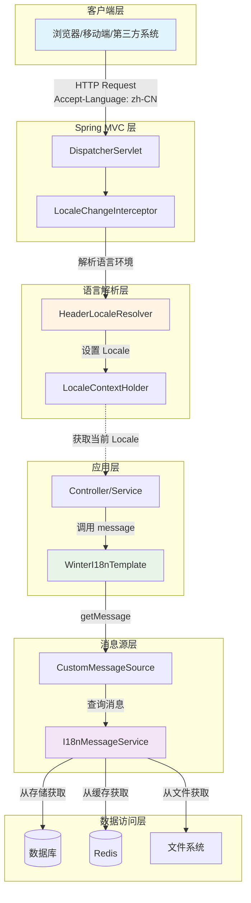
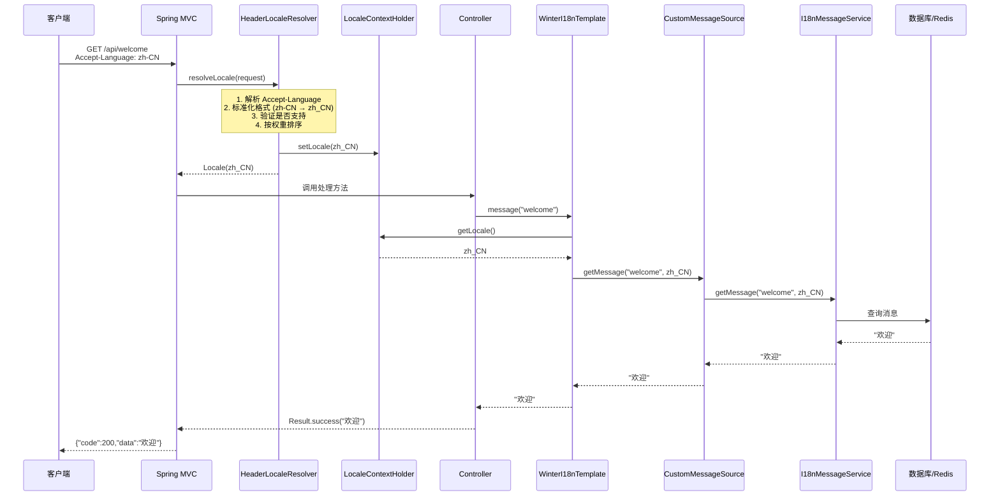
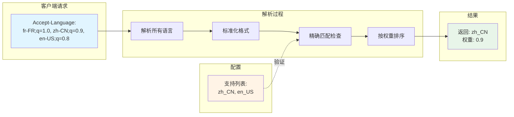
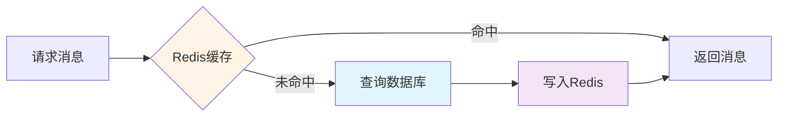

# 🌍 Winter I18n Spring Boot Starter

**轻量级、高性能的 Spring Boot 国际化解决方案**

<div class="badge-container" align="center">

[](https://spring.io/projects/spring-boot)[](https://www.oracle.com/java/)[](https://opensource.org/licenses/Apache-2.0)[](https://search.maven.org/)  

</div>


## 📖 项目简介

Winter I18n 是一个专为 Spring Boot 应用设计的企业级国际化（i18n）解决方案。相比 Spring 原生的国际化支持，它提供了更精确的语言匹配策略、更灵活的消息源扩展能力，以及更友好的 API 设计。

### 🎯 核心优势

- **🎯 精确语言匹配**：采用严格匹配策略，避免语言回退导致的不准确问题
- **💾 灵活消息源**：支持数据库、Redis、文件等多种存储方式，轻松实现动态国际化
- **⚡ 开箱即用**：零配置启动，自动装配所有必要组件
- **🔧 依赖注入优先**：提供 `WinterI18nTemplate` 模板类，避免静态工具类的初始化问题
- **🚀 高性能**：支持缓存机制，适用于高并发场景
- **🔌 易于扩展**：清晰的接口设计，方便实现自定义消息服务
- **📝 完善文档**：详细的 JavaDoc 和使用示例

---

## 🚀 快速开始 {#quick-start}

### 步骤 1：添加依赖

::: code-group
```xml [Maven]
<dependency>
    <groupId>io.github.hahaha-zsq</groupId>
    <artifactId>winter-i18n-spring-boot-starter</artifactId>
    <version>0.0.3</version>
</dependency>
```

```gradle [Gradle]
implementation 'io.github.hahaha-zsq:winter-i18n-spring-boot-starter:0.0.3'
```
:::

### 步骤 2：配置（可选）

在 `application.yml` 中添加配置，如果不配置则使用默认值：

```yaml
winter-i18n:
  locale:
    default-locale: zh_CN              # 默认语言
    supported:                         # 支持的语言列表
      - zh_CN
      - en_US
      - ja_JP
    header-name: Accept-Language       # HTTP 请求头名称
```

### 步骤 3：开始使用

```java
@RestController
@RequestMapping("/api")
public class UserController {
    
    @Autowired
    private WinterI18nTemplate i18nTemplate;  // 推荐：依赖注入
    
    @GetMapping("/welcome")
    public Result<String> welcome() {
        String message = i18nTemplate.message("welcome");
        return Result.success(message);
    }
    
    @GetMapping("/greeting/{name}")
    public Result<String> greeting(@PathVariable String name) {
        // 支持参数化消息
        String message = i18nTemplate.message("greeting", name);
        return Result.success(message);
    }
}
```

### 步骤 4：客户端调用

```bash
# 中文请求
curl -H "Accept-Language: zh-CN" http://localhost:8080/api/welcome

# 英文请求
curl -H "Accept-Language: en-US" http://localhost:8080/api/welcome

# 多语言带权重
curl -H "Accept-Language: zh-CN;q=1.0, en-US;q=0.8" http://localhost:8080/api/welcome
```

::: tip 提示
本项目只提供了默认实现，默认实现会返回消息键本身。要返回实际的国际化消息，请实现自定义的 `I18nMessageService`，参考「动态国际化实现」章节。
:::


---

## 🏗️ 项目架构 {#architecture}

### 架构概览

Winter I18n 采用分层架构设计，从 HTTP 请求解析到消息获取，每一层都有清晰的职责划分：



### 请求处理流程




### 语言匹配策略



**精确匹配示例：**

| 客户端请求 | 支持列表 | 匹配结果 | 说明 |
|-----------|---------|---------|------|
| `zh-CN` | `[zh_CN, en_US]` | ✅ `zh_CN` | 精确匹配 |
| `en-US` | `[zh_CN, en_US]` | ✅ `en_US` | 精确匹配 |
| `zh` | `[zh_CN, en_US]` | ❌ 返回默认语言 | 不支持，必须是 `zh-CN` |
| `en` | `[zh_CN, en_US]` | ❌ 返回默认语言 | 不支持，必须是 `en-US` |
| `fr-FR` | `[zh_CN, en_US]` | ❌ 返回默认语言 | 不在支持列表中 |

---

## 🧩 核心组件 {#core-components}

### 1. HeaderLocaleResolver

**职责**：从 HTTP 请求头中解析客户端的语言环境

**核心特性**：
- ✅ 精确匹配策略（不支持语言代码回退）
- ✅ 支持权重值（q 值）排序
- ✅ 自动格式转换（HTTP 格式 → Java 格式）
- ✅ 容错处理（无效语言返回默认语言）

**处理流程**：
```
Accept-Language: fr-FR;q=1.0, zh-CN;q=0.9, en-US;q=0.8
支持列表: [zh_CN, en_US]

处理步骤:
1. 解析请求头 → [fr-FR(1.0), zh-CN(0.9), en-US(0.8)]
2. 标准化格式 → [fr_FR(1.0), zh_CN(0.9), en_US(0.8)]
3. 按权重排序 → [fr_FR(1.0), zh_CN(0.9), en_US(0.8)]
4. 精确匹配   → fr_FR ✗, zh_CN ✓
5. 返回结果   → zh_CN
```

### 2. WinterI18nTemplate

**职责**：提供便捷的国际化消息获取 API

**设计理念**：
- 类似 Spring 的 `RestTemplate`、`JdbcTemplate` 设计模式
- 通过依赖注入使用，避免静态工具类的初始化问题
- 提供丰富的重载方法，满足不同场景需求

**核心方法**：
```java
// 基础方法
String message(String key)
String message(String key, Object... args)
String message(String key, String defaultMessage, Object... args)

// 指定语言
String message(String key, Locale locale)
String message(String key, Locale locale, Object... args)

// 工具方法
Locale getCurrentLocale()
Locale parseLocale(String languageTag)
```

### 3. CustomMessageSource

**职责**：实现 Spring 的 MessageSource 接口，整合自定义消息服务

**核心功能**：
- 支持消息参数化（MessageFormat 格式）
- 支持默认消息回退
- 与 I18nMessageService 无缝集成
- 完整的异常处理

### 4. I18nMessageService

**职责**：定义获取国际化消息的接口，提供默认实现，只打印，具体的功能需要用户自行实现该接口

**实现方式**：

| 实现类 | 说明 | 适用场景 |
|--------|------|----------|
| DefaultI18nMessageService | 默认实现，返回消息键 | 开发测试 


---

## 📖 使用指南 {#usage-guide}

### 1. 在非静态方法中使用（推荐）

#### ✅ 方式一：使用 WinterI18nTemplate（推荐）

```java
@Service
public class UserService {
    
    @Autowired
    private WinterI18nTemplate i18nTemplate;  // 推荐：依赖注入
    
    // 1. 获取简单消息
    public String getWelcome() {
        return i18nTemplate.message("welcome");
        // 中文: "欢迎" | 英文: "Welcome"
    }
    
    // 2. 获取带参数的消息
    public String getGreeting(String name) {
        return i18nTemplate.message("greeting", name);
        // 模板: "你好，{0}！" → "你好，张三！"
    }
    
    // 3. 获取带默认消息的消息
    public String getSafeMessage(String key) {
        return i18nTemplate.message(key, "默认消息");
        // 如果 key 不存在，返回默认消息
    }
    
    // 4. 获取指定语言的消息
    public String getEnglishMessage() {
        return i18nTemplate.message("welcome", Locale.US);
        // 强制返回英文: "Welcome"
    }
}
```

#### ✅ 方式二：使用 MessageSource（Spring 原生）

```java
@Service
public class UserService {
    
    @Autowired
    private MessageSource messageSource;
    
    public String getMessage() {
        Locale locale = LocaleContextHolder.getLocale();
        return messageSource.getMessage("welcome", null, locale);
    }
}
```

### 2. 在静态方法中使用

#### ⚠️ 方式一：传递 WinterI18nTemplate 参数（推荐）

```java
public class Result<T> {
    
    // 接收 WinterI18nTemplate 参数
    public static <T> Result<T> success(WinterI18nTemplate i18n, String messageKey, T data) {
        String message = i18n.message(messageKey);
        return new Result<>(200, message, data);
    }
}

// 使用
@RestController
public class UserController {
    
    @Autowired
    private WinterI18nTemplate i18nTemplate;
    
    @GetMapping("/user")
    public Result<User> getUser() {
        User user = userService.getUser();
        return Result.success(i18nTemplate, "user.query.success", user);
    }
}
```

#### ⚠️ 方式二：重构为非静态方法（推荐）

```java
@Component
public class ResultBuilder {
    
    @Autowired
    private WinterI18nTemplate i18nTemplate;
    
    public <T> Result<T> success(String messageKey, T data) {
        String message = i18nTemplate.message(messageKey);
        return new Result<>(200, message, data);
    }
    
    public <T> Result<T> error(String messageKey) {
        String message = i18nTemplate.message(messageKey);
        return new Result<>(500, message, null);
    }
}

// 使用
@RestController
public class UserController {
    
    @Autowired
    private ResultBuilder resultBuilder;
    
    @GetMapping("/user")
    public Result<User> getUser() {
        User user = userService.getUser();
        return resultBuilder.success("user.query.success", user);
    }
}
```

#### ⚠️ 方式三：使用 WinterI18nUtil 静态工具类（不推荐）

```java
// ⚠️ 不推荐：可能存在初始化顺序问题
public class Result<T> {
    
    public static <T> Result<T> success(String messageKey, T data) {
        String message = WinterI18nUtil.message(messageKey);
        return new Result<>(200, message, data);
    }
}
```

::: warning 警告
在全局异常处理器等早期初始化的组件中使用静态工具类可能导致 `NullPointerException`，因为 Spring 容器可能还未完全初始化。
:::


---

## 💾 动态国际化实现 {#dynamic-i18n}

### 1. 数据库实现

#### 步骤 1：创建数据表

```sql
CREATE TABLE i18n_message (
    id BIGINT PRIMARY KEY AUTO_INCREMENT COMMENT '主键ID',
    message_key VARCHAR(255) NOT NULL COMMENT '消息键',
    locale VARCHAR(10) NOT NULL COMMENT '语言环境',
    content TEXT NOT NULL COMMENT '消息内容',
    description VARCHAR(500) COMMENT '消息描述',
    created_at TIMESTAMP DEFAULT CURRENT_TIMESTAMP COMMENT '创建时间',
    updated_at TIMESTAMP DEFAULT CURRENT_TIMESTAMP ON UPDATE CURRENT_TIMESTAMP COMMENT '更新时间',
    UNIQUE KEY uk_key_locale (message_key, locale),
    INDEX idx_locale (locale)
) ENGINE=InnoDB DEFAULT CHARSET=utf8mb4 COMMENT='国际化消息表';

-- 插入示例数据
INSERT INTO i18n_message (message_key, locale, content, description) VALUES
('welcome', 'zh_CN', '欢迎', '欢迎消息'),
('welcome', 'en_US', 'Welcome', 'Welcome message'),
('greeting', 'zh_CN', '你好，{0}！', '问候消息'),
('greeting', 'en_US', 'Hello, {0}!', 'Greeting message'),
('user.created', 'zh_CN', '用户 {0} 创建成功', '用户创建成功消息'),
('user.created', 'en_US', 'User {0} created successfully', 'User created message');
```

#### 步骤 2：创建实体类

```java
@Data
@Entity
@Table(name = "i18n_message")
public class I18nMessage {
    
    @Id
    @GeneratedValue(strategy = GenerationType.IDENTITY)
    private Long id;
    
    @Column(name = "message_key", nullable = false, length = 255)
    private String messageKey;
    
    @Column(name = "locale", nullable = false, length = 10)
    private String locale;
    
    @Column(name = "content", nullable = false, columnDefinition = "TEXT")
    private String content;
    
    @Column(name = "description", length = 500)
    private String description;
    
    @Column(name = "created_at")
    private LocalDateTime createdAt;
    
    @Column(name = "updated_at")
    private LocalDateTime updatedAt;
}
```

#### 步骤 3：创建 Repository

```java
public interface I18nMessageRepository extends JpaRepository<I18nMessage, Long> {
    
    /**
     * 根据消息键和语言环境查询消息
     */
    Optional<I18nMessage> findByMessageKeyAndLocale(String messageKey, String locale);
    
    /**
     * 根据语言环境查询所有消息
     */
    List<I18nMessage> findByLocale(String locale);
    
    /**
     * 根据消息键查询所有语言的消息
     */
    List<I18nMessage> findByMessageKey(String messageKey);
}
```

#### 步骤 4：实现消息服务

```java
@Service
@Primary  // 优先使用此实现
@Slf4j
public class DatabaseI18nMessageService implements I18nMessageService {
    
    @Autowired
    private I18nMessageRepository repository;
    
    @Cacheable(value = "i18n", key = "#messageKey + '_' + #locale")
    @Override
    public String getMessage(String messageKey, Locale locale) {
        log.debug("从数据库获取消息: key={}, locale={}", messageKey, locale);
        
        return repository.findByMessageKeyAndLocale(messageKey, locale.toString())
                .map(I18nMessage::getContent)
                .orElse(null);
    }
    
    @Override
    public String getMessage(String messageKey, Object[] args, Locale locale) {
        String message = getMessage(messageKey, locale);
        if (message != null && args != null && args.length > 0) {
            return MessageFormat.format(message, args);
        }
        return message;
    }
    
    @Override
    public String getMessage(String messageKey, Object[] args, String defaultMessage, Locale locale) {
        String message = getMessage(messageKey, args, locale);
        return message != null ? message : defaultMessage;
    }
    
    /**
     * 清除缓存
     */
    @CacheEvict(value = "i18n", allEntries = true)
    public void clearCache() {
        log.info("清除国际化消息缓存");
    }
    
    /**
     * 清除指定消息的缓存
     */
    @CacheEvict(value = "i18n", key = "#messageKey + '_' + #locale")
    public void clearCache(String messageKey, String locale) {
        log.info("清除国际化消息缓存: key={}, locale={}", messageKey, locale);
    }
}
```

#### 步骤 5：配置缓存（可选但推荐）

```yaml
spring:
  cache:
    type: redis
    redis:
      time-to-live: 3600000  # 1小时
      cache-null-values: false
```

```java
@Configuration
@EnableCaching
public class CacheConfig {
    
    @Bean
    public CacheManager cacheManager(RedisConnectionFactory factory) {
        RedisCacheConfiguration config = RedisCacheConfiguration
            .defaultCacheConfig()
            .entryTtl(Duration.ofHours(1))
            .disableCachingNullValues()
            .serializeKeysWith(
                RedisSerializationContext.SerializationPair.fromSerializer(
                    new StringRedisSerializer()
                )
            )
            .serializeValuesWith(
                RedisSerializationContext.SerializationPair.fromSerializer(
                    new GenericJackson2JsonRedisSerializer()
                )
            );
            
        return RedisCacheManager.builder(factory)
            .cacheDefaults(config)
            .build();
    }
}
```


### 2. Redis实现

#### 步骤 1：添加依赖

```xml
<dependency>
    <groupId>org.springframework.boot</groupId>
    <artifactId>spring-boot-starter-data-redis</artifactId>
</dependency>
```

#### 步骤 2：配置 Redis

```yaml
spring:
  redis:
    host: localhost
    port: 6379
    password: your_password
    database: 0
    lettuce:
      pool:
        max-active: 8
        max-idle: 8
        min-idle: 0
```

#### 步骤 3：实现消息服务

```java
@Service
@Primary
@Slf4j
public class RedisI18nMessageService implements I18nMessageService {
    
    @Autowired
    private StringRedisTemplate redisTemplate;
    
    private static final String KEY_PREFIX = "i18n:";
    
    @Override
    public String getMessage(String messageKey, Locale locale) {
        String key = buildKey(messageKey, locale);
        String message = redisTemplate.opsForValue().get(key);
        
        log.debug("从Redis获取消息: key={}, message={}", key, message);
        return message;
    }
    
    @Override
    public String getMessage(String messageKey, Object[] args, Locale locale) {
        String message = getMessage(messageKey, locale);
        if (message != null && args != null && args.length > 0) {
            return MessageFormat.format(message, args);
        }
        return message;
    }
    
    @Override
    public String getMessage(String messageKey, Object[] args, String defaultMessage, Locale locale) {
        String message = getMessage(messageKey, args, locale);
        return message != null ? message : defaultMessage;
    }
    
    /**
     * 保存消息到Redis
     */
    public void saveMessage(String messageKey, Locale locale, String content) {
        String key = buildKey(messageKey, locale);
        redisTemplate.opsForValue().set(key, content);
        log.info("保存消息到Redis: key={}, content={}", key, content);
    }
    
    /**
     * 批量保存消息
     */
    public void saveMessages(Map<String, Map<Locale, String>> messages) {
        messages.forEach((messageKey, localeMap) -> {
            localeMap.forEach((locale, content) -> {
                saveMessage(messageKey, locale, content);
            });
        });
    }
    
    /**
     * 删除消息
     */
    public void deleteMessage(String messageKey, Locale locale) {
        String key = buildKey(messageKey, locale);
        redisTemplate.delete(key);
        log.info("删除Redis消息: key={}", key);
    }
    
    private String buildKey(String messageKey, Locale locale) {
        return KEY_PREFIX + locale.toString() + ":" + messageKey;
    }
}
```

#### 步骤 4：初始化数据

```java
@Component
@Slf4j
public class RedisI18nInitializer implements ApplicationRunner {
    
    @Autowired
    private RedisI18nMessageService redisI18nMessageService;
    
    @Override
    public void run(ApplicationArguments args) {
        log.info("初始化Redis国际化消息...");
        
        Map<String, Map<Locale, String>> messages = new HashMap<>();
        
        // welcome 消息
        Map<Locale, String> welcomeMessages = new HashMap<>();
        welcomeMessages.put(Locale.SIMPLIFIED_CHINESE, "欢迎");
        welcomeMessages.put(Locale.US, "Welcome");
        messages.put("welcome", welcomeMessages);
        
        // greeting 消息
        Map<Locale, String> greetingMessages = new HashMap<>();
        greetingMessages.put(Locale.SIMPLIFIED_CHINESE, "你好，{0}！");
        greetingMessages.put(Locale.US, "Hello, {0}!");
        messages.put("greeting", greetingMessages);
        
        redisI18nMessageService.saveMessages(messages);
        
        log.info("Redis国际化消息初始化完成");
    }
}
```

### 3. 混合实现（数据库 + Redis）

结合数据库和 Redis 的优势，实现高性能的动态国际化：



```java
@Service
@Primary
@Slf4j
public class HybridI18nMessageService implements I18nMessageService {
    
    @Autowired
    private I18nMessageRepository repository;
    
    @Autowired
    private StringRedisTemplate redisTemplate;
    
    private static final String KEY_PREFIX = "i18n:";
    private static final long CACHE_EXPIRE_SECONDS = 3600; // 1小时
    
    @Override
    public String getMessage(String messageKey, Locale locale) {
        // 1. 先从Redis获取
        String redisKey = buildKey(messageKey, locale);
        String message = redisTemplate.opsForValue().get(redisKey);
        
        if (message != null) {
            log.debug("从Redis缓存获取消息: key={}", redisKey);
            return message;
        }
        
        // 2. Redis未命中，从数据库获取
        log.debug("Redis未命中，从数据库获取消息: key={}, locale={}", messageKey, locale);
        Optional<I18nMessage> optional = repository.findByMessageKeyAndLocale(
            messageKey, 
            locale.toString()
        );
        
        if (optional.isPresent()) {
            message = optional.get().getContent();
            
            // 3. 写入Redis缓存
            redisTemplate.opsForValue().set(
                redisKey, 
                message, 
                CACHE_EXPIRE_SECONDS, 
                TimeUnit.SECONDS
            );
            log.debug("消息写入Redis缓存: key={}", redisKey);
            
            return message;
        }
        
        return null;
    }
    
    @Override
    public String getMessage(String messageKey, Object[] args, Locale locale) {
        String message = getMessage(messageKey, locale);
        if (message != null && args != null && args.length > 0) {
            return MessageFormat.format(message, args);
        }
        return message;
    }
    
    @Override
    public String getMessage(String messageKey, Object[] args, String defaultMessage, Locale locale) {
        String message = getMessage(messageKey, args, locale);
        return message != null ? message : defaultMessage;
    }
    
    /**
     * 更新消息（同时更新数据库和Redis）
     */
    public void updateMessage(String messageKey, Locale locale, String content) {
        // 1. 更新数据库
        Optional<I18nMessage> optional = repository.findByMessageKeyAndLocale(
            messageKey, 
            locale.toString()
        );
        
        I18nMessage entity;
        if (optional.isPresent()) {
            entity = optional.get();
            entity.setContent(content);
            entity.setUpdatedAt(LocalDateTime.now());
        } else {
            entity = new I18nMessage();
            entity.setMessageKey(messageKey);
            entity.setLocale(locale.toString());
            entity.setContent(content);
            entity.setCreatedAt(LocalDateTime.now());
            entity.setUpdatedAt(LocalDateTime.now());
        }
        
        repository.save(entity);
        
        // 2. 更新Redis缓存
        String redisKey = buildKey(messageKey, locale);
        redisTemplate.opsForValue().set(
            redisKey, 
            content, 
            CACHE_EXPIRE_SECONDS, 
            TimeUnit.SECONDS
        );
        
        log.info("更新国际化消息: key={}, locale={}, content={}", messageKey, locale, content);
    }
    
    /**
     * 删除消息（同时删除数据库和Redis）
     */
    public void deleteMessage(String messageKey, Locale locale) {
        // 1. 删除数据库记录
        repository.findByMessageKeyAndLocale(messageKey, locale.toString())
            .ifPresent(repository::delete);
        
        // 2. 删除Redis缓存
        String redisKey = buildKey(messageKey, locale);
        redisTemplate.delete(redisKey);
        
        log.info("删除国际化消息: key={}, locale={}", messageKey, locale);
    }
    
    /**
     * 清除所有缓存
     */
    public void clearAllCache() {
        Set<String> keys = redisTemplate.keys(KEY_PREFIX + "*");
        if (keys != null && !keys.isEmpty()) {
            redisTemplate.delete(keys);
            log.info("清除所有国际化消息缓存，共{}条", keys.size());
        }
    }
    
    private String buildKey(String messageKey, Locale locale) {
        return KEY_PREFIX + locale.toString() + ":" + messageKey;
    }
}
```


### 4. 管理接口示例

提供 RESTful API 来管理国际化消息：

```java
@RestController
@RequestMapping("/api/i18n")
@Slf4j
public class I18nManagementController {
    
    @Autowired
    private HybridI18nMessageService i18nMessageService;
    
    /**
     * 查询消息
     */
    @GetMapping("/messages/{key}")
    public Result<Map<String, String>> getMessage(@PathVariable String key) {
        Map<String, String> messages = new HashMap<>();
        messages.put("zh_CN", i18nMessageService.getMessage(key, Locale.SIMPLIFIED_CHINESE));
        messages.put("en_US", i18nMessageService.getMessage(key, Locale.US));
        return Result.success(messages);
    }
    
    /**
     * 创建或更新消息
     */
    @PostMapping("/messages")
    public Result<Void> saveMessage(@RequestBody I18nMessageDTO dto) {
        i18nMessageService.updateMessage(
            dto.getMessageKey(), 
            Locale.forLanguageTag(dto.getLocale()), 
            dto.getContent()
        );
        return Result.success();
    }
    
    /**
     * 删除消息
     */
    @DeleteMapping("/messages/{key}/{locale}")
    public Result<Void> deleteMessage(
            @PathVariable String key, 
            @PathVariable String locale) {
        i18nMessageService.deleteMessage(
            key, 
            Locale.forLanguageTag(locale)
        );
        return Result.success();
    }
    
    /**
     * 清除所有缓存
     */
    @PostMapping("/cache/clear")
    public Result<Void> clearCache() {
        i18nMessageService.clearAllCache();
        return Result.success();
    }
}

@Data
class I18nMessageDTO {
    private String messageKey;
    private String locale;
    private String content;
    private String description;
}
```

---

## ⚙️ 配置说明

### 配置项详解

| 配置项 | 类型 | 默认值 | 说明 |
|--------|------|--------|------|
| `winter-i18n.locale.default-locale` | String | `zh_CN` | 默认语言环境，当无法解析客户端语言时使用 |
| `winter-i18n.locale.supported` | List&lt;String&gt; | `["zh_CN", "en_US"]` | 系统支持的语言环境列表 |
| `winter-i18n.locale.header-name` | String | `Accept-Language` | 用于解析语言环境的HTTP请求头名称 |

### 语言代码格式

采用 **Java 标准格式**（下划线分隔）：`language_COUNTRY`

**常用语言代码：**

| 代码 | 语言 | 国家/地区 |
|------|------|----------|
| `zh_CN` | 简体中文 | 中国大陆 |
| `zh_TW` | 繁体中文 | 中国台湾 |
| `zh_HK` | 繁体中文 | 中国香港 |
| `en_US` | 英语 | 美国 |
| `en_GB` | 英语 | 英国 |
| `ja_JP` | 日语 | 日本 |
| `ko_KR` | 韩语 | 韩国 |
| `fr_FR` | 法语 | 法国 |
| `de_DE` | 德语 | 德国 |
| `es_ES` | 西班牙语 | 西班牙 |
| `pt_BR` | 葡萄牙语 | 巴西 |
| `ru_RU` | 俄语 | 俄罗斯 |

### 完整配置示例

```yaml
winter-i18n:
  locale:
    # 设置默认语言为英语
    default-locale: en_US
    # 支持多种语言
    supported:
      - zh_CN    # 简体中文
      - zh_TW    # 繁体中文
      - en_US    # 美式英语
      - en_GB    # 英式英语
      - ja_JP    # 日语
      - ko_KR    # 韩语
      - fr_FR    # 法语
      - de_DE    # 德语
    # 使用自定义请求头
    header-name: X-Language

# Spring 缓存配置（可选）
spring:
  cache:
    type: redis
    redis:
      time-to-live: 3600000  # 1小时
      cache-null-values: false
  
  # Redis 配置（如果使用Redis实现）
  redis:
    host: localhost
    port: 6379
    password: your_password
    database: 0
    lettuce:
      pool:
        max-active: 8
        max-idle: 8
        min-idle: 0
```

---

## 💡 最佳实践

### ✅ 推荐做法

#### 1. 使用 WinterI18nTemplate 依赖注入

```java
// ✅ 推荐：通过依赖注入使用
@Service
public class UserService {
    @Autowired
    private WinterI18nTemplate i18nTemplate;
    
    public String getMessage() {
        return i18nTemplate.message("welcome");
    }
}
```

#### 2. 在全局异常处理器中使用依赖注入

```java
@RestControllerAdvice
public class GlobalExceptionHandler {
    @Autowired
    private WinterI18nTemplate i18nTemplate;  // ✅ 正确
    
    @ExceptionHandler(BusinessException.class)
    public Result handleException(BusinessException e) {
        String message = i18nTemplate.message(e.getMessage());
        return Result.error(message);
    }
}
```

#### 3. 为消息键使用统一的命名规范

```
模块.功能.类型
例如: 
  - user.login.success
  - user.login.failed
  - order.create.success
  - order.create.failed
  - validation.email.invalid
  - validation.phone.invalid
```

#### 4. 实现缓存以提高性能

```java
@Cacheable(value = "i18n", key = "#messageKey + '_' + #locale")
public String getMessage(String messageKey, Locale locale) {
    // 从数据库获取
}
```

#### 5. 在定时任务和异步任务中显式传递 Locale

```java
@Async
public void sendEmail(User user, Locale locale) {
    String message = i18nTemplate.message("email.welcome", locale);
}
```

#### 6. 使用参数化消息

```java
// 消息模板: "用户 {0} 在 {1} 创建了订单"
String message = i18nTemplate.message(
    "order.created", 
    user.getName(), 
    LocalDateTime.now()
);
```

### ❌ 避免的做法

#### 1. 避免在静态初始化块中使用

```java
// ❌ 错误：可能导致 NullPointerException
public class MyClass {
    private static final String MESSAGE = WinterI18nUtil.message("welcome");
}
```

#### 2. 避免硬编码语言环境

```java
// ❌ 不推荐：硬编码语言
String message = i18nTemplate.message("welcome", new Locale("zh", "CN"));

// ✅ 推荐：使用常量
String message = i18nTemplate.message("welcome", Locale.SIMPLIFIED_CHINESE);
```

#### 3. 避免在循环中频繁查询

```java
// ❌ 不推荐：每次循环都查询
for (User user : users) {
    String message = i18nTemplate.message("greeting", user.getName());
}

// ✅ 推荐：先获取模板，再格式化
String template = i18nTemplate.message("greeting");
for (User user : users) {
    String message = MessageFormat.format(template, user.getName());
}
```


---

## ❓ 常见问题

::: details Q1: 为什么只传 en 不行，必须传 en-US？

本框架采用**精确匹配策略**，确保语言环境的准确性。

```
❌ 错误: Accept-Language: en
✅ 正确: Accept-Language: en-US

原因：
- 配置中只有 en_US，没有 en
- 精确匹配要求完全相同
- 避免语言歧义（en 可能是 en-US、en-GB、en-AU 等）
```

**解决方案：** 客户端传递完整的语言-国家代码
:::

::: details Q2: 如何支持多个语言变体？

在配置中添加所有需要支持的变体：

```yaml
winter-i18n:
  locale:
    supported:
      - zh_CN    # 简体中文（中国大陆）
      - zh_TW    # 繁体中文（台湾）
      - zh_HK    # 繁体中文（香港）
      - en_US    # 英语（美国）
      - en_GB    # 英语（英国）
```
:::

::: details Q3: 如何在全局异常处理器中使用国际化？

**推荐方式：使用依赖注入**

```java
@RestControllerAdvice
public class GlobalExceptionHandler {
    
    @Autowired
    private WinterI18nTemplate i18nTemplate;  // ✅ 依赖注入
    
    @ExceptionHandler(BusinessException.class)
    public Result handleBusinessException(BusinessException e) {
        String message = i18nTemplate.message(e.getMessage());
        return Result.error(message);
    }
}
```

**为什么推荐使用依赖注入？**
- 全局异常处理器可能在应用启动早期就被实例化
- 依赖注入确保 Bean 的正确初始化顺序
- 避免静态工具类可能存在的初始化问题
:::


---

## 📝 更新日志

### v0.0.3 (2025-10-13)

#### 🎉 重大更新

**新增功能**
- ✨ 新增 `WinterI18nTemplate` 模板类，提供更友好的依赖注入方式
- ✨ 自动配置 `WinterI18nTemplate` Bean，支持在任何 Spring 组件中使用

**架构优化**
- 🏗️ 优化自动配置类，确保 Bean 初始化顺序正确
- 🏗️ 改进 `HeaderLocaleResolver` 的精确匹配逻辑
- 🏗️ 增强 `CustomMessageSource` 的异常处理能力
- 🔒 提升线程安全性，支持高并发场景

**文档完善**
- 📝 重写 README，提供完整的使用指南和架构说明
- 📝 新增流程图和架构图，直观展示工作原理
- 📝 新增动态国际化实现指南（数据库、Redis、混合）
- 📝 新增静态方法和非静态方法使用指南
- 📝 新增常见问题解答（FAQ）


### v0.0.2 (2024-12-01)
- ✨ 实现精确语言匹配策略
- ✨ 支持动态消息源
- ✨ 提供完整的自动配置
- 📝 添加详细的 JavaDoc 注释

### v0.0.1 (2024-11-01)
- 🎉 首次发布
- ✨ 基础国际化功能
- ✨ 支持 HTTP 请求头解析


---

## 🤝 贡献指南

欢迎贡献代码、报告问题或提出建议！

### 如何贡献

1. **Fork 本仓库**
2. **创建特性分支** (`git checkout -b feature/AmazingFeature`)
3. **提交更改** (`git commit -m 'Add some AmazingFeature'`)
4. **推送到分支** (`git push origin feature/AmazingFeature`)
5. **开启 Pull Request**

### 代码规范

- 遵循阿里巴巴 Java 开发手册
- 添加完整的 JavaDoc 注释
- 编写单元测试
- 保持代码简洁清晰

### 报告问题

如果你发现了 bug 或有功能建议，请[创建 Issue](https://github.com/hahaha-zsq/winter-i18n-spring-boot-starter/issues)。

提交 Issue 时请包含：
- 问题描述
- 复现步骤
- 期望行为
- 实际行为
- 环境信息（Spring Boot 版本、Java 版本等）

### 开发环境搭建

```bash
# 克隆仓库
git clone https://github.com/hahaha-zsq/winter-i18n-spring-boot-starter.git

# 进入项目目录
cd winter-i18n-spring-boot-starter

# 编译项目
mvn clean install

# 运行测试
mvn test
```

---

## 📄 许可证

本项目采用 [Apache License 2.0](LICENSE) 许可证。

```
Copyright 2024 zsq

Licensed under the Apache License, Version 2.0 (the "License");
you may not use this file except in compliance with the License.
You may obtain a copy of the License at

    http://www.apache.org/licenses/LICENSE-2.0

Unless required by applicable law or agreed to in writing, software
distributed under the License is distributed on an "AS IS" BASIS,
WITHOUT WARRANTIES OR CONDITIONS OF ANY KIND, either express or implied.
See the License for the specific language governing permissions and
limitations under the License.
```

---

## 👨‍💻 作者

**dadandiaoming**

- GitHub: [@hahaha-zsq](https://github.com/hahaha-zsq)
- Email: 2595915122@qq.com

---

## 🙏 致谢

感谢所有贡献者和使用者的支持！

特别感谢：
- Spring Boot 团队提供的优秀框架
- 所有提出建议和反馈的用户

---

## 📞 联系方式

- 📧 Email: 2595915122@qq.com
- 💬 Issues: [GitHub Issues](https://github.com/hahaha-zsq/winter-i18n-spring-boot-starter/issues)
- 📖 文档: [GitHub Wiki](https://github.com/hahaha-zsq/winter-i18n-spring-boot-starter/wiki)

---

## ⭐ Star History

如果这个项目对你有帮助，请给个 Star！⭐

[](https://star-history.com/#hahaha-zsq/winter-i18n-spring-boot-starter&Date)

---

## 📊 项目统计


---

**Made with ❤️ by [dadandiaoming](https://github.com/hahaha-zsq)**

如果这个项目对你有帮助，请考虑给它一个 ⭐️

[⬆ 回到顶部](#-winter-i18n-spring-boot-starter)
