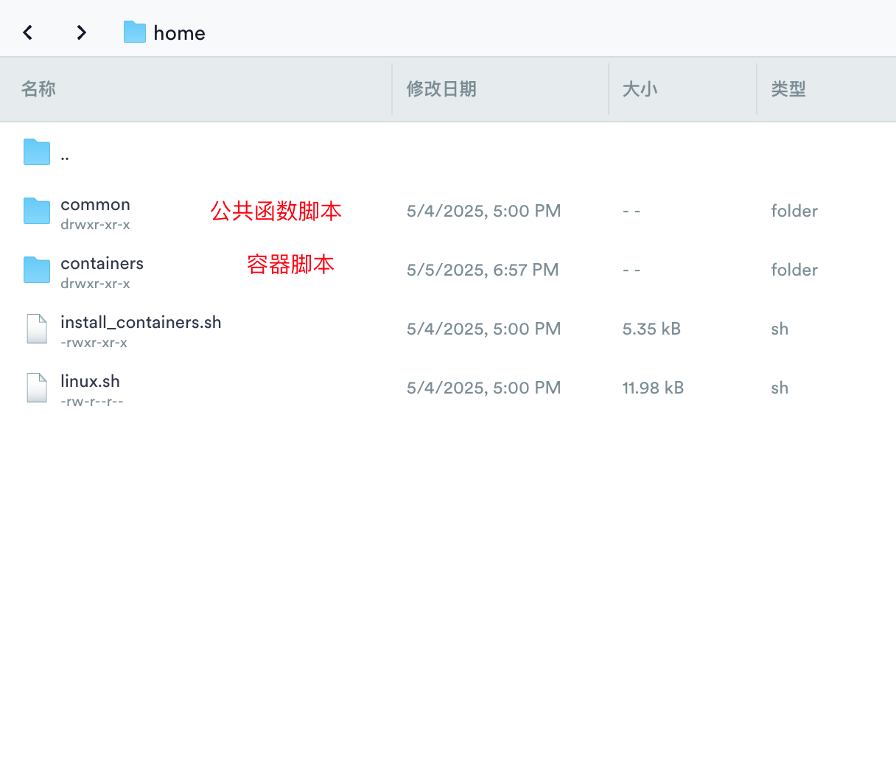
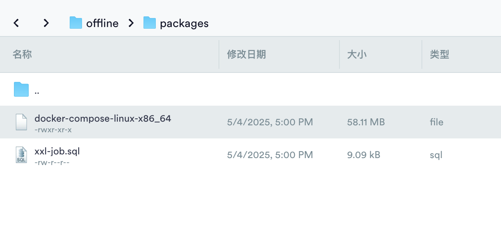

# 🌟 CentOS 7 基础环境安装脚本

> 🧰 一键部署！助你在 CentOS 7 系统上快速构建高效开发环境。
<div class="badge-container" align="center">

[](https://github.com/hahaha-zsq/Shortcut-Script)
[](https://github.com/hahaha-zsq/Shortcut-Script/blob/master/LICENSE)
[](https://www.centos.org/)
</div>
## 📋 项目简介

**Shortcut-Script** 是一个专为 CentOS 7 系统设计的自动化部署脚本集合，旨在帮助开发者和运维人员快速搭建完整的开发环境。通过简单的脚本执行，即可完成从基础软件到各种服务的自动化安装和配置。

### ✨ 主要特性

- 🚀 **一键部署**：自动化安装基础开发环境
- 🐳 **容器化支持**：支持 Docker 和多种常用服务容器
- 🔧 **离线安装**：支持离线包部署，适应内网环境
- 📦 **模块化设计**：脚本结构清晰，易于维护和扩展
- 🎯 **生产就绪**：经过实际环境测试，配置优化

---

## 📦 项目结构

```plaintext
./
├── linux.sh                    # 🛠️ 主脚本：安装基础软件环境
├── install_containers.sh       # 🐳 容器安装脚本：安装各种 Docker 容器
├── xxl-job.sql                 # 🗄️ XXL-JOB 数据库初始化脚本
├── common/
│   └── utils.sh                # 🧩 公共函数库：提供各种工具函数
└── containers/                 # 📂 容器安装脚本目录
    ├── mysql.sh                # 🐬 MySQL 安装脚本
    ├── redis.sh                # 🔴 Redis 安装脚本
    ├── nginx.sh                # 🌐 Nginx 安装脚本
    ├── mongodb.sh              # 🍃 MongoDB 安装脚本
    ├── minio.sh                # 🪣 MinIO 安装脚本
    ├── milvus.sh               # 🧠 Milvus 安装脚本
    └── xxl-job.sh              # ⏰ XXL-JOB 安装脚本
```

---

## 🧩 主要功能概览

### 1️⃣ `linux.sh` - 基础环境安装脚本

✅ 功能包括：

- 🚀 更新 YUM 源（支持阿里云镜像）
- 🛠️ 安装基础开发工具：
    - 📋 vim、net-tools、tree 等
    - 🐳 Docker + Docker Compose
    - 🧬 Git、Maven、OpenJDK（支持 1.8 和 11）
    - ⚙️ Node.js、Nginx
    - 🦊 vfox 终端助手

---

### 2️⃣ `install_containers.sh` - Docker 容器部署

🎯 支持以下服务容器的自动化部署：

- 🐬 MySQL 8.0+
- 🔴 Redis 6.0+
- 🌐 Nginx
- 🍃 MongoDB
- 📦 RabbitMQ
- 🪣 MinIO
- 🔍 Elasticsearch
- ⏰ XXL-JOB
- 🧠 Milvus（依赖 MinIO）

---

## 🚀 快速使用指南

### 🧰 第一步：准备工作

1. 将所有脚本上传至服务器的 `home` 目录：

2. 创建 `/offline/packages` 目录用于放置离线包

   

📌 示例目录结构如下：

```
/home/
├── linux.sh
├── install_containers.sh
├── offline/
│   └── packages/
│       ├── docker-compose-linux-x86_64
│       └── xxl-job.sql
```

3. 添加执行权限：

```bash
chmod +x linux.sh install_containers.sh
```

---

### ▶️ 第二步：运行安装脚本

使用 `source` 或 `.` 来执行（⚠️ 必须使用 source 执行）

```bash
source ./linux.sh [离线包目录路径]
# 示例：
source /home/linux.sh /offline/packages/
```

📌 参数说明：

- `[离线包目录路径]` 可选，默认为 `usr/offline/packages/`

---

### 🐳 第三步：安装容器服务

`linux.sh` 执行完成后将自动调用 `install_containers.sh`：

1. 🔍 显示 Docker 镜像与容器状态
2. 🧱 询问网络名称（可自定义）
3. 📦 多选安装容器服务
4. ⚙️ 根据服务进行交互式配置

---

## ⚙️ 各容器配置说明

### 🐬 **MySQL**

- ✅ 版本（默认 8.0.24）
- 🔐 设置 root 密码
- 📂 自动配置数据、配置、日志目录

### 🔴 **Redis**

- ✅ 版本（默认 6.0）
- 🔐 可选密码
- ⚙️ 自动生成优化配置

### 🌐 **Nginx**

- ✅ 版本（默认 1.28.0）
- 📁 自动生成网站目录与配置文件

### 🍃 **MongoDB**

- ✅ 版本（默认 6.0）
- 👤 管理员账号与端口配置

### 🪣 **MinIO**

- 🔐 设置访问凭证
- ⚙️ 配置服务端口和存储目录

### ⏰ **XXL-JOB**

- ✅ 默认 2.4.0
- 🔗 配置 MySQL 连接信息
- 🗄️ 自动初始化数据库（可选）

### 🧠 **Milvus**

- ⚠️ 自动检测 MinIO 是否已安装
- 🌐 自动配置网络与端口

---

## 📦 离线安装说明



### ⏰ XXL-JOB 脚本初始化

- 离线路径：`/offline/packages/xxl-job.sql`
- 安装xxl-job容器时，需要往mysql数据库初始化脚本

### 🧲 Docker Compose 离线安装

- 下载地址：https://github.com/docker/compose/releases/download/v2.24.2/docker-compose-linux-x86_64
- 离线路径：`/offline/packages/docker-compose-linux-x86_64`
- 自动执行以下步骤：
    - 复制文件并赋予权限
    - 创建软链接至 `/usr/local/bin/docker-compose`

---

## 🌐 在线安装方式

若未检测到离线包，则自动从 GitHub 下载最新版：

- ✅ 下载 ➜ 授权 ➜ 链接

---

## ⚠️ 注意事项

❗ 使用前请务必阅读以下内容：

1. ✅ 使用 `source` 或 `.` 执行脚本（❌ 不可用 `sh` / `bash`）
2. 💾 确保磁盘空间充足
3. 🔥 请开放防火墙对应端口
4. 📡 容器依赖需注意安装顺序（如 Milvus → MinIO）
5. 📁 配置文件路径默认在 `/opt/docker-compose/[容器名]`

---

## 🤝 贡献与支持

🎉 欢迎通过 [Issue] 或 [Pull Request] 提交改进建议！

💬 如果你在使用过程中遇到任何问题，欢迎反馈～  
📚 更多配置细节，请参考各容器 [官方文档]。

---

🌈 **祝您部署愉快，玩得开心！**
