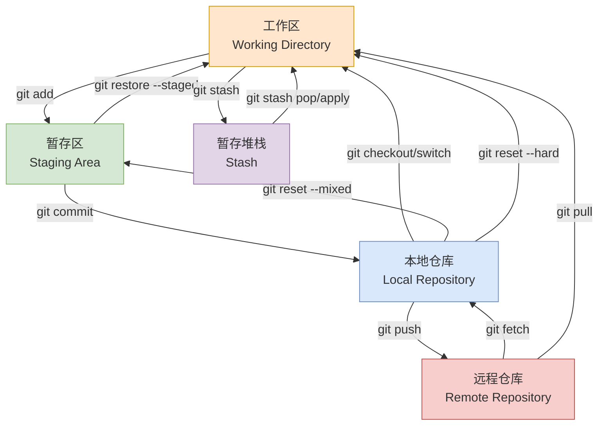
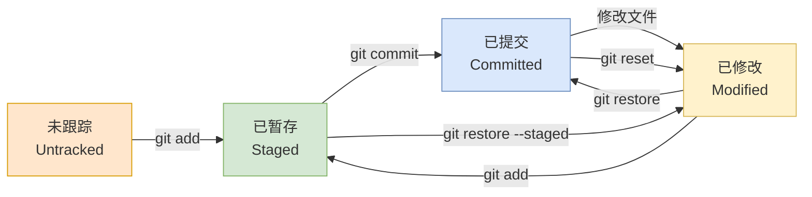
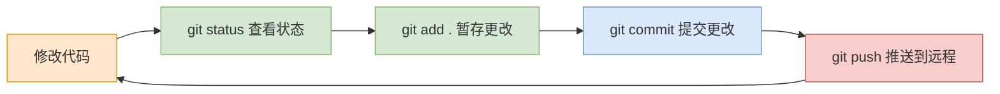
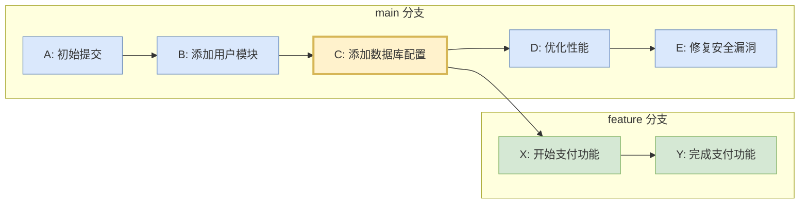
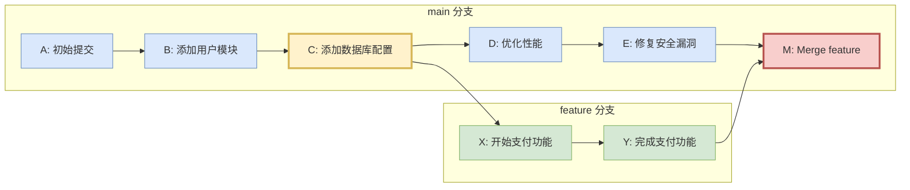
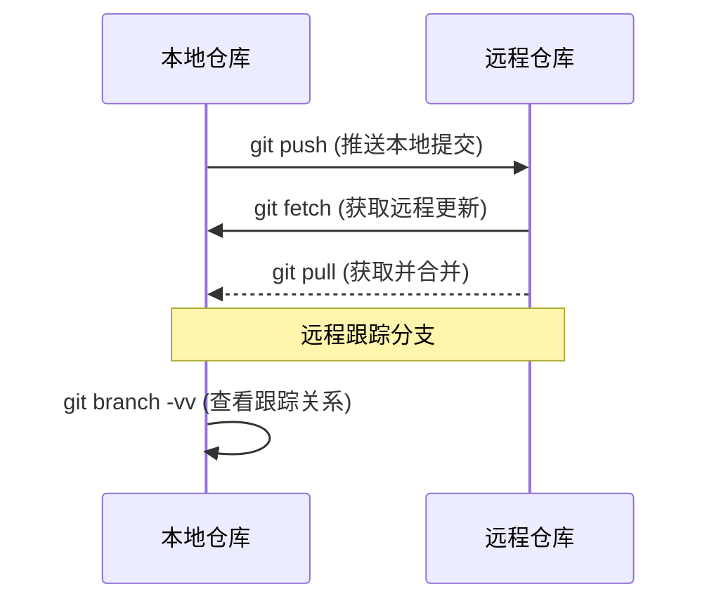
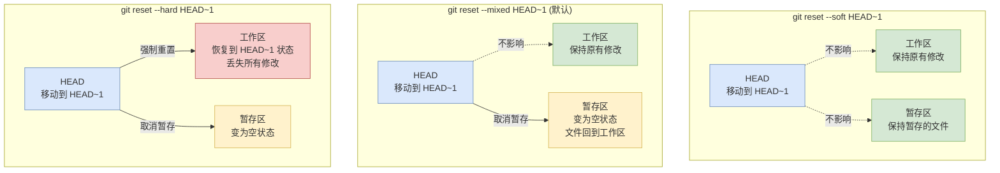
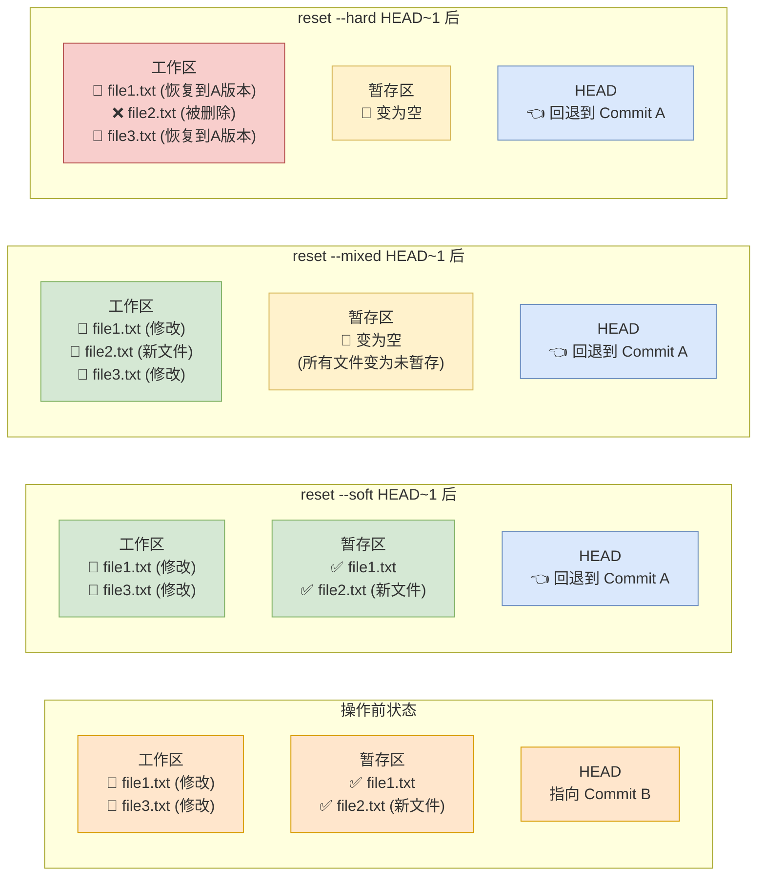
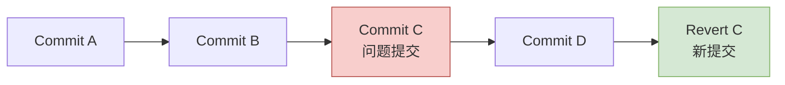
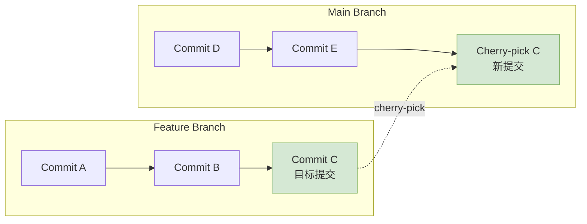

# Git 版本控制系统

> Git 是一个分布式版本控制系统，用于跟踪计算机文件的变化，通常用于软件开发中的源代码管理。

## 🔄 Git 工作原理与核心概念

### Git 工作区域和命令流转图解

::: tip 新手必读
理解Git的工作区域是掌握Git的关键。这张图展示了不同区域之间的关系和如何使用命令在它们之间移动文件。
:::



### Git 工作区域详解

Git 的工作流程涉及五个主要区域，理解这些区域是掌握 Git 的关键：

#### 1. 工作区 (Working Directory) 📂

::: tip 工作区是什么？
工作区就是你在电脑上看到的目录，是你直接编辑代码的地方。它包含了项目的所有文件和文件夹。
:::

- **定义**：你实际编辑文件的目录，包含项目的可见文件
- **特点**：
  - 这里的文件可以被自由编辑、创建、删除
  - 对文件的任何修改都首先发生在工作区
  - 包含 `.git` 隐藏文件夹（如果是 Git 仓库）
- **文件状态**：
  - **已跟踪 (Tracked)**: 已被 Git 管理的文件
  - **未跟踪 (Untracked)**: 新创建但未被 Git 管理的文件
  - **已修改 (Modified)**: 已跟踪但内容有变化的文件

**实际示例**：
```bash
# 查看工作区状态
git status

# 典型输出：
# On branch main
# Changes not staged for commit:
#   modified:   README.md        # 已修改的文件
# 
# Untracked files:
#   new-feature.js              # 未跟踪的新文件
```

#### 2. 暂存区 (Staging Area/Index) 🎯

::: tip 为什么需要暂存区？
暂存区让你可以精确控制下次提交的内容。你可以选择性地添加修改，而不是一次性提交所有更改。
:::

- **定义**：介于工作区和本地仓库之间的中转区域
- **作用**：
  - 准备下一次提交的内容
  - 允许分阶段提交不同的修改
  - 提供"预提交"审查机会
- **特点**：
  - 实际上是一个文件（`.git/index`）
  - 记录了将要提交的文件快照
  - 可以多次修改直到满意
  - 当我们执行 git add 后，会将这些改变的文件內容加入 index 中

**实际示例**：
```bash
# 添加单个文件到暂存区
git add README.md

# 添加所有修改到暂存区
git add .

# 查看暂存区状态
git status
# Changes to be committed:
#   modified:   README.md        # 已暂存的文件

# 从暂存区移除文件（不删除工作区文件）
git restore --staged README.md
```

**暂存区的实际应用场景**：
```bash
# 场景：你修改了多个文件，但只想提交其中一部分

# 1. 查看所有修改
git status
# modified:   feature-a.js
# modified:   feature-b.js
# modified:   config.json

# 2. 只暂存相关的修改
git add feature-a.js config.json

# 3. 查看即将提交的内容
git status
# Changes to be committed:
#   modified:   feature-a.js
#   modified:   config.json
# Changes not staged for commit:
#   modified:   feature-b.js

# 4. 提交暂存的修改
git commit -m "Add feature A and update config"
```

#### 3. 本地仓库 (Local Repository) 💾

::: tip 本地仓库的优势
本地仓库包含完整的项目历史，即使断网也能查看历史、创建分支、进行提交等操作。
:::

- **定义**：存储项目完整历史记录的本地数据库
- **位置**：项目根目录下的 `.git` 文件夹
- **内容**：
  - 所有提交历史
  - 分支和标签信息
  - 配置信息
  - 对象数据库（文件快照）
- **特点**：
  - 完全独立，不依赖网络
  - 包含项目的完整历史
  - 支持离线操作

**本地仓库结构**：
```
.git/
├── HEAD              # 指向当前分支
├── config            # 仓库配置
├── objects/          # 对象数据库（存储所有内容）
├── refs/             # 分支和标签引用
│   ├── heads/        # 本地分支
│   └── remotes/      # 远程分支
├── logs/             # 操作日志文件夹
└── index             # 暂存区文件
```

**实际示例**：
```bash
# 提交到本地仓库
git commit -m "Add new feature"

# 查看本地仓库历史
git log --oneline
# a1b2c3d Add new feature
# e4f5g6h Initial commit

# 查看仓库信息
git show --stat
```

#### 4. 远程仓库 (Remote Repository) 🌐

- **定义**：托管在远程服务器上的项目副本
- **作用**：
  - 多人协作的中心
  - 代码备份和共享
  - 持续集成/部署的源头
- **常见平台**：GitHub、GitLab、Bitbucket、Gitee

**实际示例**：
```bash
# 查看远程仓库
git remote -v
# origin  https://github.com/username/project.git (fetch)
# origin  https://github.com/username/project.git (push)

# 推送到远程仓库
git push origin main

# 从远程仓库拉取
git pull origin main
```

#### 5. 暂存堆栈 (Stash) 📚

- **定义**：临时存储工作区和暂存区更改的区域
- **使用场景**：
  - 需要紧急切换分支处理问题
  - 当前工作未完成但需要拉取最新代码
  - 暂时保存实验性修改

**实际示例**：
```bash
# 暂存当前工作
git stash push -m "Work in progress on feature X"

# 切换分支处理紧急问题
git checkout main
git pull
git checkout -b hotfix/urgent-bug

# 处理完毕后回到原分支
git checkout feature-branch

# 恢复暂存的工作
git stash pop
```

### 文件在各区域间的状态转换



### 实际工作流程示例

让我们通过一个完整的例子来理解这些区域的配合：

```bash
# 1. 在工作区创建新文件
echo "Hello World" > hello.txt
git status
# Untracked files: hello.txt

# 2. 将文件添加到暂存区
git add hello.txt
git status
# Changes to be committed: new file: hello.txt

# 3. 修改工作区文件
echo "Hello Git!" > hello.txt
git status
# Changes to be committed: new file: hello.txt
# Changes not staged for commit: modified: hello.txt

# 4. 提交暂存区内容到本地仓库
git commit -m "Add hello.txt"

# 5. 查看各区域状态
git status
# Changes not staged for commit: modified: hello.txt
```

::: details 深入理解：为什么 Git 要设计这些区域？

**设计理念**：
1. **工作区**：让开发者自由编辑，不受版本控制干扰
2. **暂存区**：提供提交前的缓冲，支持精确的版本控制
3. **本地仓库**：保证开发者能离线工作，拥有完整历史
4. **远程仓库**：实现团队协作和代码共享
5. **暂存堆栈**：解决临时切换上下文的需求

**优势**：
- 🎯 **精确控制**：可以选择性提交修改
- ⚡ **高效协作**：本地操作快速，需要时才同步
- 🔒 **安全可靠**：多层备份，历史完整
- 🔄 **灵活工作流**：支持各种开发模式
:::

### 常见操作对应的区域变化

| 操作 | 影响区域 | 结果 |
|------|----------|------|
| `编辑文件` | 工作区 | 文件状态变为 Modified |
| `git add` | 暂存区 | 文件快照保存到暂存区 |
| `git commit` | 本地仓库 | 创建新的提交对象 |
| `git push` | 远程仓库 | 同步本地提交到远程 |
| `git pull` | 工作区 + 本地仓库 | 获取远程更新并合并 |
| `git stash` | 暂存堆栈 | 临时保存当前修改 |

::: warning 重要提醒
- 只有暂存区的内容才会被提交
- 工作区的修改不会自动进入暂存区
- 本地仓库的提交不会自动推送到远程仓库
:::

## 🚀 新手入门指南

### 安装 Git

::: code-group

```bash [macOS]
# 使用 Homebrew
brew install git

# 使用 Xcode Command Line Tools
xcode-select --install
```

```bash [Ubuntu/Debian]
sudo apt update
sudo apt install git
```

```bash [CentOS/RHEL]
sudo yum install git
# 或者使用 dnf
sudo dnf install git
```

```bash [Windows]
# 下载 Git for Windows
# https://git-scm.com/downloads/win

# 使用 Chocolatey
choco install git

# 使用 Winget
winget install Git.Git
```

:::

### 基础配置

```bash
# 配置用户信息
git config --global user.name "Your Name"
git config --global user.email "your.email@example.com"

# 查看配置
git config --list
```

### 新手必学命令

::: tip 新手提示
这些是日常工作中最常用的Git命令。掌握这些命令，你就能完成基本的版本控制工作。
:::

```bash
# 1. 初始化仓库
git init

# 2. 克隆远程仓库
git clone https://github.com/username/repository.git

# 3. 查看状态
git status

# 4. 添加文件到暂存区
git add filename.txt    # 添加单个文件
git add .               # 添加所有文件

# 5. 提交更改
git commit -m "描述你的更改"

# 6. 查看提交历史
git log --oneline

# 7. 推送到远程仓库
git push

# 8. 从远程仓库拉取更新
git pull

# 9. 创建和切换分支
git branch new-branch   # 创建分支
git checkout new-branch # 切换分支
git checkout -b new-branch # 创建并切换分支

# 10. 合并分支
git merge branch-name
```

### 新手常见工作流程

#### 1. 日常开发流程



#### 2. 分支开发流程

```bash
# 1. 确保主分支是最新的
git checkout main
git pull

# 2. 创建并切换到新功能分支
git checkout -b feature/new-feature

# 3. 开发新功能
# ... 编辑文件 ...
git add .
git commit -m "Add new feature"

# 4. 推送分支到远程仓库
git push -u origin feature/new-feature

# 5. 在GitHub/GitLab上创建Pull Request

# 6. 合并后删除功能分支
git checkout main
git pull
git branch -d feature/new-feature
```

## 📚 基础命令详解

### 仓库初始化

```bash
# 初始化新仓库
git init

# 克隆远程仓库
git clone <repository-url>
git clone https://github.com/username/repository.git

# 克隆到指定目录
git clone <repository-url> <directory-name>
```

### 文件操作

| 命令 | 说明 | 示例 |
|------|------|------|
| `git add` | 添加文件到暂存区 | `git add filename.txt` |
| `git add .` | 添加所有文件到暂存区 | `git add .` |
| `git add -A` | 添加所有变更（包括删除） | `git add -A` |
| `git rm` | 删除文件并暂存删除操作 | `git rm filename.txt` |
| `git mv` | 移动/重命名文件 | `git mv old.txt new.txt` |

### 提交管理

```bash
# 提交暂存区的文件
git commit -m "Add new feature"

# 提交所有已跟踪文件的修改
git commit -am "Update existing files"

# 修改最后一次提交
git commit --amend -m "Updated commit message"

# 显示提交历史
git log
git log --oneline
git log --graph --pretty=format:"%h %s"
```

### 状态查看

```bash
# 查看仓库状态
git status

# 查看文件差异
git diff
git diff --staged
git diff HEAD~1

# 查看提交历史
git log
git log --stat
git log --pretty=oneline
```

## 🌳 分支管理

### 分支基础操作

::: warning 注意
在创建新分支前，确保当前工作目录是干净的（没有未提交的更改）。
:::

```bash
# 查看所有分支
git branch
git branch -a  # 包括远程分支

# 创建新分支
git branch <branch-name>

# 创建并切换到新分支
git checkout -b <branch-name>
# 指定新分支基于当前所在分支的最新提交点创建并切换到新分支
git checkout -b <branch-name> HEAD
# 或使用新命令
git switch -c <branch-name>

# 切换分支
git checkout <branch-name>
# 或使用新命令
git switch <branch-name>

# 删除分支
git branch -d <branch-name>  # 安全删除
git branch -D <branch-name>  # 强制删除
```

### 分支命名规范

| 分支类型 | 命名格式 | 示例 | 说明 |
|---------|----------|------|------|
| 功能分支 | `feature/` | `feature/user-login` | 新功能开发 |
| 修复分支 | `bugfix/` 或 `hotfix/` | `bugfix/login-error` | Bug 修复 |
| 发布分支 | `release/` | `release/v1.2.0` | 发布准备 |
| 开发分支 | `develop` | `develop` | 开发主分支 |

## 🔀 合并与变基

### 合并分支

```bash
# 切换到目标分支
git checkout main

# 合并源分支到当前分支
git merge feature-branch

# 强制创建合并提交
git merge --no-ff feature-branch

# 压缩合并（将多个提交压缩为一个）
git merge --squash feature-branch
git commit -m "Merge feature: description"
```

### 变基操作

```bash
# 变基合并
git checkout feature-branch
git rebase main

# 交互式变基（编辑、合并、删除提交）
git rebase -i HEAD~3
```

::: danger 重要提醒
不要对已经推送到公共仓库的提交进行 rebase 操作！
:::

### Git Merge vs Git Rebase 图解对比

#### 初始状态：两个分支的创建

> [!NOTE] 场景说明
> - **主分支 (main)**：有 5 个提交节点 (A→B→C→D→E)
> - **功能分支 (feature)**：基于 C 创建，有 2 个提交节点 (X→Y)
> - **合入点**：功能分支从 C 分出，所以要合入到 C 之后，而不是最新的 E



#### Git Merge：保留分支历史的合并

> [!NOTE] Git Merge 工作原理
> **Merge** 是 Git 中最常用的分支合并方式。它会保留完整的分支历史，通过创建一个新的"合并提交"来连接两个分支的历史。

**核心特点**：
- 🌿 **保留分支结构**：完整保存功能分支的开发历史
- 🔗 **创建合并提交**：生成一个特殊的提交节点连接两个分支
- 📚 **历史可追溯**：可以清晰看到功能是何时、如何合并的
- ⚡ **操作简单**：一次性解决所有冲突，过程相对简单



**Merge 的工作过程**：

1. **🎯 定位合并基础**：Git 找到两个分支的共同祖先（此例中是 C）
2. **📊 计算变化**：分别计算 main 分支（C→D→E）和 feature 分支（C→X→Y）的变化
3. **🔀 三路合并**：将两个分支的变化合并到一起
4. **📝 创建合并提交**：生成合并提交 M，它有两个父提交：E 和 Y
5. **🎉 合并完成**：main 分支指向新的合并提交 M

**Git Merge 命令序列**：
```bash
# 切换到主分支
git checkout main

# 合并功能分支（创建合并提交）
git merge feature

# 提交历史：A→B→C→D→E→M
#             └→X→Y→┘
```

#### Git Rebase：重写历史的线性合并

> [!WARNING] Git Rebase 工作原理
> **Rebase** 是一种"重写历史"的合并方式。它会将功能分支的提交"重新应用"到目标分支的最新提交之上，创建全新的提交，形成线性的历史记录。

**核心特点**：
- 📏 **线性历史**：所有提交排列在一条直线上，没有分支痕迹
- 🔄 **重写提交**：原始提交被"重放"，生成新的 SHA 哈希值
- 🧹 **整洁美观**：提交历史看起来像是按顺序连续开发的
- ⚠️ **改变历史**：原始的提交历史被修改，存在一定风险


**Rebase 的工作过程**：

1. **📤 保存提交**：Git 临时保存功能分支的提交（X, Y）
2. **🎯 移动分支指针**：将功能分支指针移动到目标分支的最新提交（E）
3. **🔄 重新应用**：逐一"重放"保存的提交，解决可能的冲突
4. **🆕 生成新提交**：创建新的提交 X', Y'（内容相同但 SHA 不同）
5. **📏 形成线性**：最终形成完美的线性提交历史

> [!TIP] Rebase 后的线性历史
> 经过 rebase 操作后，所有提交形成完美的线性序列：A → B → C → D → E → X' → Y'

> [!DANGER] 重要警告：黄金法则
> **永远不要对已经推送到公共仓库的提交进行 rebase！** 这会导致其他开发者的本地仓库出现问题。

**Git Rebase 命令序列**：
```bash
# 切换到功能分支
git checkout feature

# 将功能分支变基到主分支最新提交
git rebase main

# 切换回主分支并快进合并
git checkout main
git merge feature  # 快进合并，无额外合并提交

# 线性提交历史：A→B→C→D→E→X'→Y'
```

#### 核心区别对比

| 特性 | Git Merge | Git Rebase |
|------|-----------|------------|
| **🏗️ 历史结构** | 保留分支结构，有合并点 | 线性历史，无分支痕迹 |
| **🔐 提交 SHA** | 功能分支提交 SHA 不变 | 功能分支提交 SHA 改变 |
| **📝 合并提交** | 创建新的合并提交 | 不创建合并提交 |
| **⚔️ 冲突解决** | 一次性解决所有冲突 | 可能需要逐个提交解决冲突 |
| **📖 历史可读性** | 清晰显示功能开发过程 | 历史整洁，看起来像连续开发 |
| **🎯 适用场景** | 功能完成后的正式合并 | 保持功能分支与主分支同步 |
| **👥 团队协作** | 安全，适合公共分支 | 危险，避免用于公共分支 |
| **🔄 可逆性** | 容易撤销（revert merge） | 困难，需要重置或新分支 |

#### Merge vs Rebase 详细说明

> [!TIP] 选择决策树
> 
> **🤔 何时选择 Merge？**
> - ✅ 功能开发完成，准备正式合并到主分支
> - ✅ 需要保留完整的开发历史和时间线
> - ✅ 多人协作的功能分支
> - ✅ 开源项目的 Pull Request 合并
> - ✅ 不确定时的默认选择（更安全）
> 
> **🤔 何时选择 Rebase？**
> - ✅ 个人开发分支，同步主分支最新代码
> - ✅ 整理本地提交历史，准备推送前清理
> - ✅ 希望保持项目历史的简洁性
> - ✅ 确定没有其他人基于该分支开发
> - ❌ **绝对避免**：已推送的公共分支


**关键概念解释**：

1. **共同祖先 (Common Ancestor)**：C 是两个分支的最后一个共同提交
2. **分支点 (Branch Point)**：功能分支从 C 分出，包含 C 之前的所有历史
3. **合并基础 (Merge Base)**：Git 自动找到 C 作为合并的基础点


## 🌐 远程仓库操作

### 远程仓库管理

```bash
# 查看远程仓库
git remote -v

# 添加远程仓库
git remote add origin https://github.com/username/repo.git

# 修改远程仓库 URL
git remote set-url origin https://github.com/username/new-repo.git

# 删除远程仓库
git remote remove origin
```

### 推送和拉取

```bash
# 推送到远程仓库
git push origin main
git push -u origin main  # 设置上游分支

# 拉取远程更改
git pull origin main
git fetch origin  # 仅获取，不合并

# 推送新分支
git push -u origin feature-branch

# 删除远程分支
git push origin --delete feature-branch
```

### 远程操作图解



## ⚔️ 冲突解决

### 冲突识别

```bash
# 当合并发生冲突时
git merge feature-branch
# Auto-merging file.txt
# CONFLICT (content): Merge conflict in file.txt
# Automatic merge failed; fix conflicts and then commit the result.

# 查看冲突文件
git status
# Unmerged paths:
#   both modified:   file.txt
```

### 冲突标记解释

```txt
<<<<<<< HEAD
当前分支的内容
=======
合并分支的内容
>>>>>>> feature-branch
```

### 冲突解决步骤

1. **打开冲突文件**，查看冲突标记
2. **编辑文件**，保留需要的内容，删除冲突标记
3. **添加解决后的文件**：`git add filename`
4. **完成合并**：`git commit`

::: code-group

```bash [手动解决]
# 1. 编辑冲突文件
vim conflicted-file.txt

# 2. 标记为已解决
git add conflicted-file.txt

# 3. 完成合并
git commit
```

```bash [使用合并工具]
# 配置合并工具
git config --global merge.tool vimdiff

# 启动合并工具
git mergetool

# 完成合并
git commit
```

:::

### 预防冲突的最佳实践

::: tip 避免冲突的技巧
1. **频繁拉取**: 定期从主分支拉取最新代码
2. **小而频繁的提交**: 避免大范围修改
3. **代码格式化**: 统一团队代码风格
4. **功能分离**: 不同功能在不同文件中开发
:::

## 🛠️ 高级操作

### 暂存操作 (Stash)

```bash
# 暂存当前工作
git stash
git stash push -m "Work in progress"

# 查看暂存列表
git stash list

# 应用暂存
git stash apply
git stash apply stash@{0}

# 弹出暂存（应用并删除）
git stash pop

# 删除暂存
git stash drop stash@{0}
git stash clear  # 清空所有暂存
```

### 撤销操作详解

撤销操作是 Git 中最容易出错的部分，理解不同命令的区别和使用场景至关重要。

#### Git Reset vs Git Revert 核心区别

| 特性 | `git reset` | `git revert` |
|------|-------------|--------------|
| **工作原理** | 移动 HEAD 指针，修改历史 | 创建新提交来撤销更改 |
| **历史记录** | 删除/修改已有提交 | 保持完整历史 |
| **安全性** | 危险（可能丢失数据） | 安全（不破坏历史） |
| **适用场景** | 本地开发，未推送的提交 | 已推送的提交，团队协作 |
| **可逆性** | 困难（需要 reflog） | 容易（再次 revert） |

### Git Reset 详解

#### Reset 的三种模式

> [!NOTE] Reset 模式对比
> Git Reset 有三种模式，它们决定了 HEAD 移动后，暂存区和工作区的状态：



#### "清空"和"重置"的具体含义

> [!IMPORTANT] 重要概念澄清
> **工作区和暂存区的"清空"并不是真正的删除，而是状态的改变：**

**🔍 暂存区被"清空"的含义**：
- ❌ **不是**：删除文件或丢失内容
- ✅ **实际是**：取消文件的暂存状态，文件变回 "未暂存"
- 📁 **结果**：`git add` 的效果被撤销，需要重新 `git add`

**🔍 工作区被"重置"的含义**：
- ❌ **不是**：文件夹被清空
- ✅ **实际是**：文件内容恢复到指定提交的状态，比如在某个提交后新增了一个文件，被重制后这个文件就会删除掉
- 💀 **结果**：**所有未提交的修改永久丢失**

#### 具体状态变化示例

```bash
# 假设操作前的状态
git status
# Changes to be committed:
#   modified:   file1.txt    # 已暂存
#   new file:   file2.txt    # 已暂存
# Changes not staged for commit:
#   modified:   file3.txt    # 未暂存
```

::: code-group

```bash [reset --soft 后]
git status
# Changes to be committed:
#   modified:   file1.txt    # ✅ 仍然已暂存
#   new file:   file2.txt    # ✅ 仍然已暂存
# Changes not staged for commit:
#   modified:   file3.txt    # ✅ 仍然未暂存

# 📝 结果：所有文件状态保持不变
```

```bash [reset --mixed 后]
git status
# Changes not staged for commit:
#   modified:   file1.txt    # 🔄 变为未暂存
#   modified:   file2.txt    # 🔄 变为未暂存
#   modified:   file3.txt    # ✅ 仍然未暂存

# 📝 结果：暂存区"清空" = 所有已暂存文件变为未暂存
```

```bash [reset --hard 后]
git status
# nothing to commit, working tree clean

# 📝 结果：
# - file1.txt 内容恢复到 HEAD~1 的状态
# - file2.txt 被删除（因为 HEAD~1 中不存在）
# - file3.txt 内容恢复到 HEAD~1 的状态
# - 💀 所有修改永久丢失！
```

:::

#### Reset 操作前后状态对比



**三种模式详细总结**：

| 模式 | HEAD | 暂存区 | 工作区 | 风险等级 | 具体效果 |
|------|------|--------|---------|----------|----------|
| `--soft` | ✅ 移动 | ❌ 保留状态 | ❌ 保留内容 | 🟢 安全 | 只是"撤销提交"，修改仍在暂存区 |
| `--mixed` | ✅ 移动 | 🔄 变为空 | ❌ 保留内容 | 🟡 中等 | "撤销提交+撤销暂存"，修改回到工作区 |
| `--hard` | ✅ 移动 | 🔄 变为空 | 💀 内容重置 | 🔴 危险 | "撤销一切"，所有修改永久丢失 |

> [!TIP] 记忆技巧和实际含义
> - **soft（软）**：最温和，相当于 `git commit` 的反操作
> - **mixed（混合）**：中等强度，相当于 `git commit` + `git add` 的反操作  
> - **hard（硬）**：最强力，相当于"时光倒流"到指定提交状态

> [!WARNING] 特别注意
> - **暂存区"清空"** = 文件从"已暂存"变为"未暂存"，内容不丢失
> - **工作区"重置"** = 文件内容强制恢复到目标提交状态，修改永久丢失

#### 1. `git reset --soft`
- **影响**：只移动 HEAD，保留暂存区和工作区
- **使用场景**：重新组织提交，修改提交信息

```bash
# 撤销最后一次提交，保留所有修改在暂存区
git reset --soft HEAD~1

# 此时可以重新提交或修改提交信息
git commit -m "新的提交信息"

# 实际应用：合并多个小提交
git reset --soft HEAD~3  # 撤销最近3个提交
git commit -m "feat: 合并功能开发的多个提交"
```

#### 2. `git reset --mixed`（默认）
- **影响**：移动 HEAD，清空暂存区，保留工作区
- **使用场景**：撤销提交和暂存，重新选择要提交的文件

```bash
# 撤销提交，修改回到工作区
git reset HEAD~1
# 等同于
git reset --mixed HEAD~1

# 实际应用：重新组织文件的提交
git reset HEAD~1
git add specific-file.js  # 只添加特定文件
git commit -m "feat: 只提交核心功能"
git add .  # 添加剩余文件
git commit -m "style: 代码格式调整"
```

#### 3. `git reset --hard`
- **影响**：移动 HEAD，清空暂存区和工作区
- **使用场景**：完全放弃某些提交和修改

::: danger 危险操作
`git reset --hard` 会永久删除工作区的修改，使用前请确保已备份重要代码！
:::

```bash
# 完全回退到上一个提交
git reset --hard HEAD~1

# 回退到特定提交
git reset --hard a1b2c3d

# 应急恢复：如果误操作，可以通过 reflog 恢复
git reflog  # 查看操作历史
git reset --hard HEAD@{1}  # 恢复到之前的状态
```

#### Reset 实际使用场景

**场景1：修改最近的提交信息**
```bash
# 修改最后一次提交的信息
git reset --soft HEAD~1
git commit -m "fix: 修正的提交信息"
```

**场景2：拆分一个大提交**
```bash
# 当前提交包含多个不相关的修改
git reset --mixed HEAD~1
git add feature-a.js
git commit -m "feat: 添加功能A"
git add feature-b.js  
git commit -m "feat: 添加功能B"
```

**场景3：放弃本地所有修改**
```bash
# 放弃所有本地修改，回到远程状态
git fetch origin
git reset --hard origin/main
```

### Git Revert 详解

Revert 通过创建新的提交来撤销之前的更改，是最安全的撤销方式。

#### Revert 的工作原理



#### 基础用法

```bash
# 撤销特定提交
git revert <commit-hash>

# 撤销最近的提交
git revert HEAD

# 撤销多个提交（注意顺序）
git revert HEAD~2..HEAD

# 只创建撤销内容，不自动提交
git revert --no-commit <commit-hash>
```

#### 撤销合并提交

合并提交有两个父提交，需要指定撤销哪个方向的合并：

```bash
# 查看合并提交的父提交
git show <merge-commit-hash>

# 撤销合并到主分支的操作（保留主分支，撤销合并进来的分支）
git revert -m 1 <merge-commit-hash>

# 撤销从主分支的更改（保留合并进来的分支，撤销主分支）
git revert -m 2 <merge-commit-hash>
```

#### Revert 实际使用场景

**场景1：撤销已推送的错误提交**
```bash
# 发现昨天的提交有问题，但已经推送并有其他人基于此开发
git log --oneline  # 找到问题提交
# a1b2c3d feat: 有问题的功能
# e4f5g6h fix: 其他修复

git revert a1b2c3d
git push origin main  # 安全推送撤销
```

**场景2：临时撤销功能测试**
```bash
# 临时撤销某个功能进行测试
git revert <feature-commit> --no-commit
# 进行测试...
# 如果测试通过，放弃撤销
git reset --hard HEAD
# 如果需要撤销，完成提交
git commit -m "临时撤销功能进行测试"
```

### Cherry-pick 详解

Cherry-pick 允许你选择性地将其他分支的特定提交应用到当前分支。

#### Cherry-pick 工作原理



#### 基础用法

```bash
# 应用特定提交到当前分支
git cherry-pick <commit-hash>

# 应用多个提交
git cherry-pick <commit1> <commit2> <commit3>

# 应用提交范围（不包括start-commit）
git cherry-pick <start-commit>..<end-commit>

# 应用提交范围（包括start-commit）
git cherry-pick <start-commit>^..<end-commit>

# 只应用更改，不自动提交
git cherry-pick --no-commit <commit-hash>

# 应用时保留原始作者信息
git cherry-pick -x <commit-hash>
```

#### 处理 Cherry-pick 冲突

```bash
# 当 cherry-pick 遇到冲突时
git cherry-pick <commit-hash>
# CONFLICT: 自动合并失败

# 1. 解决冲突
git status  # 查看冲突文件
# 编辑文件解决冲突

# 2. 标记冲突已解决
git add <resolved-files>

# 3. 继续 cherry-pick
git cherry-pick --continue

# 或者放弃这次 cherry-pick
git cherry-pick --abort
```

#### Cherry-pick 实际使用场景

**场景1：热修复从开发分支选择修复**
```bash
# 开发分支有一个重要的bug修复，需要立即应用到主分支
git checkout main
git cherry-pick <bugfix-commit-from-develop>
git push origin main
```

**场景2：功能分支间共享代码**
```bash
# 功能A分支的某个工具函数，功能B分支也需要
git checkout feature/B
git cherry-pick <utility-commit-from-feature-A>
```

**场景3：选择性合并功能**
```bash
# 功能分支有多个提交，只需要其中几个
git checkout main
git cherry-pick <commit1> <commit3> <commit5>
# 跳过不需要的 commit2 和 commit4
```

**场景4：创建发布分支时精选功能**
```bash
# 从开发分支选择稳定的功能创建发布分支
git checkout -b release/v2.0.0 main
git cherry-pick <stable-feature-1>
git cherry-pick <stable-feature-2>
# 跳过还在开发中的不稳定功能
```

### 三种操作的选择指南

#### 何时使用 Reset？
- ✅ 本地开发，提交未推送
- ✅ 需要修改提交历史
- ✅ 重新组织提交
- ❌ 已推送的提交
- ❌ 团队协作的分支

#### 何时使用 Revert？
- ✅ 已推送的提交
- ✅ 团队协作环境
- ✅ 需要保留完整历史
- ✅ 生产环境的回滚
- ❌ 本地临时修改

#### 何时使用 Cherry-pick？
- ✅ 选择性应用特定提交
- ✅ 跨分支共享代码
- ✅ 热修复快速应用
- ✅ 创建发布分支
- ❌ 大量连续提交的合并

::: tip 最佳实践
1. **本地开发**：优先使用 `reset`
2. **团队协作**：优先使用 `revert`
3. **跨分支操作**：使用 `cherry-pick`
4. **操作前备份**：重要操作前先创建备份分支
5. **理解后果**：每个操作都有不同的影响，使用前要明确后果
:::

## 💼 工作中常见场景示例

### Reset 工作场景详解

#### 场景 1：代码审查前整理提交历史 📝

> [!TIP] 场景描述
> 在功能开发过程中，你创建了许多小的、琐碎的提交。在提交 Pull Request 前，需要整理成更有意义的提交。

::: code-group

```bash [问题现状]
# 查看当前提交历史
git log --oneline
# a1b2c3d fix typo
# e4f5g6h add console.log for debugging
# h7i8j9k implement user validation
# k0l1m2n add user service
# n3o4p5q feat: start user feature
```

```bash [解决方案]
# 使用 soft reset 合并最近5个提交
git reset --soft HEAD~5

# 查看状态 - 所有修改都在暂存区
git status
# Changes to be committed:
#   new file:   src/user-service.js
#   new file:   src/user-validation.js
#   modified:   src/app.js

# 重新提交为一个清晰的提交
git commit -m "feat: implement user authentication system

- Add user service for registration and login
- Add input validation for user data
- Integrate user auth with main application"
```

:::

**适用参数**：
- `--soft`：保留所有修改在暂存区
- `HEAD~n`：回退到前 n 个提交

#### 场景 2：撤销错误的合并提交 🔄

> [!WARNING] 场景描述
> 意外合并了一个还在开发中的分支到主分支，需要撤销这次合并。

```bash
# 查看提交历史，找到合并提交
git log --oneline --graph
# * a1b2c3d Merge branch 'feature/incomplete'
# |\
# | * e4f5g6h WIP: incomplete feature
# |/
# * h7i8j9k stable commit

# 撤销合并提交（硬重置到合并前）
git reset --hard HEAD~1

# 如果已经推送，需要强制推送（危险操作）
git push --force-with-lease origin main
```

**注意事项**：
- ⚠️ 只在确定没有其他人基于该合并提交开发时使用
- 📋 使用 `--force-with-lease` 比 `--force` 更安全
- 🔒 团队协作中优先考虑使用 `revert`

#### 场景 3：清理工作区和暂存区 🧹

```bash
# 彻底清理所有未提交的修改
git reset --hard HEAD

# 同时清理未跟踪的文件
git clean -fd

# 重置到远程分支状态
git fetch origin
git reset --hard origin/main
```

### Revert 工作场景详解

#### 场景 1：生产环境紧急回滚 🚨

> [!IMPORTANT] 场景描述
> 刚发布的新功能在生产环境出现严重 bug，需要立即回滚，但不能影响其他已发布的功能。

::: code-group

```bash [识别问题提交]
# 查看最近的提交
git log --oneline -10
# a1b2c3d feat: add new payment gateway (有问题)
# e4f5g6h fix: resolve UI alignment issue
# h7i8j9k feat: improve error handling
# k0l1m2n fix: update dependency versions

# 确认问题提交的详细信息
git show a1b2c3d
```

```bash [安全回滚]
# 撤销问题提交，创建新的回滚提交
git revert a1b2c3d

# Git 会打开编辑器让你修改提交信息
# 建议的提交信息：
# Revert "feat: add new payment gateway"
# 
# This reverts commit a1b2c3d due to critical bug in production
# that causes payment failures. Will be re-implemented after fixing.
#
# Fixes: #issue-number

# 立即部署回滚
git push origin main
```

:::

**关键优势**：
- ✅ 保持完整的历史记录
- ✅ 其他开发者的工作不受影响
- ✅ 可以轻松再次撤销回滚（revert the revert）

#### 场景 2：撤销合并提交 🔀

> [!NOTE] 场景描述
> 一个功能分支被合并到主分支后发现问题，需要撤销整个合并。

```bash
# 查看合并提交
git log --oneline --merges -5
# a1b2c3d Merge pull request #123 from feature/user-dashboard

# 查看合并提交的详细信息
git show a1b2c3d
# commit a1b2c3d (HEAD -> main)
# Merge: h7i8j9k e4f5g6h
# Author: Developer <dev@example.com>

# 撤销合并提交（-m 1 表示保留主分支，撤销合并进来的分支）
git revert -m 1 a1b2c3d

# 如果要撤销主分支保留功能分支，使用 -m 2
# git revert -m 2 a1b2c3d
```

#### 场景 3：部分撤销功能测试 🧪

```bash
# 临时撤销某个功能进行A/B测试
git revert --no-commit <feature-commit>

# 修改部分文件，只撤销功能的某些部分
git checkout HEAD -- src/feature-a-part.js

# 提交部分撤销
git commit -m "test: temporarily disable feature B for A/B testing"

# 测试完成后，撤销这个临时撤销
git revert HEAD
```

### Rebase 工作场景详解

> [!DANGER] 重要警告
> **永远不要对已经推送到公共仓库的提交进行 rebase！** 这会改变历史，导致其他开发者的代码出现问题。

#### 场景 1：功能分支保持最新 🔄

> [!TIP] 场景描述
> 在长期的功能开发过程中，主分支有了新的提交。需要将功能分支更新到最新状态。

::: code-group

```bash [传统合并方式]
# 传统方式：会产生额外的合并提交
git checkout feature/user-profile
git merge main

# 提交历史会变成：
# * a1b2c3d Merge branch 'main' into feature/user-profile
# |\
# | * e4f5g6h main的新提交
# * | h7i8j9k feature的提交
# |/
# * k0l1m2n 共同祖先
```

```bash [使用 rebase]
# 使用 rebase：保持线性历史
git checkout feature/user-profile
git rebase main

# 提交历史变成：
# * a1b2c3d feature的提交 (重新应用到main最新提交之后)
# * e4f5g6h main的新提交
# * k0l1m2n 原来的基础提交
```

:::

**适用参数**：
- `git rebase main`：将当前分支重新基于 main 分支
- `git rebase -i main`：交互式 rebase，可以编辑提交

#### 场景 2：交互式历史编辑 ✏️

> [!NOTE] 场景描述
> 在提交 Pull Request 前，需要清理提交历史：合并相关提交、修改提交信息、重新排序提交。

```bash
# 交互式 rebase 最近5个提交
git rebase -i HEAD~5

# Git 会打开编辑器显示：
# pick a1b2c3d feat: add user model
# pick e4f5g6h fix: typo in user model
# pick h7i8j9k feat: add user controller  
# pick k0l1m2n fix: handle edge case
# pick n3o4p5q docs: update API documentation

# 编辑命令：
# pick a1b2c3d feat: add user model
# squash e4f5g6h fix: typo in user model  # 合并到上一个提交
# pick h7i8j9k feat: add user controller
# squash k0l1m2n fix: handle edge case    # 合并到上一个提交
# reword n3o4p5q docs: update API documentation  # 修改提交信息
```

**可用命令**：

| 命令 | 说明 | 用途 |
|------|------|------|
| `pick` | 使用提交 | 保持提交不变 |
| `reword` | 使用提交，但修改提交信息 | 改善提交信息 |
| `edit` | 使用提交，但停下来修改 | 分割提交或修改内容 |
| `squash` | 使用提交，但合并到前一个提交 | 合并相关提交 |
| `fixup` | 类似 squash，但丢弃提交信息 | 修复性提交合并 |
| `drop` | 移除提交 | 删除不需要的提交 |

#### 场景 3：解决 rebase 冲突 ⚔️

```bash
# 开始 rebase
git rebase main

# 遇到冲突时会停止
# CONFLICT (content): Merge conflict in src/app.js
# error: could not apply a1b2c3d... feat: add new feature

# 1. 查看冲突状态
git status
# rebase in progress; onto e4f5g6h
# You are currently rebasing branch 'feature' on 'e4f5g6h'.
#   (fix conflicts and run "git rebase --continue")

# 2. 解决冲突文件
git diff  # 查看冲突
# 编辑冲突文件，解决冲突标记

# 3. 标记冲突已解决
git add src/app.js

# 4. 继续 rebase
git rebase --continue

# 如果想放弃 rebase
# git rebase --abort
```

### Rebase vs Merge 选择指南

> [!NOTE] 什么时候使用 Rebase？
> - ✅ **功能分支开发**：保持功能分支与主分支同步
> - ✅ **本地历史整理**：清理本地提交历史
> - ✅ **线性历史偏好**：团队偏好线性的提交历史
> - ❌ **公共分支**：已推送的分支
> - ❌ **团队协作分支**：多人同时开发的分支

> [!TIP] 什么时候使用 Merge？
> - ✅ **功能完成合并**：将完成的功能合并到主分支
> - ✅ **保留分支历史**：需要明确显示分支的合并点
> - ✅ **公共分支操作**：对已推送的分支进行操作
> - ✅ **团队协作**：多人开发的分支合并

### 工作中的最佳实践组合 🏆

#### 完整的功能开发流程

::: code-group

```bash [1. 开始功能开发]
# 基于最新主分支创建功能分支
git checkout main
git pull origin main
git checkout -b feature/user-authentication

# 开发过程中频繁小提交
git add .
git commit -m "wip: add login form"
git commit -m "wip: add validation"
git commit -m "fix: handle edge case"
```

```bash [2. 保持分支最新]
# 定期 rebase 主分支（如果分支未推送）
git fetch origin
git rebase origin/main

# 如果已推送且其他人也在开发，使用 merge
git merge origin/main
```

```bash [3. 准备合并前的清理]
# 使用交互式 rebase 整理提交历史
git rebase -i HEAD~5

# 将多个 wip 提交合并为有意义的提交
# pick -> squash -> 修改提交信息
```

```bash [4. 合并到主分支]
# 切换到主分支
git checkout main
git pull origin main

# 合并功能分支
git merge --no-ff feature/user-authentication
git push origin main

# 删除功能分支
git branch -d feature/user-authentication
git push origin --delete feature/user-authentication
```

:::

#### 生产问题紧急处理

```bash
# 1. 立即创建热修复分支
git checkout main
git pull origin main
git checkout -b hotfix/critical-bug

# 2. 快速修复
# ... 修复代码 ...
git add .
git commit -m "hotfix: resolve critical payment bug"

# 3. 合并到主分支
git checkout main
git merge hotfix/critical-bug
git push origin main

# 4. 如果问题严重，回滚之前的版本
git revert <problematic-commit> --no-edit
git push origin main
```

### 重要注意事项和陷阱 ⚠️

#### Reset 注意事项

> [!DANGER] 数据丢失风险
> - `git reset --hard` 会永久删除工作区修改
> - 操作前使用 `git stash` 或创建备份分支
> - 可以通过 `git reflog` 恢复丢失的提交

```bash
# 安全的 reset 操作流程
git stash push -m "backup before reset"  # 备份工作区
git reset --hard HEAD~1                  # 执行 reset
git stash pop                            # 如需恢复工作区
```

#### Revert 注意事项

> [!WARNING] 合并提交的复杂性
> - 撤销合并提交需要指定 `-m` 参数
> - 错误的 `-m` 参数会撤销错误的一侧
> - 撤销合并后，原分支再次合并需要先撤销 revert

```bash
# 撤销合并提交后，如何重新合并原分支
git revert <revert-commit>  # 撤销之前的 revert
git merge feature-branch    # 重新合并功能分支
```

#### Rebase 注意事项

> [!DANGER] 改写历史的风险
> - 永远不要 rebase 已推送的公共分支
> - Rebase 会改变提交的 SHA，影响其他开发者
> - 团队需要统一 rebase 的使用规则

```bash
# 如果误操作了公共分支的 rebase
git reset --hard ORIG_HEAD   # 撤销 rebase
git reflog                    # 查看操作历史
git reset --hard HEAD@{1}    # 根据 reflog 恢复
```

#### 通用恢复策略

```bash
# 万能的恢复方法：reflog
git reflog                    # 查看所有操作历史
git reset --hard HEAD@{n}    # 恢复到特定操作前的状态

# 创建恢复分支（不破坏当前状态）
git branch recovery-branch HEAD@{n}
git checkout recovery-branch
```

## 🏷️ 标签管理

### 创建标签

```bash
# 创建轻量标签
git tag v1.0.0

# 创建附注标签
git tag -a v1.0.0 -m "Release version 1.0.0"

# 为特定提交创建标签
git tag -a v1.0.0 <commit-hash> -m "Release version 1.0.0"
```

### 标签操作

```bash
# 查看所有标签
git tag
git tag -l "v1.*"

# 查看标签信息
git show v1.0.0

# 推送标签
git push origin v1.0.0
git push origin --tags

# 删除标签
git tag -d v1.0.0
git push origin :refs/tags/v1.0.0
```

## 🌐 远程仓库

### 远程仓库管理

```bash
# 查看远程仓库
git remote -v

# 添加远程仓库
git remote add origin https://github.com/username/repo.git

# 修改远程仓库 URL
git remote set-url origin https://github.com/username/new-repo.git

# 删除远程仓库
git remote remove origin
```

### 推送和拉取

```bash
# 推送到远程仓库
git push origin main
git push -u origin main  # 设置上游分支

# 拉取远程更改
git pull origin main
git fetch origin  # 仅获取，不合并

# 推送新分支
git push -u origin feature-branch

# 删除远程分支
git push origin --delete feature-branch
```

## 🚨 实际工作问题解决方案

### 问题 1：紧急切换分支不想提交代码

#### 场景 1：临时存储已修改的代码 📦

> [!TIP] 问题描述
> 正在分支 A 上开发某个功能，还未完成，突然要切换到 B 分支上去修复一个 bug。这时候该怎么办？

::: code-group

```bash [方法1: 使用 Git Stash (推荐)]
# 当前在分支 A，有未完成的修改
git status
# modified:   src/feature-a.js
# modified:   src/utils.js

# 1. 暂存当前所有修改
git stash push -m "WIP: feature A development"

# 2. 切换到 B 分支修复 bug
git checkout branch-b
# 或者创建新的修复分支
git checkout -b hotfix/urgent-bug

# 3. 修复 bug 并提交
git add .
git commit -m "fix: resolve urgent bug"
git push origin hotfix/urgent-bug

# 4. 切换回分支 A 继续开发
git checkout branch-a

# 5. 恢复之前暂存的修改
git stash pop
# 或者使用 git stash apply 保留 stash 记录
```

```bash [方法2: 临时提交后撤销]
# 1. 临时提交当前修改
git add .
git commit -m "WIP: temporary commit for branch switch"

# 2. 切换分支处理紧急事务
git checkout branch-b
# ... 处理 bug ...

# 3. 回到原分支，撤销临时提交
git checkout branch-a
git reset --soft HEAD~1
# 现在修改回到了暂存区

# 或者完全撤销提交和暂存
git reset --mixed HEAD~1
# 现在修改回到了工作区
```

:::

**Stash 高级用法**：

```bash
# 查看所有 stash
git stash list
# stash@{0}: On branch-a: WIP: feature A development
# stash@{1}: On branch-a: WIP: previous work

# 查看特定 stash 的内容
git stash show -p stash@{0}

# 应用特定的 stash
git stash apply stash@{0}

# 删除特定的 stash
git stash drop stash@{0}

# 清空所有 stash
git stash clear

# 只暂存已跟踪的文件
git stash push -m "only tracked files" --keep-index

# 包含未跟踪的文件
git stash push -m "include untracked" -u
```

#### 场景 2：代码写错分支了 🔄

> [!WARNING] 问题描述
> 由于不小心，本来要在 A 分支上开发的功能代码，却写在了 B 分支上，这种情况又该怎么办？

::: code-group

```bash [情况1: 代码还没提交]
# 当前在分支 B，但代码应该在分支 A
git status
# modified:   src/feature-for-branch-a.js

# 1. 暂存当前修改
git stash push -m "code for branch A"

# 2. 切换到正确的分支 A
git checkout branch-a

# 3. 应用暂存的修改
git stash pop

# 4. 在正确的分支上提交
git add .
git commit -m "feat: implement feature A"
```

```bash [情况2: 代码已经提交]
# 查看错误提交的详情
git log --oneline -3
# a1b2c3d feat: implement feature A (这个提交在错误的分支)
# e4f5g6h previous commit
# h7i8j9k another commit

# 方法1: 使用 cherry-pick 转移提交
# 1. 切换到正确的分支 A
git checkout branch-a

# 2. 将错误分支的提交应用到当前分支
git cherry-pick a1b2c3d

# 3. 回到分支 B，删除错误的提交
git checkout branch-b
git reset --hard HEAD~1  # 删除最后一个提交

# 方法2: 使用 format-patch 和 apply
# 1. 创建补丁文件
git format-patch HEAD~1  # 创建最后一个提交的补丁
# 生成: 0001-feat-implement-feature-A.patch

# 2. 切换到正确分支并应用补丁
git checkout branch-a
git apply 0001-feat-implement-feature-A.patch
git add .
git commit -m "feat: implement feature A"

# 3. 删除补丁文件和错误分支的提交
rm 0001-feat-implement-feature-A.patch
git checkout branch-b
git reset --hard HEAD~1
```

:::

### 问题 2：将多个 commit 压缩成一个 🗜️

> [!NOTE] 问题描述
> 开发过程中创建了多个小的提交，现在想要将它们合并成一个有意义的提交。

::: code-group

```bash [方法1: 交互式 Rebase (推荐)]
# 查看最近的提交历史
git log --oneline -5
# a1b2c3d docs: update README
# e4f5g6h fix: handle edge case
# h7i8j9k feat: add validation
# k0l1m2n feat: add user input
# n3o4p5q feat: start user feature

# 压缩最近 4 个提交
git rebase -i HEAD~4

# Git 编辑器会显示：
# pick k0l1m2n feat: start user feature
# pick h7i8j9k feat: add user input  
# pick e4f5g6h feat: add validation
# pick a1b2c3d fix: handle edge case

# 修改为：
# pick k0l1m2n feat: start user feature
# squash h7i8j9k feat: add user input
# squash e4f5g6h feat: add validation  
# squash a1b2c3d fix: handle edge case

# 保存后会提示修改最终的提交信息
```

```bash [方法2: Soft Reset 重新提交]
# 软重置到要合并的提交之前
git reset --soft HEAD~4

# 查看状态 - 所有修改都在暂存区
git status
# Changes to be committed:
#   modified:   src/user.js
#   new file:   src/validation.js
#   modified:   README.md

# 重新提交为一个提交
git commit -m "feat: implement complete user management system

- Add user input handling
- Add comprehensive validation
- Handle edge cases for user data
- Update documentation"
```

```bash [方法3: 使用 --fixup 和 --autosquash]
# 在开发过程中为修复提交标记
git commit --fixup <target-commit-hash>

# 使用 autosquash 自动重排
git rebase -i --autosquash <target-commit-hash>~1
```

:::

**压缩提交的最佳实践**：

```bash
# 压缩前备份分支
git branch backup-before-squash

# 检查要压缩的提交范围
git log --oneline --graph HEAD~5..HEAD

# 验证压缩结果
git show HEAD  # 查看合并后的提交
git diff HEAD~1  # 查看变更内容
```

### 问题 3：不同分支的代码摘取 🍒

> [!TIP] 问题描述
> 需要将其他分支的特定提交或功能应用到当前分支，而不是合并整个分支。

::: code-group

```bash [摘取单个提交]
# 查看源分支的提交
git log --oneline feature/payment
# a1b2c3d feat: add payment validation (需要这个)
# e4f5g6h feat: add payment UI
# h7i8j9k feat: payment integration
# k0l1m2n refactor: payment utils (需要这个)

# 切换到目标分支
git checkout main

# 摘取特定提交
git cherry-pick a1b2c3d
git cherry-pick k0l1m2n

# 摘取提交范围 (不包括 start)
git cherry-pick e4f5g6h..a1b2c3d

# 摘取提交范围 (包括 start)
git cherry-pick e4f5g6h^..a1b2c3d
```

```bash [摘取文件级别的更改]
# 只要某个分支的特定文件
git checkout feature/payment -- src/utils/payment.js

# 或者从特定提交中摘取文件
git checkout a1b2c3d -- src/utils/validation.js

# 暂存并提交摘取的文件
git add .
git commit -m "feat: cherry-pick payment utilities from feature branch"
```

```bash [处理摘取冲突]
# 摘取时遇到冲突
git cherry-pick a1b2c3d
# CONFLICT (content): Merge conflict in src/payment.js

# 解决冲突
git status
# You are currently cherry-picking commit a1b2c3d.
#   (fix conflicts and run "git cherry-pick --continue")

# 编辑冲突文件，解决冲突
vim src/payment.js

# 标记冲突已解决
git add src/payment.js

# 继续摘取
git cherry-pick --continue

# 或者放弃这次摘取
# git cherry-pick --abort
```

:::

**高级摘取技巧**：

```bash
# 摘取但不自动提交 (可以修改后再提交)
git cherry-pick --no-commit a1b2c3d

# 摘取时保留原始作者信息和提交信息
git cherry-pick -x a1b2c3d

# 摘取合并提交的某一侧
git cherry-pick -m 1 <merge-commit>

# 批量摘取多个不连续的提交
git cherry-pick a1b2c3d e4f5g6h k0l1m2n
```

### 问题 4：已 push 到远程的代码回退 ↩️

> [!DANGER] 问题描述
> 代码已经推送到远程仓库，但发现有问题需要回退。这是最危险的操作，需要根据不同情况选择不同策略。

#### 情况 1：个人分支或确认无人使用 🔒

::: code-group

```bash [强制回退 (危险)]
# 查看提交历史
git log --oneline
# a1b2c3d problematic commit (要删除的)
# e4f5g6h good commit
# h7i8j9k another good commit

# 硬重置到指定提交
git reset --hard e4f5g6h

# 强制推送 (会覆盖远程历史)
git push --force-with-lease origin branch-name

# 或者使用更安全的强制推送
git push --force-with-lease origin branch-name
```

```bash [创建新分支替换 (安全)]
# 基于正确的提交创建新分支
git checkout e4f5g6h
git checkout -b branch-name-fixed

# 推送新分支
git push origin branch-name-fixed

# 在远程仓库管理界面:
# 1. 将默认分支改为 branch-name-fixed
# 2. 删除原来的 branch-name
# 3. 将 branch-name-fixed 重命名为 branch-name
```

:::

#### 情况 2：共享分支或团队协作 👥

::: code-group

```bash [使用 Revert (推荐)]
# 撤销指定的提交，创建新的撤销提交
git revert a1b2c3d

# 如果要撤销多个提交
git revert --no-commit a1b2c3d
git revert --no-commit e4f5g6h
git commit -m "Revert problematic changes"

# 推送撤销提交
git push origin main
```

```bash [撤销合并提交]
# 查看合并提交
git show a1b2c3d
# commit a1b2c3d (HEAD -> main)
# Merge: e4f5g6h h7i8j9k
# Author: Developer <dev@example.com>

# 撤销合并 (-m 1 保留主分支，撤销合并进来的分支)
git revert -m 1 a1b2c3d
git push origin main
```

```bash [回退到特定版本并继续开发]
# 创建修复分支
git checkout a1b2c3d  # 回到问题提交之前
git checkout -b fix/revert-changes

# 手动修复问题
# ... 编辑文件 ...

# 提交修复
git add .
git commit -m "fix: resolve issues in previous commits"

# 合并修复分支
git checkout main
git merge fix/revert-changes
git push origin main
```

:::

#### 情况 3：生产环境紧急回滚 🚨

```bash
# 立即回滚到上一个稳定版本
git checkout main
git pull origin main

# 创建紧急回滚提交
git revert --no-edit HEAD  # 回滚最新提交
git push origin main

# 或者回滚到特定的稳定标签
git checkout v1.2.0  # 切换到稳定版本
git checkout -b hotfix/emergency-rollback
git push origin hotfix/emergency-rollback

# 通过快速 PR 合并紧急修复
```

### 预防措施和最佳实践 🛡️

> [!TIP] 避免问题的最佳实践
> 1. **频繁提交小更改**：避免大量修改堆积
> 2. **使用功能分支**：隔离开发风险  
> 3. **定期同步主分支**：减少冲突可能
> 4. **代码审查流程**：发现问题在合并前
> 5. **自动化测试**：确保代码质量

```bash
# 安全操作的通用流程
# 1. 操作前创建备份
git branch backup-$(date +%Y%m%d-%H%M%S)

# 2. 使用 --dry-run 预览操作结果
git merge --no-commit --no-ff feature-branch

# 3. 重要操作后验证结果
git log --oneline -10
git diff HEAD~1

# 4. 团队协作前确认
git fetch origin
git status  # 确保本地干净
git log origin/main..HEAD  # 查看本地超前的提交
```

## 📝 提交规范和最佳实践

### 提交信息规范

使用 [Conventional Commits](https://www.conventionalcommits.org/) 规范：

```
<type>[optional scope]: <description>

[optional body]

[optional footer(s)]
```

#### 提交类型

| 类型 | 说明 | 示例 |
|------|------|------|
| `feat` | 新功能 | `feat: add user authentication` |
| `fix` | Bug 修复 | `fix: resolve login error` |
| `docs` | 文档更新 | `docs: update API documentation` |
| `style` | 代码格式修改 | `style: fix indentation` |
| `refactor` | 重构代码 | `refactor: optimize user service` |
| `perf` | 性能优化 | `perf: improve database queries` |
| `test` | 测试相关 | `test: add unit tests for auth` |
| `chore` | 构建过程或辅助工具的变动 | `chore: update dependencies` |

### 分支命名规范

```bash
# 功能分支
feature/user-authentication
feature/payment-integration

# 修复分支
bugfix/login-error
hotfix/security-patch

# 发布分支
release/v1.2.0
release/2023-q4

# 个人分支
username/feature-name
```

### 常用 Git 配置

```bash
# 设置用户信息
git config --global user.name "Your Name"
git config --global user.email "your.email@example.com"

# 设置默认编辑器
git config --global core.editor "code --wait"

# 设置默认分支名
git config --global init.defaultBranch main

# 启用颜色输出
git config --global color.ui auto

# 设置实用别名
git config --global alias.st status
git config --global alias.co checkout
git config --global alias.br branch
git config --global alias.ci commit
git config --global alias.lg "log --oneline --graph --decorate"

# 设置推送策略
git config --global push.default simple
```

## 🆘 问题排查和恢复

### 数据恢复

> [!TIP] Git Reflog - 万能的恢复工具
> `git reflog` 记录了所有 HEAD 的变化，是恢复丢失提交的最佳工具。

```bash
# 查看所有操作历史
git reflog

# 示例输出：
# a1b2c3d HEAD@{0}: commit: add new feature
# e4f5g6h HEAD@{1}: reset: moving to HEAD~1
# h7i8j9k HEAD@{2}: commit: fix bug

# 恢复到特定状态
git reset --hard HEAD@{2}

# 或者基于丢失的提交创建新分支
git checkout h7i8j9k
git checkout -b recovered-branch
```

### 常见错误处理

#### 误删分支恢复

```bash
# 查找被删除分支的最后提交
git reflog | grep "branch-name"

# 基于找到的提交重新创建分支
git checkout -b branch-name <commit-hash>
```

#### 冲突解决最佳实践

```bash
# 1. 暂停合并，检查冲突状态
git status

# 2. 使用工具查看冲突
git diff
git mergetool  # 如果配置了合并工具

# 3. 手动解决冲突后
git add <resolved-files>
git commit  # 或 git merge --continue / git rebase --continue
```

#### 大文件处理

> [!WARNING] 仓库体积问题
> 对于大文件（>100MB），建议使用 Git LFS，避免直接提交到仓库。

```bash
# 安装和配置 Git LFS
git lfs install

# 跟踪大文件类型
git lfs track "*.zip"
git lfs track "*.mp4"
git lfs track "*.psd"

# 将 .gitattributes 也提交
git add .gitattributes
git commit -m "chore: configure Git LFS for large files"

# 查看 LFS 跟踪状态
git lfs ls-files
```

## 📚 参考资源

- [Git 官方文档](https://git-scm.com/doc) - 最权威的 Git 文档
- [Pro Git 书籍](https://git-scm.com/book) - 免费的 Git 电子书
- [Git 可视化学习](https://learngitbranching.js.org/) - 交互式 Git 学习
- [GitHub Git 手册](https://guides.github.com/) - GitHub 官方指南
- [Atlassian Git 教程](https://www.atlassian.com/git/tutorials) - 详细的 Git 教程

---

> 💡 **提示**: Git 是一个强大的工具，掌握基础命令后，可以逐步学习高级功能。记住，多练习是掌握 Git 的最好方法！ 