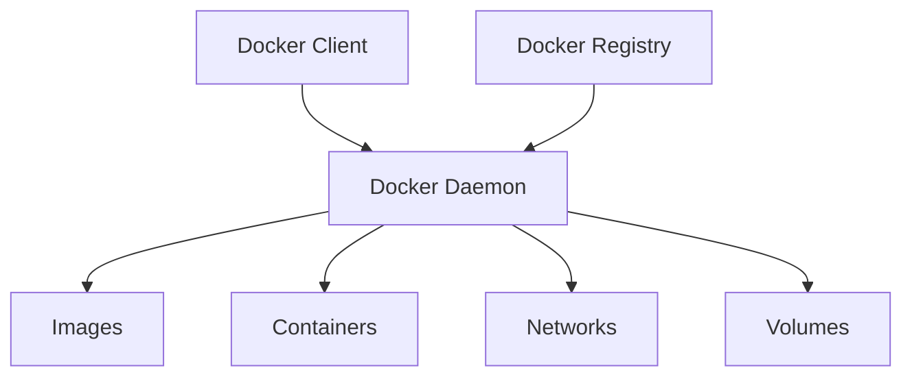

# 🐳 Docker 完整指南

::: info 📖 文档说明
本文档将详细介绍 Docker 的基础概念、安装配置、核心命令、Dockerfile 编写、Docker Compose 使用以及最佳实践。
:::

## 🎯 什么是 Docker

Docker 是一个开源的容器化平台，它允许开发者将应用程序及其依赖项打包到轻量级、可移植的容器中，然后可以在任何支持 Docker 的环境中运行。

### 🏗️ Docker 架构

Docker 采用客户端-服务器架构，主要包含以下组件：



#### 🔧 核心组件

| 组件 | 描述 | 作用 |
|------|------|------|
| 🖥️ **Docker Client** | 用户与 Docker 交互的主要方式 | 发送命令到 Docker Daemon |
| ⚙️ **Docker Daemon** | Docker 的后台服务 | 管理 Docker 对象（镜像、容器、网络、卷） |
| 📦 **Docker Images** | 只读模板 | 用于创建 Docker 容器 |
| 🏃 **Docker Containers** | 镜像的运行实例 | 应用程序的实际运行环境 |
| 🌐 **Docker Registry** | 存储 Docker 镜像的服务 | 如 Docker Hub、私有仓库 |

### 🎨 核心概念

#### 📦 镜像 (Images)

Docker 镜像是一个只读的模板，包含了运行应用程序所需的所有内容：

- 📋 **代码**：应用程序源代码
- 🔧 **运行时**：如 Node.js、Python 等
- 📚 **库文件**：应用程序依赖
- 🔨 **工具**：系统工具和实用程序
- ⚙️ **配置文件**：环境配置

::: tip 💡 镜像特点
- **分层存储**：镜像由多个层组成，每层代表一个指令
- **只读性**：镜像创建后不可修改
- **可复用**：多个容器可以共享同一个镜像
:::

#### 🏃 容器 (Containers)

容器是镜像的运行实例，具有以下特点：

- 🚀 **轻量级**：共享主机内核，启动快速
- 🔒 **隔离性**：进程、网络、文件系统隔离
- 📱 **可移植**：在任何支持 Docker 的环境中运行
- 🔄 **可变性**：可以修改、停止、删除

#### 🏪 仓库 (Registry)

Docker 仓库是存储和分发镜像的服务：

- 🌍 **Docker Hub**：官方公共仓库
- 🏢 **私有仓库**：企业内部使用
- ☁️ **云服务**：AWS ECR、Azure ACR 等

### 🆚 Docker vs 虚拟机

| 特性 | 🐳 Docker 容器 | 💻 虚拟机 |
|------|----------------|-----------|
| **资源占用** | 轻量级，MB 级别 | 重量级，GB 级别 |
| **启动时间** | 秒级 | 分钟级 |
| **性能** | 接近原生 | 有性能损耗 |
| **隔离级别** | 进程级别 | 硬件级别 |
| **可移植性** | 高 | 中等 |

## 🛠️ Docker 安装与配置

### 💻 系统要求

::: warning ⚠️ 系统要求
- **Linux**：内核版本 3.10 或更高
- **Windows**：Windows 10 Pro/Enterprise/Education (64-bit)
- **macOS**：macOS 10.14 或更高版本
:::

### 🐧 Linux 安装

#### Ubuntu/Debian 安装

```bash
# 更新包索引
sudo apt-get update

# 安装必要的包
sudo apt-get install \
    ca-certificates \
    curl \
    gnupg \
    lsb-release

# 添加 Docker 官方 GPG 密钥
sudo mkdir -p /etc/apt/keyrings
curl -fsSL https://download.docker.com/linux/ubuntu/gpg | sudo gpg --dearmor -o /etc/apt/keyrings/docker.gpg

# 设置仓库
echo \
  "deb [arch=$(dpkg --print-architecture) signed-by=/etc/apt/keyrings/docker.gpg] https://download.docker.com/linux/ubuntu \
  $(lsb_release -cs) stable" | sudo tee /etc/apt/sources.list.d/docker.list > /dev/null

# 安装 Docker Engine
sudo apt-get update
sudo apt-get install docker-ce docker-ce-cli containerd.io docker-compose-plugin
```

#### CentOS/RHEL 安装

```bash
# 安装 yum-utils
sudo yum install -y yum-utils

# 添加 Docker 仓库
sudo yum-config-manager \
    --add-repo \
    https://download.docker.com/linux/centos/docker-ce.repo

# 安装 Docker Engine
sudo yum install docker-ce docker-ce-cli containerd.io docker-compose-plugin

# 启动 Docker
sudo systemctl start docker
sudo systemctl enable docker
```

### 🍎 macOS 安装

1. **下载 Docker Desktop**
   - 访问 [Docker Desktop for Mac](https://www.docker.com/products/docker-desktop)
   - 下载 `.dmg` 文件

2. **安装步骤**
   ```bash
   # 拖拽到 Applications 文件夹
   # 启动 Docker Desktop
   # 等待 Docker 启动完成
   ```

### 🪟 Windows 安装

1. **启用 WSL 2**
   ```powershell
   # 以管理员身份运行 PowerShell
   dism.exe /online /enable-feature /featurename:Microsoft-Windows-Subsystem-Linux /all /norestart
   dism.exe /online /enable-feature /featurename:VirtualMachinePlatform /all /norestart
   ```

2. **安装 Docker Desktop**
   - 下载 [Docker Desktop for Windows](https://www.docker.com/products/docker-desktop)
   - 运行安装程序
   - 重启计算机

### ✅ 验证安装

```bash
# 检查 Docker 版本
docker --version
# 输出：Docker version 24.0.7, build afdd53b

# 检查 Docker 信息
docker info

# 运行测试容器
docker run hello-world
```

::: tip 🎉 安装成功
如果看到 "Hello from Docker!" 消息，说明 Docker 安装成功！
:::

### ⚙️ 配置 Docker

#### 🔧 配置文件位置

| 系统 | 配置文件路径 |
|------|-------------|
| **Linux** | `/etc/docker/daemon.json` |
| **macOS** | `~/.docker/daemon.json` |
| **Windows** | `%USERPROFILE%\.docker\daemon.json` |

#### 📝 常用配置选项

```json
{
  "registry-mirrors": [
    "https://docker.mirrors.ustc.edu.cn",
    "https://hub-mirror.c.163.com"
  ],
  "insecure-registries": ["myregistry.local:5000"],
  "max-concurrent-downloads": 10,
  "max-concurrent-uploads": 5,
  "storage-driver": "overlay2",
  "storage-opts": [
    "overlay2.override_kernel_check=true"
  ],
  "log-driver": "json-file",
  "log-opts": {
    "max-size": "100m",
    "max-file": "3"
  },
  "data-root": "/var/lib/docker",
  "exec-opts": ["native.cgroupdriver=systemd"]
}
```

#### 🔑 配置说明

| 配置项 | 描述 | 示例值 |
|--------|------|--------|
| `registry-mirrors` | 镜像加速器 | 国内镜像源 |
| `insecure-registries` | 不安全的仓库 | 私有仓库地址 |
| `max-concurrent-downloads` | 最大并发下载数 | `10` |
| `storage-driver` | 存储驱动 | `overlay2` |
| `log-driver` | 日志驱动 | `json-file` |
| `data-root` | Docker 数据目录 | `/var/lib/docker` |

#### 🔄 重启 Docker 服务

```bash
# Linux
sudo systemctl restart docker

# macOS/Windows
# 重启 Docker Desktop 应用程序
```

## 🎮 Docker 核心命令详解

### 📦 镜像管理命令

#### 🔍 查看镜像

```bash
# 列出本地镜像
docker images
# 或
docker image ls

# 显示详细信息
docker images --format "table { { .Repository } }\t{ { .Tag } }\t{ { .ID } }\t{ { .CreatedAt } }\t{ { .Size } }"

# 只显示镜像 ID
docker images -q

# 显示悬空镜像（dangling images）
docker images --filter "dangling=true"
```

**命令选项详解：**

| 选项 | 描述 | 示例 |
|------|------|------|
| `-a, --all` | 显示所有镜像（包括中间层） | `docker images -a` |
| `-q, --quiet` | 只显示镜像 ID | `docker images -q` |
| `--format` | 格式化输出 | `docker images --format "table { { .Repository } }"` |
| `--filter` | 过滤镜像 | `docker images --filter "dangling=true"` |
| `--no-trunc` | 不截断输出 | `docker images --no-trunc` |

#### ⬇️ 拉取镜像

```bash
# 拉取最新版本
docker pull nginx

# 拉取指定版本
docker pull nginx:1.21

# 拉取指定平台镜像
docker pull --platform linux/amd64 nginx

# 从私有仓库拉取
docker pull myregistry.local:5000/myapp:latest
```

**命令选项详解：**

| 选项 | 描述 | 示例 |
|------|------|------|
| `--platform` | 指定平台 | `--platform linux/amd64` |
| `--all-tags` | 拉取所有标签 | `docker pull --all-tags nginx` |
| `--disable-content-trust` | 禁用内容信任 | `--disable-content-trust` |

#### ⬆️ 推送镜像

```bash
# 推送到 Docker Hub
docker push username/myapp:latest

# 推送到私有仓库
docker push myregistry.local:5000/myapp:latest

# 推送所有标签
docker push --all-tags username/myapp
```

#### 🏷️ 标记镜像

```bash
# 为镜像添加标签
docker tag nginx:latest myregistry.local:5000/nginx:v1.0

# 为镜像添加多个标签
docker tag myapp:latest myapp:v1.0
docker tag myapp:latest myapp:stable
```

#### 🗑️ 删除镜像

```bash
# 删除单个镜像
docker rmi nginx:latest

# 删除多个镜像
docker rmi nginx:latest redis:alpine

# 强制删除镜像
docker rmi -f nginx:latest

# 删除悬空镜像
docker image prune

# 删除所有未使用的镜像
docker image prune -a
```

**命令选项详解：**

| 选项 | 描述 | 示例 |
|------|------|------|
| `-f, --force` | 强制删除 | `docker rmi -f nginx` |
| `--no-prune` | 不删除未标记的父镜像 | `docker rmi --no-prune nginx` |

### 🏃 容器操作命令

#### ▶️ 运行容器

```bash
# 基本运行
docker run nginx

# 后台运行
docker run -d nginx

# 交互式运行
docker run -it ubuntu bash

# 端口映射
docker run -d -p 8080:80 nginx

# 挂载卷
docker run -d -v /host/path:/container/path nginx

# 设置环境变量
docker run -d -e MYSQL_ROOT_PASSWORD=secret mysql

# 完整示例
docker run -d \
  --name my-nginx \
  -p 8080:80 \
  -v /host/html:/usr/share/nginx/html \
  -e NGINX_HOST=localhost \
  nginx:latest
```

**命令选项详解：**

| 选项 | 描述 | 示例 |
|------|------|------|
| `-d, --detach` | 后台运行 | `docker run -d nginx` |
| `-i, --interactive` | 保持 STDIN 开放 | `docker run -i ubuntu` |
| `-t, --tty` | 分配伪终端 | `docker run -t ubuntu` |
| `-p, --publish` | 端口映射 | `-p 8080:80` |
| `-v, --volume` | 挂载卷 | `-v /host:/container` |
| `-e, --env` | 设置环境变量 | `-e KEY=value` |
| `--name` | 容器名称 | `--name my-container` |
| `--restart` | 重启策略 | `--restart always` |
| `--rm` | 退出时自动删除 | `docker run --rm ubuntu` |
| `-w, --workdir` | 工作目录 | `-w /app` |
| `-u, --user` | 用户 | `-u 1000:1000` |
| `--network` | 网络模式 | `--network host` |
| `--memory` | 内存限制 | `--memory 512m` |
| `--cpus` | CPU 限制 | `--cpus 0.5` |

#### 📋 查看容器

```bash
# 查看运行中的容器
docker ps

# 查看所有容器（包括停止的）
docker ps -a

# 只显示容器 ID
docker ps -q

# 格式化输出
docker ps --format "table { { .Names } }\t{ { .Status } }\t{ { .Ports } }"

# 查看最近创建的容器
docker ps -l

# 显示容器大小
docker ps -s
```

**命令选项详解：**

| 选项 | 描述 | 示例 |
|------|------|------|
| `-a, --all` | 显示所有容器 | `docker ps -a` |
| `-q, --quiet` | 只显示容器 ID | `docker ps -q` |
| `-l, --latest` | 显示最新创建的容器 | `docker ps -l` |
| `-s, --size` | 显示容器大小 | `docker ps -s` |
| `--format` | 格式化输出 | `--format "table { { .Names } }"` |
| `--filter` | 过滤容器 | `--filter "status=running"` |

#### 🔍 容器详细信息

```bash
# 查看容器详细信息
docker inspect container_name

# 查看容器日志
docker logs container_name

# 实时查看日志
docker logs -f container_name

# 查看最近 100 行日志
docker logs --tail 100 container_name

# 查看带时间戳的日志
docker logs -t container_name
```

**日志命令选项：**

| 选项 | 描述 | 示例 |
|------|------|------|
| `-f, --follow` | 实时跟踪日志 | `docker logs -f nginx` |
| `--tail` | 显示最后 N 行 | `--tail 100` |
| `-t, --timestamps` | 显示时间戳 | `docker logs -t nginx` |
| `--since` | 显示指定时间后的日志 | `--since 2023-01-01` |
| `--until` | 显示指定时间前的日志 | `--until 2023-12-31` |

#### 🎮 容器控制

```bash
# 停止容器
docker stop container_name

# 强制停止容器
docker kill container_name

# 启动已停止的容器
docker start container_name

# 重启容器
docker restart container_name

# 暂停容器
docker pause container_name

# 恢复暂停的容器
docker unpause container_name
```

#### 🚪 进入容器

```bash
# 执行命令
docker exec -it container_name bash

# 以 root 用户执行
docker exec -it --user root container_name bash

# 执行单个命令
docker exec container_name ls -la

# 在指定工作目录执行
docker exec -it -w /app container_name bash
```

**exec 命令选项：**

| 选项 | 描述 | 示例 |
|------|------|------|
| `-i, --interactive` | 保持 STDIN 开放 | `docker exec -i container bash` |
| `-t, --tty` | 分配伪终端 | `docker exec -t container bash` |
| `-d, --detach` | 后台执行 | `docker exec -d container command` |
| `-u, --user` | 指定用户 | `--user root` |
| `-w, --workdir` | 工作目录 | `-w /app` |
| `-e, --env` | 环境变量 | `-e KEY=value` |

#### 📁 文件操作

```bash
# 从容器复制文件到主机
docker cp container_name:/path/to/file /host/path/

# 从主机复制文件到容器
docker cp /host/path/file container_name:/path/to/

# 复制目录
docker cp container_name:/app /host/backup/
```

#### 🗑️ 删除容器

```bash
# 删除已停止的容器
docker rm container_name

# 强制删除运行中的容器
docker rm -f container_name

# 删除多个容器
docker rm container1 container2

# 删除所有已停止的容器
docker container prune

# 删除所有容器（危险操作）
docker rm -f $(docker ps -aq)
```

### 🌐 网络管理命令

#### 📋 查看网络

```bash
# 列出所有网络
docker network ls

# 查看网络详细信息
docker network inspect bridge

# 查看容器网络配置
docker inspect container_name | grep -A 20 NetworkSettings
```

#### 🔧 创建网络

```bash
# 创建桥接网络
docker network create my-network

# 创建指定驱动的网络
docker network create --driver bridge my-bridge

# 创建带子网的网络
docker network create --subnet=172.20.0.0/16 my-subnet

# 创建完整配置的网络
docker network create \
  --driver bridge \
  --subnet=172.20.0.0/16 \
  --ip-range=172.20.240.0/20 \
  --gateway=172.20.0.1 \
  my-custom-network
```

**网络创建选项：**

| 选项 | 描述 | 示例 |
|------|------|------|
| `--driver` | 网络驱动 | `--driver bridge` |
| `--subnet` | 子网 | `--subnet=172.20.0.0/16` |
| `--ip-range` | IP 范围 | `--ip-range=172.20.240.0/20` |
| `--gateway` | 网关 | `--gateway=172.20.0.1` |
| `--internal` | 内部网络 | `--internal` |
| `--attachable` | 可附加 | `--attachable` |

#### 🔌 连接网络

```bash
# 将容器连接到网络
docker network connect my-network container_name

# 指定 IP 地址连接
docker network connect --ip 172.20.0.10 my-network container_name

# 断开网络连接
docker network disconnect my-network container_name
```

#### 🗑️ 删除网络

```bash
# 删除网络
docker network rm my-network

# 删除未使用的网络
docker network prune
```

### 💾 卷管理命令

#### 📋 查看卷

```bash
# 列出所有卷
docker volume ls

# 查看卷详细信息
docker volume inspect my-volume
```

#### 🔧 创建卷

```bash
# 创建卷
docker volume create my-volume

# 创建带标签的卷
docker volume create --label env=production my-volume

# 创建指定驱动的卷
docker volume create --driver local my-volume
```

#### 🗑️ 删除卷

```bash
# 删除卷
docker volume rm my-volume

# 删除未使用的卷
docker volume prune
```

### 🧹 系统清理命令

```bash
# 清理未使用的镜像
docker image prune

# 清理未使用的容器
docker container prune

# 清理未使用的网络
docker network prune

# 清理未使用的卷
docker volume prune

# 清理所有未使用的资源
docker system prune

# 清理所有资源（包括未使用的镜像）
docker system prune -a

# 查看 Docker 磁盘使用情况
docker system df
```

**系统清理选项：**

| 选项 | 描述 | 示例 |
|------|------|------|
| `-a, --all` | 清理所有未使用的资源 | `docker system prune -a` |
| `-f, --force` | 强制清理，不提示确认 | `docker system prune -f` |
| `--volumes` | 同时清理卷 | `docker system prune --volumes` |

::: warning ⚠️ 清理警告
使用 `docker system prune -a` 会删除所有未使用的镜像，请谨慎使用！
:::

## 📝 Dockerfile 编写指南

### 🏗️ Dockerfile 基础

Dockerfile 是一个文本文件，包含了构建 Docker 镜像的所有指令。每个指令都会在镜像中创建一个新的层。

#### 📋 基本结构

```dockerfile
# 基础镜像
FROM ubuntu:20.04

# 维护者信息
LABEL maintainer="your-email@example.com"

# 设置工作目录
WORKDIR /app

# 复制文件
COPY . .

# 安装依赖
RUN apt-get update && apt-get install -y python3

# 暴露端口
EXPOSE 8080

# 启动命令
CMD ["python3", "app.py"]
```

### 🔧 Dockerfile 指令详解

#### FROM - 基础镜像

```dockerfile
# 使用官方镜像
FROM node:18

# 使用特定版本
FROM node:18.17.0

# 使用 Alpine 版本（更小）
FROM node:18-alpine

# 多阶段构建
FROM node:18 AS builder
FROM nginx:alpine AS runtime
```

**最佳实践：**
- 优先使用官方镜像
- 使用具体版本号而非 `latest`
- 考虑使用 Alpine 版本减小镜像大小

#### LABEL - 元数据标签

```dockerfile
# 单个标签
LABEL version="1.0"

# 多个标签
LABEL version="1.0" \
      description="My application" \
      maintainer="developer@example.com"

# 使用键值对
LABEL org.opencontainers.image.title="My App"
LABEL org.opencontainers.image.description="Application description"
LABEL org.opencontainers.image.version="1.0.0"
```

#### WORKDIR - 工作目录

```dockerfile
# 设置工作目录
WORKDIR /app

# 创建并设置工作目录
WORKDIR /usr/src/app

# 使用变量
ENV APP_HOME /app
WORKDIR $APP_HOME
```

**注意事项：**
- 如果目录不存在，会自动创建
- 影响后续的 `RUN`、`CMD`、`COPY` 等指令
- 建议使用绝对路径

#### COPY vs ADD - 复制文件

```dockerfile
# COPY - 推荐使用
COPY package.json .
COPY src/ ./src/
COPY . .

# 复制并重命名
COPY config.json app-config.json

# 设置权限（需要 BuildKit）
COPY --chown=1000:1000 app.py .

# ADD - 额外功能
ADD https://example.com/file.tar.gz /tmp/
ADD archive.tar.gz /app/
```

**COPY vs ADD 对比：**

| 特性 | COPY | ADD |
|------|------|-----|
| 基本复制 | ✅ | ✅ |
| 自动解压 | ❌ | ✅ |
| URL 下载 | ❌ | ✅ |
| 推荐使用 | ✅ | 特殊需求时 |

#### RUN - 执行命令

```dockerfile
# 单个命令
RUN apt-get update

# 多个命令（推荐）
RUN apt-get update && \
    apt-get install -y \
        curl \
        vim \
        git && \
    apt-get clean && \
    rm -rf /var/lib/apt/lists/*

# 使用 exec 形式
RUN ["apt-get", "update"]

# 设置环境变量
RUN export NODE_ENV=production && npm install
```

**最佳实践：**
- 合并多个 `RUN` 指令减少层数
- 清理包管理器缓存
- 使用 `&&` 连接命令确保失败时停止

#### ENV - 环境变量

```dockerfile
# 单个变量
ENV NODE_ENV production

# 多个变量
ENV NODE_ENV=production \
    PORT=3000 \
    DEBUG=false

# 使用变量
ENV APP_HOME /app
WORKDIR $APP_HOME
```

#### ARG - 构建参数

```dockerfile
# 定义构建参数
ARG NODE_VERSION=18
ARG BUILD_DATE

# 使用参数
FROM node:${NODE_VERSION}
LABEL build-date=${BUILD_DATE}

# 构建时传递参数
# docker build --build-arg NODE_VERSION=16 .
```

**ARG vs ENV 对比：**

| 特性 | ARG | ENV |
|------|-----|-----|
| 作用范围 | 构建时 | 构建时 + 运行时 |
| 可被覆盖 | 构建时 | 运行时 |
| 在容器中可见 | ❌ | ✅ |

#### EXPOSE - 暴露端口

```dockerfile
# 暴露单个端口
EXPOSE 8080

# 暴露多个端口
EXPOSE 8080 9090

# 指定协议
EXPOSE 8080/tcp
EXPOSE 53/udp

# 使用变量
ARG PORT=8080
EXPOSE $PORT
```

::: tip 💡 提示
`EXPOSE` 只是声明端口，实际运行时需要使用 `-p` 参数映射端口。
:::

#### VOLUME - 数据卷

```dockerfile
# 声明卷
VOLUME ["/data"]

# 多个卷
VOLUME ["/var/log", "/var/db"]

# 使用变量
ENV DATA_DIR /app/data
VOLUME ["$DATA_DIR"]
```

#### USER - 用户

```dockerfile
# 切换到非 root 用户
USER 1000

# 使用用户名
USER node

# 创建用户并切换
RUN groupadd -r myuser && useradd -r -g myuser myuser
USER myuser

# 临时切换用户
USER root
RUN apt-get update
USER myuser
```

#### CMD vs ENTRYPOINT - 启动命令

```dockerfile
# CMD - 可被覆盖
CMD ["node", "app.js"]
CMD node app.js

# ENTRYPOINT - 不可被覆盖
ENTRYPOINT ["node"]
CMD ["app.js"]

# 组合使用
ENTRYPOINT ["docker-entrypoint.sh"]
CMD ["node", "app.js"]
```

**CMD vs ENTRYPOINT 对比：**

| 特性 | CMD | ENTRYPOINT |
|------|-----|------------|
| 可被覆盖 | ✅ | ❌ |
| 参数传递 | 替换整个命令 | 追加参数 |
| 推荐用法 | 默认命令 | 固定入口点 |

#### HEALTHCHECK - 健康检查

```dockerfile
# 基本健康检查
HEALTHCHECK --interval=30s --timeout=3s \
  CMD curl -f http://localhost:8080/health || exit 1

# 详细配置
HEALTHCHECK --interval=5m --timeout=3s --start-period=5m --retries=3 \
  CMD curl -f http://localhost:8080/health || exit 1

# 禁用健康检查
HEALTHCHECK NONE
```

**健康检查选项：**

| 选项 | 描述 | 默认值 |
|------|------|--------|
| `--interval` | 检查间隔 | 30s |
| `--timeout` | 超时时间 | 30s |
| `--start-period` | 启动等待时间 | 0s |
| `--retries` | 重试次数 | 3 |

### 🎯 多阶段构建

多阶段构建可以显著减小最终镜像的大小：

```dockerfile
# 构建阶段
FROM node:18 AS builder
WORKDIR /app
COPY package*.json ./
RUN npm ci --only=production

# 运行阶段
FROM node:18-alpine AS runtime
WORKDIR /app
COPY --from=builder /app/node_modules ./node_modules
COPY . .
EXPOSE 3000
CMD ["node", "app.js"]
```

#### 🔧 复杂多阶段示例

```dockerfile
# 依赖阶段
FROM node:18 AS dependencies
WORKDIR /app
COPY package*.json ./
RUN npm ci

# 构建阶段
FROM dependencies AS builder
COPY . .
RUN npm run build

# 测试阶段
FROM dependencies AS tester
COPY . .
RUN npm test

# 生产阶段
FROM node:18-alpine AS production
WORKDIR /app
COPY --from=builder /app/dist ./dist
COPY --from=dependencies /app/node_modules ./node_modules
COPY package*.json ./
EXPOSE 3000
CMD ["node", "dist/app.js"]
```

### 📏 Dockerfile 最佳实践

#### 🎯 优化镜像大小

```dockerfile
# ❌ 不好的做法
FROM ubuntu:20.04
RUN apt-get update
RUN apt-get install -y curl
RUN apt-get install -y vim
RUN apt-get install -y git

# ✅ 好的做法
FROM ubuntu:20.04
RUN apt-get update && \
    apt-get install -y \
        curl \
        vim \
        git && \
    apt-get clean && \
    rm -rf /var/lib/apt/lists/*
```

### 🗜️ 镜像大小优化完整指南

#### 1️⃣ 选择合适的基础镜像

| 镜像类型 | 大小对比 | 适用场景 | 示例 |
|----------|----------|----------|------|
| 🏔️ Alpine | ~5MB | 生产环境，最小化部署 | `node:18-alpine` |
| 🐧 Debian Slim | ~70MB | 需要更多工具的生产环境 | `node:18-slim` |
| 🐧 Debian | ~150MB | 开发环境，需要完整工具链 | `node:18` |
| 🔧 Distroless | ~20MB | 安全性要求高的生产环境 | `gcr.io/distroless/nodejs18` |

```dockerfile
# ✅ 最佳选择：Alpine 基础镜像
FROM node:18-alpine
# 镜像大小：~150MB

# 🔧 更安全的选择：Distroless
FROM gcr.io/distroless/nodejs18-debian11
# 镜像大小：~100MB，无 shell，更安全
```

#### 2️⃣ 多阶段构建优化

```dockerfile
# 🏗️ 构建阶段 - 包含所有构建工具
FROM node:18-alpine AS builder
WORKDIR /app

# 安装构建依赖
COPY package*.json ./
RUN npm ci --include=dev

# 构建应用
COPY . .
RUN npm run build && \
    npm prune --production

# 🚀 运行阶段 - 只包含运行时需要的文件
FROM node:18-alpine AS runner
WORKDIR /app

# 只复制必要文件
COPY --from=builder /app/dist ./dist
COPY --from=builder /app/node_modules ./node_modules
COPY --from=builder /app/package.json ./package.json

# 创建非root用户
RUN addgroup -g 1001 -S nodejs && \
    adduser -S nextjs -u 1001
USER nextjs

EXPOSE 3000
CMD ["node", "dist/server.js"]

# 最终镜像大小：~80MB（相比单阶段构建减少60%）
```

#### 3️⃣ 依赖管理优化

```dockerfile
# ✅ 优化 Node.js 依赖
FROM node:18-alpine
WORKDIR /app

# 只安装生产依赖
COPY package*.json ./
RUN npm ci --only=production --no-audit --no-fund && \
    npm cache clean --force

# ✅ 优化 Python 依赖
FROM python:3.11-alpine
WORKDIR /app

COPY requirements.txt .
RUN pip install --no-cache-dir --no-compile -r requirements.txt && \
    find /usr/local -name '*.pyc' -delete && \
    find /usr/local -name '__pycache__' -delete

# ✅ 优化 Java 依赖
FROM openjdk:17-jre-alpine
WORKDIR /app

# 只复制运行时需要的 JAR 文件
COPY --from=builder /app/target/app.jar ./app.jar

# 使用 JLink 创建自定义 JRE（减少 50% 大小）
FROM openjdk:17-alpine AS jre-builder
RUN jlink --module-path /opt/java/openjdk/jmods \
    --add-modules java.base,java.logging,java.xml,java.desktop \
    --output /custom-jre \
    --strip-debug \
    --compress=2 \
    --no-header-files \
    --no-man-pages

FROM alpine:latest
COPY --from=jre-builder /custom-jre /opt/java
ENV PATH="/opt/java/bin:${PATH}"
COPY app.jar /app.jar
CMD ["java", "-jar", "/app.jar"]
```

#### 4️⃣ 文件系统优化

```dockerfile
# ✅ 合并 RUN 指令减少层数
FROM alpine:latest
RUN apk add --no-cache \
        curl \
        vim \
        git \
        bash && \
    # 清理缓存
    rm -rf /var/cache/apk/* && \
    # 删除不必要的文件
    rm -rf /tmp/* /var/tmp/* && \
    # 清理包管理器缓存
    apk del --purge

# ✅ 使用 .dockerignore 排除不必要文件
```

**创建 .dockerignore 文件：**
```dockerignore
# 开发文件
node_modules
npm-debug.log*
.git
.gitignore
README.md
.env.local
.env.development

# 测试文件
test/
tests/
__tests__/
*.test.js
*.spec.js
coverage/

# 构建缓存
.next/
.nuxt/
dist/
build/

# IDE 文件
.vscode/
.idea/
*.swp
*.swo

# 系统文件
.DS_Store
Thumbs.db

# 日志文件
logs/
*.log

# 临时文件
tmp/
temp/
```

#### 5️⃣ 高级优化技巧

##### 🔧 使用 Docker Slim 工具
```bash
# 安装 docker-slim
curl -sL https://raw.githubusercontent.com/docker-slim/docker-slim/master/scripts/install-dockerslim.sh | sudo -E bash -

# 优化镜像（可减少 30x 大小）
docker-slim build --target myapp:latest --tag myapp:slim

# 查看优化结果
docker images | grep myapp
```

##### 📦 静态链接优化（Go 语言示例）
```dockerfile
# 构建阶段
FROM golang:1.21-alpine AS builder
WORKDIR /app
COPY . .

# 静态编译，减少运行时依赖
RUN CGO_ENABLED=0 GOOS=linux go build -a -ldflags '-extldflags "-static"' -o app .

# 最小运行时镜像
FROM scratch
COPY --from=builder /app/app /app
COPY --from=builder /etc/ssl/certs/ca-certificates.crt /etc/ssl/certs/
EXPOSE 8080
CMD ["/app"]

# 最终镜像大小：~10MB
```

##### 🗜️ UPX 压缩二进制文件
```dockerfile
FROM golang:1.21-alpine AS builder
WORKDIR /app
COPY . .

# 安装 UPX 压缩工具
RUN apk add --no-cache upx

# 编译并压缩二进制文件
RUN go build -ldflags="-s -w" -o app . && \
    upx --best --lzma app

FROM alpine:latest
RUN apk --no-cache add ca-certificates
COPY --from=builder /app/app /app
CMD ["/app"]

# 二进制文件大小减少 50-70%
```

#### 6️⃣ 镜像分析工具

##### 🔍 Dive - 分析镜像层
```bash
# 安装 dive
brew install dive

# 分析镜像
dive myapp:latest
```

##### 📊 Docker 镜像大小对比
```bash
# 查看镜像历史和大小
docker history --human --format "table { { .CreatedBy } }\t{ { .Size } }" myapp:latest

# 查看镜像详细信息
docker inspect myapp:latest | jq '.[0].RootFS'

# 比较不同版本镜像大小
docker images --format "table { { .Repository } }\t{ { .Tag } }\t{ { .Size } }" | grep myapp
```

#### 7️⃣ 实际优化案例

##### 📱 React 应用优化前后对比

**优化前（单阶段构建）：**
```dockerfile
FROM node:18
WORKDIR /app
COPY . .
RUN npm install
RUN npm run build
EXPOSE 3000
CMD ["npm", "start"]
# 镜像大小：~1.2GB
```

**优化后（多阶段 + Alpine）：**
```dockerfile
# 构建阶段
FROM node:18-alpine AS builder
WORKDIR /app
COPY package*.json ./
RUN npm ci --only=production
COPY . .
RUN npm run build

# 运行阶段
FROM nginx:alpine
COPY --from=builder /app/build /usr/share/nginx/html
COPY nginx.conf /etc/nginx/nginx.conf
EXPOSE 80
CMD ["nginx", "-g", "daemon off;"]
# 镜像大小：~25MB（减少 95%）
```

##### 🐍 Python 应用优化

**优化前：**
```dockerfile
FROM python:3.11
WORKDIR /app
COPY requirements.txt .
RUN pip install -r requirements.txt
COPY . .
CMD ["python", "app.py"]
# 镜像大小：~900MB
```

**优化后：**
```dockerfile
FROM python:3.11-alpine AS builder
WORKDIR /app
COPY requirements.txt .
RUN pip install --user --no-cache-dir -r requirements.txt

FROM python:3.11-alpine
WORKDIR /app
COPY --from=builder /root/.local /root/.local
COPY . .
ENV PATH=/root/.local/bin:$PATH
RUN adduser -D -s /bin/sh appuser
USER appuser
CMD ["python", "app.py"]
# 镜像大小：~150MB（减少 83%）
```

#### 📋 镜像优化检查清单

| 优化项目 | 检查点 | 预期效果 |
|----------|--------|----------|
| ✅ 基础镜像 | 使用 Alpine 或 Distroless | 减少 60-80% |
| ✅ 多阶段构建 | 分离构建和运行环境 | 减少 50-70% |
| ✅ 依赖优化 | 只安装生产依赖 | 减少 30-50% |
| ✅ 层数优化 | 合并 RUN 指令 | 减少 10-20% |
| ✅ 缓存清理 | 清理包管理器缓存 | 减少 5-15% |
| ✅ 文件排除 | 使用 .dockerignore | 减少 10-30% |
| ✅ 二进制压缩 | 使用 UPX 压缩 | 减少 50-70% |

::: tip 💡 优化建议
1. **优先选择 Alpine 基础镜像**，除非有特殊兼容性要求
2. **始终使用多阶段构建**，将构建环境和运行环境分离
3. **定期审查依赖**，移除不必要的包和文件
4. **使用镜像分析工具**，持续监控镜像大小变化
5. **建立 CI/CD 检查**，确保镜像大小不会意外增长
:::

::: warning ⚠️ 注意事项
- 过度优化可能影响调试和维护，需要平衡大小和可用性
- Alpine 镜像使用 musl libc，可能与某些应用不兼容
- Distroless 镜像没有 shell，调试困难，适合生产环境
- 压缩二进制文件会增加启动时间，需要权衡
:::

#### 🎯 优化目标建议

| 应用类型 | 目标大小 | 优化重点 |
|----------|----------|----------|
| 🌐 Web 前端 | < 50MB | 静态文件 + Nginx |
| 🔧 微服务 | < 100MB | 多阶段构建 + Alpine |
| 📱 单页应用 | < 30MB | 构建优化 + 压缩 |
| 🗄️ 数据库应用 | < 200MB | 依赖精简 + 配置优化 |
| 🤖 AI/ML 应用 | < 500MB | 模型文件优化 + 分层 |

#### 🔒 安全最佳实践

```dockerfile
# 创建非 root 用户
FROM node:18-alpine
RUN addgroup -g 1001 -S nodejs
RUN adduser -S nextjs -u 1001
USER nextjs

# 使用具体版本
FROM node:18.17.0-alpine

# 扫描漏洞
LABEL security.scan="enabled"
```

#### 📦 缓存优化

```dockerfile
# ✅ 优化缓存利用
FROM node:18-alpine
WORKDIR /app

# 先复制依赖文件
COPY package*.json ./
RUN npm ci --only=production

# 再复制源代码
COPY . .

# 构建应用
RUN npm run build
```

#### 🏷️ 标签规范

```dockerfile
# 使用标准化标签
LABEL org.opencontainers.image.title="My Application"
LABEL org.opencontainers.image.description="A sample Node.js application"
LABEL org.opencontainers.image.version="1.0.0"
LABEL org.opencontainers.image.authors="developer@example.com"
LABEL org.opencontainers.image.url="https://example.com"
LABEL org.opencontainers.image.source="https://github.com/user/repo"
LABEL org.opencontainers.image.licenses="MIT"
```

### 📋 常见应用 Dockerfile 模板

#### 🟢 Node.js 应用

```dockerfile
FROM node:18-alpine AS base
WORKDIR /app
COPY package*.json ./

FROM base AS dependencies
RUN npm ci

FROM base AS build
COPY . .
RUN npm run build

FROM node:18-alpine AS runtime
WORKDIR /app
RUN addgroup -g 1001 -S nodejs && \
    adduser -S nextjs -u 1001
COPY --from=dependencies --chown=nextjs:nodejs /app/node_modules ./node_modules
COPY --from=build --chown=nextjs:nodejs /app/dist ./dist
COPY --chown=nextjs:nodejs package*.json ./
USER nextjs
EXPOSE 3000
HEALTHCHECK --interval=30s --timeout=3s --start-period=5s --retries=3 \
  CMD curl -f http://localhost:3000/health || exit 1
CMD ["node", "dist/app.js"]
```

#### ☕ Java 应用

```dockerfile
FROM openjdk:17-jdk-slim AS builder
WORKDIR /app
COPY pom.xml .
COPY src ./src
RUN ./mvnw clean package -DskipTests

FROM openjdk:17-jre-slim AS runtime
WORKDIR /app
RUN groupadd -r spring && useradd -r -g spring spring
COPY --from=builder --chown=spring:spring /app/target/*.jar app.jar
USER spring
EXPOSE 8080
HEALTHCHECK --interval=30s --timeout=3s --start-period=30s --retries=3 \
  CMD curl -f http://localhost:8080/actuator/health || exit 1
ENTRYPOINT ["java", "-jar", "app.jar"]
```

#### 🐍 Python 应用

```dockerfile
FROM python:3.11-slim AS base
WORKDIR /app
ENV PYTHONDONTWRITEBYTECODE=1 \
    PYTHONUNBUFFERED=1

FROM base AS dependencies
COPY requirements.txt .
RUN pip install --no-cache-dir -r requirements.txt

FROM base AS runtime
RUN groupadd -r python && useradd -r -g python python
COPY --from=dependencies /usr/local/lib/python3.11/site-packages /usr/local/lib/python3.11/site-packages
COPY --chown=python:python . .
USER python
EXPOSE 8000
HEALTHCHECK --interval=30s --timeout=3s --start-period=5s --retries=3 \
  CMD curl -f http://localhost:8000/health || exit 1
CMD ["python", "app.py"]
```

### 🔍 Dockerfile 调试技巧

#### 🐛 调试构建过程

```bash
# 查看构建历史
docker history image_name

# 构建时显示详细信息
docker build --progress=plain .

# 构建到特定阶段
docker build --target builder .

# 不使用缓存构建
docker build --no-cache .
```

#### 🔧 临时调试容器

```dockerfile
# 在 Dockerfile 中添加调试工具
FROM node:18-alpine
RUN apk add --no-cache curl vim

# 或创建调试阶段
FROM node:18-alpine AS debug
RUN apk add --no-cache curl vim htop
COPY . .
CMD ["sh"]
```

::: tip 💡 调试提示
使用 `docker build --target debug .` 构建调试版本，然后用 `docker run -it image_name` 进入调试环境。
:::

## 🐙 Docker Compose 详解

### 📋 Docker Compose 简介

Docker Compose 是一个用于定义和运行多容器 Docker 应用程序的工具。通过 YAML 文件配置应用程序的服务，然后使用单个命令创建并启动所有服务。

#### 🎯 主要优势

- **简化多容器管理**：一个命令管理整个应用栈
- **环境一致性**：开发、测试、生产环境配置统一
- **服务编排**：定义服务间的依赖关系
- **网络隔离**：自动创建独立的网络环境

### 🔧 安装 Docker Compose

```bash
# Linux - 下载二进制文件
sudo curl -L "https://github.com/docker/compose/releases/download/v2.23.0/docker-compose-$(uname -s)-$(uname -m)" -o /usr/local/bin/docker-compose
sudo chmod +x /usr/local/bin/docker-compose

# 使用 pip 安装
pip install docker-compose

# macOS - 使用 Homebrew
brew install docker-compose

# 验证安装
docker-compose --version
```

### 📝 docker-compose.yml 文件结构

#### 📗 基本结构

```yaml
version: '3.8'

services:
  web:
    image: nginx:alpine
    ports:
      - "8080:80"
    volumes:
      - ./html:/usr/share/nginx/html
    environment:
      - ENV=production
    depends_on:
      - db

  db:
    image: postgres:13
    environment:
      POSTGRES_DB: myapp
      POSTGRES_USER: user
      POSTGRES_PASSWORD: password
    volumes:
      - db_data:/var/lib/postgresql/data

volumes:
  db_data:

networks:
  default:
    driver: bridge
```

#### 📊 版本对应关系

| Compose 版本 | Docker Engine 版本 | 特性 |
|-------------|-------------------|------|
| 3.8 | 19.03.0+ | 最新特性支持 |
| 3.7 | 18.06.0+ | 外部网络支持 |
| 3.6 | 18.02.0+ | 扩展字段支持 |
| 3.5 | 17.12.0+ | 隔离模式支持 |

### 🎮 Docker Compose 命令详解

#### ▶️ 启动和停止

```bash
# 启动所有服务
docker-compose up

# 后台启动
docker-compose up -d

# 启动指定服务
docker-compose up web

# 重新构建并启动
docker-compose up --build

# 强制重新创建容器
docker-compose up --force-recreate

# 停止所有服务
docker-compose down

# 停止并删除卷
docker-compose down -v

# 停止并删除镜像
docker-compose down --rmi all
```

#### 🔍 查看状态

```bash
# 查看服务状态
docker-compose ps

# 查看服务日志
docker-compose logs

# 实时查看日志
docker-compose logs -f

# 查看指定服务日志
docker-compose logs web

# 查看最近 100 行日志
docker-compose logs --tail=100
```

#### 🎛️ 服务管理

```bash
# 重启服务
docker-compose restart

# 重启指定服务
docker-compose restart web

# 停止服务
docker-compose stop

# 启动已停止的服务
docker-compose start

# 暂停服务
docker-compose pause

# 恢复暂停的服务
docker-compose unpause

# 删除停止的容器
docker-compose rm
```

#### 🔧 构建和拉取

```bash
# 构建服务镜像
docker-compose build

# 构建指定服务
docker-compose build web

# 不使用缓存构建
docker-compose build --no-cache

# 拉取服务镜像
docker-compose pull

# 推送镜像到仓库
docker-compose push
```

#### 📊 扩展和执行

```bash
# 扩展服务实例
docker-compose up --scale web=3

# 在运行的容器中执行命令
docker-compose exec web bash

# 运行一次性命令
docker-compose run web python manage.py migrate

# 查看配置
docker-compose config

# 验证配置文件
docker-compose config --quiet
```

### 🔧 服务配置详解

#### 🖼️ 镜像配置

```yaml
services:
  web:
    # 使用现有镜像
    image: nginx:alpine
    
    # 或者构建镜像
    build: .
    
    # 详细构建配置
    build:
      context: .
      dockerfile: Dockerfile.prod
      args:
        - NODE_ENV=production
        - BUILD_DATE=2023-12-01
      target: production
      cache_from:
        - myapp:latest
```

#### 🌐 端口映射

```yaml
services:
  web:
    ports:
      # 简单映射
      - "8080:80"
      
      # 指定主机 IP
      - "127.0.0.1:8080:80"
      
      # 只暴露给链接的服务
      - "80"
      
      # 多个端口
      - "8080:80"
      - "8443:443"
      
      # 长格式
      - target: 80
        published: 8080
        protocol: tcp
        mode: host
```

#### 💾 卷挂载

```yaml
services:
  web:
    volumes:
      # 绑定挂载
      - ./html:/usr/share/nginx/html
      
      # 命名卷
      - data_volume:/app/data
      
      # 匿名卷
      - /app/logs
      
      # 只读挂载
      - ./config:/etc/nginx:ro
      
      # 长格式
      - type: bind
        source: ./html
        target: /usr/share/nginx/html
        read_only: true
      
      - type: volume
        source: data_volume
        target: /app/data
        volume:
          nocopy: true

volumes:
  data_volume:
    driver: local
    driver_opts:
      type: none
      o: bind
      device: /host/path
```

#### 🌍 环境变量

```yaml
services:
  web:
    environment:
      # 键值对形式
      - NODE_ENV=production
      - DEBUG=false
      
      # 映射形式
      NODE_ENV: production
      DEBUG: false
      
      # 从主机环境获取
      - DATABASE_URL
      
    # 从文件加载
    env_file:
      - .env
      - .env.local
```

#### 🔗 服务依赖

```yaml
services:
  web:
    depends_on:
      - db
      - redis
      
    # 详细依赖配置
    depends_on:
      db:
        condition: service_healthy
      redis:
        condition: service_started
        
  db:
    image: postgres:13
    healthcheck:
      test: ["CMD-SHELL", "pg_isready -U postgres"]
      interval: 30s
      timeout: 10s
      retries: 3
      start_period: 30s
```

#### 🌐 网络配置

```yaml
services:
  web:
    networks:
      - frontend
      - backend
      
    # 详细网络配置
    networks:
      frontend:
        aliases:
          - web-server
      backend:
        ipv4_address: 172.20.0.10

networks:
  frontend:
    driver: bridge
    driver_opts:
      com.docker.network.bridge.name: frontend
      
  backend:
    driver: bridge
    ipam:
      config:
        - subnet: 172.20.0.0/16
          gateway: 172.20.0.1
```

#### 🔄 重启策略

```yaml
services:
  web:
    restart: unless-stopped
    
    # 可选值：
    # no - 不自动重启
    # always - 总是重启
    # on-failure - 失败时重启
    # unless-stopped - 除非手动停止
```

#### 💻 资源限制

```yaml
services:
  web:
    deploy:
      resources:
        limits:
          cpus: '0.5'
          memory: 512M
        reservations:
          cpus: '0.25'
          memory: 256M
      
      # 副本数量
      replicas: 3
      
      # 更新配置
      update_config:
        parallelism: 1
        delay: 10s
        failure_action: rollback
```

#### 🏥 健康检查

```yaml
services:
  web:
    healthcheck:
      test: ["CMD", "curl", "-f", "http://localhost:8080/health"]
      interval: 30s
      timeout: 10s
      retries: 3
      start_period: 30s
      
    # 禁用健康检查
    healthcheck:
      disable: true
```

### 📋 完整应用示例

#### 🌐 Web 应用栈

```yaml
version: '3.8'

services:
  # 前端服务
  frontend:
    build:
      context: ./frontend
      dockerfile: Dockerfile
    ports:
      - "3000:3000"
    environment:
      - REACT_APP_API_URL=http://localhost:8080/api
    depends_on:
      - backend
    networks:
      - frontend-network

  # 后端服务
  backend:
    build:
      context: ./backend
      dockerfile: Dockerfile
    ports:
      - "8080:8080"
    environment:
      - DATABASE_URL=postgresql://user:password@db:5432/myapp
      - REDIS_URL=redis://redis:6379
    depends_on:
      db:
        condition: service_healthy
      redis:
        condition: service_started
    volumes:
      - ./backend/uploads:/app/uploads
    networks:
      - frontend-network
      - backend-network

  # 数据库服务
  db:
    image: postgres:13
    environment:
      POSTGRES_DB: myapp
      POSTGRES_USER: user
      POSTGRES_PASSWORD: password
    volumes:
      - postgres_data:/var/lib/postgresql/data
      - ./init.sql:/docker-entrypoint-initdb.d/init.sql
    healthcheck:
      test: ["CMD-SHELL", "pg_isready -U user -d myapp"]
      interval: 30s
      timeout: 10s
      retries: 3
    networks:
      - backend-network

  # 缓存服务
  redis:
    image: redis:alpine
    command: redis-server --appendonly yes
    volumes:
      - redis_data:/data
    networks:
      - backend-network

  # 反向代理
  nginx:
    image: nginx:alpine
    ports:
      - "80:80"
      - "443:443"
    volumes:
      - ./nginx/nginx.conf:/etc/nginx/nginx.conf
      - ./nginx/ssl:/etc/nginx/ssl
    depends_on:
      - frontend
      - backend
    networks:
      - frontend-network

volumes:
  postgres_data:
  redis_data:

networks:
  frontend-network:
    driver: bridge
  backend-network:
    driver: bridge
```

### 🛠️ 最佳实践

#### 📁 项目结构

```
project/
├── docker-compose.yml
├── docker-compose.dev.yml
├── docker-compose.prod.yml
├── .env
├── .env.example
├── services/
│   ├── frontend/
│   │   ├── Dockerfile
│   │   └── src/
│   ├── backend/
│   │   ├── Dockerfile
│   │   └── src/
│   └── nginx/
│       └── nginx.conf
├── data/
└── scripts/
    ├── start-dev.sh
    └── deploy.sh
```

#### 🔧 环境变量管理

```bash
# .env 文件
COMPOSE_PROJECT_NAME=myapp
POSTGRES_DB=myapp
POSTGRES_USER=user
POSTGRES_PASSWORD=secret123
REDIS_PASSWORD=redis123
NODE_ENV=production
```

::: tip 💡 提示
使用 `docker-compose config` 命令可以验证配置文件的语法正确性。
:::

::: warning ⚠️ 注意
在生产环境中，避免使用 `latest` 标签，始终指定具体的版本号。
:::

#### 🐛 调试构建过程

```bash
# 查看构建历史
docker history image_name

# 构建时显示详细信息
docker build --progress=plain .

# 构建到特定阶段
docker build --target builder .

# 不使用缓存构建
docker build --no-cache .
```

#### 🔧 临时调试容器

```dockerfile
# 在 Dockerfile 中添加调试工具
FROM node:18-alpine
RUN apk add --no-cache curl vim

# 或创建调试阶段
FROM node:18-alpine AS debug
RUN apk add --no-cache curl vim htop
COPY . .
CMD ["sh"]
```

::: tip 💡 调试提示
使用 `docker build --target debug .` 构建调试版本，然后用 `docker run -it image_name` 进入调试环境。
:::